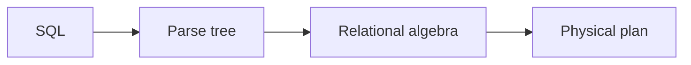

# Lecture Outlines — Build and Authoring Notes

This directory holds Marp slide decks for each class meeting (`dayN-topic/slides.md`)
and week-level overview files (`weekN-*.md`). Decks are uploaded to Canvas before
each class. They are not linked from the public website.

It is also a Node project: a custom Marp engine and a shared theme add the
runnable-SQL and incremental-reveal syntax described below.

## Build

`./build-slides.zsh` is the entry point. It installs the npm build libraries
(marp-cli and the markdown-it plugins) on the first run, then builds the decks:

```bash
./build-slides.zsh                 # every deck, HTML + PDF
./build-slides.zsh day10           # one deck (matches day10-sql-ddl-select)
./build-slides.zsh day6 day7       # several specific decks
./build-slides.zsh --html          # HTML only
./build-slides.zsh --pdf day20     # one deck, PDF only
```

The npm scripts do the same once `npm install` has run:

```bash
npm run build              # HTML + PDF for every deck
npm run build:html         # presentation HTML only
npm run build:pdf          # student PDF only
node build.mjs --only day10   # one deck
npm run watch              # serve every deck at localhost:8080 for previewing
npm run verify             # headless checks (needs: npx playwright install chromium)
```

Outputs are written next to each `slides.md` / `clicker.md` and are gitignored.

### One source, two targets

Each deck compiles to two different artifacts:

| | HTML build | PDF build |
| --- | --- | --- |
| Audience | Instructor, presenting in class | Students, via Canvas |
| `sql run` block | Live DuckDB widget | Static highlighted query |
| `::: appear` block | Click-through reveal | One page per reveal step |
| JavaScript | Runtime inlined | None |

The HTML deck must be served over http (`npm run watch`), not opened as a
`file://` URL: the SQL runner uses a Web Worker, which browsers block on
`file://`.

## Shared theme

Every deck sets `theme: cop5725` in its front matter and carries no inline
`style:` block. The theme is `themes/cop5725.css`. It defines the column
layouts (`.columns`, `.columns-3`, `.columns-left-wide`, `.columns-right-wide`,
`.rows`), the callout boxes (`.interactive`, `.error`, `.doc`, `.rule`,
`.quiz`, `.clicker`, and the ER tokens `.entity`, `.relationship`, `.weak`,
`.attr`, `.key`), and the SQL-runner and appear-animation styles.

Add a shared style once in `themes/cop5725.css` rather than per deck.

## Runnable SQL blocks

A fenced block tagged `sql run` becomes a live DuckDB-WASM widget in the HTML
build and a plain highlighted query in the PDF:

````markdown
```sql run
SELECT name, gpa FROM student ORDER BY gpa DESC;
```
````

Add `autorun` to execute the query once when the slide loads:

````markdown
```sql run autorun
SELECT 'ready' AS status;
```
````

Notes:

- DuckDB-WASM loads lazily from a CDN on the first Run, so decks without a
  runner pay no cost.
- One connection is shared across the whole deck. A `CREATE TABLE` on an early
  slide is visible to a query on a later slide.
- Multiple statements separated by `;` run together; the last result shows.
- Run with the button or `Ctrl`/`Cmd`+`Enter`.

A plain ` ```sql ` block (without `run`) stays a static code block.

## Incremental reveal

Wrap content in a `::: appear` container to reveal it on a click:

```markdown
Always-visible content.

::: appear
Appears on the next click.
:::

::: appear fade-up
Variants: fade-up, fade-down, slide-left, slide-right, scale-in.
:::
```

In the HTML build the arrow keys step through each appear block, then advance
to the next slide. In the PDF build a slide with K appear blocks expands into
K+1 pages, one per reveal step, so the handout mirrors the click-through.

PDF expansion handles top-level appear blocks. A nested appear reveals together
with its parent. Use `-` bullets inside an appear block.

## Multi-Column Layouts

```html
<div class="columns">
<div>

Left column markdown here.

</div>
<div>

Right column markdown here.

</div>
</div>
```

`.columns-3`, `.columns-left-wide`, `.columns-right-wide`, and `.rows` cover the
other splits.

## Mermaid Diagrams

Diagrams are authored as fenced `mermaid` blocks:

````markdown

````

Rendering these to SVG needs a Mermaid renderer wired into the build. That is
not yet in place, so a `mermaid` block currently shows as a code block. Track
this as a known gap before relying on diagrams in a built deck.

## Speaker Notes

Marp treats unprefixed HTML comments at the slide level as presenter notes:

```markdown
# Slide title

Visible content.

<!--
Speaker note: shown in presenter mode and PDF notes export, hidden from the
audience. Use it for context, timing, demo prompts, and links.
-->
```

Marp directives such as `<!-- _class: lead -->` start with an underscore. They
are not speaker notes.

## Math

Set `math: katex` in the front matter. Use `$inline$` and `$$display$$`.

## Clicker Check Slides — Separate File

Each lecture has two Marp decks in its directory:

```
lecture-outlines/dayN-topic/
├── slides.md       # student-facing, distributable BEFORE class
└── clicker.md      # instructor-only, interleave DURING class
```

The instructor sends `slides.md` to students before class for pre-reading.
The clicker Q&A would spoil the comprehension checks if students saw them in
advance, so the `clicker.md` deck is projected during class only.

Each clicker is a question slide followed by an answer slide:

```markdown
---

# 📊 Clicker Check

Given F = {A → B, B → C, BC → D}, what is {A}⁺?

A. {A}
B. {A, B}
C. {A, B, C}
D. {A, B, C, D}

<!--
Allow ~45 seconds. Students who get this wrong usually stop at C and forget
BC → D fires once both B and C are in the closure. Reveal the answer next.
-->

---

# Clicker Check — Answer

**D. {A, B, C, D}**

A → B adds B. B → C adds C. BC → D fires once both B and C are present.

The common wrong answer is C: students forget the BC → D step.
```

Grading is on participation, not correctness. The `clicker.md` file is
maintained by `/tmp/extract_clickers.py` if you need to move pairs back and
forth from `slides.md`.

## Project Layout

```
build-slides.zsh   entry point: installs dependencies, then builds decks
marp.config.js     marp-cli config: registers the engine and theme
engine.js          custom engine: wires the plugins, inlines the runtime (HTML)
build.mjs          builds every deck, expands appear blocks for PDF
lib/
  plugin-sql-run.mjs    ```sql run``` -> widget (HTML) / code (PDF)
  plugin-appear.mjs     ::: appear ::: -> fragment markup
  expand-fragments.mjs  PDF: one page per appear step
themes/cop5725.css      shared theme
runtime/slide-runtime.js  DuckDB runner, inlined into HTML builds
spike/             standalone DuckDB spike and headless verification checks
```
