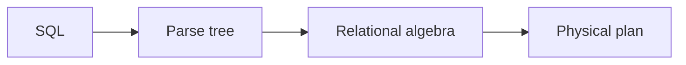

# Lecture Outlines — Build and Convention Notes

This directory holds marp slide decks for each class meeting (`dayN-topic/slides.md`) and week-level overview files (`weekN-*.md`).
Slides are uploaded to Canvas before each class. They are not linked from the public website.

## Build

The decks render with [Marp CLI](https://github.com/marp-team/marp-cli):

```bash
# HTML (mermaid renders at view time)
npx @marp-team/marp-cli@latest --html slides.md -o slides.html

# PDF (mermaid pre-renders via Chromium)
npx @marp-team/marp-cli@latest --html --pdf slides.md -o slides.pdf
```

The `--html` flag is required for the mermaid `<script>` tag and the multi-column `<div class="columns">` blocks to render.

## Conventions Used Across All Decks

### Multi-Column Layouts

Two-column:

```html
<div class="columns">
<div>

Left column markdown here.

</div>
<div>

Right column markdown here.

</div>
</div>
```

The shared style block defines `.columns`, `.columns-3`, `.columns-left-wide`, `.columns-right-wide`, and `.rows` for two-cell vertical splits.

### Mermaid Diagrams

Use fenced code blocks with the `mermaid` language tag:

````markdown

````

Mermaid scripts are loaded from a CDN in the deck's HTML head when `--html` is passed.

### Speaker Notes

Marp treats unprefixed HTML comments at the slide level as presenter notes:

```markdown
# Slide title

Visible content.

<!--
Speaker note: this appears in presenter mode and PDF notes export
but is hidden from the audience. Use it for context, timing,
demo prompts, and links you do not want on the slide.
-->
```

Marp directives like `<!-- _class: lead -->` start with an underscore — they are not speaker notes.

### Math

Set `math: katex` in the front matter. Use `$inline$` and `$$display$$`.

### Clicker Check Slides — Separate File

Each lecture has **two marp decks** in its directory:

```
lecture-outlines/dayN-topic/
├── slides.md       # student-facing, distributable BEFORE class
└── clicker.md      # instructor-only, interleave DURING class
```

**Why two files:** the instructor sends `slides.md` to students before class for pre-reading. The clicker Q&A would spoil the comprehension checks if students saw them in advance. The `clicker.md` deck is projected during class only.

**Format inside `clicker.md`** — each clicker is a question slide + answer slide pair:

```markdown
---

# 📊 Clicker Check

Given F = {A → B, B → C, BC → D}, what is {A}⁺?

A. {A}
B. {A, B}
C. {A, B, C}
D. {A, B, C, D}

<!--
Allow ~45 seconds. Most students who get this wrong stop at C — they forget
BC → D fires once both B and C are in the closure. Reveal answer next slide.
-->

---

# Clicker Check — Answer

**D. {A, B, C, D}**

A → B adds B. B → C adds C. BC → D fires once both B and C are present.

The common wrong answer is C: students forget the BC → D step.
```

Grading is on participation, not correctness. The clicker.md file is generated/maintained by `/tmp/extract_clickers.py` if you need to move pairs back and forth from slides.md.

**Build command for each file:**

```bash
npx @marp-team/marp-cli@latest --html slides.md -o slides.html      # for Canvas
npx @marp-team/marp-cli@latest --html clicker.md -o clicker.html    # instructor copy
```
