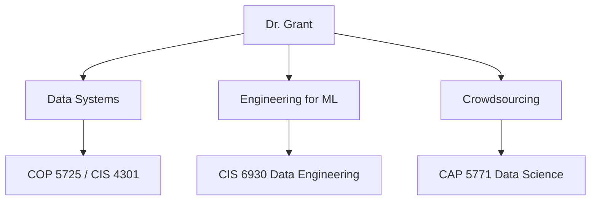
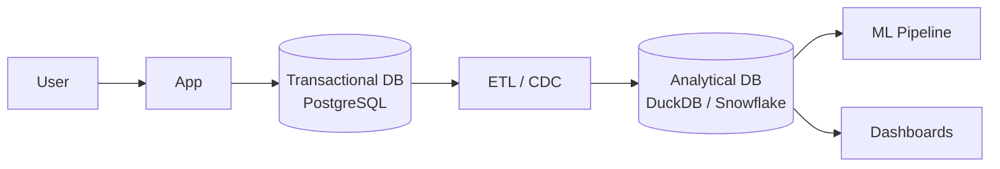
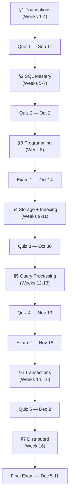
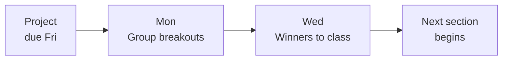
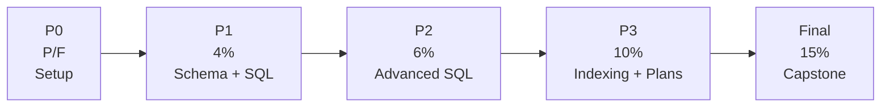
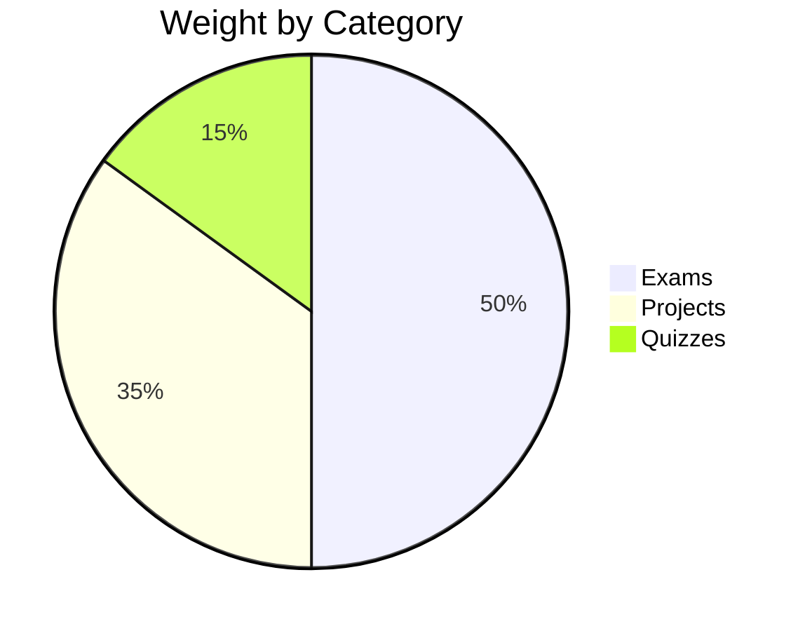
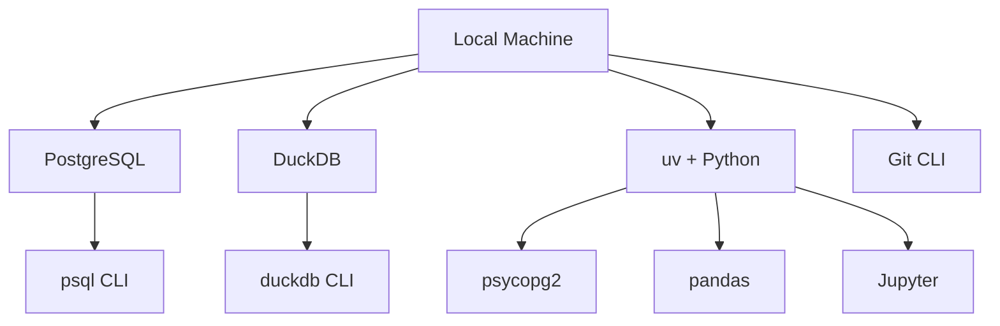
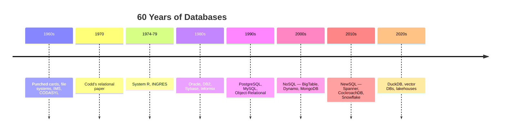

<!-- _class: lead -->

# Day 1: Course Introduction

**COP 5725 - Database Management Systems**
Friday, August 21, 2026

Dr. Christan Grant
University of Florida, CISE

<!--
First class of the term. Goals: surface who they are, give the shape of the semester, get the software started, leave them excited to come back Monday. No graded work this week — say that aloud at the top.
Total time 50 min. Take a few minutes longer at the end if needed for Q&A.
-->

---

# Today's Hour

1. Who is teaching this and what they care about
2. Why a database course in 2026
3. The shape of the semester
4. Grading, expectations, integrity
5. Software preview and what to do before Monday

> There is no graded work this week.

<!--
Repeat the "no graded work" point. Students arriving from heavy first-week courses will visibly relax. The pace this week is intentionally low so that Project 0 (a setup task) lands without panic.
-->

---

<!-- _class: lead -->

# Part 1: Introductions

---

# About the Instructor

<div class="columns-left-wide">
<div>

Dr. Christan Grant — Associate Professor, CISE

**Research interests:**
- Data systems and information extraction
- Data engineering for AI/ML
- Crowdsourcing and human-in-the-loop systems

**Contact:** `christan@ufl.edu`
Subject line **must** include `cop5725fa26`.

**Office hours:** by appointment — booking link in the syllabus.

**Course site:** [ufdatastudio.com/cop5725fa26](https://ufdatastudio.com/cop5725fa26)

</div>
<div>



</div>
</div>

<!--
Brief on past teaching: CIS 6930 last spring (data engineering with LLMs) is the most similar course. Mention research interests briefly — students who care about data systems should know my lab exists.
-->

---

# About You

Take 90 seconds — share with the person next to you:

1. Your name and program
2. The most database-ish thing you have built so far
3. One question you want answered before December

> We will not collect these. The point is to surface what we know and what we want.

<!--
Time this strictly: 90 seconds total. Walk the room while they talk. After 90 seconds, ask one or two pairs to share their #3 — those questions often reveal the course's biggest motivators (and sometimes things outside scope, which I should redirect early).
-->

---

<!-- _class: lead -->

# Part 2: Why a Database Course

---

# The Quiet Backbone

<div class="columns">
<div>

Almost every system you will build holds data in motion and at rest.

- A web service routes user actions through a transactional store
- A model pipeline reads features from a warehouse and writes back predictions
- A spreadsheet, a Jupyter cell, a logs dashboard — all do the same thing at different sizes

A database systems course teaches you to see the machinery.

</div>
<div>



</div>
</div>

<!--
The diagram is the punchline: every modern system runs on at least two databases that look almost nothing alike. Half the course is "what are they?" and the other half is "why are they different?"
-->

---

# Two Engines, One Semester

We will use two open-source engines that bracket the design space.

<div class="columns">
<div>

### PostgreSQL 16

- **Workload:** Transactional (OLTP)
- **Layout:** Row-oriented
- **Shines at:** concurrent writes, ACID, ecosystem
- **History:** 1986 Berkeley project, evolved continuously

</div>
<div>

### DuckDB

- **Workload:** Analytical (OLAP)
- **Layout:** Column-oriented
- **Shines at:** single-node analytics, vectorized scans, Parquet integration
- **History:** 2019, CWI Amsterdam

</div>
</div>

Both speak SQL. Both ship as easy local installs. The difference between them is most of what this course teaches.

<!--
Stress that "speak the same language" is precisely Codd's separation of logical from physical. Same SQL surface, completely different machinery underneath.
-->

---

# Reading Execution Plans

A working database engineer reads a query plan the way a systems engineer reads `strace` output.

```sql
EXPLAIN ANALYZE
SELECT department, AVG(salary)
FROM employees
WHERE hire_date > '2020-01-01'
GROUP BY department;
```

By Week 13 you will know what each line of the resulting plan means, why it was chosen, and how to make it faster.

<!--
Show a real EXPLAIN ANALYZE output on the projector if time. Three lines about Seq Scan, Hash Aggregate, and time costs are enough to plant the idea that "what runs" is not "what you wrote."
-->

---

<!-- _class: lead -->

# Part 3: The Semester

---

# Seven Sections, Five Quizzes, Three Exams



<!--
Walk the diagram once. The key idea: every quiz closes a section so you know what is on it (and what is not). Two exams + a final spread the load.
-->

---

# The Calendar at a Glance

<div class="columns">
<div>

**Class days you should not miss:**
- Today (Fri Aug 21)
- Quiz Fridays: Sep 11, Oct 2, Oct 30, Nov 13
- Exam Wednesdays: Oct 14, Nov 18
- Final: scheduled in Dec 5-11

</div>
<div>

**No class:**
- Sep 7 (Labor Day)
- Oct 9-10 (Homecoming)
- Nov 11 (Veterans Day)
- Nov 23-28 (Thanksgiving)
- Dec 3-4 (Reading days)

</div>
</div>

A complete day-by-day schedule lives at [ufdatastudio.com/cop5725fa26/schedule](https://ufdatastudio.com/cop5725fa26/schedule).

<!--
Point out that the Homecoming closure (Oct 9-10) sometimes catches students off guard. Friday classes that week do not meet.
-->

---

# Rhythms You Will Feel

<div class="columns">
<div>

**Friday is quiz day** at the end of each section.

**Friday is also project due day.**

**Monday after a project deadline:** small-group presentations.

**Wednesday after presentations:** each group's winner presents to the whole class.

One paper reading sits between projects, anchored to the section it closes.

</div>
<div>



</div>
</div>

<!--
The 30-min group breakout slot eats into Monday's lecture. Plan to compress Monday content slightly during project weeks. Wednesday is shorter — 15 min for winners + Q&A, then normal lecture.
-->

---

# Projects: Individual, Peer-Graded, Progressive



| Project | Due | Topic |
|---------|-----|-------|
| 0 | Sep 4 | Environment setup |
| 1 | Sep 25 | Schema + SQL |
| 2 | Oct 23 | Advanced SQL |
| 3 | Nov 13 | Indexing + plans |
| Final | Dec 9 | Capstone |

<!--
The progressive weighting is deliberate: Project 1 is low-stakes so a student stumbling on git or psycopg doesn't kill their grade. Final is the largest single component because students who reach the capstone have invested significantly.
-->

---

<!-- _class: lead -->

# Part 4: Grading and Expectations

---

# Grade Breakdown

<div class="columns">
<div>

| Component | Weight |
|-----------|--------|
| Quizzes (5, drop lowest) | 15% |
| Project 1 | 4% |
| Project 2 | 6% |
| Project 3 | 10% |
| Final Project | 15% |
| Exam 1 (Oct 14) | 15% |
| Exam 2 (Nov 18) | 15% |
| Final Exam | 20% |

</div>
<div>



Exams: 50%
Projects: 35%
Quizzes: 15%

</div>
</div>

<!--
Highlight: half your grade is exams. That's a contrast with last spring's data engineering course where the project was 70%. Different course, different goals — here we are anchored in well-defined material and exams test it cleanly.
-->

---

# Late Policy

<div class="columns">
<div>

### The Rule

- Submit on time
- After the deadline, you may submit until grading begins
- The start of grading is **not** announced
- After grading begins, late submissions are not accepted

</div>
<div>

### The Exception

Real hardships bend the rule: illness, family emergency, hurricane.

Talk to me with documentation. The policy bends; it does not break.

</div>
</div>

<!--
The "unannounced grading start" is intentional. It makes the late submission window real but discourages strategic lateness. In practice, grading starts 1-3 days after the deadline.
-->

---

# Academic Integrity (Quick Pass)

<div class="columns">
<div>

### Yes, violation

- Two students typing identical SQL together
- Sharing a draft for "review and suggestions"
- Using AI without declaring it
- Publishing solutions to GitHub or a tutoring service

</div>
<div>

### No, fine

- Writing independently, comparing answers, then revising
- Showing a textbook example
- Suggesting a debugging strategy
- Using a public Internet page to understand a concept

</div>
</div>

The syllabus has the long version with examples. Read it.

<!--
The AI clause is unambiguous: declare every prompt and include it with submission. I will not run a tool that detects undeclared AI; the honor system applies. Violations get reported the same way other integrity issues do.
-->

---

<!-- _class: lead -->

# Part 5: Software and Setup

---

# What You Need to Install

<div class="columns">
<div>

| Tool | Why |
|------|-----|
| **PostgreSQL 16+** | Transactional engine |
| **DuckDB** | Analytical engine |
| **Python 3.11+ via uv** | Glue + visualization |
| **Git/GitHub** | Submission |

</div>
<div>



</div>
</div>

Project 0 walks through all of this. Due **Friday, Sep 4**.

---

# A 30-Second Tour

```bash
# PostgreSQL — your transactional sandbox
psql postgres
> SELECT version();

# DuckDB — your analytical sandbox
duckdb
D SELECT * FROM 'https://duckdb.org/data/flights.csv' LIMIT 5;

# Python + DuckDB — one-liner data exploration
uv run --with duckdb python -c "import duckdb; print(duckdb.sql('SELECT 42'))"
```

If these three lines run for you by next Friday, Project 0 is yours.

<!--
Do this live if the projector cooperates. The DuckDB one-liner over an HTTP CSV is the demo students remember — "wait, it just reads a remote CSV like a table?"
-->

---

<!-- _class: lead -->

# Part 6: What Monday Looks Like

---

# Monday: Database History



The arc matters: data model fights repeat. Knowing what was tried and dropped saves you from re-trying it.

<!--
The timeline diagram is the centerpiece of Monday's lecture. Showing it here, on day one, primes them. By Monday they will not be surprised that we spend a whole hour walking the timeline.
-->

---

# Before Monday

1. Clone the course repo (link on Canvas)
2. Read the syllabus
3. Start Project 0 — no rush, due Sep 4

> There is no graded work this week.

<!--
Repeat the no-grading point one more time. The first-week stress reduction is genuine: students who feel pressure to "get ahead" can use this week for setup pain. Project 0 surfacing weird Python/Postgres install issues is the goal of week 1.
-->

---

# Questions

What is on your mind?

The instructor and TAs are here for the rest of the hour.

<!--
Common first-day questions to expect: prerequisites (the syllabus is explicit), AI tool policy (yes, declared, with prompts), can projects be done in pairs (no, explicitly individual; peer review serves the discussion need), how hard is this compared to {last year's instructor / CIS 4301 / their friend's course at another school} — be honest, this is graduate level.
-->
