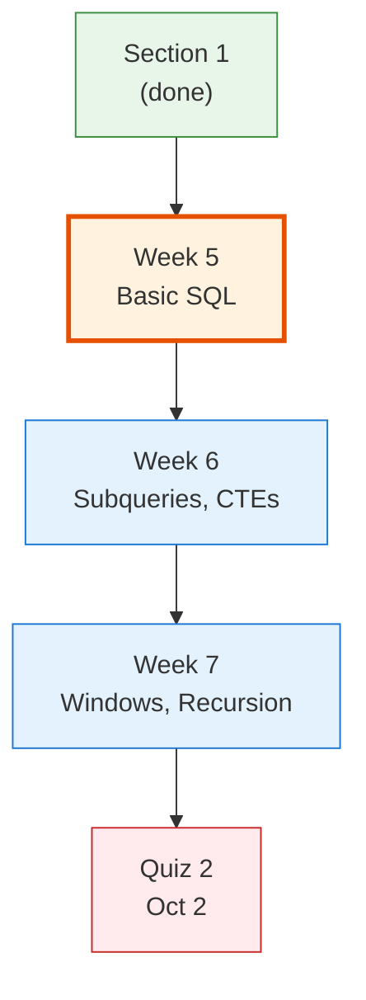
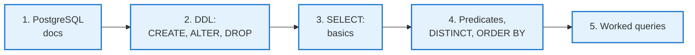
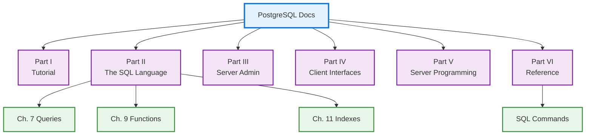

<!-- _class: lead -->

# Day 10: SQL DDL and Basic SELECT

**COP 5725 - Database Management**
Monday, September 14, 2026

Section 2 opens — the working SQL surface

<!--
First class of Section 2. Section 1 is graded, Quiz 1 results are back. Open by acknowledging the transition and previewing the section's payoff: by the end of three weeks, students will write SQL most working engineers cannot match.
Pace: 50 min. Spend the first 8 minutes on the doc-reading section even though it feels like overhead — it pays off through the whole semester.
-->

---

# Where We Are

<div class="columns-left-wide">
<div>

Section 1 gave you the **why** of relational systems.
Section 2 gives you the **how**.

The vehicle is SQL.
Three weeks, nine meetings, one quiz.
By Friday Oct 2 you will write window functions, CTEs, and recursive queries that take other engineers a year to learn.

Today: the surface area every working SQL user has — DDL, single-table SELECT, predicates, ordering.

</div>
<div>



</div>
</div>

---

# Today's Roadmap



The first stop is the documentation itself. Doc literacy compounds.

---

<!-- _class: lead -->

# Part 1: The PostgreSQL Documentation

---

# One Authoritative Reference

<div class="columns">
<div>

There is no single SQL.

| Year | Standard | What changed |
|------|----------|--------------|
| 1986 | SQL-86 | first ANSI standard |
| 1992 | SQL-92 | outer joins, CHECK |
| 1999 | SQL:1999 | recursion, OLAP, triggers |
| 2003 | SQL:2003 | window functions, XML |
| 2016 | SQL:2016 | row pattern matching, JSON |
| 2023 | SQL:2023 | property graph queries |

Every engine implements a different subset.

</div>
<div>

> We anchor on the **PostgreSQL 16 documentation** as the authoritative reference for this course.

Two reasons:
- PostgreSQL has the most thorough, accessible docs of any production engine
- You will run against PostgreSQL for projects, so you can verify everything

[postgresql.org/docs/current](https://www.postgresql.org/docs/current/)

</div>
</div>

<!--
This framing matters: students often hold an implicit "SQL is one thing" model from intro classes. Surfacing the version history once now prevents months of "but the docs I read said..." confusion when they bump into Oracle or MySQL syntax later.
-->

---

# The Structure of the Docs



<!--
Most undergrad students never venture past Part I (the tutorial). Section 2 will live in Part II (Ch. 7) and Part VI (SQL Commands). Part III through V is server administration and extension; useful but outside our scope.
-->

---

# Reading SQL Syntax Notation

The Reference section uses a consistent notation:

```
SELECT [ ALL | DISTINCT [ ON ( expression [, ...] ) ] ]
    [ * | expression [ [ AS ] output_name ] [, ...] ]
    [ FROM from_item [, ...] ]
    [ WHERE condition ]
    [ GROUP BY ... ]
    [ HAVING condition ]
    [ ORDER BY expression [ ASC | DESC ] [, ...] ]
    [ LIMIT { count | ALL } ]
```

<div class="columns-3">
<div>

### `[ ... ]`
Optional. Brackets do not appear in the actual SQL.

</div>
<div>

### `|`
Choose one of the alternatives.

</div>
<div>

### `[, ...]`
The preceding element may repeat, separated by commas.

</div>
</div>

<!--
This BNF-like notation is universal in DB documentation. Once you can read it, every command page tells you everything in 10 seconds. The brackets-are-optional rule is the most-missed piece for new readers.
-->

---

# A Worked Doc Read

<div class="doc">

**Task:** "Look up how to limit the number of rows returned by a SELECT."

**Steps:**

1. Open the docs at [postgresql.org/docs/current/sql-select.html](https://www.postgresql.org/docs/current/sql-select.html)
2. Search the page for `LIMIT`
3. Read the synopsis line: `[ LIMIT { count | ALL } ]`
4. Skip to the LIMIT section for prose

</div>

You now know:
- LIMIT is optional (brackets)
- It takes either a count or the word ALL
- The semantics are described below

The whole exercise takes 90 seconds. Treat it as the first reflex when you forget syntax.

<!--
Do this live on the projector. The "I'll grep the SQL command page" reflex is the most useful habit a SQL writer develops; build it in students by demonstrating it now.
-->

---

<!-- _class: lead -->

# Part 2: DDL — CREATE, ALTER, DROP

---

# CREATE TABLE Recap

```sql
CREATE TABLE student (
  sid   bigint        PRIMARY KEY,
  name  text          NOT NULL,
  gpa   numeric(3, 2) CHECK (gpa BETWEEN 0 AND 4.0),
  dname text          REFERENCES department(dname)
);
```

We met this on Day 7. The PostgreSQL reference for the full syntax is at [postgresql.org/docs/current/sql-createtable.html](https://www.postgresql.org/docs/current/sql-createtable.html).

A few features the synopsis surfaces:

- `IF NOT EXISTS` — idempotent creation
- `TEMPORARY` and `UNLOGGED` — non-durable variants
- `PARTITION OF` — declarative partitioning (Section 4 preview)
- `INHERITS` — PostgreSQL extension for table inheritance

---

# Constraint Forms

```sql
-- Column-level constraints
CREATE TABLE example (
  id      bigint PRIMARY KEY,
  email   text   NOT NULL UNIQUE,
  age     int    CHECK (age >= 0),
  dname   text   REFERENCES department(dname) ON DELETE SET NULL
);

-- Named table-level constraints
CREATE TABLE enrollment (
  sid bigint REFERENCES student(sid),
  cid text   REFERENCES course(cid),
  CONSTRAINT enrollment_pkey PRIMARY KEY (sid, cid),
  CONSTRAINT valid_grade CHECK (grade IS NULL OR grade IN ('A','B','C','D','F'))
);
```

<div class="columns">
<div>

### When to name
Named constraints produce readable error messages and survive `ALTER TABLE` cleanly.

</div>
<div>

### When to use ON DELETE
Pick the referential action that matches reality: `CASCADE`, `SET NULL`, `RESTRICT`, `NO ACTION`.

</div>
</div>

Reference: [postgresql.org/docs/current/ddl-constraints.html](https://www.postgresql.org/docs/current/ddl-constraints.html).

---

# ALTER TABLE: Schema Evolution

```sql
ALTER TABLE student ADD COLUMN graduation_year int;
ALTER TABLE student DROP COLUMN gpa;
ALTER TABLE student ALTER COLUMN name SET NOT NULL;
ALTER TABLE student RENAME COLUMN name TO full_name;
ALTER TABLE student ADD CONSTRAINT gpa_valid CHECK (gpa BETWEEN 0 AND 4.0);
```

<div class="error">

**Production warning:** Each `ALTER TABLE` may rewrite the table or take an exclusive lock. Read [postgresql.org/docs/current/sql-altertable.html](https://www.postgresql.org/docs/current/sql-altertable.html) carefully before running on a live system.

</div>

Most of Project 1 is `CREATE`. Live systems are mostly `ALTER`. The difference in stakes is real.

<!--
The "ALTER TABLE is dangerous on production" warning is worth landing now even though Project 1 is greenfield. Later in their careers students will encounter migration tools (Flyway, Alembic, Postgres pg_repack) that exist exactly to mitigate this issue.
-->

---

# DROP TABLE vs TRUNCATE

<div class="columns">
<div>

### DROP TABLE

```sql
DROP TABLE student;
DROP TABLE IF EXISTS student CASCADE;
```

Removes the table and its data.
`CASCADE` removes dependent objects (views, FKs).

</div>
<div>

### TRUNCATE

```sql
TRUNCATE student;
TRUNCATE student RESTART IDENTITY;
TRUNCATE student CASCADE;
```

Removes **all rows**, keeps the table.
Faster than `DELETE` because it skips per-row WAL.

</div>
</div>

`TRUNCATE` is a Postgres extension to standard SQL with its own semantics around triggers and FKs. Reference: [postgresql.org/docs/current/sql-truncate.html](https://www.postgresql.org/docs/current/sql-truncate.html).

<!--
DELETE FROM table can take an hour on a billion-row table; TRUNCATE on the same table runs in milliseconds. The difference is huge once datasets get nontrivial.
-->

---

<!-- _class: lead -->

# Part 3: Single-Table SELECT

---

# The Six Clauses You Use Every Day

```sql
SELECT  column_or_expression, ...
FROM    table
WHERE   row_predicate
ORDER BY column [ASC|DESC], ...
LIMIT   count
OFFSET  count;
```

Order of writing ≠ order of evaluation. (We see the difference on Day 12.)

Reference: [postgresql.org/docs/current/sql-select.html](https://www.postgresql.org/docs/current/sql-select.html).

<!--
Don't drill on order-of-eval yet — it's a Day 12 topic. Today is about understanding what each clause does in isolation. Reserve the trick "WHERE filters before SELECT, so SELECT aliases can't appear in WHERE" for Friday.
-->

---

# SELECT List

```sql
-- All columns
SELECT * FROM student;

-- Explicit projection
SELECT sid, name FROM student;

-- Computed columns
SELECT name, gpa * 25 AS percent FROM student;

-- Column aliases
SELECT name AS full_name FROM student;
```

`SELECT *` is convenient for exploration but discouraged in production code — column order changes silently when the schema evolves.

---

# WHERE Predicates

<div class="columns">
<div>

```sql
WHERE gpa >= 3.5
WHERE gpa BETWEEN 3.0 AND 4.0
WHERE name LIKE 'A%'
WHERE name ILIKE '%lovelace%'
WHERE name SIMILAR TO 'A%(da|lan)'
WHERE major IN ('CS', 'EE')
WHERE grade IS NULL
WHERE gpa IS NOT NULL AND gpa < 2.0
```

</div>
<div>

### PostgreSQL specifics

- `ILIKE` — case-insensitive `LIKE`
- `SIMILAR TO` — POSIX-style regex (rarely used)
- `~` and `~*` — full regex match
- `IS DISTINCT FROM` — NULL-safe comparison

Reference: [postgresql.org/docs/current/functions-matching.html](https://www.postgresql.org/docs/current/functions-matching.html).

</div>
</div>

---

# NULL in WHERE: The Trap, Again

```sql
SELECT count(*) FROM enrollment;                       -- 100
SELECT count(*) FROM enrollment WHERE grade = 'A';     -- 10
SELECT count(*) FROM enrollment WHERE grade <> 'A';    -- 30
-- 60 rows with grade IS NULL match neither.
```

<div class="columns">
<div>

### To match "anything that isn't A, including in-progress"

```sql
WHERE grade IS DISTINCT FROM 'A';
```

PostgreSQL's NULL-safe inequality. Treats NULL as a distinct value.

</div>
<div>

### To match "anything not A, ignoring in-progress"

```sql
WHERE grade <> 'A' AND grade IS NOT NULL;
```

Explicit NULL handling.

</div>
</div>

`IS DISTINCT FROM` is PostgreSQL-friendly shorthand. Use it whenever you want NULL to behave like any other value in a comparison.

<!--
This is one of the most useful PostgreSQL features for new SQL writers. The SQL standard added IS DISTINCT FROM in SQL:1999 but many engines don't implement it. PostgreSQL does. Worth the 30 seconds of class time.
-->

---

# DISTINCT, ORDER BY, LIMIT

```sql
-- Unique majors
SELECT DISTINCT major FROM student;

-- Top 5 by GPA
SELECT name, gpa FROM student
ORDER BY gpa DESC
LIMIT 5;

-- Pagination
SELECT name FROM student
ORDER BY sid
LIMIT 20 OFFSET 40;
```

<div class="interactive">

**Your turn:** What is wrong with this query for "second page of 20 students alphabetically"?

```sql
SELECT name FROM student LIMIT 20 OFFSET 20;
```

</div>

<!--
Answer: no ORDER BY means the "second page" depends on the row order the executor chose, which can change with each run. Pagination without ORDER BY is meaningless; it's one of the most common production bugs.
-->

---

# Worked Query 1: Top GPA in CS

> "List the top 3 CS-major students by GPA, name and GPA only."

```sql
SELECT name, gpa
FROM   student
WHERE  major = 'CS'
ORDER BY gpa DESC
LIMIT  3;
```

Mechanical mapping from English to SQL.

---

# Worked Query 2: Active Enrollments

> "Find all sections of COP5725 in any term where at least one student is still enrolled (grade is NULL)."

```sql
SELECT DISTINCT term, section_num
FROM   enrollment
WHERE  cid = 'COP5725'
  AND  grade IS NULL
ORDER BY term, section_num;
```

`DISTINCT` collapses multiple enrolled students into one (term, section_num) row.

---

# Worked Query 3: Recent Hires

> "List faculty hired in the past five years, by name, salary descending."

```sql
SELECT name, salary, hire_date
FROM   faculty
WHERE  hire_date > current_date - interval '5 years'
ORDER BY salary DESC;
```

`current_date` and `interval` are PostgreSQL date arithmetic. Reference: [postgresql.org/docs/current/functions-datetime.html](https://www.postgresql.org/docs/current/functions-datetime.html).

---

# Common Errors

<div class="columns">
<div>

<div class="error">

### Forgetting quotes

```sql
WHERE major = CS         -- error: column CS does not exist
WHERE major = 'CS'       -- ok
```

PostgreSQL uses single quotes for strings, double quotes for identifiers.

</div>

</div>
<div>

<div class="error">

### Counting NULLs

```sql
SELECT count(grade) FROM enrollment;   -- ignores NULL
SELECT count(*)     FROM enrollment;   -- counts all rows
```

`count(col)` skips NULLs. `count(*)` does not.

</div>

</div>
</div>

<div class="error">

### Aliases in WHERE

```sql
SELECT name, gpa * 25 AS percent FROM student WHERE percent > 75;
-- error: column percent does not exist
```

`WHERE` runs before `SELECT`. We see why on Day 12.

</div>

---

# Wrap-up

You now have:

<div class="columns">
<div>

- The PostgreSQL docs as a working reference (Ch. 5, Ch. 7, SQL Commands)
- DDL: CREATE, ALTER, DROP, TRUNCATE
- The six clauses of single-table SELECT

</div>
<div>

- Predicate building blocks: comparison, LIKE, IN, IS NULL, IS DISTINCT FROM
- DISTINCT, ORDER BY, LIMIT, OFFSET
- The NULL trap one more time

</div>
</div>

---

# Wednesday: Joins

We connect tables.

By the end of Wednesday you will pick the right join kind (inner, outer, semi, anti, cross, self, lateral) for any stated question.

Read PostgreSQL docs Ch. 7.2 before class.

---

# Practice Before Wednesday

Five queries to run against the university schema in your repo:

1. Find all departments whose name contains 'Computer'.
2. Find the most expensive faculty member.
3. Count distinct majors.
4. List students with GPA strictly between 3.0 and 3.9, sorted by name.
5. Page 3 of student names alphabetically, 10 per page.

Answers due in your repo before 8:30 AM Wed Sep 16.

---

# Questions

What is on your mind?

Project 1 work continues. Due Fri Sep 25.

<!--
Common Day 10 questions: "Should I use TEXT or VARCHAR?" (TEXT in PostgreSQL — there's no practical difference, but TEXT signals "no arbitrary length limit" which is usually what you mean). "Should I use SERIAL or BIGSERIAL?" (BIGSERIAL or, in modern PG, GENERATED ALWAYS AS IDENTITY — covered in Day 3 follow-ups). "Do I need to know the exact PostgreSQL version?" (16 is the course version; PostgreSQL 17 was released in late 2024 and is also fine — features are stable across versions).
-->
