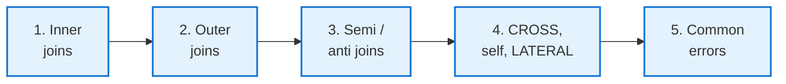
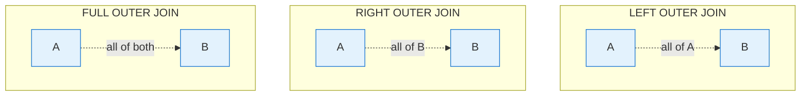

<!-- _class: lead -->

# Day 11: SQL Joins

**COP 5725 - Database Management Systems**
Wednesday, September 16, 2026

Inner, outer, semi, anti, cross, self, lateral — and when each is the right call

<!--
Joins are the most-asked-about SQL feature in interviews and the second-most-misused (after NULLs). Spend the time. Pace: 50 min, with 10 min reserved for the common-errors and interactive section at the end.
-->

---

# Where We Are

Monday: one table.
Today: two or more tables.
Friday: many rows grouped to fewer.

Reference for everything in this lecture: PostgreSQL docs [Ch. 7.2 Table Expressions](https://www.postgresql.org/docs/current/queries-table-expressions.html).

---

# Today's Roadmap



---

<!-- _class: lead -->

# Part 1: Inner Joins

---

# Two Syntaxes, One Meaning

<div class="columns">
<div>

### Comma syntax (legacy)

```sql
SELECT s.name, e.cid
FROM   student s, enrollment e
WHERE  s.sid = e.sid;
```

Implicit cross product + filter. Works, but easy to forget the predicate.

</div>
<div>

### Explicit JOIN (preferred)

```sql
SELECT s.name, e.cid
FROM   student s
JOIN   enrollment e ON s.sid = e.sid;
```

Predicate sits next to the table it connects. Easier to read at scale.

</div>
</div>

Both produce identical plans in PostgreSQL. Use the second form.

<!--
The comma form is what most introductory SQL courses teach because it's older. The JOIN ON form is what real codebases use because it scales to 10-table queries. By the end of Section 2, students should default to JOIN ON.
-->

---

# ON vs USING

```sql
-- ON: any predicate
SELECT * FROM enrollment e JOIN student s ON e.sid = s.sid;

-- USING: shared column name only
SELECT * FROM enrollment e JOIN student s USING (sid);
```

<div class="columns">
<div>

### USING

- The two `sid` columns merge into one in the output
- Cleaner when the column has the same name

</div>
<div>

### ON

- Both columns appear separately
- Works with any predicate (`<`, `BETWEEN`, computed expressions)

</div>
</div>

Reference: [PostgreSQL Ch. 7.2.1.1 Joined Tables](https://www.postgresql.org/docs/current/queries-table-expressions.html#QUERIES-FROM).

---

# NATURAL JOIN

```sql
SELECT * FROM enrollment NATURAL JOIN student;
```

Joins on **every** column that shares a name. The convenience is the danger.

<div class="error">

**Hidden bug:** add a `created_at` timestamp to both tables and your join silently changes.
The query now only matches rows with identical `created_at` values too.

</div>

PostgreSQL supports `NATURAL JOIN`. The course position: never use it.

<!--
This is the "natural join footgun" we promised on Day 5. Worth emphasizing because a few real production outages have come from a column rename or addition that broke a natural join.
-->

---

# Multi-Way Joins

> "List every student with their department, including the department building."

```sql
SELECT s.name, d.dname, d.building
FROM   student s
JOIN   department d ON s.dname = d.dname;
```

> "List every student, their enrollments, and the title of each course."

```sql
SELECT s.name, c.title
FROM   student s
JOIN   enrollment e ON e.sid = s.sid
JOIN   section sec  ON e.cid = sec.cid
                   AND e.section_num = sec.section_num
                   AND e.term = sec.term
JOIN   course c     ON c.cid = sec.cid
ORDER BY s.name, c.title;
```

Multi-way joins read top-down. The order of the JOIN clauses does not affect correctness; PostgreSQL's optimizer picks the execution order based on statistics.

---

<!-- _class: lead -->

# Part 2: Outer Joins

---

# The Three Outer Joins



When a row from the kept side has no match, missing columns become NULL.

`LEFT OUTER JOIN` is by far the most common in practice. `RIGHT` is the same idea with sides swapped; `FULL` is rare but useful for set-comparison reports.

---

# LEFT JOIN: Find Students Who Have Not Enrolled

```sql
SELECT s.sid, s.name
FROM   student s
LEFT JOIN enrollment e ON e.sid = s.sid
WHERE  e.sid IS NULL;
```

Step through:

1. `LEFT JOIN` keeps every student row even with no enrollment.
2. `e.sid IS NULL` filters to *only* the students with no match.

This is the canonical "find what is missing" pattern.

<!--
Students sometimes write this as NOT EXISTS instead, which is equivalent and often clearer. Both forms are correct; the optimizer treats them similarly. Cover NOT EXISTS in Part 3.
-->

---

# FULL OUTER JOIN: Set Comparison

> "Compare two enrollment snapshots — find rows that differ."

```sql
SELECT
  COALESCE(o.sid, n.sid)         AS sid,
  COALESCE(o.cid, n.cid)         AS cid,
  o.grade                        AS old_grade,
  n.grade                        AS new_grade
FROM   enrollment_old o
FULL OUTER JOIN enrollment_new n
       ON o.sid = n.sid AND o.cid = n.cid
WHERE  o.grade IS DISTINCT FROM n.grade;
```

The two NULLable sides plus `COALESCE` plus `IS DISTINCT FROM` give us a row-by-row diff.

---

# The Outer Join WHERE Trap

```sql
-- intended: students and their enrollments, including unenrolled
SELECT s.name, e.cid
FROM   student s
LEFT JOIN enrollment e ON e.sid = s.sid
WHERE  e.cid = 'COP5725';
```

<div class="error">

**What goes wrong:** `WHERE e.cid = 'COP5725'` filters out the NULL rows from unenrolled students. The query degrades to an inner join.

</div>

```sql
-- correct: predicate inside the ON
SELECT s.name, e.cid
FROM   student s
LEFT JOIN enrollment e
       ON e.sid = s.sid AND e.cid = 'COP5725';
```

A predicate on the **right side** of a `LEFT JOIN` belongs in the `ON` clause.

<!--
This is the single most common SQL bug among intermediate writers. The fix is the rule: "predicates on the kept side go in WHERE; predicates on the optional side go in ON." Drill it.
-->

---

<!-- _class: lead -->

# Part 3: Semi and Anti Joins

---

# EXISTS for Semi-Join

> "Students who have enrolled in *at least one* course."

```sql
SELECT s.sid, s.name
FROM   student s
WHERE  EXISTS (
  SELECT 1 FROM enrollment e WHERE e.sid = s.sid
);
```

A **semi-join** returns rows from one side that have a match on the other — without duplicating across matches.

The pattern: `WHERE EXISTS (correlated subquery)`.

---

# NOT EXISTS for Anti-Join

> "Students who have *not* enrolled in any course."

```sql
SELECT s.sid, s.name
FROM   student s
WHERE  NOT EXISTS (
  SELECT 1 FROM enrollment e WHERE e.sid = s.sid
);
```

Equivalent to the `LEFT JOIN ... WHERE IS NULL` pattern from earlier, often clearer.

<div class="columns">
<div>

### Use NOT EXISTS when

- The subquery is simple
- You want "no match" semantics without thinking about NULLs

</div>
<div>

### Use LEFT JOIN ... IS NULL when

- You need columns from the right side (NULL-filled)
- You want one pass over the data

</div>
</div>

---

# Why NOT EXISTS Beats NOT IN

```sql
-- NOT EXISTS: returns Bob as expected
SELECT name FROM student
WHERE NOT EXISTS (
  SELECT 1 FROM enrollment e WHERE e.sid = student.sid
);

-- NOT IN: returns ZERO rows if any enrollment row has NULL sid
SELECT name FROM student
WHERE sid NOT IN (SELECT sid FROM enrollment);
```

<div class="error">

**The NOT IN NULL bug:** If any `enrollment.sid` is NULL, `NOT IN` returns the empty set for *every* student.
Three-valued logic strikes again.

</div>

`NOT EXISTS` is NULL-safe. Prefer it when the subquery might contain NULLs.

<!--
This is a real, frequent production bug. Especially common when the subquery comes from a denormalized table where NULLs are tolerated. NOT EXISTS sidesteps the issue entirely.
-->

---

<!-- _class: lead -->

# Part 4: CROSS, Self, LATERAL

---

# CROSS JOIN: Deliberate Cartesian Product

```sql
-- Generate a calendar of section × month combinations
SELECT sec.cid, sec.section_num, m.month
FROM   section sec
CROSS JOIN (VALUES ('2026-08'), ('2026-09'), ('2026-10'), ('2026-11')) m(month)
WHERE  sec.term = 'Fall2026';
```

`CROSS JOIN` produces every pair. Useful for:
- Calendar/cohort tables
- Hypothetical combinations to fill missing data
- Cartesian groundwork for ranking comparisons

Reference: [PostgreSQL Ch. 7.2.1.1](https://www.postgresql.org/docs/current/queries-table-expressions.html#QUERIES-FROM).

---

# Self-Joins

> "Find pairs of students with the same major."

```sql
SELECT s1.name, s2.name, s1.major
FROM   student s1
JOIN   student s2
       ON s1.major = s2.major
      AND s1.sid < s2.sid;
```

`s1.sid < s2.sid` filters out same-row pairs and avoids the (Ada, Bob) / (Bob, Ada) duplication.

The aliasing is SQL's version of the algebra's ρ rename operator (Day 4).

---

# LATERAL: Correlated Derived Tables

```sql
-- For each department, the 3 highest-paid faculty
SELECT d.dname, f.name, f.salary
FROM   department d
CROSS JOIN LATERAL (
  SELECT name, salary
  FROM   faculty fa
  WHERE  fa.dname = d.dname
  ORDER BY salary DESC
  LIMIT  3
) f;
```

`LATERAL` lets the subquery refer to columns from earlier `FROM` items.

This is a **PostgreSQL feature** (also in SQL:1999, but few engines implement it well). Reference: [PostgreSQL Ch. 7.2.1.5 LATERAL Subqueries](https://www.postgresql.org/docs/current/queries-table-expressions.html#QUERIES-LATERAL).

<!--
LATERAL is the "for each X, do Y" loop in SQL. Once students see it, they'll find a dozen places to use it. Common applications: top-N per group, expand a JSONB array, join against a table-valued function.
-->

---

# Top-3 Per Group: LATERAL vs Window

```sql
-- LATERAL version (above)
-- Window version (preview of Week 6)
SELECT dname, name, salary
FROM (
  SELECT dname, name, salary,
         row_number() OVER (PARTITION BY dname ORDER BY salary DESC) AS rk
  FROM   faculty
) ranked
WHERE rk <= 3;
```

Both are correct. The LATERAL form is sometimes faster (one query per department); the window form is one query over all rows.

We will return to the window form on Day 15.

---

<!-- _class: lead -->

# Part 5: Common Errors and Idioms

---

# The Multiplicative Count Trap

```sql
-- Wrong: count(*) is multiplied by enrollment matches
SELECT s.name, count(*) AS course_count
FROM   student s
JOIN   enrollment e ON e.sid = s.sid
JOIN   section sec ON e.cid = sec.cid AND e.section_num = sec.section_num
                  AND e.term = sec.term
GROUP BY s.sid, s.name;

-- Right: count(DISTINCT) defends against the join multiplication
-- Or: pre-aggregate before joining
```

When you join 1-to-many and aggregate, your counts are multiplied.

The rule: aggregate **before** joining, or `COUNT(DISTINCT)` after.

<!--
This is one of the most common bugs in dashboard SQL. A "total revenue" that doubles when you add a join is almost always this. The pre-aggregate pattern is essential vocabulary.
-->

---

# Forgetting the Join Predicate

```sql
-- Wrong: implicit cross product, returns |student| × |enrollment| rows
SELECT s.name, e.cid FROM student s, enrollment e;

-- Right: explicit predicate
SELECT s.name, e.cid FROM student s, enrollment e WHERE s.sid = e.sid;

-- Better: JOIN ON makes the predicate impossible to forget
SELECT s.name, e.cid FROM student s JOIN enrollment e ON s.sid = e.sid;
```

The `JOIN ON` syntax exists in part to prevent this exact mistake.

---

# Wrap-up: Choosing a Join

| Question | Use |
|----------|-----|
| Show me rows that **match** in both sides | `INNER JOIN` |
| Show me **everything from left**, with NULL where no match | `LEFT OUTER JOIN` |
| Show me **everything from both**, NULL on either side | `FULL OUTER JOIN` |
| Filter left by **existence** on the right | `WHERE EXISTS (...)` |
| Filter left by **absence** on the right | `WHERE NOT EXISTS (...)` |
| Every pair from both | `CROSS JOIN` |
| Match a row to other rows in the same table | self-join |
| For each row, run a parameterized lookup | `CROSS JOIN LATERAL (...)` |

---

# Friday: Aggregation, GROUP BY, HAVING

We turn many rows into few.

By the end of Friday you will write `GROUP BY ... HAVING`, use `FILTER` for per-aggregate filters, and explain why `WHERE` runs before `GROUP BY`.

Read PostgreSQL docs Ch. 7.2.3 and Ch. 9.21 before class.

---

# Practice Before Friday

Five queries on the university schema:

1. Students enrolled in COP5725 this term, with course title.
2. Faculty who have not been assigned to any section this term.
3. Pairs of students sharing the same major (no self-pairs, no reversals).
4. Top 2 highest-paid faculty per department, using LATERAL.
5. Symmetric diff of two enrollment snapshots.

Answers due in your repo before 8:30 AM Fri Sep 18.

---

# Questions

What is on your mind?

Project 1 due Sep 25.

<!--
Common questions: "When should I use JOIN ON vs JOIN USING?" (ON is more flexible; USING is cleaner when you have shared names). "Is LEFT JOIN slower than INNER JOIN?" (Not inherently; the optimizer treats them identically when the WHERE filter makes them equivalent). "Why does NOT IN bite me?" (Three-valued logic; use NOT EXISTS).
-->
