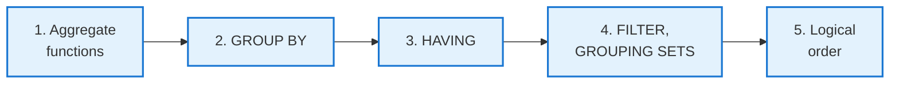
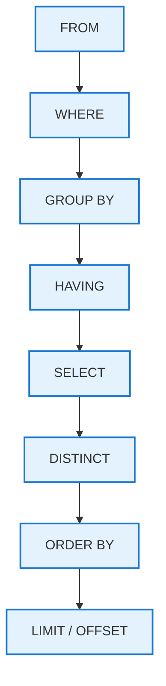

<!-- _class: lead -->

# Day 12: Aggregation, GROUP BY, HAVING

**COP 5725 - Database Management Systems**
Friday, September 18, 2026

Many rows in, few rows out

<!--
Closes Week 5. Pace 50 min. Heavy interactive: most students arrive thinking they "know" GROUP BY. The Day 12 goal is to surface the underexplored parts — FILTER, GROUPING SETS, logical evaluation order, COUNT(*) vs COUNT(col) NULL behavior. References throughout to PostgreSQL Ch. 7.2.3 and Ch. 9.21.
-->

---

# Where We Are

Monday covered single-table queries and Wednesday covered joins, both one row at a time.
Today covers collapsing many rows into fewer rows.

Reference for everything in this lecture: PostgreSQL docs [Ch. 7.2.3 GROUP BY and HAVING](https://www.postgresql.org/docs/current/queries-table-expressions.html#QUERIES-GROUP) and [Ch. 9.21 Aggregate Functions](https://www.postgresql.org/docs/current/functions-aggregate.html).

---

# Today's Roadmap



The logical-order section at the end ties everything together.

---

<!-- _class: lead -->

# Part 1: Aggregate Functions

---

# Common Aggregate Functions

| Function | What it does | NULL handling |
|----------|--------------|---------------|
| `count(*)` | Count all rows in the group | counts NULLs |
| `count(col)` | Count non-NULL values in column | skips NULLs |
| `count(DISTINCT col)` | Count unique non-NULL values | skips NULLs |
| `sum(col)`, `avg(col)` | Sum / average non-NULL values | skips NULLs |
| `min(col)`, `max(col)` | Smallest / largest non-NULL value | skips NULLs |
| `bool_and(col)`, `bool_or(col)` | All / any boolean values | skips NULLs |
| `string_agg(col, sep)` | Concatenate values | skips NULLs |
| `array_agg(col)` | Collect into an array | includes NULLs |

The NULL column is the trap. Reference: [Ch. 9.21 Aggregate Functions](https://www.postgresql.org/docs/current/functions-aggregate.html).

---

# COUNT(*) vs COUNT(col)

```sql
-- enrollment has 100 rows, 30 with NULL grade
SELECT count(*)         FROM enrollment;   -- 100
SELECT count(grade)     FROM enrollment;   -- 70
SELECT count(DISTINCT grade) FROM enrollment;  -- a small integer
```

<div class="error">

**Common misreading:** writing `count(grade)` when you meant `count(*)`. The query silently undercounts.

</div>

`count(*)` is the right answer when "how many rows" is the question. `count(col)` is the right answer when "how many values are present" is the question. Different questions, different functions.

<!--
This bug appears in dashboards everywhere. The grader is sometimes the first to notice that "active users" is actually "users who have logged in" because of count(login_at) on a row where login_at can be NULL.
-->

---

# DISTINCT Inside Aggregates

```sql run
CREATE OR REPLACE TABLE enrollment(sid INT, cid TEXT, term TEXT);
INSERT INTO enrollment VALUES
  (1,'COP5725','Fall2026'), (1,'COP5725','Spring2026'), (1,'COP5536','Fall2026'),
  (2,'COP5725','Fall2026'), (3,'COP5536','Fall2026'), (3,'COP5536','Spring2026');
-- @query
-- How many courses has each student enrolled in?
SELECT sid, count(DISTINCT cid) AS distinct_courses
FROM   enrollment
GROUP BY sid;
```

`count(DISTINCT cid)` is the right call when the same student takes the same course in multiple terms and you want to count the course once.

```sql
-- Sum of distinct credits taken
SELECT s.sid, sum(DISTINCT c.credits) AS distinct_credit_levels
FROM   student s
JOIN   enrollment e USING (sid)
JOIN   course c USING (cid)
GROUP BY s.sid;
```

`DISTINCT` inside an aggregate works for any function. It is often the cheapest fix for the join-multiplication trap from Day 11.

---

<!-- _class: lead -->

# Part 2: GROUP BY

---

# The Anatomy of a GROUP BY Query

```sql run
CREATE OR REPLACE TABLE student(sid INT, name TEXT, major TEXT, gpa DECIMAL(3,2));
INSERT INTO student VALUES
  (1,'Ada','CS',3.9), (2,'Bose','CS',3.4), (3,'Chen','CS',4.0),
  (4,'Devi','CS',2.8), (5,'Evan','CS',3.6), (6,'Fei','CS',3.1),
  (7,'Gita','EE',3.8), (8,'Hari','EE',2.9), (9,'Ivy','EE',NULL);
-- @query
SELECT  major, count(*) AS n, avg(gpa) AS mean_gpa
FROM    student
GROUP BY major
ORDER BY n DESC;
```

<div class="columns-3">
<div class="small">

**CS group**

<table>
<thead><tr><th>sid</th><th>name</th><th>gpa</th></tr></thead>
<tbody>
<tr style="background:#FFE082"><td>1</td><td>Ada</td><td>3.9</td></tr>
<tr style="background:#FFE082"><td>2</td><td>Bose</td><td>3.4</td></tr>
<tr style="background:#FFE082"><td>3</td><td>Chen</td><td>4.0</td></tr>
<tr style="background:#FFE082"><td>4</td><td>Devi</td><td>2.8</td></tr>
<tr style="background:#FFE082"><td>5</td><td>Evan</td><td>3.6</td></tr>
<tr style="background:#FFE082"><td>6</td><td>Fei</td><td>3.1</td></tr>
</tbody>
</table>

</div>
<div class="small">

**EE group**

<table>
<thead><tr><th>sid</th><th>name</th><th>gpa</th></tr></thead>
<tbody>
<tr style="background:#A5D6A7"><td>7</td><td>Gita</td><td>3.8</td></tr>
<tr style="background:#A5D6A7"><td>8</td><td>Hari</td><td>2.9</td></tr>
<tr style="background:#A5D6A7"><td>9</td><td>Ivy</td><td><strong>NULL</strong></td></tr>
</tbody>
</table>

`GROUP BY major` splits the nine student rows into these two groups.

</div>
<div class="small">

**result**

<table>
<thead><tr><th>major</th><th>n</th><th>mean_gpa</th></tr></thead>
<tbody>
<tr style="background:#FFE082"><td>CS</td><td>6</td><td>3.466…</td></tr>
<tr style="background:#A5D6A7"><td>EE</td><td>3</td><td>3.35</td></tr>
</tbody>
</table>

Each group collapses into the result row of its color. EE's `mean_gpa` averages two values because `avg` skips Ivy's NULL.

</div>
</div>

Each output row corresponds to one group.

---

# Every Non-Aggregate Column Must Be Grouped

```sql
-- Wrong in strict SQL: name is not in GROUP BY and not aggregated
SELECT major, name, count(*) FROM student GROUP BY major;
```

Standard SQL rejects this. PostgreSQL allows it **only** when the un-grouped column is functionally dependent on the GROUP BY columns (a SQL:1999 relaxation that few engines actually implement).

Safe form:

```sql
SELECT major, max(name) AS sample_name, count(*) FROM student GROUP BY major;
```

The "every column either grouped or aggregated" rule is your friend. Reference: [PostgreSQL Ch. 7.2.3 GROUP BY and HAVING](https://www.postgresql.org/docs/current/queries-table-expressions.html#QUERIES-GROUP).

<!--
The functional-dependency relaxation is rarely worth using. The grouped form is clearer and portable to other engines. Show the standard rule; mention the relaxation only as trivia.
-->

---

# Multi-Column GROUP BY

```sql
-- Average GPA per major and graduation year
SELECT major, graduation_year, avg(gpa) AS mean_gpa
FROM   student
GROUP BY major, graduation_year
ORDER BY major, graduation_year;
```

The group identity is the **tuple** of all GROUP BY columns. Two rows are in the same group only if they agree on every grouping column.

---

<!-- _class: lead -->

# Part 3: HAVING

---

# WHERE vs HAVING

<div class="columns">
<div>

### WHERE

Filters **rows** before grouping.

```sql
SELECT major, avg(gpa)
FROM   student
WHERE  gpa IS NOT NULL
GROUP BY major;
```

</div>
<div>

### HAVING

Filters **groups** after aggregation.

```sql
SELECT major, count(*) AS n
FROM   student
GROUP BY major
HAVING count(*) >= 5;
```

</div>
</div>

> Rule of thumb: if you reference an aggregate function in a filter, that filter belongs in `HAVING`. Otherwise it belongs in `WHERE`.

---

# Why WHERE count(*) Does Not Work

```sql
-- error: aggregate functions are not allowed in WHERE
SELECT major, count(*) FROM student WHERE count(*) >= 5 GROUP BY major;
```

`WHERE` runs **before** `GROUP BY`, so the rows have not been grouped yet and there is no `count(*)` to filter on.

`HAVING` runs after grouping; the aggregates exist.

The logical order in the next part explains why.

---

<!-- _class: lead -->

# Part 4: FILTER, GROUPING SETS

---

# Per-Aggregate Filtering with FILTER

```sql run
CREATE OR REPLACE TABLE student(sid INT, name TEXT, major TEXT, gpa DECIMAL(3,2));
INSERT INTO student VALUES
  (1,'Ada','CS',3.9), (2,'Bose','CS',3.4), (3,'Chen','CS',4.0),
  (4,'Devi','CS',2.8), (5,'Evan','CS',3.6), (6,'Fei','CS',3.1),
  (7,'Gita','EE',3.8), (8,'Hari','EE',2.9), (9,'Ivy','EE',NULL);
-- @query
SELECT
  major,
  count(*)                                AS total,
  count(*) FILTER (WHERE gpa >= 3.5)       AS honors_count,
  count(*) FILTER (WHERE gpa < 2.0)        AS at_risk_count,
  avg(gpa) FILTER (WHERE gpa >= 3.5)       AS mean_honors_gpa
FROM   student
GROUP BY major;
```

`FILTER` lets each aggregate apply its own row predicate. Standardized in SQL:2003; PostgreSQL ships it. Reference: [Ch. 4.2.7 Aggregate Expressions](https://www.postgresql.org/docs/current/sql-expressions.html#SYNTAX-AGGREGATES).

<!--
FILTER replaces the old "CASE WHEN ... THEN ... END" pattern most undergrads learn. Cleaner, faster, easier to read. Once students see it they will reach for it constantly.
-->

---

# GROUPING SETS, ROLLUP, CUBE

```sql
-- Three queries in one
SELECT major, graduation_year, count(*) AS n
FROM   student
GROUP BY GROUPING SETS (
  (major, graduation_year),
  (major),
  ()
);
```

<div class="columns-3">
<div>

### GROUPING SETS
Run multiple groupings in one query. Each row is one row in one grouping.

</div>
<div>

### ROLLUP
Shorthand for a hierarchy:
`ROLLUP(a, b, c)` = `(a,b,c), (a,b), (a), ()`.

</div>
<div>

### CUBE
All subsets:
`CUBE(a, b)` = `(a,b), (a), (b), ()`.

</div>
</div>

Reference: [PostgreSQL Ch. 7.2.4 GROUPING SETS, CUBE, and ROLLUP](https://www.postgresql.org/docs/current/queries-table-expressions.html#QUERIES-GROUPING-SETS).

---

# ROLLUP Subtotals

```sql
SELECT
  COALESCE(major, 'TOTAL') AS major,
  COALESCE(graduation_year::text, 'all years') AS year,
  count(*) AS n
FROM   student
GROUP BY ROLLUP (major, graduation_year)
ORDER BY major NULLS LAST, year NULLS LAST;
```

<div class="columns">
<div class="small">

<table>
<thead><tr><th>major</th><th>year</th><th>n</th></tr></thead>
<tbody>
<tr><td>CS</td><td>2027</td><td>22</td></tr>
<tr><td>CS</td><td>2028</td><td>18</td></tr>
<tr style="background:#FFE082"><td>CS</td><td>all years</td><td>40</td></tr>
<tr><td>EE</td><td>2027</td><td>12</td></tr>
<tr style="background:#FFE082"><td>EE</td><td>all years</td><td>12</td></tr>
<tr style="background:#A5D6A7"><td>TOTAL</td><td>all years</td><td>52</td></tr>
</tbody>
</table>

</div>
<div>

The plain rows are the ordinary (major, year) groups; the amber rows are the per-major subtotals ROLLUP adds, and the green row is the grand total.

This is the subtotal and grand total form that reporting queries use.

</div>
</div>

<!--
ROLLUP and CUBE are mostly used by analysts; OLTP workloads rarely reach for them. But knowing they exist lets you replace 10 separate queries with one — useful when building dashboards.
-->

---

<!-- _class: lead -->

# Part 5: Logical Order of Evaluation

---

# The Logical Pipeline



A SELECT query is conceptually evaluated in this order, regardless of how you write it.

This is the **logical** order. The optimizer is free to physically execute any order it likes, as long as the result matches.

---

# Why the Order Matters

```sql
-- This works
SELECT name, gpa * 25 AS percent
FROM   student
WHERE  gpa > 3.0
ORDER BY percent DESC;
-- ORDER BY runs after SELECT, so the alias percent is visible.

-- This does not
SELECT name, gpa * 25 AS percent
FROM   student
WHERE  percent > 75;
-- WHERE runs before SELECT, so percent is not yet defined.
```

The alias `percent` exists only after `SELECT`. Anything earlier in the pipeline cannot see it.

<!--
The "WHERE can't see SELECT aliases" question is the most-asked one in every SQL class. Pinning it to the logical order makes the answer mechanical.
-->

---

# How to Reference a Computed Column in WHERE

<div class="columns">
<div>

### Repeat the expression

```sql
SELECT name, gpa * 25 AS percent
FROM   student
WHERE  gpa * 25 > 75;
```

</div>
<div>

### Wrap in a subquery (Day 13 preview)

```sql
SELECT name, percent
FROM (
  SELECT name, gpa * 25 AS percent FROM student
) s
WHERE percent > 75;
```

</div>
</div>

Or a CTE (Day 14 preview). The optimizer collapses these into the same plan.

---

# A Composite Query

> "Among the majors with at least 5 students, show the average GPA, the number of honors students (GPA ≥ 3.5), and rank by average descending."

```sql run
CREATE OR REPLACE TABLE student(sid INT, name TEXT, major TEXT, gpa DECIMAL(3,2));
INSERT INTO student VALUES
  (1,'Ada','CS',3.9), (2,'Bose','CS',3.4), (3,'Chen','CS',4.0),
  (4,'Devi','CS',2.8), (5,'Evan','CS',3.6), (6,'Fei','CS',3.1),
  (7,'Gita','EE',3.8), (8,'Hari','EE',2.9), (9,'Ivy','EE',NULL);
-- @query
SELECT
  major,
  count(*)                            AS total,
  count(*) FILTER (WHERE gpa >= 3.5)  AS honors,
  avg(gpa)                            AS mean_gpa
FROM   student
WHERE  gpa IS NOT NULL
GROUP BY major
HAVING count(*) >= 5
ORDER BY mean_gpa DESC;
```

Every clause from today's lecture appears.

<!--
Walk through this query out loud, naming each clause and its role. Students should be able to recite the pipeline from this query.
-->

---

# Wrap-up

- Aggregate functions skip NULLs, except `count(*)` and `array_agg`
- `GROUP BY` collapses rows into one output row per group
- `WHERE` filters rows before grouping and `HAVING` filters groups after
- `FILTER` gives each aggregate its own predicate
- `GROUPING SETS`, `ROLLUP`, and `CUBE` run several groupings in one query
- The logical order is FROM, WHERE, GROUP BY, HAVING, SELECT, DISTINCT, ORDER BY, LIMIT

This closes Week 5.

<!--
One line per part of the lecture. If time is short, the logical-order line is the one to say out loud; the rest is on the earlier slides.
-->

---

# Next Week


Read PostgreSQL docs Ch. 7.8 (WITH) and Ch. 3.5 (Window Functions) before Monday.

---

# Project 1 Reminder

Due Friday, September 25 at 11:59 PM.

<div class="columns">
<div>

### Deliverables

- Schema DDL based on a written scenario
- 12-15 SQL queries answering specific questions
- Anonymous ER diagram a classmate will rebuild DDL from

</div>
<div>

### After the deadline

- Mon Sep 28: small-group presentations during class
- Wed Sep 30: winners present to the full class

</div>
</div>

---

# Practice This Weekend

Six queries on the university schema:

1. Number of students per major, only majors with at least three students.
2. For each course, count of A grades, B grades, and total enrollments in one row using FILTER.
3. Department-level subtotals plus grand total using ROLLUP.
4. Average GPA by major, ranked descending, with at least four students.
5. List majors where every enrolled student has GPA above 3.0.
6. Find the median GPA in each major (hint: use percentile_cont).

This is an exercise.

---

# Questions

What is on your mind?

Project 1 due in one week.

<!--
Common Day 12 questions: "Why doesn't PostgreSQL let me skip GROUP BY columns like MySQL?" (Strict mode wins on portability and correctness; the functional-dep relaxation is allowed but rare). "When should I use ROLLUP vs separate queries with UNION ALL?" (ROLLUP is one query; UNION ALL is N queries plus reassembly — ROLLUP is faster and more readable). "Is FILTER faster than CASE WHEN?" (Usually identical; FILTER is clearer).
-->
