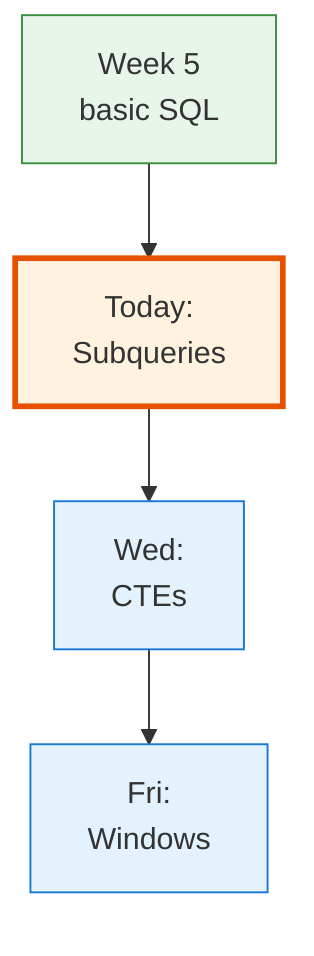
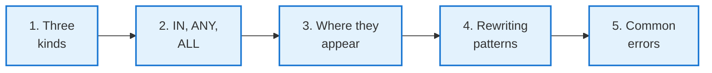
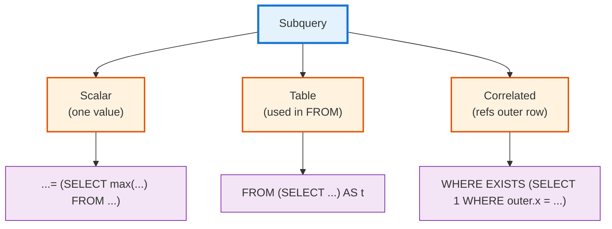

<!-- _class: lead -->

# Day 13: Subqueries

**COP 5725 - Database Management**
Monday, September 21, 2026

Three kinds. Many traps.

<!--
Week 6 opens. Subqueries are the gateway drug to CTEs and window functions; today's job is making the three forms (scalar, table, correlated) explicit so Wednesday's CTE lecture lands cleanly. Pace 50 min, with the rewriting and error sections taking 20 of those minutes.
-->

---

# Where We Are

<div class="columns-left-wide">
<div>

Week 5 gave you single-query SQL — joins, aggregation, the logical pipeline.

Week 6 asks: what if the *answer* to one query is the *input* to another?

Today: subqueries.
Wednesday: CTEs — a cleaner way to write big subquery chains.
Friday: window functions — a different answer to "subquery per row" problems.

By the end of the week you write queries most working engineers cannot read.

</div>
<div>



</div>
</div>

---

# Today's Roadmap



Reference: PostgreSQL docs [Ch. 7.2.1.3 Subqueries](https://www.postgresql.org/docs/current/queries-table-expressions.html#QUERIES-SUBQUERIES) and [Ch. 9.24 Subquery Expressions](https://www.postgresql.org/docs/current/functions-subquery.html).

---

<!-- _class: lead -->

# Part 1: Three Kinds of Subquery

---

# The Taxonomy



Three forms, three locations, three sets of pitfalls.

---

# Scalar Subqueries: One Value

```sql
-- "Students whose GPA exceeds the average"
SELECT name, gpa
FROM   student
WHERE  gpa > (SELECT avg(gpa) FROM student);
```

The inner query must return **exactly one row, one column**. PostgreSQL raises an error at runtime if it returns more than one row.

```sql
-- "Each student plus the campus average"
SELECT name, gpa,
       (SELECT avg(gpa) FROM student) AS campus_avg
FROM   student;
```

Scalar subqueries can appear anywhere a value is allowed: `WHERE`, `SELECT` list, even `ORDER BY`.

<!--
The "exactly one row, one column" constraint is what makes the subquery *scalar*. If the inner query returns zero rows, the result is NULL (which is sometimes surprising). If it returns multiple rows, PostgreSQL throws ERROR: more than one row returned by a subquery used as an expression.
-->

---

# Table Subqueries: Use Like a Table

```sql
-- Pre-aggregate, then join
SELECT s.name, ec.course_count
FROM   student s
JOIN (
  SELECT sid, count(*) AS course_count
  FROM   enrollment
  GROUP BY sid
) ec ON ec.sid = s.sid
WHERE  ec.course_count >= 3;
```

A `SELECT` inside `FROM` is just another table to the outer query. **PostgreSQL requires an alias** for the derived table (here, `ec`).

The pre-aggregate-then-join pattern is one of the most useful shapes in SQL. It avoids the join multiplication trap from Day 11.

---

# Correlated Subqueries: Refer to the Outer Row

```sql
-- "Students with GPA above their department's average"
SELECT s.name, s.gpa, s.dname
FROM   student s
WHERE  s.gpa > (
  SELECT avg(s2.gpa)
  FROM   student s2
  WHERE  s2.dname = s.dname    -- correlation: references outer s
);
```

The inner query depends on the outer row. The optimizer re-evaluates it (conceptually) for each outer row.

A correlated subquery is the SQL way to say "for each row, look up something specific to it."

<!--
Correlated subqueries are how most students first solve "compare each row to its group." It's almost always cleaner with a window function (Friday). Showing the correlated form now sets up the comparison.
-->

---

<!-- _class: lead -->

# Part 2: IN, ANY, SOME, ALL

---

# Set-Membership Predicates

<div class="columns">
<div>

### IN

```sql
WHERE major IN ('CS', 'EE', 'Math')
WHERE sid IN (SELECT sid FROM enrollment)
```

`x IN (subquery)` is true when `x` equals at least one returned value.

</div>
<div>

### ANY (alias: SOME)

```sql
WHERE gpa > ANY (SELECT gpa FROM honor_roll)
```

`x op ANY (subquery)` is true when `op` holds for at least one returned value.

`x = ANY (...)` is the same as `x IN (...)`.

</div>
</div>

Reference: [Ch. 9.24 Subquery Expressions](https://www.postgresql.org/docs/current/functions-subquery.html).

---

# ALL: Universal Quantification

```sql
-- "Students with GPA above every honor-roll student"
SELECT name FROM student
WHERE gpa > ALL (SELECT gpa FROM honor_roll);
```

`x op ALL (subquery)` is true when `op` holds for **every** returned value (and trivially true for empty subqueries).

`x <> ALL (...)` is equivalent to `x NOT IN (...)` — with the same NULL gotchas.

<div class="error">

**Reminder:** `x NOT IN (subquery)` returns no rows if any value in the subquery is NULL. `NOT EXISTS` (Day 11) is NULL-safe.

</div>

---

<!-- _class: lead -->

# Part 3: Where Subqueries Appear

---

# Subqueries Can Live Anywhere a Value or Table Can

<div class="columns">
<div>

### In WHERE / HAVING

```sql
SELECT name FROM student
WHERE  gpa > (SELECT avg(gpa) FROM student);

SELECT major, count(*) FROM student
GROUP BY major
HAVING count(*) > (
  SELECT count(*) / 7.0 FROM student
);
```

</div>
<div>

### In SELECT

```sql
SELECT name,
       (SELECT count(*) FROM enrollment e
        WHERE  e.sid = s.sid) AS courses
FROM   student s;
```

### In FROM

```sql
SELECT t.major, t.n
FROM   (SELECT major, count(*) AS n
        FROM   student
        GROUP BY major) t
ORDER BY t.n DESC;
```

</div>
</div>

The `SELECT`-list correlated subquery and the `FROM`-clause table subquery do similar work; the FROM version is usually faster because it aggregates once.

---

# Worked Example: Top-2 Per Group via Correlated Subquery

> "For each department, the two highest-paid faculty."

```sql
SELECT f.dname, f.name, f.salary
FROM   faculty f
WHERE  (
  SELECT count(*)
  FROM   faculty f2
  WHERE  f2.dname = f.dname
    AND  f2.salary > f.salary
) < 2
ORDER BY f.dname, f.salary DESC;
```

For each row, count the faculty *in the same department with strictly higher salary*. If that count is < 2, this row is in the top 2.

Slow on large tables — one inner query per row.

The same query is one line with a window function (Friday).

<!--
This is the classic "top-N per group via correlated subquery" form. Worth running it on a real table and showing the EXPLAIN plan: nested loop with one inner query per outer row. Then preview the window-function form to motivate Friday.
-->

---

<!-- _class: lead -->

# Part 4: Rewriting Patterns

---

# Subquery → JOIN

<div class="columns">
<div>

### Correlated subquery

```sql
SELECT s.name FROM student s
WHERE s.gpa > (
  SELECT avg(s2.gpa)
  FROM student s2
  WHERE s2.dname = s.dname
);
```

</div>
<div>

### Pre-aggregate + JOIN

```sql
SELECT s.name
FROM   student s
JOIN (
  SELECT dname, avg(gpa) AS dept_avg
  FROM   student
  GROUP BY dname
) d ON d.dname = s.dname
WHERE  s.gpa > d.dept_avg;
```

</div>
</div>

The JOIN form computes each department's average **once**. The correlated subquery computes it once per row.

The PostgreSQL optimizer often rewrites the first form into the second — but not always. Verify with `EXPLAIN`.

---

# Subquery → CTE (Preview)

```sql
-- Subquery form
SELECT s.name, ec.course_count
FROM   student s
JOIN (SELECT sid, count(*) AS course_count
      FROM enrollment GROUP BY sid) ec USING (sid);

-- CTE form (Wednesday)
WITH ec AS (
  SELECT sid, count(*) AS course_count
  FROM   enrollment
  GROUP BY sid
)
SELECT s.name, ec.course_count
FROM   student s
JOIN   ec USING (sid);
```

Identical results. The CTE form names the intermediate so the reader does not have to parse a nested SELECT.

<!--
CTEs are mostly aesthetic — the PostgreSQL optimizer inlines them. But "mostly aesthetic" hides a real productivity gain when queries grow to 100 lines.
-->

---

# Subquery → Window Function (Preview)

```sql
-- The correlated top-2-per-group from a few slides back
-- becomes one expression in Friday's window-function form:
SELECT dname, name, salary
FROM (
  SELECT dname, name, salary,
         row_number() OVER (PARTITION BY dname ORDER BY salary DESC) AS rk
  FROM   faculty
) ranked
WHERE rk <= 2;
```

Window functions evaluate per-partition without correlation overhead.
The cleanest form, the fastest plan, the answer most working engineers do not know exists.

Friday.

---

<!-- _class: lead -->

# Part 5: Common Errors

---

# Returning More Than One Row from a Scalar

```sql
-- Looks fine
SELECT name,
       (SELECT salary FROM faculty WHERE dname = s.dname) AS dept_salary
FROM   student s;
```

<div class="error">

**Runtime error** the moment a department has more than one faculty member:

`ERROR: more than one row returned by a subquery used as an expression`

</div>

The fix: aggregate (`max`, `avg`, etc.) or LIMIT.

```sql
SELECT name,
       (SELECT avg(salary) FROM faculty WHERE dname = s.dname) AS dept_avg_salary
FROM   student s;
```

<!--
This bug appears the moment a previously-singleton row becomes multi-row. A scalar subquery against a UNIQUE column is safe; against any other column is not. The aggregate forces "exactly one row" semantically.
-->

---

# The NULL-in-NOT-IN Trap (One More Time)

```sql
-- enrollment has 1 row with sid IS NULL
SELECT name FROM student
WHERE  sid NOT IN (SELECT sid FROM enrollment);

-- Returns ZERO rows for every student.
```

`NOT IN` is "for all x in the set, value <> x." A NULL in the set means *every* comparison is UNKNOWN, so the predicate never returns TRUE.

```sql
-- NULL-safe forms
WHERE NOT EXISTS (
  SELECT 1 FROM enrollment e WHERE e.sid = student.sid
);

-- or, explicit
WHERE sid NOT IN (SELECT sid FROM enrollment WHERE sid IS NOT NULL);
```

This is the single most reliable interview gotcha. Memorize it.

---

# Correlated Subquery Performance

```sql
-- N×M cost
SELECT s.name FROM student s
WHERE EXISTS (
  SELECT 1 FROM enrollment e
  WHERE  e.sid = s.sid AND e.grade IS NOT NULL
);

-- Often equivalent and faster
SELECT DISTINCT s.name
FROM   student s
JOIN   enrollment e ON e.sid = s.sid
WHERE  e.grade IS NOT NULL;
```

PostgreSQL's optimizer often rewrites correlated EXISTS into a semi-join. **Usually**. Check `EXPLAIN` when performance matters.

---

# Wrap-up

You now have:

<div class="columns">
<div>

- Three subquery kinds: scalar, table, correlated
- The four set predicates: IN, ANY/SOME, ALL, EXISTS
- The places subqueries can live (WHERE, HAVING, SELECT, FROM)

</div>
<div>

- Rewriting between subquery, JOIN, CTE, and window forms
- The three classic traps: more-than-one-row, NULL in NOT IN, correlated performance

</div>
</div>

---

# Wednesday: CTEs

We replace the nested SELECTs of today's slides with named blocks.

By the end of Wednesday you write multi-step queries that read top-to-bottom like a script.

Read PostgreSQL docs Ch. 7.8 before class.

---

# Practice Before Wednesday

Five queries:

1. Students with GPA above their department's average (correlated subquery).
2. Same question, written as a pre-aggregate JOIN.
3. Top-3 highest-paid faculty per department (correlated subquery form).
4. Departments where every faculty member earns above 80,000 (ALL).
5. Students not enrolled in any course this term (NOT EXISTS).

Answers due in your repo before 8:30 AM Wed Sep 23.

---

# Questions

What is on your mind?

Project 1 due Friday Sep 25.

<!--
Common Day 13 questions: "Is a correlated subquery always slow?" (No — sometimes the optimizer turns it into a semi-join. Use EXPLAIN to check.) "Can I have a subquery without a name in FROM?" (Not in PostgreSQL — aliases are required for derived tables.) "What's the difference between IN and ANY?" (= ANY is exactly IN. The forms differ when the operator is <, >, etc.)
-->
