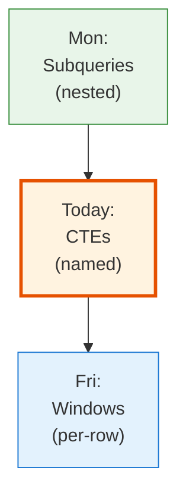
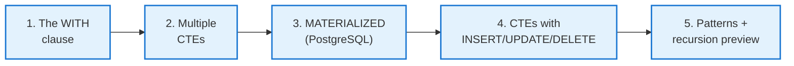
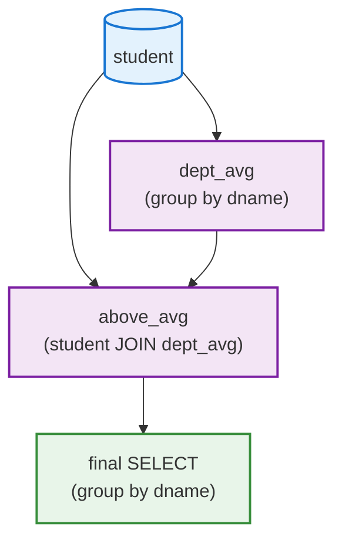

<!-- _class: lead -->

# Day 14: Common Table Expressions

**COP 5725 - Database Management Systems**
Wednesday, September 23, 2026

`WITH`, the named subquery

<!--
Middle day of Week 6. CTEs feel like a small syntactic convenience but they are a serious leverage point for readability and modifiability of complex queries. Pace 50 min, with the materialization section (Part 3) taking real time because PostgreSQL changed behavior in version 12 and many tutorials online are wrong.
-->

---

# Where We Are

<div class="columns-left-wide">
<div>

Monday covered subqueries, which nest one answer inside another.

Today covers CTEs, which name those nested answers so the query reads top to bottom like a script.

Friday covers window functions, which attach computations to rows rather than groups.

</div>
<div>



</div>
</div>

---

# Today's Roadmap



Reference: PostgreSQL docs [Ch. 7.8 WITH Queries (Common Table Expressions)](https://www.postgresql.org/docs/current/queries-with.html).

---

<!-- _class: lead -->

# Part 1: The WITH Clause

---

# Syntax

```sql
WITH cte_name AS (
  SELECT ...
)
SELECT ...
FROM   cte_name
WHERE  ...;
```

A CTE is a query you give a name to, then reference like a table.

The CTE name is visible only inside the statement that defines it. It is **not** persistent; it is gone after the query finishes.

---

# Subquery vs CTE

<div class="columns">
<div>

### Subquery form

```sql
SELECT s.name, ec.course_count
FROM   student s
JOIN (
  SELECT sid, count(*) AS course_count
  FROM   enrollment
  GROUP BY sid
) ec ON ec.sid = s.sid
WHERE  ec.course_count >= 3;
```

</div>
<div>

### CTE form

```sql run
CREATE OR REPLACE TABLE student(sid INT, name TEXT);
INSERT INTO student VALUES (1,'Ada'),(2,'Bose'),(3,'Chen'),(4,'Devi');
CREATE OR REPLACE TABLE enrollment(sid INT, cid TEXT);
INSERT INTO enrollment VALUES
  (1,'C1'),(1,'C2'),(1,'C3'), (2,'C1'),(2,'C2'), (3,'C1'),
  (4,'C1'),(4,'C2'),(4,'C3'),(4,'C4');
-- @query
WITH ec AS (
  SELECT sid, count(*) AS course_count
  FROM   enrollment
  GROUP BY sid
)
SELECT s.name, ec.course_count
FROM   student s
JOIN   ec USING (sid)
WHERE  ec.course_count >= 3;
```

</div>
</div>

Identical plans, identical results. The CTE form scales better as queries grow.

<!--
For queries under ~15 lines, the difference is purely aesthetic. For queries with 3+ nested derived tables, CTEs become essential — the reader can comprehend each named block independently instead of holding the whole nested tree in mind.
-->

---

# Why CTEs Help

<div class="columns">
<div>

### Subqueries grow inward

A 5-step transformation reads inside-out:

```sql
SELECT ...
FROM (
  SELECT ...
  FROM (
    SELECT ...
    FROM (
      ...
    ) ...
  ) ...
) ...;
```

</div>
<div>

### CTEs grow downward

```sql
WITH step1 AS (...),
     step2 AS (...),
     step3 AS (...)
SELECT ...
FROM   step3 JOIN ...;
```

Reads top to bottom like a script.

</div>
</div>

The same data flow, presented as a sequence of named steps.

---

<!-- _class: lead -->

# Part 2: Multiple CTEs

---

# Sequential CTEs

```sql run
CREATE OR REPLACE TABLE student(sid INT, name TEXT, dname TEXT, gpa DECIMAL(3,2));
INSERT INTO student VALUES
  (1,'Ada','CS',3.9), (2,'Bose','CS',3.1), (3,'Chen','CS',3.5),
  (4,'Devi','EE',3.8), (5,'Evan','EE',2.9), (6,'Fei','EE',3.4);
-- @query
WITH dept_avg AS (
  SELECT dname, avg(gpa) AS mean_gpa
  FROM   student
  WHERE  gpa IS NOT NULL
  GROUP BY dname
),
above_avg AS (
  SELECT s.sid, s.name, s.dname, s.gpa
  FROM   student s
  JOIN   dept_avg d ON d.dname = s.dname
  WHERE  s.gpa > d.mean_gpa
)
SELECT dname, count(*) AS above_avg_count
FROM   above_avg
GROUP BY dname
ORDER BY above_avg_count DESC;
```

Each CTE can reference any **earlier** CTE. The final `SELECT` ties them together.

---

# CTE Dependency Graph



Each named block is a node. The dependency graph reads like a small ETL pipeline.

<!--
The "CTE as DAG node" framing is the mental model that helps with complex reporting queries. Big queries often grow to 10+ CTEs; sketching the DAG before writing the SQL keeps the structure clean.
-->

---

# Naming Discipline

<div class="columns">
<div>

### Good names

```sql
WITH active_enrollments AS (...),
     dept_capacity AS (...),
     over_capacity_depts AS (...)
SELECT ...;
```

Each name describes what the CTE *is*, not how it was computed.

</div>
<div>

### Bad names

```sql
WITH q1 AS (...),
     q2 AS (...),
     t AS (...)
SELECT ...;
```

Forces the reader to chase definitions to figure out which query is which.

</div>
</div>

Treat CTEs like local variables. Names matter.

---

<!-- _class: lead -->

# Part 3: MATERIALIZED vs NOT MATERIALIZED

---

# Materialization Changed in PostgreSQL 12

<div class="columns">
<div>

### Before PostgreSQL 12

CTEs were always materialized. Each CTE computed its result once, stored it, and the outer query read from the temp result.

This made every CTE an "optimization fence", since the optimizer could not push filters into it.

</div>
<div>

### PostgreSQL 12+

CTEs are **inlined** by default (when they are referenced only once and have no side effects). The optimizer treats them like subqueries.

Use `MATERIALIZED` to force the old behavior; `NOT MATERIALIZED` to require inlining.

</div>
</div>

Reference: [PostgreSQL Ch. 7.8.1 SELECT in WITH](https://www.postgresql.org/docs/current/queries-with.html#QUERIES-WITH-SELECT).

<!--
The PG 12 change broke a lot of online tutorials. The old "use CTE as an optimization fence" advice still appears in many StackOverflow answers but is incorrect on modern PostgreSQL. Worth surfacing.
-->

---

# When to Force MATERIALIZED

```sql
WITH expensive_lookup AS MATERIALIZED (
  SELECT cid, count(*) AS section_count
  FROM   section
  GROUP BY cid
)
SELECT c.title, el.section_count
FROM   course c
JOIN   expensive_lookup el USING (cid)
WHERE  ...
UNION ALL
SELECT 'Total' AS title, sum(section_count)
FROM   expensive_lookup;
```

<div class="columns">
<div>

### Force MATERIALIZED when

- The CTE is referenced multiple times
- Recomputing it twice would be expensive
- You measured and inlining hurt

</div>
<div>

### Force NOT MATERIALIZED when

- The CTE is referenced once
- You want filter pushdown into the CTE

</div>
</div>

---

<!-- _class: lead -->

# Part 4: CTEs with DML

---

# WITH ... INSERT / UPDATE / DELETE

```sql
-- Insert derived rows
WITH new_enrollments AS (
  SELECT s.sid, 'COP5725' AS cid, 1 AS section_num, 'Fall2026' AS term, NULL::char(2) AS grade
  FROM   student s
  WHERE  s.major = 'CS'
    AND  NOT EXISTS (SELECT 1 FROM enrollment e
                     WHERE e.sid = s.sid AND e.cid = 'COP5725')
)
INSERT INTO enrollment
SELECT * FROM new_enrollments;
```

The CTE computes the rows to insert.
The outer statement is the actual mutation.

Reference: [PostgreSQL Ch. 7.8.2 Data-Modifying Statements in WITH](https://www.postgresql.org/docs/current/queries-with.html#QUERIES-WITH-MODIFYING).

---

# RETURNING with CTEs

```sql
-- Move enrollments to an archive table, then count
WITH moved AS (
  DELETE FROM enrollment
  WHERE  term = 'Fall2025'
  RETURNING *
),
archived AS (
  INSERT INTO enrollment_archive
  SELECT * FROM moved
  RETURNING sid
)
SELECT count(*) AS rows_archived FROM archived;
```

`RETURNING` makes a DML statement act like a query.
Wrapped in a CTE, you can pipe deletes into inserts into reports.

<!--
The "DELETE then INSERT" archive pattern in one statement is atomic by virtue of being one statement. Without WITH-RETURNING, doing the same thing required two statements and a transaction; with it, it's one statement that is automatically atomic.
-->

---

<!-- _class: lead -->

# Part 5: CTE Patterns and Recursive Preview

---

# Pattern 1: Pre-Aggregate

```sql run
CREATE OR REPLACE TABLE course(cid TEXT, title TEXT);
INSERT INTO course VALUES ('COP5725','Database Management'),('COP5536','Data Structures');
CREATE OR REPLACE TABLE enrollment(sid INT, cid TEXT, term TEXT);
INSERT INTO enrollment SELECT i + 1, 'COP5725', 'Fall2026' FROM range(35) t(i);
INSERT INTO enrollment SELECT i + 1, 'COP5536', 'Fall2026' FROM range(12) t(i);
-- @query
WITH enrollment_counts AS (
  SELECT cid, term, count(*) AS n
  FROM   enrollment
  GROUP BY cid, term
)
SELECT c.title, ec.n
FROM   course c
JOIN   enrollment_counts ec USING (cid)
WHERE  ec.term = 'Fall2026'
  AND  ec.n >= 30
ORDER BY ec.n DESC;
```

Avoids the join multiplication trap by aggregating before joining.

---

# Pattern 2: Step-by-Step Transform

```sql
WITH raw AS (
  SELECT * FROM raw_grades WHERE term = 'Fall2026'
),
parsed AS (
  SELECT sid, cid, regexp_replace(grade, '\s', '') AS grade
  FROM   raw
),
validated AS (
  SELECT * FROM parsed
  WHERE  grade IN ('A','A-','B+','B','B-','C+','C','C-','D+','D','D-','F')
)
SELECT * FROM validated;
```

Each CTE is one step in a data-cleaning pipeline.
Long production queries are commonly structured this way.

---

# Pattern 3: Recursive CTEs

```sql
WITH RECURSIVE org_chart AS (
  -- Base: top-level
  SELECT fid, name, supervisor_id, 1 AS level
  FROM   faculty
  WHERE  supervisor_id IS NULL

  UNION ALL

  -- Recursive: reports of the previous level
  SELECT f.fid, f.name, f.supervisor_id, oc.level + 1
  FROM   faculty f
  JOIN   org_chart oc ON f.supervisor_id = oc.fid
)
SELECT * FROM org_chart ORDER BY level, name;
```

The `RECURSIVE` keyword lets a CTE reference itself.
Day 17 covers recursive queries in full.

---

# Wrap-up

- `WITH` names a subquery and scopes it to one statement
- Multiple CTEs chain into a query that reads top to bottom
- PostgreSQL 12+ inlines single-reference CTEs; `MATERIALIZED` and `NOT MATERIALIZED` override the default
- CTEs can wrap `INSERT`, `UPDATE`, and `DELETE`, and `RETURNING` pipes rows between them
- Recursive CTEs let a query reference itself (Day 17)

---

# Next Lecture

Friday covers window functions.

Read PostgreSQL docs Ch. 3.5 before class.

> **Project 1 is due Friday at 11:59 PM.**

---

# Practice Before Friday

Five queries using CTEs:

1. Departments where the average GPA is above the campus average.
2. Per-department report: total faculty, total students, ratio.
3. A two-step CTE that cleans then validates a `raw_grades` import.
4. A `WITH ... INSERT` that backfills enrollment rows for a missing section.
5. Rewrite three of Monday's subquery answers as CTEs.

Answers due in your repo before 8:30 AM Fri Sep 25.

---

# Featured Paper

> Hirn, D. and Grust, T.
> *A Fix for the Fixation on Fixpoints*.
> CIDR 2023.

[Local PDF](https://ufdatastudio.com/cop5725fa26/papers/pdfs/hirn2023.pdf) · [papers index](https://ufdatastudio.com/cop5725fa26/papers)

The paper is short (12 pages). It argues that the SQL standard's specification of recursive CTEs is unnecessarily restrictive, and it shows PostgreSQL extensions that fix it.

The paper is the anchor for Day 17 (Recursive Queries). Read it this week.

<!--
Hirn and Grust have been advocating for richer recursive CTE semantics for years. The 2023 paper is the most accessible summary. Students who reach Day 17 having read it ahead engage at a much higher level.
-->

---

# Questions

What is on your mind?

Project 1 due Friday Sep 25.

<!--
Common Day 14 questions: "Are CTEs faster than subqueries?" (Since PG 12, identical for the common case of single-reference inlining; for multi-reference, MATERIALIZED can be faster.) "Can I update a CTE?" (No — the CTE's table-like name is read-only.) "Why use WITH at all if it's just rewriting subqueries?" (Readability for queries >50 lines, the ability to reference the same intermediate twice, the RETURNING pipe.)
-->
