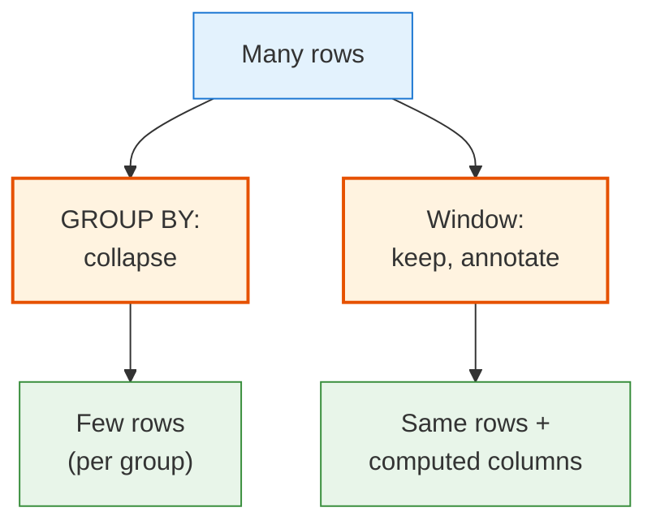
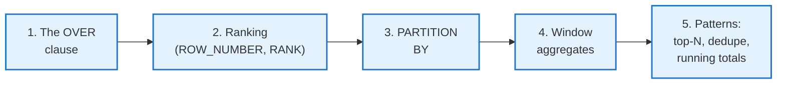
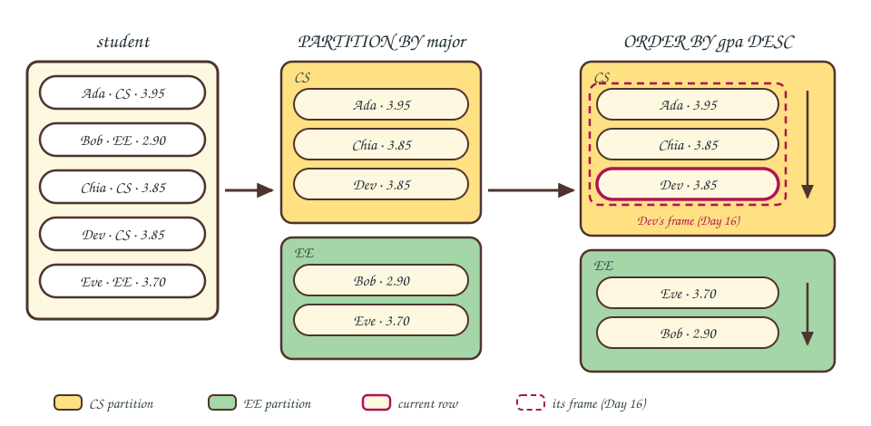

<!-- _class: lead -->

# Day 15: Window Functions I

**COP 5725 - Database Management Systems**
Friday, September 25, 2026

Per-row results without losing the row

<!--
Closes Week 6. Project 1 is due tonight. Budget the full 50 minutes and reserve only 90 seconds at the end for Project 1 reminders. Most students will not have seen window functions before.
-->

---

# Where We Are

<div class="columns-left-wide">
<div>

Day 12 covered GROUP BY. Today covers window functions.

Two ways to compute average GPA per major:

**GROUP BY (Day 12)**
Collapses rows. One row per major in the output.

**Window function (today)**
Keeps every row. Adds a major-average column alongside each student's row.

</div>
<div>



</div>
</div>

<!--
The GROUP BY vs window contrast is the anchor for the whole lecture. Students who internalize "collapse vs annotate" can derive everything else.
-->

---

# Today's Roadmap



Reference: PostgreSQL docs [Ch. 3.5 Window Functions](https://www.postgresql.org/docs/current/tutorial-window.html) (tutorial), [Ch. 4.2.8 Window Function Calls](https://www.postgresql.org/docs/current/sql-expressions.html#SYNTAX-WINDOW-FUNCTIONS) (reference), [Ch. 9.22 Window Functions](https://www.postgresql.org/docs/current/functions-window.html) (function list).

---

<!-- _class: lead -->

# Part 1: The OVER Clause

---

# GROUP BY vs OVER

<div class="columns">
<div>

### GROUP BY

```sql
SELECT major, avg(gpa) AS mean_gpa
FROM   student
GROUP BY major;
```

<table>
<thead><tr><th>major</th><th>mean_gpa</th></tr></thead>
<tbody>
<tr style="background:#FFE082"><td>CS</td><td>3.88</td></tr>
<tr style="background:#A5D6A7"><td>EE</td><td>3.30</td></tr>
</tbody>
</table>

</div>
<div>

### OVER

```sql run
CREATE OR REPLACE TABLE student(student_id INT, name TEXT, major TEXT, gpa DECIMAL(3,2));
INSERT INTO student VALUES
  (1,'Ada','CS',3.95), (2,'Bob','EE',2.90), (3,'Chia','CS',3.85),
  (4,'Dev','CS',3.85), (5,'Eve','EE',3.70);
-- @query
SELECT name, major, gpa,
       avg(gpa) OVER (PARTITION BY major) AS major_avg
FROM   student;
```

<table>
<thead><tr><th>name</th><th>major</th><th>gpa</th><th>major_avg</th></tr></thead>
<tbody>
<tr style="background:#FFE082"><td>Ada</td><td>CS</td><td>3.95</td><td>3.88</td></tr>
<tr style="background:#A5D6A7"><td>Bob</td><td>EE</td><td>2.90</td><td>3.30</td></tr>
<tr style="background:#FFE082"><td>Chia</td><td>CS</td><td>3.85</td><td>3.88</td></tr>
<tr style="background:#FFE082"><td>Dev</td><td>CS</td><td>3.85</td><td>3.88</td></tr>
<tr style="background:#A5D6A7"><td>Eve</td><td>EE</td><td>3.70</td><td>3.30</td></tr>
</tbody>
</table>

</div>
</div>

<div class="small">

Rows sharing a color share a major. GROUP BY collapses each color to one row, and OVER writes its average onto every row.

</div>

<!--
This single comparison is the entire lecture. If students leave understanding the GROUP BY to window mental shift, every other window concept follows. The averages are rounded to two decimals; DuckDB prints more digits.
-->

---

# The OVER Clause Syntax

```sql
function_name(arg1, arg2, ...) OVER (
  [ PARTITION BY expression, ... ]
  [ ORDER BY     expression [ASC|DESC] [NULLS FIRST|LAST], ... ]
  [ frame_clause ]
)
```

<div class="columns-3">
<div>

### PARTITION BY
Defines the "group" the window operates within.

Omitted → whole table.

</div>
<div>

### ORDER BY
Defines order within the partition.

Required for ranking functions and frame-based aggregates.

</div>
<div>

### Frame clause
Specifies a subset of the partition.

Day 16. Skip for now.

</div>
</div>

---

# The Three Pieces



Each row's window is the partition it belongs to, optionally ordered, optionally sliced by frame.

<!--
Read the picture left to right: PARTITION BY splits the five rows into the amber CS band and the green EE band, ORDER BY sorts inside each band (watch Eve and Bob swap), and the dashed outline is the frame of the current row — for Dev, the partition start down through Dev. Frames become explicit on Day 16.
-->

---

<!-- _class: lead -->

# Part 2: Ranking Functions

---

# ROW_NUMBER

```sql run
CREATE OR REPLACE TABLE student(student_id INT, name TEXT, major TEXT, gpa DECIMAL(3,2));
INSERT INTO student VALUES
  (1,'Ada','CS',3.95), (2,'Bob','EE',2.90), (3,'Chia','CS',3.85),
  (4,'Dev','CS',3.85), (5,'Eve','EE',3.70);
-- @query
SELECT name, gpa,
       row_number() OVER (ORDER BY gpa DESC) AS rk
FROM   student;
```

<table>
<thead><tr><th>name</th><th>gpa</th><th>rk</th></tr></thead>
<tbody>
<tr><td>Ada</td><td>3.95</td><td>1</td></tr>
<tr style="background:#E1BEE7"><td>Chia</td><td>3.85</td><td>2</td></tr>
<tr style="background:#E1BEE7"><td>Dev</td><td>3.85</td><td>3</td></tr>
<tr><td>Eve</td><td>3.70</td><td>4</td></tr>
<tr><td>Bob</td><td>2.90</td><td>5</td></tr>
</tbody>
</table>

`row_number()` assigns a unique sequence number per row in the window. The purple rows tie at 3.85, so their order is arbitrary and Chia and Dev could swap places.

It appears in leaderboards, top-N-per-group queries, and deduplication.

---

# RANK and DENSE_RANK

```sql run
CREATE OR REPLACE TABLE student(student_id INT, name TEXT, major TEXT, gpa DECIMAL(3,2));
INSERT INTO student VALUES
  (1,'Ada','CS',3.95), (2,'Bob','EE',2.90), (3,'Chia','CS',3.85),
  (4,'Dev','CS',3.85), (5,'Eve','EE',3.70);
-- @query
SELECT name, gpa,
       rank()       OVER (ORDER BY gpa DESC) AS r,
       dense_rank() OVER (ORDER BY gpa DESC) AS dr
FROM   student;
```

<div class="columns">
<div>

<table>
<thead><tr><th>name</th><th>gpa</th><th>r</th><th>dr</th></tr></thead>
<tbody>
<tr><td>Ada</td><td>3.95</td><td>1</td><td>1</td></tr>
<tr style="background:#E1BEE7"><td>Chia</td><td>3.85</td><td>2</td><td>2</td></tr>
<tr style="background:#E1BEE7"><td>Dev</td><td>3.85</td><td>2</td><td>2</td></tr>
<tr><td>Eve</td><td>3.70</td><td style="background:#FFE082">4</td><td style="background:#FFE082">3</td></tr>
<tr><td>Bob</td><td>2.90</td><td>5</td><td>4</td></tr>
</tbody>
</table>

</div>
<div>

### RANK
Gives same rank to ties.
**Skips** numbers after ties (1, 2, 2, 4).

### DENSE_RANK
Gives same rank to ties.
**No gaps** after ties (1, 2, 2, 3).

</div>
</div>

<div class="small">

Purple marks the tied rows; the amber cells are where the two functions diverge after the tie.

</div>

<!--
Pick the ranking function based on the consumer of the data. Sports leagues use RANK (Olympic medal counts skip if there's a tie). DENSE_RANK is more natural for grouping ("top 3 distinct GPAs"). ROW_NUMBER avoids ties but is non-deterministic in ordering.
-->

---

# NTILE

```sql run
CREATE OR REPLACE TABLE student(student_id INT, name TEXT, major TEXT, gpa DECIMAL(3,2));
INSERT INTO student VALUES
  (1,'Ada','CS',3.95), (2,'Bob','EE',2.90), (3,'Chia','CS',3.85),
  (4,'Dev','CS',3.85), (5,'Eve','EE',3.70);
-- @query
SELECT name, gpa,
       ntile(4) OVER (ORDER BY gpa) AS quartile
FROM   student;
```

| name | gpa | quartile |
|------|-----|----------|
| Bob | 2.90 | 1 |
| Eve | 3.70 | 1 |
| Chia | 3.85 | 2 |
| Dev | 3.85 | 3 |
| Ada | 3.95 | 4 |

`ntile(n)` divides the window into *n* approximately equal buckets.

Useful for percentile reporting and decile cohorts. PostgreSQL also offers `percent_rank()` and `cume_dist()` for continuous percentile values.

---

<!-- _class: lead -->

# Part 3: PARTITION BY

---

# Rank Within Group

```sql run
CREATE OR REPLACE TABLE faculty(faculty_id INT, name TEXT, dname TEXT, salary INT);
INSERT INTO faculty VALUES
  (1,'Grant','CS',95000), (2,'Sahni','CS',110000), (3,'Dobra','CS',102000),
  (4,'Lee','EE',88000), (5,'Rao','EE',99000);
-- @query
SELECT name, dname, salary,
       rank() OVER (PARTITION BY dname ORDER BY salary DESC) AS dept_rank
FROM   faculty;
```

<table>
<thead><tr><th>name</th><th>dname</th><th>salary</th><th>dept_rank</th></tr></thead>
<tbody>
<tr style="background:#FFE082"><td>Sahni</td><td>CS</td><td>110000</td><td>1</td></tr>
<tr style="background:#FFE082"><td>Dobra</td><td>CS</td><td>102000</td><td>2</td></tr>
<tr style="background:#FFE082"><td>Grant</td><td>CS</td><td>95000</td><td>3</td></tr>
<tr style="background:#A5D6A7"><td>Rao</td><td>EE</td><td>99000</td><td>1</td></tr>
<tr style="background:#A5D6A7"><td>Lee</td><td>EE</td><td>88000</td><td>2</td></tr>
</tbody>
</table>

Rows sharing a color share a partition, and the rank resets to 1 where the color changes. This ranking is the building block for top-N-per-group queries.

---

# Top-N Per Group

```sql run
CREATE OR REPLACE TABLE faculty(faculty_id INT, name TEXT, dname TEXT, salary INT);
INSERT INTO faculty VALUES
  (1,'Grant','CS',95000), (2,'Sahni','CS',110000), (3,'Dobra','CS',102000),
  (4,'Lee','EE',88000), (5,'Rao','EE',99000);
-- @query
-- Top 2 highest-paid faculty per department
SELECT dname, name, salary
FROM (
  SELECT dname, name, salary,
         row_number() OVER (PARTITION BY dname ORDER BY salary DESC) AS rk
  FROM   faculty
) ranked
WHERE rk <= 2;
```

Monday's correlated-subquery version rescanned the table once per row. The window form ranks in one pass over the faculty table.

<!--
The correlated subquery version of this problem from Monday was 10 lines and ran O(N²). This is 5 lines and runs O(N log N) on a sorted access path. The performance jump is real.
-->

---

<!-- _class: lead -->

# Part 4: Window Aggregates

---

# Aggregates as Window Functions

Any aggregate function (`count`, `sum`, `avg`, `min`, `max`, ...) can be used as a window function by adding `OVER (...)`.

```sql run
CREATE OR REPLACE TABLE faculty(faculty_id INT, name TEXT, dname TEXT, salary INT);
INSERT INTO faculty VALUES
  (1,'Grant','CS',95000), (2,'Sahni','CS',110000), (3,'Dobra','CS',102000),
  (4,'Lee','EE',88000), (5,'Rao','EE',99000);
-- @query
SELECT name, dname, salary,
       avg(salary)   OVER (PARTITION BY dname) AS dept_avg,
       max(salary)   OVER (PARTITION BY dname) AS dept_max,
       count(*)      OVER (PARTITION BY dname) AS dept_count,
       salary - avg(salary) OVER (PARTITION BY dname) AS diff_from_avg
FROM   faculty;
```

Every row carries its own salary plus its department's stats. No GROUP BY, no extra joins.

---

# Running Totals

```sql run
CREATE OR REPLACE TABLE faculty(faculty_id INT, name TEXT, dname TEXT, salary INT);
INSERT INTO faculty VALUES
  (1,'Grant','CS',95000), (2,'Sahni','CS',110000), (3,'Dobra','CS',102000),
  (4,'Lee','EE',88000), (5,'Rao','EE',99000);
-- @query
SELECT name, dname, salary,
       sum(salary) OVER (
         PARTITION BY dname
         ORDER BY     name
       ) AS running_payroll
FROM   faculty;
```

<div class="columns">
<div>

<table>
<thead><tr><th>name</th><th>dname</th><th>salary</th><th>running_payroll</th></tr></thead>
<tbody>
<tr style="background:#FFE082"><td>Dobra</td><td>CS</td><td>102000</td><td>102000</td></tr>
<tr style="background:#FFE082"><td>Grant</td><td>CS</td><td>95000</td><td>197000</td></tr>
<tr style="background:#F8BBD0"><td>Sahni</td><td>CS</td><td>110000</td><td>307000</td></tr>
<tr><td>Lee</td><td>EE</td><td>88000</td><td>88000</td></tr>
<tr><td>Rao</td><td>EE</td><td>99000</td><td>187000</td></tr>
</tbody>
</table>

</div>
<div>

The combination of `PARTITION BY` and `ORDER BY` produces a **running total**: each row's value plus the cumulative sum of preceding rows in the partition.

<div class="small">

The pink row's total covers the amber rows plus itself: 102000 + 95000 + 110000 = 307000. Lee restarts at 88000 because the partition changed.

</div>

</div>
</div>

<!--
The "ORDER BY in OVER causes running aggregation" rule trips many students. We formalize this with frames on Day 16. For now: ORDER BY in OVER usually means "compute over preceding rows in this partition."
-->

---

# Grade vs Section Average

> "For each enrollment, show the student's grade, the section's average grade, and how the student compares."

```sql
SELECT
  s.name,
  c.title,
  e.grade,
  avg(grade_value(e.grade)) OVER (PARTITION BY e.course_id, e.section_num, e.term) AS section_avg,
  grade_value(e.grade) - avg(grade_value(e.grade))
    OVER (PARTITION BY e.course_id, e.section_num, e.term) AS diff_from_section_avg
FROM   enrollment e
JOIN   student s    ON s.student_id = e.student_id
JOIN   course c     USING (course_id)
WHERE  e.grade IS NOT NULL
ORDER BY c.title, e.grade DESC;
```

Every row carries the student's grade and the section average, with no correlated subqueries.

<!--
This kind of query is what window functions are for. The same answer via correlated subqueries would be three nested scans of the enrollment table. grade_value() is a stand-in for a letter-grade-to-points mapping; the query is illustrative, not runnable here.
-->

---

<!-- _class: lead -->

# Part 5: Common Patterns

---

# Top-N Per Group Template

```sql
SELECT * FROM (
  SELECT ..., row_number() OVER (PARTITION BY group ORDER BY metric DESC) AS rk
  FROM table
) t WHERE rk <= N;
```

The "highest-paid faculty per department," "most recent enrollment per student," "best score per game."

---

# Deduplication

```sql
-- Keep the most recent enrollment per (student_id, course_id)
DELETE FROM enrollment
WHERE (student_id, course_id, term, section_num) IN (
  SELECT student_id, course_id, term, section_num FROM (
    SELECT student_id, course_id, term, section_num,
           row_number() OVER (PARTITION BY student_id, course_id ORDER BY term DESC) AS rk
    FROM   enrollment
  ) t WHERE rk > 1
);
```

`row_number() = 1` keeps the chosen "canonical" row per duplicate group.
The rest are dropped.

---

# Compare Each Row to Group Stats

```sql run
CREATE OR REPLACE TABLE student(student_id INT, name TEXT, major TEXT, gpa DECIMAL(3,2));
INSERT INTO student VALUES
  (1,'Ada','CS',3.95), (2,'Bob','EE',2.90), (3,'Chia','CS',3.85),
  (4,'Dev','CS',3.85), (5,'Eve','EE',3.70);
-- @query
SELECT
  s.name, s.gpa,
  s.gpa - avg(s.gpa) OVER (PARTITION BY s.major)     AS vs_major_avg,
  rank()             OVER (PARTITION BY s.major
                           ORDER BY s.gpa DESC)       AS major_rank
FROM   student s;
```

One query gives each student their GPA, their distance from the major's average, and their rank within the major.

---

# Wrap-up

- The `OVER` clause turns an aggregate into a per-row window computation.
- `row_number`, `rank`, `dense_rank`, and `ntile` rank rows within a window; they differ in how they treat ties.
- `PARTITION BY` scopes the window, and rankings reset at partition boundaries.
- `ORDER BY` inside `OVER` makes aggregates cumulative, which yields running totals.
- Top-N-per-group, deduplication, and row-vs-group comparison all follow the rank-then-filter pattern.

---

# Monday: Window Functions II

Topic: frame clauses, `LAG`/`LEAD`, and the value functions `first_value`, `last_value`, and `nth_value`.

Reading: PostgreSQL docs [Ch. 9.22 Window Functions](https://www.postgresql.org/docs/current/functions-window.html).

---

# Project 1 Reminder

<div class="columns">
<div>

### Due tonight, 11:59 PM

- Schema DDL based on the assigned scenario
- 12-15 SQL queries answering specific questions
- Reading response to Codd 1970 (one page)

</div>
<div>

### After the deadline

- Mon Sep 28: small-group presentations during class
- Wed Sep 30: winners present to the full class
- Project 2 (Advanced SQL) released Mon Sep 21, due Fri Oct 23

</div>
</div>

---

# Practice This Weekend

Five queries:

1. Top-3 students by GPA per major (window function form).
2. For each enrollment, percentile rank within the section.
3. Running total of payroll by hire date.
4. List students whose GPA is above their department's average, including the difference.
5. Find duplicate enrollments (same student_id + course_id across multiple terms), keep most recent.

This is an exercise.

---

# Questions

What is on your mind?

Project 1 due at 11:59 PM tonight. Have a good weekend.

<!--
Common Day 15 questions: "Can I use a window function in WHERE?" (No — window functions evaluate after WHERE. Wrap the query in a subquery/CTE and filter on the window result.) "Why does ORDER BY in OVER affect the value of avg()?" (Because it changes the implicit frame to running. Day 16 makes this explicit.) "Are window functions faster than correlated subqueries?" (Usually yes — one pass vs N passes.)
-->
