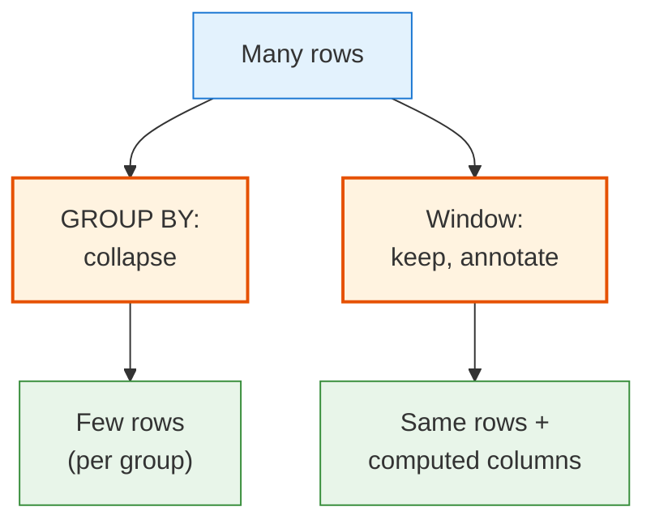
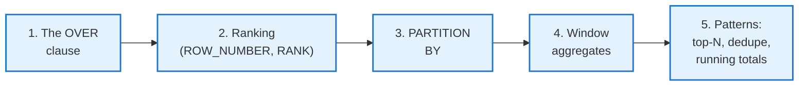
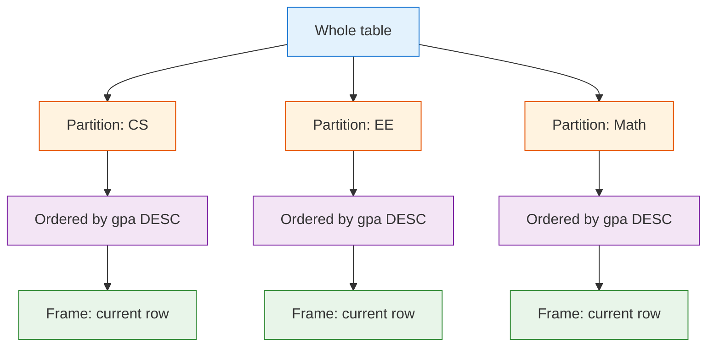

<!-- _class: lead -->

# Day 15: Window Functions I

**COP 5725 - Database Management Systems**
Friday, September 25, 2026

Per-row results without losing the row

<!--
Closes Week 6. Project 1 is due tonight. Window functions are the course's biggest differentiator from other DB classes; budget the full 50 minutes and reserve only 90 seconds at the end for Project 1 reminders. Most students will not have seen window functions before. They are life-changing once internalized.
-->

---

# Where We Are

<div class="columns-left-wide">
<div>

Two ways to compute "average GPA per major":

**GROUP BY (Day 12)**
Collapses rows. One row per major in the output.

**Window function (today)**
Keeps every row. Adds a "department avg" column alongside each student's row.

The shift from group-by to window is the single most important SQL idea most engineers never learn.

</div>
<div>



</div>
</div>

---

# Today's Roadmap



Reference: PostgreSQL docs [Ch. 3.5 Window Functions](https://www.postgresql.org/docs/current/tutorial-window.html) (tutorial), [Ch. 4.2.8 Window Function Calls](https://www.postgresql.org/docs/current/sql-expressions.html#SYNTAX-WINDOW-FUNCTIONS) (reference), [Ch. 9.22 Window Functions](https://www.postgresql.org/docs/current/functions-window.html) (function list).

---

<!-- _class: lead -->

# Part 1: The OVER Clause

---

# Side-by-Side: GROUP BY vs OVER

<div class="columns">
<div>

### GROUP BY

```sql
SELECT major, avg(gpa) AS mean_gpa
FROM   student
GROUP BY major;
```

Output:

| major | mean_gpa |
|-------|----------|
| CS | 3.5 |
| EE | 3.3 |

</div>
<div>

### OVER

```sql
SELECT name, major, gpa,
       avg(gpa) OVER (PARTITION BY major) AS major_avg
FROM   student;
```

Output:

| name | major | gpa | major_avg |
|------|-------|-----|-----------|
| Ada | CS | 3.95 | 3.5 |
| Bob | EE | 2.90 | 3.3 |
| Chia | CS | 3.70 | 3.5 |

</div>
</div>

Same average, two presentations. The window form keeps each row alongside its group's value.

<!--
This single comparison is the entire lecture. If students leave understanding the GROUP BY → window mental shift, every other window concept follows.
-->

---

# The OVER Clause, Generally

```sql
function_name(arg1, arg2, ...) OVER (
  [ PARTITION BY expression, ... ]
  [ ORDER BY     expression [ASC|DESC] [NULLS FIRST|LAST], ... ]
  [ frame_clause ]
)
```

<div class="columns-3">
<div>

### PARTITION BY
Defines the "group" the window operates within.

Omitted → whole table.

</div>
<div>

### ORDER BY
Defines order within the partition.

Required for ranking functions and frame-based aggregates.

</div>
<div>

### Frame clause
Specifies a subset of the partition.

Day 16. Skip for now.

</div>
</div>

---

# The Three Pieces



Each row's window is the partition it belongs to, optionally ordered, optionally sliced by frame.

---

<!-- _class: lead -->

# Part 2: Ranking Functions

---

# ROW_NUMBER

```sql
SELECT name, gpa,
       row_number() OVER (ORDER BY gpa DESC) AS rk
FROM   student;
```

| name | gpa | rk |
|------|-----|----|
| Ada | 3.95 | 1 |
| Dev | 3.85 | 2 |
| Chia | 3.70 | 3 |
| Eve | 3.20 | 4 |

`row_number()` assigns a unique sequence number per row in the window. Ties broken arbitrarily.

The most common ranking function in practice. Used everywhere from leaderboards to top-N-per-group.

---

# RANK and DENSE_RANK

```sql
SELECT name, gpa,
       rank()       OVER (ORDER BY gpa DESC) AS r,
       dense_rank() OVER (ORDER BY gpa DESC) AS dr
FROM   student;
```

| name | gpa | r | dr |
|------|-----|---|----|
| Ada | 3.95 | 1 | 1 |
| Dev | 3.85 | 2 | 2 |
| Chia | 3.85 | 2 | 2 |
| Eve | 3.70 | 4 | 3 |

<div class="columns">
<div>

### RANK
Gives same rank to ties.
**Skips** numbers after ties (1, 2, 2, 4).

</div>
<div>

### DENSE_RANK
Gives same rank to ties.
**No gaps** after ties (1, 2, 2, 3).

</div>
</div>

<!--
Pick the ranking function based on the consumer of the data. Sports leagues use RANK (Olympic medal counts skip if there's a tie). DENSE_RANK is more natural for grouping ("top 3 distinct GPAs"). ROW_NUMBER avoids ties but is non-deterministic in ordering.
-->

---

# NTILE: Quantile Buckets

```sql
SELECT name, gpa,
       ntile(4) OVER (ORDER BY gpa) AS quartile
FROM   student;
```

| name | gpa | quartile |
|------|-----|----------|
| Bob | 2.90 | 1 |
| Eve | 3.20 | 1 |
| Chia | 3.70 | 2 |
| Dev | 3.85 | 3 |
| Ada | 3.95 | 4 |

`ntile(n)` divides the window into *n* approximately-equal buckets.

Useful for percentile reporting and decile cohorts. PostgreSQL also offers `percent_rank()` and `cume_dist()` for continuous percentile values.

---

<!-- _class: lead -->

# Part 3: PARTITION BY

---

# Rank Within Group

```sql
SELECT name, dname, salary,
       rank() OVER (PARTITION BY dname ORDER BY salary DESC) AS dept_rank
FROM   faculty;
```

| name | dname | salary | dept_rank |
|------|-------|--------|-----------|
| Sahni | CS | 110000 | 1 |
| Grant | CS | 95000 | 2 |
| Lee | EE | 88000 | 1 |

The rank resets at each partition boundary.

This is the building block for "top N per group" — the canonical use of window functions.

---

# Top-N Per Group (The Clean Form)

```sql
-- Top 2 highest-paid faculty per department
SELECT dname, name, salary
FROM (
  SELECT dname, name, salary,
         row_number() OVER (PARTITION BY dname ORDER BY salary DESC) AS rk
  FROM   faculty
) ranked
WHERE rk <= 2;
```

Compare to Monday's correlated-subquery form: 5 lines of nested logic became 5 lines of clean ranking.

The window form runs in **one pass** over the faculty table.

<!--
The correlated subquery version of this problem from Monday was 10 lines and ran O(N²). This is 5 lines and runs O(N log N) on a sorted access path. The performance jump is real.
-->

---

<!-- _class: lead -->

# Part 4: Window Aggregates

---

# Aggregates as Window Functions

Any aggregate function (`count`, `sum`, `avg`, `min`, `max`, ...) can be used as a window function by adding `OVER (...)`.

```sql
SELECT name, dname, salary,
       avg(salary)   OVER (PARTITION BY dname) AS dept_avg,
       max(salary)   OVER (PARTITION BY dname) AS dept_max,
       count(*)      OVER (PARTITION BY dname) AS dept_count,
       salary - avg(salary) OVER (PARTITION BY dname) AS diff_from_avg
FROM   faculty;
```

Every row carries its own salary plus its department's stats. No GROUP BY, no extra joins.

---

# Running Totals

```sql
SELECT name, dname, salary,
       sum(salary) OVER (
         PARTITION BY dname
         ORDER BY     name
       ) AS running_payroll
FROM   faculty;
```

The combination of `PARTITION BY` and `ORDER BY` produces a **running total**: each row's value plus the cumulative sum of preceding rows in the partition.

| name | dname | salary | running_payroll |
|------|-------|--------|-----------------|
| Grant | CS | 95000 | 95000 |
| Sahni | CS | 110000 | 205000 |
| Lee | EE | 88000 | 88000 |

<!--
The "ORDER BY in OVER causes running aggregation" rule trips many students. We'll formalize this with frames on Day 16. For now: ORDER BY in OVER usually means "compute over preceding rows in this partition."
-->

---

# A Worked Comparison

> "For each enrollment, show the student's grade, the section's average grade, and how the student compares."

```sql
SELECT
  s.name,
  c.title,
  e.grade,
  avg(grade_value(e.grade)) OVER (PARTITION BY e.cid, e.section_num, e.term) AS section_avg,
  grade_value(e.grade) - avg(grade_value(e.grade))
    OVER (PARTITION BY e.cid, e.section_num, e.term) AS diff_from_section_avg
FROM   enrollment e
JOIN   student s    ON s.sid = e.sid
JOIN   course c     USING (cid)
WHERE  e.grade IS NOT NULL
ORDER BY c.title, e.grade DESC;
```

Every student sees their own grade plus the section's. Zero correlated subqueries.

<!--
This kind of query is what window functions are for. The same answer via correlated subqueries would be three nested scans of the enrollment table.
-->

---

<!-- _class: lead -->

# Part 5: Three Patterns You Will Use Weekly

---

# Pattern 1: Top-N Per Group

```sql
SELECT * FROM (
  SELECT ..., row_number() OVER (PARTITION BY group ORDER BY metric DESC) AS rk
  FROM table
) t WHERE rk <= N;
```

The "highest-paid faculty per department," "most recent enrollment per student," "best score per game."

---

# Pattern 2: Deduplication by Key, Keep Latest

```sql
-- Keep the most recent enrollment per (sid, cid)
DELETE FROM enrollment
WHERE (sid, cid, term, section_num) IN (
  SELECT sid, cid, term, section_num FROM (
    SELECT sid, cid, term, section_num,
           row_number() OVER (PARTITION BY sid, cid ORDER BY term DESC) AS rk
    FROM   enrollment
  ) t WHERE rk > 1
);
```

`row_number() = 1` keeps the chosen "canonical" row per duplicate group.
The rest are dropped.

---

# Pattern 3: Compare Each Row to Group Stats

```sql
SELECT
  s.name, s.gpa,
  s.gpa - avg(s.gpa) OVER (PARTITION BY s.major)     AS vs_major_avg,
  rank()             OVER (PARTITION BY s.major
                           ORDER BY s.gpa DESC)       AS major_rank
FROM   student s;
```

Every student sees their absolute GPA, their distance from the major's average, and their rank within the major — in one query.

---

# Wrap-up

You now have:

<div class="columns">
<div>

- The `OVER` clause: `PARTITION BY`, `ORDER BY`, frame (preview)
- Four ranking functions: `row_number`, `rank`, `dense_rank`, `ntile`
- Window aggregates: every aggregate function can be used over a window

</div>
<div>

- Running totals via `PARTITION BY` + `ORDER BY`
- Top-N-per-group, dedupe, and per-row-vs-group patterns
- A cleaner, faster answer to last week's correlated subquery problems

</div>
</div>

---

# Monday: Window Functions II

We add:

- **Frame clauses** — `ROWS BETWEEN` and `RANGE BETWEEN`
- **LAG and LEAD** — peek at neighboring rows
- **FIRST_VALUE, LAST_VALUE, NTH_VALUE** — refer to ends of the window
- Moving averages, period-over-period comparisons, gap detection

Read PostgreSQL docs Ch. 9.22 (Window Functions) before class.

---

# Project 1 Reminder

<div class="columns">
<div>

### Due tonight, 11:59 PM

- Schema DDL based on the assigned scenario
- 12-15 SQL queries answering specific questions
- Reading response to Codd 1970 (one page)

</div>
<div>

### After the deadline

- Mon Sep 28: small-group presentations during class
- Wed Sep 30: winners present to the full class
- Project 2 (Advanced SQL) releases Mon Sep 28 — due Oct 23

</div>
</div>

---

# Practice This Weekend

Five queries:

1. Top-3 students by GPA per major (window function form).
2. For each enrollment, percentile rank within the section.
3. Running total of payroll by hire date.
4. List students whose GPA is above their department's average, including the difference.
5. Find duplicate enrollments (same sid + cid across multiple terms), keep most recent.

Answers due in your repo before 8:30 AM Mon Sep 28.

---

# Questions

What is on your mind?

Project 1 due at 11:59 PM tonight. Have a good weekend.

<!--
Common Day 15 questions: "Can I use a window function in WHERE?" (No — window functions evaluate after WHERE. Wrap the query in a subquery/CTE and filter on the window result.) "Why does ORDER BY in OVER affect the value of avg()?" (Because it changes the implicit frame to running. Day 16 makes this explicit.) "Are window functions faster than correlated subqueries?" (Usually yes — one pass vs N passes.)
-->
