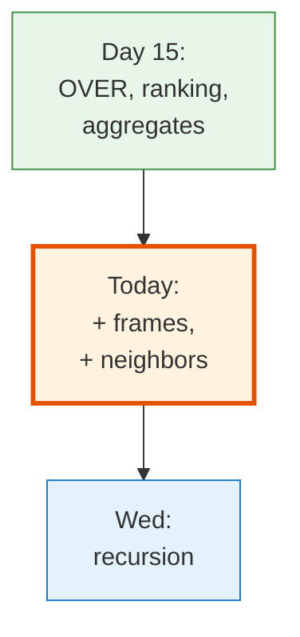
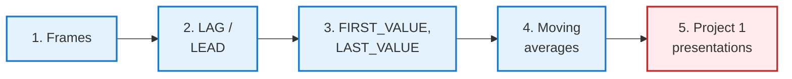
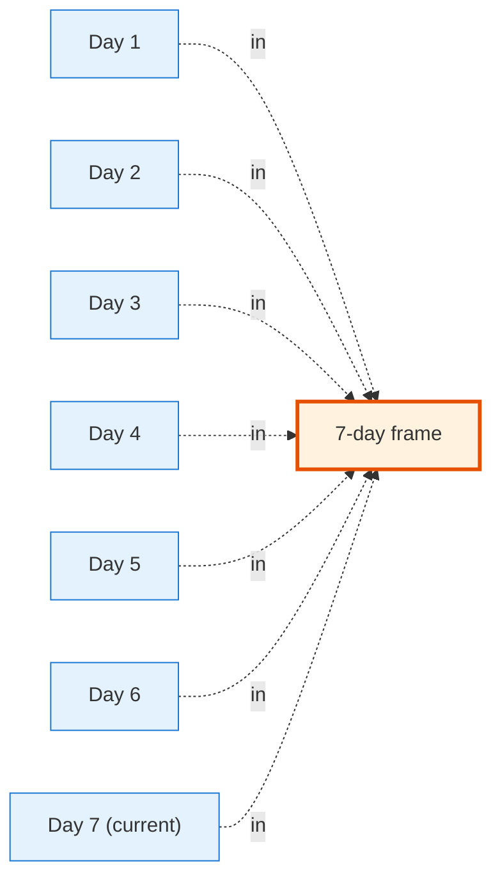

<!-- _class: lead -->

# Day 16: Window Functions II

**COP 5725 - Database Management Systems**
Monday, September 28, 2026

Frames, neighbors, boundaries

<!--
Project 1 group presentations start this week. The first 30 min of class today is small-group breakouts; the remaining 20 min covers Window II content. Adjust pacing — the slide deck assumes 50 minutes, but in practice today is closer to 25 minutes of content delivery. Hit the highlights (frames, LAG/LEAD, moving averages) and move the rest to the practice handout.
-->

---

# Where We Are

<div class="columns-left-wide">
<div>

Friday covered the OVER clause with `PARTITION BY` and `ORDER BY`.

Today covers the third piece, the **frame** clause, plus the neighbor functions `LAG`/`LEAD` and the boundary functions `FIRST_VALUE`/`LAST_VALUE`.

These pieces combine into moving averages, period-over-period deltas, and gap detection.

</div>
<div>



</div>
</div>

---

# Today's Roadmap



Reference: PostgreSQL docs [Ch. 9.22 Window Functions](https://www.postgresql.org/docs/current/functions-window.html).

---

<!-- _class: lead -->

# Part 1: Frame Clauses

---

# The Default Frame

A window function without an explicit frame uses a default. The default depends on whether `ORDER BY` is present.

<div class="columns">
<div>

### No ORDER BY

```sql
avg(salary) OVER (PARTITION BY dname)
```

Default frame: **entire partition**.
`avg` is the department average.

</div>
<div>

### With ORDER BY

```sql
avg(salary) OVER (
  PARTITION BY dname
  ORDER BY hire_date
)
```

Default frame: **start of partition through current row**.
`avg` is a running average.

</div>
</div>

When an aggregate appears with `ORDER BY` in the OVER clause, set an explicit frame unless you want the running behavior.

<!--
The "ORDER BY changes the default frame" rule is the source of many "why does my average grow as I scroll down?" questions. The fix is to set an explicit frame.
-->

---

# Explicit Frame Syntax

```sql
function() OVER (
  PARTITION BY ...
  ORDER BY ...
  ROWS BETWEEN frame_start AND frame_end
)
```

<div class="columns">
<div>

### Frame start options

- `UNBOUNDED PRECEDING`
- `n PRECEDING`
- `CURRENT ROW`

</div>
<div>

### Frame end options

- `CURRENT ROW`
- `n FOLLOWING`
- `UNBOUNDED FOLLOWING`

</div>
</div>

```sql
ROWS BETWEEN 6 PRECEDING AND CURRENT ROW   -- 7-row trailing window
ROWS BETWEEN 1 PRECEDING AND 1 FOLLOWING   -- 3-row centered window
ROWS BETWEEN UNBOUNDED PRECEDING AND UNBOUNDED FOLLOWING  -- whole partition
```

---

# ROWS vs RANGE

<div class="columns">
<div>

### ROWS BETWEEN

Counts **physical rows** in the partition.

```sql
ROWS BETWEEN 2 PRECEDING AND CURRENT ROW
```

Always returns a fixed number of rows (or fewer at boundaries).

</div>
<div>

### RANGE BETWEEN

Counts **value distance** from the ORDER BY column.

```sql
RANGE BETWEEN INTERVAL '7 days' PRECEDING
          AND CURRENT ROW
```

Returns all rows whose ORDER BY value is within the range.

</div>
</div>

`RANGE` works with `INTERVAL` for time windows such as "everything in the last 7 days." Reference: [PostgreSQL Ch. 4.2.8 Window Function Calls](https://www.postgresql.org/docs/current/sql-expressions.html#SYNTAX-WINDOW-FUNCTIONS).

---

# Moving Average Example

```sql
-- 7-day moving average of daily enrollments
SELECT
  enrollment_date,
  count(*) AS daily,
  avg(count(*)) OVER (
    ORDER BY enrollment_date
    ROWS BETWEEN 6 PRECEDING AND CURRENT ROW
  ) AS moving_avg_7d
FROM   enrollment
GROUP BY enrollment_date
ORDER BY enrollment_date;
```

For each day, the window covers the current row and the 6 preceding rows, a 7-day rolling average.



<!--
ROWS counts rows, not calendar days. When dates are missing, the 7-row frame spans more than 7 calendar days; RANGE BETWEEN INTERVAL '6 days' PRECEDING AND CURRENT ROW handles gaps correctly. Worth saying aloud.
-->

---

<!-- _class: lead -->

# Part 2: LAG and LEAD

---

# Peek Backward and Forward

```sql run
CREATE OR REPLACE TABLE enrollment(student_id INT, enrollment_date DATE);
INSERT INTO enrollment VALUES
  (1,DATE '2026-09-01'),(2,DATE '2026-09-01'),
  (3,DATE '2026-09-02'),(4,DATE '2026-09-02'),(5,DATE '2026-09-02'),
  (6,DATE '2026-09-03'),(7,DATE '2026-09-03'),
  (8,DATE '2026-09-06'),(9,DATE '2026-09-06'),(10,DATE '2026-09-06'),(11,DATE '2026-09-06'),
  (12,DATE '2026-09-07'),(13,DATE '2026-09-07'),(14,DATE '2026-09-07');
-- @query
SELECT
  enrollment_date,
  count(*)                                AS today,
  lag(count(*), 1)  OVER (ORDER BY enrollment_date) AS yesterday,
  lead(count(*), 1) OVER (ORDER BY enrollment_date) AS tomorrow
FROM   enrollment
GROUP BY enrollment_date;
```

| enrollment_date | today | yesterday | tomorrow |
|------|-------|-----------|----------|
| 2026-09-01 | 2 | NULL | 3 |
| 2026-09-02 | 3 | 2 | 2 |
| 2026-09-03 | 2 | 3 | 4 |
| 2026-09-06 | 4 | 2 | 3 |
| 2026-09-07 | 3 | 4 | NULL |

`lag(expr, offset, default)` and `lead(expr, offset, default)` look at neighboring rows in the window.

<!--
LAG and LEAD are the "running diff" tool. With them, "how much did enrollment change day-over-day?" becomes one expression.
-->

---

# Period-Over-Period

```sql
-- Day-over-day change
SELECT
  enrollment_date,
  count(*) AS today,
  count(*) - lag(count(*), 1, 0) OVER (ORDER BY enrollment_date) AS day_change,
  count(*) - lag(count(*), 7, 0) OVER (ORDER BY enrollment_date) AS week_change
FROM   enrollment
GROUP BY enrollment_date;
```

The third argument to `lag` is the default when there is no preceding row.
Passing 0 makes boundary rows show the value itself instead of NULL.

---

<!-- _class: lead -->

# Part 3: FIRST_VALUE, LAST_VALUE, NTH_VALUE

---

# Refer to the Ends of the Window

```sql run
CREATE OR REPLACE TABLE faculty(faculty_id INT, name TEXT, dname TEXT, salary INT);
INSERT INTO faculty VALUES
  (1,'Grant','CS',95000), (2,'Sahni','CS',110000), (3,'Dobra','CS',102000),
  (4,'Lee','EE',88000), (5,'Rao','EE',99000);
-- @query
SELECT
  name, dname, salary,
  first_value(salary) OVER (
    PARTITION BY dname
    ORDER BY salary DESC
  ) AS dept_top_salary,
  last_value(salary) OVER (
    PARTITION BY dname
    ORDER BY salary DESC
    ROWS BETWEEN UNBOUNDED PRECEDING AND UNBOUNDED FOLLOWING
  ) AS dept_bottom_salary
FROM   faculty;
```

`first_value` and `last_value` pull the value from the first or last row of the **frame** (not the partition).

---

# LAST_VALUE and the Default Frame

```sql
-- WRONG: returns the *current* row's salary, not the partition's last
SELECT
  name, salary,
  last_value(salary) OVER (PARTITION BY dname ORDER BY salary DESC) AS top
FROM   faculty;
```

<div class="error">

With ORDER BY and no explicit frame, the default frame is `UNBOUNDED PRECEDING ... CURRENT ROW`. The "last" row of that frame is the current row.

</div>

The fix is an explicit `UNBOUNDED PRECEDING AND UNBOUNDED FOLLOWING` frame, or `first_value` with reversed ORDER BY.

<!--
LAST_VALUE with the default frame trips most first-time users because the "last" row of a running frame is the current row. Drilling the explicit frame habit prevents it.
-->

---

<!-- _class: lead -->

# Part 4: Patterns

---

# 7-Day Moving Average

```sql run
CREATE OR REPLACE TABLE enrollment(student_id INT, enrollment_date DATE);
INSERT INTO enrollment VALUES
  (1,DATE '2026-09-01'),(2,DATE '2026-09-01'),
  (3,DATE '2026-09-02'),(4,DATE '2026-09-02'),(5,DATE '2026-09-02'),
  (6,DATE '2026-09-03'),(7,DATE '2026-09-03'),
  (8,DATE '2026-09-06'),(9,DATE '2026-09-06'),(10,DATE '2026-09-06'),(11,DATE '2026-09-06'),
  (12,DATE '2026-09-07'),(13,DATE '2026-09-07'),(14,DATE '2026-09-07');
-- @query
SELECT
  enrollment_date,
  count(*) AS daily,
  avg(count(*)) OVER (
    ORDER BY enrollment_date
    ROWS BETWEEN 6 PRECEDING AND CURRENT ROW
  ) AS ma_7d
FROM   enrollment
GROUP BY enrollment_date;
```

---

# Cumulative Distribution

```sql run
CREATE OR REPLACE TABLE student(student_id INT, name TEXT, gpa DECIMAL(3,2));
INSERT INTO student VALUES
  (1,'Ada',3.95),(2,'Bob',2.90),(3,'Chia',3.70),(4,'Dev',3.85),(5,'Eve',3.20);
-- @query
SELECT
  name, gpa,
  cume_dist() OVER (ORDER BY gpa) AS cdf,
  percent_rank() OVER (ORDER BY gpa) AS pr
FROM   student;
```

`cume_dist()` returns the fraction of rows at or below the current row.
`percent_rank()` returns the rank percentile (without the current row).

Together they answer "what percentile is this row in?" without manual quartile math.

---

# Gaps and Islands

> "Find runs of consecutive enrollment days."

```sql run
CREATE OR REPLACE TABLE enrollment(student_id INT, enrollment_date DATE);
INSERT INTO enrollment VALUES
  (1,DATE '2026-09-01'),(2,DATE '2026-09-01'),
  (3,DATE '2026-09-02'),(4,DATE '2026-09-02'),(5,DATE '2026-09-02'),
  (6,DATE '2026-09-03'),(7,DATE '2026-09-03'),
  (8,DATE '2026-09-06'),(9,DATE '2026-09-06'),(10,DATE '2026-09-06'),(11,DATE '2026-09-06'),
  (12,DATE '2026-09-07'),(13,DATE '2026-09-07'),(14,DATE '2026-09-07');
-- @query
WITH dated AS (
  SELECT enrollment_date,
         enrollment_date - (row_number() OVER (ORDER BY enrollment_date))::int AS grp
  FROM   (SELECT DISTINCT enrollment_date FROM enrollment) d
)
SELECT min(enrollment_date) AS run_start,
       max(enrollment_date) AS run_end,
       count(*)             AS run_length
FROM   dated
GROUP BY grp
ORDER BY run_start;
```

The "row_number minus date" trick gives the same `grp` to consecutive dates.
Then GROUP BY collapses each run into one row.

<!--
Gaps-and-islands is the canonical "show off your SQL chops" problem. It uses row_number to detect runs of consecutive values — useful for active-streak reporting, time-series gap detection, and tenure calculations.
-->

---

# Wrap-up

- `ROWS BETWEEN` counts physical rows and `RANGE BETWEEN` measures value distance; `ORDER BY` without a frame implies a running frame.
- `lag` and `lead` read neighboring rows, with offset and default arguments.
- `first_value` and `last_value` read the ends of the frame, and `last_value` needs an explicit frame to reach the partition's end.
- Moving averages, percentile functions, and the gaps-and-islands trick combine these pieces.

---

# Wednesday: Recursive Queries

Topic: recursive queries with `WITH RECURSIVE`, including hierarchy and graph traversal.

Reading: PostgreSQL docs [Ch. 7.8.2 Recursive Queries](https://www.postgresql.org/docs/current/queries-with.html#QUERIES-WITH-RECURSIVE) and Hirn & Grust, *A Fix for the Fixation on Fixpoints* (CIDR 2023).

---

# Project 1 Presentations Today

<div class="columns">
<div>

### Last 20 minutes

- Form into small breakout groups (4-5 students each, assigned at start of class)
- Each student presents their Project 1 in 3-4 minutes
- Group votes for the strongest presentation
- Winners present to the full class on Wednesday

</div>
<div>

### Project 2 released today

**Advanced SQL.** Due **Fri Oct 23**.

The project tests subqueries, CTEs, window functions, and (after Wednesday) recursive queries.

</div>
</div>

---

# Practice Before Wednesday

Five queries:

1. 7-day moving average of section enrollments by date.
2. Day-over-day percent change in active enrollments.
3. For each faculty member, their salary relative to the department's highest.
4. Identify runs of 3+ consecutive enrollment days.
5. For each student, the time gap between their last two enrollments.

Answers due in your repo before 8:30 AM Wed Sep 30.

---

# Questions

What is on your mind?

Project 2 released today. Project 1 winners present on Wednesday.

<!--
Project 1 presentations dominate today. Save window function questions for the practice handout and office hours.
-->
