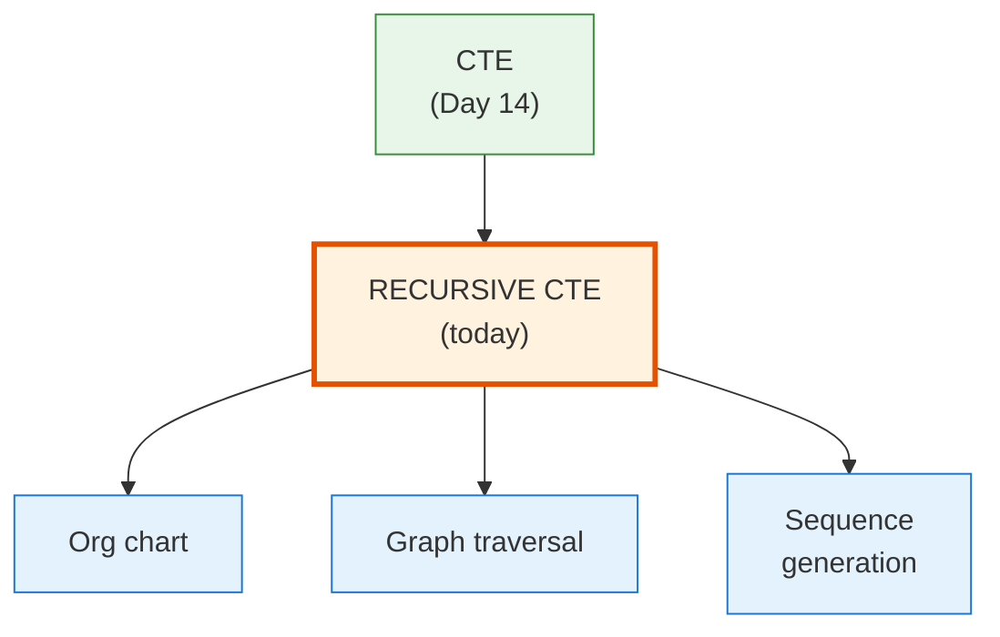
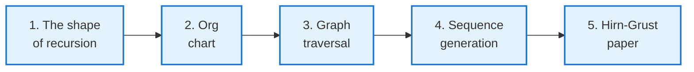
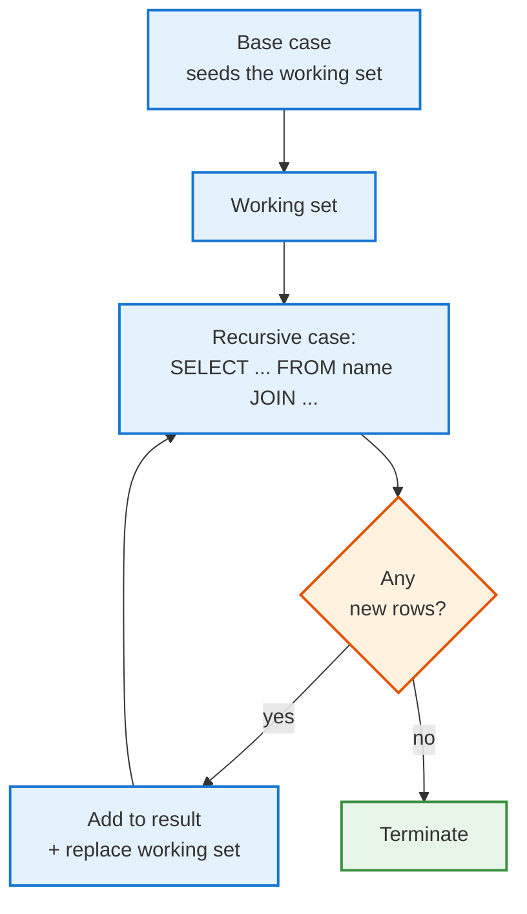

<!-- _class: lead -->

# Day 17: Recursive Queries

**COP 5725 - Database Management Systems**
Wednesday, September 30, 2026

`WITH RECURSIVE` — SQL meets the fixed-point operator

<!--
This is the day SQL becomes Turing-complete (or close to it). Most students have never seen recursive CTEs even after multiple database courses. Today's job is making the shape concrete (base + recursive case + UNION ALL) and showing three different problem shapes that benefit.
The Hirn-Grust 2023 paper is the anchor — students should have read it Tuesday night. Reserve the last 10 min to discuss it.
-->

---

# Where We Are

<div class="columns-left-wide">
<div>

Day 14 introduced CTEs.
Day 15-16 introduced window functions.

Today we discover that a CTE can reference *itself* — and that small change makes SQL handle hierarchies, graph traversal, and iterative computation.

The PostgreSQL syntax is `WITH RECURSIVE`. The semantics are a fixed-point iteration that we will walk step by step.

</div>
<div>



</div>
</div>

---

# Today's Roadmap



Reference: PostgreSQL docs [Ch. 7.8.2 Recursive Queries](https://www.postgresql.org/docs/current/queries-with.html#QUERIES-WITH-RECURSIVE).

---

<!-- _class: lead -->

# Part 1: The Shape of Recursion

---

# Three Pieces

```sql
WITH RECURSIVE name AS (
  -- 1. Base case (non-recursive)
  SELECT ...
  WHERE  ...

  UNION ALL

  -- 2. Recursive case (references "name")
  SELECT ...
  FROM   source JOIN name ON ...
)
SELECT * FROM name;
```

<div class="columns-3">
<div>

### Base case
The starting set of rows. Runs once.

</div>
<div>

### Recursive case
Produces new rows from the previous iteration's output. Runs repeatedly.

</div>
<div>

### Termination
The loop stops when the recursive case produces no new rows.

</div>
</div>

---

# Execution as a Fixed-Point Loop



PostgreSQL calls the working set the *recursive term's input*. Each iteration replaces it with the rows produced in the previous iteration — not the cumulative result.

<!--
The "working set replaces, doesn't accumulate" semantic is the source of subtle bugs. The recursive case sees only the *new* rows from the previous iteration. Reference cumulative results via a separate column (depth, path, etc.).
-->

---

<!-- _class: lead -->

# Part 2: Org Chart

---

# The Schema

```sql
CREATE TABLE faculty_supervision (
  fid           bigint PRIMARY KEY,
  name          text NOT NULL,
  supervisor_id bigint REFERENCES faculty_supervision(fid)
);

INSERT INTO faculty_supervision VALUES
  (1, 'Dr. Provost',  NULL),
  (2, 'Dr. Dean',     1),
  (3, 'Dr. Chair',    2),
  (4, 'Dr. Grant',    3),
  (5, 'Dr. Sahni',    3),
  (6, 'Dr. Lee',      2);
```

The `supervisor_id` is a self-referencing foreign key.
The org structure is a tree, encoded in the column.

---

# The Recursive Query

```sql run
CREATE OR REPLACE TABLE faculty_supervision(fid INT, name TEXT, supervisor_id INT);
INSERT INTO faculty_supervision VALUES
  (1,'Dr. Provost',NULL), (2,'Dr. Dean',1), (3,'Dr. Chair',2),
  (4,'Dr. Grant',3), (5,'Dr. Sahni',3), (6,'Dr. Lee',2);
-- @query
WITH RECURSIVE chart AS (
  -- Base: roots (no supervisor)
  SELECT fid, name, supervisor_id, 1 AS depth, name AS path
  FROM   faculty_supervision
  WHERE  supervisor_id IS NULL

  UNION ALL

  -- Recursive: direct reports of the previous level
  SELECT f.fid, f.name, f.supervisor_id, c.depth + 1, c.path || ' > ' || f.name
  FROM   faculty_supervision f
  JOIN   chart c ON f.supervisor_id = c.fid
)
SELECT depth, repeat('  ', depth - 1) || name AS indented, path
FROM   chart
ORDER BY path;
```

`depth` and `path` are computed columns that survive across iterations.

---

# Walk Through, Iteration by Iteration

<div class="columns">
<div>

### Iteration 0 (base)
| fid | name | depth |
|-----|------|-------|
| 1 | Dr. Provost | 1 |

### Iteration 1
| fid | name | depth |
|-----|------|-------|
| 2 | Dr. Dean | 2 |

### Iteration 2
| fid | name | depth |
|-----|------|-------|
| 3 | Dr. Chair | 3 |
| 6 | Dr. Lee | 3 |

</div>
<div>

### Iteration 3
| fid | name | depth |
|-----|------|-------|
| 4 | Dr. Grant | 4 |
| 5 | Dr. Sahni | 4 |

### Iteration 4
Recursive case produces no rows → terminate.

The final result is the **union** of every iteration's output.

</div>
</div>

<!--
Walk this on the board. Students often try to compute the cumulative set in their head and get confused. The "each iteration sees only the previous iteration's new rows" rule keeps the math tractable.
-->

---

<!-- _class: lead -->

# Part 3: Graph Traversal

---

# Schema: Undirected Friendship

```sql
CREATE TABLE friend (
  sid_a bigint REFERENCES student(sid),
  sid_b bigint REFERENCES student(sid),
  PRIMARY KEY (sid_a, sid_b),
  CHECK  (sid_a < sid_b)
);

-- Logical symmetric view
CREATE VIEW friend_sym AS
  SELECT sid_a AS sid_x, sid_b AS sid_y FROM friend
  UNION ALL
  SELECT sid_b AS sid_x, sid_a AS sid_y FROM friend;
```

The `CHECK` constraint stores each pair only once.
The view exposes the symmetric form for traversal.

---

# Friends Within 3 Hops

```sql
WITH RECURSIVE network AS (
  -- Base: direct friends
  SELECT sid_y AS friend_id, 1 AS hops, ARRAY[sid_x, sid_y] AS path
  FROM   friend_sym
  WHERE  sid_x = :seed_student

  UNION ALL

  -- Recursive: friends of friends, up to 3 hops, no cycles
  SELECT fs.sid_y, n.hops + 1, n.path || fs.sid_y
  FROM   network n
  JOIN   friend_sym fs ON fs.sid_x = n.friend_id
  WHERE  n.hops < 3
    AND  NOT fs.sid_y = ANY(n.path)
)
SELECT DISTINCT friend_id, min(hops) AS shortest_hops
FROM   network
GROUP BY friend_id
ORDER BY shortest_hops;
```

The `path` array tracks visited vertices to prevent cycles.

<!--
Cycle detection via path arrays is the standard pattern. Without it, friend-of-friend traversal in a connected graph never terminates. The WHERE n.hops < 3 is a defensive cap that bounds the depth even if cycle detection fails.
-->

---

# When Recursive CTEs Are the Wrong Tool

<div class="columns">
<div>

### They are right when

- The data structure is recursive (tree, DAG, graph)
- The traversal depth is unknown
- You need set-based reasoning across hops

</div>
<div>

### They are wrong when

- You need shortest-path with weighted edges (use a graph DB or Dijkstra in app code)
- The graph has high fan-out and you need only one path (recursive will explore all)
- You need PageRank or eigenvalue computations

</div>
</div>

PostgreSQL has graph-flavored extensions (`pg_graph`, `Apache AGE`) for the cases where recursive CTEs hit limits.

---

<!-- _class: lead -->

# Part 4: Sequence Generation

---

# generate_series: The Easy Way

```sql
SELECT generate_series(1, 10) AS n;

SELECT generate_series(
  '2026-08-21'::date,
  '2026-12-02'::date,
  '1 day'::interval
)::date AS class_day;
```

`generate_series` is PostgreSQL's set-returning function for numeric and date sequences. Reference: [Ch. 9.27 Set Returning Functions](https://www.postgresql.org/docs/current/functions-srf.html).

Reach for it before recursion. Most sequence problems do not need iteration.

---

# Recursive Sequence: Fibonacci

```sql run
WITH RECURSIVE fib(n, a, b) AS (
  SELECT 1, 0::bigint, 1::bigint
  UNION ALL
  SELECT n + 1, b, a + b FROM fib WHERE n < 20
)
SELECT n, a FROM fib;
```

The base case seeds `(n=1, a=0, b=1)`.
The recursive case advances the pair, incrementing `n`.
The loop stops when `n = 20`.

This is the textbook example. Real data work rarely uses recursion for sequences — but the structure is the cleanest demo.

<!--
Fibonacci is a tutorial example. The interesting recursive queries in production are graph and tree traversal, not arithmetic sequences. But the Fibonacci form is the simplest "show me the loop" demo.
-->

---

<!-- _class: lead -->

# Part 5: Hirn and Grust 2023

---

# A Fix for the Fixation on Fixpoints

<div class="columns">
<div>

> Hirn, D. and Grust, T.
> *A Fix for the Fixation on Fixpoints.* CIDR 2023.

[Local PDF](https://ufdatastudio.com/cop5725fa26/papers/pdfs/hirn2023.pdf)

The paper's argument:

- Standard SQL recursive CTEs are restricted to **linear recursion** (one self-reference per query)
- This restriction was a 1990s decision to make compilation easier
- Modern recursive workloads need **non-linear** recursion (multiple self-references)

</div>
<div>

### What PostgreSQL adds

PostgreSQL's `WITH RECURSIVE` is fully standard. The paper proposes extensions that PostgreSQL could add to handle:

- Mutual recursion (two CTEs referencing each other)
- Recursion with `UNION` (deduplicating) rather than `UNION ALL`
- Negation in the recursive case

</div>
</div>

---

# What the Paper Means for Us

<div class="columns">
<div>

### Today

For most real database work, `WITH RECURSIVE` as-is handles 95% of cases — trees, simple graph traversal, sequences.

### When the standard form is enough

- Org charts and bills of materials
- Friendship graphs with bounded depth
- Iterating a fixed number of times

</div>
<div>

### When you hit walls

- Knowledge-graph queries with negation
- Inferring transitive properties beyond simple reachability
- Mutual recursion (A depends on B, B depends on A)

The paper offers a research agenda; for now, you fall back to materializing intermediates or moving the computation out of SQL.

</div>
</div>

<!--
Take 10 minutes on this slide. The paper is the most accessible CIDR paper of 2023. Students who understand its argument leave with a deeper grasp of what SQL is — and isn't — built for.
-->

---

# Wrap-up

You now have:

<div class="columns">
<div>

- The shape of `WITH RECURSIVE`: base case + recursive case + UNION ALL
- Three problem shapes: hierarchies, graphs, sequences
- Path arrays for cycle detection

</div>
<div>

- The PostgreSQL-vs-standard view on linear recursion
- The Hirn-Grust 2023 critique of standard SQL's recursive restrictions
- A working tool for the recursive shape of real data

</div>
</div>

---

# Friday: Views, Constraints, Triggers + Quiz 2

We close Section 2 with three production features:

- `CREATE VIEW` (and the materialized form)
- `EXCLUDE` constraints, `DEFERRABLE` foreign keys
- Triggers — and when they are the wrong answer

Quiz 2 in the last 10 minutes closes Section 2.

Read PostgreSQL docs Ch. 5.4, Ch. 38, Ch. 40 before class.

---

# Practice Before Friday

Five recursive queries:

1. Build the org chart for `faculty_supervision`.
2. Find all employees managed (transitively) by a given supervisor.
3. Find all friends-of-friends within 2 hops, no cycles.
4. Generate every Monday for the Fall 2026 semester.
5. Compute the first 30 Fibonacci numbers.

Answers due in your repo before 8:30 AM Fri Oct 2.

---

# Questions

What is on your mind?

Project 2 work continues. Quiz 2 on Friday.

<!--
Common Day 17 questions: "Why UNION ALL instead of UNION?" (Performance — UNION dedupes, UNION ALL doesn't. If you want dedup, do it at the end. Standard SQL allows both in recursive CTEs; PostgreSQL supports both but UNION ALL is conventional.) "What if I forget cycle detection?" (The query runs until OOM or your statement timeout. Always use a path column or depth bound.) "Can recursive queries return more than one type of row?" (Yes — different shapes per iteration, as long as the column types match.)
-->
