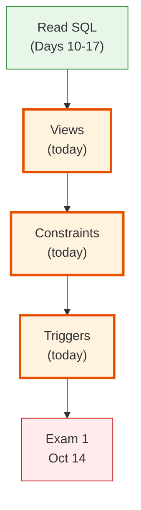
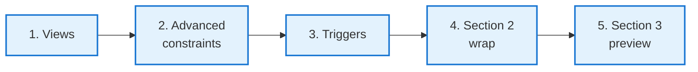
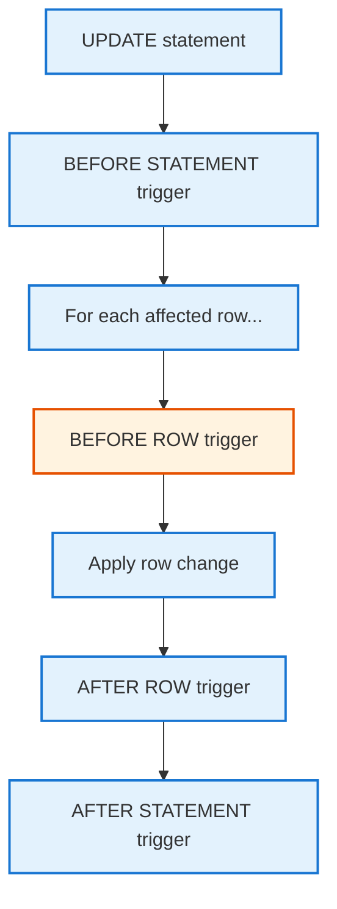
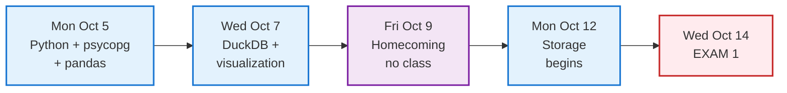

<!-- _class: lead -->

# Day 18: Views, Constraints, and Triggers

**COP 5725 - Database Management Systems**
Friday, October 2, 2026

Three production features close Section 2.

<!--
Full 50 min lecture: 12 min views, 12 min advanced constraints, 16 min triggers, 10 min wrap and Section 3 preview. Use clicker checks at the end of each feature to gauge comprehension before moving on. No paper quiz.
-->

---

# Where We Are

<div class="columns-left-wide">
<div>

Section 2 closes today.

Three weeks of SQL so far has read the database. Today's three features shape how the database stores, protects, and reacts to data.

- Views are named queries the database treats like tables.
- Advanced constraints encode invariants beyond column types.
- Triggers run automatically when data changes.

Exam 1 in two weeks covers everything in Sections 1-3.

</div>
<div>



</div>
</div>

---

# Today's Roadmap



Reference: Textbook §8.1-8.2, p. 341 (views) and §7.1-7.2, §7.5, p. 311 (constraints and triggers). The PostgreSQL docs cover the PostgreSQL-specific features.

---

<!-- _class: lead -->

# Part 1: Views

---

# CREATE VIEW

```sql
CREATE VIEW active_enrollments AS
SELECT e.student_id, e.course_id, e.section_num, e.term, s.name AS student, c.title
FROM   enrollment e
JOIN   student s USING (student_id)
JOIN   course  c USING (course_id)
WHERE  e.grade IS NULL;
```

A view is a **named SELECT**. The database treats it like a table; the SQL behind it runs each time the view is queried.

```sql run
CREATE OR REPLACE TABLE student(student_id INT, name TEXT);
INSERT INTO student VALUES (1,'Ada'),(2,'Bose'),(3,'Ana'),(4,'Devi');
CREATE OR REPLACE TABLE course(course_id TEXT, title TEXT);
INSERT INTO course VALUES ('COP5725','Database Management'),('COP5536','Data Structures');
CREATE OR REPLACE TABLE enrollment(student_id INT, course_id TEXT, section_num INT, term TEXT, grade TEXT);
INSERT INTO enrollment VALUES
  (1,'COP5725',1,'Fall2026',NULL), (2,'COP5725',1,'Fall2026','A'),
  (3,'COP5536',1,'Fall2026',NULL), (4,'COP5725',1,'Fall2026',NULL);
CREATE OR REPLACE VIEW active_enrollments AS
SELECT e.student_id, e.course_id, e.section_num, e.term, s.name AS student, c.title
FROM   enrollment e
JOIN   student s USING (student_id)
JOIN   course  c USING (course_id)
WHERE  e.grade IS NULL;
-- @query
SELECT * FROM active_enrollments WHERE student LIKE 'A%';
```

The query is rewritten to use the view's underlying SELECT. Textbook §8.1, p. 341. Reference: [PostgreSQL docs CREATE VIEW](https://www.postgresql.org/docs/current/sql-createview.html).

---

# Why Views

<div class="columns">
<div>

### Encapsulation

A view hides join complexity. Code that consumes `active_enrollments` need not know about the underlying three-table join.

### Naming

A well-named view documents an important business concept.

</div>
<div>

### Permissions

Grant SELECT on a view to users who should not see the underlying tables.

### Stability

The view's column list survives schema changes that add columns to the underlying tables.

</div>
</div>

---

# Updatable Views in PostgreSQL

```sql
-- Simple views are auto-updatable
CREATE VIEW recent_students AS
SELECT student_id, name, gpa FROM student WHERE gpa > 3.0;

INSERT INTO recent_students VALUES (100, 'Test', 3.5);  -- works
UPDATE recent_students SET gpa = 3.6 WHERE student_id = 100;   -- works
DELETE FROM recent_students WHERE student_id = 100;            -- works
```

PostgreSQL's "simple updatable view" rules cover views with a single base table, no aggregation, no DISTINCT, no GROUP BY, no UNION.

For anything more complex, use an `INSTEAD OF` trigger (Part 3) to define your own update semantics. Textbook §8.2.2, p. 345. Reference: [PostgreSQL docs CREATE VIEW, Updatable Views](https://www.postgresql.org/docs/current/sql-createview.html#SQL-CREATEVIEW-UPDATABLE-VIEWS).

---

# Materialized Views

```sql
CREATE MATERIALIZED VIEW dept_stats AS
SELECT dname,
       count(*)        AS faculty_count,
       avg(salary)     AS mean_salary,
       sum(salary)     AS total_payroll
FROM   faculty
GROUP BY dname;

CREATE UNIQUE INDEX dept_stats_dname_idx ON dept_stats(dname);

-- Refresh on demand
REFRESH MATERIALIZED VIEW dept_stats;

-- Refresh without blocking readers (requires unique index)
REFRESH MATERIALIZED VIEW CONCURRENTLY dept_stats;
```

A **materialized view** stores the query's result. Reads hit the cache, not the underlying tables.

The tradeoff is fast reads against stale data until the next refresh.

<!--
Materialized views are the PostgreSQL answer to denormalization (Day 9 follow-up). They cache the result of an expensive query and refresh on demand. Used heavily in reporting workloads.
-->

---

<!-- _class: lead -->

# Part 2: Advanced Constraints

---

# EXCLUDE Constraints

```sql
CREATE EXTENSION IF NOT EXISTS btree_gist;

CREATE TABLE room_booking (
  id        bigserial PRIMARY KEY,
  room      text NOT NULL,
  during    tstzrange NOT NULL,
  EXCLUDE USING gist (
    room WITH =,
    during WITH &&
  )
);
```

`EXCLUDE` rejects rows that violate a relation (here, `&&` = "ranges overlap").

The constraint reads "no two bookings can share a room and an overlapping time."

A PostgreSQL feature, not standard SQL. Reference: [Ch. 5.4 Constraints / EXCLUDE](https://www.postgresql.org/docs/current/ddl-constraints.html#DDL-CONSTRAINTS-EXCLUSION).

<!--
EXCLUDE constraints are one of PostgreSQL's most powerful features. They encode "no two rows can ever be like this" in a way that triggers and application code cannot easily reproduce. Use them for scheduling, resource reservation, and any "no double-booking" rule.
-->

---

# DEFERRABLE Foreign Keys

```sql
CREATE TABLE node (
  id        bigint PRIMARY KEY,
  parent_id bigint REFERENCES node(id) DEFERRABLE INITIALLY DEFERRED
);

BEGIN;
INSERT INTO node VALUES (1, 2);  -- references not-yet-inserted row
INSERT INTO node VALUES (2, 1);  -- circular
COMMIT;                          -- both FKs check at commit time
```

`DEFERRABLE INITIALLY DEFERRED` postpones FK checking until commit. Textbook §7.1.3, p. 315.

Useful for:
- Circular references inserted in one transaction
- Bulk loads where parents arrive after children
- ETL pipelines that want atomic constraint enforcement

---

# CHECK Revisited

```sql
CREATE TABLE invoice (
  invoice_id bigint PRIMARY KEY,
  amount     numeric(12, 2) NOT NULL,
  paid_at    timestamptz,
  refunded   boolean NOT NULL DEFAULT false,

  CHECK (amount > 0),
  CHECK (refunded = false OR paid_at IS NOT NULL),
  CHECK (paid_at IS NULL OR paid_at <= now())
);
```

`CHECK` constraints encode invariants the schema can prove without a subquery.

PostgreSQL allows `CHECK` to reference only the row being inserted/updated. Cross-row invariants need a trigger. Textbook §7.2, p. 319.

---

<!-- _class: lead -->

# Part 3: Triggers

---

# CREATE TRIGGER

```sql
CREATE TABLE student_audit (
  audit_id   bigserial PRIMARY KEY,
  changed_at timestamptz NOT NULL DEFAULT now(),
  changed_by text NOT NULL,
  student_id        bigint NOT NULL,
  before_gpa numeric(3, 2),
  after_gpa  numeric(3, 2)
);

CREATE OR REPLACE FUNCTION log_student_gpa_change()
RETURNS trigger LANGUAGE plpgsql AS $$
BEGIN
  IF OLD.gpa IS DISTINCT FROM NEW.gpa THEN
    INSERT INTO student_audit (changed_by, student_id, before_gpa, after_gpa)
    VALUES (current_user, OLD.student_id, OLD.gpa, NEW.gpa);
  END IF;
  RETURN NEW;
END;
$$;

CREATE TRIGGER student_gpa_audit
AFTER UPDATE OF gpa ON student
FOR EACH ROW EXECUTE FUNCTION log_student_gpa_change();
```

Textbook §7.5, p. 332. References: [PostgreSQL docs Triggers](https://www.postgresql.org/docs/current/triggers.html), [PL/pgSQL](https://www.postgresql.org/docs/current/plpgsql.html).

---

# Trigger Lifecycle



The four combinations of BEFORE/AFTER and STATEMENT/ROW cover every needed timing.

`BEFORE ROW` triggers can **modify** the new row before insertion; `AFTER ROW` triggers can only react.

---

# When Triggers Are the Wrong Answer

<div class="columns">
<div>

### Right use cases

- Audit logs
- Maintained denormalization (cache columns)
- INSTEAD OF triggers on complex views
- Cross-row invariants that CHECK cannot express

</div>
<div>

### Wrong use cases

- Business logic that the application should own
- Sending emails or making HTTP requests (use the application; triggers run inside the transaction)
- Cascading updates that ON DELETE CASCADE handles
- Anything you wouldn't want running silently in the middle of every UPDATE

</div>
</div>

> The rule of thumb: a trigger should be invisible. If users have to know it exists to debug behavior, replace it with explicit application logic.

<!--
Triggers are powerful and dangerous. Real production outages have come from triggers that send emails (when the transaction rolls back, the email is already sent) or make HTTP calls (locking up the row for minutes). Use them only for invariant enforcement and auditing.
-->

---

<!-- _class: lead -->

# Part 4: Section 2 Wrap

---

# Section 2 Summary

<div class="columns-3">
<div>

### Core SQL

- DDL, basic SELECT
- Six join kinds + LATERAL
- Aggregation with FILTER and GROUPING SETS
- Subqueries (3 kinds) and CTEs

</div>
<div>

### Advanced SQL

- Window functions with frames
- Ranking and per-row group stats
- Period-over-period via LAG/LEAD
- Recursive CTEs for trees and graphs

</div>
<div>

### Schema features

- Views and materialized views
- EXCLUDE constraints
- DEFERRABLE FKs
- Triggers (when invisible)

</div>
</div>

<!--
This is the exam-scope checklist for Section 2. Point students to the practice packet (Oct 7) for coverage of each column.
-->

---

# Section 3 Preview



Exam 1 covers Sections 1-3. Practice exam packet released Wed Oct 7.

---

# After Today

<div class="columns">
<div>

### This week

- Section 3 (Programming) opens Monday
- Project 2 due Oct 23; it uses today's material heavily

</div>
<div>

### Coming up

- **Exam 1** on Wed Oct 14
- Practice exam packet releases Wed Oct 7
- No class Fri Oct 9 (Homecoming)

</div>
</div>

Have a good weekend.

---

# Questions

What is on your mind?

<!--
Section 2 closes. The cumulative test of Sections 1-3 comes in two weeks on Exam 1.
-->
