<!-- _class: lead -->

# Day 2: Database History

**COP 5725 - Database Management Systems**
Monday, August 24, 2026

How we got from punched cards to PostgreSQL and DuckDB

<!--
First content class. The point is pattern recognition, not memorization.
Pace: 50 min. Aim for ~5 min per era. Lean into the human stories — the oral histories, Stonebraker's 80th, the Bell Labs golden age. Students remember people more than dates.
-->

---

# Why Database History

Three reasons to know the history:

1. **Pattern recognition.** Old fights and technologies repeat. The NoSQL/NewSQL fight is the 1970s navigational/relational fight all over again.
2. **Vocabulary.** Words like *page*, *log*, *catalog*, *tuple* are rooted in historical systems from a specific decade.
3. **Depth.** The database community expects you to know the past. Most "new" database ideas were tried before. Some lost. Some lost twice.

<!--
The Stonebraker + Pavlo paper "What Goes Around Comes Around... And Around" (SIGMOD Record, June 2024) is the source text for this lecture. It is the sequel to Stonebraker's 2005 "What Goes Around Comes Around" — both argue that data model fights repeat. Worth namedropping at the start.
-->

---

# Roadmap

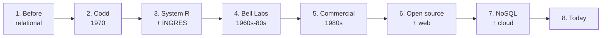
```mermaid
graph LR
  A["1. Before<br/>relational"] --> B["2. Codd<br/>1970"]
  B --> C["3. System R<br/>+ INGRES"]
  C --> D["4. Bell Labs<br/>1960s-80s"]
  D --> E["5. Commercial<br/>1980s"]
  E --> F["6. Open source<br/>+ web"]
  F --> G["7. NoSQL<br/>+ cloud"]
  G --> H["8. Today"]
```

<!--
The Bell Labs section is new; it explains where the operating environment that runs every modern DB came from. Mention up front that I'll explain why a "phone company research lab" matters for databases.
-->

---

# Sixty Years of Databases

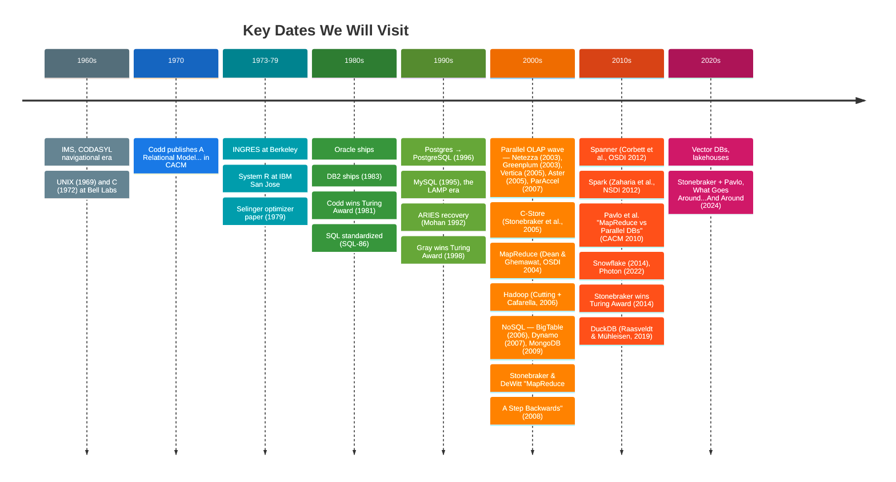
```mermaid
%%{init: {'theme':'base', 'themeVariables': {
  'cScale0':'#546e7a', 'cScaleLabel0':'#ffffff',
  'cScale1':'#1565c0', 'cScaleLabel1':'#ffffff',
  'cScale2':'#00838f', 'cScaleLabel2':'#ffffff',
  'cScale3':'#2e7d32', 'cScaleLabel3':'#ffffff',
  'cScale4':'#558b2f', 'cScaleLabel4':'#ffffff',
  'cScale5':'#ef6c00', 'cScaleLabel5':'#ffffff',
  'cScale6':'#d84315', 'cScaleLabel6':'#ffffff',
  'cScale7':'#ad1457', 'cScaleLabel7':'#ffffff'
}}}%%
timeline
  title Key Dates We Will Visit
  1960s : IMS, CODASYL navigational era
        : UNIX (1969) and C (1972) at Bell Labs
  1970 : Codd publishes A Relational Model... in CACM
  1973-79 : INGRES at Berkeley
          : System R at IBM San Jose
          : Selinger optimizer paper (1979)
  1980s : Oracle ships
        : DB2 ships (1983)
        : Codd wins Turing Award (1981)
        : SQL standardized (SQL-86)
  1990s : Postgres → PostgreSQL (1996)
        : MySQL (1995), the LAMP era
        : ARIES recovery (Mohan 1992)
        : Gray wins Turing Award (1998)
  2000s : Parallel OLAP wave — Netezza (2003), Greenplum (2003), Vertica (2005), Aster (2005), ParAccel (2007)
        : C-Store (Stonebraker et al., 2005)
        : MapReduce (Dean & Ghemawat, OSDI 2004)
        : Hadoop (Cutting + Cafarella, 2006)
        : NoSQL — BigTable (2006), Dynamo (2007), MongoDB (2009)
        : Stonebraker & DeWitt "MapReduce: A Step Backwards" (2008)
  2010s : Spanner (Corbett et al., OSDI 2012)
        : Spark (Zaharia et al., NSDI 2012)
        : Pavlo et al. "MapReduce vs Parallel DBs" (CACM 2010)
        : Snowflake (2014), Photon (2022)
        : Stonebraker wins Turing Award (2014)
        : DuckDB (Raasveldt & Mühleisen, 2019)
  2020s : Vector DBs, lakehouses
        : Stonebraker + Pavlo, What Goes Around...And Around (2024)
```

<!--
This is the spine of the lecture. Every slide that follows lands on one of these dates. The Turing Awards aren't decorative — they mark moments when the field recognized that a particular set of ideas had won. Codd (relational), Gray (transactions), Stonebraker (systems building).
-->

---

<!-- _class: lead -->

# Part 1: Before the Relational Model

---

# The Problem in 1960

Computers had files.
Applications had pointers into files.
Adding a new query meant editing the file layout — or writing a new program.

Two responses emerged:

- **Hierarchical:** data as a tree. IBM's IMS (1968), built for Apollo.
- **Network:** data as a graph. CODASYL DBTG (1969).

Both expressed queries as **navigation**.

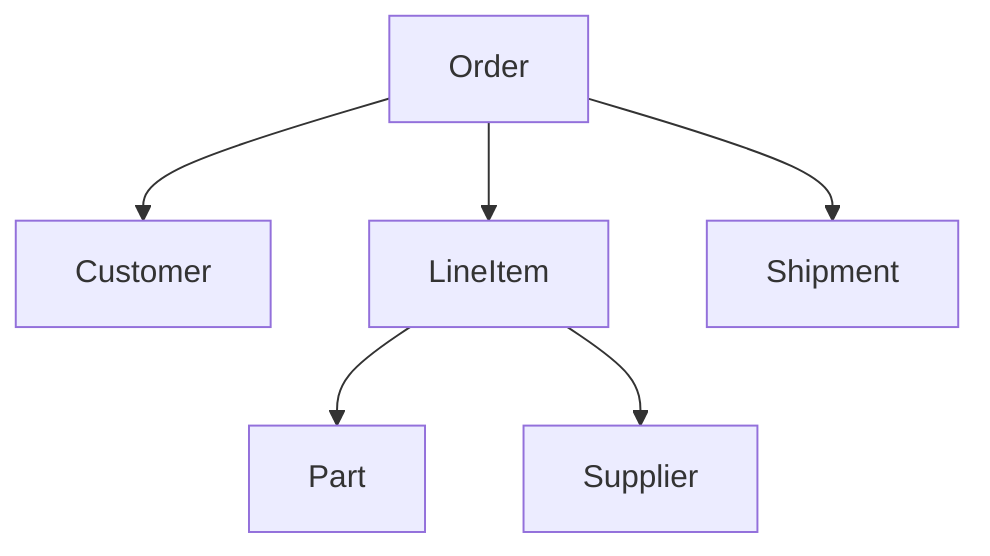
```mermaid
graph TD
  H["Order"] --> C["Customer"]
  H --> L["LineItem"]
  L --> P["Part"]
  L --> S["Supplier"]
  H --> Sh["Shipment"]
```

IMS-style hierarchy. A query walks pointers.

<!--
IMS was built for NASA's Apollo program to manage the bill of materials for the Saturn V rocket. Worth a sentence — the first major commercial DBMS was, literally, built to put humans on the moon.
-->

---

# The Navigational Cost

Adding a query meant:

1. Editing the schema (the physical layout)
2. Recompiling application programs
3. Often: a multi-day batch load to migrate

> The complaint that drove the relational era was not "this is slow."
> It was **"this is brittle."**

<!--
Stonebraker tells the story in his 2024 paper: customers calling vendors begging for new query capabilities, only to be told it would be a 6-month engineering project. Codd's bet was that you could compile away the navigation.
-->

---

<!-- _class: lead -->

# Part 2: Codd's 1970 Paper

---

# Edgar F. "Ted" Codd

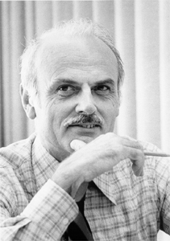

Edgar F. Codd (1923-2003)
IBM San Jose Research Laboratory
1981 Turing Award

- British-American mathematician
- Joined IBM in 1949
- 1965: started thinking about relational model
- 1970: published *A Relational Model of Data for Large Shared Data Banks* in CACM
- 1981: Turing Award for the relational model
- 1985: published [Codd's 12 Rules](https://en.wikipedia.org/wiki/Codd%27s_twelve_rules) for relational DBMSes

<!--
Codd spent the late 1960s convincing his own employer that the relational model was worth pursuing. The 1970 paper was preceded by an internal IBM technical report (1969) that nearly didn't get external publication clearance. He had to fight for the right to publish.
-->

---

# Codd, 1970

> Edgar F. Codd, *A Relational Model of Data for Large Shared Data Banks*.
> Communications of the ACM, June 1970.
> [PDF](https://ufdatastudio.com/cop5725fa26/papers/pdfs/codd1970.pdf)

A short paper (11 pages) proposing:

- Data as **relations** — unordered sets of tuples with named attributes
- Queries as expressions over relations, not navigation
- A separation between the **logical** schema users see and the **physical** layout the system manages

This is now obvious. In 1970, it was radical.

<!--
Internal IBM resistance was substantial — IMS was the cash cow. The Wisconsin academic community picked up the relational ideas faster than IBM did, which is partly why Berkeley (with Stonebraker) ended up building the second relational prototype.
-->

---

# Before and After Codd

### Before Codd

- You walk the data structure
- You change your code when storage changes
- You name pointers

### After Codd

- The system walks the data structure
- The system updates a plan; your code is unchanged
- You name relations and attributes

> The trade is **data independence**: the right to change physical layout without changing application code.

<!--
Data independence is the single most important idea in the course. Every later topic — indexing, optimization, MVCC, distribution — exists to preserve it under pressure.
-->

---

# The Algebra Underneath

Codd defined a small algebra:

- $\sigma$ (select rows)
- $\pi$ (project columns)
- $\bowtie$ (join)
- $\cup, \cap, -$ (set ops)
- $\times$ (cross product)

We spend Friday and next Monday on this algebra. SQL compiles down to it.

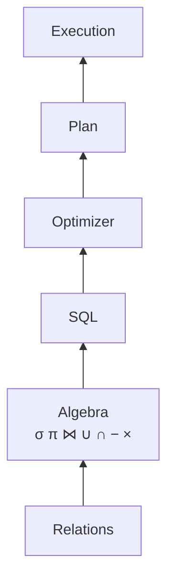
```mermaid
graph BT
  R["Relations"] --> A["Algebra<br/>σ π ⋈ ∪ ∩ − ×"]
  A --> S["SQL"]
  S --> O["Optimizer"]
  O --> P["Plan"]
  P --> X["Execution"]
```

---

<!-- _class: lead -->

# Part 3: System R, INGRES, and the First SQL Engines

---

# System R (1974-1979)

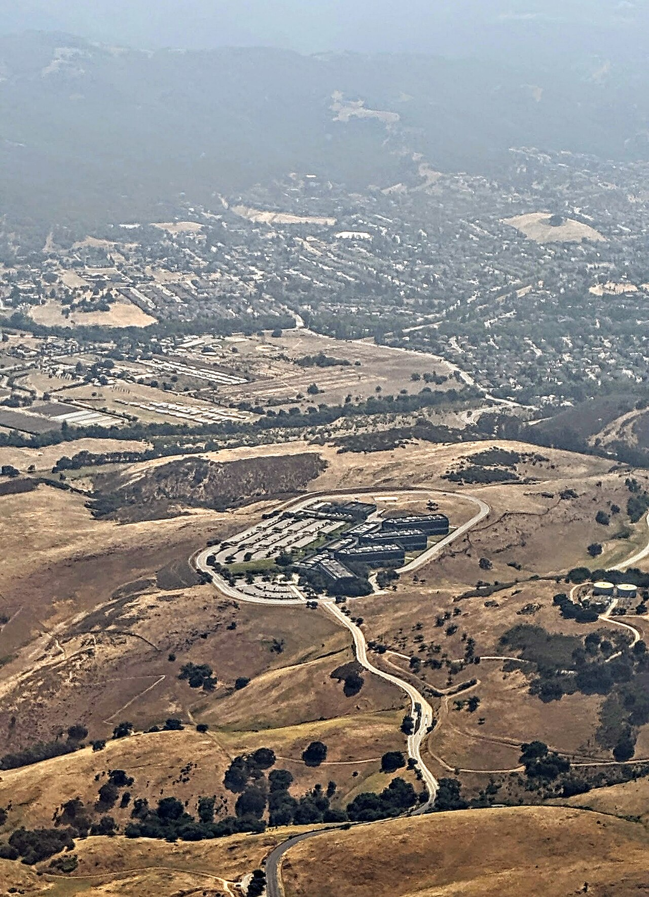

IBM San Jose Research Laboratory
(later relocated to Almaden, Calif.)

Team included:

- **Don Chamberlin** — SQL co-designer
- **Ray Boyce** — SQL co-designer, BCNF (died young, 1974)
- **Pat Selinger** — query optimization
- **Mike Blasgen** — buffer management
- **Jim Gray** — transactions

System R contributed to almost every database concept we will study.

<!--
Ray Boyce died at 27 of a brain aneurysm before SQL became famous. Boyce-Codd Normal Form (BCNF) carries his name. Worth a brief moment of acknowledgment when we cover BCNF in Week 4.
-->

---

# System R: What It Gave Us

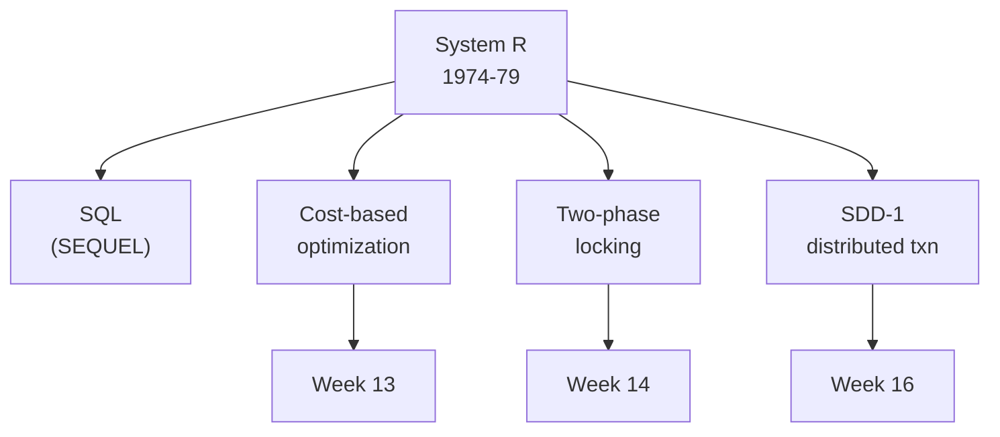
```mermaid
graph TD
  SR["System R<br/>1974-79"] --> SQL["SQL<br/>(SEQUEL)"]
  SR --> QO["Cost-based<br/>optimization"]
  SR --> CC["Two-phase<br/>locking"]
  SR --> DR["SDD-1<br/>distributed txn"]
  QO --> Week13["Week 13"]
  CC --> Week14["Week 14"]
  DR --> Week16["Week 16"]
```

<!--
The "weeks N" pointers are deliberate: System R is the source of half this course. Hold this slide an extra moment.
-->

---

# Pat Selinger and the Optimizer

Patricia Selinger
2002 SIGMOD Innovations Award

Lead author of the 1979 paper that defined cost-based query optimization:

> *Access Path Selection in a Relational Database Management System.* SIGMOD 1979.

Selinger's optimizer is the architectural blueprint inside PostgreSQL, DB2, Oracle, and almost every other relational engine today.

[Interview: *Pat Selinger Speaks Out* — Winslett, SIGMOD Record](https://sigmodrecord.org/2003/12/11/interview-with-pat-selinger/)

<!--
We'll read sections of the Selinger paper in Week 13. The 2015 Leis paper "How Good Are Query Optimizers, Really?" is the modern follow-up that says Selinger's framework still works but the cost models inside it are surprisingly fragile.
-->

---

# Jim Gray and Transactions

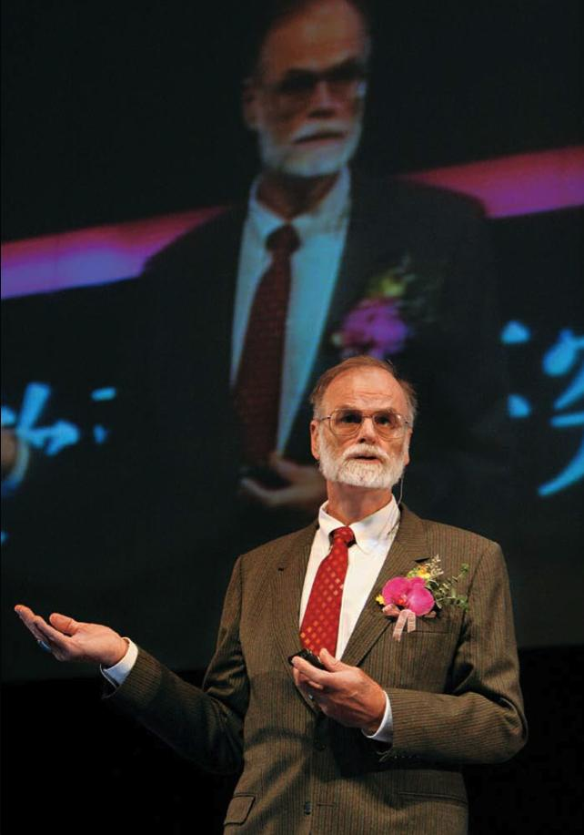

Jim Gray (1944-2007)
1998 Turing Award

The conceptual architect of transactions:

- Coined ACID
- Two-phase locking
- "Notes on Database Operating Systems" (1978) — still the definitive reference

Lost at sea January 28, 2007 while sailing solo off the California coast.

[Interview: *Jim Gray Speaks Out* — Winslett, SIGMOD Record](https://sigmodrecord.org/2003/03/15/interview-with-jim-gray/) (his last published interview)

The database community mourns him every year.

<!--
Gray's "Notes on Database Operating Systems" is one of the great essays in computer science. We assign excerpts of it for Section 6. Brief moment to acknowledge the loss is appropriate.
-->

---

# INGRES (1973-1980)

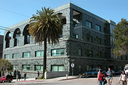

UC Berkeley
Stonebraker / Wong / Held team

A second relational prototype, developed in parallel with System R but with a different query language: **QUEL**.

Two outcomes:

- INGRES the company (1980), surviving today as Actian X
- **Postgres** (1986), Stonebraker's follow-up

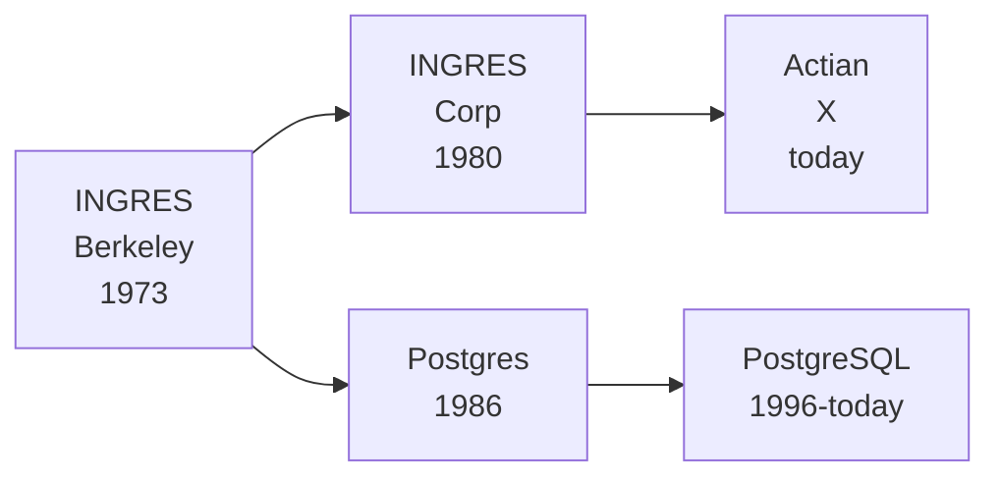
```mermaid
graph LR
  I["INGRES<br/>Berkeley<br/>1973"] --> IC["INGRES<br/>Corp<br/>1980"]
  I --> PG["Postgres<br/>1986"]
  PG --> PGSQL["PostgreSQL<br/>1996-today"]
  IC --> AX["Actian<br/>X<br/>today"]
```

<!--
The Berkeley/IBM rivalry shaped a generation of database engineers. Stonebraker frequently tells the story of being told by IBM lawyers to stop using "INGRES" because IBM had trademarked the term — except IBM hadn't, and the lawyers were bluffing. Berkeley kept the name.
-->

---

# The SQL Wars Ended Quickly

QUEL was arguably the cleaner language. SQL won.

QUEL was more compact and used operators like `retrieve` instead of `select`, making it feel more mathematical. SQL was more English-like and explicit, which made it more approachable for business users.

Why did SQL win? IBM shipped SQL/DS in 1981 and DB2 in 1983.
Oracle shipped a SQL implementation in 1979 — before IBM did.

By 1986 ANSI ratified SQL-86. The language that came out of System R became *the* language for relational systems.

We write SQL exclusively. But QUEL is worth a Wikipedia tab in your spare time.

<!--
"Worse-is-better" applies cleanly here: the inferior-but-shipped language beat the better-but-late one. The story repeats with JavaScript, C, and many other languages. Don Chamberlin's 2012 ACM oral history interview discusses why he designed SQL the way he did — natural language influence from his earlier work at IBM.
-->

---

# From System R to IBM DB2

DB2 was the commercial version of System R, moving it from research prototype into IBM's mainframe customer base. By 1990 it runs the back office of most major banks, insurers, airlines, and clearing houses, and a large fraction of those workloads still run on it today.

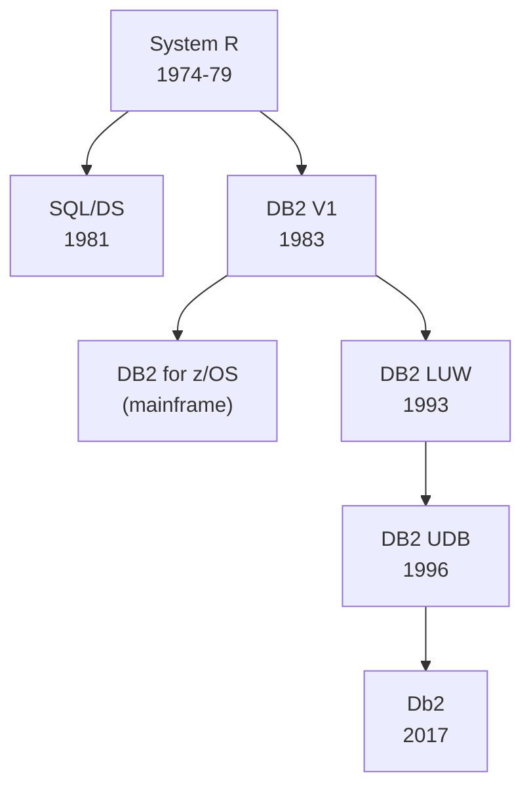
```mermaid
graph TD
  SR["System R<br/>1974-79"] --> SDS["SQL/DS<br/>1981"]
  SR --> DB2["DB2 V1<br/>1983"]
  DB2 --> ZOS["DB2 for z/OS<br/>(mainframe)"]
  DB2 --> LUW["DB2 LUW<br/>1993"]
  LUW --> UDB["DB2 UDB<br/>1996"]
  UDB --> Db2["Db2<br/>2017"]
```

Three IBM platforms each shipped their own DB2 lineage; they converged gradually after 1996.

<!--
DB2 is often invisible to students because it lives behind ATMs, ticketing systems, and clearing houses rather than consumer web apps. The IBM mainframe still processes a large share of the world's financial transactions, and DB2 sits at the center of that workload. Three pieces of this course came directly out of DB2 development at IBM Almaden: Mohan's ARIES recovery (Week 14), Selinger-style cost-based optimization (Week 13), and most of the SQL surface that later became the ANSI standard.
-->

---

# SQL Standards over the Years

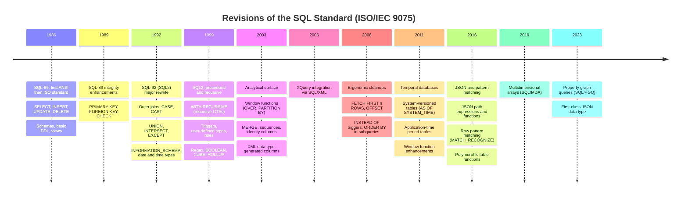
```mermaid
timeline
  title Revisions of the SQL Standard (ISO/IEC 9075)
  1986 : SQL-86, first ANSI then ISO standard
       : SELECT, INSERT, UPDATE, DELETE
       : Schemas, basic DDL, views
  1989 : SQL-89 integrity enhancements
       : PRIMARY KEY, FOREIGN KEY, CHECK
  1992 : SQL-92 (SQL2) major rewrite
       : Outer joins, CASE, CAST
       : UNION, INTERSECT, EXCEPT
       : INFORMATION_SCHEMA, date and time types
  1999 : SQL3, procedural and recursive
       : WITH RECURSIVE (recursive CTEs)
       : Triggers, user-defined types, roles
       : Regex, BOOLEAN, CUBE, ROLLUP
  2003 : Analytical surface
       : Window functions (OVER, PARTITION BY)
       : MERGE, sequences, identity columns
       : XML data type, generated columns
  2006 : XQuery integration via SQL/XML
  2008 : Ergonomic cleanups
       : FETCH FIRST n ROWS, OFFSET
       : INSTEAD OF triggers, ORDER BY in subqueries
  2011 : Temporal databases
       : System-versioned tables (AS OF SYSTEM_TIME)
       : Application-time period tables
       : Window function enhancements
  2016 : JSON and pattern matching
       : JSON path expressions and functions
       : Row pattern matching (MATCH_RECOGNIZE)
       : Polymorphic table functions
  2019 : Multidimensional arrays (SQL/MDA)
  2023 : Property graph queries (SQL/PGQ)
       : First-class JSON data type
```

<!--
The standard moves slowly and vendors ship ahead of it, but the standard's vocabulary is what survives across engines. PostgreSQL implements most of SQL:2016 plus selected features from later revisions; DuckDB tracks the modern shape closely. We anchor SQL details on PostgreSQL documentation in this course rather than the standard text itself, because the standard is paywalled and the docs are precise about what actually executes. We work through CTEs (1999) and window functions (2003) in Week 6, JSON (2016) and temporal queries (2011) in Week 7.
-->

---

<!-- _class: lead -->

# Part 4: Bell Labs

---

# Bell Labs Innovation Hub

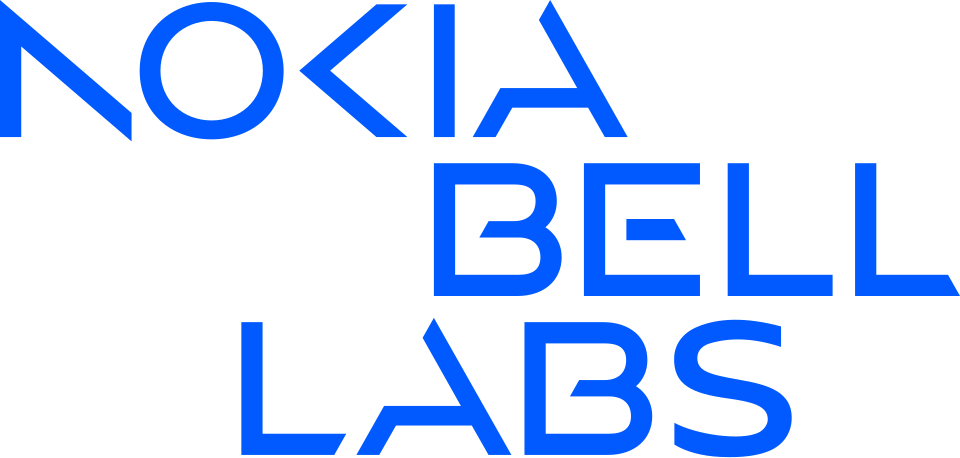

Bell Labs Murray Hill, NJ
The birthplace of the transistor, UNIX, and C

No relational database was invented at Bell Labs.

But almost every relational database **runs on Bell Labs technology**, was written in a Bell Labs language, and was parsed by Bell Labs tools.

The 1960s-80s Bell Labs computing group is the silent infrastructure of our field.

<!--
Students often don't realize how much of the modern computing stack came out of one industrial research lab. Spend a moment on the framing.
-->

---

# What Bell Labs Built

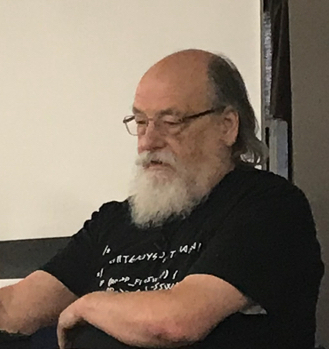

Ken Thompson and Dennis Ritchie at a PDP-11

- **UNIX** (1969) — Thompson, Ritchie
- **C** (1972) — Ritchie
- **awk** (1977) — Aho, Weinberger, Kernighan
- **lex / yacc** — Lesk, Johnson
- **C++** (1979) — Stroustrup
- **S** (1976) — Becker, Chambers (statistics; ancestor of R)

<!--
The S language was designed for statistical computing and became the parent of R, which today is one of the two languages every data scientist uses. The Bell Labs influence extends beyond systems into analytics.
-->

---

# How Bell Labs Touches Every Database You Use

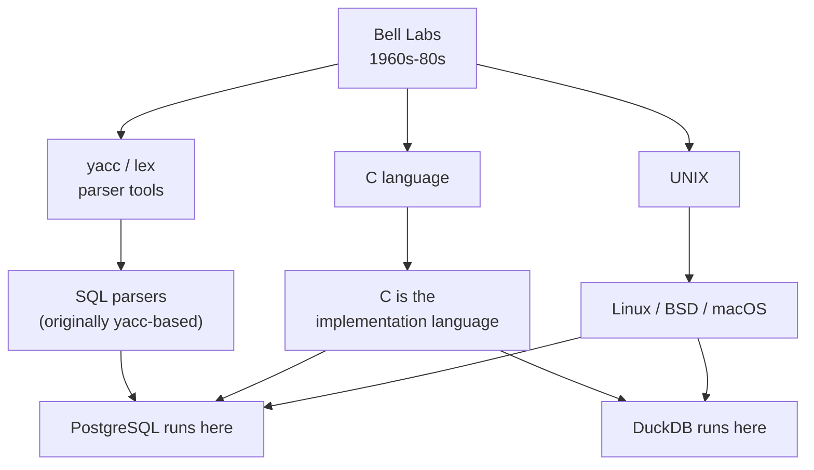
```mermaid
graph TD
  BL["Bell Labs<br/>1960s-80s"] --> UN["UNIX"]
  BL --> CC["C language"]
  BL --> YL["yacc / lex<br/>parser tools"]
  UN --> LIN["Linux / BSD / macOS"]
  CC --> CCImpl["C is the<br/>implementation language"]
  YL --> SQLParse["SQL parsers<br/>(originally yacc-based)"]
  LIN --> PG["PostgreSQL runs here"]
  LIN --> DD["DuckDB runs here"]
  CCImpl --> PG
  CCImpl --> DD
  SQLParse --> PG
```

<!--
PostgreSQL's parser was originally generated with yacc (now bison, the GNU equivalent). The lexer was lex (now flex). This is the lineage every relational engine shares.
-->

---

# Jeff Ullman, Al Aho, and the Theoretical Bridge

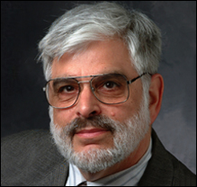

Jeffrey Ullman and Alfred Aho
Bell Labs alumni, then Stanford and Columbia

- **Ullman** — Bell Labs 1966-1969, then Stanford
- **Aho** — Bell Labs 1967-1995, then Columbia

Together they wrote:

- *Principles of Compiler Design* (1977) — the Dragon Book
- *Principles of Database Systems* (1980)
- *Foundations of Computer Science* (1992)

Ullman is a coauthor of **our textbook**.

<!--
The Ullman/Aho connection brings the lecture full circle: the textbook we use is written by a Bell Labs alum. The "Bell Labs golden age" produced the people who in turn wrote the books that taught a generation of database researchers, including everyone listed on this slide so far.
-->

---

# Daytona: Bell Labs' Own DBMS

AT&T built **Daytona** starting in 1989 to manage the company's billing data.

By the late 1990s it held what was, at the time, the largest commercial database in the world.

Daytona was never relational in the strict System R sense — its query language (Cymbal) had no SQL surface. It was optimized for time-series data and append-heavy telecom workloads.

> The lesson Daytona offered:
> when your workload is narrow enough, a purpose-built engine beats a general-purpose one.

This is the argument Stonebraker repeats almost verbatim in 2005's *"One Size Fits All"* and again in his 2024 paper with Pavlo.

<!--
Daytona was internal-only — students will not have heard of it. Its existence is the proof that even at the height of relational orthodoxy, specialized engines were paying off in production.
-->

---

<!-- _class: lead -->

# Part 5: The Commercial Era (1980s)

---

# The Big Five

By 1985 the commercial RDBMS market had its first generation of products.

| Vendor | Product | Notes |
|--------|---------|-------|
| Oracle | Oracle DB | First commercial SQL (1979) |
| IBM | DB2 | Direct from System R |
| Informix | Online | Cal-Berkeley alums |
| Sybase | SQL Server | Later licensed to MS |
| Ingres | Ingres | UC Berkeley spinoff |

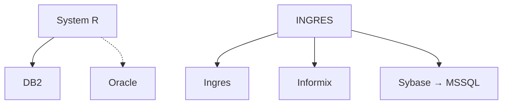
```mermaid
graph TD
  SR["System R"] --> DB2["DB2"]
  SR -.-> ORA["Oracle"]
  IN["INGRES"] --> INGC["Ingres"]
  IN --> INF["Informix"]
  IN --> SYB["Sybase → MSSQL"]
```

Each was a row-store, ACID-compliant, single-node, on-premise system.

<!--
Microsoft SQL Server's lineage runs through Sybase, then Microsoft. Some institutional knowledge from System R lives inside MSSQL today via the Sybase code base.
-->

---

# Oracle: The First Commercial SQL Database

**Larry Ellison**, Ed Oates, and Bob Miner founded **Relational Software Inc.** in 1977 to commercialize a prototype SQL database.

- **1979:** Oracle V2 ships (first commercial SQL product, beating IBM's DB2 by 4 years)
- **1982:** Renamed Oracle Corporation
- **1983:** Oracle V3 with distributed query processing
- **1985:** Oracle becomes the top commercial DBMS by revenue
- **1989:** Oracle 7 introduces triggers and stored procedures
- **1999:** Oracle 8i adds Java VM and XML support

Oracle's early SQL implementation and aggressive sales strategy captured significant market share in the 1980s.

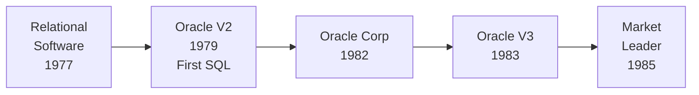
```mermaid
graph LR
  RSI["Relational<br/>Software<br/>1977"] --> OV2["Oracle V2<br/>1979<br/>First SQL"]
  OV2 --> OC["Oracle Corp<br/>1982"]
  OC --> OV3["Oracle V3<br/>1983"]
  OV3 --> Lead["Market<br/>Leader<br/>1985"]
```

---

# What 1980s DBs Got Right

### Durable Ideas

- **ACID transactions** as a contract — Jim Gray
- **Write-ahead logging** — ARIES, Mohan 1992
- **B+ tree indexes** as the universal access path
- **Cost-based optimization** as the operating mode

### What Got Wrong

- One size fits all
- The mainframe assumption (distribution stayed niche)
- The single-vendor assumption (every vendor invented their own SQL dialect)

---

<!-- _class: lead -->

# Part 6: Open Source and the Web (1990s)

---

# Michael Stonebraker

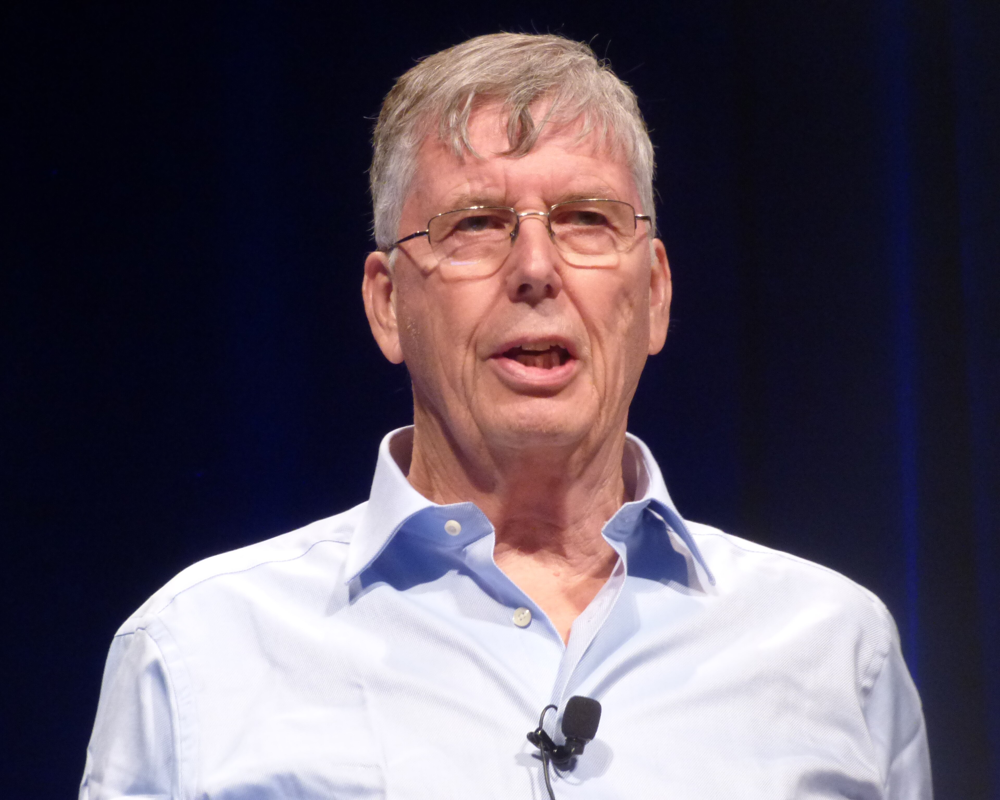

Michael Stonebraker
2014 Turing Award
Still active and publishing

Five commercial DBMSes he co-founded:

- **Ingres** (1980)
- **Postgres** (1986)
- **Illustra** (1992) — ORDBMS, acquired by Informix
- **Vertica** (2005) — C-Store commercialization
- **VoltDB** (2009) — in-memory OLTP

Plus SciDB, Tamr, and others.

[Interview: *Mike Stonebraker Speaks Out* — Winslett, SIGMOD Record](https://sigmodrecord.org/2003/06/15/interview-with-michael-stonebraker/)

<!--
Stonebraker famously argues that academic research without commercial follow-through is "tree falling in the forest." His five-company record is the embodiment of that view. The 2014 Turing Award citation called him "the most influential database researcher of his generation."
-->

---

# Stonebraker's Theme: One Size Does Not Fit All

Three critique papers:

- **2005** *"One Size Fits All": An Idea Whose Time Has Come and Gone* (CIDR)
- **2005** *What Goes Around Comes Around* (in *Readings in Database Systems*)
- **2024** *What Goes Around Comes Around... And Around* with Pavlo (SIGMOD Record)

The argument: workloads diverged in the 2000s (OLTP vs OLAP vs streaming vs graph vs vector), and "one general-purpose DBMS" gave up too much in each direction.

We will see the consequence in Section 7 — PostgreSQL + DuckDB is the working example of two specialized engines doing what one DBMS used to attempt.

<!--
Recommended reading after the course: the 2024 Pavlo & Stonebraker paper is the most accessible summary of 50 years of DB history written by people who lived it. Twenty pages. Free.
-->

---

# Postgres Becomes PostgreSQL

Stonebraker started Postgres at Berkeley in 1986 to extend the relational model with user-defined types and rules.

In 1996 the project added SQL and renamed itself **PostgreSQL**.

The repository moved from Berkeley to the volunteer community that still runs it today.

By the time you graduate, PostgreSQL will be the second-most-deployed RDBMS in the world.

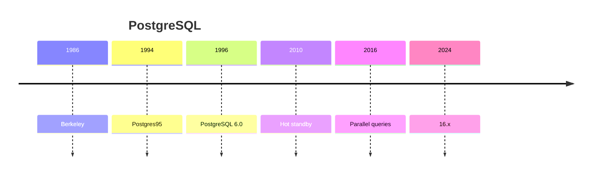
```mermaid
timeline
  title PostgreSQL
  1986 : Berkeley
  1994 : Postgres95
  1996 : PostgreSQL 6.0
  2010 : Hot standby
  2016 : Parallel queries
  2024 : 16.x
```

---

# MySQL and the LAMP Era

MySQL (1995) traded ACID guarantees for speed and simplicity.

It powered the early web — the L, A, M, P stack (Linux, Apache, MySQL, PHP) is the architecture of Wikipedia, early Facebook, and most of the 1998-2008 web.

MySQL also taught a generation that **defaults matter**. Its default storage engine (MyISAM, then InnoDB) shaped the assumptions of millions of developers.

<!--
The MyISAM-to-InnoDB transition is a teaching example: changing the default from a non-transactional to a transactional engine in MySQL 5.5 affected user code in subtle ways for years.
-->

---

# Object-Relational and Wide Tables

The 1990s also saw experiments that mostly failed:

### Object-oriented DBs
Objectivity, Versant, ObjectStore.

Persistent C++ objects.

### ORMs
Stayed in the app tier.

Hibernate, ActiveRecord, SQLAlchemy.

### XML DBs
Popular for a brief stretch.

Mostly gone.

Survivors live on as PostgreSQL's JSON support, its array types, and Oracle's user-defined types.

---

<!-- _class: lead -->

# Part 7: Web Scale — NoSQL, MapReduce, Parallel OLAP

---

# Why Web Scale Happened

Web-scale applications hit walls:

- A single relational DB could not handle Google's or Amazon's read/write rate
- ACID across geographies cost too much latency
- Schemas had to evolve faster than DDL migrations allowed

Engineers responded by dropping pieces of the relational contract.

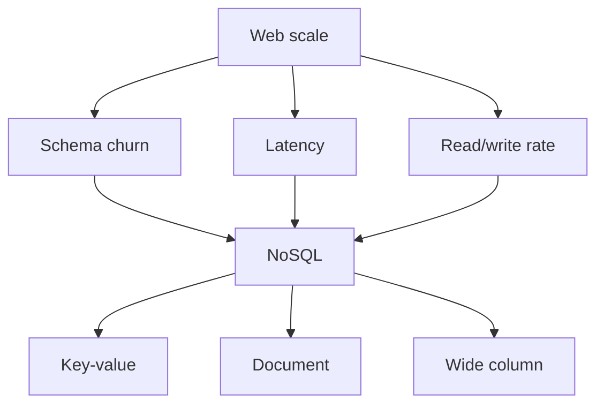
```mermaid
graph TD
  W["Web scale"] --> SC["Schema churn"]
  W --> LAT["Latency"]
  W --> RW["Read/write rate"]
  SC --> NS["NoSQL"]
  LAT --> NS
  RW --> NS
  NS --> KV["Key-value"]
  NS --> DOC["Document"]
  NS --> WC["Wide column"]
```

---

# The NoSQL Wave (2007-2012)

| System | Year | Dropped | Kept |
|--------|------|---------|------|
| **BigTable** (Google) | 2006 | SQL, full ACID | Wide tables, ordered scans |
| **Dynamo** (Amazon) | 2007 | SQL, strong consistency | Key-value, partitioning |
| **MongoDB** | 2009 | Schemas | JSON documents, indexes |
| **Cassandra** | 2008 | Single-master | Multi-DC replication |
| **Redis** | 2009 | Persistence-first | Data structures, latency |

Each kept what it needed. Each gave back something that turned out to matter.

---

# MongoDB: The Document Database

**MongoDB** (2009) emerged as the most commercially successful NoSQL database for web applications.

- **Core idea:** Store JSON-like documents instead of relational tuples
- **Schema-on-read:** Fields can vary within a collection
- **Built for:** Web apps with evolving schemas and semi-structured data
- **Trade-off:** Lost SQL querying but gained horizontal scalability and flexible data models

MongoDB's ease of use and driver libraries in every programming language made it the first NoSQL database most developers learned.

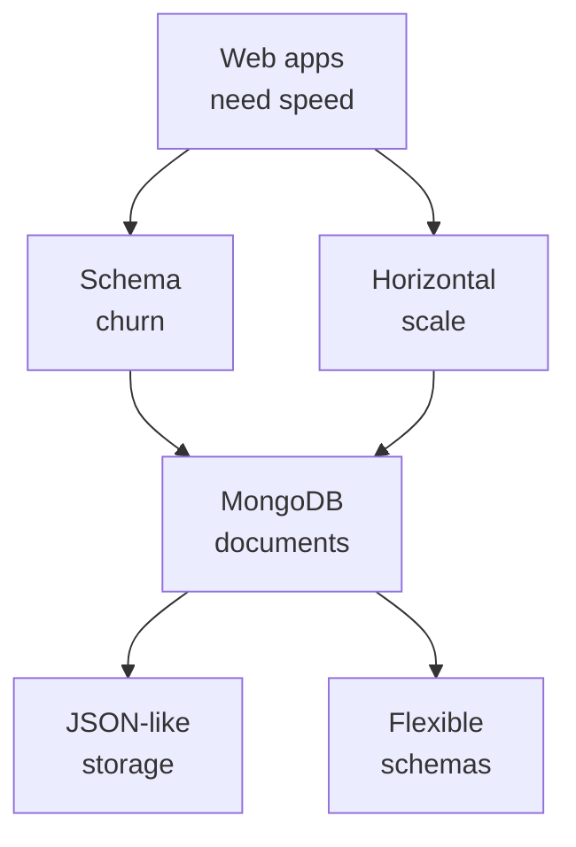
```mermaid
graph TD
  WEB["Web apps<br/>need speed"] --> SCHEMA["Schema<br/>churn"]
  WEB --> SCALE["Horizontal<br/>scale"]
  SCHEMA --> MONGO["MongoDB<br/>documents"]
  SCALE --> MONGO
  MONGO --> JSON["JSON-like<br/>storage"]
  MONGO --> FLEX["Flexible<br/>schemas"]
```

---

# The Parallel OLAP Boom

In parallel with NoSQL, the **analytical** side built its own architecture: MPP (massively parallel processing) shared-nothing warehouses.

| Vendor | Year | Innovation |
|--------|------|------------|
| Teradata | 1979 | The original MPP warehouse |
| Netezza | 2003 | Appliance + FPGA acceleration |
| Greenplum | 2003 | Postgres-based MPP |
| Vertica | 2005 | C-Store commercialized |
| Aster Data | 2005 | SQL + MapReduce hybrid |
| ParAccel | 2007 | Columnar MPP (basis for Redshift) |

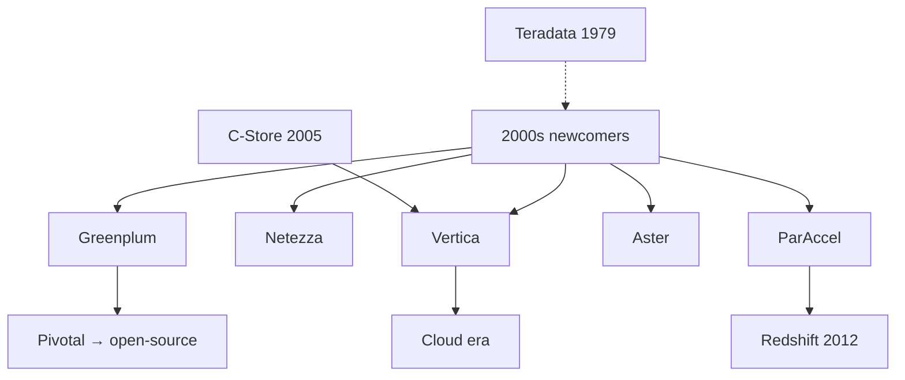
```mermaid
graph TD
  TD["Teradata 1979"] -.-> Newcomers["2000s newcomers"]
  C["C-Store 2005"] --> V["Vertica"]
  Newcomers --> N["Netezza"]
  Newcomers --> G["Greenplum"]
  Newcomers --> V
  Newcomers --> A["Aster"]
  Newcomers --> PP["ParAccel"]
  V --> CL["Cloud era"]
  PP --> RS["Redshift 2012"]
  G --> Pivotal["Pivotal → open-source"]
```

> Columns beat rows for analytics. The 2000s proved it commercially.

<!--
Many students will not have heard of Netezza, Greenplum, or Aster — these became acquisitions (IBM bought Netezza, EMC/Pivotal bought Greenplum, Teradata bought Aster). The companies are gone but their architectures live on inside Redshift, BigQuery, and Snowflake.
-->

---

# MapReduce: Google's 2004 Move

Jeff Dean and Sanjay Ghemawat
Google, "MapReduce" (OSDI 2004)

The paper described how Google ran computations over its entire web crawl on commodity hardware:

- **map(k, v) → list(k', v')** — emit key-value pairs
- **reduce(k', list(v')) → list(v'')** — aggregate per key
- The framework handles partitioning, scheduling, failure recovery

A programming model older than databases (Lisp's `map`/`reduce`), rebuilt for clusters of 1000+ machines.

[Original paper](https://research.google/pubs/mapreduce-simplified-data-processing-on-large-clusters/)

<!--
MapReduce was not a new idea — functional programmers had been using map/reduce since Lisp in the 1960s. Google's contribution was the *systems engineering* around it: handling thousands of failing machines, billions of records, and the partitioning math, all transparently.
-->

---

# Hadoop and the Big Data Decade

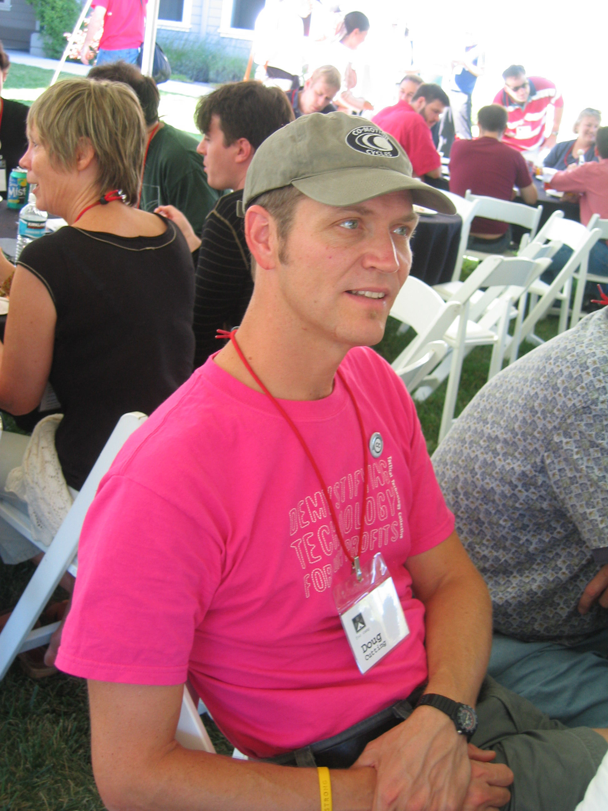

Doug Cutting
Yahoo!, then Cloudera
Hadoop (2006), Lucene, Nutch

Doug Cutting open-sourced an implementation of Google's design at Yahoo! in 2006.

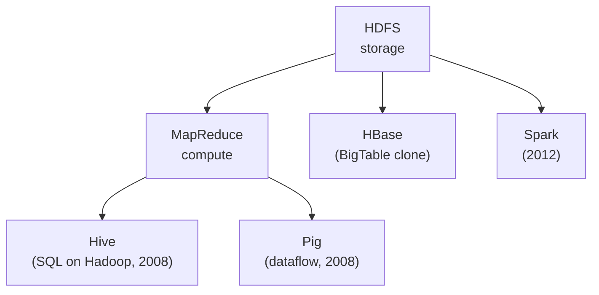
```mermaid
graph TD
  HDFS["HDFS<br/>storage"] --> MR["MapReduce<br/>compute"]
  MR --> Hive["Hive<br/>(SQL on Hadoop, 2008)"]
  MR --> Pig["Pig<br/>(dataflow, 2008)"]
  HDFS --> HBase["HBase<br/>(BigTable clone)"]
  HDFS --> Sp["Spark<br/>(2012)"]
```

By 2012 "Big Data" was a job title and every Fortune 500 had a Hadoop cluster.

<!--
Hive was a Facebook contribution; Pig came from Yahoo. Both put SQL-like surfaces on MapReduce because writing raw MapReduce was painful. This pattern — declarative front, parallel back — is the entire premise of modern cloud warehouses.
-->

---

# The Database Community Pushback

Stonebraker and DeWitt published an essay in January 2008:

> *MapReduce: A Major Step Backwards*

Their critique:
- No schema, no indexes, no query optimizer
- Reinvents 30 years of parallel database work
- Brute force where decades of optimization exist

The follow-up paper put numbers on the argument:

> Pavlo, Paulson, Rasin, Abadi, DeWitt, Madden, Stonebraker.
> *MapReduce and Parallel DBMSs: Friends or Foes?*
> CACM, January 2010.

Parallel DBs were 3-7× faster on the same workloads — when they could load the data at all.

<!--
The Stonebraker/DeWitt blog post is famously caustic. Their argument was technically correct but missed the point: MapReduce was *good enough* for workloads where loading a schema-on-write database was the bottleneck. Eventually both sides converged.
-->

---

# Convergence: Spark and the Cloud

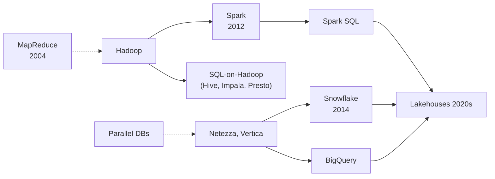
```mermaid
graph LR
  MR["MapReduce<br/>2004"] -.-> H["Hadoop"]
  PDB["Parallel DBs"] -.-> MPP["Netezza, Vertica"]
  H --> SP["Spark<br/>2012"]
  MPP --> SF["Snowflake<br/>2014"]
  H --> SQL["SQL-on-Hadoop<br/>(Hive, Impala, Presto)"]
  SP --> SP2["Spark SQL"]
  MPP --> BQ["BigQuery"]
  SP2 --> LH["Lakehouses 2020s"]
  SF --> LH
  BQ --> LH
```

Both sides converged on **declarative SQL + columnar storage + parallel execution**.
Spark added in-memory iteration; the cloud added separation of storage from compute.

<!--
Spark (Zaharia et al., NSDI 2012) was the bridge: it kept MapReduce's fault tolerance and partitioning model but added an in-memory abstraction (RDDs, later DataFrames) that made iterative ML and complex queries practical. Spark SQL completed the convergence in 2014.
-->

---

# NewSQL: ACID Returns

By 2012 the pattern had reversed.

- **Spanner** (Corbett et al., OSDI 2012): Google rebuilt ACID across continents using GPS clocks
- **CockroachDB**, **Yugabyte**, **TiDB**: open-source descendants
- **VoltDB**, **MemSQL**: single-node speed plus serializability

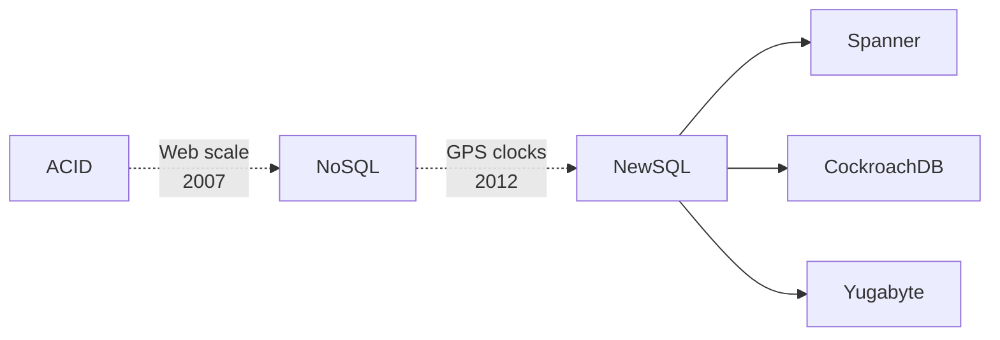
```mermaid
graph LR
  ACID["ACID"] -.->|"Web scale<br/>2007"| NS["NoSQL"]
  NS -.->|"GPS clocks<br/>2012"| NewSQL["NewSQL"]
  NewSQL --> SP["Spanner"]
  NewSQL --> CR["CockroachDB"]
  NewSQL --> Y["Yugabyte"]
```

The lesson: dropping ACID is sometimes necessary, but the long arc bent back toward putting it under SQL.

---

# Cloud Warehouses Inherit Everything

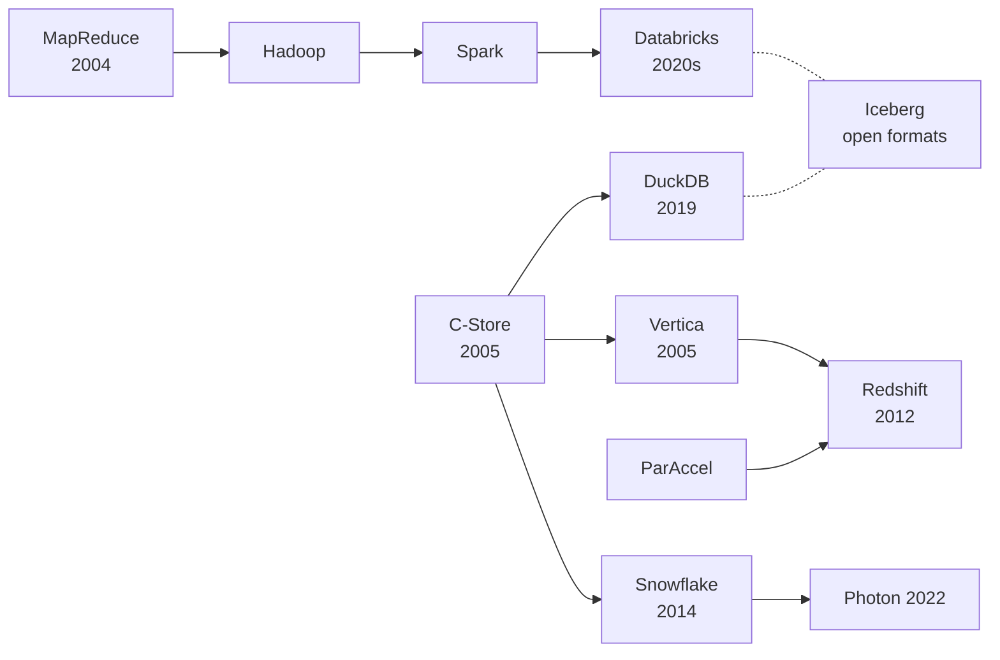
```mermaid
graph LR
  CS["C-Store<br/>2005"] --> V["Vertica<br/>2005"]
  V --> RS["Redshift<br/>2012"]
  MR["MapReduce<br/>2004"] --> H["Hadoop"]
  H --> Sp["Spark"]
  PP["ParAccel"] --> RS
  CS --> SF["Snowflake<br/>2014"]
  Sp --> DB["Databricks<br/>2020s"]
  CS --> DU["DuckDB<br/>2019"]
  DB -.- IC["Iceberg<br/>open formats"]
  DU -.- IC
  SF --> Ph["Photon 2022"]
```

The cloud warehouses are the synthesis: column stores from C-Store, partitioning from MapReduce, declarative SQL from the parallel DBs, separation of storage and compute from Snowflake.

<!--
Every modern warehouse is an alloy of these threads. Redshift came directly from ParAccel (Amazon licensed the engine). Snowflake's vectorized executor inherits from MonetDB/X100 and Vertica. Photon (Databricks) is the latest vectorized engine, built atop Spark. The C-Store paper we read in Week 10 sits at the start of this lineage.
-->

---

<!-- _class: lead -->

# Part 8: Where We Are Now

---

# The 2020s: Many Engines, Specialized Roles

The market has split into specialized engines.

| Workload | Representative engines |
|----------|------------------------|
| OLTP (rows, ACID, concurrent writes) | PostgreSQL, MySQL, Spanner, CockroachDB |
| OLAP (columns, scan-heavy) | DuckDB, Snowflake, BigQuery, Photon |
| Streaming | Kafka, Flink, Materialize |
| Vector / RAG | pgvector, LanceDB, Qdrant |
| Key-value / cache | Redis, RocksDB, DynamoDB |

We live in the top two boxes. PostgreSQL is our row store. DuckDB is our column store.

<!--
Stonebraker's "one size does not fit all" argument from 2005 is now the consensus view. Even Oracle and SQL Server ship column-store engines alongside their row stores. The era of one DBMS for everything is over.
-->

---

# Why PostgreSQL + DuckDB

**PostgreSQL** teaches the textbook.

**DuckDB** teaches the modern analytical architecture in the simplest packaging available.

- DuckDB is an embedded library — no server, no daemon, one binary
- It reads PostgreSQL, Parquet, CSV, and JSON natively
- Its execution engine is vectorized in the style of MonetDB/X100 (Boncz et al., CIDR 2005)

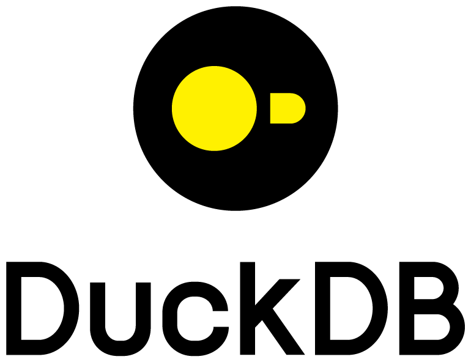

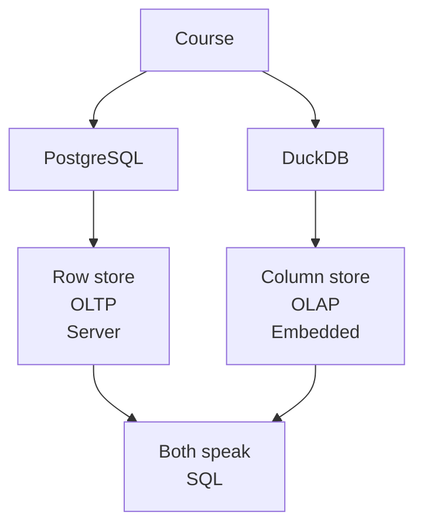
```mermaid
graph TD
  C["Course"] --> PG["PostgreSQL"]
  C --> DD["DuckDB"]
  PG --> R["Row store<br/>OLTP<br/>Server"]
  DD --> CO["Column store<br/>OLAP<br/>Embedded"]
  R --> Both["Both speak<br/>SQL"]
  CO --> Both
```

We read the DuckDB paper in Week 16.

---

# The Continuity

```mermaid
graph LR
  C70["Codd<br/>1970"] --> RM["Relations<br/>+ algebra"]
  C70 --> DI["Data<br/>independence"]
  C70 --> DEC["Declarative<br/>queries"]
  RM --> NOW["Every engine<br/>you will touch"]
  DI --> NOW
  DEC --> NOW
```

Notice what survived from Codd's 1970 paper. Even Cassandra has tables and a query language; even DynamoDB has expressions and projections.

The relational model bent the field permanently.

---

# What You Should Take Away

### 1
The relational model **separated logical from physical**, and that separation is the source of most of database systems' value.

### 2
**Every generation re-fights the same battles**: schema vs schemaless, strong vs eventual, single-node vs distributed.

### 3
**PostgreSQL is the System R lineage**;
**DuckDB is the C-Store lineage**.
We work in both.

---

# How We Know All This

### The Winslett Interviews

The single best primary source is **"Distinguished Profiles in Databases"** by Marianne Winslett (now with Vanessa Braganholo), published in *ACM SIGMOD Record*.

Each interview runs ~30 minutes and is titled *"X Speaks Out."*

[sigmodrecord.org/category/distinguished-profiles](https://sigmodrecord.org/category/distinguished-profiles/)

### Voices in the Series
- Jim Gray — transactions and the field
- Pat Selinger — System R optimizer
- Mike Stonebraker — many opinions
- Don Chamberlin — origin of SQL
- David DeWitt — parallel databases
- Hector Garcia-Molina — Stanford and beyond
- Jennifer Widom — our textbook coauthor
- Phil Bernstein — concurrency control
- Bruce Lindsay — System R

<!--
Winslett's series is the closest thing the database field has to the Computer History Museum's oral histories. Each interview surfaces context that the formal papers do not — who hated each other, which ideas had to be argued past skeptics, how the careers actually wound through industry and academia.
The 2024 Stonebraker & Pavlo paper "What Goes Around Comes Around... And Around" is the single best secondary source.
-->

---

# Recommended Watching and Reading

### Oral histories
- SIGMOD History page: [sigmod.org/sigmod-history](https://sigmod.org/sigmod-history/)
- ACM Turing Award lectures (Codd 1981, Gray 1998, Stonebraker 2014)
- The Winslett "Distinguished Profiles" series (previous slide)

### Recent perspective
- Stonebraker & Pavlo, *What Goes Around Comes Around... And Around*, SIGMOD Record, June 2024
- Hellerstein, Stonebraker, Hamilton, *Architecture of a Database System* (Red Book Ch. 1, 2007)
- The Red Book itself: [redbook.io](http://www.redbook.io/)

<!--
The 2024 Stonebraker & Pavlo paper is the single best optional read for the course. If a student wants to understand why this field looks the way it does in 2026, that paper is the answer.
-->

---

# Wednesday's Class

**The Relational Model and Data Types**

- Tuples, attributes, domains, integrity constraints
- PostgreSQL data types: numeric, text, date/time, JSON, arrays, geometric, range
- How non-atomic types stress (and refine) the relational model
- First look at SQL DDL

Read: GMW Ch. 2.1-2.3 before class.

---

# Featured Paper (Read This Week)

> Codd, E.F. *A Relational Model of Data for Large Shared Data Banks*.
> Communications of the ACM 13(6), June 1970.

Local copy: [ufdatastudio.com/cop5725fa26/papers/pdfs/codd1970.pdf](https://ufdatastudio.com/cop5725fa26/papers/pdfs/codd1970.pdf)
Full paper index: [ufdatastudio.com/cop5725fa26/papers](https://ufdatastudio.com/cop5725fa26/papers)

Read pages 1-4 carefully. The rest is rewarding but not required.

---

# Questions

What is on your mind?

Next class: Wed Aug 26. We turn the algebra into something you can type.

<!--
Common questions to expect: "Was Codd's paper really that influential?" (yes, with caveats), "Why didn't IMS go away if relational won?" (it didn't go away — IMS still runs at banks and airlines), "What about the Stonebraker 80th symposium?" (October 2024 at MIT CSAIL, talks online via MIT — link to be added once verified).
-->
