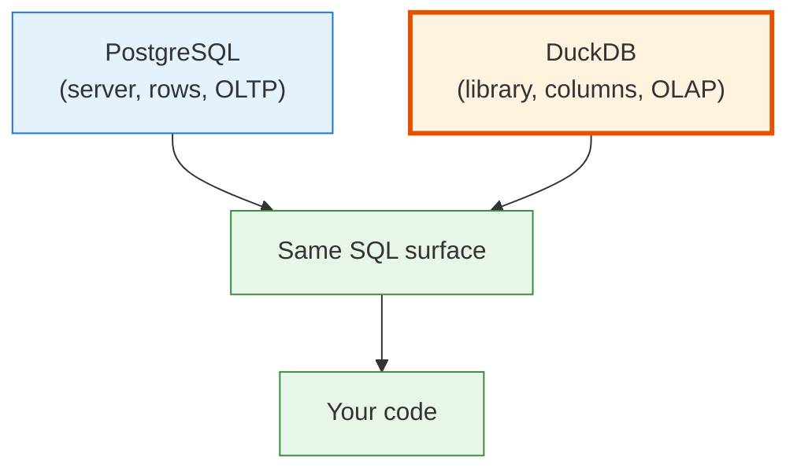
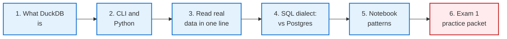
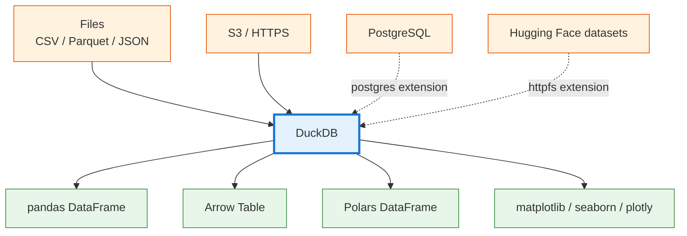
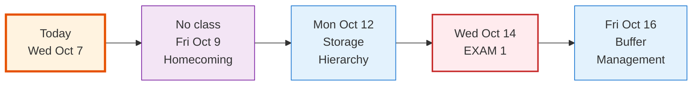

<!-- _class: lead -->

# Day 20: DuckDB and Notebooks

**COP 5725 - Database Management Systems**
Wednesday, October 7, 2026

The embedded analytical engine — and how it lets one line read 3 million rows from anywhere

<!--
Section 3 closes today. Practice exam packet for Exam 1 distributed in the last 5 minutes. Pace: 50 min, with the NYC Taxi demo (Part 3) taking 15 min — it's the moment most students never forget.
-->

---

# Where We Are

<div class="columns-left-wide">
<div>

Monday: PostgreSQL through Python.
Today: DuckDB — same SQL skills, completely different engine.

Where PostgreSQL is a server you connect to, DuckDB is a **library you import**.

Where PostgreSQL stores rows, DuckDB stores **columns**.

Where PostgreSQL is built for concurrent writes, DuckDB is built for **analytical scans over local or remote files** — CSV, Parquet, JSON, anywhere.

</div>
<div>



</div>
</div>

---

# Today's Roadmap



Reference: [DuckDB documentation](https://duckdb.org/docs/).

---

<!-- _class: lead -->

# Part 1: What DuckDB Is

---

# An Embedded Analytical Engine

<div class="columns">
<div>

DuckDB is **the analytical SQLite**.

- One library, one binary
- No server, no daemon
- Reads/writes a single `.duckdb` file or runs in memory
- Started at CWI Amsterdam, 2019
- Used by Hugging Face, Mode, DBT, and Tableau internals
- Featured paper in Week 16: Raasveldt & Mühleisen, SIGMOD 2019

</div>
<div>

| Property | PostgreSQL | DuckDB |
|----------|-----------|--------|
| Architecture | Server | Library |
| Storage | Row | Column |
| Workload | OLTP | OLAP |
| Concurrency | Heavy writes | Single-writer |
| Files | Internal | Reads anything |
| Install | Setup | `pip install` |

</div>
</div>

<!--
The "library not server" framing is the biggest mental shift. Students used to PostgreSQL often look for a connection string and a daemon. There is no daemon. The process running Python is the database.
-->

---

# DuckDB and the Modern Analytics Stack



DuckDB sits in the middle: any source, any sink.

<!--
The "any source any sink" promise is what makes DuckDB compelling. SQLite reads its own format only. DuckDB reads the formats the modern data stack actually uses.
-->

---

<!-- _class: lead -->

# Part 2: CLI and Python

---

# Install

```bash
# Python
uv add duckdb

# Standalone CLI
brew install duckdb              # macOS
winget install duckdb.duckdb     # Windows
# or grab a binary from duckdb.org/docs/installation
```

Two interfaces:
- The **`duckdb` CLI** for ad-hoc SQL exploration
- The **`duckdb` Python library** for scripts and notebooks

They share an on-disk format. A `.duckdb` file written by one is read by the other.

---

# The Python API

```python
import duckdb

# In-memory database
con = duckdb.connect()

# File-backed
con = duckdb.connect("/tmp/my.duckdb")

# Single-statement convenience
result = duckdb.sql("SELECT 42")
result.show()
```

The `duckdb.sql(query)` form runs against the default in-memory database and is perfect for notebooks. The `connect()` form is right for scripts that need persistence.

<!--
DuckDB's Python API is intentionally lighter than psycopg's. There is no cursor concept; queries return a result object that you `.show()`, `.fetchall()`, `.df()` (pandas), or `.arrow()` (Arrow).
-->

---

# Three Result Shapes

```python
result = duckdb.sql("""
  SELECT major, count(*) AS n
  FROM   read_csv('students.csv')
  GROUP BY major
""")

# Print to stdout
result.show()

# Pandas DataFrame
df = result.df()

# Arrow Table — zero copy, great for sharing with Polars
arr = result.arrow()

# Python list of tuples
rows = result.fetchall()
```

`.df()` returns the result as a pandas DataFrame **with zero copies** when the DataFrame is wide enough.

---

<!-- _class: lead -->

# Part 3: Read Real Data in One Line

---

# CSV

```python
duckdb.sql("""
  SELECT count(*)
  FROM read_csv('https://duckdb.org/data/flights.csv')
""").show()
```

DuckDB downloads, parses, and queries the CSV in one statement.
The HTTP layer is the `httpfs` extension, which DuckDB loads automatically.

Reference: [Data Import — CSV](https://duckdb.org/docs/data/csv/overview).

---

# Parquet — the Format the World Has Adopted

```python
# NYC Yellow Taxi, January 2024 — about 3 million rows
duckdb.sql("""
  SELECT
    PULocationID,
    count(*)         AS trips,
    avg(trip_distance) AS avg_miles,
    avg(total_amount) AS avg_fare
  FROM 'https://d37ci6vzurychx.cloudfront.net/trip-data/yellow_tripdata_2024-01.parquet'
  GROUP BY PULocationID
  ORDER BY trips DESC
  LIMIT 10
""").df()
```

Parquet is **columnar on disk**. DuckDB reads only the columns the query needs.
Three million rows. One URL. One query. Real answers in seconds.

<!--
This is the demo students remember from Section 3. Run it live. The HTTP request resolves in under 5 seconds; the query answers in another 5. Watching a single Python line query a 3-million-row remote file is the most concrete demonstration of why columnar Parquet won.
-->

---

# Multiple Files — Glob Patterns

```python
duckdb.sql("""
  SELECT
    date_trunc('month', tpep_pickup_datetime) AS month,
    count(*) AS trips
  FROM 'https://d37ci6vzurychx.cloudfront.net/trip-data/yellow_tripdata_2024-*.parquet'
  GROUP BY month
  ORDER BY month
""").df()
```

The glob expands to every monthly file for 2024.
~40 million rows aggregated in one query.

DuckDB pushes the filter and projection down — it never materializes the full result in memory.

---

# JSON

```python
duckdb.sql("""
  SELECT
    payload ->> 'event_type' AS event,
    count(*) AS n
  FROM read_json_auto('webhooks/*.jsonl')
  GROUP BY event
""").df()
```

`read_json_auto` infers the schema.
For a real schema declaration, use `read_json` with explicit types.

Reference: [Data Import — JSON](https://duckdb.org/docs/data/json/overview).

---

<!-- _class: lead -->

# Part 4: SQL Dialect — DuckDB vs PostgreSQL

---

# Where They Match

DuckDB deliberately mirrors PostgreSQL syntax for portability.

| Feature | Same? |
|---------|-------|
| Standard SELECT, WHERE, JOIN, GROUP BY, HAVING | ✓ |
| CTEs, recursive CTEs | ✓ |
| Window functions | ✓ |
| Most aggregate functions | ✓ |
| `EXPLAIN ANALYZE` | ✓ (different format) |
| `IS DISTINCT FROM`, `FILTER`, `GROUPING SETS` | ✓ |
| Dates, intervals, timestamps | ✓ |

Almost everything you learned in Section 2 runs unchanged.

---

# Where DuckDB Extends

```sql
-- ASOF JOIN: nearest-match temporal join
SELECT *
FROM trades t
ASOF JOIN quotes q
       ON t.symbol = q.symbol
      AND t.ts >= q.ts;

-- Sample syntax
SELECT * FROM table USING SAMPLE 1%;
SELECT * FROM table USING SAMPLE 1000 ROWS;

-- LIST, MAP, STRUCT types
SELECT [1, 2, 3]::INTEGER[]  AS list;
SELECT {'a': 1, 'b': 2}      AS struct;
SELECT map([1, 2], ['x','y']) AS m;

-- pivot / unpivot
PIVOT taxi ON payment_type USING sum(total_amount);
```

Reference: [DuckDB SQL Features](https://duckdb.org/docs/sql/introduction).

---

# Where PostgreSQL Extends

| Postgres has | DuckDB does not |
|--------------|-----------------|
| Triggers | — |
| Operator overloading | — |
| `LISTEN` / `NOTIFY` | — |
| Foreign data wrappers | (DuckDB uses extensions for similar purposes) |
| GIST / GIN indexes | (DuckDB uses different physical structures) |
| Multi-user concurrent writes | (DuckDB is single-writer) |

DuckDB intentionally drops the OLTP machinery. The reward is that scan-heavy analytics are 10-100× faster on the same hardware.

---

<!-- _class: lead -->

# Part 5: Notebook Patterns

---

# A Working Notebook Cell

```python
import duckdb
import pandas as pd

# Cell 1 — explore
duckdb.sql("""
  SELECT count(*) FROM 'yellow_tripdata_2024-01.parquet'
""").show()

# Cell 2 — aggregate
trips = duckdb.sql("""
  SELECT
    date_trunc('day', tpep_pickup_datetime) AS day,
    count(*) AS trips,
    avg(total_amount) AS avg_fare
  FROM 'yellow_tripdata_2024-01.parquet'
  GROUP BY day
  ORDER BY day
""").df()

# Cell 3 — visualize
trips.plot.line(x="day", y="trips", figsize=(10, 4))
```

Three cells. One dataset. SQL does the aggregation; pandas paints.

---

# DataFrames as Tables

```python
import pandas as pd
import duckdb

df = pd.DataFrame({
  "sid": [1, 2, 3],
  "major": ["CS", "EE", "CS"]
})

# Reference a DataFrame as if it were a table — zero copy
duckdb.sql("""
  SELECT major, count(*)
  FROM df
  GROUP BY major
""").df()
```

DuckDB can query a pandas DataFrame **without copying it**.
Same trick works with Polars and Arrow tables.

This makes DuckDB the natural glue between Python's data ecosystem and SQL.

<!--
The "DataFrames as tables" feature is unique to DuckDB among free engines. It's the reason DuckDB has spread rapidly through the data-science world; reaching for SQL no longer requires leaving Python.
-->

---

# Mixing PostgreSQL and DuckDB

```python
# DuckDB queries Postgres directly
duckdb.sql("INSTALL postgres; LOAD postgres;")
duckdb.sql("""
  ATTACH 'host=localhost dbname=cop5725 user=christan'
  AS pg (TYPE postgres)
""")

# Now Postgres tables look like DuckDB tables
duckdb.sql("""
  SELECT s.name, count(*) AS enrollments
  FROM pg.student s
  JOIN pg.enrollment e USING (sid)
  GROUP BY s.name
""").df()
```

The `postgres` extension makes DuckDB a query engine **over** PostgreSQL.
Run analytical queries against your OLTP store without disturbing it.

---

<!-- _class: lead -->

# Part 6: Section 3 Wrap and Exam 1 Practice Packet

---

# Section 3 Wrap

<div class="columns">
<div>

You have, in two lectures:

- `psycopg` for transactional Postgres work from Python
- Parameterized queries and transaction management
- `pandas.read_sql_query` and `DataFrame.to_sql`

</div>
<div>

- DuckDB as the analytical engine — CSV, Parquet, HTTPS, S3 in one line
- DuckDB ↔ pandas ↔ Arrow ↔ Polars interop
- DuckDB as a query engine over PostgreSQL

</div>
</div>

Section 4 (Storage and Indexing) opens Monday after Homecoming.

---

# Exam 1 Practice Packet

<div class="columns">
<div>

### Covers

Sections 1-3:
- Relational model and algebra
- ER and schema design
- FDs and normalization
- All SQL including window and recursive
- Python + DuckDB

### Format

- 6-8 questions in the style of the real exam
- Worked solutions in a separate file

</div>
<div>

### Logistics

- Released after class today as `practice-exams/exam1.md` in the course repo
- Solutions in `practice-exams/exam1-solutions.md`
- Work it solo first; office hours Mon-Tue for questions
- Exam 1 on **Wed Oct 14**, 50 min, in this room

</div>
</div>

---

# Calendar Reminder



Section 4 begins Monday Oct 12 — the physical-layer side of databases.

---

# Practice Before Monday

Four exercises in your project repo:

1. Query your dataset using DuckDB directly from the source files (Parquet or CSV). No PostgreSQL needed.
2. Read the same data into PostgreSQL via `psycopg`. Time both reads.
3. Repeat one of your Project 1 queries against the raw files using DuckDB. Compare results.
4. Work the Exam 1 practice packet without looking at solutions; check yourself afterward.

Push to your `cop5725fa26-project` repo before 8:30 AM Mon Oct 12.

---

# Questions

What is on your mind?

Project 2 due Oct 23. Exam 1 in one week.

<!--
Common Day 20 questions: "Can I do my project in DuckDB instead of PostgreSQL?" (Project 1 must include a PostgreSQL schema; Project 2-onwards can use DuckDB freely.) "Does DuckDB support all the window function frames we learned?" (Yes — same syntax.) "Does DuckDB support recursive CTEs?" (Yes — standard SQL.) "Should I use polars or pandas?" (Either — DuckDB returns to both with zero copy.)
-->
