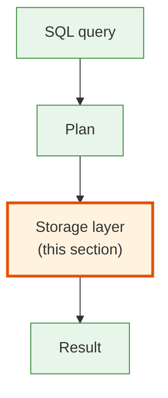
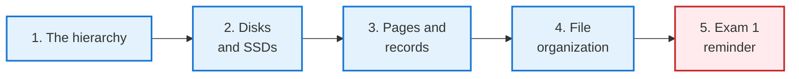
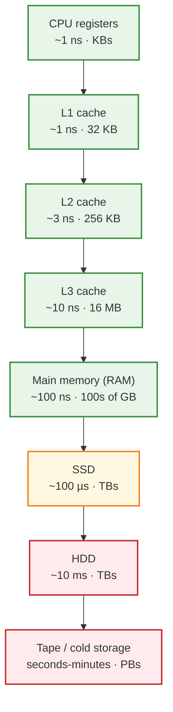
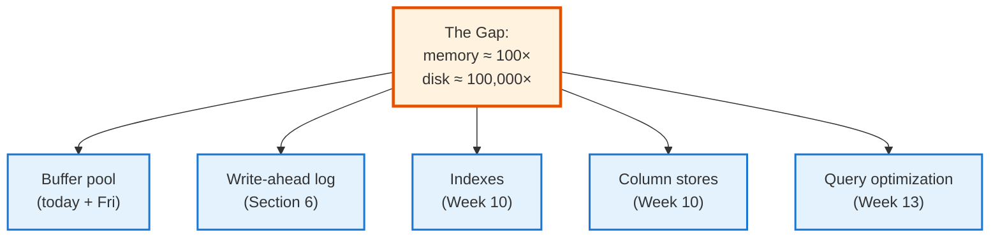
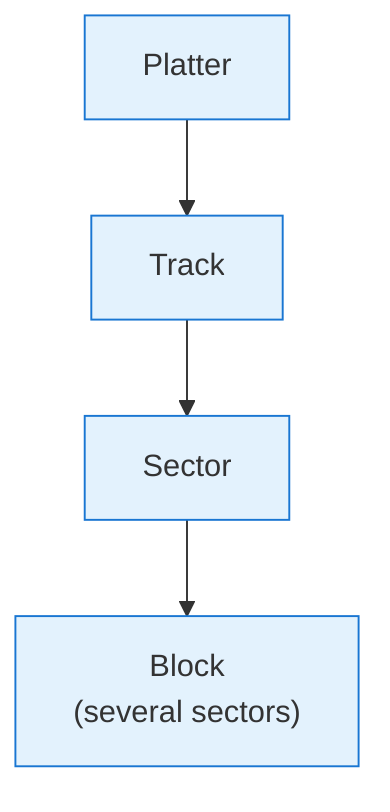
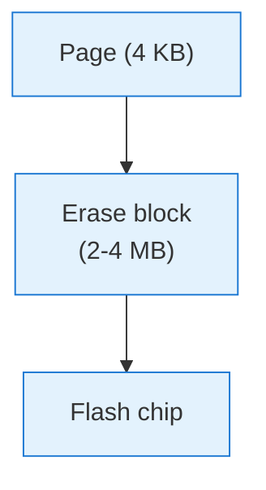
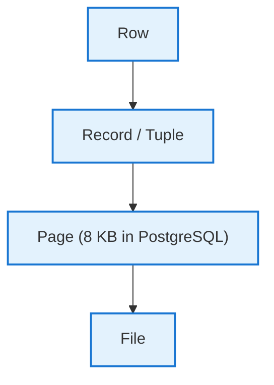
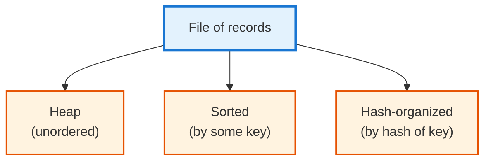

<!-- _class: lead -->

# Day 21: Storage Hierarchy

**COP 5725 - Database Management**
Monday, October 12, 2026

The physical reality every query plan answers to

<!--
First day of Section 4. Section turns from "what to query" to "how the data sits on the machine." The cost model students learn here is what makes EXPLAIN ANALYZE output legible in Section 5.
Pace: 50 min. Last 5 min remind about Wednesday's exam.
-->

---

# Where We Are

<div class="columns-left-wide">
<div>

For three sections you have written queries.
For two of those sections you have moved data through Python.

Today we go under the floor.

The storage hierarchy is the reason **every database makes the same architectural decisions**: B+ trees, buffer pools, write-ahead logs, vectorized scans. They are all responses to the same set of physical constraints.

</div>
<div>



</div>
</div>

---

# Today's Roadmap



Reference: GMW Ch. 13.1-13.4; PostgreSQL docs [Ch. 73 Database Physical Storage](https://www.postgresql.org/docs/current/storage.html).

---

<!-- _class: lead -->

# Part 1: The Hierarchy

---

# Layers, by Speed and Size



Each step is **10×-1000×** slower than the previous. The gaps shape every database decision.

<!--
The "10-1000x slower per layer" is the key intuition. Database engines are mostly about working around these gaps — caching the next layer, batching reads, avoiding random access where sequential will do.
-->

---

# Latency in Concrete Numbers

| Operation | Time | Time (scaled to "1 sec = L1 cache") |
|-----------|------|-------------------------------------|
| L1 cache reference | 1 ns | 1 sec |
| L2 cache reference | 4 ns | 4 sec |
| Main memory reference | 100 ns | 100 sec |
| Read 1 MB sequentially from memory | 4 µs | 1 hour |
| SSD random read | 100 µs | 1 day |
| HDD seek | 10 ms | 100 days |
| Network round trip (datacenter) | 500 µs | 6 days |

Adapted from Jeff Dean's "[Numbers Every Programmer Should Know](https://gist.github.com/jboner/2841832)."

> Random reads from disk are the **expensive operation** every database is built to avoid.

---

# Why Databases Look the Way They Do



Every major DB feature is a workaround for the latency gap.

---

<!-- _class: lead -->

# Part 2: Disks and SSDs

---

# HDD: Mechanical Reality

<div class="columns-left-wide">
<div>

A hard disk is **a stack of spinning platters** with a read/write head that physically moves.

Three time costs to access a block:

- **Seek time:** move the head to the right track (~5-10 ms)
- **Rotational latency:** wait for the right sector to pass under the head (~3-4 ms)
- **Transfer:** stream the block off the platter (~µs per KB)

Sequential reads skip the seek and rotation. **Random reads incur all three.**

</div>
<div>



</div>
</div>

The 100-1000× sequential-vs-random gap on HDDs is the original reason database files keep related rows close together.

---

# SSD: Different Physics, Some Old Habits

<div class="columns">
<div>

### What changes

- No moving parts → no seek time
- Random reads ~ 100 µs (vs HDD's 10 ms)
- Random/sequential gap narrows to ~3-10×

### What stays

- Sequential is still **faster**
- Page size still matters (SSDs erase in larger blocks than they read)
- The 100×-1000× memory-vs-storage gap is the same

</div>
<div>



</div>
</div>

PostgreSQL's `random_page_cost` defaults to 4.0 (4× sequential). On SSDs, lowering it to 1.1 often produces better plans.

<!--
The random_page_cost tweak is the simplest PostgreSQL-on-SSD optimization. The default 4.0 assumes HDDs; modern installations on SSDs should typically use 1.1-1.5. Mention this; students may need it for Project 3.
-->

---

<!-- _class: lead -->

# Part 3: Pages and Records

---

# The Page: The Unit of I/O



The page is the **smallest unit the database reads from or writes to disk**. PostgreSQL's default is 8 KB.

A page holds many records. Reading one record means reading the page that contains it.

---

# Slotted Page Layout (PostgreSQL)

```
+---------------------------------+
| PageHeaderData (24 bytes)       |
+---------------------------------+
| LinePointer[]  ──> ──> ──>      |
| (grows downward)                |
+---------------------------------+
|                                 |
|     free space                  |
|                                 |
+---------------------------------+
|        <── <── <── Tuple data   |
|                  (grows upward) |
+---------------------------------+
| Special space (varies by type)  |
+---------------------------------+
```

Two halves grow toward each other.
A `LinePointer` (4 bytes) per tuple gives O(1) access by tuple index.
Reference: [PostgreSQL Ch. 73.6 Database Page Layout](https://www.postgresql.org/docs/current/storage-page-layout.html).

<!--
The slotted page is universal — PostgreSQL, SQL Server, Oracle, and most modern engines use a version of it. The two-sided growth pattern keeps both lookups and inserts O(1) when there's free space.
-->

---

# Records — Tuple Header in PostgreSQL

```
+----------------------+
| t_xmin               |  transaction that created (4 bytes)
+----------------------+
| t_xmax               |  transaction that deleted, or 0 (4 bytes)
+----------------------+
| t_cid (or t_xvac)    |  command ID (4 bytes)
+----------------------+
| t_ctid               |  physical location (6 bytes)
+----------------------+
| t_infomask2          |  number of attrs + flags (2 bytes)
+----------------------+
| t_infomask           |  flags (2 bytes)
+----------------------+
| t_hoff               |  header length (1 byte)
+----------------------+
| t_bits (NULL bitmap) |  variable
+----------------------+
| t_data (the values)  |  variable
+----------------------+
```

Reference: [Ch. 73.5 Database Page Layout: HeapTupleHeaderData](https://www.postgresql.org/docs/current/storage-page-layout.html#STORAGE-TUPLE-LAYOUT).

The `t_xmin`/`t_xmax` fields are how PostgreSQL implements MVCC. Section 6.

<!--
Don't drill the bytes — students will not need to recite them. The point is showing that there are 23+ bytes of header per row before the data starts. Small tables (a single int column) waste enormous overhead per row; large tables amortize it.
-->

---

# Why Page Size Matters

<div class="columns">
<div>

### Smaller pages

- Faster random access (less data per I/O)
- Less buffer-pool waste when accessing single rows
- More page overhead per byte of data

</div>
<div>

### Larger pages

- Better sequential scan throughput
- Less header/index overhead per byte
- More waste on partial-fill or row updates

</div>
</div>

PostgreSQL ships with 8 KB pages. Some warehousing systems use 32 KB or larger.
DuckDB defaults to 256 KB row groups (Parquet-style), reflecting its column-oriented analytics focus.

---

<!-- _class: lead -->

# Part 4: File Organization

---

# Three Organizations



Different organizations trade insert speed for query speed.

---

# Heap Files: The PostgreSQL Default

<div class="columns">
<div>

### Heap

- Inserts at the next free slot in any page with space
- No ordering guarantee
- Full table scan must read every page

### Cost (in pages read)

- Scan: O(B) where B is total pages
- Equality lookup: O(B) without an index
- Insert: O(1) (find a page with space)

</div>
<div>

### Why default?

- Fast inserts and updates
- Acceptable scans (often beaten by indexes anyway)
- Easy to maintain — no reorganization on insert
- Works with MVCC: new versions just append

</div>
</div>

Every PostgreSQL table is a heap file unless you explicitly cluster it.

---

# Sorted Files

<div class="columns">
<div>

### Sorted

- Records stored in key order
- Binary search yields O(log B) page reads for equality
- Range queries are essentially free

### Cost

- Scan: O(B)
- Equality: O(log B)
- Range: O(log B + r) where r is the matching range size
- **Insert: O(B)** — expensive

</div>
<div>

PostgreSQL's `CLUSTER` command produces a one-time sort by an index:

```sql
CLUSTER student USING student_gpa_idx;
```

After `CLUSTER`, rows are physically sorted by GPA — until the next insert/update breaks the order.

</div>
</div>

Sorted files are great for read-mostly tables.
For write-heavy tables, B+ trees (Week 10) give us the best of both worlds.

---

<!-- _class: lead -->

# Part 5: Exam 1 Reminder

---

# Exam 1 Wednesday Oct 14

<div class="columns">
<div>

### Covers
Sections 1-3 (all material up to and including last Wednesday's DuckDB lecture).

### Format
- 50 minutes
- Closed notes
- ~6-8 problems mixing short SQL writing and conceptual short answer
- Bring a pen

</div>
<div>

### Preparation
- Practice exam packet was released Wed Oct 7
- Worked solutions live in `practice-exams/exam1-solutions.md`
- Tuesday office hours 10:00-11:30 for last-minute questions

### Today
- Storage Hierarchy (you can use this on a few problems)
- Project 2 due Oct 23 — keep moving

</div>
</div>

<!--
Practice packet questions tend to mirror what shows up — work it through. Office hours Tuesday afternoon are unusually crowded; encourage early arrival.
-->

---

# Wrap-up

You now have:

<div class="columns">
<div>

- The storage hierarchy and order-of-magnitude latency
- HDD vs SSD: where the assumptions differ
- The page as the unit of I/O
- PostgreSQL's slotted page layout and tuple header

</div>
<div>

- Three file organizations: heap, sorted, hash
- Why heap files are the default
- The cost model that drives every database decision
- Foreshadowing of buffer pools (Friday) and indexes (next week)

</div>
</div>

---

# Friday: Buffer Management and Memory

We add the next layer of the hierarchy: a managed RAM cache that sits between the planner and the disk.

By the end of Friday you can explain why PostgreSQL has a `shared_buffers` setting, what `pg_buffercache` shows, and how LRU vs Clock differ.

Read GMW Ch. 13.5-13.6 before class.

---

# Practice Before Friday

Two exercises:

1. Practice exam packet — do at least three full problems before Tuesday office hours.
2. In your project, run `pg_relation_size('your_table_name')` and `pg_indexes_size('your_table_name')`. Report sizes in your repo's `README.md`.

Push to your `cop5725fa26-project` repo before 8:30 AM Fri Oct 16.

---

# Questions

What is on your mind?

Exam 1 in two class days.

<!--
Most questions today are about the exam, not the material. Hold them briefly; redirect to office hours for individual concerns.
-->
