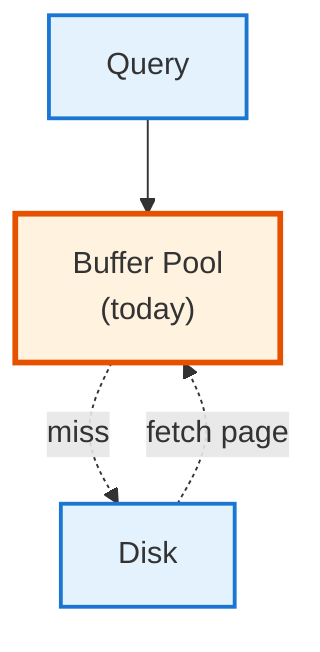
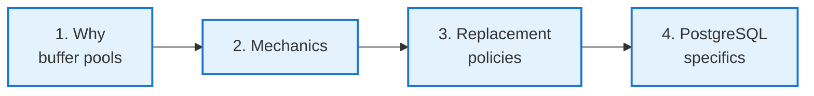
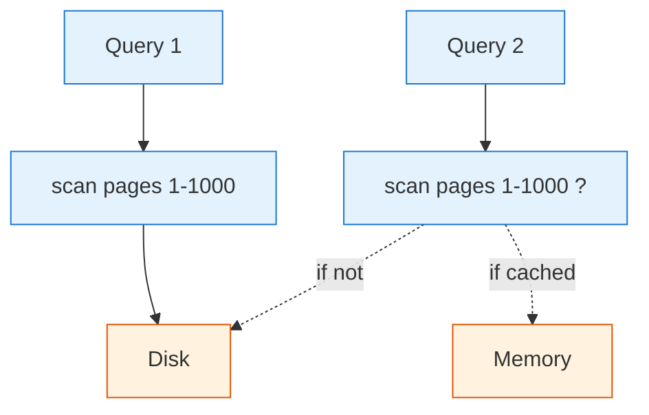
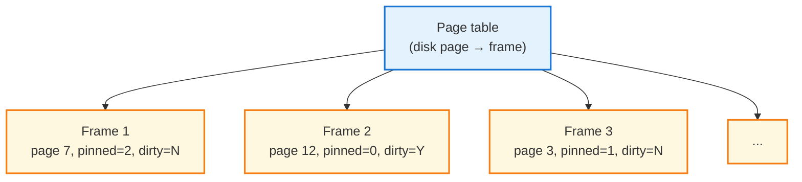
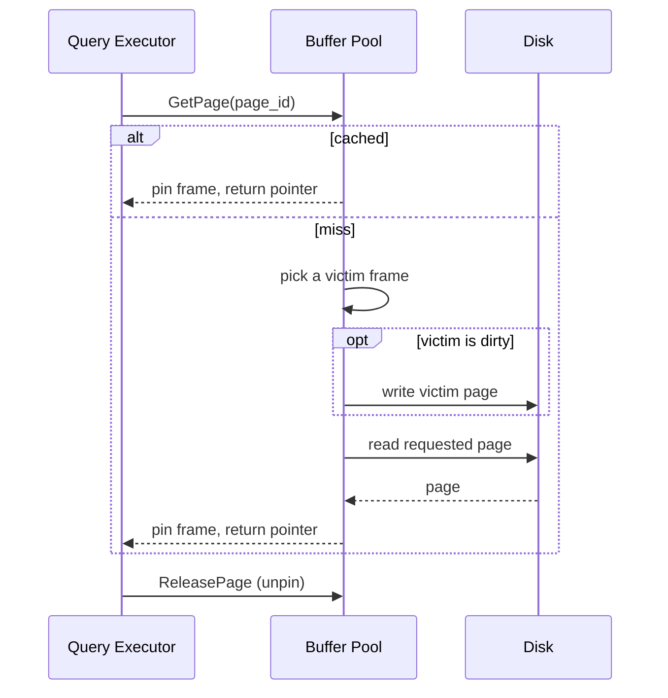
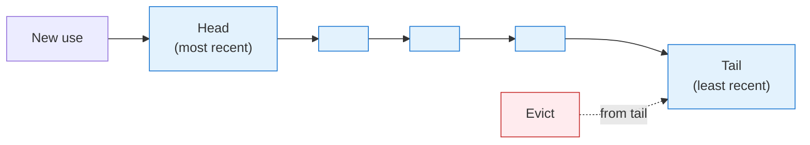
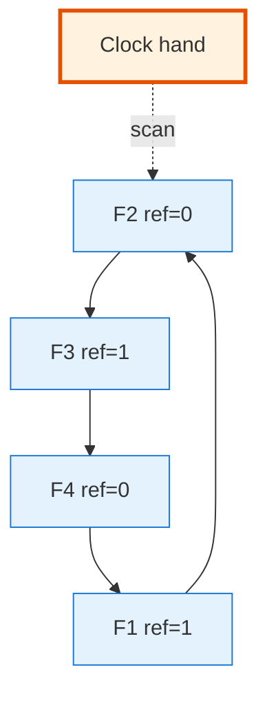

<!-- _class: lead -->

# Day 23: Buffer Management

**COP 5725 - Database Management**
Friday, October 16, 2026

The managed cache that sits between every query and the disk

<!--
Day after Exam 1. Acknowledge the exam briefly (graded results next Monday). Then move into buffer management — this is the layer that turns "disk is slow" into "most reads are fast." Pace 50 min, with the PostgreSQL-specific section getting the last 12 minutes.
-->

---

# Where We Are

<div class="columns-left-wide">
<div>

Monday: the storage hierarchy.
Wednesday: Exam 1.
Today: buffer management — the cache the database manages for itself.

By the end of the hour you can answer:

- Why does PostgreSQL have `shared_buffers`?
- What is `pg_buffercache` showing?
- Why does the optimizer choose differently when the working set fits in memory vs not?

</div>
<div>



</div>
</div>

---

# Today's Roadmap



Reference: [PostgreSQL Ch. 19.4.1 Memory](https://www.postgresql.org/docs/current/runtime-config-resource.html#GUC-SHARED-BUFFERS), GMW Ch. 13.5.

---

<!-- _class: lead -->

# Part 1: Why Buffer Pools Exist

---

# The Problem

<div class="columns">
<div>

Working set is bigger than memory.

A 100 GB table on a 16 GB machine cannot all fit in RAM.

But a query that reads "every page" hits each page **once**. Re-running the same query reads them **all over again** from disk — wasteful.

Re-using pages between queries needs a cache.

</div>
<div>



</div>
</div>

The buffer pool answers: cache the pages a query reads, hand them out free to the next query.

---

# Buffer Pool = Manage-It-Yourself Memory

<div class="columns">
<div>

### Why not let the OS handle it?

- The OS knows files; the database knows **access patterns**.
- The OS doesn't know which pages will be dirty (need write-back).
- The OS evicts based on age; the database can evict based on **plan structure**.

</div>
<div>

### Why we still rely on the OS

- The OS page cache is a second cache below the buffer pool.
- PostgreSQL benefits from both: warm pages in `shared_buffers` and warm files in OS cache.
- This is part of why `shared_buffers` is set to **25-40% of RAM**, not 100%.

</div>
</div>

<!--
The "two-cache" design is unique to PostgreSQL; SQL Server and Oracle prefer to grab most of RAM for themselves. Both designs work; PostgreSQL's reflects its trust in mature operating systems.
-->

---

<!-- _class: lead -->

# Part 2: The Mechanics

---

# Frames, Page Table, Pin/Unpin



A **frame** is a fixed-size slot that holds one page in memory.
The **page table** maps disk-page ID to frame.
Each frame has a **pin count** (how many threads are using it) and a **dirty bit** (modified since loaded).

---

# The Lifecycle of a Page Read



The pin count keeps pages alive while in use; unpinned pages become eligible for eviction.

---

# Dirty Pages and Write-Back

A page is **dirty** when something in memory has been modified but the disk does not yet know.

Two write-back strategies:

| Strategy | When to write | Tradeoff |
|----------|--------------|----------|
| Write-through | At every modification | Simple, slow |
| Write-back | When evicted (or at checkpoint) | Fast, needs recovery |

Real databases use **write-back with a write-ahead log** (Section 6). The log makes recovery possible after a crash even though pages were not flushed yet.

---

<!-- _class: lead -->

# Part 3: Replacement Policies

---

# The Question

When a new page needs a frame and the pool is full, **which frame is evicted**?

A bad answer ruins performance: evicting a page that gets re-used next is the buffer pool's worst nightmare.

Five common strategies — three classic, two modern:

- LRU
- Clock (approximate LRU)
- MRU
- LRU-K
- ARC

---

# LRU — Least Recently Used

<div class="columns">
<div>

### Idea
Evict the frame that has been **unused longest**.

### Why it works
Recent past predicts near future for most workloads.

### Cost
Maintaining a strict order needs a linked list and constant time update on every access — expensive in concurrent code.

</div>
<div>



</div>
</div>

---

# Clock — Approximate LRU at Constant Cost

<div class="columns">
<div>

### Idea
Arrange frames in a ring with a "reference bit" per frame.

On access, set the reference bit.
When evicting, advance a "clock hand" — if the current frame's bit is 1, clear it and advance; if 0, evict it.

### Why it works
Approximates LRU without the linked-list maintenance.

PostgreSQL uses a variant: **clock-sweep** with usage counters.

</div>
<div>



</div>
</div>

---

# MRU — When the Workload Inverts

```sql
-- A full scan over a 100 GB table
SELECT count(*) FROM huge_table;
```

LRU is **terrible** for this: the scan fills the pool with pages it will not reuse, evicting pages that *are* reused.

**MRU** (Most Recently Used) is the right call for one-pass scans: evict the page you just read so the rest of the pool stays useful.

PostgreSQL detects sequential scans and uses a **ring buffer** of ~256 KB for them, so the rest of the buffer pool is untouched. This is MRU in spirit.

<!--
The "sequential scan blowing away the buffer pool" problem is real. PostgreSQL fixed it around version 8.3 with the ring-buffer approach. Other engines have similar machinery.
-->

---

# LRU-K and ARC (Brief)

<div class="columns">
<div>

### LRU-K (O'Neil 1993)

Track the **K-th most recent** access (not just the last). A page accessed once is less valuable than a page accessed K times.

LRU-2 (K=2) is a common variant.

</div>
<div>

### ARC (Megiddo, Modha 2003)

Adaptive Replacement Cache. Maintains two lists:
- Pages seen once (might be one-off)
- Pages seen multiple times (probably hot)

Used in ZFS, IBM DB2, some PostgreSQL extensions.

</div>
</div>

Both improve on LRU by recognizing that **frequency** matters as well as **recency**.

---

<!-- _class: lead -->

# Part 4: PostgreSQL Specifics

---

# shared_buffers

```sql
SHOW shared_buffers;     -- 128MB on default install
```

The size of PostgreSQL's main buffer pool. The most-tuned parameter on every PostgreSQL deployment.

<div class="columns">
<div>

### Sizing guidance

- 25-40% of physical RAM on a dedicated server
- Leaves the rest for the OS page cache + work_mem + connections
- Going beyond 50% rarely helps because the OS cache holds most "warm" pages too

</div>
<div>

### When to tune

- Default 128 MB is too small for any real workload
- For a 32 GB server, try 8-12 GB
- Measure before and after — use `pg_stat_database` to track cache hit ratios

</div>
</div>

Reference: [PostgreSQL Ch. 19.4 Resource Consumption](https://www.postgresql.org/docs/current/runtime-config-resource.html).

---

# effective_cache_size

```sql
SHOW effective_cache_size;     -- 4GB on default install
```

A **hint to the optimizer**, not actual memory allocation.

It tells the planner how much of the data is *likely* cached (in `shared_buffers` plus OS page cache).

Higher value → optimizer is more willing to use index scans.
Lower value → optimizer favors sequential scans.

Set to about 50-75% of physical RAM. Reference: [PostgreSQL Ch. 19.7.2 Planner Cost Constants](https://www.postgresql.org/docs/current/runtime-config-query.html#GUC-EFFECTIVE-CACHE-SIZE).

<!--
This is the parameter people most often forget. shared_buffers gets tuned; effective_cache_size doesn't, and the optimizer keeps making sub-optimal plans because of it. Set both.
-->

---

# pg_buffercache — Observe What Is Cached

```sql
CREATE EXTENSION IF NOT EXISTS pg_buffercache;

-- How much of each relation is in the buffer pool?
SELECT c.relname,
       count(*) * 8 / 1024.0 AS cached_mb,
       count(*) FILTER (WHERE b.isdirty) AS dirty_pages
FROM   pg_buffercache b
JOIN   pg_class c ON b.relfilenode = pg_relation_filenode(c.oid)
WHERE  b.reldatabase IN (0, (SELECT oid FROM pg_database
                              WHERE datname = current_database()))
GROUP BY c.relname
ORDER BY cached_mb DESC
LIMIT 20;
```

Try this against your project's database. The output is a map of what your queries have warmed up.

Reference: [PostgreSQL Ch. F.27 pg_buffercache](https://www.postgresql.org/docs/current/pgbuffercache.html).

<!--
This query is one of the most useful "what is the database actually doing" diagnostics in PostgreSQL. Run it on a freshly started instance, then run it again after a query — students see exactly which pages got pulled.
-->

---

# Cache Hit Ratio

```sql
SELECT
  datname,
  blks_read   AS disk_reads,
  blks_hit    AS cache_hits,
  round(100.0 * blks_hit / nullif(blks_hit + blks_read, 0), 2) AS hit_pct
FROM pg_stat_database
WHERE datname = current_database();
```

> A healthy OLTP workload runs above **99% cache hit ratio**.

Below 95% is a sign that `shared_buffers` is undersized for the working set.

`pg_stat_database` is the rough quantitative health check; `pg_buffercache` is the qualitative breakdown.

---

# Wrap-up

You now have:

<div class="columns">
<div>

- The frame / page table / pin / dirty mechanics
- The lifecycle of a page read (cached vs miss)
- LRU, Clock, MRU, LRU-K, ARC — and where each wins

</div>
<div>

- PostgreSQL's clock-sweep + sequential-scan ring buffer
- `shared_buffers`, `effective_cache_size`, `pg_buffercache`
- The cache-hit-ratio diagnostic

</div>
</div>

---

# Monday: Row Stores vs Column Stores

We compare the layout of PostgreSQL's tuples to DuckDB's columnar pages, and walk through the C-Store paper (Stonebraker et al., VLDB 2005).

Read the C-Store paper before Monday: [stonebraker2005.pdf](https://ufdatastudio.com/cop5725fa26/papers/pdfs/stonebraker2005.pdf).

---

# Practice Before Monday

Two exercises in your project repo:

1. Run the `pg_buffercache` query above against your project's database and capture the output.
2. Compute the cache hit ratio for your database. If it's below 95%, hypothesize why.

Push to your `cop5725fa26-project` repo before 8:30 AM Mon Oct 19.

---

# Questions

What is on your mind?

Project 2 due Oct 23 (next Friday). Exam 1 results posted Monday.

<!--
End-of-week energy is usually low. Hold questions briefly. The "exam results post Monday" line is the one students care most about — confirm it explicitly.
-->
