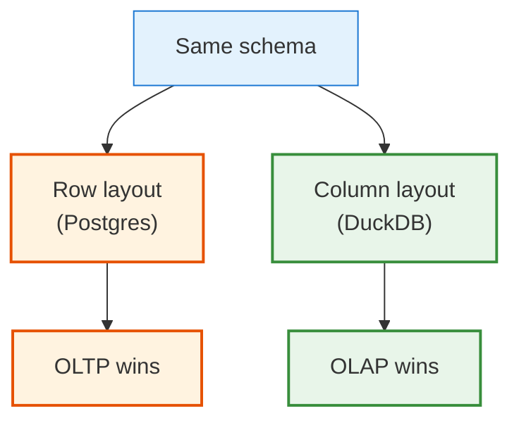
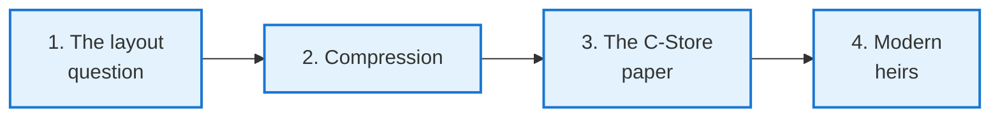
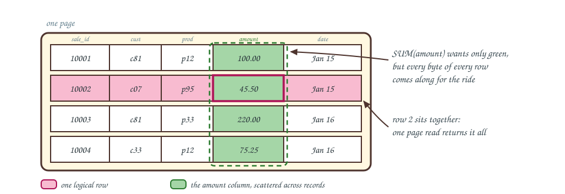
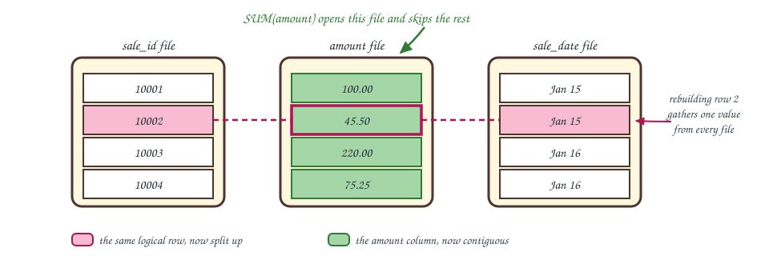
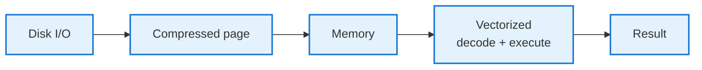
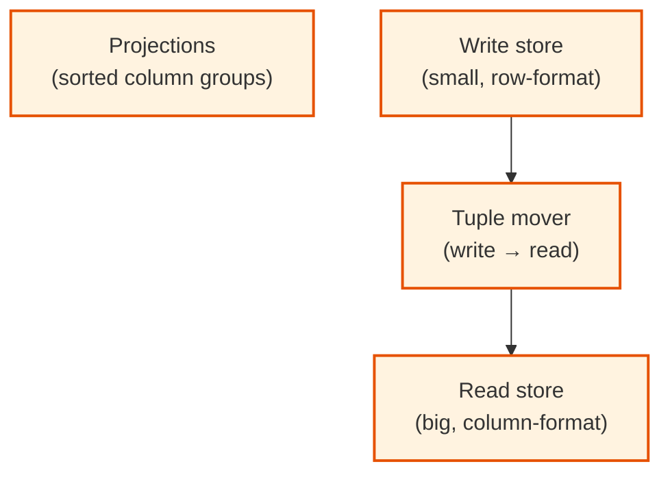
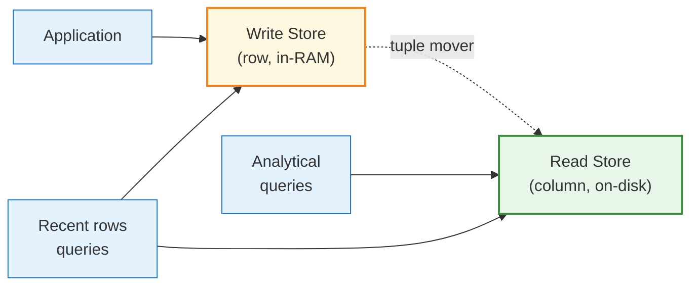
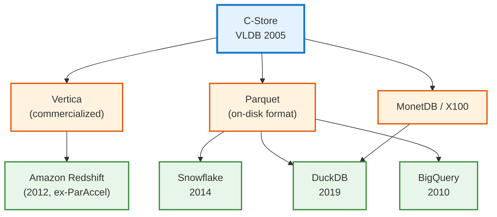
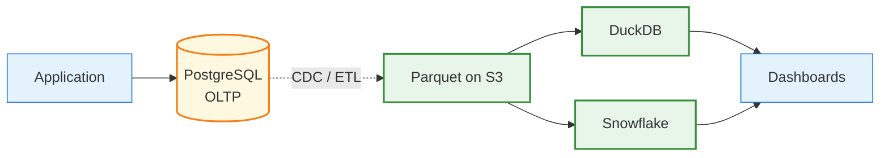

<!-- _class: lead -->

# Day 24: Row Stores vs Column Stores

**COP 5725 - Database Management Systems**
Monday, October 19, 2026

Same SQL. Two completely different layouts.

<!--
Featured paper week. Students should have read the C-Store paper over the weekend. Pace 50 min; the C-Store section is the centerpiece. Frame this as "the moment PostgreSQL and DuckDB became different species."
-->

---

# Where We Are

<div class="columns-left-wide">
<div>

The last two lectures covered pages, buffer pools, and PostgreSQL's slotted row pages.
Today covers the alternative layout.

A column store keeps **all values of one column together** instead of all values of one row.
The data and the SQL are the same, but the performance profile changes completely.

The C-Store paper (Stonebraker et al., VLDB 2005) is the argument that started the modern OLAP era.

<div class="small">

OLTP (online transaction processing) means many small reads and writes from a live application. OLAP (online analytical processing) means large scans and aggregations for analysis.

</div>

</div>
<div>



</div>
</div>

---

# Today's Roadmap



Reference: Textbook §13.7.6, p. 609, on column stores.

---

<!-- _class: lead -->

# Part 1: The Layout Question

---

# The Logical Schema Is Identical

```sql
CREATE TABLE sales (
  sale_id     bigint,
  customer_id bigint,
  product_id  bigint,
  amount      numeric(10,2),
  sale_date   date
);
```

Two layouts can hold the same data. SQL never tells you which.

---

# Row Layout



Reading one full row takes one page access.
Computing `SUM(amount)` across 100 M rows reads every page and throws away 80% of the bytes.

---

# Column Layout



Reading one full row means assembling values from many places.
Computing `SUM(amount)` reads only the amount column. The 80% byte savings shows up as a 5-10× scan speedup.

<div class="small">

The colors match the row layout. Pink is the one logical row, now split across three files, and green is the amount column, now contiguous.

</div>

<!--
"Read only the columns the query needs" is the entire column-store advantage. Wide tables with narrow queries see the biggest wins.
-->

---

# When Row Wins, When Column Wins

<div class="columns">
<div>

### Row stores win when

- Many writes / updates
- Reads pull full rows ("show me one customer's record")
- Working set fits in memory
- Workload is transactional

</div>
<div>

### Column stores win when

- Reads pull a few columns over many rows
- Aggregations and grouping dominate
- Tables are wide (50+ columns)
- Working set is enormous and compressible

</div>
</div>

The C-Store paper claims one engine cannot win both workloads. PostgreSQL leans row; DuckDB leans column.

---

<!-- _class: lead -->

# Part 2: Compression

---

# Why Compression Matters

A column holds values of **the same type, often with regularities**:

- `sale_date` values cluster in recent months
- `payment_type` is one of {cash, credit, debit, other}
- `country` takes one of ~200 values
- `quantity` is mostly small integers

Compression schemes exploit these regularities to pack columns into 10-50% of their raw size.

The win goes beyond disk space. Compressed columns mean fewer cache misses, and vectorized engines decode in-flight without materializing the original.

---

# Run-Length Encoding (RLE)

<div style="font-family:ui-monospace,'SF Mono',Menlo,Consolas,monospace; font-size:0.85em; line-height:2.4; background:#F6F8FA; border-radius:8px; padding:12px 18px;">

raw:&nbsp;&nbsp;&nbsp;&nbsp;&nbsp;&nbsp;&nbsp;&nbsp;[<span style="background:#FFE082; padding:2px 7px; border-radius:8px;">CA, CA, CA, CA, CA</span>, <span style="background:#90CAF9; padding:2px 7px; border-radius:8px;">NY, NY, NY</span>, <span style="background:#A5D6A7; padding:2px 7px; border-radius:8px;">FL, FL, FL, FL</span>]<br>
encoded:&nbsp;&nbsp;&nbsp;&nbsp;[<span style="background:#FFE082; padding:2px 7px; border-radius:8px;">(CA, 5)</span>, <span style="background:#90CAF9; padding:2px 7px; border-radius:8px;">(NY, 3)</span>, <span style="background:#A5D6A7; padding:2px 7px; border-radius:8px;">(FL, 4)</span>]

</div>

Each colored run collapses into the (value, count) pair of the same color.

RLE wins when the column is sorted or has long runs.

DuckDB and Vertica detect runs automatically. Sorting a column by a high-cardinality natural key destroys RLE; sorting by a low-cardinality key creates it.

This is why C-Store's design includes multiple sort orders for the same column; different sorts win different compressions.

---

# Dictionary Encoding

<div style="font-family:ui-monospace,'SF Mono',Menlo,Consolas,monospace; font-size:0.85em; line-height:2.4; background:#F6F8FA; border-radius:8px; padding:12px 18px;">

column:&nbsp;&nbsp;&nbsp;&nbsp;&nbsp;&nbsp;&nbsp;&nbsp;[<span style="background:#FFE082; padding:2px 7px; border-radius:8px;">Texas</span>, <span style="background:#90CAF9; padding:2px 7px; border-radius:8px;">Florida</span>, <span style="background:#FFE082; padding:2px 7px; border-radius:8px;">Texas</span>, <span style="background:#A5D6A7; padding:2px 7px; border-radius:8px;">California</span>, <span style="background:#90CAF9; padding:2px 7px; border-radius:8px;">Florida</span>, <span style="background:#FFE082; padding:2px 7px; border-radius:8px;">Texas</span>]<br>
dictionary:&nbsp;&nbsp;&nbsp;&nbsp;{ <span style="background:#A5D6A7; padding:2px 7px; border-radius:8px;">0: 'California'</span>, <span style="background:#90CAF9; padding:2px 7px; border-radius:8px;">1: 'Florida'</span>, <span style="background:#FFE082; padding:2px 7px; border-radius:8px;">2: 'Texas'</span> }<br>
encoded:&nbsp;&nbsp;&nbsp;&nbsp;&nbsp;&nbsp;&nbsp;[<span style="background:#FFE082; padding:2px 7px; border-radius:8px;">2</span>, <span style="background:#90CAF9; padding:2px 7px; border-radius:8px;">1</span>, <span style="background:#FFE082; padding:2px 7px; border-radius:8px;">2</span>, <span style="background:#A5D6A7; padding:2px 7px; border-radius:8px;">0</span>, <span style="background:#90CAF9; padding:2px 7px; border-radius:8px;">1</span>, <span style="background:#FFE082; padding:2px 7px; border-radius:8px;">2</span>]

</div>

Each value keeps its color as it turns into a code, so the encoded array reads the same left to right.

Replace each value with its dictionary code. Especially powerful for low-cardinality columns (country, status, category).

A `text` column with 200 distinct values compresses to a `tinyint` per row plus a 200-entry dictionary.

DuckDB and Parquet both use dictionary encoding heavily.

---

# Bit-Packing

```
raw integers:   1, 3, 5, 2, 7, 4, 6, 2     (max = 7)
                each "needs" 64 bits in a bigint column
                but actually fits in 3 bits each
bit-packed:     001 011 101 010 111 100 110 010    (24 bits total)
```

If a column's values fit in fewer bits than its declared type, pack them.

Bit-packing is automatic in Parquet and DuckDB. PostgreSQL does not bit-pack normal heap tuples.

<!--
The "values fit in fewer bits" optimization is why columnar formats are so much smaller than row formats — even before fancier compression. A bigint column of values up to 1000 needs 10 bits per value, not 64.
-->

---

# Compression Speeds Up Queries



Smaller pages produce faster queries.

- Less I/O to load the data
- Fewer cache misses
- The CPU is the bottleneck; vectorized operators work *on compressed data*

DuckDB's vectorized executor processes RLE-encoded runs in a single SIMD instruction.

---

<!-- _class: lead -->

# Part 3: The C-Store Paper

---

# C-Store, 2005

> Stonebraker, M., Abadi, D.J., Batkin, A. et al.
> *C-Store: A Column-oriented DBMS.*
> VLDB 2005.

[Local PDF](https://ufdatastudio.com/cop5725fa26/papers/pdfs/stonebraker2005.pdf)

The thesis:

- Row stores were designed for OLTP and shoehorned into OLAP
- A from-scratch column store would beat them at OLAP by 10-100×
- Different workloads need different engines (this becomes "one size fits all is dead")

C-Store the prototype became **Vertica** the company (2005), acquired by HP in 2011.

---

# C-Store's Key Ideas



Three structural ideas that turn into the modern OLAP architecture.

---

# Projections

```
sales table:
  sale_id, customer_id, product_id, amount, sale_date

projection P1 (sorted by sale_date):
  amount, customer_id    -- runs of customer_id by date

projection P2 (sorted by customer_id):
  amount, sale_date      -- runs of date per customer

projection P3 (sorted by product_id):
  amount, sale_date      -- runs of date per product
```

Each projection is a **sorted view of overlapping columns**.

Different sort orders enable different compressions and different query patterns.

The cost is duplication, with multiple copies of the column data. Analytical workloads where reads dominate accept that cost.

<!--
The "projection" word is unfortunately overloaded. C-Store's "projection" is closer to "materialized view sorted differently" than to relational-algebra projection. The paper's word; we use it because the modern literature does.
-->

---

# Read Store + Write Store

<div class="columns">
<div>

### Write store (WS)

- Small, row-format
- Optimized for fast inserts
- Stays in memory

### Read store (RS)

- Large, column-format
- Compressed and sorted
- Optimized for analytical scans

### Tuple mover

- Periodic batch from WS to RS
- Compresses on the way
- Background activity

</div>
<div>



</div>
</div>

The split solves the write-vs-read tradeoff inside a single engine.

---

# What Worked, What Did Not

<div class="columns">
<div>

### Worked

- Column layout with compression
- Vectorized execution
- Specialized engines won at analytics
- The "one size fits all is dead" thesis

</div>
<div>

### Did not last

- The exact projections + tuple mover architecture
- The "write store, read store" split (modern systems use LSM-style buffers, transactional logs, or materialized views)
- C-Store as a literal product

</div>
</div>

Twenty years later, the **ideas** are everywhere; the **architecture** has evolved.

---

<!-- _class: lead -->

# Part 4: Modern Heirs

---

# The Lineage



DuckDB is the most direct descendant we use in this course.

---

# Parquet

```bash
# A 3M-row Parquet file
$ ls -lh yellow_tripdata_2024-01.parquet
-rw-r--r--  1 christan  staff   47M  yellow_tripdata_2024-01.parquet

# Read by DuckDB, Polars, pandas, Spark, BigQuery, Snowflake, Athena, …
```

Apache Parquet (2013) standardized C-Store's ideas as a **file format**.

Every modern analytical engine reads Parquet. Cross-engine analytics works because everyone speaks Parquet.

Parquet contains:
- Column groups (called **row groups**)
- Per-column statistics (min, max, null count)
- Per-column compression (dictionary, RLE, bit-packing, snappy, zstd)
- A schema definition

---

# The Hybrid Pattern



The 2026 industry default:

- PostgreSQL (or another row store) handles writes and live application reads
- Change data capture ships changes to a Parquet lake on S3
- DuckDB or Snowflake or BigQuery handles analytics

Two engines, two layouts, one logical schema.

---

# Wrap-up

- Row layout wins transactional workloads, and column layout wins analytical scans over a few columns.
- RLE, dictionary encoding, and bit-packing pack columns into a fraction of their raw size and speed up scans.
- C-Store introduced projections, the write-store/read-store split, and the specialized-engine thesis.
- Parquet and DuckDB carry the column-store ideas forward, usually paired with PostgreSQL in a hybrid stack.

<!--
One line per part of the lecture. If time remains, ask students which layout their project dataset favors and why.
-->

---

# Wednesday

Wednesday opens the indexing arc with B+ trees.

Read Textbook §14.1-14.2, pp. 620-646 before class.

---

# Practice Before Wednesday

1. Pick three columns from your project's dataset. For each, name the likely compression scheme (RLE, dictionary, bit-pack) and why.
2. Convert one of your project's tables to Parquet using DuckDB; report disk size before and after.

This is an exercise.

---

# Questions

What is on your mind?

Project 2 due **this Friday** Oct 23.

<!--
Common Day 24 questions: "Are columnar engines always faster?" (No — they're slower at OLTP. Row vs column is workload-driven.) "Why doesn't PostgreSQL just become columnar?" (It can, via extensions like cstore_fdw and Citus columnar. But the core stays row-store because that's what its primary use case demands.) "Will I use both engines in my project?" (Probably — Project 2 onwards welcomes DuckDB for analytical queries on your dataset.)
-->
