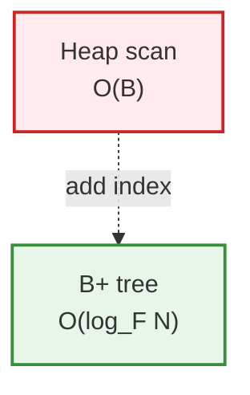
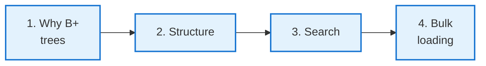
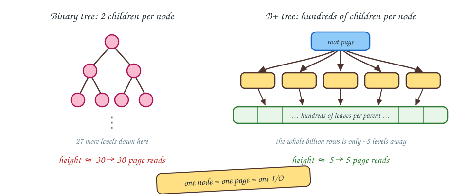
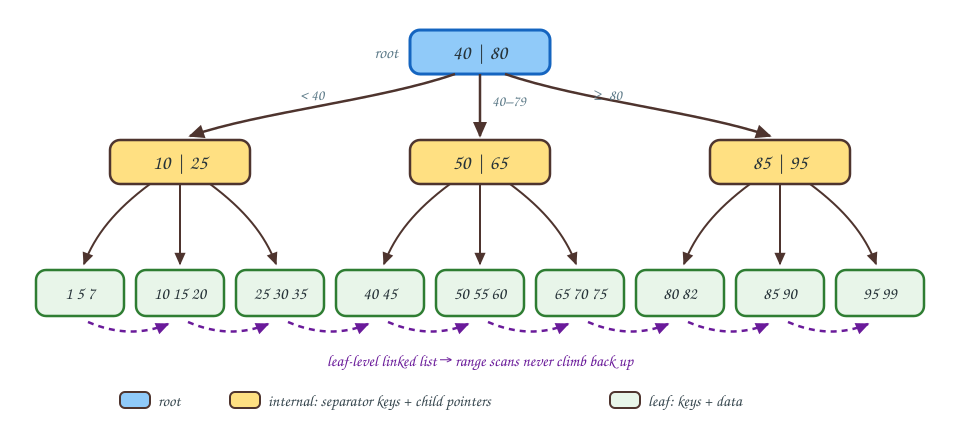
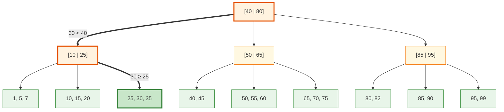
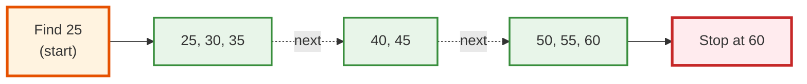
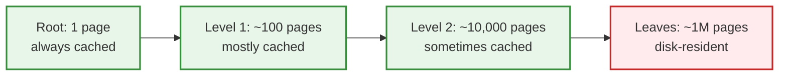
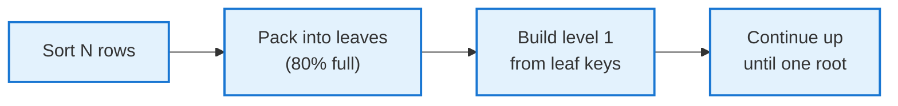

<!-- _class: lead -->

# Day 25: B+ Trees I

**COP 5725 - Database Management Systems**
Wednesday, October 21, 2026

Structure · Search · Bulk Loading

<!--
First B+ tree day. Heavy mermaid use for tree visualizations. Pace 50 min, with the structure section (Part 2) taking 12 minutes and the search section (Part 3) the most interactive 15 minutes — hand-trace a search on the board.
-->

---

# Where We Are

<div class="columns-left-wide">
<div>

Monday covered row and column layouts.
Today covers indexing.

Without an index, a point lookup on a heap file scans every page at O(B) cost.
The B+ tree turns that O(B) into O(log_F N), on disk, with the page and buffer-pool costs from last week.

The B+ tree is the universal database index. PostgreSQL's `CREATE INDEX` defaults to it, and SQL Server, Oracle, DB2, MySQL, and SQLite all use B+ trees.

<div class="small">

B counts the pages in the file, N counts the records, and F is the fan-out, the number of children per node.

</div>

</div>
<div>



</div>
</div>

---

# Today's Roadmap



Reference: Textbook §14.1-14.2, pp. 620-646; PostgreSQL docs [B-Tree Indexes](https://www.postgresql.org/docs/current/btree.html).

---

<!-- _class: lead -->

# Part 1: Why B+ Trees

---

# The Tree Family

| Tree | Designed for | Lookup |
|------|--------------|--------|
| Binary search tree | In-memory data | O(log N) on average, O(N) worst |
| AVL / Red-Black | Balanced in-memory | O(log N) worst |
| **B-tree** (Bayer 1972) | Disk-based, balanced | O(log_F N) |
| **B+ tree** | Disk + range queries | O(log_F N) + leaf scan |
| LSM tree | Write-heavy | O(log N) batched |

The "+" in B+ tree refers to all data living at the leaf level; internal nodes contain only routing keys.
The Textbook covers this variant under the family name B-tree <span class="cite">(§14.2, p. 633)</span>.

---

# Why Disk-Friendly Matters



For 1 billion rows:
- A binary tree has height ~30, so a lookup costs 30 disk reads.
- A B+ tree with fan-out 100 has height ~5, so a lookup costs 5 disk reads.

That factor of six is the argument for high fan-out on disk.

<!--
Fan-out is the single most important number in a B+ tree. Doubling fan-out cuts log_F N by some amount; going from F=2 to F=100 reduces height by a factor of ~7. Real B+ trees use page-sized nodes that hold hundreds of keys.
-->

---

<!-- _class: lead -->

# Part 2: Structure

---

# A B+ Tree



Three levels. Internal nodes route. Leaves hold all data. The dashed arrows are the **leaf-level linked list** <span class="cite">(Textbook §14.2.1, p. 634)</span>.

---

# Internal vs Leaf Nodes

<div class="columns">
<div>

### Internal nodes

- Hold **keys + child pointers**, no data
- Each key is a separator: "everything ≥ this key goes right"
- Fan-out F = pointers per node
- Mostly fit in the buffer pool (top levels are small)

</div>
<div>

### Leaf nodes

- Hold **keys + data** (or keys + row pointers)
- One linked-list neighbor pointer per leaf
- Range queries follow the linked list
- Live mostly on disk for large indexes

</div>
</div>

PostgreSQL's btree uses the row's `ctid` (physical tuple ID) as the "data" in leaves. Indexes are separate files from the heap.

<!--
The leaf-level linked list is what makes B+ trees the right choice over plain B-trees for databases. Range queries (BETWEEN, ORDER BY + LIMIT) traverse the leaf level without going back up the tree.
-->

---

# Fan-Out

A B+ tree node fits in **one page** (8 KB in PostgreSQL).

How many key + pointer pairs fit in 8 KB?

<div class="columns">
<div>

### Internal nodes
For 8-byte keys and 8-byte pointers:
$$F = \frac{8192}{8 + 8} = 512$$

In practice, F ≈ 100-300 once you account for metadata, slot pointers, and varying key sizes.

</div>
<div>

### Tree height for N records, fan-out F
$$h = \lceil \log_F N \rceil$$

For F = 100, N = 1B:
$$h = \lceil \log_{100} 10^9 \rceil = 5$$

**Five page reads** to find any row in a billion.

</div>
</div>

This is why B+ trees won.

---

<!-- _class: lead -->

# Part 3: Search

---

# The Algorithm

```
Find(key):
  node = root
  while node is internal:
    find the first separator s in node with s > key
    follow the pointer to the left of s
    (if no such s, follow the rightmost pointer)
    node = that child
  # now node is a leaf
  scan leaf for key
  return data
```

Each step descends one level. Total cost: tree height <span class="cite">(Textbook §14.2.3, p. 639)</span>.

---

# Finding 30



Three accesses: root → internal → leaf. Then a linear scan within the leaf to find 30.

---

# Range Queries via the Leaf List



For `WHERE key BETWEEN 25 AND 60`:
1. Search down to the leaf containing 25 (3 page reads)
2. Walk the leaf-level linked list, reading each leaf
3. Stop when key > 60

Cost: O(log_F N) + the number of leaves in range <span class="cite">(Textbook §14.2.4, p. 639)</span>.

---

# Where the Buffer Pool Pays Off



For a 5-level tree with 1 B records:
- Levels 0-2: ~10,101 pages → ~80 MB → fits in `shared_buffers`
- Leaves: ~1 M pages → 8 GB → mostly on disk

The practical cost is often one disk I/O to read the leaf page; the rest is cached.

---

<!-- _class: lead -->

# Part 4: Bulk Loading

---

# Why One-at-a-Time Insertion Is Slow

If you `CREATE INDEX` on an existing 100 GB table by inserting rows one at a time:

- Each insert descends the tree (O(log N) page reads)
- Each insert dirties at least one leaf page (and possibly splits)
- Buffer pool thrashes with leaf pages
- Total cost: O(N log N) page accesses

Slow. For a 1-billion-row table, this can take days.

---

# Bottom-Up Bulk Loading

```
1. Sort all the rows by key (external merge sort).
2. Pack sorted rows into leaf pages, ~80% full.
3. For each leaf, emit one (key, leaf-pointer) into a list.
4. Pack the list into internal nodes one level up.
5. Repeat until you have one root page.
```



Cost: O(N log N) sort + O(N) build = essentially the sort cost.
PostgreSQL's `CREATE INDEX` does this when it can.

<!--
The 80% fill factor is intentional: leaving 20% room means inserts after the bulk load don't immediately cause splits. PostgreSQL's default fill factor for btree is 90% — tunable per index.
-->

---

# CREATE INDEX in PostgreSQL

```sql
-- Builds a btree, blocking writes (but allowing reads)
CREATE INDEX student_gpa_idx ON student (gpa);

-- Builds in the background, does not block writes
CREATE INDEX CONCURRENTLY student_gpa_idx ON student (gpa);
```

`CONCURRENTLY` is the production-safe form. It takes longer (2× the work) but lets reads and writes continue.

For a large table, even `CONCURRENTLY` benefits from the bottom-up bulk-load approach internally. Reference: PostgreSQL docs [CREATE INDEX, Building Indexes Concurrently](https://www.postgresql.org/docs/current/sql-createindex.html#SQL-CREATEINDEX-CONCURRENTLY).

---

# Wrap-up

- High fan-out makes B+ tree height logarithmic in N with a base of hundreds, which is why every major engine defaults to it.
- Internal nodes route with separator keys, leaves hold all the data, and the leaf-level linked list serves range queries.
- Search descends one page per level, and the top levels stay cached in the buffer pool.
- Bulk loading builds the tree bottom-up from sorted data, and `CREATE INDEX CONCURRENTLY` is the production-safe form.

<!--
One line per part of the lecture. The hand-drawing exercise below previews Friday's insertion algorithm.
-->

---

# Friday

Friday covers B+ tree maintenance: insertion with splits, deletion with underflow handling, and cost analysis.

Project 2 is due Friday at 11:59 PM.

Read Textbook §14.2.5-14.2.7, pp. 640-646 before class.

---

# Practice Before Friday

1. Hand-draw the B+ tree (order 4) that results from inserting `[10, 20, 30, 40, 50, 60, 70, 80]` in order. Show each step.
2. On your project's database, run `EXPLAIN ANALYZE` for a query that uses an index. Capture the plan and the elapsed time, with and without the index.

<div class="small">

Order 4 means a node holds at most 4 child pointers and 3 keys.

</div>

This is an exercise.

---

# Questions

What is on your mind?

Project 2 due Friday night.

<!--
Common Day 25 questions: "Why don't we cover plain B-trees too?" (They're the same idea minus the leaf linked list. Databases use B+ trees universally because the linked list speeds up range scans dramatically.) "What's the difference between a B-tree and a B+ tree?" (B-trees store data at internal nodes; B+ trees only at leaves. B+ has linked leaves.)
-->
