<!-- _class: lead -->

# Day 26: B+ Trees II

**COP 5725 - Database Management**
Friday, October 23, 2026

Insert. Delete. Cost. Project 2 due tonight.

<!--
Closes the B+ tree pair. Heavy on progressive build-outs — show insert step by step. Project 2 due tonight; spend last 5 minutes on it.
-->

---

# Where We Are

<div class="columns-left-wide">
<div>

Wednesday: structure and search. You can find any key in a B+ tree.

Today: the operations that **build** and **maintain** the tree. By the end of the hour you can hand-trace an insert sequence that triggers splits, and explain why most production engines hardly bother with deletes.

Project 2 is due tonight at 11:59 PM.

</div>
<div>

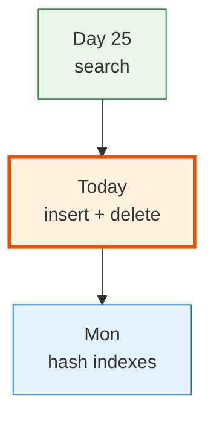

</div>
</div>

---

# Today's Roadmap

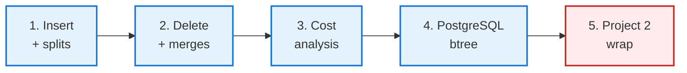

---

<!-- _class: lead -->

# Part 1: Insert with Splits

---

# The Easy Case: Leaf Has Space

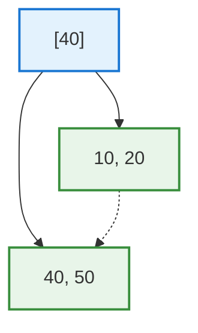

Insert 30. Leaf has room.

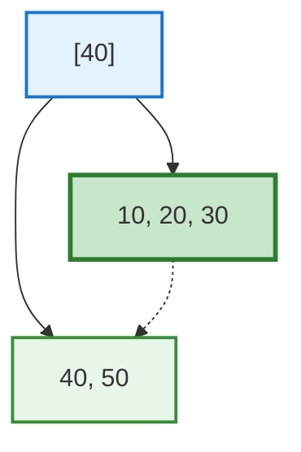

Find the right leaf, slot the value in sorted order. Done.

---

# The Hard Case: Leaf Is Full — Step 1

Order-4 tree (max 3 keys per leaf). Insert 35.

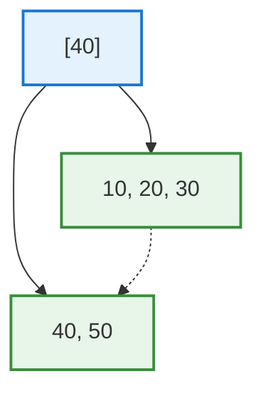

35 belongs in the left leaf. But the leaf already has 3 keys (10, 20, 30) and cannot fit another.

Time to **split**.

---

# Insert Step 2 — Split the Leaf

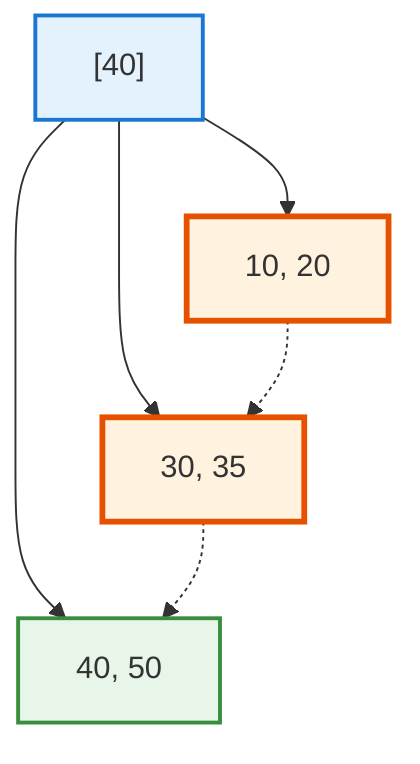

The four values [10, 20, 30, 35] split into two leaves: [10, 20] and [30, 35].

The smallest key of the **right** leaf (30) is propagated up to the parent as a separator.

---

# Insert Step 3 — Update Parent

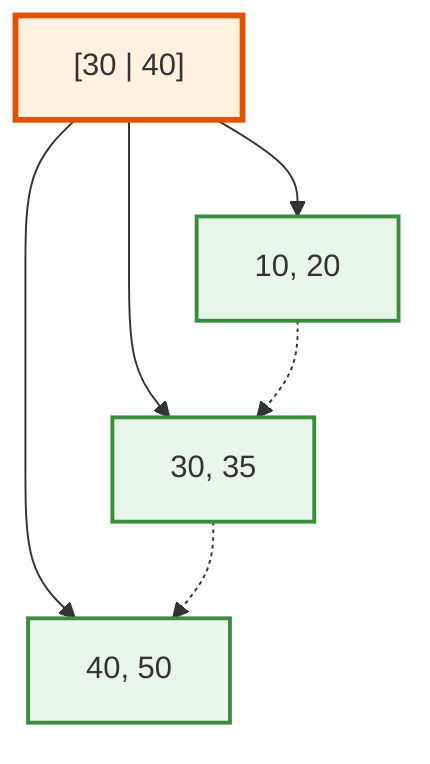

The parent now has 2 separators (30, 40) and 3 children.
That fit. We're done.

If the parent had also been full, we'd split it next. Splits can cascade up.

---

# Cascading Splits

When the **root** itself splits, the tree grows one level. A new root is created with one separator and two children.

This is the **only way** a B+ tree's height changes.

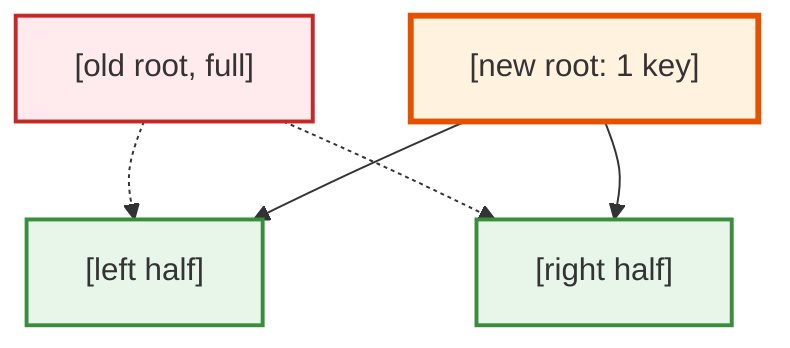

In practice: a 5-level B+ tree growing to 6 levels is rare and slow — billions of inserts.

<!--
Cascading splits are why bulk-load is so much faster than insert-by-insert. Bulk load packs leaves at 80% full and never splits during construction.
-->

---

# Insert Cost

Per insert:

- **Find the leaf**: O(log_F N) page reads
- **Split if needed**: 1 page write per split, propagating up

In the steady state:

- ~99% of inserts: no split, one leaf page dirtied
- ~1% of inserts: one split
- 0.01%: two-level split
- ... and so on, exponentially rarer

Amortized cost: **O(log_F N) per insert** with a small constant.

---

<!-- _class: lead -->

# Part 2: Delete

---

# The Easy Case: Leaf Stays Half-Full


Delete 20.

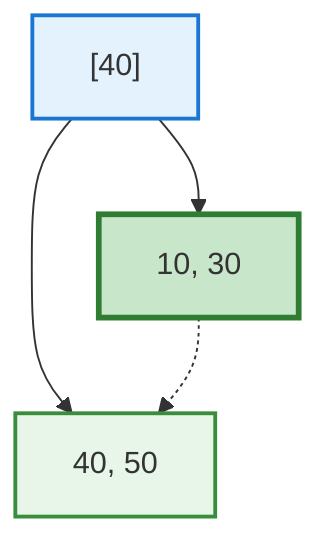

Find, remove, done. The leaf remains at least half full.

---

# The Hard Case: Underflow

Imagine the rule: every leaf must have **at least 2 keys**. Now delete 50:

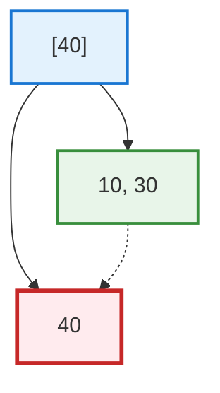

The right leaf has only 1 key. Two options:

- **Redistribute** a key from the sibling
- **Merge** with the sibling

---

# Option A: Redistribute

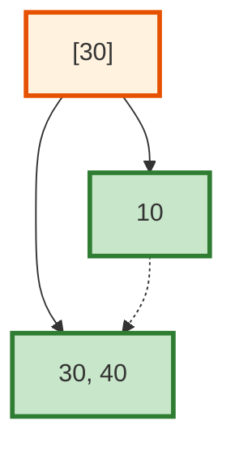

Move one key (30) from the left sibling to the right; update the parent's separator.

Now both leaves have ≥ minimum keys.

---

# Option B: Merge

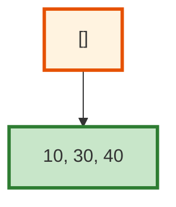

Combine the two leaves into one. The parent loses a separator.

If the parent now has too few separators, the underflow propagates up — possibly all the way to the root, **shrinking the tree by a level**.

---

# Why Real Databases Often Skip Most of This

<div class="columns">
<div>

The textbook delete algorithm is full of redistribute/merge bookkeeping. **Most production engines do not implement it strictly.**

PostgreSQL's btree:
- Marks dead tuples in leaves (does not rebalance)
- Reclaims space via VACUUM (background)
- Tolerates partially-empty leaves

Why? Most workloads insert much more than they delete. Lax delete is fine.

</div>
<div>

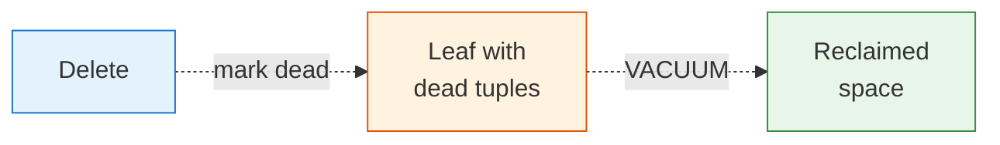

`VACUUM` and `pg_repack` are PostgreSQL's tools for space reclamation. Production databases run these regularly.

</div>
</div>

<!--
The "deletes don't really rebalance" reality is one of the more surprising facts of practical database engineering. Strict delete is correct; lax delete is fast and good enough. Bloat over time is recovered with VACUUM.
-->

---

<!-- _class: lead -->

# Part 3: Cost Analysis

---

# Height as a Function of Fan-Out

$$h = \lceil \log_F N \rceil$$

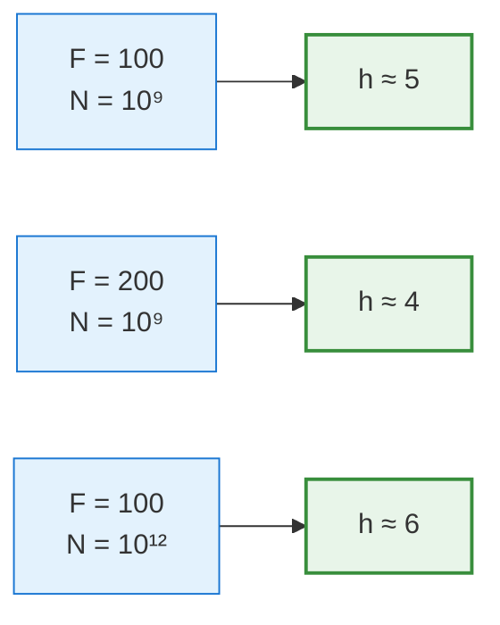

Doubling the fan-out reduces height by 1 step at this scale.
Multiplying the row count by 1000 adds 1-2 steps.

The tree's height is **remarkably stable** across realistic dataset sizes.

---

# Cost Table for Common Operations

| Operation | Cost in page reads | Notes |
|-----------|-------------------|-------|
| Find one row by key | h ≈ 3-5 | Top 2-3 levels usually cached |
| Find rows in a range of R | h + R/(L) | L = entries per leaf |
| Insert one row | h | Plus 1 write; rare splits |
| Delete one row | h | Plus 1 write; usually lax |
| Full table scan via index | h + B_leaf | Often worse than heap scan |
| Build a new index | O(N log N) sort + O(N) build | `CREATE INDEX CONCURRENTLY` |

The full-scan-via-index row is surprising: scanning the heap directly is usually faster than scanning every leaf of an index. The optimizer knows this.

---

# When the Optimizer Ignores an Index

<div class="columns">
<div>

### Reasons the optimizer skips an index

- Predicate matches too many rows (sequential scan wins)
- The index's columns don't cover all needed values (lookup back to heap is expensive)
- Statistics are stale (`ANALYZE` not run recently)
- The table is small enough that one sequential scan beats any index access

</div>
<div>

### How to debug

```sql
EXPLAIN ANALYZE
SELECT * FROM student
WHERE gpa > 3.0;
```

If you expected an index scan and got a Seq Scan, check:
- Selectivity (`SELECT count(*)`)
- Stats freshness (`ANALYZE student`)
- Cost configuration (`random_page_cost`)

</div>
</div>

Section 5 dives deeper into the optimizer's decisions.

---

<!-- _class: lead -->

# Part 4: PostgreSQL's btree

---

# What pg_stat_user_indexes Shows

```sql
SELECT
  schemaname,
  relname            AS table_name,
  indexrelname       AS index_name,
  idx_scan           AS times_used,
  idx_tup_read       AS rows_read_via_index,
  idx_tup_fetch      AS rows_fetched_from_heap
FROM pg_stat_user_indexes
ORDER BY idx_scan DESC;
```

This view tells you **which indexes earn their keep**.

An index with `idx_scan = 0` after weeks of traffic is dead weight — drop it.
Reference: [PostgreSQL Ch. 28.2.11 pg_stat_user_indexes](https://www.postgresql.org/docs/current/monitoring-stats.html#MONITORING-PG-STAT-USER-INDEXES-VIEW).

---

# When Indexes Hurt

<div class="columns">
<div>

### Every index costs

- Disk space (often 20-30% of the table)
- Insert / update / delete time (each modified row must update each index)
- Buffer pool pressure
- VACUUM time

</div>
<div>

### Anti-patterns

- Indexes on every column "just in case"
- Indexes on low-cardinality columns (e.g., `is_active BOOLEAN`) — usually useless
- Indexes the optimizer never picks (check `pg_stat_user_indexes`)

</div>
</div>

> The rule of thumb: an index is justified only if some query actually uses it and the speedup matters.

<!--
The "indexes are not free" point is often missed by application developers. Every index on a frequently-updated table is paying continuous tax for occasional benefit. Section 5 will quantify this; for now, plant the instinct.
-->

---

<!-- _class: lead -->

# Part 5: Project 2 Wrap

---

# Project 2 Due Tonight

<div class="columns">
<div>

### Tonight at 11:59 PM

- `analytics/` directory with 8-10 advanced-SQL files
- One naive-vs-window comparison with timing
- A `notebook.ipynb` with results and charts
- Updated `README.md`

Tag the commit `v2` and push to your `cop5725fa26-project` repo.

</div>
<div>

### Presentations next week

- **Mon Oct 26:** small-group breakouts during class
- **Wed Oct 28:** winners present to the full class

Project 3 (Indexing + Query Plans) released Monday — that one builds on what you just learned today.

</div>
</div>

---

# Wrap-up

You now have:

<div class="columns">
<div>

- Insert with cascading splits
- Delete with redistribute/merge (and why production is lax)
- Cost: O(log_F N) per operation, h = 3-5 in practice

</div>
<div>

- `pg_stat_user_indexes` for index hygiene
- When the optimizer ignores an index
- Partial indexes for low-selectivity boolean columns

</div>
</div>

The B+ tree is the universal database index. You can hand-trace one, predict its cost, and reason about whether one belongs in your schema.

---

# Monday: Hash Indexes

The other major index family.

By the end of Monday you know:
- Static hashing and why nobody uses it
- Extendible hashing
- Linear hashing
- When PostgreSQL's hash index beats its btree

Read GMW Ch. 14.4 before class.

---

# Practice Before Monday

Two exercises:

1. Hand-trace the insert sequence `[10, 20, 30, 40, 50, 60, 70, 80, 90]` into an empty order-4 B+ tree. Show splits.
2. Add a btree index to one of your project's tables. Run `EXPLAIN ANALYZE` on a query that uses it; capture the plan. Then `DROP INDEX` and rerun; compare.

Push to your `cop5725fa26-project` repo before 8:30 AM Mon Oct 26.

---

# Questions

What is on your mind?

Submit Project 2 before 11:59 PM tonight.

<!--
Common Day 26 questions: "How often does the tree height actually change in production?" (Rarely; even billion-row tables stabilize at h=4-5.) "Why don't we use B-trees instead of B+ trees?" (Range scans. B+ has leaf links; B-tree doesn't.) "Is PostgreSQL's btree the same as the textbook B+ tree?" (Very close. PostgreSQL adds concurrency features and uses page-sized nodes; the algorithm is recognizable.)
-->
