<!-- _class: lead -->

# Day 26: B+ Trees II

**COP 5725 - Database Management Systems**
Friday, October 23, 2026

Insertion, deletion, and cost analysis. Project 2 due tonight.

<!--
Closes the B+ tree pair. Heavy on progressive build-outs — show insert step by step. Project 2 due tonight; spend last 5 minutes on it.
-->

---

# Where We Are

<div class="columns-left-wide">
<div>

Wednesday covered structure and search.
Today covers the operations that build and maintain the tree: insertion with splits, deletion with underflow handling, and cost analysis.

Production engines implement deletion loosely, and today explains why.

Project 2 is due tonight at 11:59 PM.

</div>
<div>

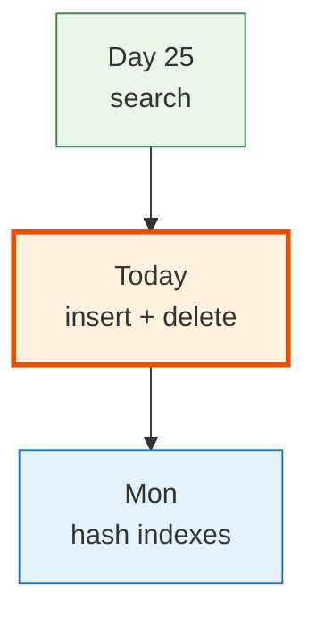

</div>
</div>

---

# Today's Roadmap

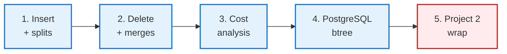

---

<!-- _class: lead -->

# Part 1: Insert with Splits

---

# Insert When the Leaf Has Space

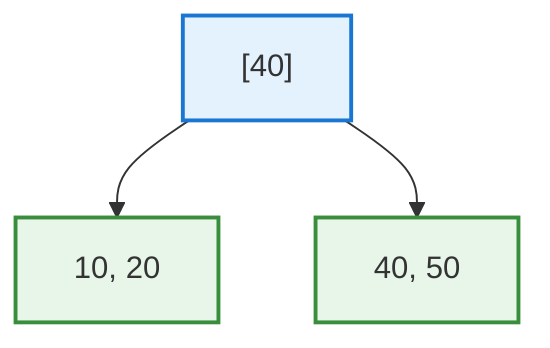

Insert 30. Leaf has room.

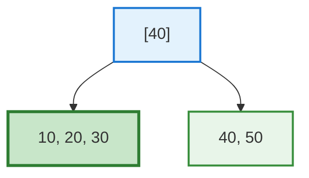

Find the right leaf, slot the value in sorted order <span class="cite">(Textbook §14.2.5, p. 640)</span>. Done.

---

# Insert When the Leaf Is Full

Order-4 tree (max 3 keys per leaf). Insert 35.

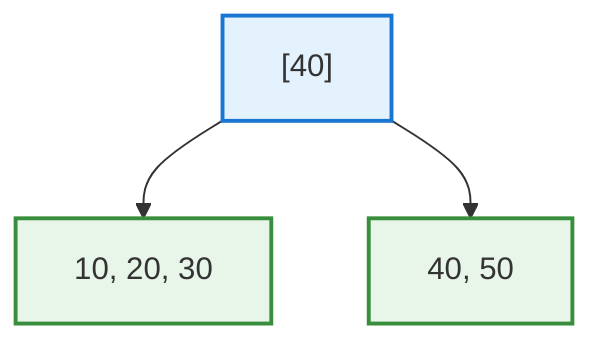

35 belongs in the left leaf. But the leaf already has 3 keys (10, 20, 30) and cannot fit another.

The leaf must split.

---

# Split the Leaf

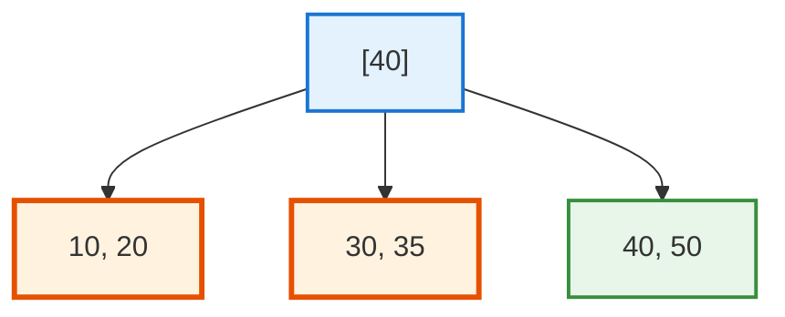

The four values [10, 20, 30, 35] split into two leaves: [10, 20] and [30, 35].

The smallest key of the **right** leaf (30) is propagated up to the parent as a separator.

---

# Update the Parent

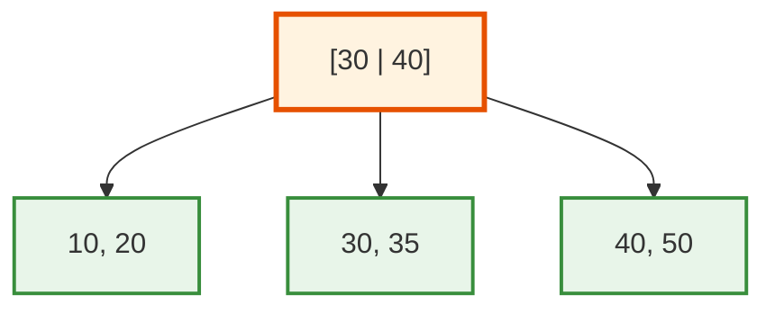

The parent now has 2 separators (30, 40) and 3 children.
The parent has room, so the insert is complete.

If the parent had also been full, we'd split it next. Splits can cascade up.

---

# Cascading Splits

When the **root** itself splits, the tree grows one level. A new root is created with one separator and two children.

This is the **only way** a B+ tree's height changes.

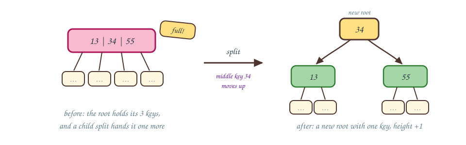

In practice, a 5-level B+ tree grows to 6 levels only after billions of inserts.

<!--
Cascading splits are why bulk-load is so much faster than insert-by-insert. Bulk load packs leaves at 80% full and never splits during construction.
-->

---

# Insert Cost

Per insert:

- **Find the leaf**: O(log_F N) page reads
- **Split if needed**: 1 page write per split, propagating up

In the steady state:

- ~99% of inserts: no split, one leaf page dirtied
- ~1% of inserts: one split
- 0.01%: two-level split
- ... and so on, exponentially rarer

Amortized cost: **O(log_F N) per insert** with a small constant.

<div class="small">

Amortized means averaged over a long run of operations, so the rare splits are spread across the many cheap inserts.

</div>

---

<!-- _class: lead -->

# Part 2: Delete

---

# Delete When the Leaf Stays Half-Full


Delete 20.

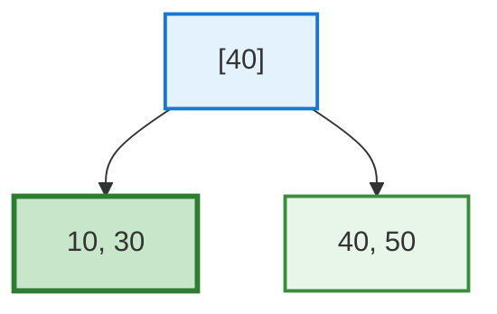

Find, remove, done <span class="cite">(Textbook §14.2.6, p. 642)</span>. The leaf remains at least half full.

---

# Underflow

Imagine the rule: every leaf must have **at least 2 keys**. Now delete 50:

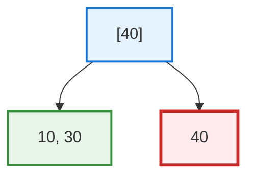

The right leaf has only 1 key. The tree can redistribute a key from the sibling or merge with the sibling.

---

# Redistribute

Redistribution needs a sibling with a key to spare. Suppose the left leaf held 10, 20, 30.

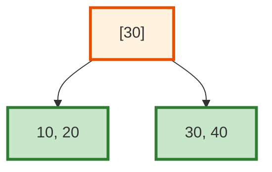

Move the left sibling's largest key (30) into the underfull leaf; update the parent's separator.

Now both leaves have ≥ minimum keys.

<!--
The premise changes here on purpose: with the minimum of 2 keys, a donor holding exactly 10 and 30 has nothing to spare, and stealing from it would just move the violation. Redistribution is legal only when the sibling sits above minimum, so this slide gives the left leaf a third key. The next slide returns to the real 10, 30 state, where merge is the only option.
-->


---

# Merge

In our actual state the left leaf holds only 10 and 30, with no key to spare, so the leaves merge instead.

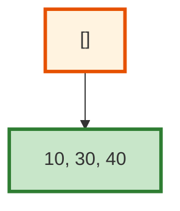

Combine the two leaves into one. The parent loses a separator.

If the parent now has too few separators, the underflow propagates up, possibly all the way to the root, shrinking the tree by a level.

---

# Deletion in Production Engines

<div class="columns">
<div>

The textbook delete algorithm is full of redistribute/merge bookkeeping. Most production engines do not implement it strictly.

PostgreSQL's btree:
- Marks dead tuples in leaves (does not rebalance)
- Reclaims space via VACUUM (background)
- Tolerates partially-empty leaves

Why? Most workloads insert much more than they delete. Lax delete is fine.

</div>
<div>

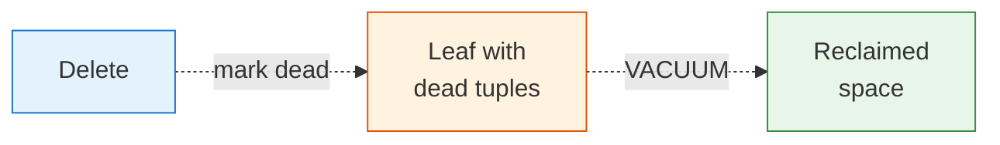

`VACUUM` and `pg_repack` are PostgreSQL's tools for space reclamation. Production databases run these regularly.

</div>
</div>

<!--
The "deletes don't really rebalance" reality is one of the more surprising facts of practical database engineering. Strict delete is correct; lax delete is fast and good enough. Bloat over time is recovered with VACUUM.
-->

---

<!-- _class: lead -->

# Part 3: Cost Analysis

---

# Height as a Function of Fan-Out

$$h = \lceil \log_F N \rceil$$

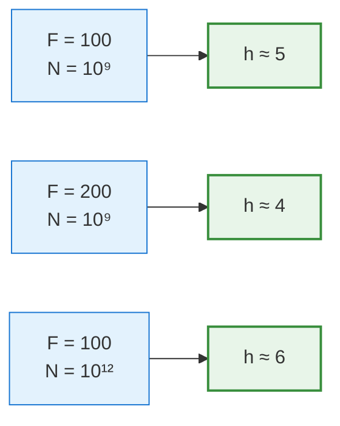

Doubling the fan-out reduces height by 1 step at this scale.
Multiplying the row count by 1000 adds 1-2 steps.

The tree's height stays stable across realistic dataset sizes.

---

# Cost Table for Common Operations

| Operation | Cost in page reads | Notes |
|-----------|-------------------|-------|
| Find one row by key | h ≈ 3-5 | Top 2-3 levels usually cached |
| Find rows in a range of R | h + R/(L) | L = entries per leaf |
| Insert one row | h | Plus 1 write; rare splits |
| Delete one row | h | Plus 1 write; usually lax |
| Full table scan via index | h + B_leaf | Often worse than heap scan |
| Build a new index | O(N log N) sort + O(N) build | `CREATE INDEX CONCURRENTLY` |

The full-scan-via-index row is surprising: scanning the heap directly is usually faster than scanning every leaf of an index. The optimizer knows this.
<span class="cite">The height-bound analysis behind the first four rows is Textbook §14.2.7, p. 645.</span>

---

# When the Optimizer Ignores an Index

<div class="columns">
<div>

### Reasons the optimizer skips an index

- Predicate matches too many rows (sequential scan wins)
- The index's columns don't cover all needed values (lookup back to heap is expensive)
- Statistics are stale (`ANALYZE` not run recently)
- The table is small enough that one sequential scan beats any index access

</div>
<div>

### How to debug

```sql
EXPLAIN ANALYZE
SELECT * FROM student
WHERE gpa > 3.0;
```

If you expected an index scan and got a Seq Scan, check:
- Selectivity (`SELECT count(*)`)
- Stats freshness (`ANALYZE student`)
- Cost configuration (`random_page_cost`)

</div>
</div>

Section 5 dives deeper into the optimizer's decisions.

---

<!-- _class: lead -->

# Part 4: PostgreSQL's btree

---

# What pg_stat_user_indexes Shows

```sql
SELECT
  schemaname,
  relname            AS table_name,
  indexrelname       AS index_name,
  idx_scan           AS times_used,
  idx_tup_read       AS rows_read_via_index,
  idx_tup_fetch      AS rows_fetched_from_heap
FROM pg_stat_user_indexes
ORDER BY idx_scan DESC;
```

This view tells you **which indexes earn their keep**.

An index with `idx_scan = 0` after weeks of traffic is dead weight; drop it.
Reference: PostgreSQL docs [pg_stat_all_indexes](https://www.postgresql.org/docs/current/monitoring-stats.html#MONITORING-PG-STAT-ALL-INDEXES-VIEW); `pg_stat_user_indexes` is the same view filtered to user tables.

---

# When Indexes Hurt

<div class="columns">
<div>

### Every index costs

- Disk space (often 20-30% of the table)
- Insert / update / delete time (each modified row must update each index)
- Buffer pool pressure
- VACUUM time

</div>
<div>

### Anti-patterns

- Indexes on every column "just in case"
- Indexes on low-cardinality columns (e.g., `is_active BOOLEAN`), which are usually useless
- Indexes the optimizer never picks (check `pg_stat_user_indexes`)

</div>
</div>

> The rule of thumb: an index is justified only if some query actually uses it and the speedup matters.

<!--
The "indexes are not free" point is often missed by application developers. Every index on a frequently-updated table is paying continuous tax for occasional benefit. Section 5 will quantify this; for now, plant the instinct.
-->

---

<!-- _class: lead -->

# Part 5: Project 2 Wrap

---

# Project 2 Due Tonight

<div class="columns">
<div>

### Tonight at 11:59 PM

- `analytics/` directory with 8-10 advanced-SQL files
- One naive-vs-window comparison with timing
- A `notebook.ipynb` with results and charts
- Updated `README.md`

Tag the commit `v2` and push to your `cop5725fa26-project` repo.

</div>
<div>

### Presentations next week

- **Mon Oct 26:** small-group breakouts during class
- **Wed Oct 28:** winners present to the full class

Project 3 (Indexing + Query Plans), released Mon Oct 19, builds on today's material.

</div>
</div>

---

# Wrap-up

- Insertion finds the leaf and splits on overflow, and splits can cascade up to the root, growing the tree by a level.
- Deletion handles underflow by redistribution or merging, and production engines instead mark dead entries and let VACUUM reclaim space.
- Every operation costs about the tree height in page reads, and height stays at 3-5 for realistic tables.
- `pg_stat_user_indexes` shows which indexes get used, and unused indexes cost disk space and write time.

<!--
One line per part of the lecture (Project 2 logistics excluded). The hand-trace exercise below is the direct follow-up to the insert walkthrough.
-->

---

# Monday

Monday covers hash indexes: static, extendible, and linear hashing, and PostgreSQL's hash access method.

Read Textbook §14.3, pp. 648-659 before class.

---

# Practice Before Monday

1. Hand-trace the insert sequence `[10, 20, 30, 40, 50, 60, 70, 80, 90]` into an empty order-4 B+ tree. Show splits.
2. Add a btree index to one of your project's tables. Run `EXPLAIN ANALYZE` on a query that uses it; capture the plan. Then `DROP INDEX` and rerun; compare.

This is an exercise.

---

# Questions

What is on your mind?

Submit Project 2 before 11:59 PM tonight.

<!--
Common Day 26 questions: "How often does the tree height actually change in production?" (Rarely; even billion-row tables stabilize at h=4-5.) "Why don't we use B-trees instead of B+ trees?" (Range scans. B+ has leaf links; B-tree doesn't.) "Is PostgreSQL's btree the same as the textbook B+ tree?" (Very close. PostgreSQL adds concurrency features and uses page-sized nodes; the algorithm is recognizable.)
-->
