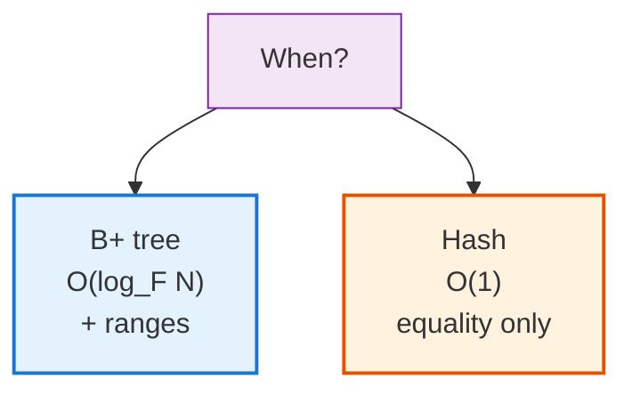
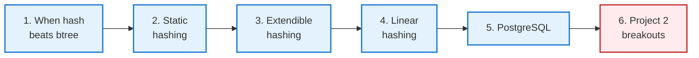
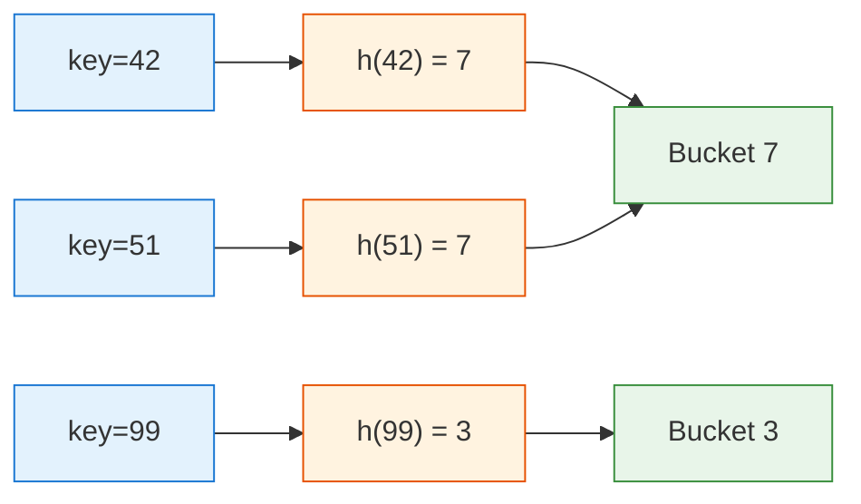
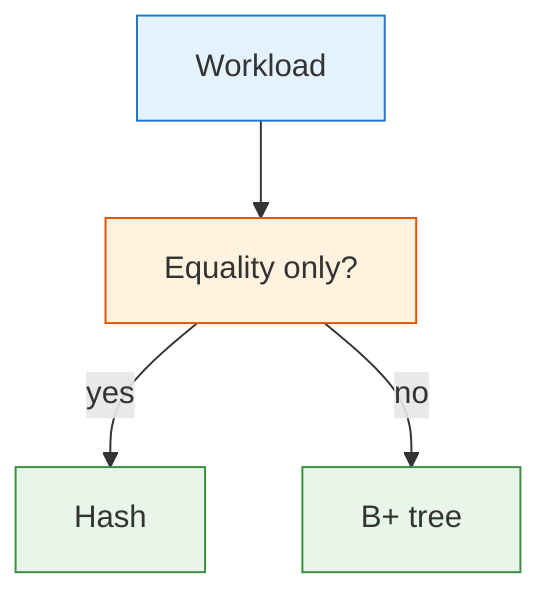
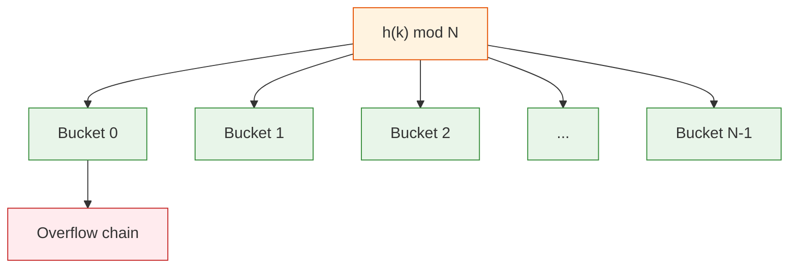
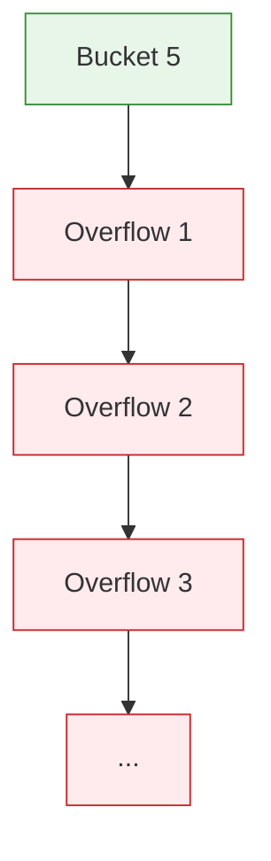
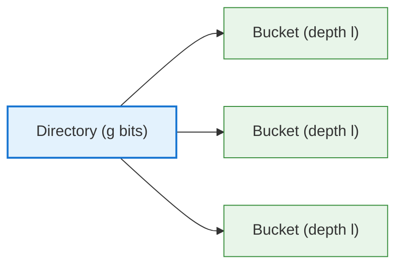
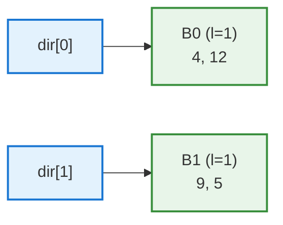
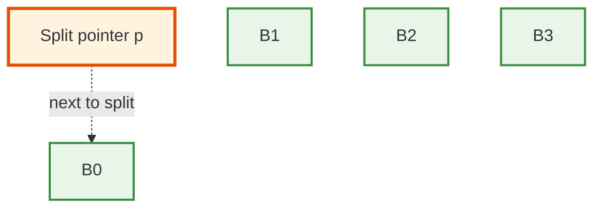
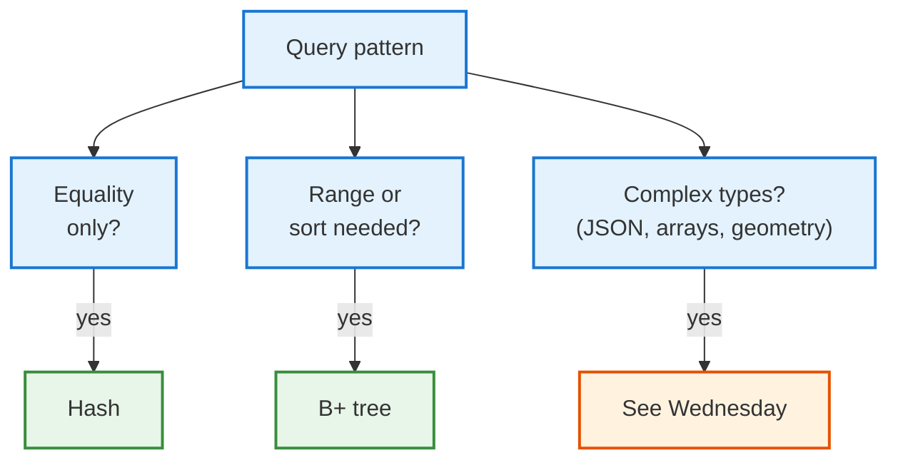

<!-- _class: lead -->

# Day 27: Hash Indexes

**COP 5725 - Database Management**
Monday, October 26, 2026

Equality lookups, faster than a tree

<!--
First class after Project 2 deadline. Project 2 small-group breakouts run in the last 10-15 min today. Pace the lecture content to ~35-40 min, with most time on extendible hashing's progressive build-out.
-->

---

# Where We Are

<div class="columns-left-wide">
<div>

Last week: B+ trees give O(log_F N) lookups + range scans.

Today: hash indexes give **O(1) average** lookups — but no range support.

For pure equality work (`WHERE id = 42`), hash beats btree.
For everything else, btree wins.

PostgreSQL ships both. The optimizer picks.

</div>
<div>



</div>
</div>

---

# Today's Roadmap



Reference: GMW Ch. 14.4; PostgreSQL docs [Ch. 11.2 Index Types — Hash](https://www.postgresql.org/docs/current/indexes-types.html#INDEXES-TYPES-HASH).

---

<!-- _class: lead -->

# Part 1: When Hash Beats B+ Tree

---

# Hash Functions, Briefly

A hash function $h(k)$ maps a key to a bucket index in O(1).

- Same key → same bucket (deterministic)
- Different keys → ideally different buckets (uniform)
- A good hash spreads keys across buckets evenly



42 and 51 collide — they end up in the same bucket. We need a strategy for handling collisions.

---

# When Hash Indexes Win

<div class="columns">
<div>

### Hash wins
- `WHERE user_id = 12345` — equality on a high-cardinality column
- Lookup-heavy session stores
- Join keys (hash joins, Week 12)

### Hash loses
- `WHERE x > 100` — needs ordered data
- `ORDER BY x` — same
- `LIKE 'pre%'` — also a range
- Multi-column composites (sometimes)

</div>
<div>



</div>
</div>

> In practice, B+ trees handle equality almost as fast as hash and also handle ranges. Most databases default to btree.

PostgreSQL's hash index is **most useful when you know you only ever do `=` and never `BETWEEN`**.

---

<!-- _class: lead -->

# Part 2: Static Hashing

---

# Static Hashing



Pick `N` buckets up front. Each bucket is a page (or chain of pages).

The simplest scheme. Fast when load is light.

---

# Why Static Hashing Falls Apart

<div class="columns">
<div>

### The problem

As data grows, **buckets fill up**.

A full bucket spills into an **overflow page**. Then another. Then another.

Lookups degrade from O(1) to O(chain length) — eventually O(N).

The fix would be **rehashing** — pick a bigger N, rebuild everything. But rebuilding the entire index for one insert is unacceptable.

</div>
<div>



</div>
</div>

Two real-world solutions emerged: **extendible hashing** (Fagin et al., 1979) and **linear hashing** (Litwin, 1980). Both grow the table incrementally.

---

<!-- _class: lead -->

# Part 3: Extendible Hashing

---

# Extendible Hashing: The Idea

Instead of one fixed `N`, maintain a **directory** that points to buckets.

- The directory has $2^g$ entries, where $g$ is the **global depth**.
- Each bucket has a **local depth** $l \leq g$, indicating how many bits of the hash actually distinguish it.
- Multiple directory entries can point to the same bucket (when $l < g$).



On overflow, **split the bucket, double the directory if needed**.

---

# Extendible Hashing — Step 1

Bucket size 2. Global depth $g = 1$. Two directory entries, two buckets.



Keys go to bucket 0 if their last bit is 0, bucket 1 if it's 1.

- 4 = `100` → ends in 0 → bucket 0
- 12 = `1100` → ends in 0 → bucket 0
- 9 = `1001` → ends in 1 → bucket 1
- 5 = `101` → ends in 1 → bucket 1

---

# Extendible Hashing — Step 2: Insert 13

13 = `1101` → ends in 1 → bucket 1.

But bucket 1 is full (already has 9, 5, both with last bit 1).

**Split bucket 1** by extending to look at the **last 2 bits**:


The directory **doubles** (g goes from 1 to 2). Bucket 0 keeps local depth 1, so both `dir[00]` and `dir[10]` point to it. Bucket 1 splits into two new buckets each at depth 2.

9 = `1001` last 2 bits = `01` → new bucket B01
13 = `1101` last 2 bits = `01` → also B01
5 = `0101` last 2 bits = `01` ... wait, 5 in binary is `0101`, last 2 bits are `01`. Hmm.

Let me redo with binary that splits cleanly. Keys: 4, 12 → ends 00; 9, 13 → ends 01; 5 → ends 01; ... actually let me show the algorithm pattern not the exact bits.

<!--
The on-screen example has a small accounting issue with bit patterns — when teaching, choose keys that split cleanly. The principle is what matters: doubling the directory and splitting one bucket while keeping the other at its old depth.
-->

---

# Extendible Hashing — The Algorithm

```
Insert(key):
  bucket = directory[low g bits of h(key)]
  if bucket has space:
    add key to bucket
    return

  # bucket overflow
  if bucket.local_depth < g:
    split this bucket at depth local_depth + 1
    # no need to grow the directory
  else:
    double the directory (g += 1)
    split the bucket
```

Two cases on overflow:

1. **Local depth < global depth**: just split the bucket. Directory stays the same size.
2. **Local depth = global depth**: double the directory, then split.

Lookups remain O(1): one directory access + one bucket access.

---

# Extendible Hashing: Strengths and Costs

<div class="columns">
<div>

### Strengths

- O(1) lookups
- Grows incrementally — no full rebuild
- Directory is small (a few KB even for huge indexes)

</div>
<div>

### Costs

- Directory doubles when global depth grows
- Bad hash distribution causes one bucket to absorb everything
- Skew is amplified, not absorbed

</div>
</div>

Extendible hashing is the index structure in **classic textbooks** (Garcia-Molina, Ullman, Widom).

PostgreSQL's hash index uses a **variant** with optimizations for concurrency.

---

<!-- _class: lead -->

# Part 4: Linear Hashing

---

# Linear Hashing: The Alternative

Litwin's 1980 alternative.

- No directory
- Buckets split **in order**, one at a time
- A **split pointer** tracks which bucket is next to split
- Doubles in size over the course of $N$ splits



When any bucket overflows, the bucket at the split pointer splits — even if it isn't the one that overflowed.

---

# Linear Hashing — Trade-Offs

<div class="columns">
<div>

### Pros

- No directory at all
- Bounded average chain length
- Simpler concurrency than extendible

### Cons

- Bucket that overflowed waits in an overflow chain until its turn at the split pointer
- Worst-case lookups can have multiple page reads while a chain exists

</div>
<div>

PostgreSQL's hash index uses **linear hashing** internally.

That's why a fresh hash index might have unexpected page layout but stabilizes nicely over time.

Reference: [PostgreSQL Ch. 67.4 Hash Indexes Internals](https://www.postgresql.org/docs/current/hash-index.html).

</div>
</div>

<!--
Both extendible and linear hashing solve the same problem (grow incrementally without a full rebuild) with different trade-offs. PostgreSQL chose linear; other systems (some research engines) chose extendible. Both are correct.
-->

---

<!-- _class: lead -->

# Part 5: PostgreSQL's Hash Index

---

# CREATE INDEX USING hash

```sql
-- Build a hash index
CREATE INDEX student_email_hash_idx
ON student
USING hash (email);

-- Or, with CONCURRENTLY:
CREATE INDEX CONCURRENTLY student_email_hash_idx
ON student
USING hash (email);
```

PostgreSQL's hash index has gone through several lives:
- Pre-PG 10: not WAL-logged → unsafe across restarts → rarely used
- PG 10+: WAL-logged, durable, eligible for replication

Modern PostgreSQL hash indexes are **production-safe** and competitive with btree for pure equality.

---

# When PG's Hash Index Wins

```sql
EXPLAIN ANALYZE
SELECT * FROM student WHERE email = 'ada@uf.edu';
```

If the email column has a hash index:
- Hash index lookup: 1 page read
- btree lookup: 3-5 page reads (depending on tree height)

For tables where:
- The only operation is equality
- The column has high cardinality (most values distinct)
- The table is large enough that the btree height matters

…a hash index is slightly faster than a btree.

For most workloads, btree's range support and slight equality cost penalty is worth it.

---

# Section 4 Index Choice So Far



Wednesday: PostgreSQL's specialized index types for everything that doesn't fit btree or hash.

---

<!-- _class: lead -->

# Part 6: Project 2 Group Presentations

---

# Project 2 Presentations — Today

<div class="columns">
<div>

### Last 15 minutes

- Form into small breakout groups (4-5 students each, assigned at start of class)
- Each student presents their Project 2 in 3-4 minutes
- Group votes for the strongest presentation
- **Winners present to the full class on Wednesday**

</div>
<div>

### Goals

- Show off your dataset's most interesting query
- Demo one window function or recursive CTE
- Explain one design tradeoff you made

</div>
</div>

The instructor and TA will circulate during breakouts to time things and answer questions.

---

# Wrap-up

You now have:

<div class="columns">
<div>

- Hash vs B+ tree: equality vs range trade-off
- Static hashing and why it fails
- Extendible hashing with directory doubling

</div>
<div>

- Linear hashing as the directory-less alternative
- PostgreSQL's `USING hash` (linear hashing, WAL-logged since PG 10)
- A working "which index" decision flow

</div>
</div>

---

# Wednesday: PostgreSQL's Full Index Zoo

We cover the indexes that aren't btree or hash:

- **GiST** — generalized search tree (geometry, ranges, full text)
- **GIN** — inverted index (arrays, JSONB, FTS)
- **BRIN** — block range index (huge tables, append-only)
- **Partial** — index a slice
- **Expression** — index a computed value
- **Multi-column** — and the leftmost-prefix rule

Plus the **Project 2 winners** present.

Read PostgreSQL docs [Ch. 11.2 Index Types](https://www.postgresql.org/docs/current/indexes-types.html).

---

# Practice Before Wednesday

Two exercises:

1. Add a hash index on a high-cardinality equality column in your project's database. Capture `EXPLAIN ANALYZE` before and after, and the size with `pg_relation_size('your_index_name')`.
2. Hand-trace inserts of `[10, 14, 20, 22, 28, 35]` into an extendible hash with bucket size 2.

Push to your `cop5725fa26-project` repo before 8:30 AM Wed Oct 28.

---

# Questions

What is on your mind?

Project 2 winners selected today, present Wednesday.

<!--
Common Day 27 questions: "Why doesn't every database default to hash?" (Range support — btree handles WHERE x > 100 and ORDER BY; hash doesn't.) "Is PostgreSQL's hash index now safe to use?" (Yes, since PG 10. Pre-PG 10 it wasn't WAL-logged.) "Are there hybrid indexes?" (Yes — SP-GiST, learned indexes from Kraska 2018. We touch some Wednesday.)
-->
