<!-- _class: lead -->

# Day 27: Hash Indexes

**COP 5725 - Database Management Systems**
Monday, October 26, 2026

Equality lookups, faster than a tree

<!--
First class after Project 2 deadline. Project 2 small-group breakouts run in the last 10-15 min today. Pace the lecture content to ~35-40 min, with most time on extendible hashing's progressive build-out.
-->

---

# Where We Are

<div class="columns-left-wide">
<div>

Last week covered B+ trees, which give O(log_F N) lookups and range scans.
Today covers hash indexes, which give O(1) average lookups but no range support.

For pure equality work (`WHERE id = 42`), hash beats btree.
For everything else, btree wins.

PostgreSQL ships both. The optimizer picks.

</div>
<div>

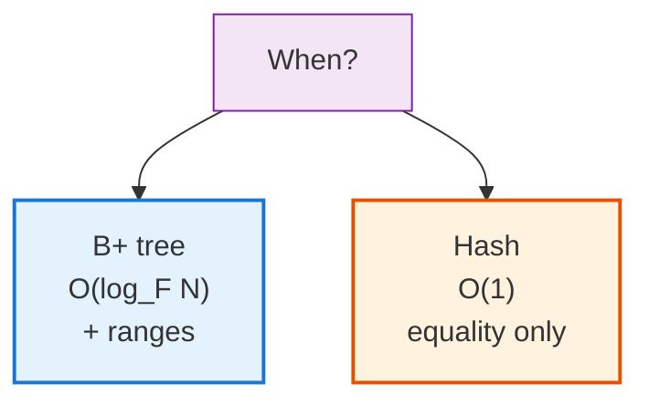

</div>
</div>

---

# Today's Roadmap

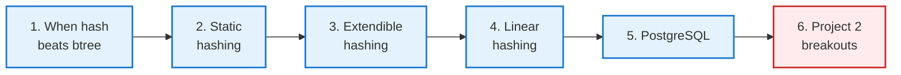

Reference: Textbook §14.3, pp. 648-659; PostgreSQL docs [Ch. 11.2 Index Types, Hash](https://www.postgresql.org/docs/current/indexes-types.html#INDEXES-TYPES-HASH).

---

<!-- _class: lead -->

# Part 1: When Hash Beats B+ Tree

---

# Hash Functions

A hash function $h(k)$ maps a key to a bucket index in O(1).

- The same key always maps to the same bucket (deterministic)
- Different keys ideally map to different buckets (uniform)
- A good hash spreads keys across buckets evenly

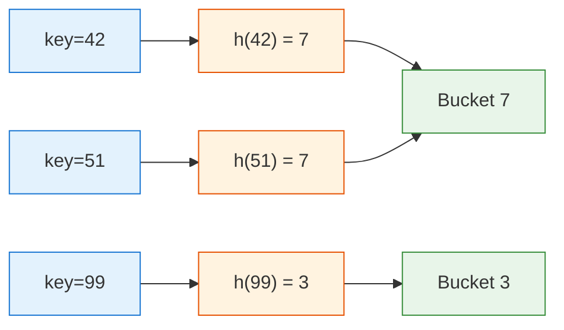

42 and 51 collide and end up in the same bucket, so we need a strategy for handling collisions.

---

# When Hash Indexes Win

<div class="columns">
<div>

### Hash wins
- `WHERE user_id = 12345`, equality on a high-cardinality column
- Lookup-heavy session stores
- Join keys (hash joins, Week 12)

### Hash loses
- `WHERE x > 100` needs ordered data
- `ORDER BY x` needs ordered data
- `LIKE 'pre%'` is also a range
- Multi-column composites (sometimes)

</div>
<div>

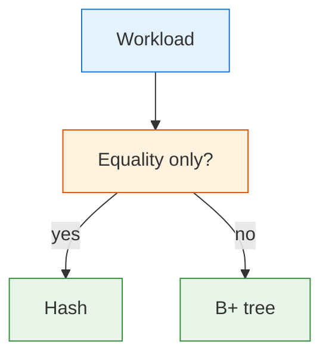

</div>
</div>

> In practice, B+ trees handle equality almost as fast as hash and also handle ranges. Most databases default to btree.

PostgreSQL's hash index is most useful when you know you only ever do `=` and never `BETWEEN`.

---

<!-- _class: lead -->

# Part 2: Static Hashing

---

# Static Hashing

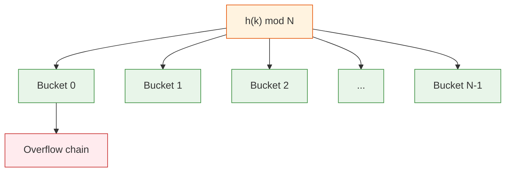

Pick `N` buckets up front. Each bucket is a page (or chain of pages).

The simplest scheme. Fast when load is light.

---

# Why Static Hashing Fails

<div class="columns">
<div>

### The problem

As data grows, **buckets fill up**.

A full bucket spills into an **overflow page**. Then another. Then another.

Lookups degrade from O(1) to O(chain length), and eventually O(N).

The fix would be rehashing: pick a bigger N and rebuild everything. But rebuilding the entire index for one insert is unacceptable.

</div>
<div>

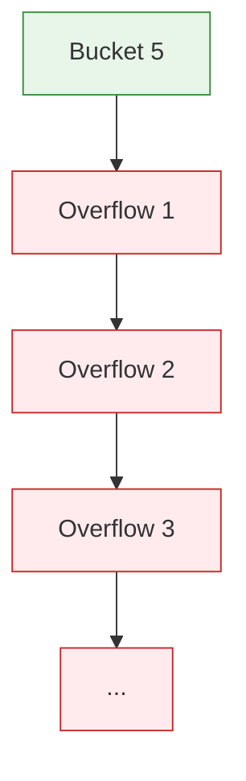

</div>
</div>

Two real-world solutions emerged: **extendible hashing** (Fagin et al., 1979) and **linear hashing** (Litwin, 1980). Both grow the table incrementally.

---

<!-- _class: lead -->

# Part 3: Extendible Hashing

---

# Extendible Hashing

Instead of one fixed `N`, maintain a **directory** that points to buckets.

- The directory has $2^g$ entries, where $g$ is the **global depth**.
- Each bucket has a **local depth** $l \leq g$, indicating how many bits of the hash actually distinguish it.
- Multiple directory entries can point to the same bucket (when $l < g$).

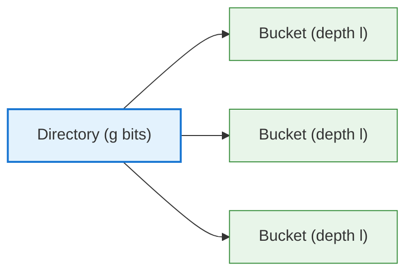

On overflow, **split the bucket, double the directory if needed**.

---

# Extendible Hashing Step 1

Bucket size 2. Global depth $g = 1$. Two directory entries, two buckets.

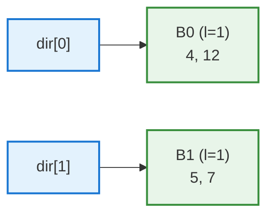

Keys go to bucket 0 if their last bit is 0, bucket 1 if it's 1.

- 4 = `100` ends in 0, so it goes to bucket 0
- 12 = `1100` ends in 0, so it goes to bucket 0
- 5 = `101` ends in 1, so it goes to bucket 1
- 7 = `111` ends in 1, so it goes to bucket 1

---

# Extendible Hashing Step 2

Insert 13. 13 = `1101` ends in 1, so it belongs in bucket 1.

But bucket 1 is full (already has 5 and 7, both with last bit 1).

Split bucket 1 by extending to look at the **last 2 bits**:

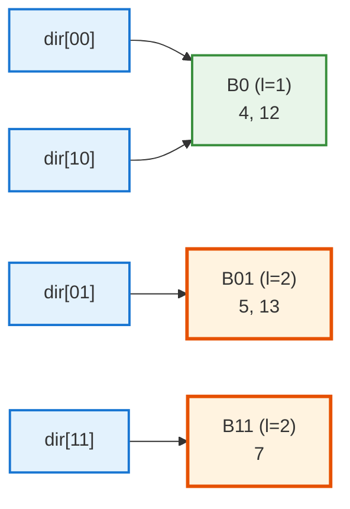

The directory doubles (g goes from 1 to 2). Bucket 0 keeps local depth 1, so both `dir[00]` and `dir[10]` point to it. Bucket 1 splits into two buckets at depth 2.

- 5 = `101` has last 2 bits `01`, so it goes to B01
- 13 = `1101` has last 2 bits `01`, so it goes to B01
- 7 = `111` has last 2 bits `11`, so it goes to B11

<!--
Walk this slowly. The two takeaways: the directory doubles but only the overflowing bucket splits, and the untouched bucket keeps its old local depth with two directory entries pointing at it. Keys 4, 12, 5, 7, 13 were chosen so the split lands cleanly: 5 and 13 share suffix 01, 7 has suffix 11.
-->

---

# The Extendible Hashing Algorithm

```
Insert(key):
  bucket = directory[low g bits of h(key)]
  if bucket has space:
    add key to bucket
    return

  # bucket overflow
  if bucket.local_depth < g:
    split this bucket at depth local_depth + 1
    # no need to grow the directory
  else:
    double the directory (g += 1)
    split the bucket
```

Two cases on overflow:

1. **Local depth < global depth**: just split the bucket. Directory stays the same size.
2. **Local depth = global depth**: double the directory, then split.

Lookups remain O(1): one directory access + one bucket access.

---

# Extendible Hashing Strengths and Costs

<div class="columns">
<div>

### Strengths

- O(1) lookups
- Grows incrementally with no full rebuild
- Directory is small (a few KB even for huge indexes)

</div>
<div>

### Costs

- Directory doubles when global depth grows
- Bad hash distribution causes one bucket to absorb everything
- Repeated splits on a hot bucket enlarge the directory quickly

</div>
</div>

Extendible hashing is the version the textbook presents (§14.3.5-14.3.6, pp. 652-655).

PostgreSQL's hash index instead builds on linear hashing, covered next.

---

<!-- _class: lead -->

# Part 4: Linear Hashing

---

# Linear Hashing

Litwin's 1980 alternative.

- No directory
- Buckets split **in order**, one at a time
- A **split pointer** tracks which bucket is next to split
- Doubles in size over the course of $N$ splits

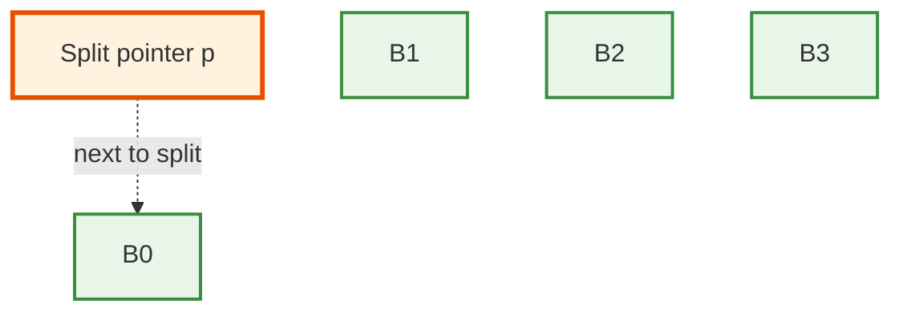

When any bucket overflows, the bucket at the split pointer splits, even if it isn't the one that overflowed.

---

# Linear Hashing Trade-Offs

<div class="columns">
<div>

### Pros

- No directory at all
- Bounded average chain length
- Simpler concurrency than extendible

### Cons

- Bucket that overflowed waits in an overflow chain until its turn at the split pointer
- Worst-case lookups can have multiple page reads while a chain exists

</div>
<div>

PostgreSQL's hash index uses **linear hashing** internally.

A fresh hash index allocates buckets as it grows, and the layout stabilizes over time.

Reference: [PostgreSQL Ch. 67.4 Hash Indexes Internals](https://www.postgresql.org/docs/current/hash-index.html).

</div>
</div>

<!--
Both extendible and linear hashing solve the same problem (grow incrementally without a full rebuild) with different trade-offs. PostgreSQL chose linear; other systems (some research engines) chose extendible. Both are correct.
-->

---

<!-- _class: lead -->

# Part 5: PostgreSQL's Hash Index

---

# CREATE INDEX USING hash

```sql
-- Build a hash index
CREATE INDEX student_email_hash_idx
ON student
USING hash (email);

-- Or, with CONCURRENTLY:
CREATE INDEX CONCURRENTLY student_email_hash_idx
ON student
USING hash (email);
```

PostgreSQL's hash index changed at version 10:
- Before PG 10 it was not WAL-logged, so it was unsafe across restarts and rarely used
- Since PG 10 it is WAL-logged, durable, and eligible for replication

Modern PostgreSQL hash indexes are **production-safe** and competitive with btree for pure equality.

---

# When the Hash Index Wins

```sql
EXPLAIN ANALYZE
SELECT * FROM student WHERE email = 'ada@uf.edu';
```

If the email column has a hash index:
- Hash index lookup: 1 page read
- btree lookup: 3-5 page reads (depending on tree height)

A hash index is slightly faster than a btree when the only operation is equality, the column has high cardinality, and the table is large enough that btree height matters.

For most workloads, btree's range support justifies its slightly slower equality lookups.

---

# Section 4 Index Choice So Far

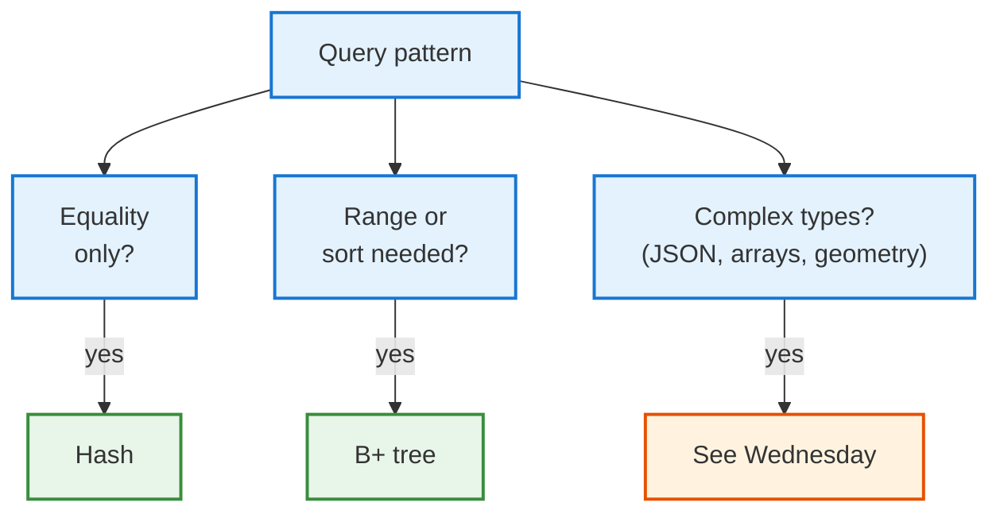

Wednesday covers PostgreSQL's specialized index types for everything that doesn't fit btree or hash.

---

<!-- _class: lead -->

# Part 6: Project 2 Group Presentations

---

# Project 2 Presentations Today

<div class="columns">
<div>

### Last 15 minutes

- Form into small breakout groups (4-5 students each, assigned at start of class)
- Each student presents their Project 2 in 3-4 minutes
- Group votes for the strongest presentation
- **Winners present to the full class on Wednesday**

</div>
<div>

### Goals

- Show off your dataset's most interesting query
- Demo one window function or recursive CTE
- Explain one design tradeoff you made

</div>
</div>

The instructor and TA will circulate during breakouts to time things and answer questions.

---

# Wrap-up

- Hash indexes serve equality lookups in O(1) average and give up range support, so btree stays the default.
- Static hashing degrades into overflow chains because the bucket count is fixed.
- Extendible hashing grows incrementally by splitting buckets and doubling a small directory.
- Linear hashing splits buckets in rotation with no directory, and PostgreSQL's `USING hash` builds on it (WAL-logged since PG 10).

<!--
One line per part of the lecture (Project 2 breakouts excluded). The extendible hand-trace exercise below mirrors the in-class example with different keys.
-->

---

# Wednesday

Wednesday covers PostgreSQL's other index types: GiST, GIN, BRIN, partial, expression, and multi-column indexes. Project 2 winners present.

Read PostgreSQL docs [Ch. 11.2 Index Types](https://www.postgresql.org/docs/current/indexes-types.html) before class.

---

# Practice Before Wednesday

1. Add a hash index on a high-cardinality equality column in your project's database. Capture `EXPLAIN ANALYZE` before and after, and the size with `pg_relation_size('your_index_name')`.
2. Hand-trace inserts of `[10, 14, 20, 22, 28, 35]` into an extendible hash with bucket size 2.

Push to your `cop5725fa26-project` repo before 8:30 AM Wed Oct 28.

---

# Questions

What is on your mind?

Project 2 winners selected today, present Wednesday.

<!--
Common Day 27 questions: "Why doesn't every database default to hash?" (Range support — btree handles WHERE x > 100 and ORDER BY; hash doesn't.) "Is PostgreSQL's hash index now safe to use?" (Yes, since PG 10. Pre-PG 10 it wasn't WAL-logged.) "Are there hybrid indexes?" (Yes — SP-GiST, learned indexes from Kraska 2018. We touch some Wednesday.)
-->
