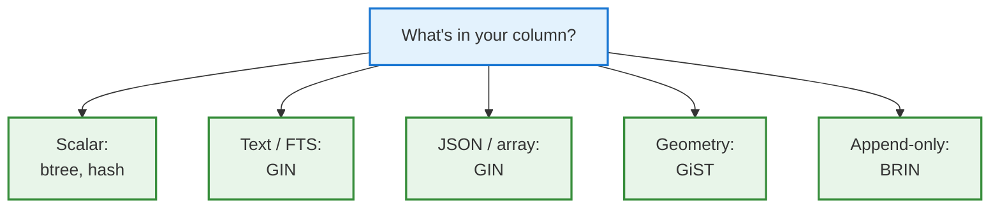
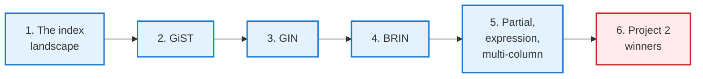
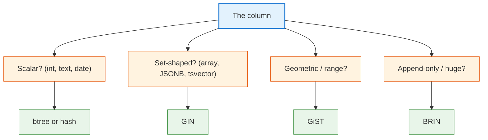
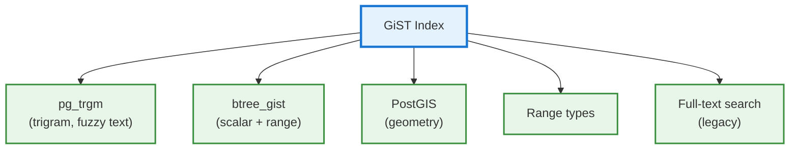
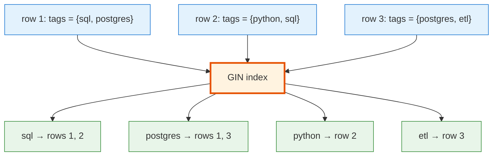
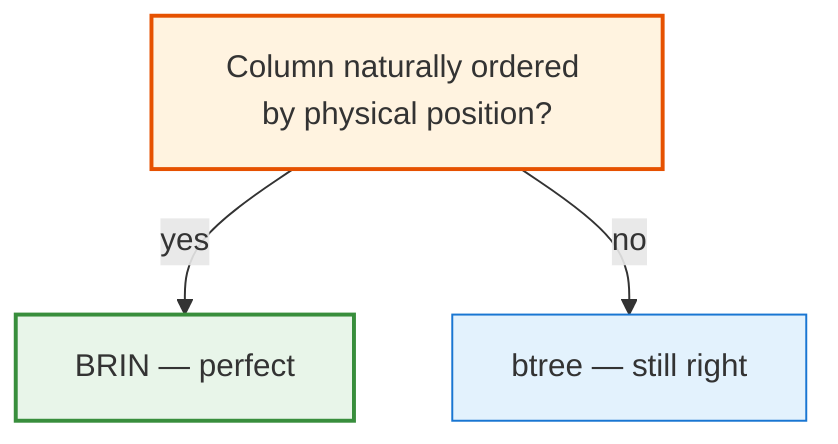
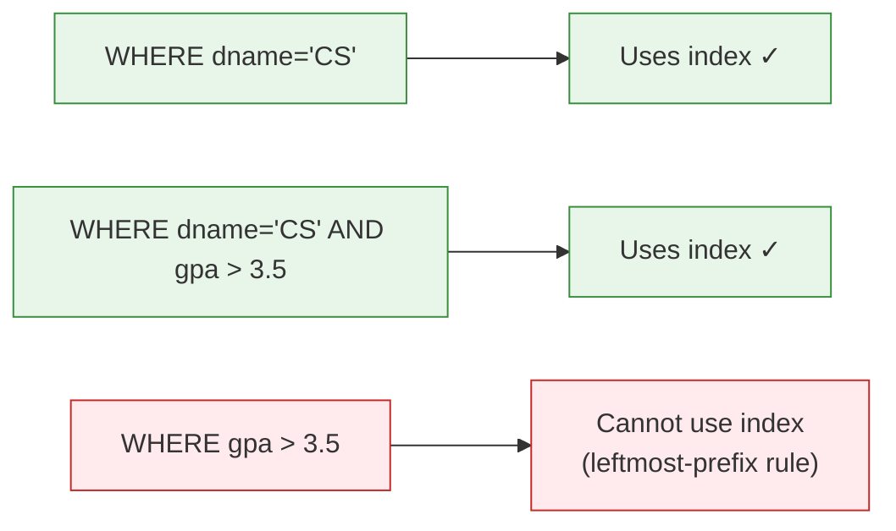

<!-- _class: lead -->

# Day 28: PostgreSQL's Index Zoo

**COP 5725 - Database Management Systems**
Wednesday, October 28, 2026

GiST · GIN · BRIN · partial · expression · multi-column

<!--
Most content-rich day in Section 4. Project 2 winners present in the last 10-15 min. Pace the lecture for 35 min and reserve 15 for winners + Q&A.
-->

---

# Where We Are

<div class="columns-left-wide">
<div>

For two weeks you have had two index types: **btree** and **hash**.

Today: the rest of PostgreSQL's index zoo. Each one solves a problem that btree and hash cannot.

By the end of the hour you can pick the right index for:
- Full-text search
- JSONB queries
- Spatial / geometric data
- Tables with billions of rows where btree is too big
- Queries that filter on a boolean or expression

</div>
<div>



</div>
</div>

---

# Today's Roadmap



Reference: PostgreSQL docs [Ch. 11.2 Index Types](https://www.postgresql.org/docs/current/indexes-types.html), [Ch. 11.7 Indexes on Expressions](https://www.postgresql.org/docs/current/indexes-expressional.html), [Ch. 11.8 Partial Indexes](https://www.postgresql.org/docs/current/indexes-partial.html).

---

<!-- _class: lead -->

# Part 1: The Landscape

---

# The Six PostgreSQL Index Types

| Type | Best for | Cost |
|------|----------|------|
| **btree** | Scalar equality + range, ORDER BY | The default |
| **hash** | Scalar equality only | Slightly faster than btree on `=` |
| **GiST** | Geometric, range types, full-text, custom operators | Generalized search tree framework |
| **SP-GiST** | Non-balanced data structures (quadtree, k-d tree) | Niche, rarely used |
| **GIN** | "Set inside a value" — arrays, JSONB, FTS tokens | Large but fast for contains queries |
| **BRIN** | Append-mostly, naturally ordered, huge tables | Tiny — 1/1000 the size of btree |

Reference: [Ch. 11.2 Index Types](https://www.postgresql.org/docs/current/indexes-types.html).

<!--
Six types but only four matter for most workloads: btree, hash, GIN, BRIN. GiST powers PostGIS but few non-PostGIS apps. SP-GiST is niche.
-->

---

# What Drives the Choice



Two questions: **what shape is the column** and **how does the workload query it?**

---

<!-- _class: lead -->

# Part 2: GiST — Generalized Search Tree

---

# GiST in One Slide

GiST is a **framework** for building tree-shaped indexes, not a single algorithm.

You define:
- A type
- A set of operators (`@>`, `&&`, `<<`, etc.)
- Functions: `consistent`, `union`, `compress`, `decompress`, `penalty`, `picksplit`

PostgreSQL builds the tree; your functions define what "fits in this branch" means.



The biggest GiST users: PostGIS, range types, fuzzy text search.

---

# A Real GiST Example: Room Bookings

```sql
CREATE EXTENSION IF NOT EXISTS btree_gist;

CREATE TABLE room_booking (
  id     bigserial PRIMARY KEY,
  room   text NOT NULL,
  during tstzrange NOT NULL,
  EXCLUDE USING gist (room WITH =, during WITH &&)
);

-- This insert is rejected if any existing row has same room
-- AND overlapping time range
INSERT INTO room_booking (room, during)
VALUES ('CSE-401', '[2026-10-28 10:00, 2026-10-28 11:00)');
```

The `EXCLUDE USING gist` constraint (Day 18) is backed by a GiST index that supports both `=` (rooms) and `&&` (overlapping ranges).

No other index type supports this combination natively.

<!--
The booking system example is the canonical "GiST in production" pattern. The btree_gist extension lets GiST handle scalar operators too — required for the room match.
-->

---

<!-- _class: lead -->

# Part 3: GIN — Inverted Index

---

# GIN in One Sentence

> A **G**eneralized **IN**verted index maps **elements inside a value** to the rows that contain them.

If your column is "set-shaped" — an array, a JSONB document, a full-text vector — GIN indexes the contents, not the value as a whole.



The query `WHERE tags @> ARRAY['sql']` walks the inverted index, finds rows 1 and 2 instantly.

---

# GIN for Full-Text Search

```sql
CREATE TABLE article (
  id   bigserial PRIMARY KEY,
  body text NOT NULL,
  body_tsv tsvector GENERATED ALWAYS AS (
    to_tsvector('english', body)
  ) STORED
);

CREATE INDEX article_body_idx ON article USING GIN (body_tsv);

SELECT id FROM article
WHERE body_tsv @@ to_tsquery('english', 'database & system');
```

The GIN index supports `@@` (match), `@>` (contains), and `?` (key exists) operators on `tsvector`, `jsonb`, and array types.

Reference: [PostgreSQL Ch. 12 Full Text Search](https://www.postgresql.org/docs/current/textsearch.html).

---

# GIN for JSONB

```sql
CREATE TABLE webhook (
  id bigserial PRIMARY KEY,
  payload jsonb NOT NULL
);

CREATE INDEX webhook_payload_idx ON webhook USING GIN (payload);

-- Find rows containing this key/value pair
SELECT id FROM webhook
WHERE payload @> '{"event": "user.signup"}';

-- Or with the jsonb_path_ops opclass (smaller, faster, contains only)
CREATE INDEX webhook_payload_idx2
ON webhook USING GIN (payload jsonb_path_ops);
```

Two opclasses for JSONB GIN:
- Default: supports `?`, `?&`, `?|`, `@>` (slower, larger)
- `jsonb_path_ops`: supports `@>` only (faster, smaller)

Use `jsonb_path_ops` if all you do is "contains" queries.

<!--
The "JSONB + GIN" combination is one of PostgreSQL's strongest 2010s-era stories. It made Postgres competitive with MongoDB for many JSON-heavy workloads without giving up SQL.
-->

---

# GIN Tradeoffs

<div class="columns">
<div>

### Wins

- Fast "contains" queries on set-shaped columns
- Indexes thousands of distinct values per row
- Supports arrays, JSONB, tsvector

### Costs

- Index size: often 2-5× the base table
- Slow updates (every changed element triggers a tree walk)
- Inserts can be slow during bulk loads

</div>
<div>

### Fastupdate

The default for GIN. Inserts go to a **pending list**, batched into the tree later.

```sql
CREATE INDEX ... USING GIN (col) WITH (fastupdate = on);
-- Or off for predictable latency:
CREATE INDEX ... USING GIN (col) WITH (fastupdate = off);
```

</div>
</div>

---

<!-- _class: lead -->

# Part 4: BRIN — Block Range Index

---

# BRIN: Tiny Indexes for Big Tables

A BRIN index stores, for each **block range** (a contiguous set of pages), just the min and max values.

```
Block 1-128: min=2024-01-01, max=2024-01-08
Block 129-256: min=2024-01-08, max=2024-01-15
Block 257-384: min=2024-01-15, max=2024-01-22
...
```

When you query `WHERE created_at = '2024-01-10'`, BRIN reads the block-range summary, sees which ranges could possibly contain the value, and scans only those.

The index is **1/1000th the size of a btree**.

---

# When BRIN Wins



BRIN works when **physical position correlates with the indexed value**:
- Append-only tables (autoincrement IDs, timestamps)
- Partitioned tables sorted by partition key
- Tables that have been `CLUSTER`ed on the column

A column like `email` has no correlation with physical position — BRIN is useless.
A column like `created_at` in an event log has perfect correlation — BRIN crushes it.

---

# BRIN in Practice

```sql
-- 1 billion rows of event data
CREATE TABLE event (
  id bigserial,
  created_at timestamptz NOT NULL,
  user_id bigint,
  event jsonb
);

-- Index sizes (typical):
--   btree on created_at: ~30 GB
--   BRIN on created_at:  ~3 MB

CREATE INDEX event_created_brin ON event
USING BRIN (created_at)
WITH (pages_per_range = 128);  -- granularity tuning
```

A BRIN index on a 1B-row time-series column is **3 MB**. It loads in microseconds. It costs nothing to maintain. It accelerates time-range queries that scan only the relevant blocks.

For any time-series, log, or append-only table — BRIN should be the first thing you consider.

<!--
BRIN was added in PostgreSQL 9.5 (2016). It's underused. The size and maintenance cost are so low that adding one to every append-only table is almost free.
-->

---

<!-- _class: lead -->

# Part 5: Partial, Expression, Multi-Column

---

# Partial Indexes

Index a **slice** of the table.

```sql
-- Most rows have is_active=true; index only inactive
CREATE INDEX user_inactive_idx
ON user (last_login)
WHERE NOT is_active;

-- Or, the more common case: pending tasks
CREATE INDEX task_pending_idx
ON task (created_at)
WHERE status = 'pending';
```

The index only contains rows matching the `WHERE`. Often **10-100× smaller** than a full index.

The optimizer uses the partial index only when the query's WHERE clause **implies** the index's predicate.

Reference: [PostgreSQL Ch. 11.8 Partial Indexes](https://www.postgresql.org/docs/current/indexes-partial.html).

---

# Expression Indexes

Index a **computed value**.

```sql
-- Case-insensitive email lookup
CREATE INDEX user_lower_email_idx
ON user (lower(email));

SELECT * FROM user WHERE lower(email) = 'ada@uf.edu';
-- The optimizer can use the expression index.

-- Index a JSONB field
CREATE INDEX webhook_event_type_idx
ON webhook ((payload ->> 'event_type'));

SELECT * FROM webhook WHERE payload ->> 'event_type' = 'order.placed';
```

The expression must be **immutable** (deterministic given the same inputs).

Reference: [PostgreSQL Ch. 11.7 Indexes on Expressions](https://www.postgresql.org/docs/current/indexes-expressional.html).

---

# Multi-Column Indexes

```sql
CREATE INDEX student_dept_gpa_idx
ON student (dname, gpa);
```

The index is **sorted first by dname, then by gpa**.



**Leftmost-prefix rule:** the index helps only when the query filters on a prefix of the index columns.

> Column order in a multi-column index matters. Equality columns should come before range columns.

---

# A Real Multi-Column Pattern

```sql
-- Query pattern: filter by tenant, then time-range
SELECT * FROM event
WHERE tenant_id = 42
  AND created_at > now() - interval '1 day';

CREATE INDEX event_tenant_time_idx
ON event (tenant_id, created_at DESC);
```

`tenant_id` is the equality column → first.
`created_at DESC` is the range column → second.

For a multi-tenant SaaS workload, this is the single most important index pattern.

<!--
The order matters: if you put created_at first, the index can't narrow by tenant cheaply. The leftmost-prefix rule is one of the most common interview questions for database engineers.
-->

---

<!-- _class: lead -->

# Part 6: Project 2 Winners

---

# Project 2 Winners Present

<div class="columns">
<div>

### Today

- 4-5 winners from Monday's breakouts
- 3-4 minutes each
- 1 minute Q&A after each

Total: ~25 minutes.

</div>
<div>

### What we're looking for

- A clear question your dataset answers
- One advanced SQL feature in use
- A surprising or beautiful result
- Honest tradeoffs

The class votes for the overall winner — small recognition, no grade impact.

</div>
</div>

---

# Project 3 Released Today

<div class="columns">
<div>

### Project 3: Indexing + Query Plans (10%)

The biggest project before the capstone.

You will:
- Identify slow queries on your dataset
- Add indexes (btree, hash, GIN, BRIN as appropriate)
- Measure with `EXPLAIN ANALYZE`
- Write a tuning report

</div>
<div>

### Timeline

- Released today (Wed Oct 28)
- Due **Fri Nov 13** at 11:59 PM
- Presentations Mon Nov 16 / Fri Nov 20

</div>
</div>

Reference: full spec in `projects/project3.md` (to be added).

---

# Wrap-up

You now have:

<div class="columns">
<div>

- The full PostgreSQL index landscape: btree, hash, GiST, GIN, BRIN
- A decision flow: scalar / set / range / append-only
- GiST for ranges and `EXCLUDE` constraints

</div>
<div>

- GIN for arrays, JSONB, full-text
- BRIN for huge append-only tables (1000× smaller than btree)
- Partial, expression, and multi-column indexes
- The leftmost-prefix rule

</div>
</div>

---

# Friday: External Sorting

We tackle the algorithm behind every `ORDER BY`, `GROUP BY`, and sort-merge join that doesn't fit in memory.

By the end of Friday you can reason about why `work_mem` matters, when PostgreSQL spills to disk, and how a 1 TB sort runs on 16 GB of RAM.

Read GMW Ch. 15.4 before class.

---

# Practice Before Friday

Three exercises in your project repo:

1. Pick one slow query from Project 2. Add an appropriate index (btree, GIN, or BRIN — your choice based on the column shape). Capture EXPLAIN ANALYZE before and after.
2. Create a partial index on a frequently-filtered slice. Verify the optimizer uses it.
3. Create an expression index for a `lower()` or `payload ->>` query. Verify with EXPLAIN.

Push to your `cop5725fa26-project` repo before 8:30 AM Fri Oct 30.

---

# Questions

What is on your mind?

Project 3 released today; due Fri Nov 13.

<!--
Common Day 28 questions: "When should I use SP-GiST?" (Rarely. Quadtrees / k-d trees with custom operators. PostGIS uses it; most apps don't.) "Can I use multiple indexes for one query?" (Yes — PostgreSQL can combine bitmaps from multiple indexes via Bitmap Index Scan. We see this in Section 5.) "How do I know which indexes are actually used?" (pg_stat_user_indexes from Day 26 — track idx_scan.)
-->
