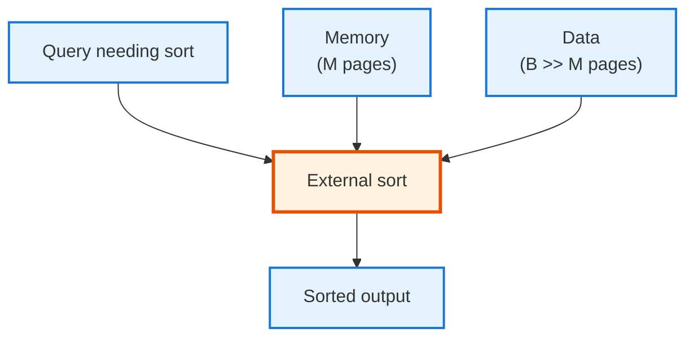
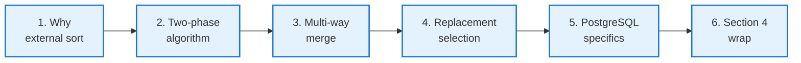
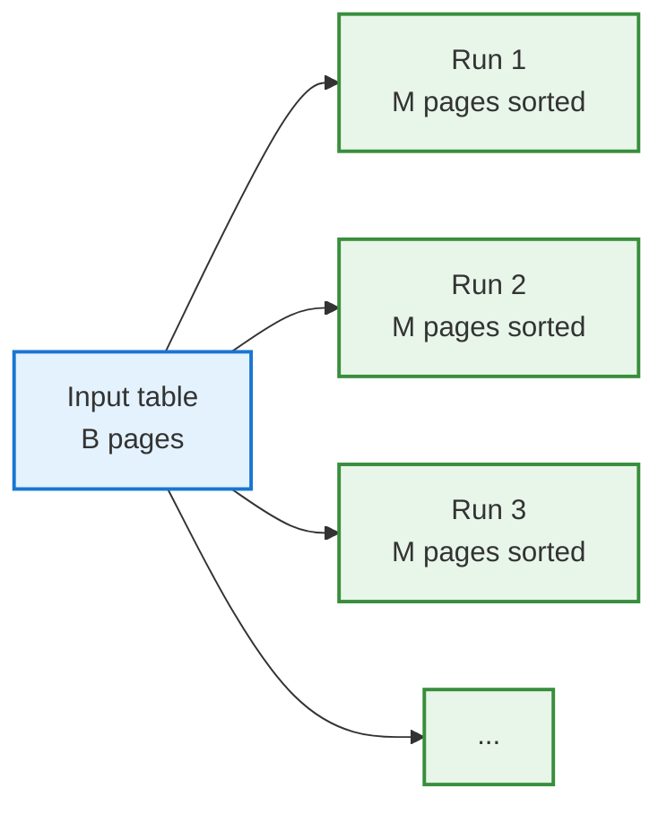
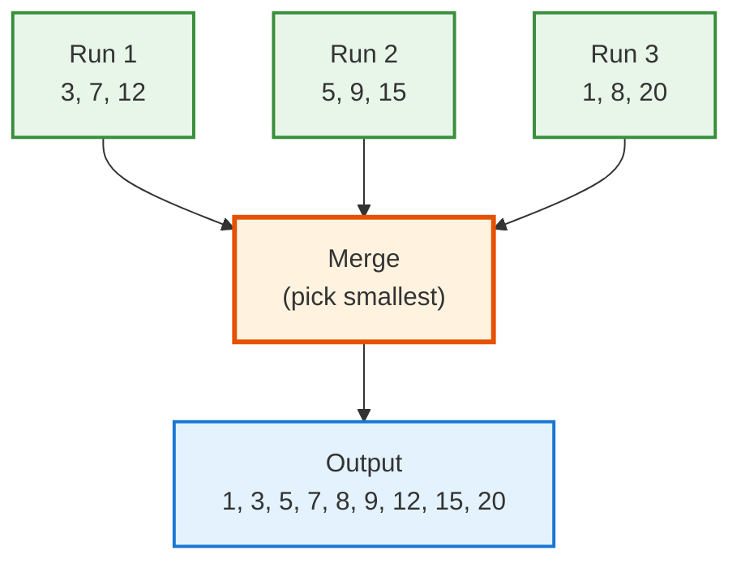
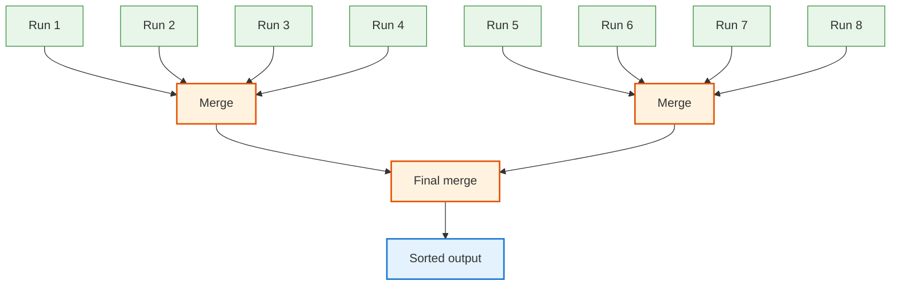
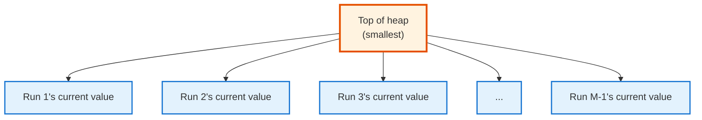
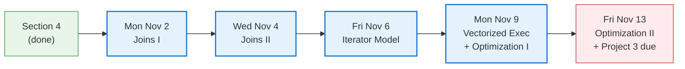

<!-- _class: lead -->

# Day 29: External Sorting

**COP 5725 - Database Management**
Friday, October 30, 2026

How a database sorts more data than it has memory for

<!--
Closes Section 4. Pace 50 min. The two-phase algorithm and the multi-way merge tree are the central concepts; the PostgreSQL work_mem connection at the end is what students need for Project 3.
-->

---

# Where We Are

<div class="columns-left-wide">
<div>

Every `ORDER BY`. Every `GROUP BY`. Every sort-merge join. Every `CREATE INDEX`.

All of them sort.

When the data is bigger than memory, the database does **external sorting** — a 2-phase algorithm that runs on machines built decades ago and still runs every day at every database company.

Today: how it works, and why PostgreSQL's `work_mem` matters for it.

</div>
<div>



</div>
</div>

---

# Today's Roadmap



Reference: GMW Ch. 15.4; PostgreSQL docs [Ch. 19.4.1 Memory](https://www.postgresql.org/docs/current/runtime-config-resource.html#GUC-WORK-MEM).

---

<!-- _class: lead -->

# Part 1: Why External Sort

---

# When You Cannot Just qsort()

`Python's sorted()`, `C's qsort()`, and friends assume all data fits in RAM.

A database sort doesn't have that luxury:

- Tables can be 100s of GB to PBs
- Memory is GBs at most
- A naive in-memory sort would crash or swap to disk uncontrollably

**External sorting** is the deterministic, performant alternative: sort using only `M` pages of memory at a time, with the rest of the data staying on disk.

---

# The Setup

| Variable | Meaning |
|----------|---------|
| `B` | Total pages of data to sort |
| `M` | Pages of memory available |
| `B >> M` | We cannot just load everything |

The classic example: sort a **1 TB** table on **16 GB** of memory.
- B = 1 TB / 8 KB ≈ 130 million pages
- M = 16 GB / 8 KB ≈ 2 million pages

We can hold ~1.5% of the data at once. Every page must touch memory at least twice (once to sort, once to merge). External sort minimizes the total touches.

---

<!-- _class: lead -->

# Part 2: Two-Phase External Sort

---

# Phase 1: Sort Runs

```
Read M pages of data into memory.
Sort them in-memory (quicksort or similar).
Write the sorted chunk to disk as a "run".
Repeat until all input is read.
```



After Phase 1, you have $\lceil B / M \rceil$ sorted runs on disk.

**I/O cost:** read B, write B = 2B.

---

# Phase 2: Multi-Way Merge

```
Open one input stream per run.
Read the first page of each run into memory.
Output the smallest record across all streams.
When a stream's page is consumed, read the next page from that run.
Repeat until all runs are exhausted.
```



**I/O cost:** read B, write B = 2B.

**Total cost:** 4B page reads/writes.

---

# How Many Runs Can We Merge At Once?

We need:
- 1 page of memory per run (the "input buffer")
- 1 page for the output buffer

So with M pages of memory, we can merge **M - 1 runs** simultaneously.

With M = 100 pages and 1000 runs after Phase 1, one merge pass handles 99 runs — we'd need more passes.

But if M is large enough to merge all runs at once, **two passes is enough**.

---

# When Two Passes Suffices

After Phase 1: $\lceil B / M \rceil$ runs.
We can merge $M - 1$ runs in one pass.

Two passes suffices when:
$$\frac{B}{M} \leq M - 1$$
$$B \leq M(M - 1) \approx M^2$$

For M = 1000 pages (8 MB), this covers $10^6$ pages (8 GB).
For M = 100,000 pages (800 MB), this covers $10^{10}$ pages (80 TB).

> Real databases sort terabytes with two passes.

<!--
The "M-squared rule" is the key insight. As long as your memory budget squared is bigger than your data size, two passes is enough. This is why work_mem matters — it's the M in this equation.
-->

---

<!-- _class: lead -->

# Part 3: Multi-Way Merge Tree

---

# Visualizing the Merge

For data that needs multiple merge passes (very rare in modern hardware):



Each level of the merge tree adds a 2B I/O pass.

---

# Heap-Based Priority Queue

Inside one merge step, the algorithm needs the **minimum** across all current pages from each run.

A **min-heap** of size (M-1) does this in O(log M) per output record.



Pop the top. Output it. Read the next value from that run. Insert into heap. Repeat.

---

<!-- _class: lead -->

# Part 4: Replacement Selection

---

# Bigger Runs From the Same Memory

The basic algorithm makes runs of exactly **M** pages.

**Replacement selection** (a.k.a. Knuth's algorithm) can make runs of **~2M** pages on average.

```
Maintain a heap of M pages worth of records.
Repeatedly:
  - Pop the smallest record
  - Output it to the current run
  - Read the next input record
  - If it's ≥ the just-output value: add to current heap (extends this run)
  - Else: add to a side heap (starts the next run)
When the main heap is empty, the run ends. Side heap becomes new main heap.
```

The effect: records that arrived "early in the input but should be late in this run" get carried along until the run finishes.

---

# The Effect of Replacement Selection

<div class="columns">
<div>

### Without

- M-page runs
- $\lceil B / M \rceil$ runs after Phase 1

### With

- ~2M-page runs on average (for random input)
- About half as many runs

</div>
<div>

### Why it matters

Fewer runs means:
- Phase 2 may complete in one pass when it otherwise wouldn't
- The "M² rule" becomes a "2M × M" rule

</div>
</div>

> Most production engines use replacement selection. PostgreSQL's tuplesort.c implements a variant.

---

<!-- _class: lead -->

# Part 5: PostgreSQL Specifics

---

# work_mem

```sql
SHOW work_mem;     -- 4 MB on default install

-- Set per-session
SET work_mem = '256 MB';

-- For one query
SET LOCAL work_mem = '256 MB';
SELECT * FROM huge_table ORDER BY col;
```

`work_mem` is **the memory budget per sort/hash operation**, not per query and not per connection.

A query with three sorts and one hash join could consume **4× work_mem**.
A server with 100 active connections could consume **100× work_mem × operations**.

Reference: [PostgreSQL Ch. 19.4.1 Memory — work_mem](https://www.postgresql.org/docs/current/runtime-config-resource.html#GUC-WORK-MEM).

---

# When PostgreSQL Spills to Disk

```sql
EXPLAIN (ANALYZE, BUFFERS)
SELECT * FROM huge_table ORDER BY col;
```

If the sort fits in `work_mem`:

```
Sort  (cost=...) (actual time=...)
  Sort Method: quicksort  Memory: 25kB
```

If the sort spills:

```
Sort  (cost=...) (actual time=...)
  Sort Method: external merge  Disk: 1234kB
```

`external merge` is exactly the two-phase algorithm above, with run files in `pgsql_tmp/`.

> Spilling is the single biggest reason "fast queries become slow under load."

<!--
The "external merge" line is one of the most actionable hints PostgreSQL gives. Doubling work_mem can turn a 30-second sort into a 1-second one if it lets the sort stay in memory.
-->

---

# Tuning work_mem

<div class="columns">
<div>

### Too low

- Sorts spill to disk constantly
- Hash aggregates degrade
- 100× slowdowns on simple queries

### Too high

- Memory exhaustion under load (n_conn × n_op × work_mem)
- OS starts swapping → catastrophic
- OOM killer takes down the database

</div>
<div>

### Reasonable defaults

- Default 4 MB is too small for any real workload
- Try 32-256 MB on a typical OLTP server
- Per-session bumps for analytical queries

For Project 3: measure both with default and with bumped `work_mem`.

</div>
</div>

---

<!-- _class: lead -->

# Part 6: Section 4 Wrap

---

# What You Can Now Do

<div class="columns-3">
<div>

### Storage
- The hierarchy and order-of-magnitude latency
- Pages, records, slotted layout
- Buffer pools and replacement

</div>
<div>

### Indexes
- B+ trees with insert/delete/cost
- Hash indexes
- PostgreSQL's full zoo: GiST, GIN, BRIN
- Partial, expression, multi-column

</div>
<div>

### Sorting
- Two-phase external sort
- Multi-way merge
- `work_mem` and disk spill

</div>
</div>

This is the **physical-layer toolkit** every database engineer needs.

---

# Section 5 Preview (Next Week)



Query processing — joins, iterators, vectorized execution, and optimization. Then Exam 2 the week after.

---

# Wrap-up

You now have:

<div class="columns">
<div>

- The two-phase external sort
- Multi-way merge with heap-based priority queue
- Replacement selection for longer runs

</div>
<div>

- PostgreSQL's `work_mem` and the "external merge" plan
- The 4B I/O rule for two-pass sort
- A complete physical-layer toolkit

</div>
</div>

Section 4 closes. Section 5 opens Monday.

---

# Practice This Weekend

Three exercises in your project repo:

1. Run `EXPLAIN ANALYZE` on an `ORDER BY` query against a large table in your project. Find one that spills to disk.
2. Bump `work_mem` and rerun. Capture both plans and the elapsed times.
3. Update your README with the two plans and a short paragraph explaining the difference.

Push to your `cop5725fa26-project` repo before 8:30 AM Mon Nov 2.

---

# Questions

What is on your mind?

Project 3 due Fri Nov 13.

<!--
Common Day 29 questions: "Can I bump work_mem permanently?" (Yes, in postgresql.conf or via ALTER SYSTEM. Be careful with concurrent load — total memory = work_mem × active sorts × connections.) "Why does GROUP BY use sorts?" (It can — though hash aggregation is often used instead. We compare in Week 12.) "How do I know if a sort is the bottleneck?" (EXPLAIN ANALYZE shows time per operator. The Sort line's time tells you.)
-->
