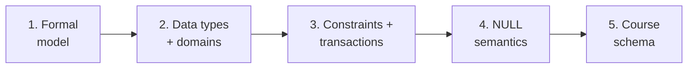
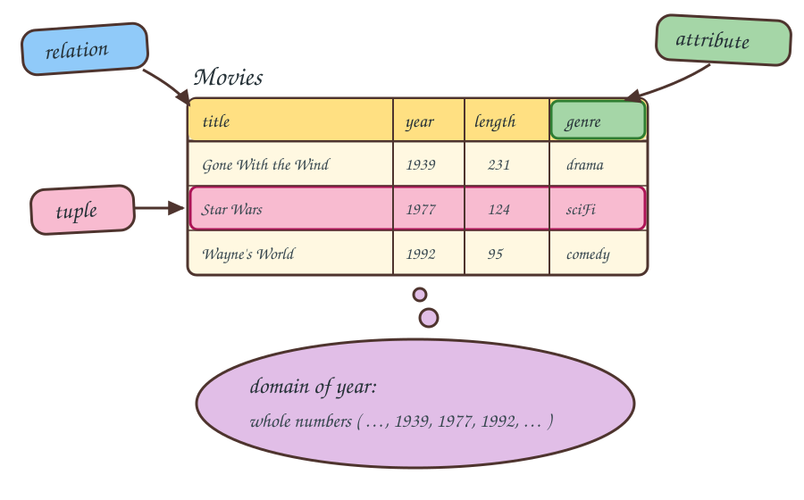
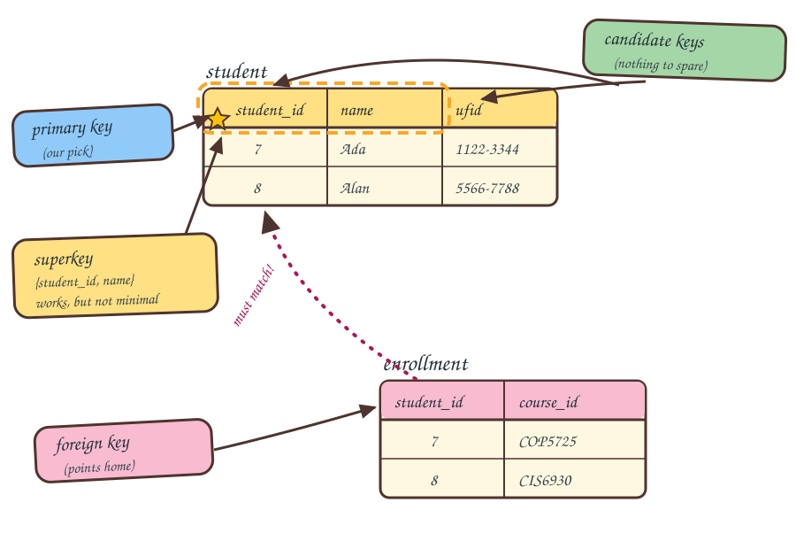
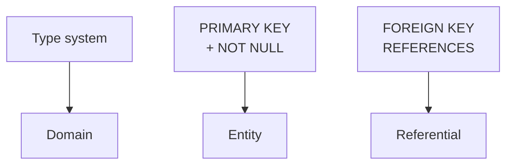
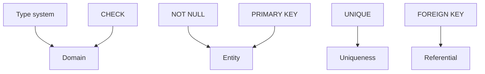
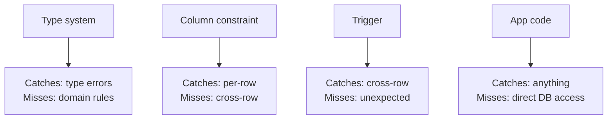
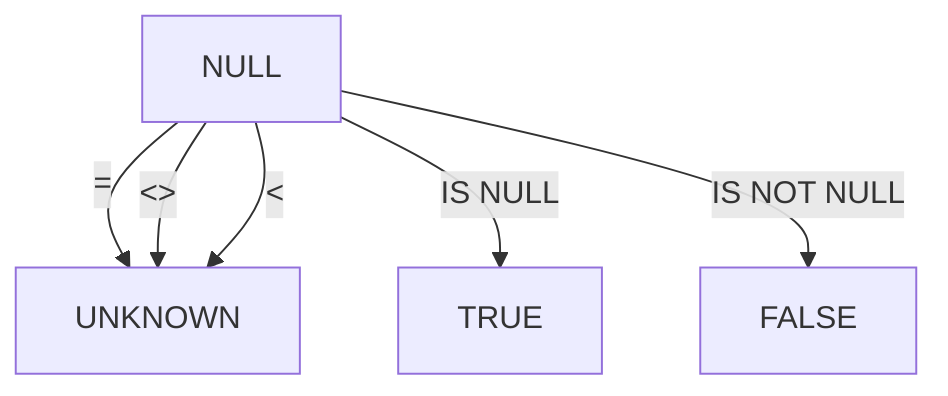
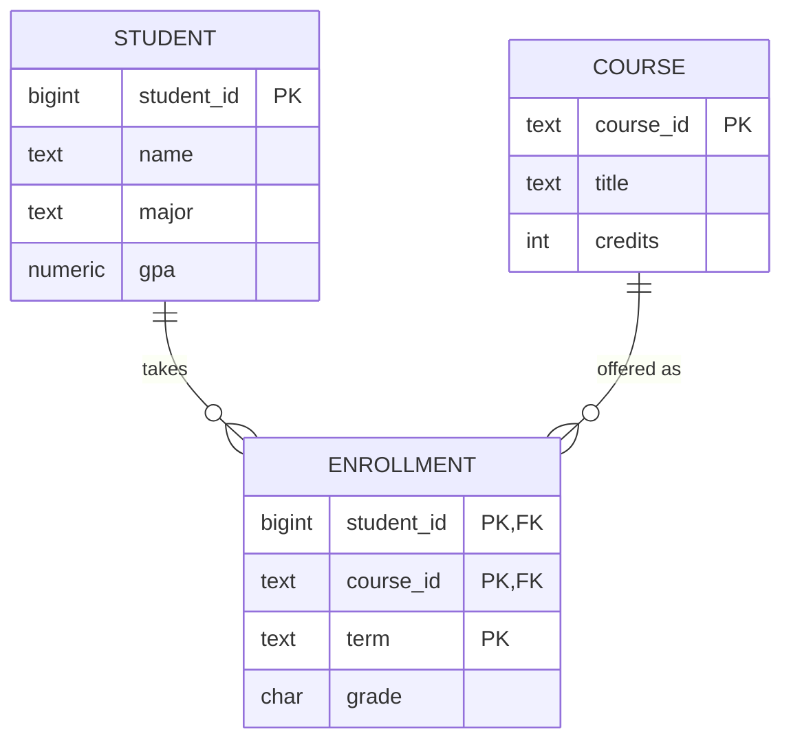
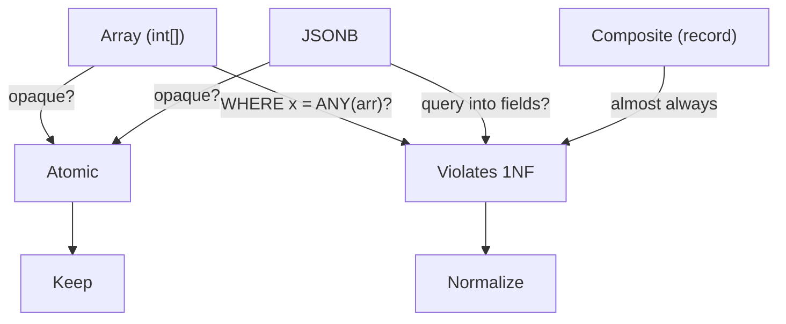

<!-- _class: lead -->

# Day 3: The Relational Model and Data Types

**COP 5725 - Database Management Systems**
Wednesday, August 26, 2026

From Codd's algebra to PostgreSQL's type system

<!--
Second content class. Today we make the relational model *precise* — definitions you can write down — and then survey the type system that fills in Codd's "domain" slot. Pace: 50 min. Spend the most time on Parts 2 (types) and 3 (constraints) since those have practical payoff this semester.
-->

---

# Where We Were Monday

Monday covered the history of database systems and how the relational model came to dominate.

Today we define the relational model and discuss how it is implemented.

<!--
One breath of recap, then move. The history lecture ended with the relational model winning; today is the model itself — definitions first, then the implementation view through PostgreSQL.
-->

---

# Today's Roadmap



1. The formal relational model
2. Data types and domains
3. Integrity constraints, transactions, and ACID
4. NULL semantics
5. A schema we will use the rest of the semester

---

<!-- _class: lead -->

# Part 1: The Formal Relational Model

---

# Math, Codd, SQL

<div class="columns">
<div>

| Math | Codd | SQL |
|------|------|-----|
| Set element | Tuple | Row |
| Function | Attribute | Column |
| Domain | Domain | Data type |
| Set of tuples | Relation | Table |

</div>
<div>



</div>
</div>

<!--
Students struggle when papers slip between vocabularies without warning. The Codd column is what the textbook uses. The SQL column is what you'll see in psql output. The annotated Movies relation is Figure 2.3 from the textbook (Ch. 2, p. 22) — point at each callout while reading the table rows: the whole table is the relation, a column is an attribute, a row is a tuple, and the set of legal values for a column is its domain.
-->

---

# A Relation, Formally

A **relation schema** is a set of attributes: $R(A_1, A_2, ..., A_n)$.

Each attribute $A_i$ has a **domain** $dom(A_i)$, the set of legal values.

A **tuple** over $R$ is a function $t : \{A_1, ..., A_n\} \rightarrow \bigcup dom(A_i)$ with $t(A_i) \in dom(A_i)$.

A **relation instance** is a finite set of such tuples (Textbook §2.2.1–2.2.6, p. 22–24).

Properties:

- Tuple order does not matter (relation is a set)
- Attribute order does not matter (we name by attribute, not position)
- Duplicates are not allowed (set semantics)

<!--
The "tuple is a function" formalism trips up some students. Walk through one tuple's mapping: `t(name) = 'Ada'`, `t(gpa) = 3.8`. The function notation is what makes the algebra clean later.
-->

---

# What SQL Does to These Properties

<div class="columns">
<div>

### Algebra (Codd)

- Set: no duplicates
- Unordered tuples
- Unordered attributes

</div>
<div>

### SQL

- Multiset (bag): duplicates allowed unless you say `DISTINCT`
- `ORDER BY` lets you assert an order on output
- `SELECT *` returns columns in declaration order

</div>
</div>

> Bag semantics has real implications for query optimization. We will see them in Section 5.

<!--
The bag-vs-set distinction matters all semester. Bag semantics is faster (no dedup cost) but algebra reasoning assumes sets. Optimizers do the bookkeeping for you, but you need to know which mode you are in.
-->

---

# Telling Tuples Apart

A relation is a set, so every tuple must differ from every other. Which attributes do the telling?

<div class="columns">
<div>

<table>
<thead><tr><th>title</th><th>year</th><th>length</th><th>genre</th></tr></thead>
<tbody>
<tr><td style="background:#FFE082">King Kong</td><td style="background:#A5D6A7">1933</td><td>100</td><td>horror</td></tr>
<tr><td style="background:#FFE082">King Kong</td><td style="background:#A5D6A7">2005</td><td>187</td><td>action</td></tr>
<tr><td>Star Wars</td><td>1977</td><td>121</td><td>sciFi</td></tr>
</tbody>
</table>

<div class="small">

Amber marks the colliding `title` values; green marks the `year` values that tell the two King Kong tuples apart.

</div>

</div>
<div>

Two movies share a title, so `title` alone cannot identify a tuple.

No two movies share a title and a year. The pair `{title, year}` pins down exactly one tuple.

A set of attributes with that property is a key of the relation.

</div>
</div>

The textbook declares `{title, year}` as the key of `Movies` in §2.3.6, Example 2.7 (p. 36).

<!--
This is the concrete case before the formal ladder on the next slide. Ask the room: is {title} a key? No — King Kong appears twice. Is {title, year, genre} a key? It identifies tuples, but it carries a passenger attribute; minimality is the next slide's distinction between superkey and candidate key. The two-attribute key for Movies is Example 2.7 in the textbook (§2.3.6, p. 36), so students will meet it again in the reading. Never call the book "GMW" in course materials; say "the textbook."
-->

---

# Keys

<div class="columns">
<div>

**Superkey:** a set of attributes whose values uniquely identify each tuple.

**Candidate key:** a minimal superkey.

**Primary key:** the candidate key the designer picks as canonical.

**Foreign key:** attributes in $R$ whose values must appear as a primary key in some referenced relation $S$.

<div class="small">

Textbook: keys and underlining §2.2.7, p. 25; superkeys §3.1.3, p. 71; foreign keys §7.1, p. 311.

</div>

</div>
<div>



</div>
</div>

Keys turn a relation from "data" into "data with structure." They are how foreign keys, joins, and indexes connect tables.

<!--
Walk the cartoon left to right. The star on student_id is the primary key. Both {student_id} and {ufid} identify students with nothing to spare, so both are candidate keys; we picked student_id. The dashed loop around {student_id, name} is a superkey — it identifies every row but drags name along for no reason. The enrollment table below holds the foreign key: its student_id values must appear as a primary key value in student.
-->

---

# Integrity Rules

<div class="columns">
<div>

| Rule | What it says |
|------|--------------|
| Domain integrity | Every value lives in its declared domain |
| Entity integrity | Primary key attributes are non-null |
| Referential integrity | Every foreign key value references an existing primary key |

</div>
<div>



</div>
</div>

When an engine skips these checks, orphaned rows, out-of-range values, and dangling references accumulate silently. Every application that later reads the data inherits the cleanup.

Enforcement costs write throughput, which is why engines have been tempted to skip it. (Aside: PostgreSQL has historically implemented these rules more completely than MySQL.)

<!--
Land the general point first: integrity rules fail quietly, and the damage surfaces far from the write that caused it — a report that double-counts, a join that drops rows, a migration that cannot find a parent record. The MySQL aside is color, not the argument: the early-2010s "MySQL is faster than Postgres" benchmarks partly reflected skipped integrity checking, so Postgres looked slower while doing more work.
-->

---

<!-- _class: lead -->

# Part 2: Data Types and Domains

---

# The Atomic-Value Debate

Codd's *First Normal Form* says every attribute value is **atomic**, indivisible from the database's perspective (Textbook §2.2.4, p. 23). We return to normal forms later in the semester.

That definition is older than every type system on the next slide.

What counts as atomic depends on what operations the database can perform on the value. An integer is atomic because the database cannot operate on its bits; a string is atomic because the database does not parse its sub-string structure for join purposes, though it can compare and slice it.

> A type is atomic if the system treats the value as a single domain element and provides operators tailored to that domain.

<!--
This is a contested view. Some database theorists insist arrays and JSON violate 1NF. The pragmatic view, which I take and which mirrors Andy Pavlo's at CMU, is that 1NF is about whether the database's operators understand the type — not about whether the bytes are bit-decomposable.
-->

---

# PostgreSQL Type Families

PostgreSQL ships with roughly 40 built-in types.

<div class="columns small">
<div>

| Family | Types | Example value |
|--------|-------|---------------|
| Numeric | `int`, `bigint`, `numeric` | `3.14159` |
| Character | `char`, `varchar`, `text` | `'Ada Lovelace'` |
| Date/time | `date`, `timestamptz`, `interval` | `'2026-08-26 09:35-04'` |
| Boolean | `boolean` | `true` |
| Identifier | `uuid` | `'a0eebc99-…-4ef8'` |
| Binary | `bytea` | `'\xDEADBEEF'` |

</div>
<div>

| Family | Types | Example value |
|--------|-------|---------------|
| Semi-structured | `jsonb` | `'{"day": 3}'` |
| Collection | `int[]` | `'{88, 92}'` |
| Range | `int4range` | `'[1, 10)'` |
| Geometric | `point` | `'(29.6, -82.3)'` |
| Network | `inet` | `'10.0.0.0/8'` |
| Enum | `CREATE TYPE` | `'shipped'` |

</div>
</div>

<!--
The slide is dense on purpose. Don't read every row. Point out 3-4 entries the room will not have used: `tstzrange` (range types), `inet` (network), `uuid` (identifier). These types are what makes Postgres a serious working tool. Easter eggs in the example column: the `point` is Gainesville's latitude/longitude, and the timestamptz is this class meeting.
-->

---

# DDL and DML

SQL splits into two sublanguages, and the split mirrors Part 1's schema/instance distinction.

<div class="columns">
<div>

### Data Definition Language

DDL declares and changes schemas.

- `CREATE TABLE`
- `ALTER TABLE`
- `DROP TABLE`

The textbook introduces DDL in §2.3 (p. 29).

</div>
<div>

### Data Manipulation Language

DML reads and changes the rows of an instance.

- `SELECT`
- `INSERT`, `UPDATE`, `DELETE`

The instance changes constantly; the schema rarely.

</div>
</div>

<!--
Definitions before syntax. DDL acts on the schema (the attribute list and types you declare once); DML acts on the instance (the tuples that come and go). A good check for the room: which sublanguage is ALTER TABLE? DDL, because it rewrites the schema, even though it may touch every stored row to do it.
-->

---

# DDL and DML Examples

```sql
-- DDL: declare the schema
CREATE TABLE pet (
  pet_id   INTEGER PRIMARY KEY,   -- name, type, constraints
  name     TEXT    NOT NULL,
  species  TEXT    NOT NULL
);

-- DML: fill and read the instance
INSERT INTO pet VALUES (1, 'Albert', 'alligator');
SELECT name FROM pet WHERE species = 'alligator';
```

`CREATE TABLE` lists each column as name, type, then constraints. `INSERT` adds tuples in declaration order. `SELECT` reads them back.

This core syntax is shared by PostgreSQL, SQLite, and DuckDB. The next two slides run it live in the in-browser SQL engine, the same one built into the HTML decks for the SQL lectures ahead.

<!--
Keep this slide at the anatomy level; the next two slides run the real thing. Point students at the in-browser runner in the posted HTML decks as this week's practice — no install, edit and re-run right in the slides — with PostgreSQL taking over once Project 0 setup lands.
-->

---

# Try It: Create and Insert

Every statement below runs unchanged in SQLite, PostgreSQL, and this slide.

```sql run
DROP TABLE IF EXISTS pet;
CREATE TABLE pet (
  pet_id   INTEGER PRIMARY KEY,
  name     TEXT NOT NULL,
  species  TEXT NOT NULL,
  age      INTEGER CHECK (age >= 0)
);
INSERT INTO pet VALUES
  (1, 'Albert',  'alligator', 12),
  (2, 'Alberta', 'alligator',  9),
  (3, 'Scout',   'dog',        4);
SELECT * FROM pet;
```

Edit and re-run. Try inserting a pet with a negative age and watch the `CHECK` constraint reject it.

<!--
Live slide (HTML deck only; the PDF shows static code). The in-browser engine is DuckDB-WASM, but every statement shown is the shared core that runs verbatim in sqlite3 and psql — say that out loud so nobody thinks they are learning a toy dialect. The DROP TABLE IF EXISTS makes the block safe to re-run. Demo the CHECK rejection: change an age to -3 and run.
-->

---

# Try It: Query the Instance

The `pet` table from the last slide is already loaded. This is pure DML; the schema does not change.

```sql run
DROP TABLE IF EXISTS pet;
CREATE TABLE pet (
  pet_id   INTEGER PRIMARY KEY,
  name     TEXT NOT NULL,
  species  TEXT NOT NULL,
  age      INTEGER CHECK (age >= 0)
);
INSERT INTO pet VALUES
  (1, 'Albert',  'alligator', 12),
  (2, 'Alberta', 'alligator',  9),
  (3, 'Scout',   'dog',        4);
-- @query
SELECT species, count(*) AS n, avg(age) AS avg_age
FROM pet
GROUP BY species;
```

Edit the query: filter with `WHERE age > 5`, or sort with `ORDER BY avg_age DESC`.

<!--
The setup (CREATE and INSERT) is hidden behind the @query marker, so students see only the SELECT — the point is that DML operates against whatever instance exists. Aggregation is a preview; it gets its own lecture in Section 2. If someone asks about UPDATE and DELETE, write one on the board against this table rather than detouring the deck.
-->

---

# Numeric, More Carefully

```sql
CREATE TABLE invoices (
  invoice_id     bigint    PRIMARY KEY,
  amount_cents   bigint    NOT NULL,         -- exact, never use float for money
  tax_rate       numeric(5, 4) NOT NULL,     -- 4 decimal places
  duration_days  int       CHECK (duration_days >= 0)
);
```

<div class="columns-3">
<div>

### Money
Use `numeric(p, s)` or store in cents as `bigint`.
Never `float` or `double`.

</div>
<div>

### Surrogate keys
Reach for `bigint` over `int` in any system that may outlive prototype.

<div class="small">

A surrogate key is a system-assigned identifier, like `invoice_id`, with no meaning in the domain.

</div>

</div>
<div>

### Bounded values
Tag a `CHECK` on any value whose domain is stricter than its type.

</div>
</div>

<!--
The "never float for money" rule is non-negotiable. Showing the classic floating-point error `0.1 + 0.2 = 0.30000000000000004` is worth the 30 seconds of demo time.
-->

---

# Date/Time

```sql
CREATE TABLE events (
  event_id    bigint        PRIMARY KEY,
  occurred_at timestamptz   NOT NULL,       -- almost always what you want
  duration    interval      NOT NULL DEFAULT '0',
  on_date     date          GENERATED ALWAYS AS (occurred_at::date) STORED
);
```

<div class="columns">
<div>

### `timestamptz`
Stores UTC, converts on read. Default to this.

`'2026-08-26 09:35-04'` is stored as `2026-08-26 13:35 UTC`. A reader in London sees `14:35+01`.

</div>
<div>

### `timestamp`
Without time zone. For civil-calendar concepts (a meeting always at 9 AM wherever the user is).

`'2026-08-26 09:35'` stays those exact digits for every reader, in every time zone.

</div>
</div>

An `interval` can be added to or subtracted from a timestamp.

<!--
The `timestamptz` vs `timestamp` distinction is the source of more bugs than any other Postgres type choice. The rule: use `timestamptz` unless you're absolutely sure you mean wall-clock-without-timezone (rare). Walk the paired example: the same class meeting entered as timestamptz comes back adjusted for the reader's session time zone, while the timestamp version never changes its digits — which is exactly what you want for "the standing 9:35 lecture" and exactly wrong for "when the payment cleared."
-->

---

# JSONB in Practice

<div class="columns-left-wide">
<div>

```sql
CREATE TABLE webhooks (
  webhook_id  bigint      PRIMARY KEY,
  received_at timestamptz NOT NULL,
  payload     jsonb       NOT NULL
);

-- Pull a field
SELECT payload ->> 'event_type', count(*)
FROM webhooks
WHERE received_at > now() - interval '7 days'
GROUP BY 1;

-- Index a field used often
CREATE INDEX webhooks_event_idx
  ON webhooks ((payload ->> 'event_type'));
```

</div>
<div>

One `payload` value:

```json
{
  "event_type": "signup",
  "user": {
    "id": 4021,
    "plan": "free"
  },
  "source": "mobile"
}
```

</div>
</div>

> Used well, JSONB absorbs schema churn. Used poorly, it becomes a write-only column.

<!--
Point at the payload document while reading the SELECT: `payload ->> 'event_type'` reaches into that JSON and pulls out 'signup' as text. The expression index on the same expression is the trick that makes the JSONB pattern survive — without it, every query scans the table. Mention this once now; we will return to expression indexes in Section 4.
-->

---

<!-- _class: lead -->

# Part 3: Constraints in SQL

---

# The SQL-Based Constraints

<div class="columns">
<div>

| Constraint | What it asserts |
|-----------|-----------------|
| `NOT NULL` | Always has a value |
| `UNIQUE` | No two rows share this value |
| `PRIMARY KEY` | NOT NULL + UNIQUE, canonical |
| `FOREIGN KEY` | References a key elsewhere |
| `CHECK` | Predicate is true for every row |

</div>
<div>



</div>
</div>

<!--
Layered together, these five encode the three integrity rules and most of your domain logic. Map them to the earlier slide: the type system plus CHECK gives domain integrity, PRIMARY KEY with its implied NOT NULL gives entity integrity, and FOREIGN KEY gives referential integrity.
-->

---

# CHECK and Custom Domains

```sql
CREATE DOMAIN us_state AS char(2)
  CHECK (VALUE ~ '^[A-Z]{2}$');

CREATE DOMAIN email AS text
  CHECK (VALUE ~* '^[^@\s]+@[^@\s]+\.[^@\s]+$');

CREATE TABLE customers (
  customer_id bigint PRIMARY KEY,
  state       us_state,
  contact     email NOT NULL,
  age         int CHECK (age BETWEEN 0 AND 150)
);
```

`CREATE DOMAIN` is the closest SQL gets to Codd's mathematical $dom(A_i)$.

<!--
Domains are underused in practice. They make column constraints reusable across tables. The regex for email is incomplete — but as I point out in slides on validation, perfect email regex is famously impossible. The constraint catches gross errors, not all errors.
-->

---

# Tradeoffs of Constraints



Enforce each rule at the lowest layer that can express it: the type system first, then column constraints, then triggers, with application code as the last resort. The lower layers run on every write, no matter which application did the writing.

The caution runs the other way for rules that change often. A complex `CHECK` or trigger has to be dropped and recreated during schema migrations, so keep fast-moving business rules in higher layers.

<!--
"Lowest layer" means closest to the storage: the database itself rather than the code calling it. A NOT NULL in the schema protects the table from every client — the web app, a batch script, a psql session — while a check in application code protects it only from that one application. The counterweight: every constraint in the schema is something a migration must work around, so rules that change monthly belong in code, and rules that define the data belong in the schema. PostgreSQL's CHECK and EXCLUDE cover most per-row and overlap rules before you ever need a trigger.
-->

---

# Transactions

A transaction is a group of database operations executed as one unit, atomically and in apparent isolation from every other transaction (Textbook §1.2.4, p. 8).

```sql
BEGIN;
UPDATE accounts SET balance = balance - 100 WHERE account_id = 1;
UPDATE accounts SET balance = balance + 100 WHERE account_id = 2;
COMMIT;
```

Either both updates happen or neither does. A crash between the two statements cannot make $100 vanish.

Constraints restrict what a database state may look like.

<!--
First mention of transactions in the course. Keep it at the definition level — Day 35 covers how engines actually deliver these guarantees (logging, locking, MVCC). The bank-transfer example is the canonical one; the point to land is that neither UPDATE alone leaves a legal state, so the unit of correctness is the pair.
-->

---

# The ACID Test

A transaction makes four guarantees, remembered by the acronym ACID (Textbook §1.2.4, p. 9).

| Letter | Property | Guarantee |
|--------|----------|-----------|
| A | Atomicity | All-or-nothing execution |
| C | Consistency | Constraints hold after every transaction |
| I | Isolation | Appears to run as if alone |
| D | Durability | Completed work is never lost |

The consistency guarantee builds on today's constraints. A transaction may assume they hold when it starts and must leave them holding when it commits.

<!--
Unpack each letter with the transfer example. Atomicity: both UPDATEs or neither. Consistency: a CHECK (balance >= 0) may not be violated at COMMIT. Isolation: a concurrent reader never sees the money missing from both accounts. Durability: once COMMIT returns, a crash cannot roll the transfer back. Section 6 (Day 35 onward) is entirely about the machinery behind these four words.
-->

---

<!-- _class: lead -->

# Part 4: NULL Semantics

---

# NULL is Not a Value

NULL is the marker for *no value*.

The SQL standard says NULL participates in three-valued logic: TRUE, FALSE, UNKNOWN.

<div class="columns">
<div>

| Expression | Result |
|-----------|--------|
| `NULL = NULL` | UNKNOWN |
| `NULL = 5` | UNKNOWN |
| `NULL <> 5` | UNKNOWN |
| `NULL IS NULL` | TRUE |

</div>
<div>



</div>
</div>

This is the source of a remarkable amount of accidental data deletion.

In 2019 a security researcher registered the vanity plate NULL, and California's citation systems matched tickets with missing plate data to his car. He received $12,049 of other drivers' fines. Wired: [How a 'NULL' License Plate Landed One Hacker in Ticket Hell](https://www.wired.com/story/null-license-plate-landed-one-hacker-ticket-hell/).

<!--
The Wired story lands well: Joseph Tartaro (DEF CON 2019) chose the plate as a joke, and record systems that stored "no plate on file" as the string NULL routed every plateless citation to him. The deeper lesson is the slide's table — NULL is a marker, not a value, and any system that lets the two blur will misroute data. Ask: which cell in the table does the DMV bug correspond to? (NULL = 'NULL' evaluating as a match.)
-->

---

# A Concrete NULL Bite

```sql
SELECT count(*) FROM employees;                       -- 1000
SELECT count(*) FROM employees WHERE manager_id = 7;  -- 42
SELECT count(*) FROM employees WHERE manager_id <> 7; -- 800 ?!

-- The remaining 158 rows have NULL manager_id
-- Neither = 7 nor <> 7 matched them
```

The fix: be explicit.

```sql
SELECT count(*) FROM employees
WHERE manager_id <> 7 OR manager_id IS NULL;
```

<!--
Run this against the live demo database if time permits. Watching 158 rows go missing makes the point in a way the slide cannot.
-->

---

# When to Forbid NULL

Default to `NOT NULL` for any column where:

<div class="columns-3">
<div>

### Business rule
"Must have a value" is a rule the database itself should enforce.

</div>
<div>

### Join target
Foreign keys want certainty. NULL in a FK is almost always a bug.

</div>
<div>

### Aggregates
You will compute counts/sums and want predictable results.

</div>
</div>

Allow NULL only when *no value yet* or *not applicable* is a real domain state.

---

<!-- _class: lead -->

# Part 5: A Schema

---

# The University Schema

```sql
CREATE TABLE student (
  student_id   bigint        PRIMARY KEY,
  name         text          NOT NULL,
  major        text,
  gpa          numeric(3, 2) CHECK (gpa >= 0 AND gpa <= 4.0)
);

CREATE TABLE course (
  course_id    text          PRIMARY KEY,    -- e.g. 'COP5725'
  title        text          NOT NULL,
  credits      int           NOT NULL CHECK (credits BETWEEN 1 AND 6)
);

CREATE TABLE enrollment (
  student_id   bigint        REFERENCES student(student_id),
  course_id    text          REFERENCES course(course_id),
  term         text          NOT NULL,
  grade        char(2),                      -- NULL = in progress
  PRIMARY KEY (student_id, course_id, term)
);
```

<!--
This is the schema in the Project 0 starter and in most quiz/exam questions through Quiz 2. Encourage students to type it locally tonight — sqlite3 works fine for tonight's practice, PostgreSQL once Project 0 setup is done.
-->

---

# Schema as a Relation



<div class="small">

Composite primary key on `enrollment` says "a student takes a course in a term at most once."
`grade char(2)` allows NULL for in-progress courses, the kind of NULL that *means* something.

</div>

<!--
The ER diagram here is intentionally chen-ish. Wednesday's lecture (Day 6) will be all about ER notation; planting one now lets students see the connection. Notice the diamond would be cleaner in chen, but mermaid's erDiagram is good enough.
-->

---

# Wrap-up

- A relation is a set of tuples over named attributes, each drawn from a domain.
- A key is a set of attributes no two tuples share; `{title, year}` for `Movies`.
- PostgreSQL fills Codd's domain slot with 40+ types. Pick `numeric` for money and `timestamptz` for time.
- Five constraint kinds (`NOT NULL`, `UNIQUE`, `PRIMARY KEY`, `FOREIGN KEY`, `CHECK`) enforce the three integrity rules.
- Transactions run groups of statements all-or-nothing, and ACID names their four guarantees.
- NULL is not a value. Comparing against it yields UNKNOWN, so write `IS NULL` when you mean it.
- The university schema comes back in every SQL lecture. Type it in tonight.

<!--
One sentence per part of the lecture. If time is short, the two lines to say out loud are the key definition and the NULL warning — those are the ones that show up on Quiz 1.
-->

---

# Friday: Relational Algebra I

Friday covers the operators that compute over relations: selection, projection, and the set operations.

Read Textbook §2.4 (p. 38) before class.

<!--
Keep this to the topic and the reading. The English-to-algebra-to-SQL translation exercise lives in Friday's deck itself.
-->

---

# Questions

What is on your mind?

Project 1 releases Wednesday, Sep 2. Project 0 setup remains due Fri Sep 4.

---

<!-- _class: lead -->

# Backup Slides

---

# Where Types Stress the Relational Model



The relational model survives these features when the database treats the type as a domain element with its own operators.

<!--
Backup slide — pull it up if a student asks whether arrays or JSONB break the relational model. The decision diagram captures the practical rule: if your queries reach into the structured type, it's no longer atomic — split it out. If they treat it as a blob, fine.

We will return to this on Day 9 — the textbook treats arrays, JSON, and composite types as **explicit 1NF violations**, regardless of how PostgreSQL chooses to support them.
-->
