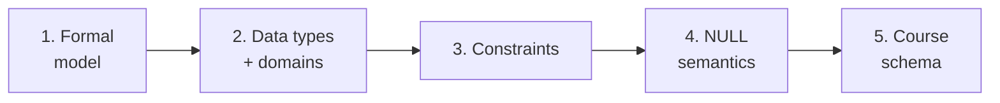
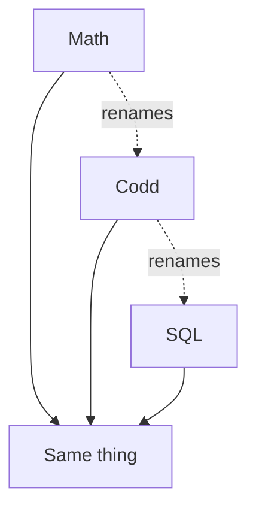
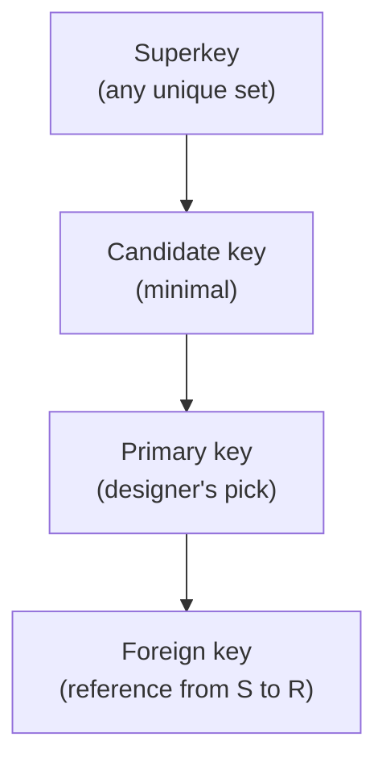
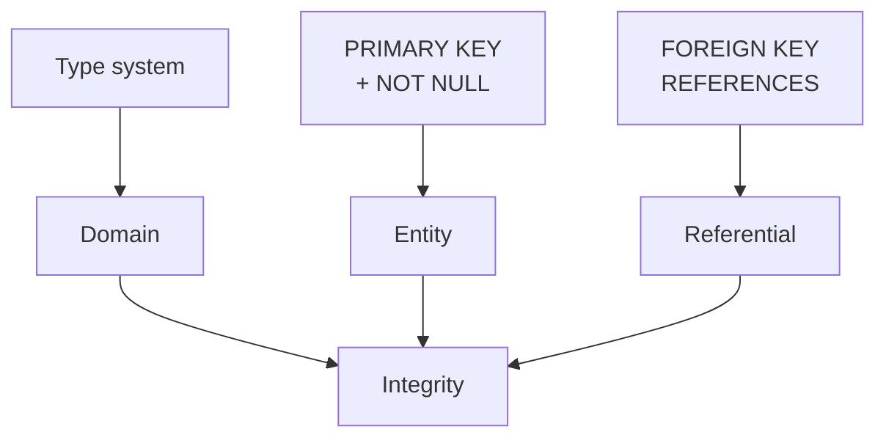
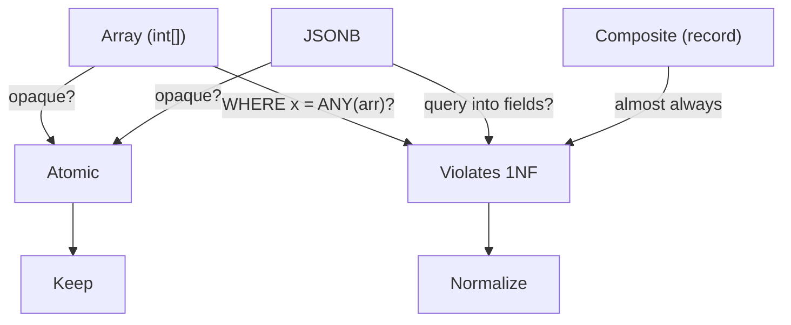
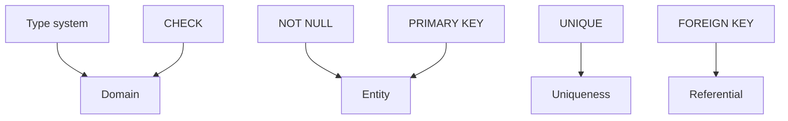
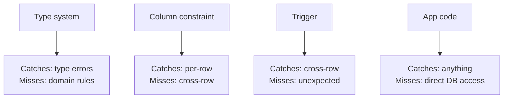
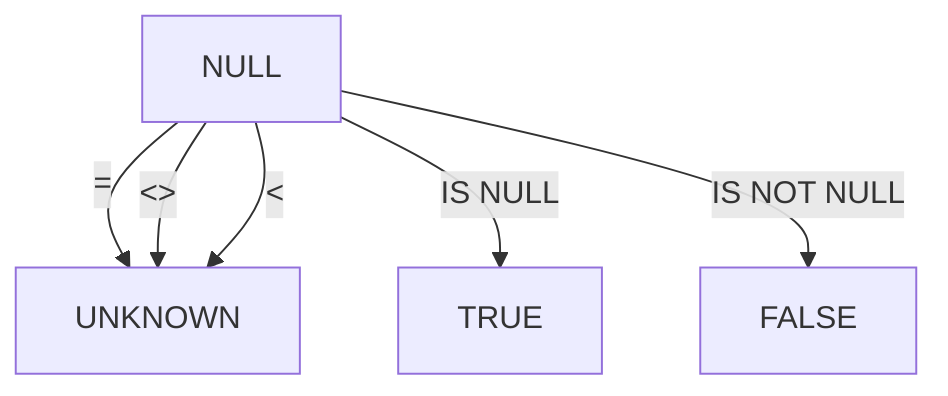
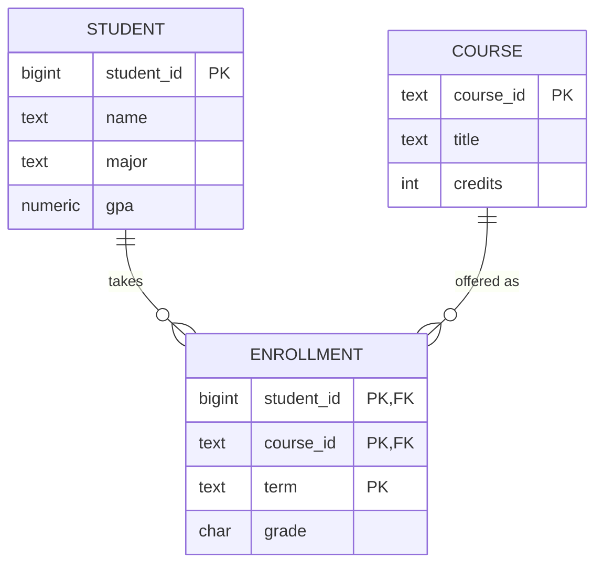

<!-- _class: lead -->

# Day 3: The Relational Model and Data Types

**COP 5725 - Database Management**
Wednesday, August 26, 2026

From Codd's algebra to PostgreSQL's type system

<!--
Second content class. Today we make the relational model *precise* — definitions you can write down — and then survey the type system that fills in Codd's "domain" slot. Pace: 50 min. Spend the most time on Parts 2 (types) and 3 (constraints) since those have practical payoff this semester.
-->

---

# Where We Were Monday

We watched the relational model win an argument it started in 1970.

Today we sharpen the model into definitions you can write down, then walk through the PostgreSQL type system to see how a real engine fills in Codd's `domain` slot.

By Friday you will be reading and writing relational algebra expressions.

---

# Today's Roadmap



1. The formal relational model
2. Data types and the domain question
3. Integrity constraints in SQL
4. NULL semantics
5. A schema we will use the rest of the semester

---

<!-- _class: lead -->

# Part 1: The Formal Relational Model

---

# Three Levels of Vocabulary

The same idea has three sets of names depending on who you ask.

<div class="columns">
<div>

| Math | Codd | SQL / Postgres |
|------|------|----------------|
| Set element | Tuple | Row |
| Function | Attribute | Column |
| Domain | Domain | Data type |
| Set of tuples | Relation | Table |

We move between vocabularies. The math is cleanest; SQL is what you type.

</div>
<div>



</div>
</div>

<!--
Students struggle when papers slip between vocabularies without warning. The Codd column is what the GMW textbook uses. The SQL column is what you'll see in psql output.
-->

---

# A Relation, Formally

A **relation schema** is a set of attributes: $R(A_1, A_2, ..., A_n)$.

Each attribute $A_i$ has a **domain** $dom(A_i)$ — the set of legal values.

A **tuple** over $R$ is a function $t : \{A_1, ..., A_n\} \rightarrow \bigcup dom(A_i)$ with $t(A_i) \in dom(A_i)$.

A **relation instance** is a finite set of such tuples.

Three properties fall out:

- Tuple order does not matter (relation is a set)
- Attribute order does not matter (we name by attribute, not position)
- Duplicates are not allowed (set semantics)

<!--
The "tuple is a function" formalism trips up some students. Walk through one tuple's mapping: `t(name) = 'Ada'`, `t(gpa) = 3.8`. The function notation is what makes the algebra clean later.
-->

---

# What SQL Does to These Properties

SQL relaxes all three.

<div class="columns">
<div>

### Algebra (Codd)

- Set: no duplicates
- Unordered tuples
- Unordered attributes

</div>
<div>

### SQL

- Multiset (bag): duplicates allowed unless you say `DISTINCT`
- `ORDER BY` lets you assert an order on output
- `SELECT *` returns columns in declaration order

</div>
</div>

> Bag semantics has real implications for query optimization. We will see them in Section 5.

<!--
The bag-vs-set distinction matters all semester. Bag semantics is faster (no dedup cost) but algebra reasoning assumes sets. Optimizers do the bookkeeping for you, but you need to know which mode you are in.
-->

---

# Keys

<div class="columns">
<div>

**Superkey:** a set of attributes whose values uniquely identify each tuple.

**Candidate key:** a minimal superkey.

**Primary key:** the candidate key the designer picks as canonical.

**Foreign key:** attributes in $R$ whose values must appear as a primary key in some referenced relation $S$.

</div>
<div>



</div>
</div>

Keys turn a relation from "data" into "data with structure." They are how foreign keys, joins, and indexes connect tables.

---

# The Three Integrity Rules

<div class="columns">
<div>

| Rule | What it says |
|------|--------------|
| Domain integrity | Every value lives in its declared domain |
| Entity integrity | Primary key attributes are non-null |
| Referential integrity | Every foreign key value references an existing primary key |

</div>
<div>



</div>
</div>

PostgreSQL enforces all three by default. MySQL (with older defaults) historically did not — and the practical cost showed up as inconsistent data.

<!--
The MySQL note is worth landing. The early-2010s "MySQL is faster than Postgres" narrative was partly because MySQL was skipping integrity checks. Postgres looked slower but was doing more.
-->

---

<!-- _class: lead -->

# Part 2: Data Types and the Domain Question

---

# The Atomic-Value Debate

Codd's First Normal Form says every attribute value is **atomic** — indivisible from the database's perspective.

That definition is older than every type system on the next slide.

What counts as atomic depends on what operations the database can perform on the value. An integer is atomic because the database cannot operate on its bits; a string is atomic because the database does not parse its sub-string structure for join purposes — though it can compare and slice it.

> A type is atomic if the system treats the value as a single domain element and provides operators tailored to that domain.

<!--
This is a contested view. Some database theorists insist arrays and JSON violate 1NF. The pragmatic view, which I take and which mirrors Andy Pavlo's at CMU, is that 1NF is about whether the database's operators understand the type — not about whether the bytes are bit-decomposable.
-->

---

# PostgreSQL Type Families

PostgreSQL ships with roughly 40 built-in types.

<div class="columns">
<div>

| Family | Examples |
|--------|----------|
| Numeric | `int`, `bigint`, `numeric`, `double precision` |
| Character | `char`, `varchar`, `text` |
| Date/time | `date`, `time`, `timestamp`, `timestamptz`, `interval` |
| Boolean | `boolean` |
| Identifier | `uuid` |
| Binary | `bytea` |

</div>
<div>

| Family | Examples |
|--------|----------|
| Semi-structured | `json`, `jsonb` |
| Collection | arrays (`int[]`), composite types |
| Range | `int4range`, `tstzrange` |
| Geometric | `point`, `polygon` |
| Network | `inet`, `cidr` |
| Enum / user-defined | `CREATE TYPE`, `CREATE DOMAIN` |

</div>
</div>

This is the menu Codd's "domain" expanded into over fifty years.

<!--
The slide is dense on purpose. Don't read every row. Point out 3-4 entries the room will not have used: `tstzrange` (range types), `inet` (network), `uuid` (identifier). These types are what makes Postgres a serious working tool.
-->

---

# Numeric, More Carefully

```sql
CREATE TABLE invoices (
  invoice_id     bigint    PRIMARY KEY,
  amount_cents   bigint    NOT NULL,         -- exact, never use float for money
  tax_rate       numeric(5, 4) NOT NULL,     -- 4 decimal places
  duration_days  int       CHECK (duration_days >= 0)
);
```

<div class="columns-3">
<div>

### Money
Use `numeric(p, s)` or store in cents as `bigint`.
Never `float` or `double`.

</div>
<div>

### Surrogate keys
Reach for `bigint` over `int` in any system that may outlive prototype.

</div>
<div>

### Bounded values
Tag a `CHECK` on any value whose domain is stricter than its type.

</div>
</div>

<!--
The "never float for money" rule is non-negotiable. Showing the classic floating-point error `0.1 + 0.2 = 0.30000000000000004` is worth the 30 seconds of demo time.
-->

---

# Date/Time, More Carefully

```sql
CREATE TABLE events (
  event_id    bigint        PRIMARY KEY,
  occurred_at timestamptz   NOT NULL,       -- almost always what you want
  duration    interval      NOT NULL DEFAULT '0',
  on_date     date          GENERATED ALWAYS AS (occurred_at::date) STORED
);
```

<div class="columns">
<div>

### `timestamptz`
Stores UTC, converts on read. Default to this.

</div>
<div>

### `timestamp`
Without time zone. For civil-calendar concepts (a meeting always at 9 AM wherever the user is).

</div>
</div>

`interval` is its own algebra; you can add and subtract it from timestamps.

<!--
The `timestamptz` vs `timestamp` distinction is the source of more bugs than any other Postgres type choice. The rule: use `timestamptz` unless you're absolutely sure you mean wall-clock-without-timezone (rare).
-->

---

# Where Types Stress the Relational Model



The relational model survives these features when the database treats the type as a domain element with its own operators.

<!--
The decision diagram captures the practical rule: if your queries reach into the structured type, it's no longer atomic — split it out. If they treat it as a blob, fine.

We will return to this on Day 9 — the textbook treats arrays, JSON, and composite types as **explicit 1NF violations**, regardless of how PostgreSQL chooses to support them.
-->

---

# JSONB in Practice

```sql
CREATE TABLE webhooks (
  webhook_id bigint   PRIMARY KEY,
  received_at timestamptz NOT NULL,
  payload    jsonb    NOT NULL
);

-- Pull a field
SELECT payload ->> 'event_type', count(*)
FROM webhooks
WHERE received_at > now() - interval '7 days'
GROUP BY 1;

-- Index a field used often
CREATE INDEX webhooks_event_idx ON webhooks ((payload ->> 'event_type'));
```

> Used well, JSONB absorbs schema churn. Used poorly, it becomes a write-only column.

<!--
The expression index on `payload ->> 'event_type'` is the trick that makes the JSONB pattern survive. Without it, every query scans the table. Mention this once now; we will return to expression indexes in Section 4.
-->

---

<!-- _class: lead -->

# Part 3: Constraints in SQL

---

# The Five Constraint Kinds

<div class="columns">
<div>

| Constraint | What it asserts |
|-----------|-----------------|
| `NOT NULL` | Always has a value |
| `UNIQUE` | No two rows share this value |
| `PRIMARY KEY` | NOT NULL + UNIQUE, canonical |
| `FOREIGN KEY` | References a key elsewhere |
| `CHECK` | Predicate is true for every row |

</div>
<div>



</div>
</div>

Layered together they encode the three integrity rules and most of your domain logic.

---

# CHECK and Custom Domains

```sql
CREATE DOMAIN us_state AS char(2)
  CHECK (VALUE ~ '^[A-Z]{2}$');

CREATE DOMAIN email AS text
  CHECK (VALUE ~* '^[^@\s]+@[^@\s]+\.[^@\s]+$');

CREATE TABLE customers (
  customer_id bigint PRIMARY KEY,
  state       us_state,
  contact     email NOT NULL,
  age         int CHECK (age BETWEEN 0 AND 150)
);
```

`CREATE DOMAIN` is the closest SQL gets to Codd's mathematical $dom(A_i)$.

<!--
Domains are underused in practice. They make column constraints reusable across tables. The regex for email is incomplete — but as I point out in slides on validation, perfect email regex is famously impossible. The constraint catches gross errors, not all errors.
-->

---

# Where Constraints Live: Tradeoffs



Push constraints down as far as you can without making them tear-down hazards.
PostgreSQL's `CHECK` and `EXCLUDE` cover a lot.

<!--
The "tear-down hazard" idea: a complex check or trigger can make schema migrations painful. Choose the layer based on how often the constraint changes vs how often the schema changes.
-->

---

<!-- _class: lead -->

# Part 4: NULL Semantics

---

# NULL is Not a Value

NULL is the marker for *no value*.

The SQL standard says NULL participates in three-valued logic: TRUE, FALSE, UNKNOWN.

<div class="columns">
<div>

| Expression | Result |
|-----------|--------|
| `NULL = NULL` | UNKNOWN |
| `NULL = 5` | UNKNOWN |
| `NULL <> 5` | UNKNOWN |
| `NULL IS NULL` | TRUE |

</div>
<div>



</div>
</div>

This is the source of a remarkable amount of accidental data deletion.

---

# A Concrete NULL Bite

```sql
SELECT count(*) FROM employees;                       -- 1000
SELECT count(*) FROM employees WHERE manager_id = 7;  -- 42
SELECT count(*) FROM employees WHERE manager_id <> 7; -- 800 ?!

-- The remaining 158 rows have NULL manager_id
-- Neither = 7 nor <> 7 matched them
```

The fix: be explicit.

```sql
SELECT count(*) FROM employees
WHERE manager_id <> 7 OR manager_id IS NULL;
```

<!--
Run this against the live demo database if time permits. Watching 158 rows go missing makes the point in a way the slide cannot.
-->

---

# When to Forbid NULL

Default to `NOT NULL` for any column where:

<div class="columns-3">
<div>

### Business rule
"Must have a value" — make the database enforce it.

</div>
<div>

### Join target
Foreign keys want certainty. NULL in a FK is almost always a bug.

</div>
<div>

### Aggregates
You will compute counts/sums and want predictable results.

</div>
</div>

Allow NULL only when *no value yet* or *not applicable* is a real domain state.

---

<!-- _class: lead -->

# Part 5: A Schema We Will Use All Semester

---

# The University Schema

```sql
CREATE TABLE student (
  student_id   bigint        PRIMARY KEY,
  name         text          NOT NULL,
  major        text,
  gpa          numeric(3, 2) CHECK (gpa >= 0 AND gpa <= 4.0)
);

CREATE TABLE course (
  course_id    text          PRIMARY KEY,    -- e.g. 'COP5725'
  title        text          NOT NULL,
  credits      int           NOT NULL CHECK (credits BETWEEN 1 AND 6)
);

CREATE TABLE enrollment (
  student_id   bigint        REFERENCES student(student_id),
  course_id    text          REFERENCES course(course_id),
  term         text          NOT NULL,
  grade        char(2),                      -- NULL = in progress
  PRIMARY KEY (student_id, course_id, term)
);
```

We will query this schema throughout Sections 1 and 2.

<!--
This is the schema in the Project 0 starter and in most quiz/exam questions through Quiz 2. Encourage students to type it locally tonight.
-->

---

# Why This Schema Is Worth Reading Twice



Composite primary key on `enrollment` says "a student takes a course in a term at most once."
`grade char(2)` allows NULL for in-progress courses — the kind of NULL that *means* something.

<!--
The ER diagram here is intentionally chen-ish. Wednesday's lecture (Day 6) will be all about ER notation; planting one now lets students see the connection. Notice the diamond would be cleaner in chen, but mermaid's erDiagram is good enough.
-->

---

# Wrap-up

You now have, in one place:

<div class="columns">
<div>

- The math: relations, tuples, schemas, integrity rules
- The plumbing: 40+ PostgreSQL types and how they map to Codd's domain

</div>
<div>

- The fences: five kinds of constraints plus three-valued logic
- The schema we revisit all semester

</div>
</div>

---

# Friday: Relational Algebra I

We turn what you can declare into something you can compute.

By the end of Friday you will translate

> "the names of students enrolled in COP5725 this fall"

into both an algebra expression and a SQL query.

Read GMW Ch. 2.4 before class.

---

# Questions

What is on your mind?

Project 1 ships at 8 AM tomorrow. Project 0 setup remains due Fri Sep 4.
