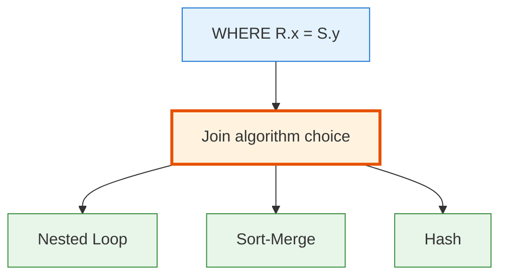
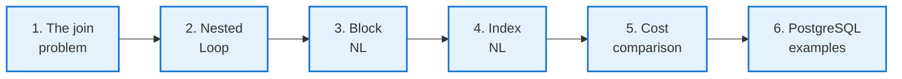
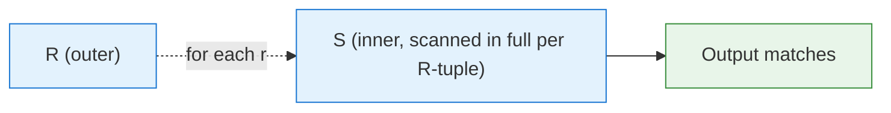
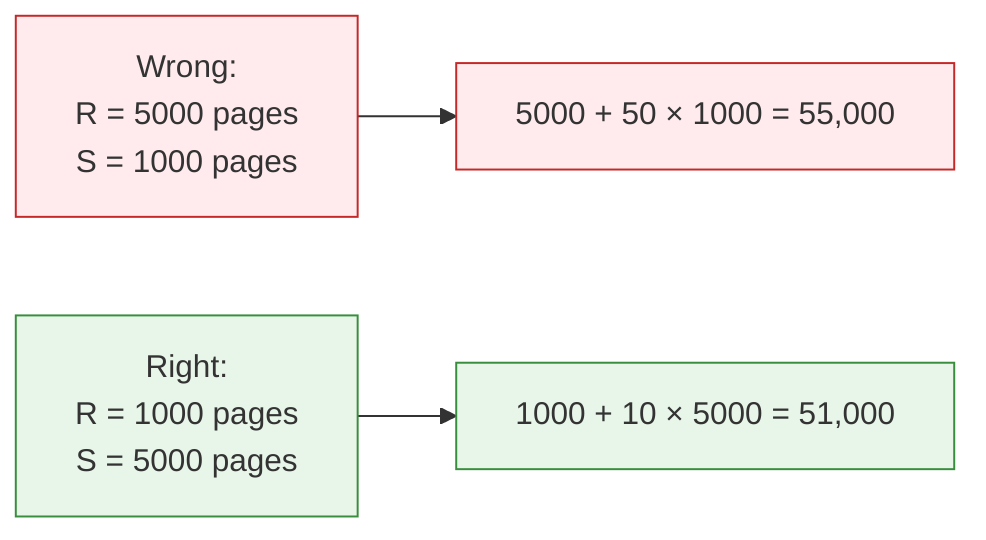
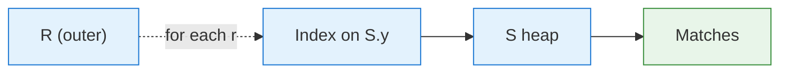

<!-- _class: lead -->

# Day 30: Join Algorithms I

**COP 5725 - Database Management Systems**
Monday, November 2, 2026

Nested loop, block nested loop, index nested loop

<!--
Section 5 opens. The join is the operation that matters most for understanding query plans. Pace 50 min, with the worked cost numbers (Part 6) taking real time — students should leave able to estimate join cost from B_R, B_S, M, h.
-->

---

# Where We Are

<div class="columns-left-wide">
<div>

Sections 1-2 covered **writing** joins.
Section 4 covered **storing** the data.

Today opens Section 5: how the engine executes a join, and why two queries that look identical can perform very differently.

Today covers the nested loop family.
Wednesday covers sort-merge and hash variants.
Friday covers the iterator framework that runs them all.

</div>
<div>



</div>
</div>

---

# Today's Roadmap



Reference: Textbook §15.2, p. 709; §15.3, p. 718; §15.6.3, p. 742.

---

<!-- _class: lead -->

# Part 1: The Join Problem

---

# A Join Is a Filtered Cross Product

```sql
SELECT s.name, e.cid
FROM   student s
JOIN   enrollment e ON s.sid = e.sid;
```

Algebraically (Day 4-5):

$$\pi_{name, cid}(\sigma_{s.sid = e.sid}(student \times enrollment))$$

Naive execution:
1. Compute the full cross product (|R| × |S| tuples)
2. Filter to matching pairs

If `student` is 10⁴ rows and `enrollment` is 10⁶ rows, that's **10¹⁰ tuples** in the intermediate. Hopeless.

The job of a join algorithm is to never materialize that cross product.

---

# The Cost Variables

For the rest of the section we use:

| Symbol | Meaning |
|--------|---------|
| $B_R$ | Pages of relation R (outer) |
| $B_S$ | Pages of relation S (inner) |
| $\|R\|$, $\|S\|$ | Tuples in R, S |
| $M$ | Buffer pages available for the join |
| $h$ | Height of any index involved |

All costs are in **page reads**.

We assume sequential reads cost the same as random reads, which suits modern SSDs. The textbook defines its page-based cost parameters in §15.1.4, p. 705.

<!--
The cost variables are universal across this and Day 31. Drill them once now and reuse them everywhere. The "seq = random" assumption is a 2026 simplification; HDDs from the textbook era needed separate cost models for each.
-->

---

<!-- _class: lead -->

# Part 2: Nested Loop Join

---

# The Naive Algorithm

```python
for r in R:
    for s in S:
        if r.x == s.y:
            yield (r, s)
```

For each tuple in R, scan every tuple in S.



**Cost:** $B_R + |R| \cdot B_S$ page reads.

For $|R| = 100$ K tuples and $B_S = 1000$ pages, that's **100 million page reads**. Awful.

---

# When Nested Loop Wins

Pure nested loop wins only when one of the relations is tiny.

```sql
-- R is the result of a filter that returns 5 rows
SELECT *
FROM (SELECT * FROM employee WHERE eid IN (1, 2, 3, 4, 5)) r
JOIN  department s ON r.dname = s.dname;
```

If |R| = 5 and $B_S = 1000$, the nested loop cost is **5005 page reads**, which is completely acceptable.

PostgreSQL's planner picks NL when the outer side is small enough.

<!--
"Tiny outer relation" is when NL beats everything. The planner detects this case via cardinality estimation. It also picks NL when one relation has an index — the index nested loop variant a few slides from now.
-->

---

<!-- _class: lead -->

# Part 3: Block Nested Loop

---

# Better Use of Memory

The naive NL ignores that we have **M pages of buffer**. We could read M-2 pages of R at a time, then scan S once per **block** instead of once per tuple.

```python
for chunk in chunks_of(R, M - 2):       # M-2 pages, 1 for S, 1 for output
    load chunk into memory
    for s_page in S:
        for s in s_page:
            for r in chunk:
                if r.x == s.y:
                    yield (r, s)
```

**Cost:** $B_R + \lceil B_R / (M - 2) \rceil \cdot B_S$ page reads.

R is read once. S is scanned $\lceil B_R / (M-2) \rceil$ times, once per chunk of R.

---

# Block Nested Loop Worked Example

$B_R = 1000$ pages, $B_S = 5000$ pages, $M = 102$ (100 for chunks).

Number of outer chunks: $\lceil 1000 / 100 \rceil = 10$.

Cost: $1000 + 10 \cdot 5000 = 51{,}000$ page reads.

Compare to naive NL with same inputs and $|R| = 100{,}000$ tuples:
$1000 + 100{,}000 \cdot 5000 = 500{,}001{,}000$ page reads.

**10,000× speedup** just from using buffer memory wisely.

<!--
This is one of the most important "use the buffer pool" lessons in the section. Block NL is the default fallback algorithm in every DBMS — when nothing fancier applies, you still get this much.
-->

---

# Pick the Smaller Relation as Outer

The cost is $B_R + \lceil B_R / (M-2) \rceil \cdot B_S$. The outer relation shows up twice; the inner once.

Always put the **smaller** relation as outer.



The optimizer picks the order. The query writer's job is to trust it and verify with EXPLAIN.

---

<!-- _class: lead -->

# Part 4: Index Nested Loop

---

# When One Side Has an Index

If S has a B+ tree (or hash) index on the join key:

```python
for r in R:
    for s in index_lookup(S, r.x):
        yield (r, s)
```

We never scan S. We **point-lookup** each matching tuple via the index.



---

# Index NL Cost

For each R tuple: walk the index (cost $h + 1$), then fetch the heap page (cost 1).

**Cost:** $B_R + |R| \cdot (h + 1)$.

If $|R| = 100$, $h = 4$:
$$B_R + 100 \cdot 5 = B_R + 500$$

For $B_R = 1000$, total is 1500 page reads.

Compare to block NL with $B_S = 5000$: **51,000** reads.

> Index NL is often the best choice when the inner relation is large and has the right index.

<!--
This is why we built indexes. The whole point of Section 4 was to make this kind of pattern fast. A foreign key with an index turns multi-table queries from O(N²) to O(N · log N).
-->

---

# When Index NL Loses

If $|R|$ is large, even index lookups add up.

$|R| = 1{,}000{,}000$, $h = 4$:
$$B_R + 1{,}000{,}000 \cdot 5 = B_R + 5{,}000{,}000$$

That's 5 million page reads, probably worse than a sort-merge or hash join.

The optimizer estimates $|R|$ and picks.

In general:
- |R| small + index on S: Index NL wins
- |R| large: hash or sort-merge wins (Wednesday)

---

# Reading EXPLAIN for Nested Loop

```sql
EXPLAIN ANALYZE
SELECT s.name, e.cid
FROM   student s
JOIN   enrollment e ON e.sid = s.sid
WHERE  s.major = 'CS' AND s.gpa > 3.5;
```

Typical plan when students with high GPA in CS are few:

```
Nested Loop  (cost=...) (actual time=...)
  ->  Seq Scan on student s
        Filter: (major = 'CS' AND gpa > 3.5)
  ->  Index Scan using enrollment_sid_idx on enrollment e
        Index Cond: (sid = s.sid)
```

The "Index Scan" line is the inner side using an index. This is index nested loop in PostgreSQL's vocabulary.

---

<!-- _class: lead -->

# Part 5: Cost Comparison

---

# A Decision Table

For $B_R, B_S$ pages, $|R|, |S|$ tuples, $M$ buffer, $h$ index height:

| Algorithm | Cost | When it wins |
|-----------|------|--------------|
| Nested Loop (NL) | $B_R + \|R\| \cdot B_S$ | Almost never |
| Block NL | $B_R + \lceil B_R / (M-2) \rceil \cdot B_S$ | No index, no sort, must join |
| Index NL | $B_R + \|R\| \cdot (h+1)$ | Small \|R\|, S has index on join key |
| Sort-Merge | $\approx 3 (B_R + B_S)$ | Already sorted or large M |
| Hash | $B_R + B_S$ | Smaller side fits in memory |
| Grace Hash | $3 (B_R + B_S)$ | Neither side fits in memory |

Sort-merge, hash, and grace hash are Wednesday's topics.

---

# Worked Comparison

$B_R = 1000$ pages, $B_S = 5000$ pages, $|R| = 10{,}000$ tuples, $M = 50$, $h = 3$.

| Algorithm | Cost (page reads) |
|-----------|-------------------|
| Naive NL | $1000 + 10{,}000 \cdot 5000 = 50{,}001{,}000$ |
| Block NL | $1000 + \lceil 1000/48 \rceil \cdot 5000 = 1000 + 21 \cdot 5000 = 106{,}000$ |
| Index NL (S indexed) | $1000 + 10{,}000 \cdot 4 = 41{,}000$ |

Index NL wins by a factor of 2-3 over block NL here. The naive form is 1000× worse.

---

<!-- _class: lead -->

# Part 6: Real PostgreSQL Examples

---

# Forcing the Join Algorithm

```sql
-- Default planner choice
EXPLAIN ANALYZE
SELECT * FROM student s JOIN enrollment e ON e.sid = s.sid;

-- Force nested loop only
SET enable_hashjoin = off;
SET enable_mergejoin = off;
EXPLAIN ANALYZE
SELECT * FROM student s JOIN enrollment e ON e.sid = s.sid;

-- Reset
RESET enable_hashjoin;
RESET enable_mergejoin;
```

PostgreSQL provides `enable_*` flags for every join algorithm. Use them to **compare plans**, not to force in production.

Reference: [PostgreSQL docs, Planner Method Configuration](https://www.postgresql.org/docs/current/runtime-config-query.html#RUNTIME-CONFIG-QUERY-ENABLE).

<!--
Production code should never set these. They exist for debugging — to compare what would happen under different choices. Hardcoding off can cause catastrophic plans when data changes.
-->

---

# Index NL on a Real Join

```sql
-- Without an index on enrollment.sid
DROP INDEX IF EXISTS enrollment_sid_idx;
EXPLAIN ANALYZE
SELECT s.name, count(*) FROM student s JOIN enrollment e ON e.sid = s.sid
WHERE s.gpa > 3.9
GROUP BY s.name;
-- Likely plan: Hash Join

-- Add an index on enrollment.sid
CREATE INDEX enrollment_sid_idx ON enrollment(sid);
EXPLAIN ANALYZE
SELECT s.name, count(*) FROM student s JOIN enrollment e ON e.sid = s.sid
WHERE s.gpa > 3.9
GROUP BY s.name;
-- Plan: Nested Loop with Index Scan (when |R| is small)
```

Watch how the plan changes when the index appears.
Run both and capture the runtime. This is Project 3 work.

---

# Wrap-up

- Naive nested loop costs $B_R + |R| \cdot B_S$ and wins only with a tiny outer relation.
- Block nested loop reads the outer in chunks and costs $B_R + \lceil B_R / (M-2) \rceil \cdot B_S$.
- Index nested loop costs $B_R + |R| \cdot (h+1)$ and wins with a small outer and an indexed inner.
- The smaller relation goes on the outside.
- The decision table shows which algorithm wins for given $B_R$, $B_S$, $|R|$, $M$, and $h$.
- PostgreSQL's `enable_*` flags let you compare plans during debugging.

<!--
One bullet per part. If short on time, the block NL and index NL cost formulas are the two things students must retain for the Worked Comparison style of exam question.
-->

---

# Wednesday: Joins Part II

Wednesday covers sort-merge join, hash join, and grace hash join.

Reading: Textbook §§15.4-15.5, pp. 723-738.

---

# Practice Before Wednesday

Two exercises:

1. Compute cost for block NL and index NL given: $B_R = 500$, $B_S = 8000$, $|R| = 5000$, $M = 30$, $h = 3$. Which wins?
2. Run `EXPLAIN ANALYZE` on a two-table join in your project's database. Capture the join algorithm chosen.

Push to your `cop5725fa26-project` repo before 8:30 AM Wed Nov 4.

---

# Questions

What is on your mind?

Project 3 due Fri Nov 13.

<!--
Common Day 30 questions: "Does PostgreSQL ever do naive nested loop?" (Yes — when one side is tiny.) "Why does the optimizer sometimes pick NL even when hash is cheaper?" (Bad cardinality estimates — Section 5 closes on this.) "What about merge join with one side already sorted by an index scan?" (Yes — see Wednesday's lecture on sort-merge.)
-->
