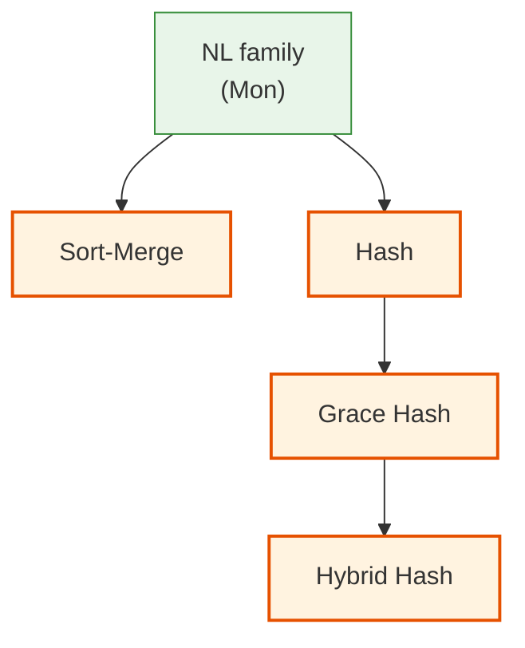
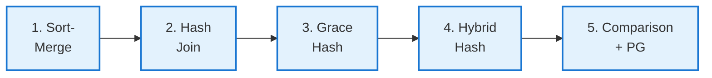
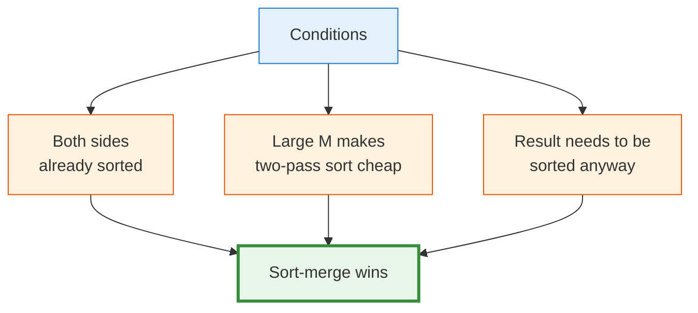
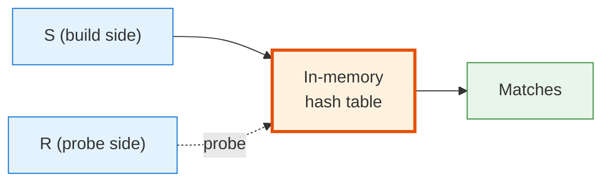
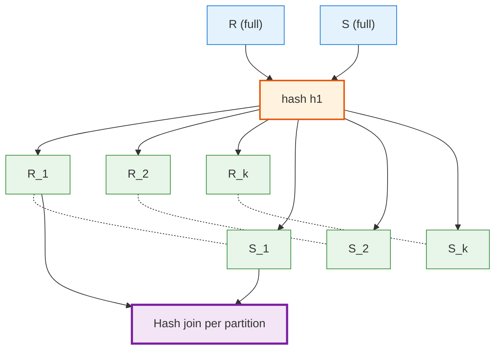
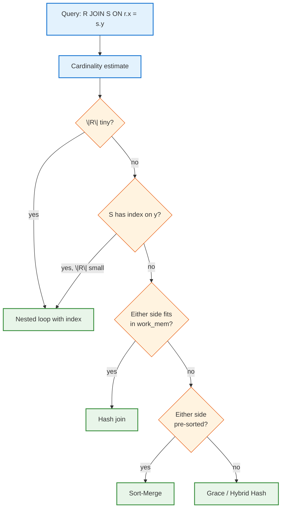

<!-- _class: lead -->

# Day 31: Join Algorithms II

**COP 5725 - Database Management Systems**
Wednesday, November 4, 2026

Sort-merge · Hash · Grace · Hybrid

<!--
Joins II. Pace 50 min. Sort-merge first (it builds on Day 29 external sort directly), then hash (the modern default), then grace and hybrid. Close with the full comparison table.
-->

---

# Where We Are

<div class="columns-left-wide">
<div>

Monday: the nested loop family. Three algorithms, each better than the last under specific conditions.

Today: the algorithms that exploit **ordering** and **hashing** to beat block nested loop on most workloads.

By the end of the hour you can:
- Pick the right join algorithm for a query
- Predict what PostgreSQL's planner will choose
- Reason about why a query gets slower as data grows

</div>
<div>



</div>
</div>

---

# Today's Roadmap



Reference: GMW Ch. 15.4-15.5; PostgreSQL docs [Ch. 14.2 Statistics Used by the Planner](https://www.postgresql.org/docs/current/planner-stats.html).

---

<!-- _class: lead -->

# Part 1: Sort-Merge Join

---

# The Idea

If both relations were **sorted on the join key**, we could merge them in one pass — like merging two sorted runs from external sort (Day 29).

```python
sort R on join key
sort S on join key
i, j = 0, 0
while i < |R| and j < |S|:
    if R[i].x == S[j].y:
        # emit matches (carefully — repeated keys)
        yield (R[i], S[j])
        i, j advance
    elif R[i].x < S[j].y:
        i += 1
    else:
        j += 1
```

The merge phase is **linear** in $|R| + |S|$.

---

# Sort-Merge Cost

```
Phase 1: sort R                  → ~2 B_R reads + writes  (Day 29's external sort)
Phase 2: sort S                  → ~2 B_S reads + writes
Phase 3: merge in lockstep       → B_R + B_S reads
```

**Total cost:** $\approx 3(B_R + B_S)$ page reads.

For $B_R = 1000$, $B_S = 5000$:
$$3 \cdot 6000 = 18{,}000 \text{ page reads}$$

Compare to block NL's **106,000** (Monday) on the same inputs.

---

# When Sort-Merge Wins



PostgreSQL picks sort-merge when:
- An index already provides one side sorted (free sort)
- The result is feeding into `ORDER BY` on the join key

Otherwise hash join almost always wins. We see why next.

---

# Repeated Keys

If the join key has duplicates, the merge gets tricky.

Imagine R has `[5, 5, 5]` and S has `[5, 5]`:

The output should be **6 pairs** (every R-5 paired with every S-5).

The algorithm:
1. When we see equal keys, save a pointer to the start of S's run
2. Emit all R × S pairs in this key group
3. After R advances past the key, reset to the saved S pointer if R re-enters the key... (it won't for sorted R; this matters for hash and other variants)

For sort-merge specifically, we scan the S-block of duplicates for every R-tuple with that key.

<!--
Repeated keys make sort-merge's cost slightly worse than the formula suggests; in the worst case (all keys equal) it degenerates to cross product. Real workloads almost always have well-distributed join keys.
-->

---

<!-- _class: lead -->

# Part 2: Hash Join

---

# The Hash Join Idea

If we had a **hash table mapping S.y → S tuples**, we could probe it once per R tuple.

```python
# Build phase
hash_table = {}
for s in S:
    hash_table.setdefault(s.y, []).append(s)

# Probe phase
for r in R:
    for s in hash_table.get(r.x, []):
        yield (r, s)
```



**Cost (when build fits in memory):** $B_R + B_S$ page reads.

---

# Hash Join Wins Almost Everything

When the smaller relation fits in memory, hash join is **the fastest general-purpose join**.

For $B_R = 1000$, $B_S = 5000$, smaller side fits:

| Algorithm | Cost |
|-----------|------|
| Block NL | 106,000 |
| Index NL (\|R\|=10⁴, h=3) | 41,000 |
| Sort-merge | 18,000 |
| **Hash join** | **6,000** |

3× faster than sort-merge, 17× faster than block NL.

This is why PostgreSQL's planner picks hash join most often when neither index nor pre-sort applies.

---

# Choosing the Build Side

> Always **build on the smaller** relation.

If S is smaller, S is the build side and R is the probe side. The hash table fits in memory; the probe relation streams through.

PostgreSQL's plan output shows this:

```
Hash Join  (cost=...) (actual time=...)
  Hash Cond: (e.sid = s.sid)
  ->  Seq Scan on enrollment e            <- probe side (larger)
  ->  Hash  (cost=...) (actual time=...)
        ->  Seq Scan on student s         <- build side (smaller)
```

The "Hash" node builds the in-memory hash table from `student`. `enrollment` probes.

---

<!-- _class: lead -->

# Part 3: Grace Hash Join

---

# When the Build Side Does Not Fit

A 100 GB build relation against 16 GB of memory:

- Naive hash join: hash table overflows, swaps, takes hours
- Sort-merge: 6 × 100 GB = 600 GB I/O
- **Grace hash:** ~3 × (B_R + B_S) I/O

Grace hash makes the hash join work even when the build doesn't fit, with cost similar to sort-merge.

The trick: **partition both relations** into hash-bucket-shaped pieces, then run hash join per-partition.

---

# The Grace Hash Algorithm

```
# Phase 1: Partition both relations using the same hash function h1
for each relation in [R, S]:
    open k output files (partitions)
    for each tuple t:
        write t to partition_file[h1(t.x) mod k]

# Phase 2: For each partition pair (R_i, S_i):
for i in range(k):
    load S_i into memory hash table (using a different h2)
    for each tuple r in R_i:
        probe hash table for matches
```

The key insight: tuples with the same join key always end up in the same partition pair. So joining partition pairs covers all matches.

---

# Grace Hash Visualized



Each partition is sized to fit in memory. Per-partition hash join is cheap.

---

# Grace Hash Cost

```
Phase 1: partition R    → 2 B_R (read + write)
Phase 2: partition S    → 2 B_S
Phase 3: per-partition  → B_R + B_S (one more read of each)
```

**Total:** $3(B_R + B_S)$ — same as sort-merge.

For $B_R = 1000$, $B_S = 5000$:
$$3 \cdot 6000 = 18{,}000 \text{ page reads}$$

Same as sort-merge but **no need to maintain sort order** at the end. Often faster in practice because hashing is cheaper than comparison-based sort.

---

<!-- _class: lead -->

# Part 4: Hybrid Hash Join

---

# An Optimization: Keep One Partition in Memory

In grace hash, **every** partition gets written to disk. But the first partition could just stay in memory while we partition.

```python
# Hybrid: keep partition 0 in memory
in_memory_hash = {}
disk_partitions = [[] for _ in range(k-1)]

for s in S:
    bucket = h(s.y) % k
    if bucket == 0:
        in_memory_hash.setdefault(s.y, []).append(s)
    else:
        disk_partitions[bucket - 1].append(s)
```

When we probe R, partition 0 is already there — no disk write or re-read.

**Savings:** roughly $1/k$ of the total I/O. For 10 partitions, that's a 10% win.

<!--
Hybrid hash join is what most production databases (including PostgreSQL) actually use. The pure grace hash is the textbook simplification. Real implementations keep the first partition in memory when possible.
-->

---

# PostgreSQL's Hybrid Hash

```sql
EXPLAIN (ANALYZE, BUFFERS)
SELECT *
FROM   large_table_r r
JOIN   medium_table_s s ON r.sid = s.sid;
```

```
Hash Join  (cost=...) (actual time=...)
  Hash Cond: (r.sid = s.sid)
  ->  Seq Scan on large_table_r r
  ->  Hash  (cost=...) (actual time=...)
        Buckets: 16384  Batches: 4  Memory Usage: 1234kB
        ->  Seq Scan on medium_table_s s
```

- **Buckets**: the in-memory hash buckets
- **Batches**: 1 means everything fit; > 1 means we spilled to disk
- **Memory Usage**: how much was used (related to `work_mem`)

`Batches: 1` is the goal — no disk involvement.

---

<!-- _class: lead -->

# Part 5: Comparison and PostgreSQL Choices

---

# The Full Comparison Table

For $B_R, B_S$ pages, $M$ buffer, $h$ index height:

| Algorithm | Cost | Wins when |
|-----------|------|-----------|
| Nested Loop | $B_R + \|R\| \cdot B_S$ | One side is tiny |
| Block NL | $B_R + \lceil B_R/(M-2) \rceil \cdot B_S$ | No index, no sort |
| Index NL | $B_R + \|R\| \cdot (h+1)$ | Small $\|R\|$, indexed inner |
| Sort-Merge | $3(B_R + B_S)$ + sort cost | Pre-sorted or large $M$ |
| Hash | $B_R + B_S$ | Smaller side fits in $M$ |
| Grace Hash | $3(B_R + B_S)$ | Neither fits in $M$ |
| Hybrid Hash | $\approx 2.5(B_R + B_S)$ | Standard fallback for large joins |

---

# How PostgreSQL Decides



The optimizer makes this decision **automatically**, based on `pg_statistic` data and the cost model.

<!--
The decision tree is conceptual; the real PostgreSQL planner explores many plans and picks the cheapest. But the broad shape — NL for small, INL for indexed, hash for unsorted-large — matches what students will see in EXPLAIN.
-->

---

<!-- _class: lead -->

# Part 6: Practical Notes

---

# Reading EXPLAIN Output

```sql
EXPLAIN (ANALYZE, BUFFERS, FORMAT TEXT)
SELECT s.name, count(*) FROM student s
JOIN enrollment e ON e.sid = s.sid
GROUP BY s.name;
```

Look for:

- **Join node name**: `Nested Loop`, `Hash Join`, `Merge Join`
- **Hash Cond** or **Merge Cond**: the join predicate
- **Batches** (hash join): 1 = in-memory, > 1 = spilled
- **actual rows** vs **estimated rows**: if these are wildly off, the planner picked badly

The `actual rows` mismatch is the #1 source of bad join plans. Run `ANALYZE` to refresh stats.

---

# Forcing Plans for Diagnosis

```sql
-- Force a specific algorithm
SET enable_nestloop = off;
SET enable_hashjoin = off;
SET enable_mergejoin = off;

-- Enable only one to see its cost
SET enable_hashjoin = on;

EXPLAIN ANALYZE <your query>;

RESET ALL;
```

This is **debugging only** — never set in production code. The default planner is usually right; when it isn't, the answer is to fix statistics (`ANALYZE`) or add an index.

For Project 3, this is exactly the kind of comparison you should capture.

---

# Wrap-up

You now have:

<div class="columns">
<div>

- Sort-merge join (uses Day 29's external sort)
- Hash join (the modern default)
- Grace hash join (when nothing fits)
- Hybrid hash join (PostgreSQL's variant)

</div>
<div>

- The full join algorithm comparison
- How PostgreSQL picks
- Reading `EXPLAIN ANALYZE` for join algorithm
- The `enable_*` flags for diagnosis

</div>
</div>

---

# Friday: The Iterator Model

The framework that makes all six join algorithms composable.

By the end of Friday you understand the `open / next / close` interface, the difference between pipelined and blocking operators, and why `LIMIT` can short-circuit some plans entirely.

Read Graefe, [*Volcano*](https://ufdatastudio.com/cop5725fa26/papers/pdfs/graefe1994.pdf), IEEE TKDE 6(1), 1994.

---

# Practice Before Friday

Two exercises:

1. Run a 3-way join in your project's database. Capture `EXPLAIN (ANALYZE, BUFFERS)` output and label each join algorithm.
2. Try the same join with `SET enable_hashjoin = off` and capture the plan. Which is faster on your data?

Push to your `cop5725fa26-project` repo before 8:30 AM Fri Nov 6.

---

# Questions

What is on your mind?

Project 3 due in 9 days.

<!--
Common Day 31 questions: "When does PG ever pick merge join in practice?" (When one side is already sorted from an index scan and the result is ordered.) "Why is the planner so confident about cardinality?" (It usually isn't — bad estimates are the #1 source of bad plans.) "Can I force grace hash for a specific query?" (Not directly. Adjusting work_mem changes whether hash spills.)
-->
