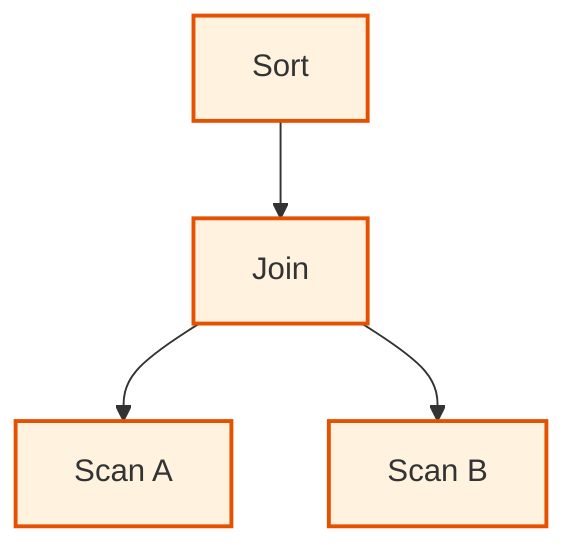
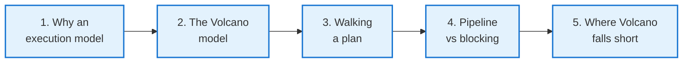
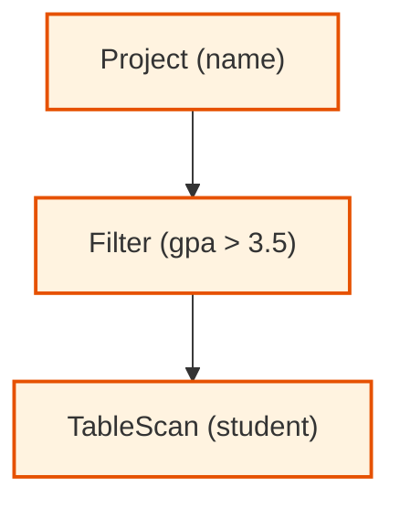
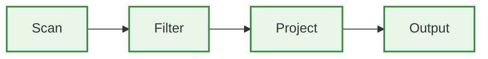
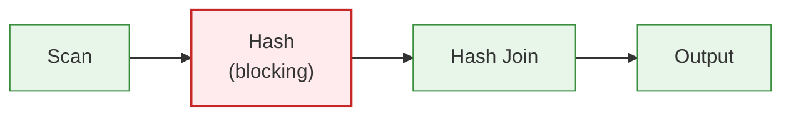
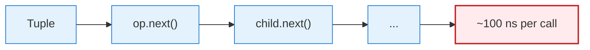
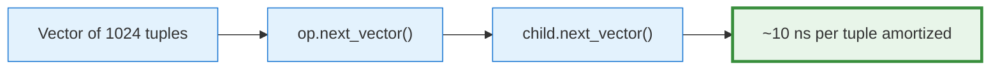

<!-- _class: lead -->

# Day 32: The Iterator (Volcano) Model

**COP 5725 - Database Management Systems**
Friday, November 6, 2026

The execution framework every query engine uses

<!--
Closes Week 12. Pace 50 min, with the worked plan-tree trace taking real time. The Graefe 1994 paper is the anchor — it's only 18 pages and astonishingly readable for its age.
-->

---

# Where We Are

<div class="columns-left-wide">
<div>

Monday and Wednesday covered six join algorithms. Sorts, filters, and projections came earlier.

Today covers the framework that **wires them together** into a query plan and **drives** that plan to produce results.

That framework is the **iterator model**, also called the **Volcano model** after Graefe's 1994 paper. It has been the execution architecture inside most database engines for the last 30 years.

</div>
<div>



</div>
</div>

---

# Today's Roadmap



Anchor paper: Graefe, [*Volcano: An Extensible and Parallel Query Evaluation System*](https://ufdatastudio.com/cop5725fa26/papers/pdfs/graefe1994.pdf), IEEE TKDE 6(1), 1994.

---

<!-- _class: lead -->

# Part 1: Why an Execution Model

---

# The Problem

You have:
- A plan tree (the parsed and optimized query)
- A set of operator implementations (scan, filter, join, sort, ...)
- Real data on disk

You need:
- A way to **run** the plan
- A way to **compose** operators arbitrarily
- A way to handle **streaming** (don't materialize huge intermediates)
- A way to handle **memory limits** (some operators need state, some don't)

The Volcano model solves all of these with a single uniform interface.

<div class="small">

To materialize an intermediate result is to compute and store it in full before the next operator reads it. Streaming hands each tuple onward as soon as it is produced.

</div>

---

# Operators Are Iterators

Every operator implements three methods:

```python
class Operator:
    def open(self):
        """Initialize state. Called once before any data flows."""

    def next(self) -> Tuple | None:
        """Produce the next output tuple. None signals end of stream."""

    def close(self):
        """Release resources."""
```

This is the **Volcano interface**: three methods in total. The textbook builds its physical operators on the same Open, GetNext, and Close methods (Textbook §15.1.6, p. 707).

Operators are composed by **child pointers** in the tree. When an operator needs more input, it calls `next()` on its child.

---

<!-- _class: lead -->

# Part 2: The Volcano Model in Detail

---

# A Scan Operator

```python
class TableScan(Operator):
    def __init__(self, table_name):
        self.table_name = table_name
        self.cursor = None

    def open(self):
        self.cursor = open_table_file(self.table_name)

    def next(self):
        return self.cursor.read_next_tuple()  # None at EOF

    def close(self):
        self.cursor.close()
```

The leaf of every plan tree. Reads from the heap file one tuple at a time.

Real implementations read a **page** at a time and serve tuples from the page, but the interface stays "one tuple per `next()`."

---

# A Filter Operator

```python
class Filter(Operator):
    def __init__(self, child, predicate):
        self.child = child
        self.predicate = predicate
    def open(self):
        self.child.open()
    def next(self):
        while True:
            tup = self.child.next()
            if tup is None:
                return None
            if self.predicate(tup):
                return tup
    def close(self):
        self.child.close()
```

The filter pulls tuples from `child.next()` and yields the ones that pass.

`next()` may iterate many child tuples before returning one of its own. From the **caller's** view, it still returns one tuple per call.

---

# A Hash Join Operator

<div class="columns">
<div>

```python
class HashJoin(Operator):
    def __init__(self, build_side,
                 probe_side, join_keys):
        self.build = build_side
        self.probe = probe_side
        self.keys = join_keys
        self.hash_table = {}
        self.current_matches = []
        self.current_probe = None

    def open(self):
        self.build.open()
        # Drain the build side (blocking!)
        while True:
            tup = self.build.next()
            if tup is None: break
            k = tup[self.keys[0]]
            self.hash_table.setdefault(
                k, []).append(tup)
        self.build.close()
        self.probe.open()
```

</div>
<div>

```python
    def next(self):
        while True:
            if self.current_matches:
                return (self.current_probe,
                        self.current_matches.pop())
            self.current_probe = self.probe.next()
            if self.current_probe is None:
                return None
            k = self.current_probe[self.keys[1]]
            self.current_matches = list(
                self.hash_table.get(k, []))

    def close(self):
        self.probe.close()
        self.hash_table = None
```

Notice `open()` drains the build side **completely** before yielding any output. We return to this.

</div>
</div>

---

<!-- _class: lead -->

# Part 3: Walking a Plan

---

# A Three-Operator Plan

```sql
SELECT name FROM student WHERE gpa > 3.5;
```



To run: call `Proj.open()`, then `Proj.next()` repeatedly until it returns None, then `Proj.close()`.

---

# Trace: One Output Tuple

The driver calls `Proj.next()`:

```
Proj.next()
  → Filt.next()
    → Scan.next() → tuple1 (gpa=2.0)
  → Filt rejects tuple1
  → Filt.next() called again (in the loop)
    → Scan.next() → tuple2 (gpa=3.7)
  → Filt accepts tuple2
  → Filt returns tuple2
  Proj projects to {name: 'Ada'}
  → return {name: 'Ada'}
```

The driver receives **one** tuple. Behind the scenes, the chain of `next()` calls did all the work.

<!--
The "pull-based" nature of Volcano is the key insight: the consumer pulls tuples from above; producers respond on demand. This is why it's also called the pull model. Contrast with the "push model" used in some modern engines.
-->

---

# Operators Compose Freely

Any operator can be a child of any other. The interface is uniform:

```python
plan = HashJoin(
    build=Filter(
        child=TableScan("student"),
        predicate=lambda t: t["gpa"] > 3.5
    ),
    probe=TableScan("enrollment"),
    join_keys=("sid", "sid"),
)
plan.open()
while (tup := plan.next()) is not None:
    print(tup)
plan.close()
```

The same recursive `next()` pattern produces complex pipelines.

This is the architecture inside PostgreSQL's executor. See [src/backend/executor/](https://github.com/postgres/postgres/tree/master/src/backend/executor) for the real source.

---

<!-- _class: lead -->

# Part 4: Pipelining vs Blocking

---

# Pipelined Operators

A **pipelined** operator can produce output as soon as it gets a single input tuple.



Scan → Filter → Project: all pipelined. A tuple flows through with no buffering.

Examples of pipelined operators:
- Scan
- Filter
- Project
- Index Scan
- Nested Loop Join (on the outer side)
- Limit
- Append (UNION ALL)

---

# Blocking Operators

A **blocking** operator must **see all its input** before producing any output. The textbook studies this pipelining-versus-materialization choice in §16.7.3, p. 830.



Examples of blocking operators:
- Sort
- Hash (the build side of a hash join)
- Hash Aggregate
- Materialize (explicit cache node)

The blocking operator's `open()` typically drains all its input.

---

# Why LIMIT Matters

```sql
SELECT name FROM student WHERE gpa > 3.5 LIMIT 10;
```

<div class="small">

Plan tree:

```
Limit (10)
  Project (name)
    Filter (gpa > 3.5)
      Scan student
```

</div>

All four operators are pipelined. The driver calls `Limit.next()` 10 times, then **stops**. Each call propagates down to the scan; the scan reads pages **as needed**, and we never read the full table.

<div class="small">

PostgreSQL's `EXPLAIN ANALYZE` shows this:

```
Limit (cost=0.00..6.21 rows=10 width=20)
  ->  Seq Scan on student (cost=0.00...) (actual rows=10)
        Filter: (gpa > 3.5)
```

The "actual rows" on the scan is **10, not |student|**.

</div>

<!--
This LIMIT-stops-early behavior is one of the most important practical consequences of the iterator model. A query with LIMIT 1 on a filtered scan often reads almost no data, even from huge tables.
-->

---

# LIMIT With a Blocking Operator

```sql
SELECT name FROM student WHERE gpa > 3.5 ORDER BY name LIMIT 10;
```

Plan tree:

```
Limit (10)
  Sort (by name)              ← blocking
    Filter (gpa > 3.5)
      Scan student
```

The `Sort` is blocking. It must consume the entire filtered output to sort it. Only then can `Limit` pull 10 sorted tuples.

The early-stop benefit of `LIMIT` **disappears** above a blocking operator.

> To make `ORDER BY ... LIMIT` cheap, add an index on the order-by column. The planner can then replace `Sort + Limit` with `Index Scan + Limit`, restoring pipelining.

---

<!-- _class: lead -->

# Part 5: Where Volcano Falls Short

---

# The Overhead Problem

Volcano processes **one tuple per `next()` call**. Modern hardware:

- CPU: 4 GHz, can do ~10⁹ ops/sec
- Each `next()` call: virtual function dispatch, register pressure, no SIMD
- Per-tuple overhead: 50-200 nanoseconds

For a query over **1 billion tuples**, that's **50-200 seconds of pure interpretation overhead** before any actual work.



For OLAP workloads, this overhead is the bottleneck.

---

# Vectorized Execution

Process tuples in **batches** (vectors of 1024 or 4096 at a time).

- One `next()` call returns a vector
- Per-tuple work is amortized over the vector
- Inner loops are tight, branch-free, and SIMD-friendly



This is the architecture inside **DuckDB**, MonetDB/X100, Photon, Velox.

Volcano is for OLTP and broad compatibility; vectorized is for OLAP throughput. Monday's lecture goes deeper.

<div class="small">

OLTP workloads run many small transactional queries that each touch a few rows. OLAP workloads run analytical queries that scan and aggregate large fractions of the data.

</div>

---

# When Volcano Still Wins

PostgreSQL stays Volcano-style for good reasons:

- OLTP workloads return 1-100 tuples, so per-tuple overhead doesn't matter
- Implementation simplicity makes the planner easier
- Adding new operators is straightforward
- Concurrency model fits well

> The interpretation overhead matters only when you process **millions of tuples per query**. For most OLTP workloads, Volcano is plenty fast.

PostgreSQL has added JIT compilation since version 11 to reduce per-tuple overhead while keeping the iterator interface.

---

# Wrap-up

- Every operator implements the three-method Volcano interface: open, next, close.
- Execution is pull-based, with each operator calling `next()` on its children.
- The uniform interface lets operators compose into arbitrary plan trees.
- Pipelined operators stream tuples; blocking operators drain their input first.
- LIMIT short-circuits fully pipelined plans and loses that benefit above a blocking operator.
- Per-tuple `next()` overhead motivates vectorized execution for OLAP workloads.

<!--
One bullet per part. The LIMIT bullet connects directly to the practice exercise; the last bullet sets up Monday.
-->

---

# Monday: Vectorized Execution and Optimization I

Monday covers vectorized execution and the relational algebra equivalences that begin query optimization.

Reading: PostgreSQL docs [Performance Tips](https://www.postgresql.org/docs/current/performance-tips.html).

---

# Practice Before Monday

Two exercises:

1. Pick a query from your project. Run `EXPLAIN (ANALYZE, BUFFERS)` and label each node as pipelined or blocking.
2. Add `LIMIT 10` to a query that returns many rows. Capture the plan with and without the LIMIT. Where does the optimizer cut the work?

This is an exercise.

---

# Questions

What is on your mind?

Project 3 due Fri Nov 13.

<!--
Common Day 32 questions: "Is PostgreSQL still Volcano in 2026?" (Mostly yes, with JIT for hot paths. The architecture is hybrid.) "Is the Volcano paper still relevant?" (Yes — it's been cited tens of thousands of times and remains the conceptual foundation for almost every textbook chapter on query execution.) "Why doesn't Postgres just switch to vectorized?" (Cost of rewriting 30+ years of operators; OLTP would not benefit.)
-->
