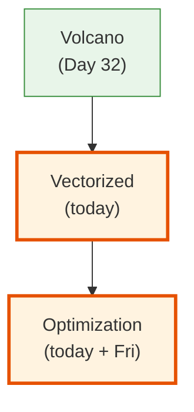
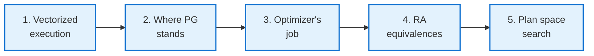
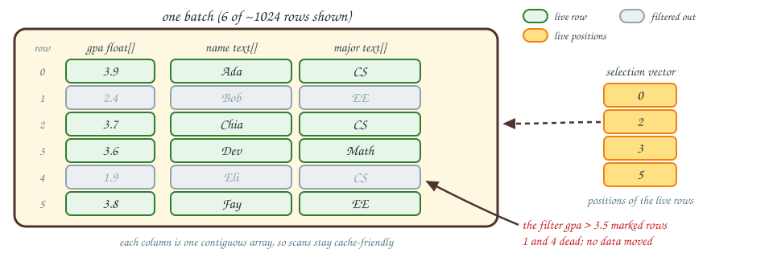
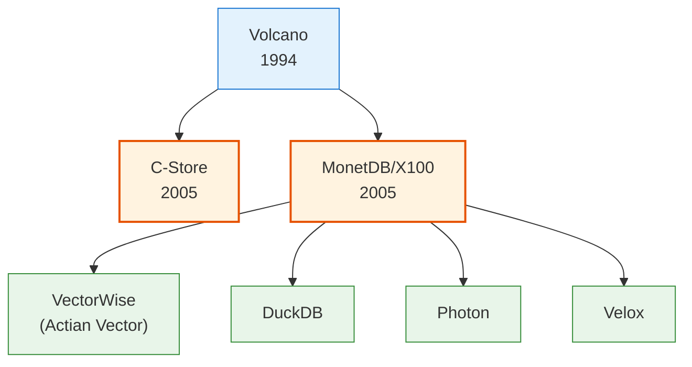
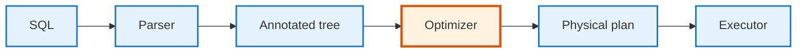
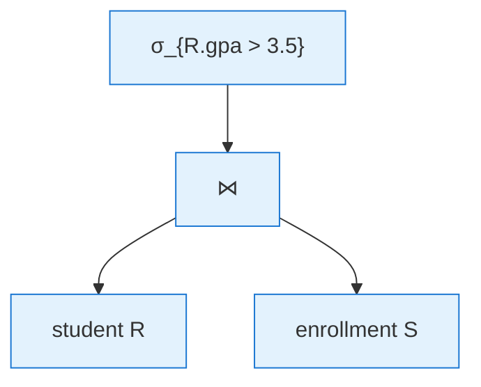
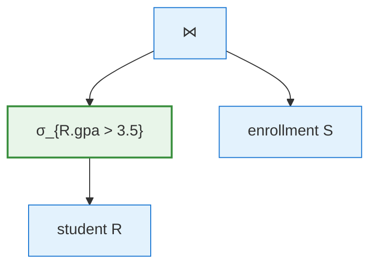
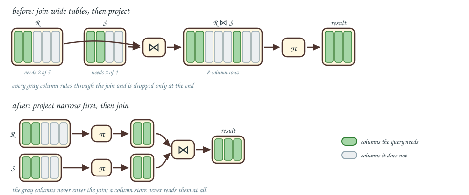
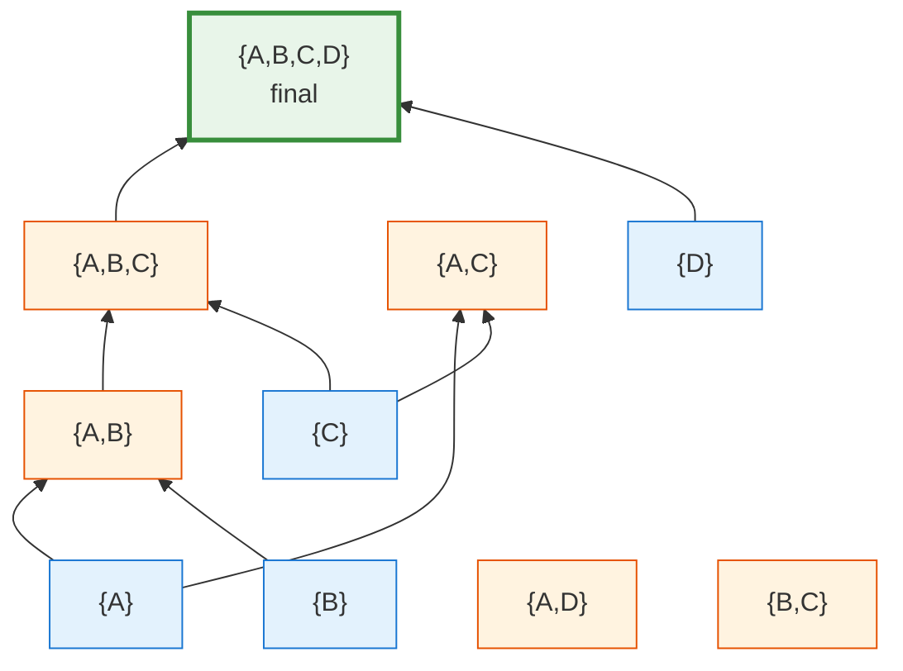

<!-- _class: lead -->

# Day 33: Vectorized Execution + Optimization I

**COP 5725 - Database Management Systems**
Monday, November 9, 2026

Vectorized execution closes the execution thread; algebraic equivalences open query optimization.

<!--
Two-topic day. Pace 50 min: 20 min on vectorization (the answer to Friday's overhead problem), 30 min on optimization basics (RA equivalences and plan space). Veterans Day takes Wednesday, so this is the only Monday content of the week.
-->

---

# Where We Are

<div class="columns-left-wide">
<div>

Friday's lecture ended with the **per-tuple overhead** problem of the Volcano model.

Today first covers the answer, **vectorized execution**.
It then opens the question that drives Friday's lecture: how does the optimizer choose a plan in the first place?

</div>
<div>



</div>
</div>

---

# Today's Roadmap



Anchors: Boncz et al. *MonetDB/X100* (CIDR 2005); Textbook §§16.2-16.3, pp. 768-791, and §16.6, p. 814.

---

<!-- _class: lead -->

# Part 1: Vectorized Execution

---

# The Per-Tuple Overhead Problem

Volcano processes one tuple per `next()` call.

For a 1 billion-row scan:
- 1 billion `next()` calls
- Each call: ~50-200 ns of overhead (virtual dispatch, branch prediction misses, register pressure)
- **Pure overhead:** 50-200 seconds

Modern CPUs do **billions** of simple integer ops per second when given a tight loop. Volcano gives them virtual-method-call overhead instead.

We need a way to amortize that overhead.

---

# Vectors of Tuples

Process **vectors of tuples** at a time instead of one.

```python
# Volcano
def next(self) -> Tuple | None:
    ...

# Vectorized
def next_batch(self) -> Vector | None:
    """Return ~1024 tuples worth of data, column by column."""
```

A vector might be:
- 1024 row IDs
- 1024 integers from column A
- 1024 floats from column B
- A bitmap of "this row passed the filter"

Per-call overhead is amortized over 1024 tuples, about **0.05-0.2 ns per tuple**.

The interpretation overhead drops by roughly 1000× just from changing the granularity.

---

# What Goes Inside a Batch



The batch holds one contiguous array per **column** (cache-friendly) and a **selection vector** (or bitmap) marking which rows are still alive.

Filters mark rows dead; they don't physically remove them. Subsequent operators iterate only the live indices.

<!--
Walk the picture left to right: the three arrays are the columns of the same six rows, the gray rows are the ones a filter killed, and the amber selection vector holds the surviving positions. The dashed arrow shows how entry 2 indexes back into every array.
-->

---

# Vectorized Filter Loop

Compare a tuple-at-a-time filter to a vectorized one:

<div class="columns">
<div>

### Tuple-at-a-time

```python
while (tup := child.next()) is not None:
    if tup.gpa > 3.5:
        yield tup
```

Each iteration: virtual call, branch, maybe more virtual calls.

</div>
<div>

### Vectorized

```python
def next_batch(self):
    batch = self.child.next_batch()
    sel = batch.selection
    gpa = batch.column("gpa")
    for i in sel:
        if gpa[i] > 3.5:
            sel.keep(i)
        else:
            sel.drop(i)
    return batch
```

The hot loop is `gpa[i] > 3.5` over a contiguous array, which the CPU can vectorize.

</div>
</div>

---

# MonetDB/X100

<div class="columns">
<div>

> Boncz, P., Zukowski, M., Nes, N.
> *MonetDB/X100: Hyper-Pipelining Query Execution.*
> CIDR 2005.

This paper revived vectorized execution for OLAP.

It showed 10-100× speedups over Volcano-style engines on the same hardware.

[Local PDF](https://ufdatastudio.com/cop5725fa26/papers/pdfs/boncz2005.pdf)

</div>
<div>



</div>
</div>

The 2005 ideas drive the 2026 cloud warehouses.

---

# How DuckDB Does It

DuckDB's execution model uses vectors of 2048 tuples by default.

```python
# DuckDB Python: try this against your project's dataset
import duckdb

duckdb.sql("PRAGMA enable_profiling")
duckdb.sql("PRAGMA profile_output='profile.json'")

# Some heavy query
result = duckdb.sql("""
    SELECT origin, count(*)
    FROM 'flights.parquet'
    GROUP BY origin
""").fetchall()

# Inspect profile.json: every operator processed in vectors
```

The vectors are passed between operators as **column chunks**, never materialized into rows until needed.

---

<!-- _class: lead -->

# Part 2: Where PostgreSQL Stands

---

# PostgreSQL Is Still Volcano Plus JIT

PostgreSQL kept the tuple-at-a-time iterator model but added **JIT compilation** in PG 11 (2018).

```sql
SHOW jit;                          -- on by default in PG 12+
SHOW jit_above_cost;               -- threshold to enable
SHOW jit_inline_above_cost;        -- threshold for inlining
SHOW jit_optimize_above_cost;      -- threshold for LLVM optimization
```

For OLTP workloads (few rows, low overhead), Volcano + JIT is plenty fast.
For OLAP scans (billions of rows), DuckDB's vectorized engine pulls ahead.

That is part of why this course uses both.

---

<!-- _class: lead -->

# Part 3: The Optimizer's Job

---

# From SQL to Execution



<div class="caption">

The parse and preprocess stages are Textbook §16.1, p. 760; the optimizer stages fill the rest of Chapter 16.

</div>

The **optimizer** is the brain in the middle. Given a parsed query, it picks:

- Join order
- Join algorithm
- Access path (sequential scan? index?)
- Where to place projections and selections
- Whether to materialize or pipeline

For a 6-table join, there can be **thousands of valid plans**. The optimizer's job is to find a cheap one in milliseconds.

---

# Logical vs Physical Plan

<div class="columns">
<div>

### Logical plan

What the query means, in algebra:

```
π_{name}
  σ_{gpa > 3.5}
    student ⋈_{sid} enrollment
```

The relational algebra tree <span class="cite">(Textbook §16.3, p. 781)</span>.
No commitment to algorithm or access path.

</div>
<div>

### Physical plan

What the engine will run:

```
Project name
  Filter gpa > 3.5
    Hash Join (hash on enrollment.sid)
      Seq Scan on student
      Seq Scan on enrollment
```

Operators are concrete. Costs are computed. Order is committed <span class="cite">(Textbook §16.7, p. 826)</span>.

</div>
</div>

The optimizer converts the first into the second by exploring equivalences and picking by cost.

---

<!-- _class: lead -->

# Part 4: Relational Algebra Equivalence Rules

---

# Why Equivalences Matter

Two algebra expressions are **equivalent** if they always produce the same relation.

The optimizer uses equivalence rules to **rewrite** the logical plan into other logical plans, then picks the cheapest physical realization.

We've seen some before:
- $\sigma_{p \wedge q}(R) = \sigma_p(\sigma_q(R))$
- $\sigma_p(R \cup S) = \sigma_p(R) \cup \sigma_p(S)$

Today covers the rules the optimizer relies on most.

Reference: Textbook §16.2, p. 768.

---

# Selection Pushdown

The most important equivalence:

$$\sigma_p(R \bowtie S) \equiv (\sigma_p(R)) \bowtie S \quad \text{if } p \text{ involves only } R$$

<div class="columns">
<div>

### Before



</div>
<div>

### After (pushed down)



</div>
</div>

The selection filters R **before** the join. The join touches fewer tuples.

> Push selections down whenever possible. <span class="cite">Textbook §16.2.3, p. 772.</span>

---

# Projection Pushdown

$$\pi_L(R \bowtie S) \equiv \pi_L((\pi_{L_R}(R)) \bowtie (\pi_{L_S}(S)))$$

If we only want columns $L$ in the result, we can drop unneeded columns from R and S before the join <span class="cite">(Textbook §16.2.4, p. 774)</span>.



Projection pushdown is especially valuable in column stores, where the projected-away columns never need to be read at all.

<!--
Projection pushdown is a column-store superpower. In a row store, the cost is small; in a column store, the unneeded columns simply don't get read. C-Store and its descendants make this the default behavior.
-->

---

# Join Commutativity and Associativity

<div class="columns">
<div>

### Commutativity

$$R \bowtie S \equiv S \bowtie R$$

We can swap join inputs.
**Why it matters:** Day 30's "small relation as outer" rule.

</div>
<div>

### Associativity

$$(R \bowtie S) \bowtie T \equiv R \bowtie (S \bowtie T)$$

We can re-bracket joins.
**Why it matters:** the optimizer can pick any join **order** to minimize intermediate sizes.

</div>
</div>

These two rules give the optimizer enormous freedom and create the **plan space** challenge in the next part.
The commutative and associative laws for joins are Textbook §16.2.1, p. 768.

---

# Cross Product to Join

```sql
SELECT *
FROM student s, enrollment e
WHERE s.sid = e.sid;
```

This is technically a cross product followed by a filter:

$$\sigma_{s.sid = e.sid}(student \times enrollment)$$

The optimizer rewrites it as:

$$student \bowtie_{s.sid = e.sid} enrollment$$

The join is **always** cheaper than cross-product-plus-filter. Modern optimizers do this trivially.

---

<!-- _class: lead -->

# Part 5: Plan Space Search

---

# The Search Problem

For an `n`-way join, the number of distinct **left-deep** plans is `n!` <span class="cite">(Textbook §16.6.2, p. 815)</span>.

<div class="small">

A plan is left-deep when the right input of every join is a base relation, so the plan adds one new relation at a time <span class="cite">(Textbook §16.6.3, p. 816)</span>.

</div>

For `n = 6`: 720 plans.
For `n = 10`: 3.6 million.
For `n = 12`: 479 million.

When you include **bushy** plans (subtrees on both sides of every join), the count grows far faster still.

The optimizer cannot enumerate all of them. We need a search strategy.

---

# System R Dynamic Programming

Selinger et al. (1979) observed:

> For an n-way join, the optimal plan over a set S of relations depends only on the optimal plans for subsets of S.

So:
- Compute the best plan for every single relation (cheapest access path)
- Compute the best 2-way join for every pair
- Compute the best 3-way join using best 2-way joins as inputs
- ... and so on up to n

Cost: O(3^n) instead of O(n!).
For n = 10: 59 thousand subproblems instead of 3.6 million plans.

This is what PostgreSQL's optimizer does for small joins. The textbook presents the same algorithm in §16.6.4, p. 819.

---

# Dynamic Programming, Visualized



For each subset, keep only the **cheapest** plan. Then use those cheap plans to build larger subsets.

---

# When DP Doesn't Scale

For `n > 12`, even O(3^n) is too slow.

PostgreSQL switches to **GEQO** (Genetic Query Optimizer) for joins of 12+ relations.

GEQO uses a randomized genetic algorithm:
- Generate random plans
- Score them
- "Cross-breed" the best
- Iterate

The result isn't guaranteed optimal but is usually good. Reference: [PostgreSQL docs, Genetic Query Optimizer](https://www.postgresql.org/docs/current/geqo.html).

```sql
SHOW geqo_threshold;     -- 12 by default
```

<!--
The 12-relation threshold is the line between "exhaustive search" and "heuristic search" in PostgreSQL. Most application queries stay under it; some BI tools exceed it.
-->

---

# Interesting Orders

System R also tracks **physically interesting** orderings of intermediate results.

Example: if the final query has `ORDER BY age`, a plan that produces results sorted by `age` may be cheaper overall, even if its raw cost is higher. The final sort can be skipped.

The optimizer maintains, per subset, the best plan **for each interesting order**, not just one global best plan. This catches optimizations that a naive cost-only search misses.

---

# Wrap-up

- Vectorized execution amortizes per-tuple overhead over batches and wins on OLAP scans.
- MonetDB/X100 (CIDR 2005) is the origin of today's vectorized engines, including DuckDB.
- PostgreSQL keeps the Volcano iterator and reduces overhead with JIT compilation.
- The optimizer turns a logical algebra plan into a physical plan by exploring equivalences and comparing costs.
- Selection pushdown, projection pushdown, and join commutativity and associativity generate the plan space.
- System R dynamic programming searches that space, and PostgreSQL switches to GEQO past 12 relations.

<!--
One bullet per part. The pushdown rules and the DP search are the two exam-relevant pieces; the vectorization half connects to the DuckDB side of Project 3.
-->

---

# Friday: Optimization II

Friday covers statistics, cost estimation, Selinger 1979 in depth, and Leis et al. 2015, *How Good Are Query Optimizers, Really?*

Reading: both papers, before class.

Project 3 due Friday at 11:59 PM.

---

# Practice Before Friday

Two exercises:

1. Run `EXPLAIN ANALYZE` on a 3-way join in your project's database. Compare against `EXPLAIN ANALYZE` with `enable_hashjoin = off`. Capture both.
2. Look at `pg_stats` for one of your project's tables. Pick a column and explain what the histogram tells you about its distribution.

```sql
SELECT attname, n_distinct, most_common_vals, histogram_bounds
FROM pg_stats
WHERE tablename = 'your_table';
```

This is an exercise.

---

# Questions

What is on your mind?

Project 3 due Friday. Veterans Day Wednesday, no class.

<!--
Common Day 33 questions: "Should I switch to DuckDB for my project?" (Project 3 can use either or both — measure with your dataset.) "Is the optimizer ever wrong?" (Constantly. Friday's lecture is about why.) "How do I see what the optimizer was thinking?" (EXPLAIN gives the plan; auto_explain logs it; pg_stat_statements summarizes across queries.)
-->
