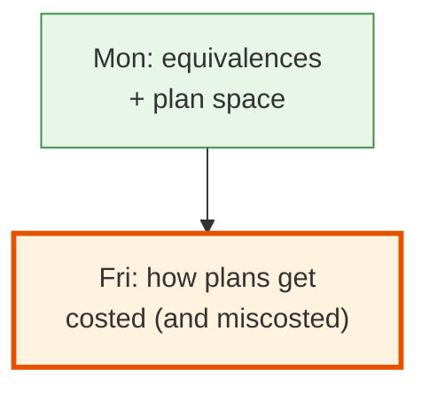
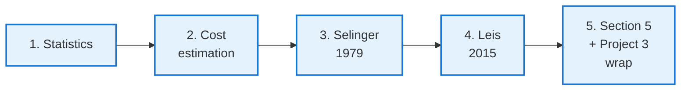
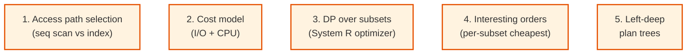
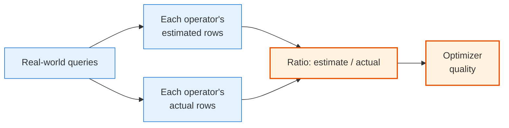
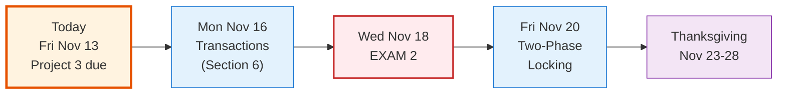

<!-- _class: lead -->

# Day 34: Optimization II

**COP 5725 - Database Management Systems**
Friday, November 13, 2026

Statistics · Cost · Selinger · Leis · Project 3 due

<!--
Closes Section 5. Last class before Exam 2 next Wednesday. Pace 50 min, with the Leis 2015 paper getting 8-10 minutes and the Project 3 wrap getting the final 5. Practice exam packet released today. Quiz 4 (Section 5, per the schedule) takes the last 10 minutes, so compress the Leis discussion and the Project 3 wrap to fit.
-->

---

# Recap

<div class="columns-left-wide">
<div>

Monday covered algebraic equivalences and the plan space. The optimizer must pick among many plans without running them.

Today covers statistics, cost estimation, and the algorithm Pat Selinger published in 1979, which still runs inside PostgreSQL.

We then read Leis et al. 2015, which measured how fragile optimizer cost models remain after 30+ years of improvement.

Quiz 4 covers Section 5 and runs in the last 10 minutes of class.

</div>
<div>



</div>
</div>

<!--
Two-sentence recap. Monday established the plan space; today supplies the cost side. Frame Leis as the empirical check on everything in Parts 1-3.
-->

---

# Today's Roadmap



Two anchor papers today:
- Selinger et al. *Access Path Selection* ([Local PDF](https://ufdatastudio.com/cop5725fa26/papers/pdfs/selinger1979.pdf))
- Leis et al. *How Good Are Query Optimizers, Really?* ([Local PDF](https://ufdatastudio.com/cop5725fa26/papers/pdfs/leis2015.pdf))

Textbook background: cost estimation is §16.4, p. 792; cost-based plan selection is §16.5, p. 803; join ordering is §16.6, p. 814.

---

<!-- _class: lead -->

# Part 1: Statistics

---

# What the Optimizer Knows

Before running your query, the optimizer needs to estimate:
- How many rows will this predicate return?
- How many rows will this join produce?
- Are the join keys mostly unique or mostly duplicates?
- How wide is each row?

It answers these from **per-column statistics**, refreshed by `ANALYZE`.

```sql
ANALYZE student;
ANALYZE enrollment;
ANALYZE;  -- all tables
```

PostgreSQL also runs `autovacuum` in the background, which calls `ANALYZE` automatically when a table has changed enough.

---

# Per-Column Statistics in pg_stats

```sql
SELECT
  attname,
  n_distinct,
  null_frac,
  most_common_vals,
  most_common_freqs,
  histogram_bounds
FROM pg_stats
WHERE tablename = 'student';
```

For each column the planner tracks:

| Field | Meaning |
|-------|---------|
| `n_distinct` | Number of distinct values (negative = fraction of rows) |
| `null_frac` | Fraction of NULL values |
| `most_common_vals` (MCVs) | The values appearing most often |
| `most_common_freqs` | Their frequencies |
| `histogram_bounds` | Bucket boundaries for the non-MCV values |

Reference: [PostgreSQL Ch. 14.2 Statistics Used by the Planner](https://www.postgresql.org/docs/current/planner-stats.html).

---

# Histograms

For a numeric column, PostgreSQL stores ~100 equi-depth buckets.

```
histogram_bounds = {0, 2.1, 2.4, 2.7, 3.0, 3.2, 3.4, 3.6, 3.8, 4.0}
```

These ten boundaries describe 9 buckets. Each bucket holds **approximately the same number of rows**.

For a query `WHERE gpa > 3.5`, find the buckets that overlap the predicate and estimate the fraction of rows above 3.5:

<table>
<thead><tr><th>0-2.1</th><th>2.1-2.4</th><th>2.4-2.7</th><th>2.7-3.0</th><th>3.0-3.2</th><th>3.2-3.4</th><th>3.4-3.6</th><th>3.6-3.8</th><th>3.8-4.0</th></tr></thead>
<tbody>
<tr><td>1/9</td><td>1/9</td><td>1/9</td><td>1/9</td><td>1/9</td><td>1/9</td><td style="background:#FFE082">1/9</td><td style="background:#A5D6A7">1/9</td><td style="background:#A5D6A7">1/9</td></tr>
</tbody>
</table>

<div class="small">

The green buckets lie entirely above 3.5 and count in full. The amber bucket straddles 3.5, so the planner interpolates inside it and counts about half. The estimate is (0.5 + 1 + 1) / 9 ≈ 0.28 of the table.

</div>

These are **equi-depth histograms**, the Textbook's equal-height histograms <span class="cite">(§16.5.1, p. 804)</span>. They are cheap to compute and accurate for most range predicates.

<!--
Equi-depth is the default histogram strategy. Other engines support multi-dimensional, equi-width, or sample-based histograms. PostgreSQL's choice is a pragmatic compromise: accurate for most queries and cheap to maintain.
-->

---

# Most Common Values

For columns with a few very frequent values, the histogram is supplemented by an MCV list:

```
most_common_vals  = {'CS', 'EE', 'Math'}
most_common_freqs = {0.35, 0.25, 0.10}
```

Three values cover 70% of the table. The histogram covers the remaining 30%.

For a query `WHERE major = 'CS'`:
- Look up 'CS' in MCV
- Estimate selectivity = 0.35 directly

> MCVs are the most accurate part of pg_stats. When a query matches an MCV, the estimate is essentially perfect.

---

# Sample Size and ANALYZE

`ANALYZE` takes a random sample of the table.

```sql
SHOW default_statistics_target;     -- 100 (default)
ALTER TABLE student ALTER COLUMN gpa SET STATISTICS 1000;
```

- Default `default_statistics_target = 100`: 100 MCVs, ~100 histogram buckets, ~30K row sample
- Higher target = better stats, slower ANALYZE
- For columns with skewed distributions, bump the target

Reference: [PostgreSQL docs, Query Planning settings](https://www.postgresql.org/docs/current/runtime-config-query.html).

---

<!-- _class: lead -->

# Part 2: Cost Estimation

<div class="caption">

Selectivity is the fraction of rows a predicate keeps. Cardinality is the number of rows an operator produces.

</div>

---

# The Cost Model

PostgreSQL's cost is a weighted sum:

$$\text{cost} = \text{io cost} + \text{cpu cost}$$

where:

- `seq_page_cost` — cost per page in sequential I/O (default: 1.0)
- `random_page_cost` — cost per random page I/O (default: 4.0, SSDs often 1.1)
- `cpu_tuple_cost` — cost per tuple processed (default: 0.01)
- `cpu_index_tuple_cost` — cost per index entry (default: 0.005)
- `cpu_operator_cost` — cost per simple operator call (default: 0.0025)

These weights matter. Tuning `random_page_cost` on an SSD-backed system is one of the most-cited PG performance tweaks.
Reference: [PostgreSQL docs, Planner Cost Constants](https://www.postgresql.org/docs/current/runtime-config-query.html).

---

# Selectivity Estimation

For `WHERE x = c`:

- If `c` is in MCV: `selectivity = freq(c)`
- Else: `selectivity = (1 - sum_of_mcv_freqs) / n_distinct_in_histogram`

For `WHERE x > c`:
- Find bucket containing `c`
- Interpolate within the bucket

For `WHERE x AND y` (multiple predicates):
- Multiply selectivities, which assumes **independence** (wrong but pragmatic)

The independence assumption is where most cost errors creep in. Part 4 measures how badly.

The textbook derives these estimates in §16.4.3, p. 794 (selections) and §16.4.4, p. 797 (joins).

---

# Cardinality Compounding

For a chain of operators, the cardinality estimate propagates:

```
Scan student            → 50,000 rows
Filter gpa > 3.5        → 50,000 × 0.10 = 5,000 rows
Join with enrollment    → 5,000 × 10 = 50,000 rows  (avg 10 enrollments)
Filter cid = 'COP5725'  → 50,000 × 0.005 = 250 rows
```

Four operators, four selectivity estimates. Each one might be off by 2-3×.
After compounding, the final estimate can be **off by 1000×**.

This is the **cardinality-estimation problem**. It is the central failing of every modern query optimizer.

---

<!-- _class: lead -->

# Part 3: Selinger 1979

---

# The Paper

> Selinger, P., Astrahan, M., Chamberlin, D., Lorie, R., Price, T.
> *Access Path Selection in a Relational Database Management System.*
> SIGMOD 1979.

[Local PDF](https://ufdatastudio.com/cop5725fa26/papers/pdfs/selinger1979.pdf)

The optimizer architecture used by IBM's System R.
Still the architecture used by **PostgreSQL, MySQL, SQL Server, Oracle**, and most relational engines today.

Five core ideas, all from one 13-page paper.

<!--
The Selinger paper is the single most-cited paper in query optimization. It is short, dense, readable. Read it; it has aged remarkably well.
-->

---

# The Five Core Ideas



Almost every modern relational optimizer descends from these five ideas.

---

# Why Left-Deep Plans

In a **left-deep** plan, the right side of every join is a base table <span class="cite">(Textbook §16.6.3, p. 816)</span>:

```
((A ⋈ B) ⋈ C) ⋈ D
```

Equivalent bushy form:

```
(A ⋈ B) ⋈ (C ⋈ D)
```

Left-deep wins in System R because:
- The inner relation is always a base table (can use indexes)
- Pipelining is straightforward
- The search space is smaller (n! instead of n! × Catalan(n))

PostgreSQL allows bushy plans in some cases. The default search bias is toward left-deep.

---

# Selinger's DP Outline

```
optimal[S] = the cheapest plan covering the relations in S
for each base relation R:
  optimal[{R}] = best access path (seq scan, index scan, etc.)
for each subset size k from 2 to n:
  for each subset S of size k:
    optimal[S] = min over (R in S, S' = S - {R}) of {
      JoinAlgorithm(optimal[S'], optimal[{R}])
    }
return optimal[full relation set]
```

For each subset, the cheapest plan is kept **per interesting order**.

The whole thing runs in O(3^n) time with O(2^n) memory. Manageable for joins up to 12-15 relations.

The textbook presents this dynamic program in §16.6.4, p. 819.

---

<!-- _class: lead -->

# Part 4: Leis 2015

---

# The Paper

> Leis, V., Gubichev, A., Mirchev, A., Boncz, P., Kemper, A., Neumann, T.
> *How Good Are Query Optimizers, Really?*
> PVLDB 9(3), 2015.

[Local PDF](https://ufdatastudio.com/cop5725fa26/papers/pdfs/leis2015.pdf)

A systematic study of cardinality estimation in PostgreSQL, MySQL, SQL Server, and several other engines.

The IMDb-based **Join Order Benchmark (JOB)** they introduced is now the standard for evaluating optimizers.

---

# What They Measured



For each operator in each plan, they compared the optimizer's estimated cardinality to the actual cardinality.

---

# Three Findings

<div class="columns-3">
<div>

### 1
**Selectivity errors are large.**

Median error: 4×.
Worst case: 1000+×.

Filter selectivities are usually OK.
Join cardinalities are usually awful.

</div>
<div>

### 2
**Cost model errors do not matter much.**

Even when the cost model is calibrated perfectly, the wrong plan is often chosen because cardinalities are wrong.

Bad cardinality + perfect cost ≈ bad cardinality + any cost.

</div>
<div>

### 3
**Join order is everything.**

Picking the right join order recovers 95% of the performance lost to bad estimates.

The plan space matters more than the cost model.

</div>
</div>

---

# Why Cardinality Estimation Is Hard

```sql
SELECT *
FROM lineitem l, orders o, customer c
WHERE l.orderkey = o.orderkey
  AND o.custkey = c.custkey
  AND c.region = 'EUROPE'
  AND l.shipdate < '2024-01-01';
```

The optimizer needs to estimate:
- `customer.region = 'EUROPE'` (≈ 0.2 of customers)
- `lineitem.shipdate < '2024-01-01'` (≈ 0.6 of lineitems)
- joined with `orderkey` matching
- joined with `custkey` matching

The independence assumption: $0.2 \times 0.6 \times \frac{1}{\text{distinct keys}}$.

In reality, customers in Europe often have different shipping patterns. The two predicates correlate, the estimate lands off by 10×, and the plan is suboptimal.

---

# Modern Responses

Several research lines respond to the Leis findings:

- **Sketches** for join cardinality (Cai et al. 2018, OmniSketch SIGMOD 2024)
- **Learned cardinality estimation** (NeuroCard 2020, FLAT 2021, Deep Bayesian methods)
- **Adaptive query processing**, which re-plans after seeing partial results
- **Pessimistic cardinality** (Cai 2024), which assumes the worst case among plausible distributions

> The 2024-2025 SIGMOD papers continue this thread. Cardinality estimation remains open.

<!--
Mention the Stonebraker + Pavlo 2024 paper "What Goes Around Comes Around... And Around" — they highlight cardinality estimation as one of the field's enduring open problems. Modern ML approaches haven't fully fixed it; the engineering community is still iterating.
-->

---

<!-- _class: lead -->

# Part 5: Section 5 + Project 3 Wrap

---

# Section 5 Wrap

- Pick the right join algorithm (Week 12)
- Read a Volcano-style plan tree
- Distinguish pipelined and blocking operators
- Understand vectorized execution
- State the RA equivalence rules the optimizer uses
- Reason about plan space and DP-based search
- Read pg_stats and predict optimizer behavior
- Diagnose when the planner picked poorly

Section 6 opens transactions on Monday.

---

# Project 3 Due Tonight

<div class="columns">
<div>

### Deliverables

- `bench/` with benchmark scripts
- `bench/plans-before/` and `bench/plans-after/`
- `tuning.md` narrative report
- Updated `README.md`

Tag and push to your `cop5725fa26-project` repo.

</div>
<div>

### Presentations

- **Mon Nov 16:** small-group breakouts
- **Fri Nov 20:** winners to class
- (Exam 2 on Wed Nov 18; practice packet released today)

</div>
</div>

This is the largest project before the capstone. The optimization material today directly informs the analysis you should be writing.

---

# Exam 2 Next Wednesday

<div class="columns">
<div>

### Covers
Sections 4-5:
- Storage hierarchy and pages
- Buffer management
- B+ trees, hash, GIN, BRIN
- External sorting
- Join algorithms
- Iterator model + vectorized
- RA equivalences
- Cost estimation

### Format
50 minutes. Closed notes. Wed Nov 18.

</div>
<div>

### Practice
- Packet released today as `practice-exams/exam2.md`
- Solutions: `practice-exams/exam2-solutions.md`
- Office hours: Mon and Tue
- The Project 3 work *is* much of the exam preparation

</div>
</div>

---

# Calendar Reminder



Section 6 (Transactions / Concurrency / Recovery) opens Monday.

---

# Wrap-up

- PostgreSQL keeps per-column statistics in pg_stats, including histograms and MCVs
- The cost model is a weighted sum of I/O and CPU coefficients
- Selectivity estimation multiplies per-predicate fractions and assumes independence
- Selinger's dynamic program picks join orders subset by subset <span class="cite">(Textbook §16.6.4, p. 819)</span>
- Leis 2015 measured large join-cardinality errors in every engine tested
- Join order matters more than cost-model tuning
- Cardinality estimation remains the central open problem in optimization

<!--
Single flat takeaway list, one line per part of the lecture. Hit the Selinger and Leis lines hardest; they anchor the exam questions on this material.
-->

---

# Practice This Weekend

- Work through the Exam 2 practice packet without notes. Check yourself against the solutions.
- For your project, pick one query whose plan you can't explain. Run `EXPLAIN (ANALYZE, BUFFERS)`. Run `ANALYZE` on the tables. Run the query again. Did the plan change? Capture both.

This is an exercise.

---

# Questions and Quiz 4

Quick questions, then Quiz 4 takes the last 10 minutes. It covers Section 5 (Query Processing and Optimization, Days 30-34).

Project 3 due tonight at 11:59 PM. Have a good weekend.

<!--
Keep questions to a couple of minutes, hand out Quiz 4, collect at the bell. Section 5 closes with this quiz; Exam 2 next Wednesday covers Sections 4-5.
-->

<!--
Common Day 34 questions: "Why doesn't Postgres use the modern learned cardinality methods?" (Engineering caution + statistics overhead + lack of a standard implementation. Some forks experiment.) "Should I set random_page_cost to 1.1 on my project?" (If you're on SSD and you're benchmarking, yes; it's one of the cheapest legitimate tuning moves.) "Can I use my own statistics?" (Not directly. But you can ALTER ... SET STATISTICS to increase the sample size for specific columns.)
-->
