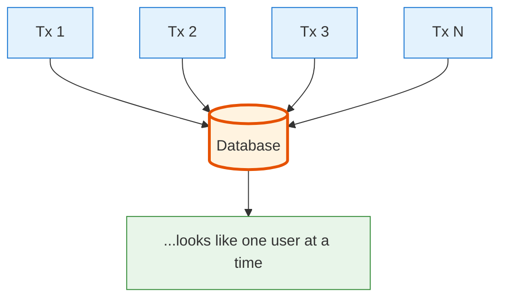
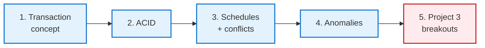
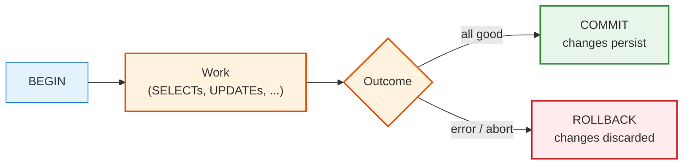
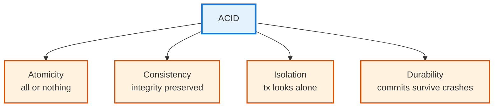
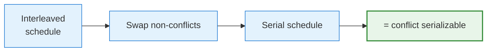
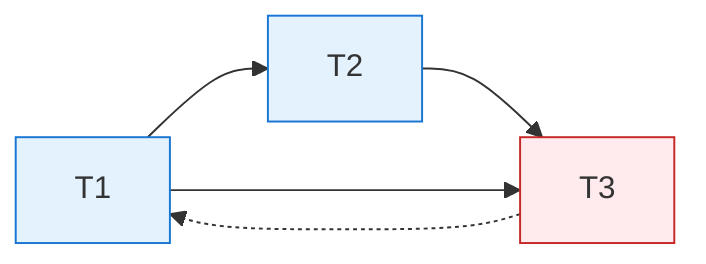
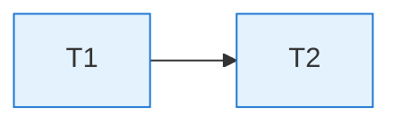
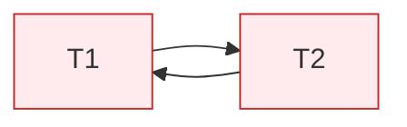
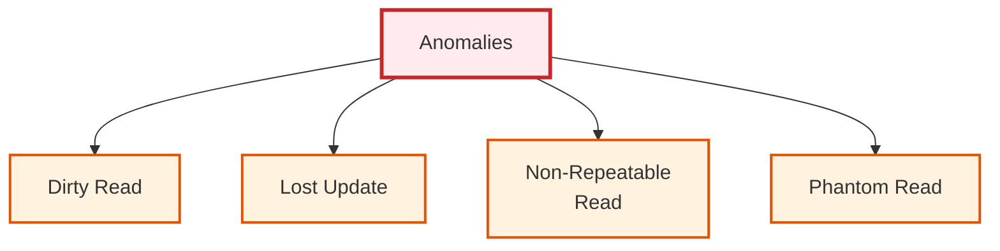

<!-- _class: lead -->

# Day 35: Transactions and ACID

**COP 5725 - Database Management Systems**
Monday, November 16, 2026

Multiple things happening at once, without anyone noticing

<!--
Section 6 opens. Today is the conceptual introduction; Friday is the algorithmic answer (2PL). Pace 40 min lecture + 10 min Project 3 breakouts. Acknowledge Exam 2 in two days.
-->

---

# Recap

<div class="columns-left-wide">
<div>

Sections 1-5 treated queries as if each ran alone against the database. Real systems run hundreds or thousands of transactions against the same tables at once.

Day 3 introduced transactions and ACID at the definition level. Section 6 develops the theory and the enforcement machinery.

Today covers the contract (ACID) and serializability. Friday covers the enforcement algorithm (2PL). Week 16 covers MVCC and recovery.

</div>
<div>



</div>
</div>

---

# Today's Roadmap



Reference: Textbook §18.1-18.2, p. 884-895 (schedules and conflict-serializability) and §1.2.4, p. 8-9 (ACID); PostgreSQL docs [Ch. 13 Concurrency Control](https://www.postgresql.org/docs/current/mvcc.html).

---

<!-- _class: lead -->

# Part 1: The Transaction Concept

---

# The Bank Transfer

```sql
-- Transfer $100 from Ada's account to Bob's
UPDATE account SET balance = balance - 100 WHERE owner = 'Ada';
UPDATE account SET balance = balance + 100 WHERE owner = 'Bob';
```

What can go wrong?

- Crash between the two UPDATEs → Ada loses $100, Bob never gets it
- Another transaction reads Ada's account *after* the first UPDATE but before the second → sees inconsistent state
- Both transactions race; both UPDATE Ada from the same starting balance → wrong final amount

A transaction packages multiple operations into a unit that **either all happens or none of it does**.

```sql
BEGIN;
  UPDATE account SET balance = balance - 100 WHERE owner = 'Ada';
  UPDATE account SET balance = balance + 100 WHERE owner = 'Bob';
COMMIT;
```

---

# The Transaction Lifecycle



`COMMIT` makes changes permanent.
`ROLLBACK` (or any error) undoes everything.
Until commit, **no other transaction sees the changes**, with caveats that the isolation levels in Part 4 make precise.

---

# Why The Abstraction Matters

Without transactions, programmers would have to write:

- Their own undo log
- Their own concurrency control
- Their own crash-recovery procedure
- Their own consistency-checking code

The transaction abstraction **moves all of that into the database**. Application code declares the boundaries (BEGIN, COMMIT); the database handles the rest.

<!--
The "without transactions you'd have to write it all yourself" framing is the right way to motivate why this section matters. Modern frameworks (Django ORM, ActiveRecord, etc.) hide transactions but still rely on them.
-->

---

<!-- _class: lead -->

# Part 2: ACID

---

# The Four Letters



Coined by Theo Härder and Andreas Reuter (1983), based on Jim Gray's earlier transaction-concept work.

Four properties every transaction must guarantee. The course's working definitions are Textbook §1.2.4, p. 8-9, first seen on Day 3.

---

# Atomicity

> All operations of a transaction succeed, or none do.

If the bank transfer's second UPDATE fails (server crash, constraint violation, anything), the first UPDATE is **undone**.

The database achieves atomicity with:
- **Write-ahead log** (WAL) — records intent before writing
- **Rollback** at error or explicit ROLLBACK

```sql
BEGIN;
UPDATE account SET balance = balance - 100 WHERE owner = 'Ada';
-- imagine the server crashes here
-- On recovery: the WAL says this transaction never committed.
-- The pending change to Ada's row is undone.
```

We see WAL in detail in Week 16.

---

# Consistency

> A transaction takes the database from one valid state to another valid state.

"Valid" is defined by:
- PK and FK constraints
- CHECK constraints
- Triggers
- Application-level invariants

If a transaction would leave the database in an invalid state, it must **abort**.

```sql
-- Constraint: balance >= 0
BEGIN;
UPDATE account SET balance = balance - 1000 WHERE owner = 'Ada';
-- If Ada's balance was 500, the CHECK fails.
-- The whole transaction is aborted.
COMMIT; -- never reached
```

Application-level invariants are the programmer's responsibility. The database handles the declared constraints.

---

# Isolation

> Concurrent transactions appear to execute in **some** sequential order.

If 1000 transactions hit the database at the same time, the result should be the same as if some serialization of those 1000 ran one after another.

There are several **isolation levels** trading safety for performance:

| Level | Allows |
|-------|--------|
| Read Uncommitted | dirty reads (rare in practice) |
| Read Committed (PG default) | non-repeatable reads + phantoms |
| Repeatable Read | phantoms |
| Serializable | nothing |

Reference: [PostgreSQL Ch. 13.2 Transaction Isolation](https://www.postgresql.org/docs/current/transaction-iso.html).

---

# Durability

> Once a transaction commits, its changes survive crashes (power loss, kernel panic, hardware failure).

The database achieves durability with:
- **WAL** (write-ahead log): committed changes are recorded to disk **before** COMMIT returns
- **fsync**: forces the WAL buffer to physical storage
- **Replication** (modern systems): another server holds the changes too

The cost is real:
```sql
SHOW synchronous_commit;     -- on by default
```

Turning `synchronous_commit = off` makes commits faster but risks losing recent committed transactions on crash.

Don't do that on production financial data. Do consider it for high-throughput logging tables.

<!--
The synchronous_commit tradeoff is the classic durability-vs-speed knob. Modern systems often run replicated; the cluster's own redundancy provides durability even if individual nodes don't fsync every commit.
-->

---

<!-- _class: lead -->

# Part 3: Schedules and Conflicts

---

# A Schedule

A **schedule** is an interleaving of operations from multiple transactions.

For transactions T1 (read A, write A) and T2 (read A, write A):

<div class="columns">
<div>

### Serial schedule (T1 then T2)

```
T1: r(A) w(A)
T2:           r(A) w(A)
```

</div>
<div>

### Interleaved schedule

```
T1: r(A)      w(A)
T2:      r(A)      w(A)
```

</div>
</div>

Serial schedules are always correct. Interleaved schedules sometimes corrupt state.

The job of the concurrency control system is to **allow only interleavings that produce the same result as some serial schedule**.

---

# Conflicting Operations

Two operations **conflict** if:
- They are from **different transactions**
- They access the **same data item**
- At least one is a **write**

| Op1 | Op2 | Conflict? |
|-----|-----|-----------|
| r(A) | r(A) | no |
| r(A) | w(A) | yes |
| w(A) | r(A) | yes |
| w(A) | w(A) | yes |
| r(A) | r(B) | no |

Two non-conflicting operations can be swapped without changing the result.

---

# Conflict Serializability

A schedule is **conflict serializable** if you can swap non-conflicting operations to reach **some serial schedule**.



Conflict serializability is the **practical** definition of "looks serial."
It's the property real concurrency-control protocols enforce.

There is a weaker definition called **view serializability** that's harder to check; we skip it. Conflict serializability is enough.

---

# The Conflict Graph

```
Vertices = transactions
Edges = directed, from T_i to T_j if some operation of T_i conflicts with (and precedes) an operation of T_j on the same item
```

A schedule is **conflict serializable iff its conflict graph is acyclic**.
The textbook calls this the precedence graph (§18.2.2, p. 892).



The dashed edge (T3 → T1) creates a cycle. The schedule is **not** conflict serializable. The concurrency-control protocol must prevent this.

---

# Build a Conflict Graph

```
T1: r(A)        w(B)
T2:       w(A)        r(B)
```

Conflicts:
- T1's `r(A)` precedes T2's `w(A)`, so add edge T1 → T2
- T1's `w(B)` precedes T2's `r(B)`, so add edge T1 → T2 again



Single edge, no cycle. The schedule is **conflict serializable**, equivalent to running T1 then T2.

<!--
Walk both conflict pairs slowly. Both point the same direction (T1 before T2), so the graph has one edge and the serial order is T1, T2.
-->

---

# A Conflict Graph with a Cycle

```
T1: r(A)              w(B)
T2:       w(A)  r(B)
```

Conflicts:
- T1's `r(A)` precedes T2's `w(A)`, so add edge T1 → T2
- T2's `r(B)` precedes T1's `w(B)`, so add edge T2 → T1



The two edges form a cycle, so the schedule is **not** conflict serializable. No serial order of T1 and T2 produces the same result.

<!--
Same shape as the previous slide but the B conflict now points the other way. This is the minimal two-transaction cycle; a scheduler must prevent one of the two edges.
-->

---

<!-- _class: lead -->

# Part 4: Anomalies

---

# Four Anomalies



Each is a way that a concurrent execution can produce a result that no serial execution would.

The isolation level determines which anomalies are allowed.

---

# Dirty Read

```
T1: w(A=100)                          [crash, ROLLBACK]
T2:           r(A=100) ... do work on the wrong value
```

T2 sees a value that **was never committed**. When T1 rolls back, T2's work was based on a non-existent state.

**Allowed by:** Read Uncommitted (rare; PostgreSQL doesn't expose this level meaningfully).
**Blocked by:** Read Committed and stricter.

---

# Lost Update

```
T1: r(balance=100)         w(balance=200)
T2:       r(balance=100)              w(balance=150)
```

Both read 100. Both compute new values. T1 writes 200; T2 overwrites with 150.

**T1's update is lost.** The 100→200 step never persists.

A single-statement `UPDATE ... SET balance = balance + 100` avoids this under any PostgreSQL level, because the second writer waits and re-reads the row. A read-modify-write split across statements needs `SELECT ... FOR UPDATE`, or `REPEATABLE READ` (where the second writer aborts with a serialization error).

---

# Non-Repeatable Read

```
T1: r(balance=100) ... do other work ... r(balance=200)
T2:                     w(balance=200) commit
```

T1 reads the same row twice and gets different values.

**Allowed by:** Read Committed (PostgreSQL default).
**Blocked by:** Repeatable Read and stricter.

---

# Phantom Read

```
T1: SELECT count(*) FROM order WHERE customer = 'Ada';  -- returns 3
T2:   INSERT INTO order ... customer = 'Ada' ... commit
T1: SELECT count(*) FROM order WHERE customer = 'Ada';  -- returns 4
```

T1 saw a different set of rows the second time, despite the same query.

**Allowed by:** Read Committed.
**Blocked by:** Repeatable Read (in PostgreSQL via MVCC), and Serializable.

---

# Isolation Levels and Anomalies

| Level | Dirty Read | Lost Update | Non-Repeatable | Phantom |
|-------|-----------|-------------|----------------|---------|
| Read Uncommitted | yes | yes | yes | yes |
| Read Committed | no | yes (across statements) | yes | yes |
| Repeatable Read | no | no | no | (yes in std SQL; **no** in PG) |
| Serializable | no | no | no | no |

PostgreSQL's `REPEATABLE READ` is **stronger than standard SQL**. It uses snapshot isolation, which incidentally blocks phantoms too.

PostgreSQL's `SERIALIZABLE` is the strictest. It implements SSI (Serializable Snapshot Isolation), which catches the few anomalies snapshot isolation alone allows.

<!--
The Read Committed lost-update cell is the subtle one. A single UPDATE statement re-reads the row after the blocking writer commits, so the increment survives; a SELECT-then-UPDATE across statements can still lose the update. That distinction came up on the previous slide.
-->

---

<!-- _class: lead -->

# Part 5: Project 3 Group Breakouts

---

# Project 3 Presentations Today

<div class="columns">
<div>

### Last 15 minutes

- Small breakout groups (5-6 students each)
- Each student presents Project 3 in 3-4 minutes
- Group selects strongest presentation
- **Winners present to full class Friday**

### What to show

- One slow query you found
- The index or restructure that fixed it
- Before/after EXPLAIN with timing

</div>
<div>

### Reminders

- Exam 2 Wednesday Nov 18
- Final Project released Mon Nov 30
- Thanksgiving break Nov 23-28

</div>
</div>

---

# Wrap-up

- A transaction packages operations between BEGIN and COMMIT or ROLLBACK
- ACID names the four guarantees: atomicity, consistency, isolation, durability (Textbook §1.2.4, p. 8-9)
- A schedule interleaves operations; conflict serializability makes it equivalent to some serial order
- An acyclic conflict graph proves a schedule conflict serializable (Textbook §18.2.2, p. 892)
- Dirty reads, lost updates, non-repeatable reads, and phantoms are the four anomaly types
- PostgreSQL's isolation levels decide which anomalies a transaction can observe

Friday covers enforcement by locking (2PL). Reading: Textbook §18.3, p. 897.

<!--
Single flat takeaway list. The conflict-graph line and the isolation-level table are the two exam-relevant pieces.
-->

---

# Exam 2 Wednesday

<div class="columns">
<div>

### Covers
Sections 4-5: storage, indexing, sorting, joins, iterator/vectorized execution, RA equivalences, cost estimation, the Selinger optimizer, Leis 2015.

### Format
50 minutes. Closed notes. Bring a pen.

</div>
<div>

### Last preparation
- Practice packet from Friday Nov 13
- Office hours Tuesday afternoon
- Review materials in `practice-exams/exam2.md`

</div>
</div>

Bring caffeine. Be on time. The exam starts at 8:30 sharp.

---

# Practice Before Wednesday

- Take a simple transaction in your project (e.g., insert a row, update a related row). Run it with `BEGIN; ... ROLLBACK;`. Verify nothing persists.
- Work the Exam 2 practice packet, especially problems on cost estimation and join algorithms.

Push to your `cop5725fa26-project` repo before 8:30 AM Wed Nov 18.

---

# Questions

What is on your mind?

Exam 2 Wednesday. Project 3 winners Friday.

<!--
Common Day 35 questions: "Is the bank transfer the only kind of transaction?" (No, but it's the canonical example. Real transactions are anything that should be all-or-nothing.) "Why does PostgreSQL default to READ COMMITTED?" (Performance — strict isolation costs throughput. Apps that need stronger guarantees opt in via SET TRANSACTION.)
-->
