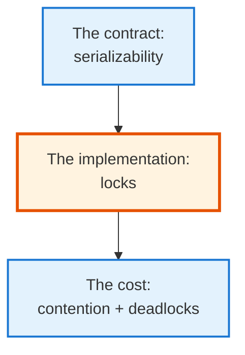
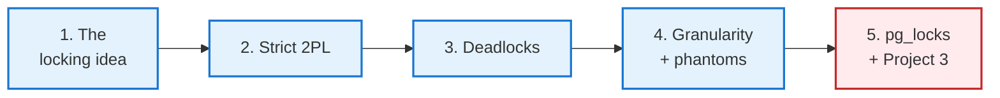
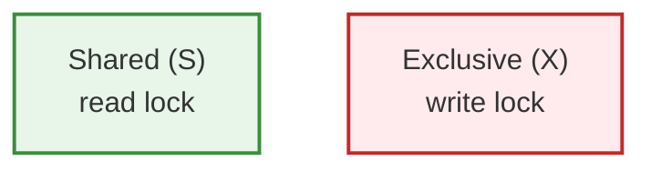
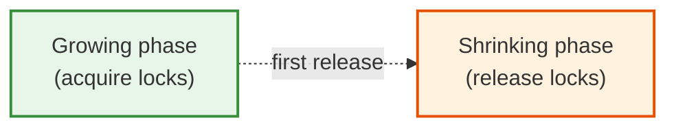
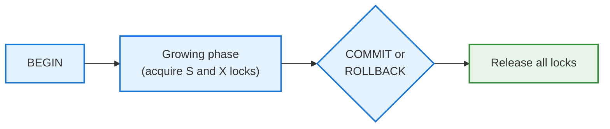
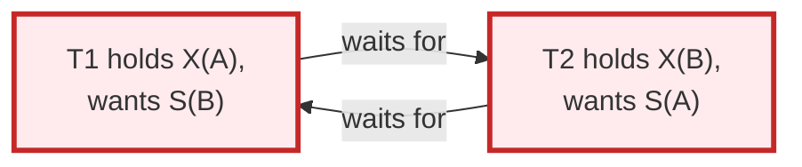
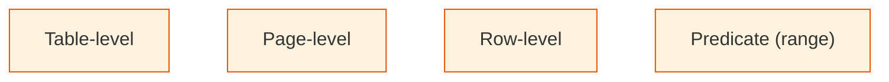
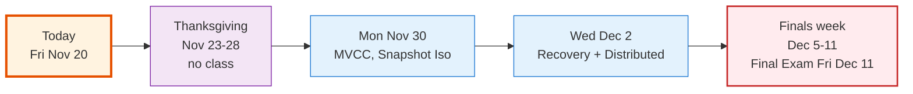

<!-- _class: lead -->

# Day 37: Two-Phase Locking

**COP 5725 - Database Management Systems**
Friday, November 20, 2026

The algorithm that enforces serializability

<!--
Day after Exam 2. Acknowledge it briefly; grades back next Monday. Last 10 min reserved for Project 3 winners presenting. Pace 40 min for lecture.
-->

---

# Recap

<div class="columns-left-wide">
<div>

Monday covered ACID, the contract between the database and the application. Today covers how the database keeps that contract.

The classical answer is **two-phase locking** (Eswaran et al., 1976). PostgreSQL uses a variant of it, and MVCC (Monday) builds on the same foundations.

</div>
<div>



</div>
</div>

---

# Today's Roadmap



Reference: Textbook §18.3, p. 897 (2PL), §18.4, p. 905 (lock modes), §18.6.3, p. 926 (phantoms), §19.2, p. 966 (deadlocks); PostgreSQL docs [Ch. 13.3 Explicit Locking](https://www.postgresql.org/docs/current/explicit-locking.html).

---

<!-- _class: lead -->

# Part 1: The Locking Idea

---

# A Simple Locking Protocol

The simplest concurrency-control protocol:

1. Before a transaction reads or writes an item, it **acquires a lock**.
2. The database holds the lock for the duration of the transaction.
3. Other transactions trying to lock the same item **wait**.
4. When the transaction commits or rolls back, the lock is released.

Only transactions that actually conflict wait. Non-conflicting transactions run in parallel.

---

# Shared vs Exclusive Locks



**Shared lock (S):** multiple transactions can hold it simultaneously. Many readers in parallel.

**Exclusive lock (X):** only one transaction. No other reader or writer <span class="cite">(Textbook §18.4.1, p. 905)</span>.

| You want → | with S held | with X held |
|------------|-------------|-------------|
| **S** | OK | wait |
| **X** | wait | wait |

The compatibility matrix <span class="cite">(Textbook §18.4.2, p. 907)</span>. Two readers don't block each other. A writer blocks everyone.

---

# Why Early Release Fails

Suppose T1 releases its lock on A as soon as it finishes reading, and T2 writes both A and B in the gap:

<table>
<thead><tr><th></th><th>t1</th><th>t2</th><th>t3</th><th>t4</th><th>t5</th></tr></thead>
<tbody>
<tr><td>T1</td><td style="background:#F8BBD0">lock-S(A), r(A)</td><td style="background:#F8BBD0">unlock(A)</td><td></td><td></td><td style="background:#F8BBD0">lock-X(B), w(B)</td></tr>
<tr><td>T2</td><td></td><td></td><td style="background:#90CAF9">lock-X(A), w(A)</td><td style="background:#90CAF9">lock-X(B), w(B), commit, unlock</td><td></td></tr>
</tbody>
</table>

Pink cells are T1's operations and blue cells are T2's; time runs left to right.

The conflict graph has an edge T1 → T2 on A (T1 read before T2 wrote) and an edge T2 → T1 on B (T2 wrote before T1 wrote). That cycle means the schedule matches **no** serial order.

The fix is to finish all acquiring before the first release. That rule is **two-phase locking**.

<!--
This is the classic motivation for the two-phase rule. Point back to Monday's conflict-graph test: locking alone did not prevent the cycle because T1 released A too early.
-->

---

<!-- _class: lead -->

# Part 2: Strict Two-Phase Locking

---

# The Two-Phase Rule

A transaction has two phases:



**Growing phase:** acquire locks freely. Never release.
**Shrinking phase:** release locks freely. Never acquire.

Once you've released your first lock, you can no longer acquire any. The transaction has crossed into the shrinking phase.

**Theorem:** any schedule produced by 2PL transactions is conflict serializable.

<span class="cite">Textbook §18.3.3, p. 900; the argument for why 2PL works is §18.3.4, p. 901.</span>

---

# Strict 2PL

Plain 2PL allows releasing locks before commit. Most databases use **strict 2PL**:

> Hold all locks until commit (or rollback). Release them all at once at the end.



Strict 2PL guarantees:
- **Serializability** — no conflict cycles possible
- **Recoverability** — committed transactions don't depend on uncommitted ones
- **Cascadeless** — no cascading rollbacks

PostgreSQL uses a strict-2PL-like mechanism alongside MVCC.

---

# Strict 2PL: Example

Two transactions:
- T1: read A, write B
- T2: read A, write A

<table>
<thead><tr><th></th><th>t1</th><th>t2</th><th>t3</th><th>t4</th></tr></thead>
<tbody>
<tr><td>T1</td><td style="background:#F8BBD0">lock-S(A), r(A)</td><td style="background:#F8BBD0">lock-X(B), w(B)</td><td style="background:#F8BBD0">COMMIT, release all</td><td></td></tr>
<tr><td>T2</td><td></td><td style="background:#FFE082">lock-X(A) → blocked</td><td style="background:#FFE082">blocked on S(A)</td><td style="background:#90CAF9">lock-X(A), r(A), w(A), COMMIT, release</td></tr>
</tbody>
</table>

<div class="small">

Pink cells are T1's operations and blue cells are T2's; amber marks the time T2 spends blocked on A.

</div>

T2 was blocked until T1 finished. The final result is equivalent to running T1, then T2.

PostgreSQL enforces this pattern for row writes. Monday's MVCC lecture covers how reads avoid taking these locks.

<!--
Strict 2PL is what students experience whenever a query hangs waiting for another query's transaction to finish. The "lock waits" they will see in pg_stat_activity are this protocol in action.
-->

---

<!-- _class: lead -->

# Part 3: Deadlocks

---

# The Wait-For Graph

When transactions wait on each other's locks, we form a wait-for graph:



T1 waits on T2; T2 waits on T1. Neither can proceed.

This is a **deadlock**. Without intervention, both transactions block forever.

<span class="cite">Textbook §19.2.2, p. 967 develops the waits-for graph.</span>

---

# Detection vs Prevention

Three strategies:

<div class="columns-3">
<div>

### Detection

Periodically build the wait-for graph. Look for cycles. Abort one transaction to break the cycle.

PostgreSQL's choice (every `deadlock_timeout` ms).

</div>
<div>

### Prevention

Order all locks; require transactions to acquire in that order. Cycles cannot form.

Hard to enforce; rare in practice.

</div>
<div>

### Timeout

Each lock wait has a timeout. If you wait too long, you're aborted.

Crude. Often combined with detection.

</div>
</div>

---

# PostgreSQL's Deadlock Handling

```sql
SHOW deadlock_timeout;   -- 1s by default
```

Every 1 second (by default), PostgreSQL checks for deadlocks:

1. Build the wait-for graph
2. Detect any cycle
3. Pick a **victim** (the cheapest transaction to abort)
4. Cancel that transaction with an error

```
ERROR:  deadlock detected
DETAIL:  Process 1234 waits for ShareLock on transaction 567; blocked by process 890.
        Process 890 waits for ShareLock on transaction 234; blocked by process 1234.
HINT:  See server log for query details.
```

The application sees an error; the application retries. Most ORMs and frameworks do this automatically.

---

# How to Avoid Deadlocks in Your Code

```sql
-- Always update accounts in the same order
BEGIN;
UPDATE account SET balance = balance - 100 WHERE id = LEAST(:from_id, :to_id);
UPDATE account SET balance = balance + 100 WHERE id = GREATEST(:from_id, :to_id);
COMMIT;
```

Every transaction acquires locks in **the same global order**, here by `id` ascending.

If T1 transfers $100 from Ada (id=1) to Bob (id=5), and T2 transfers $50 from Bob (id=5) to Ada (id=1), both lock account 1 first, then account 5. No cycle.

In practice, most deadlocks arise on hot-spot tables (queues, counters, sequences). Ordering plus retrying covers most cases.

---

<!-- _class: lead -->

# Part 4: Granularity and Phantoms

---

# Lock Granularity



**Coarse** locks (table-level) cost little bookkeeping and cause high contention.
**Fine** locks (row-level) cost more bookkeeping and cause low contention.

<div class="small">

Contention is transactions waiting on each other's locks for the same items.

</div>

PostgreSQL uses **row-level** locks by default plus **table-level** locks for DDL. It does *not* use page-level locks the way SQL Server does for some operations.

<span class="cite">Textbook §18.6, p. 921 covers lock hierarchies.</span>

---

# The Phantom Problem

```
T1: SELECT count(*) FROM order WHERE customer = 'Ada';  -- locks rows currently matching
T2: INSERT INTO order ... WHERE customer = 'Ada';
T1: SELECT count(*) FROM order WHERE customer = 'Ada';  -- gets different count
```

T2's new row never existed when T1 took its locks. Row locks **cannot lock rows that don't exist**.

**Predicate locks** fix this by locking the *predicate* itself, so an insert matching the predicate must wait.

Predicate locking is expensive and few engines implement it fully. PostgreSQL's `SERIALIZABLE` level uses **Serializable Snapshot Isolation** (SSI) to detect this case after the fact.

<span class="cite">Textbook §18.6.3, p. 926 treats phantoms and insertions.</span>

---

# PostgreSQL's SERIALIZABLE = SSI

PostgreSQL's `SERIALIZABLE` isolation level is based on Snapshot Isolation plus **conflict tracking**.

SSI lets transactions proceed and **aborts one** when an unsafe serialization would result, instead of blocking to prevent phantoms up front.

```sql
ERROR:  could not serialize access due to read/write dependencies among transactions
HINT:   The transaction might succeed if retried.
```

Same retry pattern as deadlock. The application catches and retries.

Reference: [PostgreSQL Ch. 13.2.3 Serializable Isolation Level](https://www.postgresql.org/docs/current/transaction-iso.html#XACT-SERIALIZABLE).

---

<!-- _class: lead -->

# Part 5: pg_locks and Project 3 Winners

---

# Observing Locks in PostgreSQL

```sql
-- All current locks
SELECT
  l.locktype, l.relation::regclass, l.mode, l.granted,
  a.query, a.state, a.pid
FROM pg_locks l
JOIN pg_stat_activity a USING (pid)
WHERE NOT l.granted    -- only blocked locks
ORDER BY a.query_start;
```

This query shows you who is **waiting** for what.

For finding **who is blocking whom**:

```sql
SELECT
  blocked.pid AS blocked_pid,
  blocking.pid AS blocking_pid,
  blocked.query AS blocked_query,
  blocking.query AS blocking_query
FROM pg_stat_activity blocked
JOIN pg_stat_activity blocking
  ON blocking.pid = ANY(pg_blocking_pids(blocked.pid));
```

These two queries are the starting point for lock diagnosis on a live system.

<!--
pg_blocking_pids(pid) returns the set of backends blocking the given pid; joining it back to pg_stat_activity pairs each blocked query with its blocker. Demo live if two psql sessions are already open from the earlier example.
-->

---

# When Production Locks Get Stuck

A common scenario:

1. A long-running transaction holds locks
2. Hundreds of short transactions queue up waiting
3. The application appears "slow" but is actually waiting
4. The queue lengthens; throughput collapses

Diagnose with the previous queries.
Fix: cancel the long transaction, or restructure the application to break the long transaction into smaller pieces.

The Project 3 deliverable encouraged you to look at locks at least once. The query above is the starting point.

---

# Project 3 Winners

<div class="columns">
<div>

### Last 10 minutes

- 4-5 winners from Monday's breakouts present
- 3-4 minutes each
- Class votes overall winner

</div>
<div>

### What we look for

- Honest before/after EXPLAIN
- A clear hypothesis tested
- A surprising or beautiful result

</div>
</div>

The Final Project released Mon Nov 16 and is due Wed Dec 9. The capstone is graded heavily; start thinking about scope now.

---

# Wrap-up

- Shared locks allow parallel readers; exclusive locks admit one writer
- Two-phase locking separates a growing phase from a shrinking phase and guarantees conflict serializability <span class="cite">(Textbook §18.3, p. 897)</span>
- Strict 2PL holds every lock until commit, which adds recoverability and cascadeless aborts
- Deadlocks appear as cycles in the waits-for graph; PostgreSQL detects them and aborts a victim
- Acquiring locks in a global order prevents deadlocks in application code
- Row locks cannot cover phantoms; PostgreSQL's SERIALIZABLE uses SSI instead of predicate locks
- `pg_locks` and `pg_blocking_pids` diagnose lock waits on a live system

<!--
Single flat takeaway list, one line per part. The 2PL theorem and the waits-for cycle are the exam anchors.
-->

---

# Looking Ahead



Monday covers MVCC and snapshot isolation. Reading: PostgreSQL docs [Ch. 13 Concurrency Control](https://www.postgresql.org/docs/current/mvcc.html).

---

# Practice Over Thanksgiving

Two light exercises in your project repo:

- Open two psql sessions. In one, run `BEGIN; UPDATE student SET gpa = gpa + 0.01 WHERE sid = 1;`. In the other, run `UPDATE student SET gpa = gpa + 0.02 WHERE sid = 1;`. Observe the second blocks. Commit the first. Observe the second proceeds.
- While the lock waits, run the `pg_locks` query and capture the output.

This is an exercise.

---

# Questions

What is on your mind?

Final Project due Wed Dec 9. Have a good Thanksgiving.

<!--
Common Day 37 questions: "Does PostgreSQL really use 2PL?" (Yes for some operations; MVCC handles most read-write conflicts. The whole story is a hybrid covered on Day 38.) "How do I know if a query is waiting on a lock?" (pg_stat_activity.wait_event_type = 'Lock'.) "Can I avoid locks entirely?" (No, but MVCC means most reads don't take row locks at all — Day 38 explains.)
-->
