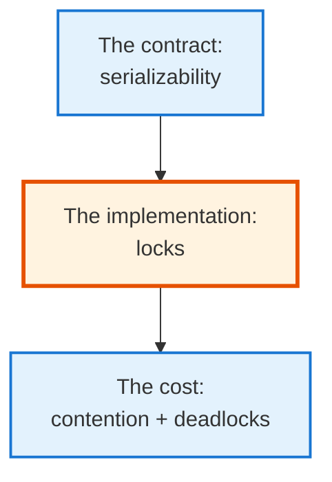
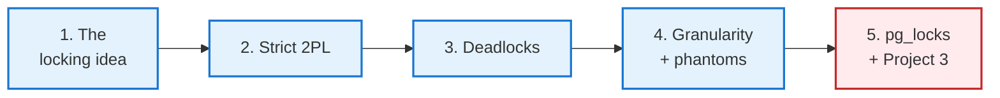
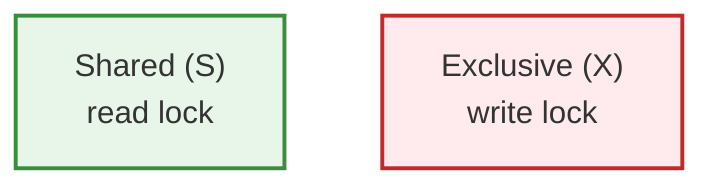
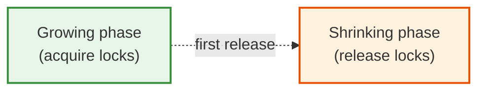
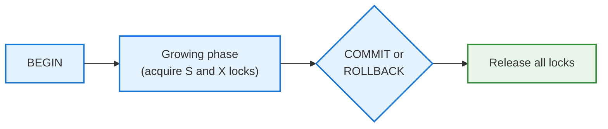
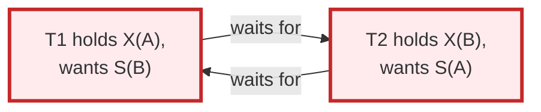
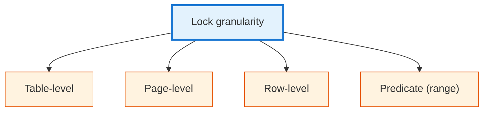
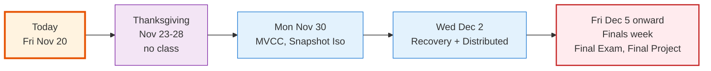

<!-- _class: lead -->

# Day 37: Two-Phase Locking

**COP 5725 - Database Management**
Friday, November 20, 2026

The algorithm that enforces serializability

<!--
Day after Exam 2. Acknowledge it briefly; grades back next Monday. Last 10 min reserved for Project 3 winners presenting. Pace 40 min for lecture.
-->

---

# Where We Are

<div class="columns-left-wide">
<div>

Monday: ACID. The **contract** between the database and the application.

Today: how the database actually keeps that contract.

The classical answer is **two-phase locking** (Eswaran et al., 1976). PostgreSQL uses a variant of it; MVCC (Monday) builds on the same foundations.

By the end of the hour: you can predict when two transactions block each other, why deadlocks happen, and how PostgreSQL detects and resolves them.

</div>
<div>



</div>
</div>

---

# Today's Roadmap



Reference: GMW Ch. 18.4-18.5; PostgreSQL docs [Ch. 13.3 Explicit Locking](https://www.postgresql.org/docs/current/explicit-locking.html).

---

<!-- _class: lead -->

# Part 1: The Locking Idea

---

# Hand the Resource Out, One at a Time

The simplest concurrency-control protocol:

1. Before a transaction reads or writes an item, it **acquires a lock**.
2. The database holds the lock for the duration of the transaction.
3. Other transactions trying to lock the same item **wait**.
4. When the transaction commits or rolls back, the lock is released.

This is **strict serial execution**, just enforced lazily — only transactions that actually conflict wait.

---

# Shared vs Exclusive Locks



**Shared lock (S):** multiple transactions can hold it simultaneously. Many readers in parallel.

**Exclusive lock (X):** only one transaction. No other reader or writer.

| You want → | with S held | with X held |
|------------|-------------|-------------|
| **S** | OK | wait |
| **X** | wait | wait |

The compatibility matrix. Two readers don't block each other. A writer blocks everyone.

---

# Why Acquire-and-Hold Is Not Enough

Consider:

```
T1: lock-S(A), r(A), unlock(A), lock-X(B), w(B)
T2:                  lock-X(A), w(A),     unlock(A)
```

T1 releases A, then T2 writes A. Now T1 still has B to lock.

But this schedule is **not** equivalent to T1 then T2 nor to T2 then T1. T1 read the old A; T2 wrote a new A; T1 then writes B. A third transaction observing B and A together sees inconsistent state.

The fix: **don't release locks until after you've finished acquiring everything**.

That's two-phase locking.

---

<!-- _class: lead -->

# Part 2: Strict Two-Phase Locking

---

# The Two-Phase Rule

A transaction has two phases:



**Growing phase:** acquire locks freely. Never release.
**Shrinking phase:** release locks freely. Never acquire.

Once you've released your first lock, you can no longer acquire any. The transaction has crossed into the shrinking phase.

**Theorem:** any schedule produced by 2PL transactions is conflict serializable.

---

# Strict 2PL

Plain 2PL allows releasing locks before commit. Most databases use **strict 2PL**:

> Hold all locks until commit (or rollback). Release them all at once at the end.



Strict 2PL guarantees:
- **Serializability** — no conflict cycles possible
- **Recoverability** — committed transactions don't depend on uncommitted ones
- **Cascadeless** — no cascading rollbacks

PostgreSQL uses a strict-2PL-like mechanism alongside MVCC.

---

# A Worked Example

Two transactions:
- T1: read A, write B
- T2: read A, write A

```
T1: lock-S(A), r(A), lock-X(B), w(B), COMMIT, release S(A), release X(B)
T2:               lock-X(A) [wait for T1 to release S(A)]
T2:                                  ... T1 commits, T2 wakes up
T2:                                  lock-X(A), r(A), w(A), COMMIT, release
```

T2 was blocked until T1 finished. The final result is equivalent to running T1, then T2.

This is exactly what `BEGIN ... COMMIT;` blocks of yours have been doing in PostgreSQL all semester.

<!--
Strict 2PL is what students experience whenever a query hangs waiting for another query's transaction to finish. The "lock waits" they will see in pg_stat_activity are this protocol in action.
-->

---

<!-- _class: lead -->

# Part 3: Deadlocks

---

# The Wait-For Graph

When transactions wait on each other's locks, we form a wait-for graph:



T1 waits on T2; T2 waits on T1. Neither can proceed.

This is a **deadlock**. Without intervention, both transactions block forever.

---

# Detection vs Prevention

Three strategies:

<div class="columns-3">
<div>

### Detection

Periodically build the wait-for graph. Look for cycles. Abort one transaction to break the cycle.

PostgreSQL's choice (every `deadlock_timeout` ms).

</div>
<div>

### Prevention

Order all locks; require transactions to acquire in that order. Cycles cannot form.

Hard to enforce; rare in practice.

</div>
<div>

### Timeout

Each lock wait has a timeout. If you wait too long, you're aborted.

Crude. Often combined with detection.

</div>
</div>

---

# PostgreSQL's Deadlock Handling

```sql
SHOW deadlock_timeout;   -- 1s by default
```

Every 1 second (by default), PostgreSQL checks for deadlocks:

1. Build the wait-for graph
2. Detect any cycle
3. Pick a **victim** (the cheapest transaction to abort)
4. Cancel that transaction with an error

```
ERROR:  deadlock detected
DETAIL:  Process 1234 waits for ShareLock on transaction 567; blocked by process 890.
        Process 890 waits for ShareLock on transaction 234; blocked by process 1234.
HINT:  See server log for query details.
```

The application sees an error; the application retries. Most ORMs and frameworks do this automatically.

---

# How to Avoid Deadlocks in Your Code

```sql
-- Always update accounts in the same order
BEGIN;
UPDATE account SET balance = balance - 100 WHERE id = LEAST(:from_id, :to_id);
UPDATE account SET balance = balance + 100 WHERE id = GREATEST(:from_id, :to_id);
COMMIT;
```

The trick: every transaction acquires locks in **the same global order** (here, by `id` ascending).

If T1 transfers $100 from Ada (id=1) to Bob (id=5), and T2 transfers $50 from Bob (id=5) to Ada (id=1), both lock account 1 first, then account 5. No cycle.

In practice, hot-spot tables (queues, counters, sequences) are the deadlock breeders. Ordering plus retrying covers most cases.

---

<!-- _class: lead -->

# Part 4: Granularity and Phantoms

---

# What Should We Lock?



**Coarse** locks (table) → low overhead per lock, high contention.
**Fine** locks (row) → high overhead per lock, low contention.

PostgreSQL uses **row-level** locks by default plus **table-level** locks for DDL. It does *not* use page-level locks like SQL Server does for some operations.

---

# The Phantom Problem

```
T1: SELECT count(*) FROM order WHERE customer = 'Ada';  -- locks rows currently matching
T2: INSERT INTO order ... WHERE customer = 'Ada';
T1: SELECT count(*) FROM order WHERE customer = 'Ada';  -- gets different count
```

T2's new row never existed when T1 took its locks. Row locks **cannot lock rows that don't exist**.

The fix: **predicate locks** — lock the *predicate* itself, so T2's insert that matches the predicate must wait.

This is expensive. Most engines don't fully implement predicate locking. PostgreSQL's `SERIALIZABLE` level uses **Serializable Snapshot Isolation** (SSI) to detect this case after the fact.

---

# PostgreSQL's SERIALIZABLE = SSI

PostgreSQL's `SERIALIZABLE` isolation level is based on Snapshot Isolation plus **conflict tracking**.

Rather than block transactions to prevent phantoms, SSI lets them proceed and **aborts one** when an unsafe serialization would result.

```sql
ERROR:  could not serialize access due to read/write dependencies among transactions
HINT:   The transaction might succeed if retried.
```

Same retry pattern as deadlock. The application catches and retries.

Reference: [PostgreSQL Ch. 13.2.3 Serializable Isolation Level](https://www.postgresql.org/docs/current/transaction-iso.html#XACT-SERIALIZABLE).

---

<!-- _class: lead -->

# Part 5: pg_locks and Project 3 Winners

---

# Observing Locks in PostgreSQL

```sql
-- All current locks
SELECT
  l.locktype, l.relation::regclass, l.mode, l.granted,
  a.query, a.state, a.pid
FROM pg_locks l
JOIN pg_stat_activity a USING (pid)
WHERE NOT l.granted    -- only blocked locks
ORDER BY a.query_start;
```

This query shows you who is **waiting** for what.

For finding **who is blocking whom**:

```sql
SELECT
  blocked.pid AS blocked_pid,
  blocking.pid AS blocking_pid,
  blocked.query AS blocked_query,
  blocking.query AS blocking_query
FROM pg_stat_activity blocked
JOIN pg_stat_activity blocking ON blocked.wait_event_type = 'Lock'
WHERE blocked.wait_event = 'transactionid';
```

This is one of the most useful queries in a DBA's pocket.

---

# When Production Locks Get Stuck

A common scenario:

1. A long-running transaction holds locks
2. Hundreds of short transactions queue up waiting
3. The application appears "slow" but is actually waiting
4. The queue lengthens; throughput collapses

Diagnose with the previous queries.
Fix: cancel the long transaction, or restructure the application to break the long transaction into smaller pieces.

The Project 3 deliverable encouraged you to look at locks at least once. The query above is the starting point.

---

# Project 3 Winners

<div class="columns">
<div>

### Last 10 minutes

- 4-5 winners from Monday's breakouts present
- 3-4 minutes each
- Class votes overall winner

</div>
<div>

### What we look for

- Honest before/after EXPLAIN
- A clear hypothesis tested
- A surprising or beautiful result

</div>
</div>

Final Project releases Monday Nov 30. Capstone is graded heavily; start thinking about scope now.

---

# Wrap-up

You now have:

<div class="columns">
<div>

- Shared and exclusive locks
- Strict 2PL: hold all locks until commit
- Deadlocks via wait-for graphs
- PostgreSQL's deadlock detection and victim selection

</div>
<div>

- Lock granularity tradeoffs
- The phantom problem and predicate locks
- PostgreSQL's SERIALIZABLE = SSI
- `pg_locks` for production diagnosis

</div>
</div>

---

# Looking Ahead



Two more lectures. One final exam.

---

# Practice Over Thanksgiving

Two exercises in your project repo (light, you've earned a break):

1. Open two psql sessions. In one: `BEGIN; UPDATE student SET gpa = gpa + 0.01 WHERE sid = 1;`. In the other: `UPDATE student SET gpa = gpa + 0.02 WHERE sid = 1;`. Observe the second blocks. Commit the first. Observe the second proceeds.
2. While the lock waits, run the `pg_locks` query and capture the output.

Push to your `cop5725fa26-project` repo before 8:30 AM Mon Nov 30.

---

# Questions

What is on your mind?

Final Project releases Mon Nov 30. Have a good Thanksgiving.

<!--
Common Day 37 questions: "Does PostgreSQL really use 2PL?" (Yes for some operations; MVCC handles most read-write conflicts. The whole story is a hybrid covered on Day 38.) "How do I know if a query is waiting on a lock?" (pg_stat_activity.wait_event_type = 'Lock'.) "Can I avoid locks entirely?" (No, but MVCC means most reads don't take row locks at all — Day 38 explains.)
-->
