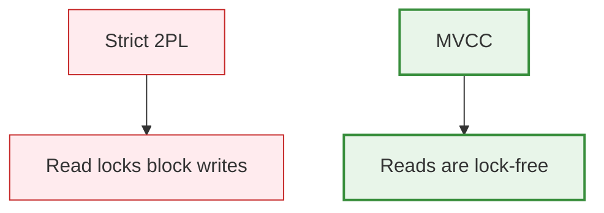
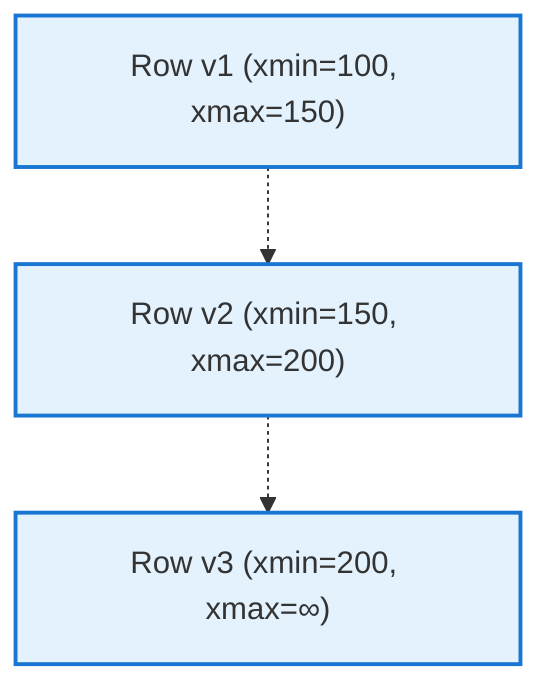
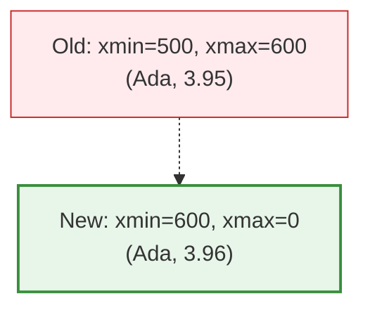
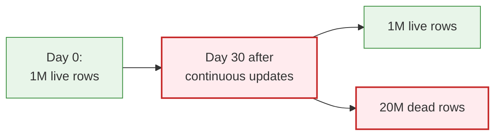

<!-- _class: lead -->

# Day 38: MVCC and Snapshot Isolation

**COP 5725 - Database Management Systems**
Monday, November 30, 2026

How PostgreSQL runs thousands of concurrent transactions without locking every read

<!--
First class after Thanksgiving. Energy is mixed; some students are present-mode, others are already mentally on the final. Anchor on the practical: every Postgres they will ever touch uses MVCC. Pace 50 min.
-->

---

# Where We Are

<div class="columns-left-wide">
<div>

Friday's two-phase locking gives the **correct** answer to concurrency. It also gives the **slow** answer for read-heavy workloads.

In a system where 1000 readers and 10 writers all hit the same hot rows, strict 2PL turns the readers into a long blocking queue.

PostgreSQL (and most modern engines) solve this with **multi-version concurrency control** — MVCC.

The promise: **readers never block writers, writers never block readers**.

</div>
<div>



</div>
</div>

---

# Today's Roadmap


Reference: PostgreSQL docs [Ch. 13.1 Introduction (MVCC)](https://www.postgresql.org/docs/current/mvcc-intro.html), [Ch. 25.1 Routine Vacuuming](https://www.postgresql.org/docs/current/routine-vacuuming.html).

---

<!-- _class: lead -->

# Part 1: Why MVCC

---

# The Locking Problem (Recap)

In strict 2PL:

- A read takes a shared lock
- A write takes an exclusive lock
- An exclusive lock blocks shared locks

In a high-concurrency workload, this means:

- A single writer can stall hundreds of readers
- Long-running readers (analytical queries) block all writes
- Throughput collapses under load

MVCC's bet: keep **multiple versions** of each row, so a reader can always find a usable version without waiting for a writer.

---

# The Big Idea: Versions



Each logical row may have **many physical versions** on disk, linked together by transaction IDs.

A reader at transaction time `T` sees the version where `xmin ≤ T < xmax`.

Multiple readers and one writer can coexist: the writer creates a new version; readers continue seeing the old.

---

<!-- _class: lead -->

# Part 2: The Mechanics

---

# Transaction IDs (XIDs)

Every transaction in PostgreSQL gets a **monotonically increasing 32-bit number**:

```sql
BEGIN;
SELECT txid_current();   -- e.g., 12345
```

XIDs are the time coordinate of MVCC. Every row version is stamped with the XIDs that **created** and **deleted** it.

Reference: [PostgreSQL Ch. 73.5 HeapTupleHeaderData](https://www.postgresql.org/docs/current/storage-page-layout.html#STORAGE-TUPLE-LAYOUT).

---

# xmin and xmax

Every tuple in PostgreSQL has:

- **`xmin`** — XID of the transaction that **created** this version
- **`xmax`** — XID of the transaction that **deleted** this version (0 if still alive)

```sql
-- See them yourself
SELECT xmin, xmax, * FROM student LIMIT 5;
```

```
 xmin | xmax | sid | name | gpa
------+------+-----+------+-----
  500 |    0 |   1 | Ada  | 3.95
  500 |    0 |   2 | Bob  | 2.90
  500 |    0 |   3 | Chia | 3.70
```

A row with `xmax = 0` is alive. A row with both `xmin` and `xmax` set is **dead** (but still on disk until VACUUM cleans it).

---

# UPDATE = INSERT + DELETE (Logically)

```sql
UPDATE student SET gpa = 3.96 WHERE sid = 1;
```

PostgreSQL doesn't modify the existing tuple. It:

1. Writes a **new** tuple (Ada, gpa=3.96) with `xmin = current_xid`
2. Updates the **old** tuple's `xmax` to `current_xid`



Both rows exist on disk until VACUUM removes the dead one.

This is why PostgreSQL `UPDATE` is sometimes slower than a row-store update in MySQL InnoDB: PG creates a new version every time.

---

# Visibility Rule

A transaction sees a tuple if:

```
tuple.xmin < snapshot_xid
AND (tuple.xmax = 0 OR tuple.xmax >= snapshot_xid)
AND tuple.xmin's transaction is committed
AND tuple.xmax's transaction is NOT committed at snapshot time
```

In English: "the row was created before my snapshot started, and either still alive or only deleted after my snapshot started."

This rule alone is the heart of MVCC. Implement it correctly and you have lock-free reads.

<!--
The visibility rule is the textbook version. PostgreSQL's actual implementation has more edge cases (subtransactions, COMMIT vs ABORT detection, etc.) but the core idea is exactly this.
-->

---

# A Concurrent Read-Write Story

```
Time   Tx 1 (snapshot at T=100)       Tx 2 (start at T=110)
─────  ────────────────────────────   ────────────────────────────
100    BEGIN
101    SELECT gpa FROM student         (snapshot xid = 100)
       WHERE sid = 1
       → 3.95
102                                    BEGIN (xid = 110)
103                                    UPDATE student SET gpa = 3.96 WHERE sid = 1
104                                       (old row: xmax = 110; new row: xmin = 110)
105                                    COMMIT
106    SELECT gpa FROM student
       WHERE sid = 1
       → 3.95   ← still sees old value!
107    COMMIT
```

Tx1 keeps seeing 3.95 even after Tx2 commits. Tx1's snapshot was at xid=100; the new row's xmin is 110, which is **>=** Tx1's snapshot. Invisible.

This is the **repeatable read** behavior, achieved without locking.

---

<!-- _class: lead -->

# Part 3: VACUUM and Bloat

---

# Dead Tuples Add Up

Without VACUUM:



After a month of updates, a table can have **20× more dead tuples than live ones**. Sequential scans pay for them. Indexes point to them.

This is **bloat**. The classic PostgreSQL operational problem.

---

# VACUUM Mechanics

```sql
-- Manual vacuum
VACUUM student;          -- mark space reusable
VACUUM FULL student;     -- compact, requires exclusive lock
VACUUM ANALYZE student;  -- vacuum + refresh stats
```

`VACUUM`:
- Scans the table
- Finds dead tuples
- Marks their space **reusable** by future inserts
- Updates the visibility map

`VACUUM FULL`:
- Rewrites the entire table to a new file
- Reclaims disk space (returns it to the OS)
- Takes an `ACCESS EXCLUSIVE` lock — blocks everything

Normal `VACUUM` is online; `VACUUM FULL` is downtime.

---

# autovacuum

```sql
SHOW autovacuum;
```

PostgreSQL runs `autovacuum` in the background. It wakes periodically, checks per-table stats, and runs VACUUM when needed.

Tuning parameters:

```sql
ALTER TABLE busy_table SET (
  autovacuum_vacuum_scale_factor = 0.05,    -- vacuum when 5% dead (default 20%)
  autovacuum_analyze_scale_factor = 0.02
);
```

For tables with high update churn, more aggressive thresholds prevent bloat.
For static tables, weaker thresholds save CPU.

Reference: [PostgreSQL Ch. 25.1.6 The Autovacuum Daemon](https://www.postgresql.org/docs/current/routine-vacuuming.html#AUTOVACUUM).

<!--
"VACUUM is not optional" is one of the most important production lessons in PostgreSQL. Disabling autovacuum to "save CPU" is a path to a database that grinds to a halt within weeks.
-->

---

# Observing Bloat

```sql
-- pg_stat_user_tables shows live and dead tuples
SELECT
  relname,
  n_live_tup    AS live,
  n_dead_tup    AS dead,
  round(100.0 * n_dead_tup / nullif(n_live_tup + n_dead_tup, 0), 1) AS pct_dead,
  last_autovacuum
FROM pg_stat_user_tables
ORDER BY n_dead_tup DESC
LIMIT 10;
```

Tables with `pct_dead > 50%` are at risk.
Tables with `last_autovacuum` more than a day stale on a busy table indicate autovacuum is not keeping up.

This query is in every PostgreSQL DBA's toolkit.

---

<!-- _class: lead -->

# Part 4: Snapshot Isolation Anomalies

---

# What MVCC Gives You

PostgreSQL's MVCC implements **snapshot isolation**:

- Every transaction sees a consistent snapshot of the database as of its start time
- Reads never see partial transactions
- Reads never block writes
- Writers never block readers
- Two transactions trying to modify the same row: one waits or aborts

Snapshot isolation **defeats** dirty reads, lost updates, non-repeatable reads, and (in PostgreSQL specifically) phantoms.

But it is **not** serializable.

---

# The Write Skew Anomaly

```sql
-- Rule: at least one doctor must be on call
-- Currently: Ada and Bob both on call

-- T1 (Ada drops off)
BEGIN;
SELECT count(*) FROM doctors WHERE on_call;  -- 2
UPDATE doctors SET on_call = false WHERE name = 'Ada';
COMMIT;

-- T2 (Bob drops off, concurrent)
BEGIN;
SELECT count(*) FROM doctors WHERE on_call;  -- 2 (snapshot from before T1's update)
UPDATE doctors SET on_call = false WHERE name = 'Bob';
COMMIT;
```

Both transactions check "is at least one other on call" and both see 2. Both commit. Now **no one** is on call.

This is **write skew**. Snapshot isolation allows it; serializable doesn't.

---

# Why Snapshot Isolation Allows This

Each transaction read a **consistent** snapshot. Each wrote a different row. There was no read-write conflict on the **same** row.

Snapshot isolation only catches conflicts on identical rows. It misses cases where two transactions read from a shared set, then modify disjoint members of that set.

In real applications:
- Doctor scheduling (the canonical example)
- Inventory reservations (two transactions reserve the last item)
- Bank constraints (two withdrawals satisfy the constraint individually but not together)

These bugs are subtle. They appear under load. They are hard to reproduce.

---

# PostgreSQL's Answer: SSI

PostgreSQL's `SERIALIZABLE` isolation level uses **Serializable Snapshot Isolation** (Cahill et al., SIGMOD 2008).

```sql
BEGIN ISOLATION LEVEL SERIALIZABLE;
-- or
SET TRANSACTION ISOLATION LEVEL SERIALIZABLE;
```

SSI tracks read-write dependencies between concurrent transactions. When it detects a pattern that could produce a non-serializable outcome, it **aborts one of them**:

```
ERROR:  could not serialize access due to read/write dependencies among transactions
HINT:   The transaction might succeed if retried.
```

The application catches and retries.

> SSI gives you serializability at MVCC speeds. Use it for code with cross-row invariants like the doctor schedule.

<!--
PostgreSQL is one of the few open-source databases with a real SERIALIZABLE level. Most engines (MySQL, MongoDB) implement SI and stop there. The SSI implementation in PG is one of its most underappreciated features.
-->

---

# Wrap-up

You now have:

<div class="columns">
<div>

- MVCC: multiple physical versions per logical row
- `xmin`, `xmax`, and the visibility rule
- Why UPDATE creates a new tuple
- VACUUM and bloat management

</div>
<div>

- Snapshot isolation as PostgreSQL's default-with-REPEATABLE-READ
- The write skew anomaly
- PostgreSQL's SSI for true serializability
- When to use SERIALIZABLE vs SELECT FOR UPDATE vs EXCLUDE constraints

</div>
</div>

---

# Wednesday: Recovery, Distributed, Modern

Three topics in one class:

- **Recovery**: how the WAL keeps committed transactions durable through crashes (ARIES, Mohan 1992)
- **Distributed**: Spanner, CockroachDB — how transactions go across machines
- **Modern**: DuckDB, lakehouses, vector DBs — where the field is in 2026

Plus course wrap and Final Exam prep.

Read [Mohan ARIES](https://ufdatastudio.com/cop5725fa26/papers/pdfs/mohan1992.pdf) and [DuckDB](https://ufdatastudio.com/cop5725fa26/papers/pdfs/raasveldt2019.pdf) before class.

---

# Practice Before Wednesday

Two exercises:

1. Run `SELECT xmin, xmax, * FROM your_table LIMIT 5;` against your project's database. Update a row in another psql session, then re-run. Capture the output.
2. Try the doctor-on-call scenario in psql using two transactions. Observe the write skew. Then try the same with `BEGIN ISOLATION LEVEL SERIALIZABLE;` and see the SSI error.

Push to your `cop5725fa26-project` repo before 8:30 AM Wed Dec 2.

---

# Questions

What is on your mind?

Final Project releases today. Due Wed Dec 9.

<!--
Common Day 38 questions: "Is MVCC the only way?" (No — SQL Server originally used pure 2PL; recent versions support snapshot. Oracle uses MVCC throughout. MySQL InnoDB uses MVCC. Pretty much every modern engine has MVCC now.) "Does VACUUM block?" (Regular VACUUM doesn't; VACUUM FULL does.) "Why does it take so long?" (For huge tables, it scans every page. PG 16 added parallel vacuum.)
-->
