<!-- _class: lead -->

# Day 39: Recovery, Distributed, Modern

**COP 5725 - Database Management**
Wednesday, December 2, 2026

The last lecture. Three topics. The arc closes.

<!--
Final regular lecture. Acknowledge the milestone briefly at the start. The lecture is intentionally broad — recovery (textbook closer), distributed (one-slide-per-system survey), modern (where the field stands in 2026). Last 10 minutes: course wrap and Final Exam reminders.
-->

---

# Where We Are

<div class="columns-left-wide">
<div>

This is the last lecture.

For 15 weeks we have built up the database engine layer by layer. Today we close three threads at once:

- **Recovery** — how transactions survive crashes (the durability of ACID)
- **Distributed** — what changes when one machine isn't enough
- **Modern** — where the field stands as you leave this class

Plus course wrap and Final Exam prep.

</div>
<div>

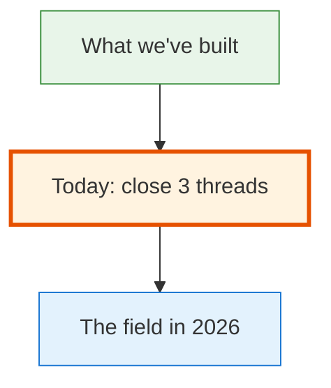

</div>
</div>

---

# Today's Roadmap

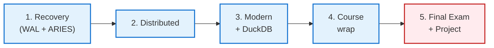

Anchor papers today:
- Mohan et al. [*ARIES*](https://ufdatastudio.com/cop5725fa26/papers/pdfs/mohan1992.pdf) (ACM TODS 1992)
- Raasveldt & Mühleisen [*DuckDB*](https://ufdatastudio.com/cop5725fa26/papers/pdfs/raasveldt2019.pdf) (SIGMOD 2019)

---

<!-- _class: lead -->

# Part 1: Recovery

---

# The Crash Problem

The buffer pool (Day 23) caches **dirty pages** in memory. A `COMMIT` doesn't immediately flush every changed page to disk — that would be too slow.

But what if the server crashes between commit and flush?

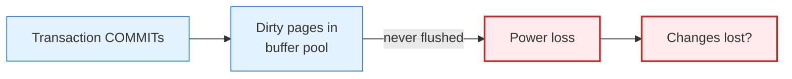

Without recovery, durability (the D in ACID) breaks.

The answer is the **write-ahead log**.

---

# The Write-Ahead Log Invariant

> Before a page change is applied to disk, the corresponding log record must already be on disk.

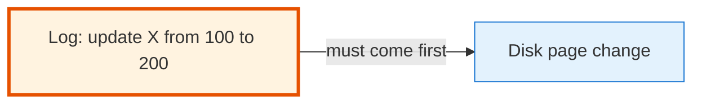

This is the **WAL invariant**, sometimes stated as:

> Log the intent before performing the action.

If the system crashes after the log record but before the page change, recovery can **redo** the change. If it crashes before the log record, the transaction effectively didn't happen — fine.

---

# WAL Mechanics

Every change a transaction makes generates a log record:

```
LSN: 4501
xid: 123
type: UPDATE
table: student
ctid: (5, 2)
before: (name='Ada', gpa=3.95)
after:  (name='Ada', gpa=3.96)
```

**LSN** is the *log sequence number* — a monotonically increasing position in the log.

On `COMMIT`, the WAL buffer up to and including the commit record is **fsync'd to disk**.

After fsync returns, the commit is **durable**. Even a power loss preserves it.

Reference: [PostgreSQL Ch. 30 Reliability and the Write-Ahead Log](https://www.postgresql.org/docs/current/wal-intro.html).

---

# PostgreSQL's WAL on Disk

```bash
$ ls /var/lib/postgresql/16/main/pg_wal/
000000010000000000000010
000000010000000000000011
000000010000000000000012   ← currently writing here
```

PostgreSQL writes the WAL to `pg_wal/` directory. Each file is **16 MB** by default. Files are reused once their changes are flushed (by **checkpoints**) and they're no longer needed for replication.

The `wal_level` setting determines how much information is logged (logical replication needs more).

```sql
SHOW wal_level;
```

---

# Checkpoints

A **checkpoint** writes all currently-dirty pages to disk and notes the position in the log.

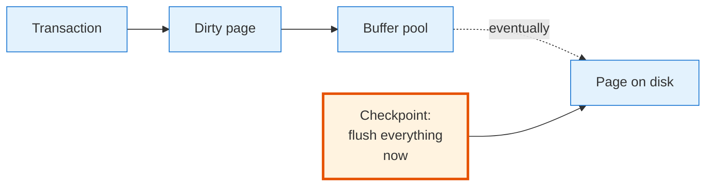

After a checkpoint, the log records from before the checkpoint are no longer needed for recovery. They can be archived or recycled.

PostgreSQL runs checkpoints periodically (every ~5 minutes by default, or when WAL grows large enough).

---

<!-- _class: lead -->

# Part 2: ARIES

---

# ARIES — Mohan 1992

> Mohan, C., Haderle, D., Lindsay, B., Pirahesh, H., Schwarz, P.
> *ARIES: A Transaction Recovery Method Supporting Fine-Granularity Locking and Partial Rollbacks Using Write-Ahead Logging.*
> ACM TODS 17(1), 1992.

[Local PDF](https://ufdatastudio.com/cop5725fa26/papers/pdfs/mohan1992.pdf)

The recovery algorithm in IBM DB2, with variants in PostgreSQL, MySQL, SQL Server, and most other systems.

Three phases. We see all three.

---

# ARIES, Three Phases

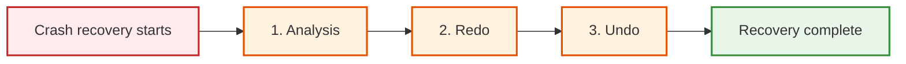

- **Analysis:** scan log from the last checkpoint to find what was happening at crash time
- **Redo:** replay log forward to restore committed changes to disk
- **Undo:** roll back uncommitted transactions

After all three phases, the database is consistent.

---

# Analysis Phase

Scan the log forward from the last checkpoint. Build:

- **Transaction table**: which transactions were active at crash, what their last LSN was
- **Dirty page table**: which pages had been modified but possibly not flushed

At the end of analysis, we know exactly what we need to redo and undo.

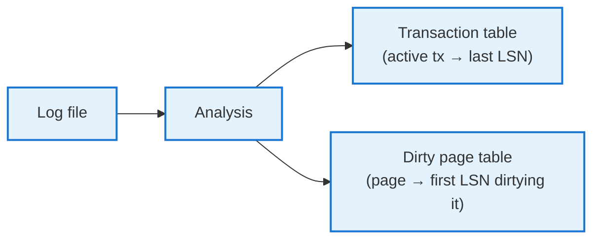

---

# Redo Phase

For every log record between the **earliest dirty-page LSN** and the crash:

- Read the page from disk
- Check whether the page's LSN ≥ this log record's LSN
- If yes: the change was already applied to disk; skip
- If no: apply the change; update the page's LSN

This phase makes the database **physically consistent**: every committed change is on disk.

But uncommitted transactions are also on disk after redo. Undo fixes that.

---

# Undo Phase

For every transaction in the transaction table that did **not** commit before the crash:

- Walk the log backward from the transaction's last LSN
- For each operation, write a **compensation log record** (CLR) and reverse the change
- When we reach the transaction's BEGIN, the transaction is fully undone

After undo, only committed transactions remain on disk. The database is logically consistent.

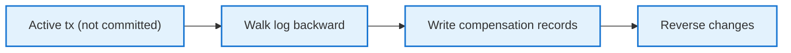

CLRs are themselves logged so that if recovery is interrupted, it can resume.

---

# Why ARIES Endures

The 1992 paper proposed:

- Logical undo with physical redo (the "physical-logical" split)
- Compensation log records for safe recovery-of-recovery
- LSN-tagged pages to skip already-applied work
- Fine-grained locking compatible with recovery

Every one of these ideas is in PostgreSQL, MySQL InnoDB, SQL Server, and DB2 today.

> 32 years later, ARIES is still the recovery algorithm.

<!--
The Mohan paper is dense but worth the read. It's one of the most-cited papers in the field. The key insight: by tagging pages with their LSN, recovery can be idempotent — running it twice gives the same result.
-->

---

<!-- _class: lead -->

# Part 3: Distributed Databases

---

# When One Machine Isn't Enough

Single-machine PostgreSQL handles:
- Hundreds of GB to a few TB
- Thousands of TPS
- Millions of users (with the right caching)

When you exceed this:
- Shard across multiple machines
- Replicate for read scaling and failure tolerance
- Coordinate transactions across nodes

Each step adds new failure modes.

---

# Sharding

Split a table across multiple machines based on a **shard key**.

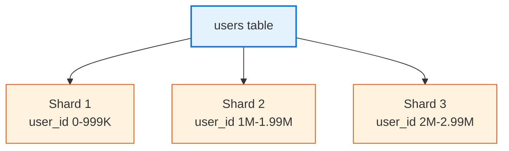

Queries that touch a single shard are fast. Queries that touch all shards (joins, GROUP BY across keys) require coordination.

PostgreSQL: `Citus` extension. Other engines: built-in (CockroachDB, Vitess).

---

# Replication

Copy each shard's data to multiple machines.

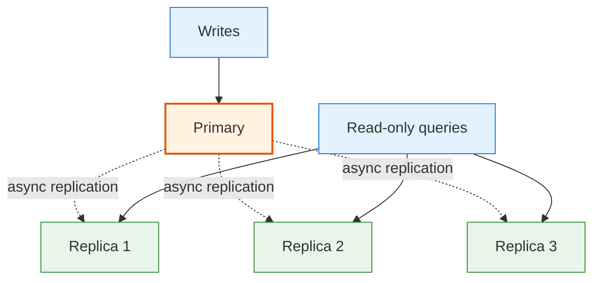

Read replicas scale **read** capacity. Write throughput is still primary-bound.

PostgreSQL: streaming replication, logical replication. Multi-primary is hard.

---

# Two-Phase Commit (2PC)

To commit a transaction across multiple shards atomically:

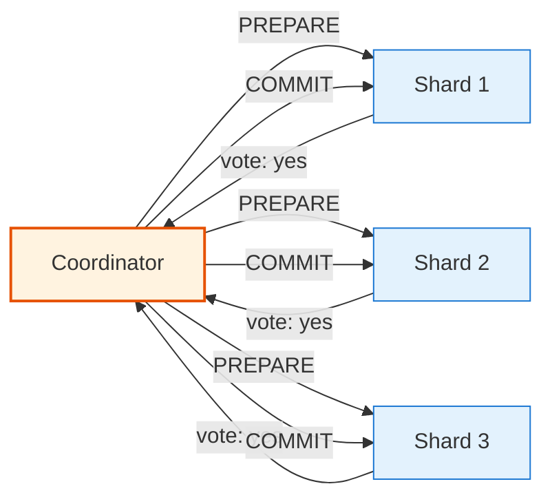

Phase 1: PREPARE — every shard logs the transaction durably and votes yes/no.
Phase 2: COMMIT — if all yes, the coordinator tells everyone to commit.

2PC is slow (multiple round trips) and blocks if the coordinator dies. Modern systems use **Paxos** or **Raft** for coordinator failure tolerance.

---

# Spanner (Google)

Corbett et al., OSDI 2012. [Read it here](https://ufdatastudio.com/cop5725fa26/papers/pdfs/corbett2012.pdf).

Google's globally-distributed database. Provides:

- **External consistency** across continents
- ACID transactions over data on dozens of servers
- The **TrueTime API** — a clock interval, not a single timestamp

Spanner uses GPS receivers and atomic clocks to bound clock uncertainty (~5 ms). Transactions wait out the uncertainty before committing.

Underpins Gmail, Google Calendar, AdWords, much of Google's infrastructure.

Open-source descendants: **CockroachDB**, **Yugabyte**, **TiDB**.

---

<!-- _class: lead -->

# Part 4: Modern Systems

---

# The Modern Landscape

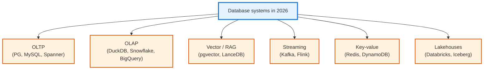

Each category solves a different problem. There is no "one engine" anymore.

---

# DuckDB: Where We Started

> Raasveldt, M. and Mühleisen, H.
> *DuckDB: An Embeddable Analytical Database.*
> SIGMOD 2019.

[Local PDF](https://ufdatastudio.com/cop5725fa26/papers/pdfs/raasveldt2019.pdf)

The closing paper of the course. DuckDB:

- Embedded (like SQLite)
- Column-store (like C-Store)
- Vectorized executor (like MonetDB/X100)
- Reads Parquet, CSV, JSON directly
- Single binary, no server

In 2026, the analytics tool of choice for laptops. The fastest path from a Parquet file to a SQL answer.

You used it for half the projects this semester.

---

# Vector Databases

```sql
-- pgvector extension
CREATE EXTENSION vector;

CREATE TABLE documents (
  id bigint PRIMARY KEY,
  content text,
  embedding vector(1536)
);

CREATE INDEX ON documents USING hnsw (embedding vector_cosine_ops);

-- Nearest-neighbor search
SELECT id, content
FROM documents
ORDER BY embedding <=> '[0.1, 0.2, ...]'::vector
LIMIT 10;
```

Vector databases store embeddings (from ML models) and answer "find rows similar to this one" in milliseconds.

Standalone: Pinecone, Qdrant, Weaviate, LanceDB.
PostgreSQL extensions: `pgvector`, `pg_embedding`.
DuckDB: vector similarity via UDFs.

The RAG (Retrieval Augmented Generation) explosion in 2023-2025 made vector DBs ubiquitous.

---

# Lakehouses

The architectural pattern of 2024-2026:

- Storage: cheap object storage (S3, GCS, Azure Blob)
- Format: open table formats (Apache Iceberg, Delta Lake, Apache Hudi)
- Compute: separate query engines (Spark, DuckDB, Snowflake, Trino)

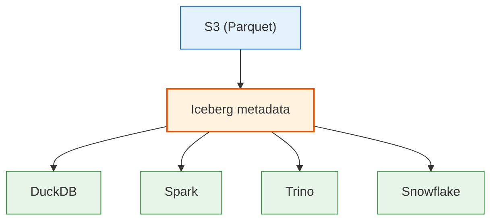

The data lives once, queryable by many engines. The next big wave in data infrastructure.

<!--
Lakehouses are the synthesis of the data warehouse and the data lake. Data warehouses had structure but were expensive. Data lakes were cheap but unstructured. Iceberg and friends give you both.
-->

---

<!-- _class: lead -->

# Part 5: Course Wrap

---

# What You Can Now Do

<div class="columns-3">
<div>

### Design
- Read and write relational algebra
- Translate ER diagrams to SQL
- Normalize a schema
- Reason about functional dependencies

</div>
<div>

### Build
- Write advanced SQL (CTEs, window, recursive)
- Use Python + psycopg + DuckDB
- Pick the right index
- Tune queries with EXPLAIN

</div>
<div>

### Operate
- Read execution plans
- Diagnose locks with `pg_locks`
- Manage VACUUM and bloat
- Understand recovery and replication

</div>
</div>

This is the working database engineer's toolkit. Most people you meet in industry have only some of it.

---

# What We Did Not Cover

There is always more. We didn't go deeply into:

- **Streaming systems** (Kafka, Flink)
- **Graph databases** (Neo4j, Memgraph)
- **Time-series** (TimescaleDB, InfluxDB)
- **Search engines** (Elasticsearch, OpenSearch)
- **Caching layers** (Redis, Memcached)
- **Wide-column stores** (Cassandra, ScyllaDB)

The systems above use ideas you now have — they're not new sciences, just different applications.

The Section 7 lecture didn't happen because it merged with today's modern systems coverage. The schedule reflects this.

---

# Practice Final Exam

Released today: `practice-exams/exam3-final.md`.

The final exam is **cumulative** — every section is in scope. The emphasis is on Sections 6-7 (most recent material) but you should be ready for any topic.

Format: 90 minutes, closed notes, in the assigned final exam slot during Dec 5-11.

The practice packet is the best preparation. The Project 3 and Final Project work is the second-best preparation.

---

# Final Project

<div class="columns">
<div>

### Due Wed Dec 9 at 11:59 PM

Deliverables in your `cop5725fa26-project` repo:

- The artifact (analytics report / API / dashboard / pipeline)
- 3-5 minute demo video
- `README.md` framed as onboarding
- `architecture.md` with one diagram
- Tagged release `final`

</div>
<div>

### Presentations

In the assigned final exam block (Wed Dec 9). 3-5 minutes per student.

The class will vote on the most impressive capstone.

</div>
</div>

This is the largest grade component. Invest the time.

---

# A Closing Note

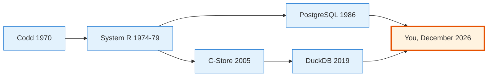

The relational model is 56 years old. The B+ tree is 53. ARIES is 33.

These ideas have outlasted dozens of programming languages, three or four "industries," and a generation of engineers.

The systems will keep evolving. The ideas you have are the ideas every working database engineer needs.

Use them well.

---

# Questions

What is on your mind?

Final Exam in the Dec 5-11 window. Final Project due Wed Dec 9.

Thank you for the semester.

<!--
End-of-course questions tend to be reflective or about post-class resources. Have a list ready: the Red Book, the CMU DB lectures on YouTube, the SIGMOD oral history series, the Pavlo + Stonebraker 2024 paper as the best one-stop summary.
-->
