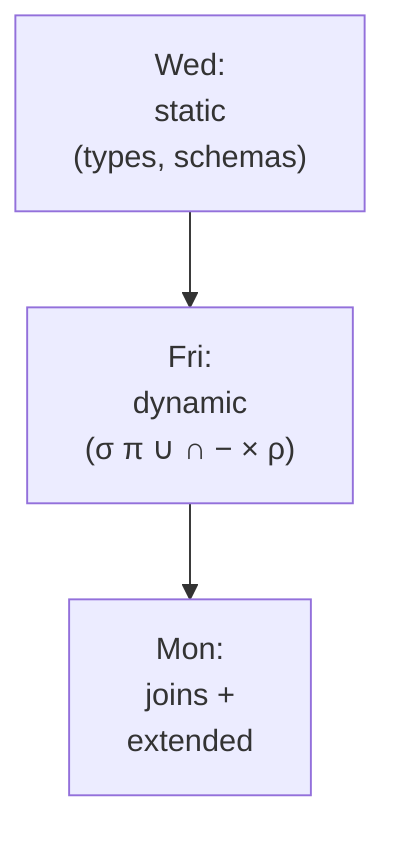
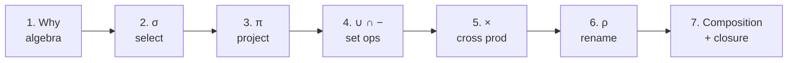
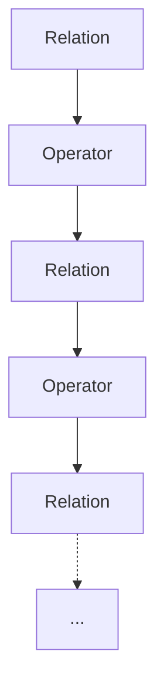
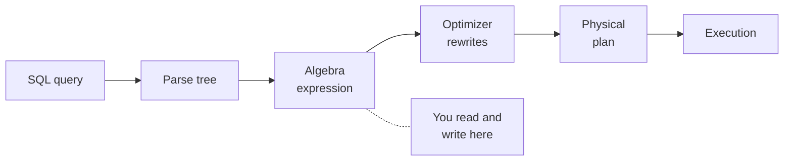
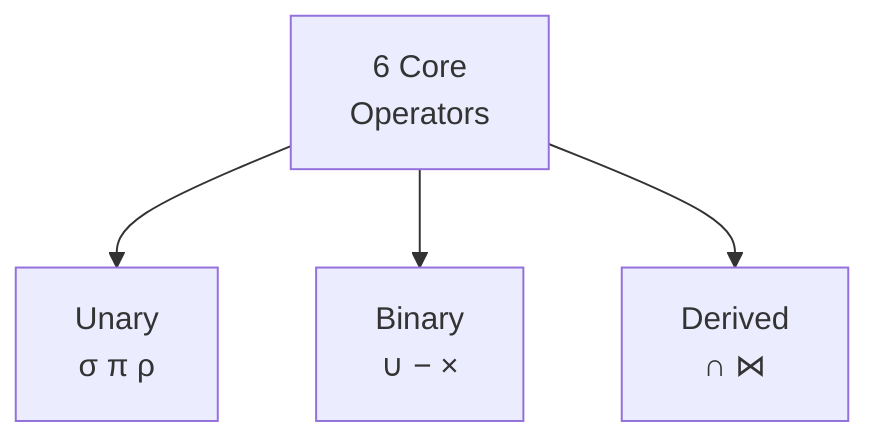
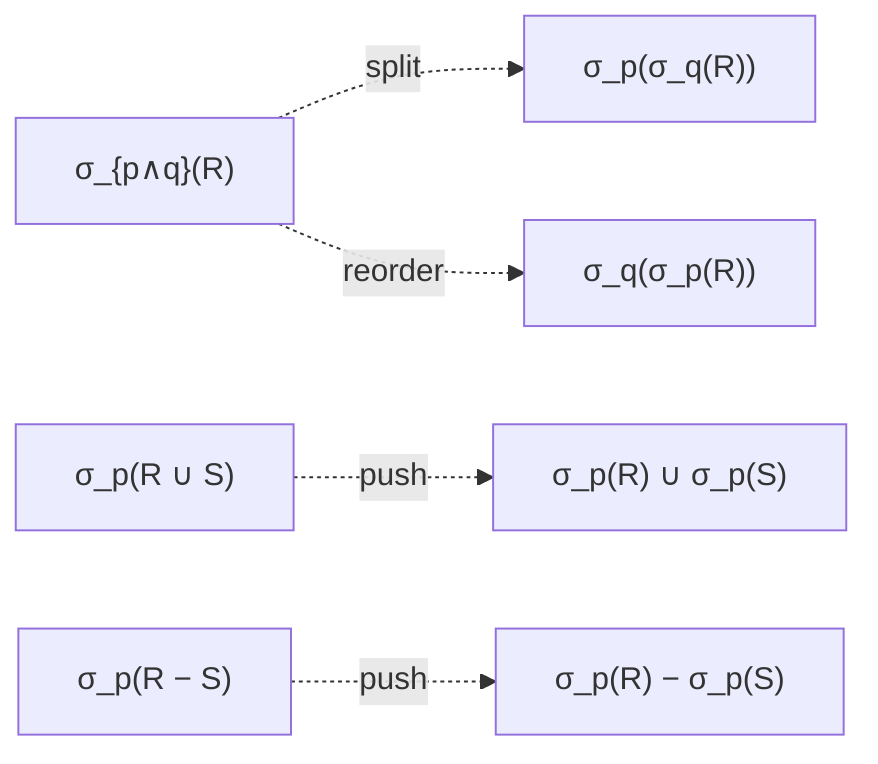
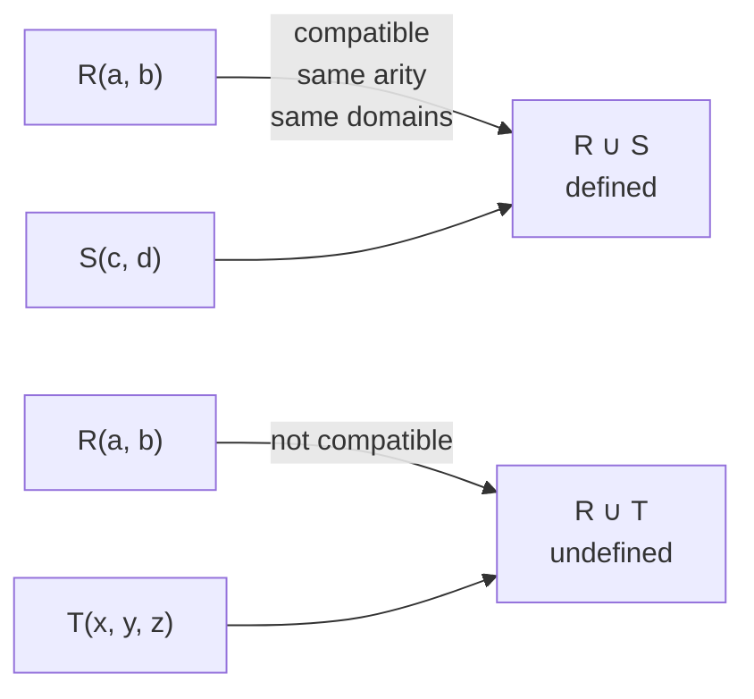
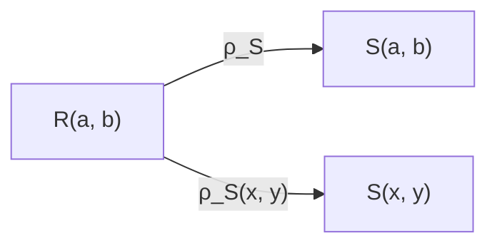

<!-- _class: lead -->

# Day 4: Relational Algebra I

**COP 5725 - Database Management Systems**
Friday, August 28, 2026

The language that compiles down from SQL

<!--
Third content class. Students who skimmed the textbook will recognize this material. Those who didn't will see algebra symbols for the first time — keep the worked examples concrete. Pace: 50 min, with the last 8 min reserved for the SQL ↔ algebra round-trip.
-->

---

# Where We Are

<div class="columns-left-wide">
<div>

Wednesday: relations, tuples, schemas, types, constraints — the static picture.

Today: the operations you can perform on relations — the dynamic picture.

Monday: the rest of the algebra (joins, division, extended operators).

By next Friday's lecture you will write SQL and read its algebra translation on the same slide without thinking.

</div>
<div>



</div>
</div>

---

# Today's Roadmap



---

<!-- _class: lead -->

# Part 1: Why an Algebra

---

# Two Properties That Matter

<div class="columns">
<div>

A relational algebra is a small set of operators with two properties.

**Closure**: every operator takes relations and returns a relation.

**Composition**: any output can feed into any other operator.

Closure plus composition lets us build arbitrarily complex queries from a small alphabet. The same property makes the algebra a target for query optimization: rewriting an expression yields another expression, not a different language.

</div>
<div>



Closure: output is always a relation, so it can feed the next operator.

</div>
</div>

<!--
The closure property is what makes optimizer rewrites safe. An optimizer can swap two operators or change their order — as long as both forms are algebra expressions, the swap preserves correctness.
-->

---

# Where Algebra Sits in the Database



SQL is the surface language users type.
Algebra is the canonical form the optimizer manipulates.
We return to this pipeline in Section 5 when we study query plans.

---

# The Six Core Operators

<div class="columns">
<div>

| Symbol | Name | Arity |
|--------|------|-------|
| σ | Selection | unary |
| π | Projection | unary |
| ∪ | Union | binary |
| − | Difference | binary |
| × | Cross product | binary |
| ρ | Rename | unary |

</div>
<div>



Intersection ∩ and join ⋈ can be derived from these six. We treat them as first-class for convenience.

</div>
</div>

---

<!-- _class: lead -->

# Part 2: Selection σ

---

# σ: Filter Rows

$$\sigma_{\text{predicate}}(R)$$

Returns every tuple in $R$ for which the predicate is true.

<div class="columns">
<div>

### Predicates include
- Attribute comparisons: `=, ≠, <, ≤, >, ≥`
- Boolean combinations: `∧, ∨, ¬`
- Constants and other attributes

</div>
<div>

### Effects
- Schema is unchanged
- Cardinality can shrink

</div>
</div>

---

# σ: Worked Example

<div class="columns">
<div>

**student**

| sid | name | gpa |
|-----|------|-----|
| 1 | Ada | 3.8 |
| 2 | Bob | 2.9 |
| 3 | Chia | 3.5 |
| 4 | Dev | 3.9 |

</div>
<div>

$\sigma_{gpa \geq 3.5}(student)$

| sid | name | gpa |
|-----|------|-----|
| 1 | Ada | 3.8 |
| 3 | Chia | 3.5 |
| 4 | Dev | 3.9 |

In SQL: `SELECT * FROM student WHERE gpa >= 3.5`

</div>
</div>

<!--
Walk row by row through the filter. The point students sometimes miss: schema is the same — same columns, fewer rows.
-->

---

# Selectivity Is a Number

$$\text{selectivity}(\sigma_p(R)) = \frac{|\sigma_p(R)|}{|R|}$$

The fraction of tuples a selection keeps is called its **selectivity**.

Selectivity is one of the numbers a query optimizer estimates to decide what order to do work in. We return to it in Section 5; for now, notice that the optimizer needs *statistics* about your data to estimate it.

<!--
Plant the seed: every time you write a WHERE clause, the database guesses what fraction of rows you keep. Bad guesses are a top source of plan mistakes. Week 13 covers this.
-->

---

# Selection Identities Worth Knowing



The optimizer uses these to rewrite plans.

The first identity says you can split conjunctive predicates and reorder them.
The second and third say selection distributes over set operations.

Both are reasons your query plan often looks nothing like the SQL you typed.

---

<!-- _class: lead -->

# Part 3: Projection π

---

# π: Filter Columns

$$\pi_{A_1, A_2, ..., A_k}(R)$$

Keeps only the listed attributes. Drops the rest.

<div class="columns">
<div>

### Effects
- Schema shrinks
- Cardinality stays the same — **except** when projection introduces duplicate tuples

</div>
<div>

### Why duplicates collapse
Because a relation is a set. If three students all major in CS, then $\pi_{major}$ returns `{CS}` — a single-tuple relation.

</div>
</div>

---

# π vs SELECT — A Subtle Difference

<div class="columns">
<div>

### Algebra

```
π_major(student)
```

Returns a **set**. Duplicates collapse.

</div>
<div>

### SQL

```sql
SELECT major FROM student;
```

Returns a **multiset**. If three students major in CS, you get three rows.

</div>
</div>

To match algebra semantics in SQL, write `SELECT DISTINCT major FROM student`.

> Section 5 explains why duplicate elimination is expensive enough that SQL made it optional.

<!--
This is one of the most common student confusions of the semester. Worth slowing down here. Some students will have written SQL since high school and never noticed; they assume DISTINCT is rare and irrelevant.
-->

---

# π: Worked Example

<div class="columns">
<div>

### Step 1: σ

$\sigma_{gpa \geq 3.5}(student)$:

| sid | name | gpa |
|-----|------|-----|
| 1 | Ada | 3.8 |
| 3 | Chia | 3.5 |
| 4 | Dev | 3.9 |

</div>
<div>

### Step 2: π

$\pi_{name, gpa}(...)$:

| name | gpa |
|------|-----|
| Ada | 3.8 |
| Chia | 3.5 |
| Dev | 3.9 |

</div>
</div>

In SQL: `SELECT name, gpa FROM student WHERE gpa >= 3.5`

---

# Composition Order Matters for Cost

<div class="columns">
<div>

### Form A — select then project

$\pi_{name}(\sigma_{gpa \geq 3.5}(student))$

</div>
<div>

### Form B — project then select

$\sigma_{gpa \geq 3.5}(\pi_{name, gpa}(student))$

</div>
</div>

Same result. The optimizer chooses based on selectivity, index availability, and intermediate size.

<!--
For exam purposes, students should treat these as algebraically equivalent. For optimization purposes (Section 5), they are not equivalent in cost. The optimizer's job is to pick the cheaper form.
-->

---

<!-- _class: lead -->

# Part 4: Set Operations

---

# Union Compatibility



<div class="columns">
<div>

Set operations require **union-compatible** relations:

- Same number of attributes
- Corresponding attributes have the same domain

</div>
<div>

Attribute names can differ; the operators use position.

If schemas differ, project to a common shape first.

</div>
</div>

---

# Union ∪

$$R \cup S = \{\, t : t \in R \,\lor\, t \in S \,\}$$

Returns every tuple appearing in either relation. Duplicates collapse.

<div class="columns">
<div>

### Algebra

$\pi_{name}(student) \cup \pi_{name}(faculty)$

</div>
<div>

### SQL

```sql
SELECT name FROM student
UNION
SELECT name FROM faculty;
```

</div>
</div>

> SQL's `UNION` deduplicates. `UNION ALL` skips the deduplication and is much faster when you do not need it.

<!--
Demo: `UNION` vs `UNION ALL` performance on a million-row table. The factor is sometimes 10x. Students who reach for the wrong one are paying for hash-deduplication they don't need.
-->

---

# Intersection ∩

$$R \cap S = \{\, t : t \in R \,\land\, t \in S \,\}$$

Returns tuples appearing in both relations.

<div class="columns">
<div>

### Algebra

$\pi_{name}(student) \cap \pi_{name}(faculty)$

</div>
<div>

### SQL

```sql
SELECT name FROM student
INTERSECT
SELECT name FROM faculty;
```

</div>
</div>

$R \cap S = R - (R - S)$ — so intersection is technically not a core operator. Implementations include it because it is common and the optimizer can do better than the rewrite.

---

# Difference −

$$R - S = \{\, t : t \in R \,\land\, t \notin S \,\}$$

Returns tuples in $R$ that are *not* in $S$.

Difference is **not symmetric**: $R - S \neq S - R$ in general.

<div class="columns">
<div>

### Algebra

$\pi_{name}(student) - \pi_{name}(faculty)$

</div>
<div>

### SQL

```sql
SELECT name FROM student
EXCEPT
SELECT name FROM faculty;
```

</div>
</div>

Difference is the engine behind "find students who have not yet enrolled" — a query we will see often.

---

# Set Operations: When to Reach for Each

<div class="columns-3">
<div>

### "or"
Reach for ∪

Combined membership.

</div>
<div>

### "and"
Reach for ∩

Common membership.

</div>
<div>

### "but not"
Reach for −

Members of A but not B.

</div>
</div>

These three operators cover an enormous fraction of business reporting once you stop thinking in joins for everything.

<!--
Many programmers default to "join + WHERE" for everything. The set operations are often cleaner and the optimizer can sometimes do better with them. Both styles are correct; clarity is the deciding factor.
-->

---

<!-- _class: lead -->

# Part 5: Cross Product ×

---

# ×: Every Tuple Pair

$$R \times S = \{\, (r, s) : r \in R \,\land\, s \in S \,\}$$

Every tuple in $R$ paired with every tuple in $S$.

The result has $|R| \cdot |S|$ tuples and the union of both schemas.

> Cross product almost never appears alone in a real query. It is the building block for joins.

---

# Cross Product: Worked Example

<div class="columns-3">
<div>

**student**

| sid | name |
|-----|------|
| 1 | Ada |
| 2 | Bob |

</div>
<div>

**course**

| cid | title |
|-----|-------|
| COP5725 | DB |
| COT5405 | Algo |

</div>
<div>

**student × course**

| sid | name | cid | title |
|---|---|---|---|
| 1 | Ada | COP5725 | DB |
| 1 | Ada | COT5405 | Algo |
| 2 | Bob | COP5725 | DB |
| 2 | Bob | COT5405 | Algo |

</div>
</div>

<!--
The cardinality blow-up is the key takeaway: |R| × |S| can be enormous. Two million-row tables have a trillion pairs. Never run × alone in production.
-->

---

# Why × Alone Is Usually Wrong

In the example, the cross product produced four tuples but only some pairs are *meaningful* — namely the ones a student is actually enrolled in.

A join filters cross-product output by a predicate. We define joins formally on Monday.

For today, remember: × is the raw material; we always shape it.

---

<!-- _class: lead -->

# Part 6: Rename ρ

---

# ρ: Relabel Relation or Attributes

<div class="columns">
<div>

$$\rho_{S}(R)$$

Renames the relation to $S$.

$$\rho_{S(b_1, ..., b_n)}(R)$$

Also renames attributes.

</div>
<div>



</div>
</div>

Rename does no computation. It exists to make joins and self-references writable.

---

# Why Rename Exists: Self-Joins

Find pairs of students with the same major.

Without rename, we cannot refer to "student" twice in one expression.

$$\pi_{s_1.name, s_2.name}\big( \sigma_{s_1.major = s_2.major \land s_1.id < s_2.id} (\rho_{s_1}(student) \times \rho_{s_2}(student)) \big)$$

In SQL:

```sql
SELECT s1.name, s2.name
FROM student s1, student s2
WHERE s1.major = s2.major AND s1.student_id < s2.student_id;
```

The `s1` and `s2` aliases are SQL's rename.

<!--
The `s1.id < s2.id` predicate is a classic trick: it picks one direction of each pair so we don't get (Ada, Bob) and (Bob, Ada) as separate rows. Worth pointing out.
-->

---

<!-- _class: lead -->

# Part 7: Composition and Closure

---

# Closure In Action

Every operator's output is a relation. Therefore any output can feed any operator.

$$\pi_{name}\big( \sigma_{gpa \geq 3.5}\big( student \cap \pi_{*}(\sigma_{age \geq 18}(student)) \big) \big)$$

The structure is mechanical: parentheses associate inside out; relations flow up the tree.

This is why query optimizers can do their job. A plan tree is just a parse of an algebra expression, and rewrites preserve closure.

---

# A Complete Worked Query

> "Names of students with GPA at least 3.5, not in the CS major."

<div class="columns">
<div>

### Algebra

$$\pi_{name}\big( \sigma_{gpa \geq 3.5 \,\land\, major \neq 'CS'}(student) \big)$$

</div>
<div>

### SQL

```sql
SELECT name FROM student
WHERE gpa >= 3.5 AND major <> 'CS';
```

</div>
</div>

The translation is mechanical once you have the algebra.

---

# A Subtler One

> "Names of students enrolled in COP5725 in Fall 2026."

<div class="columns">
<div>

### Algebra (uses × — we will use ⋈ Monday)

$$\pi_{name}\Bigg( \sigma_{\begin{aligned}&course\_id='COP5725'\\&\,\land\,term='Fall2026'\\&\,\land\,student.sid = enrollment.sid\end{aligned}}(student \times enrollment) \Bigg)$$

</div>
<div>

### SQL

```sql
SELECT s.name
FROM student s, enrollment e
WHERE s.student_id = e.student_id
  AND e.course_id = 'COP5725'
  AND e.term = 'Fall2026';
```

</div>
</div>

Notice the cross-product-plus-predicate pattern. Monday we replace it with a join.

<!--
This is the perfect motivation for joins. The × + σ form works but is verbose; the join form will be cleaner. Friday students should leave with the urge to "name this pattern" — Monday delivers.
-->

---

# Wrap-up

Today you saw:

<div class="columns">
<div>

- Why algebras matter: closure plus composition
- Six operators: σ, π, ∪, ∩, −, × (plus ρ for renaming)

</div>
<div>

- The translation pattern from SQL to algebra
- The first sign of why query optimization is hard

</div>
</div>

---

# Monday: Relational Algebra II

We add the operators every real query uses:

- Joins (θ, equi, natural, outer)
- Division
- Extended algebra (aggregation, sorting, projection with computed columns)

By Monday's end the SQL/algebra translation goes both ways.

Read GMW Ch. 2.5 before class.

---

# Practice Before Monday

Three problems on the handout posted with these slides:

1. Translate three SQL queries to algebra.
2. Translate three algebra expressions to SQL.
3. Argue whether $\sigma_p(R \cup S) = \sigma_p(R) \cup \sigma_p(S)$ and prove it or find a counterexample.

Answers due in your repo before 8:30 AM Mon Aug 31.

<!--
Problem 3 is the most interesting — it asks students to reason about why the identity holds, not just to recall it. Good first taste of algebra-as-proof.
-->

---

# Questions

What is on your mind?

Project 1 release is now live. Project 0 setup remains due Fri Sep 4.
