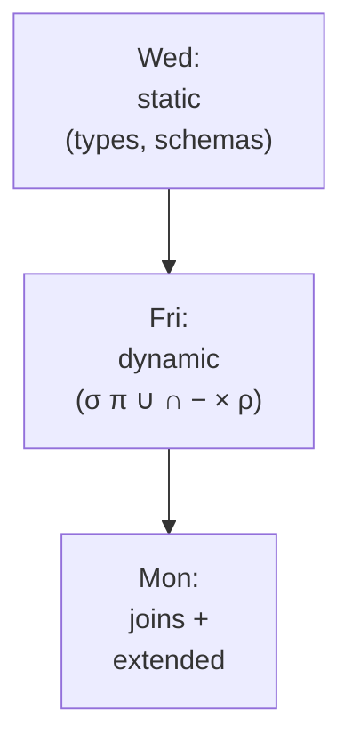
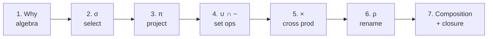
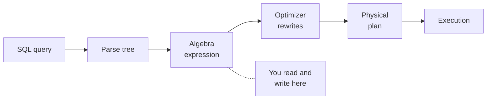
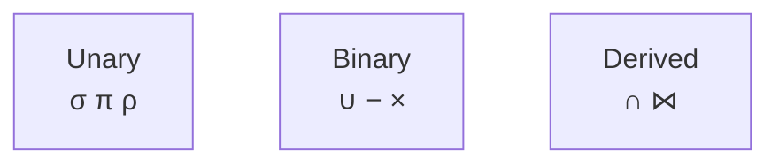
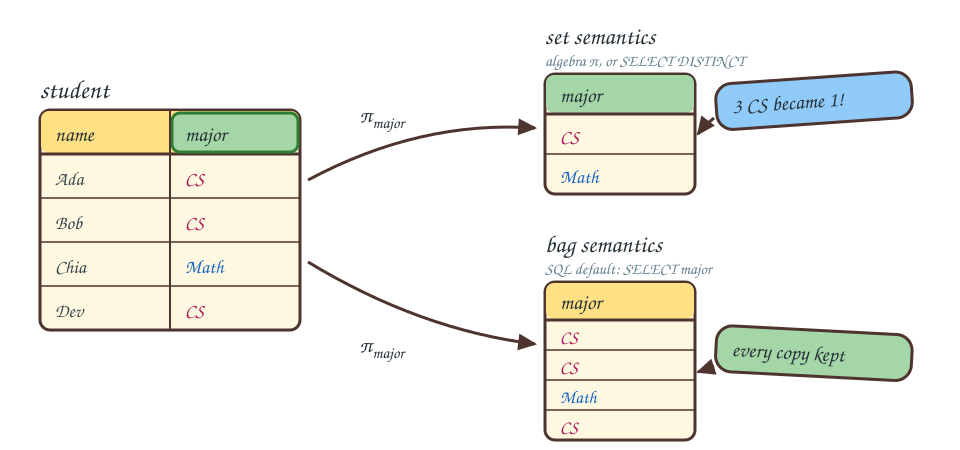
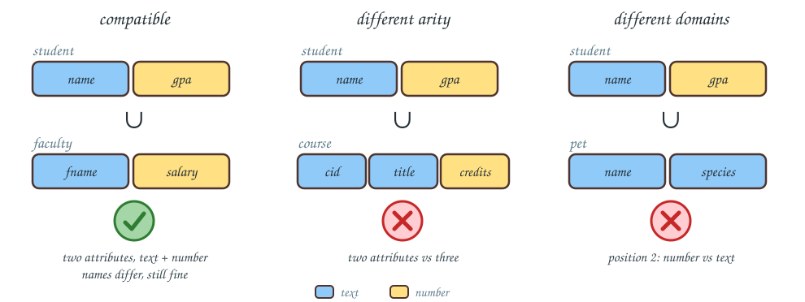
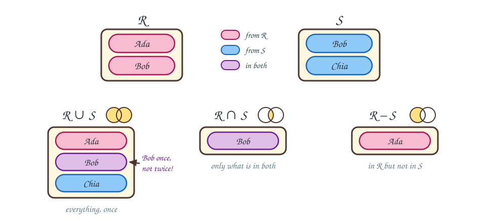
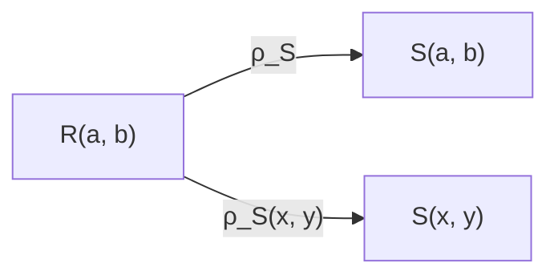

<!-- _class: lead -->

# Day 4: Relational Algebra I

**COP 5725 - Database Management Systems**
Friday, August 28, 2026

The language SQL compiles into

<!--
Third content class. Students who skimmed the textbook will recognize this material. Those who didn't will see algebra symbols for the first time — keep the worked examples concrete. Pace: 50 min, with the last 8 min reserved for the SQL ↔ algebra round-trip.
-->

---

# Where We Are

<div class="columns-left-wide">
<div>

Wednesday covered relations, tuples, schemas, types, and constraints.

Today covers the operations on relations: selection, projection, the set operations, cross product, and rename.

Monday adds joins, division, and the extended operators.

</div>
<div>



</div>
</div>

<!--
One breath of orientation. Wednesday was what a relation is; today is what you can do to one; Monday finishes the operator set. The textbook covers today's material in §2.4 (p. 38).
-->

---

# Today's Roadmap



---

<!-- _class: lead -->

# Part 1: Why an Algebra

---

# Closure and Composition

A relational algebra is a small set of operators with two properties (Textbook §2.4.2, p. 38).

**Closure**: every operator takes relations and returns a relation.

**Composition**: any output can feed into any other operator.

Closure plus composition builds arbitrarily complex queries from a small alphabet. The same properties make the algebra a target for query optimization, because rewriting an expression always yields another algebra expression.

<!--
The closure property is what makes optimizer rewrites safe. An optimizer can swap two operators or change their order — as long as both forms are algebra expressions, the swap preserves correctness.
-->

---

# Where Algebra Sits in the Database



SQL is the surface language users type.
Algebra is the canonical form the optimizer manipulates.
We return to this pipeline in Section 5 when we study query plans.

---

# The Six Core Operators

<div class="columns">
<div>

| Symbol | Name | Arity | Textbook |
|--------|------|-------|----------|
| σ | Selection | unary | §2.4.6, p. 42 |
| π | Projection | unary | §2.4.5, p. 41 |
| ∪ | Union | binary | §2.4.4, p. 39 |
| − | Difference | binary | §2.4.4, p. 39 |
| × | Cross product | binary | §2.4.7, p. 43 |
| ρ | Rename | unary | §2.4.11, p. 49 |

</div>
<div>



Intersection ∩ (§2.4.4, p. 39) and join ⋈ (§2.4.8, p. 43) can be derived from these six. We treat them as first-class for convenience.

</div>
</div>

---

<!-- _class: lead -->

# Part 2: Selection σ

---

# σ: Filter Rows

$$\sigma_{\text{predicate}}(R)$$

Returns every tuple in $R$ for which the predicate is true (Textbook §2.4.6, p. 42).
The predicate is evaluated once per tuple and must return true or false.

<div class="columns">
<div>

### Predicates include
- Attribute comparisons: `=, ≠, <, ≤, >, ≥`
- Boolean combinations: `∧, ∨, ¬`
- Constants and other attributes
- In practice, custom boolean functions: regular expressions (`name ~ '^A'`), lookups (`major IN (...)`), UDFs

</div>
<div>

### Effects
- Schema is unchanged
- Cardinality can shrink

<div class="small">

Cardinality is the number of tuples in a relation, written $|R|$.

</div>

</div>
</div>

---

# σ: Example

<div class="columns">
<div>

**student**

| sid | name | gpa |
|-----|------|-----|
| 1 | Ada | 3.8 |
| 2 | Bob | 2.9 |
| 3 | Chia | 3.5 |
| 4 | Dev | 3.9 |

</div>
<div>

$\sigma_{gpa \geq 3.5}(student)$

| sid | name | gpa |
|-----|------|-----|
| 1 | Ada | 3.8 |
| 3 | Chia | 3.5 |
| 4 | Dev | 3.9 |

In SQL: `SELECT * FROM student WHERE gpa >= 3.5`

</div>
</div>

<!--
Walk row by row through the filter. The point students sometimes miss: schema is the same — same columns, fewer rows.
-->

---

# Selectivity

$$\text{selectivity}(\sigma_p(R)) = \frac{|\sigma_p(R)|}{|R|}$$

The fraction of tuples a selection keeps is called its **selectivity**.

Selectivity is one of the numbers a query optimizer estimates to decide what order to do work in. We return to it in Section 5; for now, notice that the optimizer needs *statistics* about your data to estimate it.

<!--
Plant the seed: every time you write a WHERE clause, the database guesses what fraction of rows you keep. Bad guesses are a top source of plan mistakes. Week 13 covers this.
-->

---

# Selection Identities

Relational algebra is an algebra, so its operators obey rewrite laws called identities, the way $+$ and $\times$ do in arithmetic (Textbook §16.2, p. 768).

<div class="small">

| Law | Identity | Reading |
|-----|----------|---------|
| Split ∧ | $\sigma_{p \land q}(R) = \sigma_p(\sigma_q(R))$ | evaluate a conjunction one piece at a time |
| Split ∨ | $\sigma_{p \lor q}(R) = \sigma_p(R) \cup \sigma_q(R)$ | sets only; on bags the union double-counts |
| Commute | $\sigma_p(\sigma_q(R)) = \sigma_q(\sigma_p(R))$ | apply the pieces in either order |
| Push into ∪ | $\sigma_p(R \cup S) = \sigma_p(R) \cup \sigma_p(S)$ | must push into both arguments |
| Push into − | $\sigma_p(R - S) = \sigma_p(R) - S$ | must push into the first argument; the second is optional |

</div>

Complicated predicates are rewritten with these laws (Textbook §16.2.2, p. 770).
The optimizer splits a predicate into pieces, reorders the pieces, and pushes each one as close to the stored data as it can go.

<!--
The ∨ split needs set semantics: on bags, a tuple satisfying both p and q appears twice in the union. Day 5 covers bags, and this is the first spot where the set/bag distinction changes which rewrites are legal. Problem 3 on the practice handout asks students to prove the push-into-∪ law.
-->


---

<!-- _class: lead -->

# Part 3: Projection π

---

# π: Projection

$$\pi_{A_1, A_2, ..., A_k}(R)$$

Keeps only the listed attributes and drops the rest (Textbook §2.4.5, p. 41).

<div class="columns">
<div>

### Effects
- Schema shrinks
- Cardinality stays the same — **except** when projection introduces duplicate tuples

</div>
<div>

### Why duplicates collapse
Because a relation is a set. If three students all major in CS, then $\pi_{major}$ returns `{CS}` — a single-tuple relation.

</div>
</div>

---

# π vs SELECT

<div class="columns">
<div>

### Algebra

```
π_major(student)
```

Returns a **set**. Duplicates collapse.

</div>
<div>

### SQL

```sql
SELECT major FROM student;
```

Returns a **multiset**. If three students major in CS, you get three rows.

</div>
</div>

To match algebra semantics in SQL, write `SELECT DISTINCT major FROM student`.

> Section 5 explains why duplicate elimination is expensive enough that SQL made it optional.

<!--
This is one of the most common student confusions of the semester. Worth slowing down here. Some students will have written SQL since high school and never noticed; they assume DISTINCT is rare and irrelevant.
-->

---

# Evaluating a Query

$$\pi_{name,\,gpa}\big(\sigma_{gpa \geq 3.5}(student)\big)$$

One expression, two operators. Evaluate inside out: σ first, then π.

<div class="columns-3">
<div>

**student**

<table>
<thead><tr><th>sid</th><th>name</th><th>gpa</th></tr></thead>
<tbody>
<tr style="background:#F8BBD0"><td>1</td><td>Ada</td><td>3.8</td></tr>
<tr><td>2</td><td>Bob</td><td>2.9</td></tr>
<tr style="background:#F8BBD0"><td>3</td><td>Chia</td><td>3.5</td></tr>
<tr style="background:#F8BBD0"><td>4</td><td>Dev</td><td>3.9</td></tr>
</tbody>
</table>

Step 1: σ keeps the pink rows

</div>
<div>

**after σ**

<table>
<thead><tr><th>sid</th><th style="background:#A5D6A7">name</th><th style="background:#A5D6A7">gpa</th></tr></thead>
<tbody>
<tr><td>1</td><td style="background:#E8F5E9">Ada</td><td style="background:#E8F5E9">3.8</td></tr>
<tr><td>3</td><td style="background:#E8F5E9">Chia</td><td style="background:#E8F5E9">3.5</td></tr>
<tr><td>4</td><td style="background:#E8F5E9">Dev</td><td style="background:#E8F5E9">3.9</td></tr>
</tbody>
</table>

Step 2: π keeps the green columns

</div>
<div>

**result**

<table>
<thead><tr><th>name</th><th>gpa</th></tr></thead>
<tbody>
<tr style="background:#E8F5E9"><td>Ada</td><td>3.8</td></tr>
<tr style="background:#E8F5E9"><td>Chia</td><td>3.5</td></tr>
<tr style="background:#E8F5E9"><td>Dev</td><td>3.9</td></tr>
</tbody>
</table>

Three tuples, two attributes

</div>
</div>

<!--
The colors carry the explanation: pink marks the rows σ keeps, green marks the columns π keeps. Read the expression inside out and follow the colors left to right.
-->

---

# Duplicates Collapse: Set vs Bag



Relational algebra uses set semantics, so π collapses the duplicates it creates. SQL uses bag (multiset) semantics and keeps them (Textbook §5.1.1–5.1.3, p. 206–208).

<!--
The same π_major, run under both semantics. The color tracks the three CS tuples: the set result folds them into one; the bag result keeps all three. This is the picture behind the previous slide's DISTINCT discussion, and Day 5 studies bag operators in full.
-->


---

# Composition Order Matters for Cost

<div class="columns">
<div>

### Form A — select then project

$\pi_{name}(\sigma_{gpa \geq 3.5}(student))$

</div>
<div>

### Form B — project then select

$\sigma_{gpa \geq 3.5}(\pi_{name, gpa}(student))$

</div>
</div>

Same result. The optimizer chooses based on selectivity, index availability, and intermediate size.

<!--
For exam purposes, students should treat these as algebraically equivalent. For optimization purposes (Section 5), they are not equivalent in cost. The optimizer's job is to pick the cheaper form.
-->

---

<!-- _class: lead -->

# Part 4: Set Operations

---

# Union Compatibility



<div class="columns">
<div>

Set operations require **union-compatible** relations (Textbook §2.4.4, p. 39): same number of attributes, and corresponding attributes drawn from the same domain.

</div>
<div>

Attribute names can differ; the operators use position.
If schemas differ, project to a common shape first.

</div>
</div>

<!--
Walk the three panels left to right. Panel 1: two attributes, text then number, so the union is defined even though the names differ. Panel 2: arity mismatch. Panel 3: same arity but position two holds a number on one side and text on the other. The fix for panels 2 and 3 is a projection to a common shape.
-->

---

# Set Operations by Example



Same two relations each time. Union collects every name once, intersection keeps the shared ones, and difference keeps what only $R$ has.

<!--
Bob is the whole story: pink tuples come from R, blue from S, and purple marks the name both relations contain. In R ∪ S Bob appears once, not twice, because the result is a set. The venn doodle above each result shades the region that operator returns.
-->


---

# Union ∪

$$R \cup S = \{\, t : t \in R \,\lor\, t \in S \,\}$$

Returns every tuple appearing in either relation. Duplicates collapse.

<div class="columns">
<div>

### Algebra

$\pi_{name}(student) \cup \pi_{name}(faculty)$

</div>
<div>

### SQL

```sql
SELECT name FROM student
UNION
SELECT name FROM faculty;
```

</div>
</div>

> SQL's `UNION` deduplicates. `UNION ALL` skips the deduplication and is much faster when you do not need it.

<!--
Demo: `UNION` vs `UNION ALL` performance on a million-row table. The factor is sometimes 10x. Students who reach for the wrong one are paying for hash-deduplication they don't need.
-->

---

# Intersection ∩

$$R \cap S = \{\, t : t \in R \,\land\, t \in S \,\}$$

Returns tuples appearing in both relations.

<div class="columns">
<div>

### Algebra

$\pi_{name}(student) \cap \pi_{name}(faculty)$

</div>
<div>

### SQL

```sql
SELECT name FROM student
INTERSECT
SELECT name FROM faculty;
```

</div>
</div>

$R \cap S = R - (R - S)$, so intersection is not strictly a core operator. Implementations include it because it is common and the optimizer can do better than the rewrite.

---

# Difference −

$$R - S = \{\, t : t \in R \,\land\, t \notin S \,\}$$

Returns tuples in $R$ that are *not* in $S$.

Difference is **not symmetric**: $R - S \neq S - R$ in general.

<div class="columns">
<div>

### Algebra

$\pi_{name}(student) - \pi_{name}(faculty)$

</div>
<div>

### SQL

```sql
SELECT name FROM student
EXCEPT
SELECT name FROM faculty;
```

</div>
</div>

Difference answers questions like "which students have not yet enrolled."

---

# Choosing a Set Operation

<div class="columns-3">
<div>

### "or"
Use ∪

Combined membership.

</div>
<div>

### "and"
Use ∩

Common membership.

</div>
<div>

### "but not"
Use −

Members of A but not B.

</div>
</div>

These three operators cover much of everyday reporting SQL.

<!--
Many programmers default to "join + WHERE" for everything. The set operations are often cleaner and the optimizer can sometimes do better with them. Both styles are correct; clarity is the deciding factor.
-->

---

<!-- _class: lead -->

# Part 5: Cross Product ×

---

# ×: Every Tuple Pair

$$R \times S = \{\, (r, s) : r \in R \,\land\, s \in S \,\}$$

Every tuple in $R$ paired with every tuple in $S$ (Textbook §2.4.7, p. 43).

The result has $|R| \cdot |S|$ tuples and the union of both schemas.

> Cross product almost never appears alone in a real query. It is the building block for joins.

---

# Cross Product: Example

<div class="columns-3">
<div>

**student**

<table>
<thead><tr><th>sid</th><th>name</th></tr></thead>
<tbody>
<tr style="background:#F8BBD0"><td>1</td><td>Ada</td></tr>
<tr style="background:#90CAF9"><td>2</td><td>Bob</td></tr>
</tbody>
</table>

</div>
<div>

**course**

<table>
<thead><tr><th>cid</th><th>title</th></tr></thead>
<tbody>
<tr style="background:#FFE082"><td>COP5725</td><td>DB</td></tr>
<tr style="background:#A5D6A7"><td>COT5405</td><td>Algo</td></tr>
</tbody>
</table>

</div>
<div>

**student × course**

<table>
<thead><tr><th>sid</th><th>name</th><th>cid</th><th>title</th></tr></thead>
<tbody>
<tr><td style="background:#F8BBD0">1</td><td style="background:#F8BBD0">Ada</td><td style="background:#FFE082">COP5725</td><td style="background:#FFE082">DB</td></tr>
<tr><td style="background:#F8BBD0">1</td><td style="background:#F8BBD0">Ada</td><td style="background:#A5D6A7">COT5405</td><td style="background:#A5D6A7">Algo</td></tr>
<tr><td style="background:#90CAF9">2</td><td style="background:#90CAF9">Bob</td><td style="background:#FFE082">COP5725</td><td style="background:#FFE082">DB</td></tr>
<tr><td style="background:#90CAF9">2</td><td style="background:#90CAF9">Bob</td><td style="background:#A5D6A7">COT5405</td><td style="background:#A5D6A7">Algo</td></tr>
</tbody>
</table>

</div>
</div>

Every student row pairs with every course row. The cell colors show which source tuple each half of a pair came from.

<!--
The cardinality blow-up is the key takeaway: |R| × |S| can be enormous. Two million-row tables have a trillion pairs. Never run × alone in production.
-->

---

# Why × Alone Is Usually Wrong

In the example, the cross product produced four tuples, but only the pairs where the student actually enrolled in the course are *meaningful*.

A join filters cross-product output by a predicate. We define joins formally on Monday.

× supplies the raw pairs. A predicate keeps the meaningful ones.

---

<!-- _class: lead -->

# Part 6: Rename ρ

---

# ρ: Relabel Relation or Attributes

<div class="columns">
<div>

$$\rho_{S}(R)$$

Renames the relation to $S$.

$$\rho_{S(b_1, ..., b_n)}(R)$$

Also renames attributes.

</div>
<div>



</div>
</div>

Rename does no computation. It exists to make joins and self-references writable (Textbook §2.4.11, p. 49).

---

# Rename and Self-Joins

Find pairs of students with the same major.

Without rename, we cannot refer to "student" twice in one expression.

$$\pi_{s_1.name, s_2.name}\big( \sigma_{s_1.major = s_2.major \land s_1.student\_id < s_2.student\_id} (\rho_{s_1}(student) \times \rho_{s_2}(student)) \big)$$

In SQL:

```sql
SELECT s1.name, s2.name
FROM student s1, student s2
WHERE s1.major = s2.major AND s1.student_id < s2.student_id;
```

The `s1` and `s2` aliases are SQL's rename.

<!--
The `s1.id < s2.id` predicate is a classic trick: it picks one direction of each pair so we don't get (Ada, Bob) and (Bob, Ada) as separate rows. Worth pointing out.
-->

---

<!-- _class: lead -->

# Part 7: Composition and Closure

<div class="caption">

Closure: every operator returns a relation. Composition: any operator's output can be the input of another.

</div>

---

# Closure in Action

Every operator's output is a relation. Therefore any output can feed any operator.

$$\pi_{name}\big( \sigma_{gpa \geq 3.5}(student) \,\cap\, \sigma_{major = \text{'CS'}}(student) \big)$$

Parentheses associate inside out, and relations flow up the tree.

This is why query optimizers can do their job. A plan tree is just a parse of an algebra expression, and rewrites preserve closure.

---

# A Complete Query

> "Names of students with GPA at least 3.5, not in the CS major."

<div class="columns">
<div>

### Algebra

$$\pi_{name}\big( \sigma_{gpa \geq 3.5 \,\land\, major \neq 'CS'}(student) \big)$$

</div>
<div>

### SQL

```sql
SELECT name FROM student
WHERE gpa >= 3.5 AND major <> 'CS';
```

</div>
</div>

The translation is mechanical once you have the algebra.

---

# A Query Across Two Relations

> "Names of students enrolled in COP5725 in Fall 2026."

<div class="columns">
<div>

### Algebra (uses ×; Monday introduces ⋈)

$$\pi_{name}\Bigg( \sigma_{\begin{aligned}&course\_id='COP5725'\\&\,\land\,term='Fall2026'\\&\,\land\,student.student\_id = enrollment.student\_id\end{aligned}}(student \times enrollment) \Bigg)$$

</div>
<div>

### SQL

```sql
SELECT s.name
FROM student s, enrollment e
WHERE s.student_id = e.student_id
  AND e.course_id = 'COP5725'
  AND e.term = 'Fall2026';
```

</div>
</div>

Notice the cross-product-plus-predicate pattern. Monday we replace it with a join.

<!--
This is the perfect motivation for joins. The × + σ form works but is verbose; the join form will be cleaner. Friday students should leave with the urge to "name this pattern" — Monday delivers.
-->

---

# Wrap-up

- Closure and composition let six small operators express arbitrarily complex queries.
- σ filters rows and π filters columns. π can shrink its output because relations are sets.
- ∪, ∩, and − apply to union-compatible relations.
- × pairs every tuple with every tuple. A predicate keeps the meaningful pairs, and Monday names that pattern a join.
- ρ renames relations and attributes so self-joins become writable.
- SQL translates to the algebra mechanically, and the optimizer rewrites the algebra form.

<!--
One line per part. If time is short, say the π-collapses-duplicates line and the ×-plus-predicate line out loud — the first is the most common early quiz mistake, and the second is the setup Monday pays off.
-->

---

# Monday: Relational Algebra II

Monday covers the operators most real queries use:

- Joins (θ, equi, natural, outer)
- Division
- Extended algebra (aggregation, sorting, computed columns)

Read Textbook §2.4.8–2.4.14 (p. 43–52) before class. §5.2 (p. 213) covers the extended operators.

<!--
Topic and reading only. Note the reading correction: joins live in §2.4.8–2.4.14 and the extended operators in §5.2 — §2.5 is constraints, not algebra.
-->

---

# Practice Before Monday

Three problems on the handout posted with these slides:

1. Translate three SQL queries to algebra.
2. Translate three algebra expressions to SQL.
3. Argue whether $\sigma_p(R \cup S) = \sigma_p(R) \cup \sigma_p(S)$ and prove it or find a counterexample.

Answers due in your repo before 8:30 AM Mon Aug 31.

<!--
Problem 3 is the most interesting — it asks students to reason about why the identity holds, not just to recall it. Good first taste of algebra-as-proof.
-->

---

# Questions

What is on your mind?

Project 1 releases Wednesday, Sep 2. Project 0 setup remains due Fri Sep 4.
