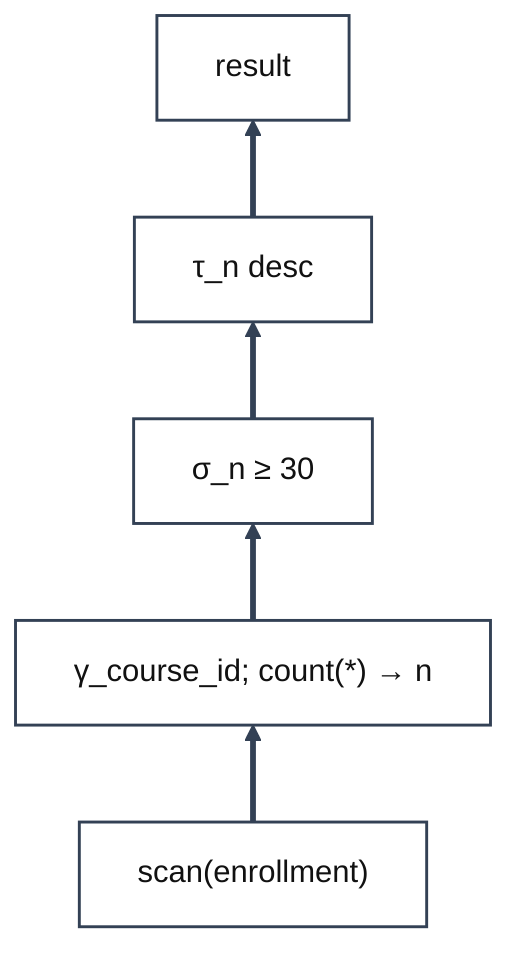

# Day 5 Practice: Relational Algebra II

COP 5725 Database Management Systems, Fall 2026. Ungraded practice following the Monday, August 31 lecture.
Everything here is answerable with the algebra from Days 4 and 5; no SQL is required or expected.
Several questions are deliberately tricky corner cases. Attempt them before reading the solutions; the SQL shown there is only a preview of what we build starting September 14.
Difficulty ratings: ★☆☆ lecture recall, ★★☆ combines ideas, ★★★ corner case, expect a fight.

## Problem 1: Division

A parts warehouse tracks which supplier ships which part.

- `supplies(sid, pid)` records that supplier `sid` ships part `pid`
- `red_parts(pid)` lists the parts painted red

(a) ★☆☆ Write an algebra expression for the suppliers who supply **every** part in `red_parts`. The division operator ÷ is allowed.

(b) ★★★ The corner case: suppose the paint shop closed and `red_parts` is **empty**. What does your expression return? Justify it from the definition of ÷, with its "for every $s \in S$" condition.

## Problem 2: Aggregation

The registrar stores one row per student per course in `enrollment(student_id, course_id)`.

(a) ★★☆ Write an algebra expression for the **average enrollment per course**, a single number. With three courses holding 40, 25, and 10 students, the answer is 25. A hint: it takes two γs, and the outer one has an empty grouping list.

(b) ★★★ The corner case: what does your expression produce when `enrollment` is **empty**? Work it out γ by γ: how many rows does the inner γ return, and how many does the outer γ return?

---

# Problem 3: Read a Plan Tree

The optimizer left behind the plan below, read bottom to top.

(a) ★☆☆ Write the tree as a single nested algebra expression.

(b) ★★☆ Could the σ be pushed **below** the γ, the way selections were pushed toward the base relations on Day 4? Say why or why not.

## Part B: Corner Cases and Exceptions

Short answers, a few sentences each. These probe the edges of the definitions from lecture.

**Problem 4.** ★★☆ $R$ and $S$ have **identical** schemas. Show that $R \bowtie S = R \cap S$. Then the other extreme: what is $R \bowtie S$ when the schemas share **no** attribute names, and which of our three engines refuses to run it?

---

**Problem 5.** ★★★ Day 4 gave the identity $\sigma_{p \lor q}(R) = \sigma_p(R) \cup \sigma_q(R)$. It is only guaranteed under **set** semantics. Give a one-relation example showing it fail under bag semantics, where union adds multiplicities.

**Problem 6.** ★★☆ Let $|R| = r$ and $|S| = s$ under set semantics. Give the minimum and maximum possible sizes of $R \cup S$, $R - S$, and $R \bowtie S$, with a justification and a witness for each bound.

**Problem 7.** ★★★ Using the lecture's tables, compare

$$E_1 = \sigma_{course\_id = \text{'COP5725'}}(student \;⟕\; enrollment)$$

$$E_2 = student \;⟕\; \sigma_{course\_id = \text{'COP5725'}}(enrollment)$$

Are they equal? If not, name a student from the lecture example who appears in one and not the other, and state the general rule this breaks about pushing selections through outer joins.

---

**Problem 8.** ★★★ Division undoes a cross product: $(R \times S) \div S = R$. The other direction fails: $(R \div S) \times S \subseteq R$ always holds, but equality can fail. Prove the containment, then give a smallest-possible $R$ and $S$ where $(R \div S) \times S \neq R$.

**Problem 9.** ★★☆ Under bag semantics, does $\delta(\pi_A(R)) = \pi_A(\delta(R))$? If not, give a two-row counterexample and state which side is the safe way to compute "distinct values of A."

**Problem 10.** ★★★ The Textbook defines ÷ as the *quotient* and asks you to build it from the core operators (Exercise 2.4.10, p. 58). Do it: express $R(A, B) \div S(B)$ using only π, ×, and −. A hint: first build the set of (candidate, required value) pairs that are *missing* from $R$.

---

# Solutions

## Problem 1

(a) $supplies \div red\_parts$

(b) Every supplier in $\pi_{sid}(supplies)$ qualifies, so the answer is $\pi_{sid}(supplies)$ itself.

Why: the definition keeps a candidate $t$ when $(t, s) \in R$ holds **for every** $s \in S$. A universally quantified statement over an empty set is vacuously true: there is no $s$ that could witness a failure. Logic texts call this vacuous truth, and it is not a convention you get to skip; it is forced by wanting "for every" to be the negation of "there exists a counterexample." With $S$ empty, no counterexample can exist.

Source: the Day 5 division example; the operator is the Textbook's quotient (Exercise 2.4.10, p. 58).
SQL preview (Sept 14): `SELECT s.sid FROM supplies s JOIN red_parts r ON s.pid = r.pid GROUP BY s.sid HAVING count(DISTINCT s.pid) = (SELECT count(*) FROM red_parts);` — and amusingly this returns **no** rows on an empty `red_parts`, because the join produces no rows and therefore no groups. The standard SQL encoding disagrees with the algebra on exactly this corner.

## Problem 2

(a) $\gamma_{;\, \text{avg}(n)}\big(\gamma_{course\_id;\; \text{count}(*) \to n}(enrollment)\big)$

(b) The inner γ returns an **empty** relation and the outer γ returns **one** row whose average is undefined (NULL, once we have SQL's word for it).

Why: γ emits one row per group. The inner γ groups by `course_id`, and zero input rows form zero groups. The outer γ has an empty grouping list, which by convention places **all** input rows, even zero of them, into a single group that always exists; that is why an aggregate with no grouping can never return zero rows. The two γs in one expression exercise both readings of "no data": no groups versus one empty group. The average over an empty group has no value to give, so the one row carries an undefined entry.

Source: the degenerate-γ cases from the Day 5 aggregation slide. The one-row convention is how SQL defines it: the PostgreSQL SELECT reference states that an aggregate query without GROUP BY produces a single result row.
SQL preview: `SELECT avg(n) FROM (SELECT count(*) AS n FROM enrollment GROUP BY course_id) per_course;` returns one row holding NULL on an empty table.

---

# Solutions, Continued

## Problem 3

(a) $\tau_{n\, desc}\big(\sigma_{n \geq 30}\big(\gamma_{course\_id;\; \text{count}(*) \to n}(enrollment)\big)\big)$

(b) No.

Why: the attribute $n$ does not exist below the γ; the aggregation creates it. Day 4's push-down laws all rest on one premise: the operators being reordered leave the selection's attributes untouched. Formally, $\sigma_p(op(R)) = op(\sigma_p(R))$ requires every attribute in $p$ to exist in $R$ with the same values, and here $p$ mentions $n$, which $enrollment$ does not have. A selection can never move below the operator that computes the attribute it tests. This distinction resurfaces on September 14 as SQL's two filters, one before grouping and one after.

Source: the Day 5 plan-tree slide; push-down laws from Day 4 (Textbook §16.2.3, p. 772).

## Problem 4

Identical schemas: $R \bowtie S = R \cap S$. No shared attributes: $R \bowtie S = R \times S$, and DuckDB refuses to run it.

Why, for the first claim: natural join pairs $t_1 \in R$ with $t_2 \in S$ when they agree on every **shared** attribute, and with identical schemas every attribute is shared. Agreeing on every attribute means $t_1 = t_2$, so a tuple appears in the result exactly when that one tuple is in both $R$ and $S$ — the definition of intersection. (The result schema is also unchanged, since the join merges the duplicated columns.) For the second claim: with nothing shared, the agreement condition is empty and every pairing survives, which is the cross product. PostgreSQL and SQLite do this silently; DuckDB raises "No columns found to join on."

Source: the Day 5 "When Natural Join Goes Wrong" slide; the cross-product degeneration is documented in the PostgreSQL manual (Queries: Table Expressions, §7.2.1.1), and the engine behavior was verified on DuckDB 1.5.5 and SQLite 3.51.

---

# Solutions, Continued

## Problem 5

Take $R(x)$ holding the single row $(3)$, with $p: x > 1$ and $q: x > 2$. Then $\sigma_{p \lor q}(R)$ contains $(3)$ once, but under additive bag union $\sigma_p(R) \cup \sigma_q(R)$ contains $(3)$ **twice**.

Why: count multiplicities. A tuple $t$ with multiplicity $m$ in $R$ appears in $\sigma_{p \lor q}(R)$ with multiplicity $m$ when it satisfies either predicate. On the right side it appears with multiplicity $m$ in each branch it satisfies, and bag union **adds** the counts, giving $2m$ when $t$ satisfies both. The two sides agree exactly when no tuple satisfies both predicates, so the identity survives on bags only with that extra condition — or after wrapping the union in δ.

Source: Day 4's algebraic laws and its set-versus-bag warning; bag semantics is Textbook §5.1.1–5.1.3, p. 206–208, and the predicate-splitting laws are §16.2.2, p. 770.

## Problem 6

- $R \cup S$: minimum $\max(r, s)$, maximum $r + s$. The union can never be smaller than its larger input, and every element comes from one of the two inputs. Witnesses: $S \subseteq R$ attains the minimum, disjoint relations attain the maximum.
- $R - S$: minimum $\max(r - s, 0)$, maximum $r$. Each element of $S$ removes at most one element of $R$, and removal can never add rows. Witnesses: $S \subseteq R$ (with $s \leq r$) attains the minimum, disjoint relations attain the maximum.
- $R \bowtie S$: minimum $0$, maximum $r \cdot s$. Nothing forces any pair to agree on the shared attributes, and each result row comes from one (R, S) pair, so the count cannot exceed the number of pairs. Witnesses: disjoint join values attain the minimum; all tuples sharing a single common-attribute value attain the maximum, where the join is the cross product in disguise.

Source: a classic exercise; these same bounds are what the optimizer's size estimates approximate when it costs a plan (Textbook §16.4, p. 792).

---

# Solutions, Continued

## Problem 7

Not equal. Bob appears in $E_2$ and not in $E_1$.

Why: write the outer join as two parts, the inner join plus the padded rows for unmatched students. In $E_1$ the σ runs over both parts; Bob's padded row carries a NULL `course_id`, the comparison with 'COP5725' is not true on NULL, and the σ drops him. In $E_2$ the σ runs first, shrinking `enrollment` to the COP5725 rows, and the outer join then pads **every** student without a COP5725 enrollment, Bob included. The general rule: a selection on attributes of the NULL-padded side commutes with the inner-join part but not with the padding, both because the padding manufactures NULLs the predicate was never meant to see and because shrinking the inner relation changes *which* rows get padded. Pushing selections through outer joins is invalid in both directions.

Source: the Day 5 outer-join slides (Textbook §5.2.7, p. 219); Bob is the unmatched student from the lecture's running example.

## Problem 8

Containment proof: take any tuple of $(R \div S) \times S$; it has the form $(t, s)$ with $t \in R \div S$ and $s \in S$. Membership in $R \div S$ means precisely that $(t, s') \in R$ for every $s' \in S$, and $s$ is such an $s'$, so $(t, s) \in R$. Every tuple of the left side is in $R$.

Equality fails on $R = \{(a, 1), (a, 2), (b, 1)\}$, $S = \{1, 2\}$: here $R \div S = \{a\}$ and $(R \div S) \times S = \{(a, 1), (a, 2)\}$, which is missing $(b, 1)$. The row lost is exactly a *partial* pairing: $b$ covers some of $S$ but not all of it, so division discards $b$, and the cross product can only rebuild complete pairings. $(R \div S) \times S$ is the largest "complete rectangle" inside $R$, and $R$ equals it only when $R$ contains no partial coverage.

Source: companion property to the Textbook's quotient exercise (Exercise 2.4.10, p. 58).

---

# Solutions, Continued

## Problem 9

They differ on bags. Take $R(A, B) = \{(1, x), (1, y)\}$. Then $\delta(R) = R$, since the two **rows** are distinct, and $\pi_A(\delta(R)) = \{1, 1\}$ still holds a duplicate. The other side, $\delta(\pi_A(R)) = \{1\}$, is the safe form.

Why: δ compares whole tuples, and projection is not injective — two tuples that differ somewhere can become equal once the differing attributes are projected away. So duplicates can be *born* above a δ that already ran. The δ must therefore sit outside the projection to guarantee a set. The containment that always holds is one-directional: $\delta(\pi_A(R))$ equals $\pi_A(\delta(R))$ *as sets*, but only the first is duplicate-free as a bag.

Source: the bag-semantics discussion of projection, Textbook §5.1.1–5.1.2, p. 206–208.

## Problem 10

$$R \div S \;=\; \pi_A(R) \;-\; \pi_A\big(\,(\pi_A(R) \times S) - R\,\big)$$

Why this is correct, reading inside out: $\pi_A(R) \times S$ is every (candidate, required value) pair that *would* exist if every candidate covered everything. Subtracting $R$ leaves exactly the pairs a candidate is **missing**. Projecting to $A$ names the candidates with at least one missing pair; call that set $D$, the disqualified. A candidate $t$ survives $\pi_A(R) - D$ exactly when no pair $(t, s)$ is missing, that is, when $(t, s) \in R$ for **every** $s \in S$ — which is the definition of $t \in R \div S$. Both directions of the equivalence are immediate: disqualified means some pair is missing, surviving means none is.

As a check, run it against Problem 1(b): with $S$ empty the cross product is empty, nothing is missing, $D$ is empty, and every candidate survives — matching the vacuous-truth answer.

Source: Textbook Exercise 2.4.10, p. 58, which poses exactly this construction.

