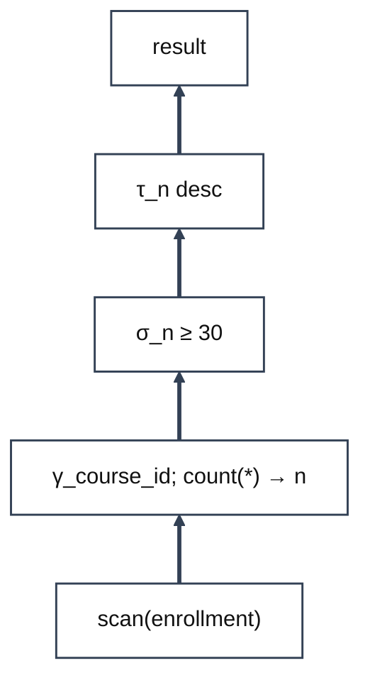

# Day 5 Practice: Relational Algebra II

<div class="handout-meta">

COP 5725 Database Management Systems, Fall 2026. Ungraded practice following the Monday, August 31 lecture.
Attempt every problem before looking at the solutions on the last page. Bring questions to class Wednesday.

</div>

## Problem 1: Division

A parts warehouse tracks which supplier ships which part.

- `supplies(sid, pid)` records that supplier `sid` ships part `pid`
- `red_parts(pid)` lists the parts painted red

Find the suppliers who supply **every** part in `red_parts`.

(a) Write the query in relational algebra. The division operator ÷ is allowed.

<div class="answer-space"></div>

(b) Write the query in SQL, using either the `GROUP BY ... HAVING` count form or the double `NOT EXISTS` form from lecture.

<div class="answer-space"></div>

---

# Problem 2: Aggregation

The registrar stores one row per student per course.

- `enrollment(student_id, course_id)`

Compute the **average enrollment per course**, a single number. For example, with three courses holding 40, 25, and 10 students, the answer is 25.

(a) Write the query in relational algebra using γ. A hint: it takes two aggregations, and the outer one has an empty grouping list.

<div class="answer-space"></div>

(b) Write the query in SQL.

<div class="answer-space"></div>

---

# Problem 3: From Plan Tree to SQL

The optimizer left behind the plan below, read bottom to top. Translate it back into a single SQL query over `enrollment(student_id, course_id)`.



Recall the mapping from lecture: GROUP BY maps to γ, WHERE maps to σ **before** γ, HAVING maps to σ **after** γ, and ORDER BY maps to τ.

<div class="answer-space" style="min-height:180px"></div>

In one sentence, explain why the σ in this plan becomes HAVING and not WHERE.

<div class="answer-space" style="min-height:90px"></div>

---

# Solutions

## Problem 1

(a) Divide the supplies pairs by the red parts, which keeps the suppliers paired with every red part.

$$supplies \div red\_parts$$

(b) The counting form, joining first so only red parts are counted.

```sql
SELECT s.sid
FROM supplies s JOIN red_parts r ON s.pid = r.pid
GROUP BY s.sid
HAVING count(DISTINCT s.pid) = (SELECT count(*) FROM red_parts);
```

## Problem 2

(a) The inner γ counts students per course; the outer γ has an empty grouping list, so the whole intermediate relation is one group producing one row.

$$\gamma_{;\, \text{avg}(n)}\big(\gamma_{course\_id;\; \text{count}(*) \to n}(enrollment)\big)$$

(b) The inner aggregation becomes a subquery in FROM.

```sql
SELECT avg(n) AS avg_enrollment
FROM (SELECT count(*) AS n
      FROM enrollment
      GROUP BY course_id) per_course;
```

## Problem 3

```sql
SELECT course_id, count(*) AS n
FROM enrollment
GROUP BY course_id
HAVING count(*) >= 30
ORDER BY n DESC;
```

The σ sits **above** the γ in the plan, so it filters grouped rows using the aggregate n. A condition on an aggregate is exactly what HAVING expresses; WHERE runs before grouping and cannot see n.
