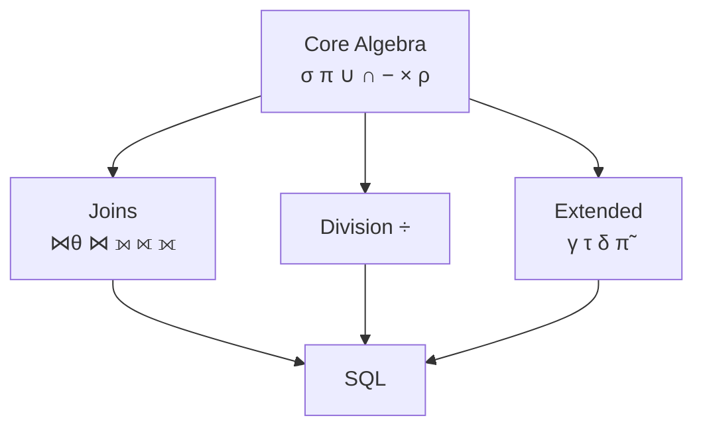
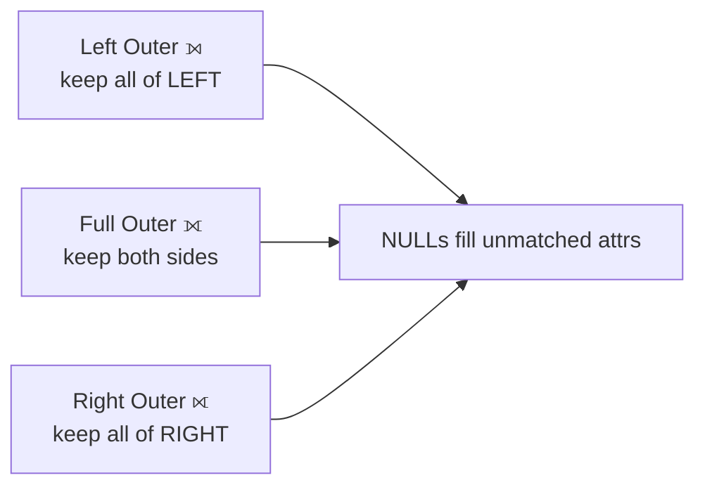
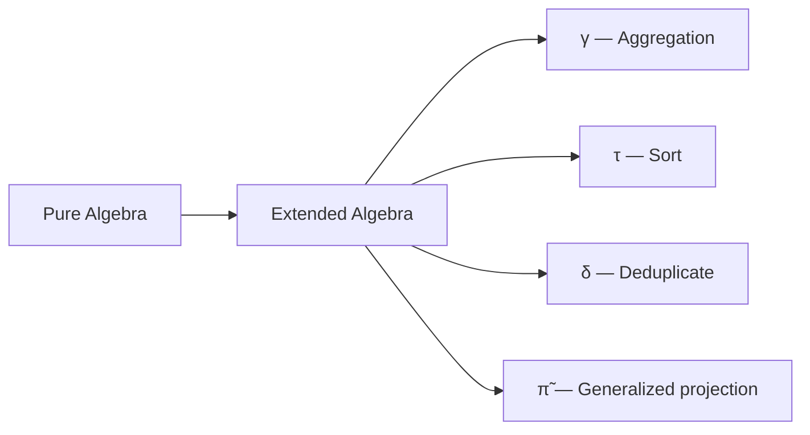
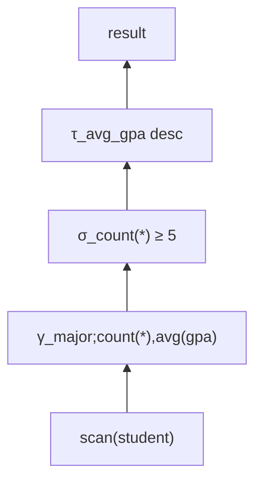

<!-- _class: lead -->

# Day 5: Relational Algebra II

**COP 5725 - Database Management Systems**
Monday, August 31, 2026

Joins, division, and the extended operators

<!--
Open by recapping Friday: six operators (σ, π, ∪, ∩, −, ×) plus ρ.
Ask the class which operator they expect to add today. The answer "join" almost always comes back; use that to motivate why join deserves to be first-class even though it is technically derivable.
Budget ~50 min total. Joins are 20 min; the rest is paced to leave 3-5 min at the end for the handout walkthrough.
-->

---

# Where We Are in the Algebra

<div class="columns-left-wide">
<div>

Friday covered the core operators σ, π, ∪, ∩, −, ×, and ρ.
Today adds three groups on top of them.

1. Joins combine relations by matching values
2. Division finds "all of" relationships
3. Extended operators add aggregation, sort, and computed projection

</div>
<div>



</div>
</div>

<!--
The mermaid graph emphasizes that everything we add today is layered on the seven operators from Friday. Joins and extended operators in particular are conveniences — closure and composition come from the core seven.
-->

---

# Today's Roadmap

1. Joins as cross product + selection
2. Outer joins
3. Division ÷
4. Extended algebra: γ, τ, δ, generalized π
5. SQL ↔ algebra round-trip

<!--
This is the densest algebra day. Pace check at slide 12 (after outer joins). If we are behind, abbreviate division to the one motivating example and skip the formal definition until students see it on the handout.
-->

---

<!-- _class: lead -->

# Part 1: Joins

---

# Joins as Cross Product plus Selection

Every join is a cross product followed by a selection on matching attributes (Textbook §2.4.9, p. 45).

$$R \bowtie_\theta S \;=\; \sigma_\theta(R \times S)$$

The optimizer treats this as a single operator because it can execute the combined form in one pass through memory.
The algebra treats it as one operator because it shows up everywhere.

<!--
Stress that the optimizer's distinction here is not pedantic. A naive cross product blows up to |R| * |S| tuples. A join algorithm (hash, sort-merge, nested loop with predicate pushdown) avoids materializing that intermediate. We will see those algorithms in Section 5, Week 12.
-->

---

# Theta, Equi, and Natural Joins

<div class="columns-3">
<div>

### Theta Join $\bowtie_\theta$

Predicate is any comparison.

$$R \bowtie_{R.x < S.y} S$$

Used when you want a range or inequality.

</div>
<div>

### Equi-Join

Theta join restricted to equality.

$$R \bowtie_{R.id = S.id} S$$

The everyday case. Most indexes target this.

</div>
<div>

### Natural Join $\bowtie$

Equi-join on every common attribute name, with duplicates removed.

$$R \bowtie S$$

Convenient. Dangerous if a column name overlaps by accident.

</div>
</div>

Textbook §2.4.8 (natural joins, p. 43) and §2.4.9 (theta-joins, p. 45).

<!--
Natural join is elegant on paper but a footgun in production: rename one column and your join silently changes. I recommend students write explicit equi-joins in SQL even when the natural form is shorter.
-->

---

# Natural Join Example

<div class="columns">
<div>

**student**

| student_id | name | major |
|-----|------|-------|
| 1 | Ada | CS |
| 2 | Bob | EE |
| 3 | Chia | CS |

**enrollment**

| student_id | course_id |
|-----|--------|
| 1 | COP5725 |
| 1 | COT5405 |
| 3 | COP5725 |

</div>
<div>

**student ⋈ enrollment**

(joins on `student_id`)

| student_id | name | major | course_id |
|-----|------|-------|--------|
| 1 | Ada | CS | COP5725 |
| 1 | Ada | CS | COT5405 |
| 3 | Chia | CS | COP5725 |

Bob disappears: he has no enrollment row, so he matches nothing.

</div>
</div>

<!--
Walk row-by-row through the join for Ada to make the matching concrete. The fact that Bob disappears motivates the next slide on outer joins.
-->

---

<!-- _class: lead -->

# Part 2: Outer Joins

---

# Outer Joins

An inner join drops any row that has no match on the other side.
An outer join keeps it, filling the missing attributes with NULL (Textbook §5.2.7, p. 219).



<!--
Outer joins are how you find what is missing. The classic interview question "find students who have never enrolled" is just student ⟕ enrollment with WHERE enrollment.student_id IS NULL. The NULL filter on the right side is the giveaway.
-->

---

# Left Outer Join Example

<div class="columns">
<div>

**student ⟕ enrollment**

| student_id | name | major | course_id |
|-----|------|-------|--------|
| 1 | Ada | CS | COP5725 |
| 1 | Ada | CS | COT5405 |
| 2 | Bob | EE | NULL |
| 3 | Chia | CS | COP5725 |

</div>
<div>

Bob comes back because he is in the left relation.

His `course_id` is NULL because there is no enrollment row for him.

</div>
</div>

The SQL equivalent:

```sql
SELECT s.*, e.course_id
FROM student s LEFT OUTER JOIN enrollment e USING (student_id);
```

<!--
LEFT vs LEFT OUTER are interchangeable in SQL; the OUTER keyword is optional but worth keeping for clarity. Same for RIGHT and FULL.
-->

---

# Outer Join Replaces Difference

> Find students who have never enrolled.

<div class="columns">
<div>

**With difference**

$$\pi_{student\_id}(student) - \pi_{student\_id}(enrollment)$$

Then join back to student to recover names.

</div>
<div>

**With outer join**

$$\pi_{name}(\sigma_{course\_id\,IS\,NULL}(student \;⟕\; enrollment))$$

Often faster because one scan and one merge replace the second pass.

</div>
</div>

<!--
The optimizer can usually transform one into the other. This is one of the classic rewrites discussed in the Selinger 1979 paper we will read in Section 5. Both are legal answers on quizzes.
-->

---

<!-- _class: lead -->

# Part 3: Division ÷

---

# When Division Shows Up

The English giveaway: **"all"**, **"every"**, **"each"**.

<div class="columns-3">
<div>

> Suppliers who supply *every* part

</div>
<div>

> Students who took *all* required courses

</div>
<div>

> Customers who bought *every* product in a category

</div>
</div>

Division is the algebra operator for these. SQL has no `DIVIDE` keyword, so you spell it out with `NOT EXISTS` or `GROUP BY ... HAVING count(*) = ...`.

---

# Division Defined

Given $R(A, B)$ and $S(B)$:

$$R \div S = \{\, t : t \in \pi_A(R) \,\land\, \forall s \in S,\, (t, s) \in R \,\}$$

In words: $R \div S$ returns the $A$-values from $R$ that are paired with **every** $B$-value in $S$.

<!--
The formal definition is the hardest one of the day. Encourage students to translate this into English on the spot: "for an A-value to qualify, it must appear in R alongside every B-value in S." Then walk through the example.
-->

---

# Division Example

<div class="columns-3">
<div>

**enrollment** (R)

| student_id | course_id |
|-----|--------|
| 1 | COP5725 |
| 1 | COT5405 |
| 1 | CIS4301 |
| 2 | COP5725 |
| 3 | COP5725 |
| 3 | COT5405 |

</div>
<div>

**required** (S)

| course_id |
|--------|
| COP5725 |
| COT5405 |

</div>
<div>

**enrollment ÷ required**

| student_id |
|-----|
| 1 |
| 3 |

Student 2 took only one of the required courses, so they do not qualify.

</div>
</div>

<!--
Take 2 minutes here. Have students explain in their own words why student 2 was filtered out. The mistake to avoid: treating division as set intersection. It is not — it answers a quantifier-over-set question.
-->

---

# Division in SQL

```sql
-- Students who took every required course
SELECT e.student_id
FROM enrollment e, required r
WHERE e.course_id = r.course_id
GROUP BY e.student_id
HAVING count(DISTINCT e.course_id) = (SELECT count(*) FROM required);
```

Or with `NOT EXISTS`:

```sql
SELECT DISTINCT e.student_id FROM enrollment e
WHERE NOT EXISTS (
  SELECT 1 FROM required r
  WHERE NOT EXISTS (
    SELECT 1 FROM enrollment e2
    WHERE e2.student_id = e.student_id AND e2.course_id = r.course_id
  )
);
```

<!--
The double-NOT-EXISTS form is the classic relational-calculus translation but very hard to read. In practice the GROUP BY ... HAVING count form is preferred. Both produce the same plan in PostgreSQL after rewrite.
-->

---

<!-- _class: lead -->

# Part 4: Extended Algebra

---

# Limits of the Pure Algebra

The pure algebra (σ, π, ∪, ∩, −, ×, ρ, ⋈, ÷) cannot express:

- "Average salary per department"
- "Top 5 students by GPA"
- "All distinct majors"
- "name as `Last, First`"

We extend the algebra with three operators plus a generalized projection (Textbook §5.2, p. 213).



<!--
The point of this slide is that SQL's expressiveness is exactly the extended algebra. Optimizers translate SQL into trees of these operators. By Week 12 students will read plans whose nodes are labeled with these symbols.
-->

---

# Aggregation γ

$$\gamma_{G, A_1, A_2, ...; F_1(B_1), F_2(B_2), ...}(R)$$

- $G, A_1, ...$ are grouping attributes
- $F_i(B_i)$ are aggregate functions over attribute $B_i$

Aggregate functions: `count`, `sum`, `avg`, `min`, `max` (Textbook §5.2.4, p. 216).

<div class="columns">
<div>

### Algebra

$$\gamma_{major; \text{avg}(gpa)}(student)$$

</div>
<div>

### SQL

```sql
SELECT major, AVG(gpa)
FROM student
GROUP BY major;
```

</div>
</div>

---

# Sort τ

$$\tau_{A_1, A_2, ...}(R)$$

Returns the tuples of $R$ in the order given by the listed attributes (Textbook §5.2.6, p. 219).

Sort breaks set semantics because the result is a *list*, not a relation. This is why SQL allows `ORDER BY` only on the **outermost** query.

<div class="columns">
<div>

### Algebra

$$\tau_{gpa\,desc}(student)$$

</div>
<div>

### SQL

```sql
SELECT * FROM student
ORDER BY gpa DESC;
```

</div>
</div>

<!--
Brief note: subqueries cannot have ORDER BY in standard SQL (PostgreSQL allows it as an extension, but the order is not preserved through downstream operators). This is the algebra reason why.
-->

---

# Duplicate Elimination δ

$$\delta(R)$$

Returns $R$ with duplicate tuples removed. Turns a bag back into a set (Textbook §5.2.1, p. 214).

Algebra operators preserve set semantics by default, so δ rarely appears explicitly in algebra expressions. It is essential when reasoning about the bag-semantics of real SQL.

<div class="columns">
<div>

### Algebra

$$\delta(\pi_{major}(student))$$

</div>
<div>

### SQL

```sql
SELECT DISTINCT major FROM student;
```

</div>
</div>

---

# Generalized Projection $\tilde{\pi}$

Standard projection picks attributes by name.
Generalized projection allows computed expressions (Textbook §5.2.5, p. 217).

<div class="columns">
<div>

### Algebra

$$\tilde{\pi}_{last \,\|\, ',\,\,' \,\|\, first, \,gpa \times 25}(student)$$

</div>
<div>

### SQL

```sql
SELECT last || ', ' || first AS fullname,
       gpa * 25 AS percent
FROM student;
```

</div>
</div>

Many texts write this as plain π. We keep the tilde when we want to emphasize that the column came from a computation.

---

<!-- _class: lead -->

# Part 5: SQL ↔ Algebra Round-Trip

---

# Translating a Complete Query

> Average GPA per major, only majors with at least 5 students, sorted by average descending.

<div class="columns">
<div>

### Algebra

$$\tau_{avg\_gpa\,desc}\big( \sigma_{n \geq 5}\big( \gamma_{major; \text{count}(*) \to n, \text{avg}(gpa) \to avg\_gpa}(student) \big) \big)$$

Three operators: γ, σ, τ.

</div>
<div>

### SQL

```sql
SELECT major,
       count(*) AS n,
       avg(gpa) AS avg_gpa
FROM student
GROUP BY major
HAVING count(*) >= 5
ORDER BY avg_gpa DESC;
```

Four clauses: SELECT, GROUP BY, HAVING, ORDER BY.

</div>
</div>

<!--
The mapping is consistent: WHERE → σ before γ, HAVING → σ after γ, GROUP BY → γ, ORDER BY → τ, SELECT → π or π̃. Drive this mapping until it is automatic; students will read plans in this shape all semester.
-->

---

# A Plan Tree



This is what `EXPLAIN` will show you in Section 5.
The plan is an algebra expression drawn vertically.

<!--
Foreshadow Week 9: Storage and Indexing. When we read execution plans there, students should recognize this same shape with physical operators (Hash Aggregate, Filter, Sort) replacing the logical ones (γ, σ, τ).
-->

---

# Wrap-up

- Every join is a cross product followed by a selection; theta, equi, and natural joins differ only in the predicate.
- Outer joins keep unmatched rows and fill the missing attributes with NULL.
- Division answers "all of" questions; SQL expresses it with GROUP BY/HAVING or double NOT EXISTS.
- The extended operators γ, τ, δ, and $\tilde{\pi}$ give the algebra the expressiveness of SQL.
- WHERE maps to σ before γ, HAVING maps to σ after γ, GROUP BY maps to γ, and ORDER BY maps to τ.

<!--
The full operator inventory is now on the table: core seven from Friday, joins, division, and the extended operators today. Remind students that the SQL-to-algebra mapping in the last bullet is the shape of every EXPLAIN plan they will read later in the term.
-->

---

# Wednesday

Topic: ER modeling. Designing a schema with entities and relationships before committing to tables.

Reading: Textbook §4.1-4.5, pp. 125-163.

---

# Practice Before Wednesday

Three more problems on the handout in the day-5 folder:

1. Find suppliers who supply every part in `red_parts`.
2. Express the average enrollment per course in algebra and SQL.
3. Translate this plan tree back into a SQL query.

Answers due in your repo before 8:30 AM Wed Sep 2.

<!--
Problem 3 is the hardest — it goes from a plan tree (what the optimizer sees) back up to surface SQL. This is a skill students need by Section 5; introducing it on a low-stakes handout gives them a chance to fail safely.
-->

---

# Questions

What is on your mind?

Project 1 ships Wednesday. Project 0 setup remains due Fri Sep 4.
