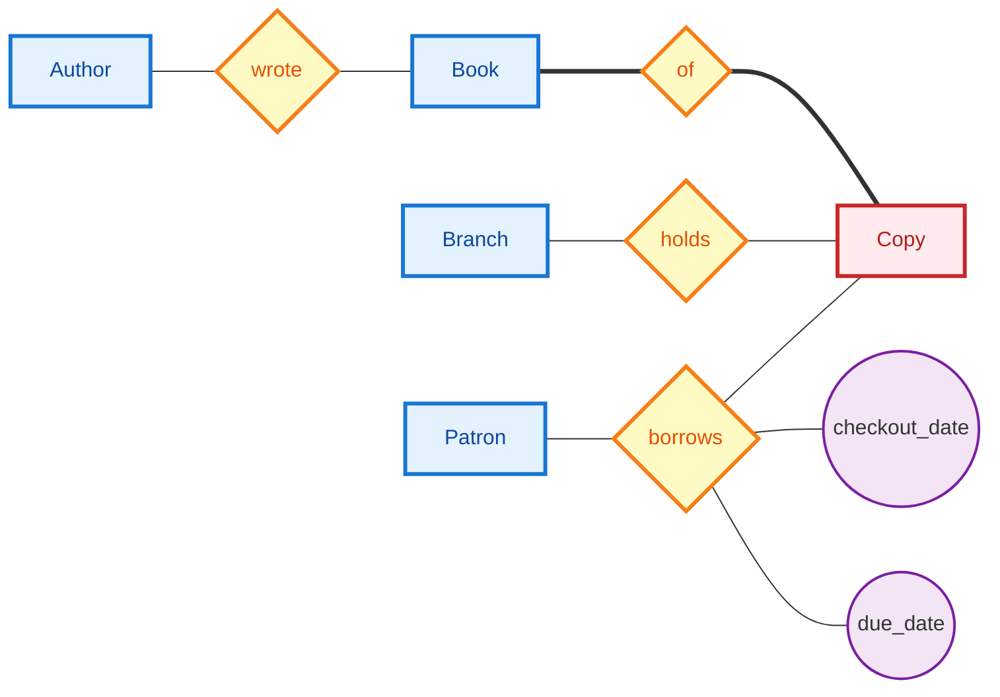

# Day 6 Practice: ER Modeling

COP 5725 Database Management Systems, Fall 2026. Ungraded practice following the Wednesday, September 2 lecture.
Attempt every problem before looking at the solutions on the last pages. Bring questions to class Friday.

## Problem 1: The Library Scenario

> A county library system runs several branches. The library catalogs books; each book has one or more authors, and an author can write many books. Each branch holds physical copies of books; a copy sits at exactly one branch and is identified by a copy number within its book. Patrons register with the library and borrow copies; each borrowing records a checkout date and a due date.

(a) List the nouns and classify each as an entity set, an attribute, or something that returns in another role.

(b) Draw the ER diagram in Chen notation: entities, relationships, attributes with keys underlined, and cardinalities on every relationship. Mark any weak entity with a double border.

(c) Name one judgment call you made from the design-decision checklist and defend it in a sentence.

---

# Problem 2: Cardinality Identification

Classify each relationship as 1:1, 1:N, or M:N. Where the answer depends on an assumption, state the assumption; several of these are 1:N read one way and M:N read another.

1. Country **has** capital City. ______
2. Customer **places** Order. ______
3. Order **contains** Product. ______
4. Employee **is assigned** parking Permit. ______
5. Author **writes** Book. ______
6. Department **offers** Course. ______
7. Patient **has** primary-care Physician. ______
8. Student **has** Transcript. ______
9. Flight **departs from** Airport. ______
10. Actor **appears in** Film. ______

State each answer with its direction, for example "N:1 from Order to Customer."

## Problem 3: Find the Weak Entities

An e-commerce database describes the following.

> Customers place orders; each order has a system-assigned order number. An order is made of line items, numbered 1, 2, 3, … within their order; each line item names a product and a quantity. Products live in a catalog with unique SKUs. An order can ship in several shipments, numbered within the order. A customer may write at most one review per product.

Identify every weak entity set. For each, give its owner, its identifying relationship, and its partial key. One of the candidates is better modeled as something other than a weak entity; say which and why.

---

# Solutions

## Problem 1

(a) Book, Author, Branch, Patron, and Copy name things and become entity sets. Copy number, checkout date, and due date are attributes. "Library system" names the whole enterprise and gets no box.

(b) One correct diagram:

Cardinalities: `wrote` is M:N, `of` is N:1 into Book, `holds` is N:1 into Branch, and `borrows` is M:N.
Copy is weak: its identity is (book, copy_num), so `of` is the identifying relationship and `copy_num` the partial key.

(c) The sharpest judgment call is `borrows`. As drawn, one (patron, copy) pair can appear only once, so a patron who borrows the same copy twice breaks the model. Fixes include putting `checkout_date` into the relationship's identity or promoting the borrowing to a Loan entity. Either answer earns full credit if the problem is named.

---

# Solutions, Continued

## Problem 2

1. 1:1 (one capital per country, one country per capital)
2. 1:N from Customer to Order
3. M:N (an order holds many products; a product appears in many orders)
4. 1:1 (assuming one permit per employee and one employee per permit)
5. M:N (stated in Problem 1's scenario)
6. 1:N from Department to Course, as in the registrar diagram
7. N:1 from Patient to Physician (a physician sees many patients)
8. 1:1 (a transcript belongs to exactly one student)
9. N:1 from Flight to Airport, for the departure role only
10. M:N (casts and filmographies both have many members)

## Problem 3

LineItem is weak: owner Order, identifying relationship "part of," partial key `line_num`.
Shipment is weak: owner Order, identifying relationship "ships," partial key `shipment_num`.
Customer, Order, and Product are strong; each carries its own key (Order's number is system-assigned and global, so Order does not lean on Customer).
Review is the trick: "at most one review per customer per product" makes it a relationship between Customer and Product with attributes, the same shape as `grade` on `enrolls in`. Modeling it as a weak entity owned by two entity sets is defensible, but the relationship reading is simpler and says the same thing.
