<!-- _class: lead -->

# Day 6: Entity-Relationship Modeling

**COP 5725 - Database Management Systems**
Wednesday, September 2, 2026

Entities and relationships before tables

<!--
First non-algebra day in the section. Students will arrive expecting more math; instead we shift mode entirely into design thinking. The hour is heavily interactive — multiple "your turn" prompts. Pace: 50 min with the last 12 min on the full worked example.
-->

---

# Where We Are

The first five classes covered manipulating relations with the algebra and SQL.
Today covers designing them.

ER modeling sits between a domain expert and a SQL `CREATE TABLE` statement. It is the layer where you reason about the world before you commit to a schema (Textbook §4.1, p. 126).

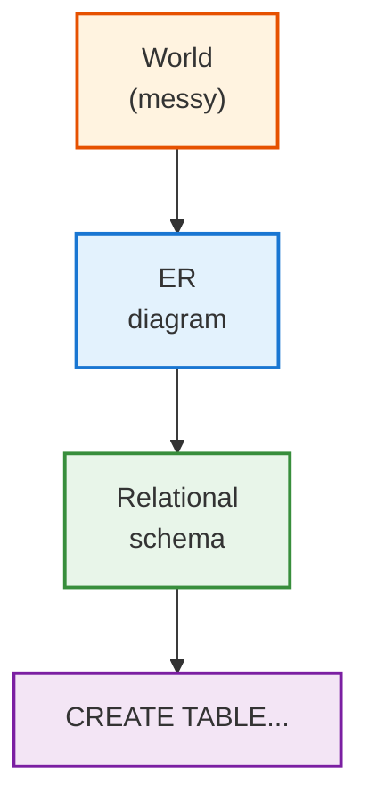
```mermaid
graph TB
  W["World<br/>(messy)"] --> ER["ER<br/>diagram"]
  ER --> SCH["Relational<br/>schema"]
  SCH --> SQL["CREATE TABLE..."]
  classDef world fill:#fff3e0,stroke:#e65100,stroke-width:2px
  classDef er fill:#e3f2fd,stroke:#1976d2,stroke-width:2px
  classDef sch fill:#e8f5e9,stroke:#388e3c,stroke-width:2px
  classDef sql fill:#f3e5f5,stroke:#7b1fa2,stroke-width:2px
  class W world
  class ER er
  class SCH sch
  class SQL sql
```

<!--
The diagram is the entire premise of the lecture. ER is not optional theory — it is the rehearsal stage where mistakes are cheap. Jumping straight from a problem description to a CREATE TABLE statement is the single most common rookie failure.
-->

---

# Today's Roadmap

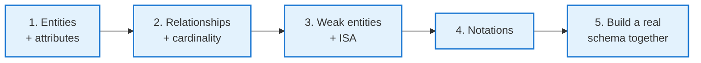
```mermaid
graph LR
  P1["1. Entities<br/>+ attributes"] --> P2["2. Relationships<br/>+ cardinality"]
  P2 --> P3["3. Weak entities<br/>+ ISA"]
  P3 --> P4["4. Notations"]
  P4 --> P5["5. Build a real<br/>schema together"]
  classDef step fill:#e3f2fd,stroke:#1976d2,stroke-width:2px
  class P1,P2,P3,P4,P5 step
```

Color code we will use the whole hour:

Entities
Solid blue rectangles.

Relationships
Yellow diamonds.

Weak entities
Red, double border.

attributes are purple ovals. keys are underlined.

<!--
Drill the color code now. By the end of the hour, students should see "blue means thing, yellow means action between things, red means dependent thing." The color reinforcement compounds.
-->

---

# Why ER Comes Before SQL

### Designing in tables forces premature decisions

- "Should this be one table or two?" You don't know yet.
- "Should this be a column or a separate row?" Depends on cardinality.
- "Where does the foreign key go?" Depends on the relationship type.

### ER lets you reason in concepts

- "This is a Student"
- "Students take Courses"
- "A Course has Sections"

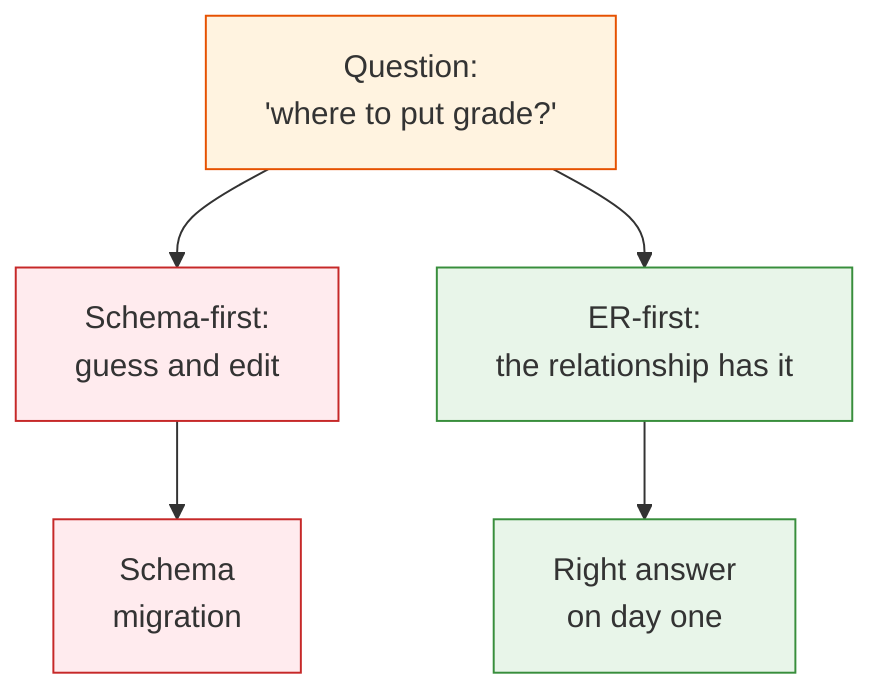
```mermaid
graph TD
  Q["Question:<br/>'where to put grade?'"]
  Q --> S["Schema-first:<br/>guess and edit"]
  Q --> E["ER-first:<br/>the relationship has it"]
  S --> Bad["Schema<br/>migration"]
  E --> Good["Right answer<br/>on day one"]
  classDef q fill:#fff3e0,stroke:#e65100
  classDef bad fill:#ffebee,stroke:#c62828
  classDef good fill:#e8f5e9,stroke:#388e3c
  class Q q
  class S,Bad bad
  class E,Good good
```

<!--
The "where does grade live" question is the classic ER teaching moment. Students who try to model it as a column on student or on course will hit walls. The relationship-with-attributes answer falls out naturally from ER thinking.
-->

---

<!-- _class: lead -->

# Part 1: Entities and Attributes

---

# What Is an Entity?

An **entity** is a distinguishable thing in the world.

- A specific student named Ada
- The course COP 5725
- The Computer Science department

An **entity set** is a collection of entities of the same kind (Textbook §4.1.1, p. 126).

- All students
- All courses

We draw entity *sets*, not individual entities.

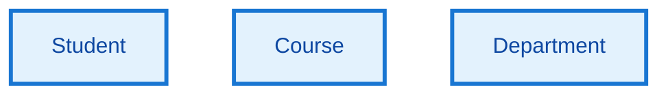
```mermaid
graph TB
  S["Student"]
  C["Course"]
  D["Department"]
  classDef entity fill:#e3f2fd,stroke:#1976d2,stroke-width:3px,color:#0d47a1
  class S,C,D entity
```

Three entity sets we will work with today.

<!--
Vocabulary note: most texts call the diagram element an "entity," even though it represents an entity *set*. Codd would have insisted on "relation" for the set. We use the loose language because it is universal.
-->

---

# Attribute Kinds

Four kinds of attribute. The first is easy. The other three force design choices.

The Textbook's E/R model keeps attributes primitive and treats struct-valued (composite) and set-valued (multi-valued) attributes as variations (Textbook §4.1.2, p. 126–127). Derived attributes come from the wider ER tradition.

<!--
Composite attributes invite the question "should I split this in the schema?" Derived attributes invite "should I store this or compute it?" Multi-valued attributes invite "is this really one attribute, or a separate entity?"
-->

---

# Building the Student Entity

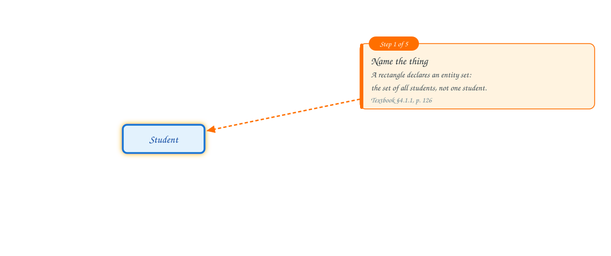

::: appear
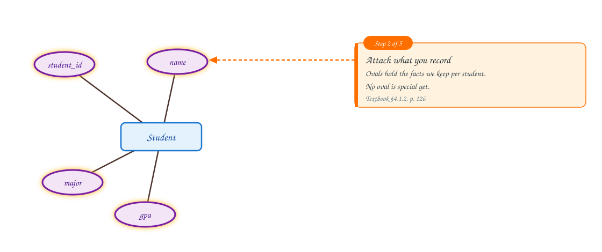
:::

::: appear
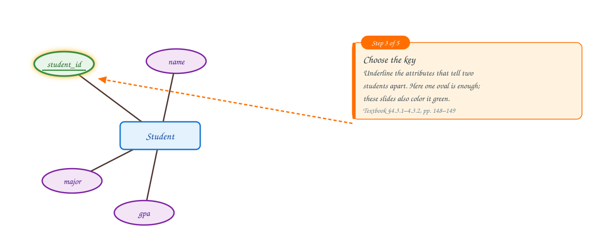
:::

::: appear
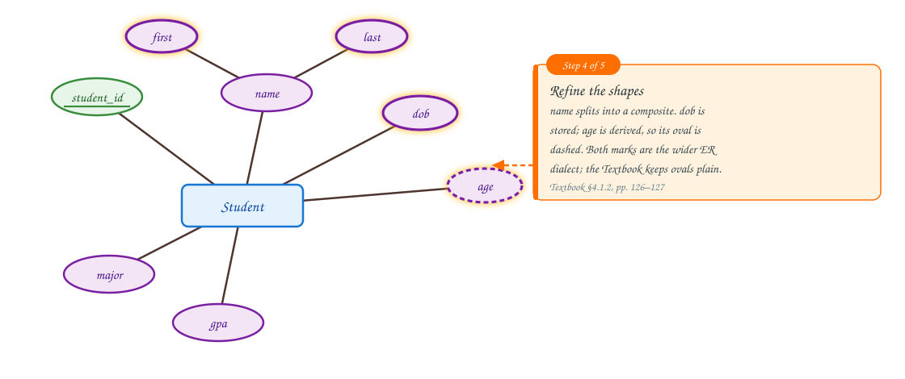
:::

::: appear
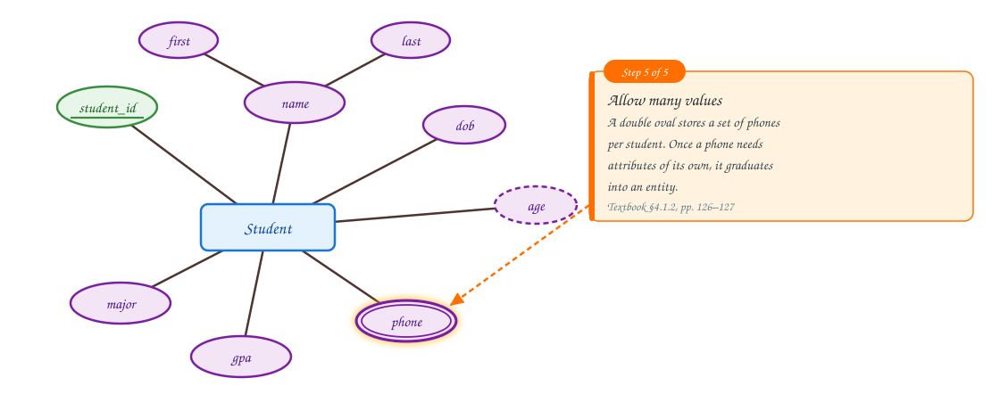
:::

::: appear

**Your turn:** Should `phone` be a separate entity? When would you split it?

:::

<!--
Present from the HTML deck: each right-arrow reveals the next annotated step in place. The PDF handout prints one page per step.
Step 1: just the box. We know we have students; we do not yet know what we record about them. Hold it briefly.
Step 2: the obvious simple attributes arrive as ovals.
Step 3: pick the key. On paper you underline it; this deck also colors it green (Textbook §4.3.2, p. 149).
Step 4: name becomes a composite and dob arrives with derived age. Derived attributes raise the storage-vs-compute question; we decide on Day 7, the diagram only captures intent.
Step 5: the double oval allows many phone numbers. Then the prompt. The answer: split phone into an entity when a phone needs attributes of its own (type, primary/secondary, verified flag). Otherwise keep it multi-valued; Day 7 turns it into a separate table anyway.
The build is intentional pacing. A useful diagram emerges from a sequence of small decisions, not in one heroic moment.
-->

---

<!-- _class: lead -->

# Part 2: Relationships and Cardinality

Cardinality of a relationship: how many entities on one side can pair with each entity on the other. Day 4 used the same word for |R|, a relation's tuple count.

---

# What Is a Relationship?

A **relationship** is an association between two or more entities.

- A student *enrolls in* a course
- A faculty member *teaches* a section
- A course *belongs to* a department

A **relationship set** is the collection of all such associations (Textbook §4.1.3, p. 127).

We draw relationship sets as yellow diamonds between the entity boxes they connect.

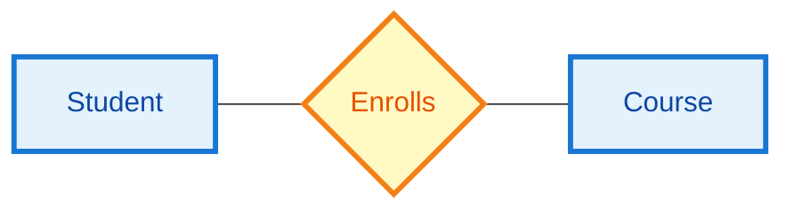
```mermaid
graph LR
  S["Student"] --- E{"Enrolls"} --- C["Course"]
  classDef entity fill:#e3f2fd,stroke:#1976d2,stroke-width:3px,color:#0d47a1
  classDef rel fill:#fff9c4,stroke:#f57f17,stroke-width:3px,color:#e65100
  class S,C entity
  class E rel
```

<!--
Relationships are verbs. If students struggle to find them, prompt with "What action connects these things?" Verbs reveal relationships.
-->

---

# Cardinality Patterns

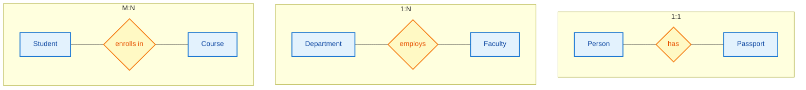
```mermaid
graph TB
  subgraph OneOne["1:1"]
    A1["Person"] --- R1{"has"} --- B1["Passport"]
  end
  subgraph OneN["1:N"]
    A2["Department"] --- R2{"employs"} --- B2["Faculty"]
  end
  subgraph MN["M:N"]
    A3["Student"] --- R3{"enrolls in"} --- B3["Course"]
  end
  classDef entity fill:#e3f2fd,stroke:#1976d2,stroke-width:2px,color:#0d47a1
  classDef rel fill:#fff9c4,stroke:#f57f17,stroke-width:2px,color:#e65100
  class A1,B1,A2,B2,A3,B3 entity
  class R1,R2,R3 rel
```

These three patterns cover almost every real-world association (Textbook §4.1.6, p. 129).

Notation varies. This deck writes 1, N, M at the line ends; the Textbook instead draws an arrow into an entity set to say "at most one" (§4.1.6, p. 129). Same constraint, different ink.

---

# Cardinality Examples

### 1:1
Each person has at most one passport.
Each passport belongs to at most one person.

### 1:N
Each department employs many faculty.
Each faculty member belongs to one department.

### M:N
Each student enrolls in many courses.
Each course enrolls many students.

**Your turn:** Classify these.

1. Customer **places** Order
2. User **has** Profile
3. Author **writes** Book
4. Section **meets in** Room (one room per term)

<!--
Answers: 1) 1:N (one customer, many orders) 2) 1:1 (one profile per user) 3) M:N (a book can have several authors, an author writes several books) 4) M:N if rooms are reused across terms, or 1:N if we narrow to "a section per term." This last one is the kind of subtlety students miss; cardinality depends on time scope.
-->

---

# Total and Partial Participation

**Total participation**: every entity must participate.

- Every employee must work in a department.
- Every section must belong to a course.

Drawn with a double line.

**Partial participation**: an entity may or may not participate.

- Not every faculty member supervises another.
- Not every student is enrolled in a course this term.

Drawn with a single line.

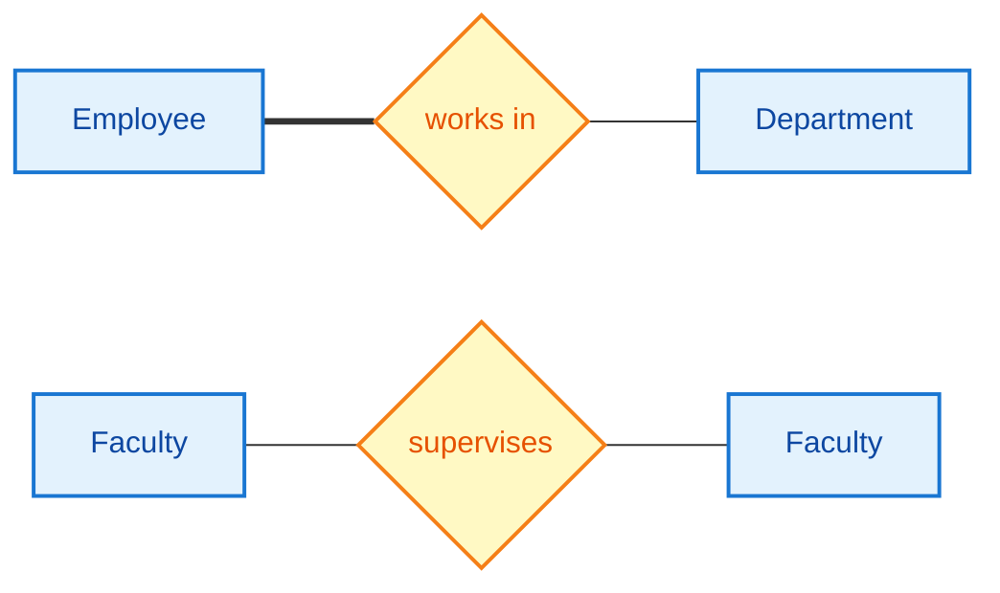
```mermaid
graph LR
  E1["Employee"] === R1{"works in"}
  R1 --- D1["Department"]
  F["Faculty"] --- S{"supervises"}
  S --- F2["Faculty"]
  classDef entity fill:#e3f2fd,stroke:#1976d2,stroke-width:2px,color:#0d47a1
  classDef rel fill:#fff9c4,stroke:#f57f17,stroke-width:2px,color:#e65100
  class E1,D1,F,F2 entity
  class R1,S rel
```

Top: employee participation is total (double line).
Bottom: faculty supervision is partial.

The double line is the wider ER tradition's mark. The Textbook instead draws a rounded arrow into an entity set for "exactly one" (§4.3.3, p. 150) and writes other bounds as degree constraints (§4.3.4, p. 151).

<!--
The classroom mnemonic: total = "must," partial = "may." A double line says "must." This will matter on Friday when we translate to schemas — total participation can force NOT NULL on the FK.
-->

---

# The Textbook's Arrows

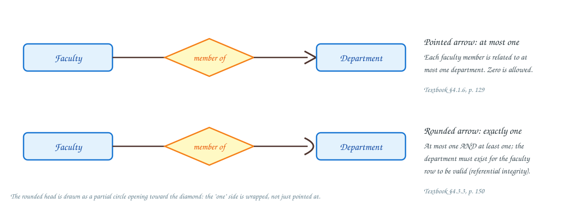

A pointed arrowhead into an entity set says **at most one**; the rounded head, a partial circle wrapping the "one" side, strengthens it to **exactly one**.

<!--
This slide makes the previous slide's note concrete. Read the rounded head as a hug: the arrow does not just point at Department, it wraps it, so the department must be there. Exactly one = at most one (the pointed arrow's promise) + at least one (total participation). On Friday the rounded arrow becomes a NOT NULL foreign key; the pointed arrow becomes a nullable one.
-->

---

# Building a Relationship

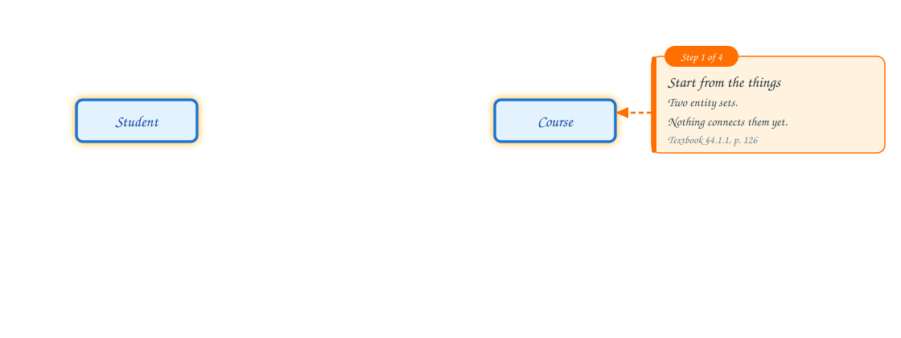

::: appear
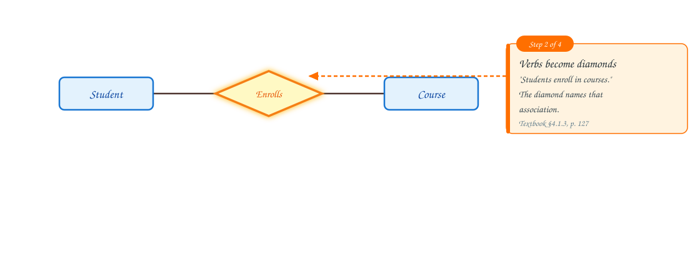
:::

::: appear
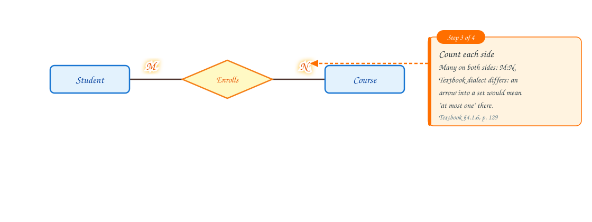
:::

::: appear
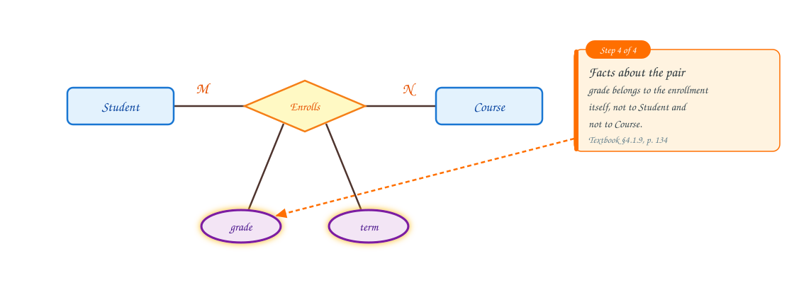
:::

::: appear

**Common error:** Putting `grade` on `Student` (one grade?) or on `Course` (whose grade?).

:::

<!--
Step 1: two entity sets and no connection. Ask the class for the verb before revealing.
Step 2: the diamond, labeled with the verb. The verb names what the diamond means.
Step 3: cardinality. Many students enroll in many courses, so M:N. Mention the dialect gap here: the Textbook draws an arrow into the "at most one" side instead of writing letters (§4.1.6, p. 129).
Step 4: grade and term hang off the diamond. They are properties of the enrollment, not of the student or the course (§4.1.9, p. 134). The common-error box lands after the last step; this is the payoff moment of the lecture.
-->

---

<!-- _class: lead -->

# Part 3: Weak Entities and ISA

---

# Weak Entities

A **weak entity** is one whose identity depends on another entity (Textbook §4.4, p. 152).

A Section of a course has no meaning without its course. `Section 001` of `COP 5725` is identified only by **both** values together.

Drawn with the Textbook's marks (§4.4.3, p. 156):
- Double border on the weak entity set
- Double-diamond *identifying relationship*
- Partial key (dashed underline)

The red tint is this deck's color code, layered on top of the standard double border.

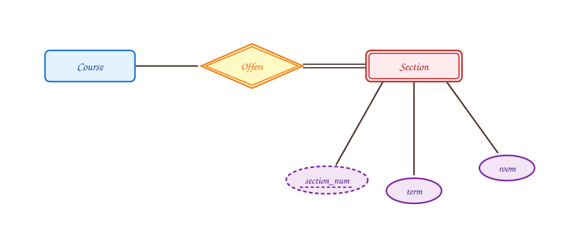

<!--
The Section example is the standard. Other classic weak entities: LineItem (owned by Order), Dependent (owned by Employee), Edition (owned by Book). All three follow the same pattern: composite identity = owner key + partial key.
-->

---

# ISA Hierarchies

Two entity sets that share most of their attributes can be modeled as **subclasses** of a parent (Textbook §4.1.11, p. 135).

- `Person` → `Student`, `Faculty`
- `Account` → `Checking`, `Savings`
- `Vehicle` → `Car`, `Truck`, `Motorcycle`

The triangle is the ISA relationship, read "is a": every Student is a Person.

Subclasses *inherit* the parent's attributes and may add their own.

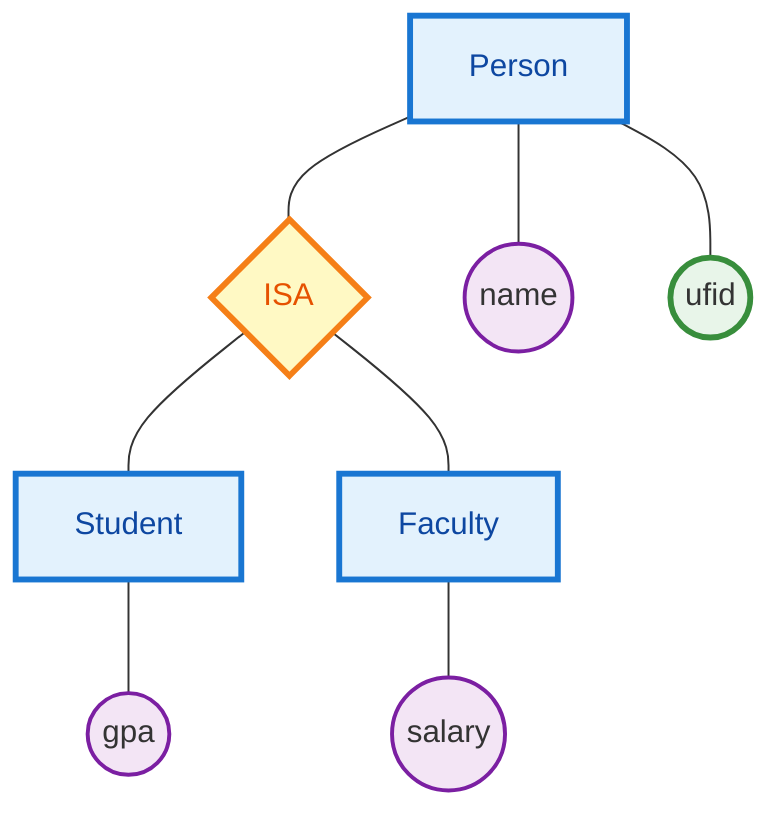
```mermaid
graph TB
  P["Person"]
  P --- I{"ISA"}
  I --- S["Student"]
  I --- F["Faculty"]
  P --- N(("name"))
  P --- ID(("ufid"))
  S --- G(("gpa"))
  F --- Sal(("salary"))
  classDef entity fill:#e3f2fd,stroke:#1976d2,stroke-width:3px,color:#0d47a1
  classDef isa fill:#fff9c4,stroke:#f57f17,stroke-width:3px,color:#e65100
  classDef attr fill:#f3e5f5,stroke:#7b1fa2,stroke-width:2px
  classDef key fill:#e8f5e9,stroke:#388e3c,stroke-width:3px
  class P,S,F entity
  class I isa
  class N,G,Sal attr
  class ID key
```

<!--
ISA has three translation strategies on Friday: single table, joined table per subclass, separate table per class. Foreshadow but don't decide. Mention that PostgreSQL has table inheritance — useful for read-mostly cases, often awkward for OLTP.
-->

---

<!-- _class: lead -->

# Part 4: Notation Choices

---

# Three Notations

### Chen (textbook)

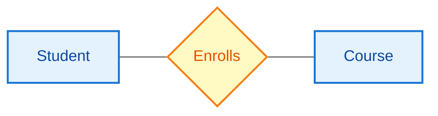
```mermaid
graph LR
  S["Student"] --- E{"Enrolls"}
  E --- C["Course"]
  classDef entity fill:#e3f2fd,stroke:#1976d2,stroke-width:2px,color:#0d47a1
  classDef rel fill:#fff9c4,stroke:#f57f17,stroke-width:2px,color:#e65100
  class S,C entity
  class E rel
```

Explicit relationship boxes. Attributes hang off as ovals.

"Chen" is Peter Pin-Shan Chen (then at MIT Sloan), whose paper introduced the notation (Chen, "The Entity-Relationship Model: Toward a Unified View of Data," ACM TODS 1(1), 1976).

### Crow's Foot (industry)

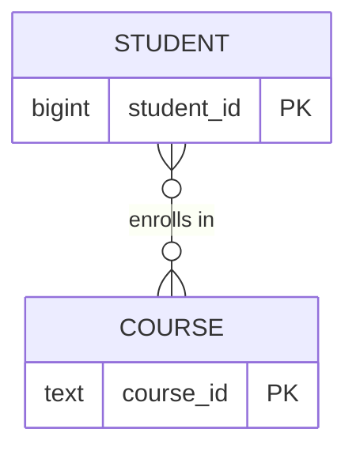
```mermaid
erDiagram
  STUDENT }o--o{ COURSE : "enrolls in"
  STUDENT {
    bigint student_id PK
  }
  COURSE {
    text course_id PK
  }
```

Cardinality drawn at the line ends. Attributes inside the entity box.

### UML class

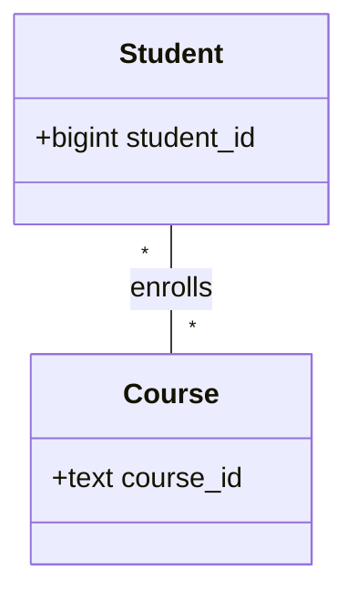
```mermaid
classDiagram
  class Student {
    +bigint student_id
  }
  class Course {
    +text course_id
  }
  Student "*" -- "*" Course : enrolls
```

Common in software design tools (Textbook §4.7, p. 171).

We use Chen for teaching (the textbook does), then translate to crow's foot when working with tools like dbdiagram.io or DataGrip.

<!--
Most industry tools default to crow's foot because cardinality is read directly off the line. Chen's diamond form is more explicit but takes more space. Both notations describe identical concepts.
-->

---

# One Concept, Many Dialects

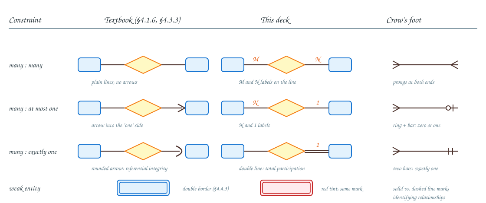

Chen's 1976 paper started the diamond-and-oval family; every book since has bent the details (Chen, ACM TODS 1(1), 1976).
Check the legend before trusting anyone's diagram, including ours.

<!--
The trap to call out: students will meet diagrams where the same mark means the opposite thing depending on the tool. The reliable move is to find the legend, or ask "one instance on the other side maps to how many here?" When drawing your own, state the convention. Exams accept any of the three dialects as long as the constraints are stated unambiguously.
-->

---

<!-- _class: lead -->

# Part 5: Build a Real Schema Together

---

# The Scenario

> *"We're building a registrar system. Students take sections of courses. Each course belongs to a department. Faculty members teach sections. Faculty members belong to a department. A course can have multiple sections per term. Students get grades. Some faculty supervise other faculty. We track each student's major as a department."*

We will turn this paragraph into an ER diagram in five steps.
The judgment calls follow the Textbook's design principles of faithfulness, avoiding redundancy, and simplicity (§4.2, p. 140).

**Your turn:** Read the paragraph again. List every **noun** you see.

<!--
Take a beat — 30 seconds for students to write nouns. Then collect a few on the board. Most students will pick up: students, sections, courses, departments, faculty, grades, supervisors, majors. Discuss whether each is an entity, attribute, or relationship. The next slide is the reveal.
-->

---

# The Nouns

> *"We're building a registrar system. Students take sections of courses. Each course belongs to a department. Faculty members teach sections. Faculty members belong to a department. A course can have multiple sections per term. Students get grades. Some faculty supervise other faculty. We track each student's major as a department."*

Blue nouns become entity sets; sections (red) turns out to be weak.
`term` and `grades` (purple) survive as attributes.
`major` (yellow) is a noun that becomes a *relationship* to Department.
"Registrar system" and "supervisor" name the whole system and a role, so neither gets a box.

<!--
The reveal for the your-turn prompt. Walk it left to right: repeated nouns collapse into one entity set each. The interesting calls: term and grade are facts, not things; major looks like a thing but is really an association between Student and Department; supervisor is Faculty wearing a different hat. This classification IS the first design decision of the build.
-->

---

# Step 1: Identify Entities

Nouns that name **things** become entities.

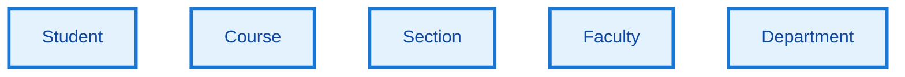
```mermaid
graph TB
  S["Student"]
  C["Course"]
  Sec["Section"]
  F["Faculty"]
  D["Department"]
  classDef entity fill:#e3f2fd,stroke:#1976d2,stroke-width:3px,color:#0d47a1
  class S,C,Sec,F,D entity
```

Five entities, no relationships drawn yet.

<!--
`grade` and `major` are not entities; they will be attributes (grade) or relationships (major-as-department). `Supervisor` is not an entity either — it's faculty in a different role.
-->

---

# The Verbs

> *"We're building a registrar system. Students take sections of courses. Each course belongs to a department. Faculty members teach sections. Faculty members belong to a department. A course can have multiple sections per term. Students get grades. Some faculty supervise other faculty. We track each student's major as a department."*

Verbs that connect two entities become relationships; they need their endpoints, which is why the entity boxes came first in Step 1.
Not every verb qualifies. "Get grades" attaches a fact to an existing connection, and "track" describes us, not the world.

<!--
Mirror of the noun slide, run right before Step 2. The order matters and students ask about it: nouns first because a diamond needs two boxes to connect; hunting verbs before the entities exist gives the verbs nowhere to land. "take" becomes enrolls-in; "have multiple sections" becomes offered-as; "track major as department" is the majors-in relationship hiding in a sentence about us rather than the domain.
-->

---

# Step 2: Add Relationships

Verbs that **connect** entities become relationships. This scenario has seven.

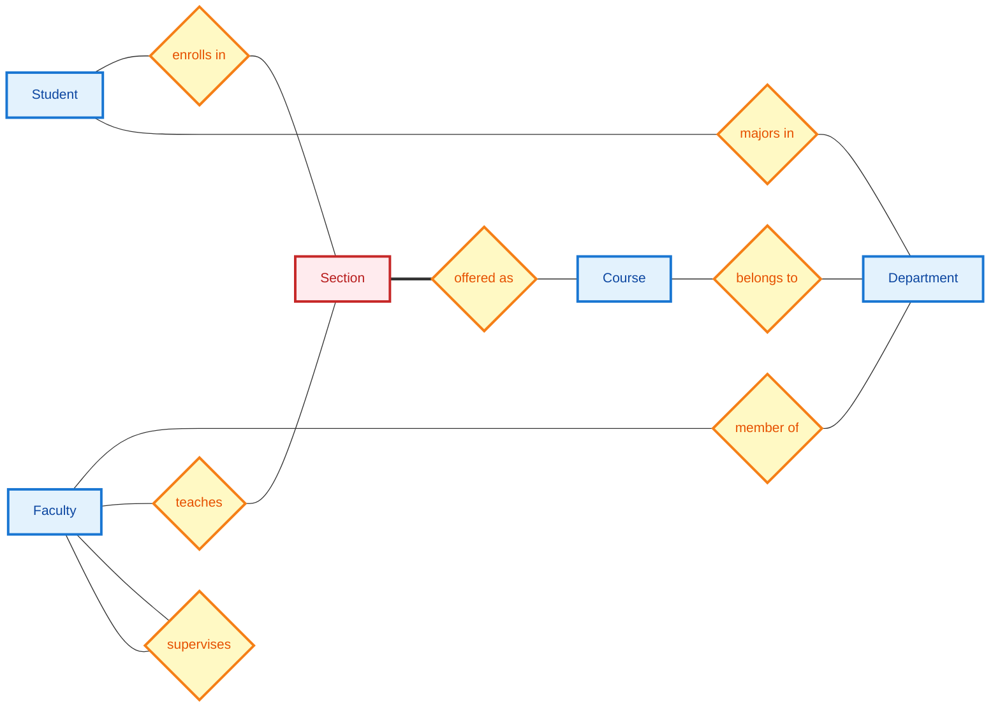
```mermaid
graph LR
  S["Student"] --- E{"enrolls in"} --- Sec["<span class='weak-inner'>Section</span>"]
  Sec === O{"offered as"} --- C["Course"]
  C --- B{"belongs to"} --- D["Department"]
  F["Faculty"] --- M{"member of"} --- D
  F --- T{"teaches"} --- Sec
  S --- Maj{"majors in"} --- D
  F --- Sup{"supervises"} --- F
  classDef entity fill:#e3f2fd,stroke:#1976d2,stroke-width:3px,color:#0d47a1
  classDef rel fill:#fff9c4,stroke:#f57f17,stroke-width:3px,color:#e65100
  classDef weak fill:#ffebee,stroke:#c62828,stroke-width:3px,color:#b71c1c
  class S,C,F,D entity
  class Sec weak
  class O rel
  class E,B,M,T,Maj,Sup rel
```

<!--
Walk the diagram once and ask the class which relationship is missing or surprising. The recursive `supervises` between Faculty and Faculty is the one students often forget. The `majors in` between Student and Department is sometimes argued — should it be an attribute on Student? Discuss briefly. Section already carries the weak entity double border; "offered as" is its identifying relationship (drawn with a double diamond in the figures; mermaid can only manage the double border and the double connecting line).
-->

---

# Step 3: Add Attributes

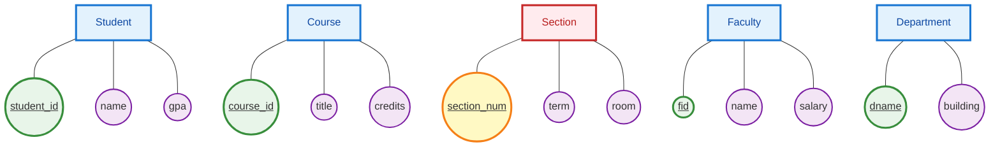
```mermaid
graph TB
  S["Student"]
  S --- SID(("<u>student_id</u>"))
  S --- SName(("name"))
  S --- GPA(("gpa"))
  C["Course"]
  C --- CID(("<u>course_id</u>"))
  C --- Title(("title"))
  C --- Cr(("credits"))
  Sec["<span class='weak-inner'>Section</span>"]
  Sec --- SNum(("<u>section_num</u>"))
  Sec --- Term(("term"))
  Sec --- Room(("room"))
  F["Faculty"]
  F --- FID(("<u>fid</u>"))
  F --- FName(("name"))
  F --- Sal(("salary"))
  D["Department"]
  D --- DN(("<u>dname</u>"))
  D --- Bldg(("building"))
  classDef entity fill:#e3f2fd,stroke:#1976d2,stroke-width:3px,color:#0d47a1
  classDef weak fill:#ffebee,stroke:#c62828,stroke-width:3px,color:#b71c1c
  classDef attr fill:#f3e5f5,stroke:#7b1fa2,stroke-width:2px
  classDef key fill:#e8f5e9,stroke:#388e3c,stroke-width:3px
  classDef partkey fill:#fff9c4,stroke:#f57f17,stroke-width:3px
  class S,C,F,D entity
  class Sec weak
  class SName,GPA,Title,Cr,Term,Room,FName,Sal,Bldg attr
  class SID,CID,FID,DN key
  class SNum partkey
```

Keys are **underlined**, the standard mark; the green tint repeats it in color. The yellow `section_num` is the weak entity's **partial key** (a dashed underline on paper).

<!--
Each entity gets at least a key and a few descriptive attributes. The Section's partial key `section_num` is the local identifier — it's only unique *within a course in a term*.
-->

---

# Step 4: Mark Cardinality

```mermaid
graph LR
  S["Student"] -- "M" --- E{"enrolls in"}
  E -- "N" --- Sec["<span class='weak-inner'>Section</span>"]
  Sec -- "N" === O{"offered as"}
  O -- "1" --- C["Course"]
  C -- "N" --- B{"belongs to"}
  B -- "1" --- D["Department"]
  F["Faculty"] -- "N" --- M{"member of"}
  M -- "1" --- D
  F -- "1" --- T{"teaches"}
  T -- "N" --- Sec
  classDef entity fill:#e3f2fd,stroke:#1976d2,stroke-width:3px,color:#0d47a1
  classDef weak fill:#ffebee,stroke:#c62828,stroke-width:3px,color:#b71c1c
  classDef rel fill:#fff9c4,stroke:#f57f17,stroke-width:3px,color:#e65100
  class S,C,F,D entity
  class Sec weak
  class E,B,M,T,O rel
```

- Student `enrolls in` Section: **M:N**
- Course `offered as` Section: **1:N**
- Course `belongs to` Department: **N:1**

- Faculty `member of` Department: **N:1**
- Faculty `teaches` Section: **1:N**

<!--
Pause and ask: why is teach 1:N and enrolls M:N? One faculty teaches a given section; many faculty would mean co-teaching which the scenario didn't specify. Students enroll in many sections, sections enroll many students.
-->

---

# Step 5: Relationship Attributes

```mermaid
graph TB
  S["Student"] -- "M" --- E{"enrolls in"}
  E -- "N" --- Sec["<span class='weak-inner'>Section</span>"]
  E --- G(("grade"))
  Sec -- "N" === O{"offered as"}
  O -- "1" --- C["Course"]
  C -- "N" --- B{"belongs to"}
  B -- "1" --- D["Department"]
  F["Faculty"] -- "1" --- T{"teaches"}
  T -- "N" --- Sec
  classDef entity fill:#e3f2fd,stroke:#1976d2,stroke-width:3px,color:#0d47a1
  classDef weak fill:#ffebee,stroke:#c62828,stroke-width:3px,color:#b71c1c
  classDef rel fill:#fff9c4,stroke:#f57f17,stroke-width:3px,color:#e65100
  classDef attr fill:#f3e5f5,stroke:#7b1fa2,stroke-width:2px
  class S,C,F,D entity
  class Sec weak
  class E,O,B,T rel
  class G attr
```

`grade` is an attribute of the `enrolls in` relationship.
A student's grade is a property of *their enrollment in this section*, not of the student and not of the section.

<!--
This is the key payoff of the lecture. The "where does grade live?" question, which would torture someone designing schemas directly, falls out naturally from the ER process.
-->

---

# The Whole Build

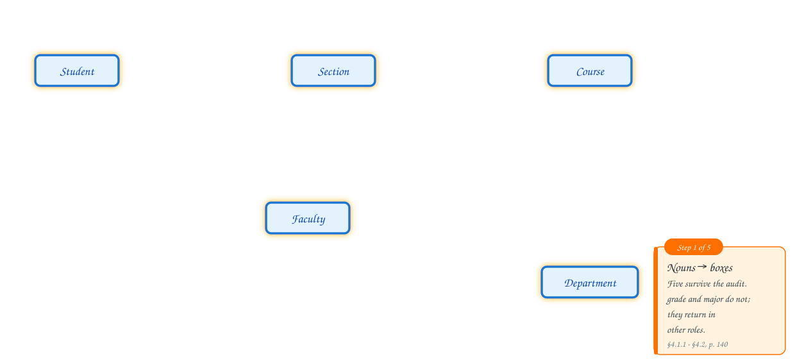

::: appear
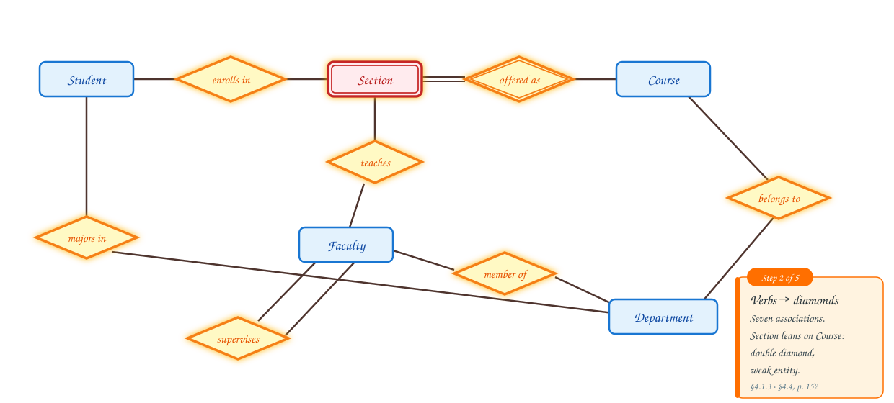
:::

::: appear
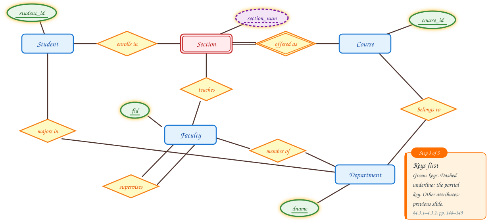
:::

::: appear
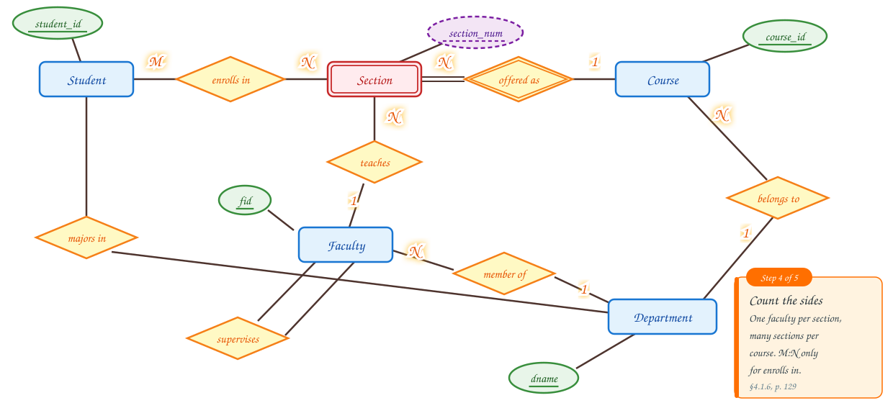
:::

::: appear
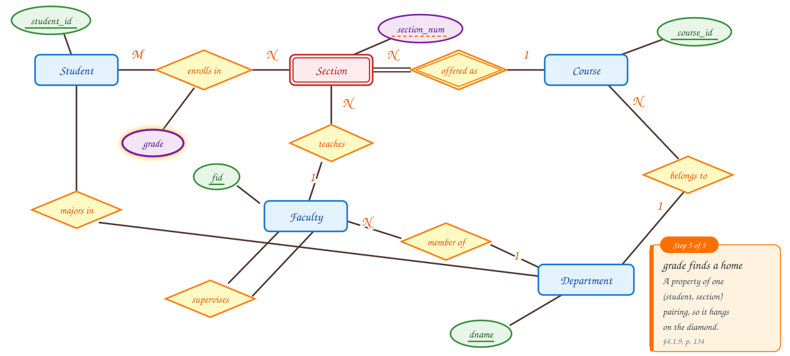
:::

<!--
The five steps replayed as one animated figure, in place. Useful when recording or reviewing; each right-arrow reveals the next step and the glow marks what changed. Keys stand in for the full attribute list from Step 3. Narrate each reveal: nouns, then verbs (Section turns weak), then keys, then cardinalities, then grade landing on the diamond.
-->

---

# The Design Decisions

Every diagram today came from answering these. Run the list on any new scenario.

☐ **Entity or attribute?** Does it need attributes of its own?
☐ **Entity or relationship attribute?** Whose fact is it? Think `grade`.
☐ **Composite attribute:** keep it whole or split it?
☐ **Derived attribute:** store it or compute it?
☐ **Multi-valued attribute:** double oval, or promote to an entity?

☐ **Cardinality:** 1:1, 1:N, or M:N? State the time scope.
☐ **Participation:** total or partial? Must vs. may.
☐ **Strong or weak?** Can it be identified without an owner?
☐ **ISA or separate entities?** How much do the sets share?
☐ **Notation:** pick one dialect and state the legend.

<!--
Wrap-up checklist of every judgment call from the hour. Have students copy it or photograph it; it is the rubric they should run on the library scenario in the practice problems and on their Project 1 designs. A version with a small example picture per decision would make a good printable reference card if there is demand.
-->

---

# What We Did Not Do Today

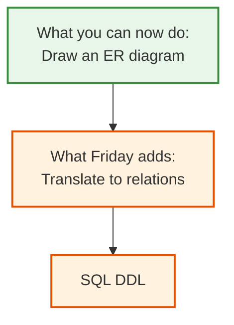
```mermaid
graph TD
  Today["What you can now do:<br/>Draw an ER diagram"]
  Friday["What Friday adds:<br/>Translate to relations"]
  Today --> Friday
  Friday --> Tables["SQL DDL"]
  classDef now fill:#e8f5e9,stroke:#388e3c,stroke-width:2px
  classDef next fill:#fff3e0,stroke:#e65100,stroke-width:2px
  class Today now
  class Friday,Tables next
```

Today we decided what to model.
Friday we decide how to store it.

<!--
The translation rules on Friday turn this diagram into 5-6 tables. Some choices are mechanical; others involve real tradeoffs (where to put 1:1 attributes, whether to embed multi-valued attributes as arrays). That's why ER lives before SQL.
-->

---

# Friday

Topic: translating ER diagrams into relational schemas and SQL DDL.

Reading: Textbook §4.5-4.6, pp. 157-171.

Reminder: submit Project 0 (setup, P/F) if you have not already. It is due Friday, September 4 at 11:59 PM.

---

# Practice Before Friday

Three problems on the handout posted with these slides:

1. The library scenario: design an ER diagram for a library that loans books, with multiple branches, authors, and patrons.
2. Cardinality identification: ten scenarios, classify each as 1:1, 1:N, or M:N.
3. The weak entity question: identify the weak entities in a given e-commerce schema.

This is an exercise.

---

# Questions

What is on your mind?

Project 1 releases today. Project 0 setup remains due Fri Sep 4.

<!--
Common questions to expect: "When is a multi-valued attribute really a separate entity?" (when it has its own attributes), "Can a relationship participate in another relationship?" (yes — Chen calls these aggregate relationships, used rarely), "Why bother with Chen when crow's foot is industry standard?" (the textbook uses Chen; Chen's diamonds force explicit relationship modeling; crow's foot conflates entities with their attributes).
-->
