<!-- _class: lead -->

# Day 6: Entity-Relationship Modeling

**COP 5725 - Database Management Systems**
Wednesday, September 2, 2026

Entities and relationships before tables

<!--
First non-algebra day in the section. Students will arrive expecting more math; instead we shift mode entirely into design thinking. The hour is heavily interactive — multiple "your turn" prompts. Pace: 50 min with the last 12 min on the full worked example.
-->

---

# Where We Are

<div class="columns-left-wide">
<div>

The first five classes covered manipulating relations with the algebra and SQL.
Today covers designing them.

ER modeling sits between a domain expert and a SQL `CREATE TABLE` statement. It is the layer where you reason about the world before you commit to a schema (Textbook §4.1, p. 126).

</div>
<div>

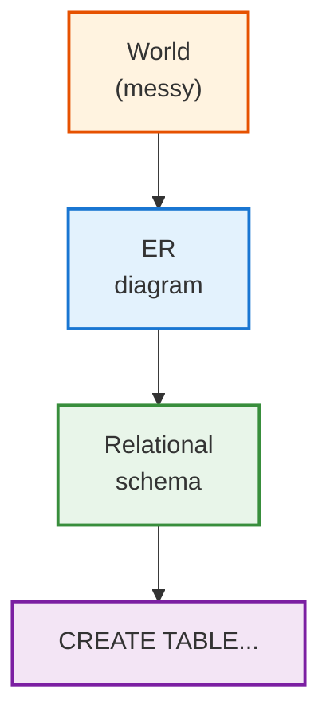

</div>
</div>

<!--
The diagram is the entire premise of the lecture. ER is not optional theory — it is the rehearsal stage where mistakes are cheap. Jumping straight from a problem description to a CREATE TABLE statement is the single most common rookie failure.
-->

---

# Today's Roadmap

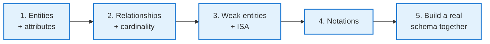

Color code we will use the whole hour:

<div class="columns-3">
<div>

<span class="entity">Entities</span>
Solid blue rectangles.

</div>
<div>

<span class="relationship">Relationships</span>
Yellow diamonds.

</div>
<div>

<span class="weak">Weak entities</span>
Red dashed.

</div>
</div>

<span class="attr">attributes</span> are purple ovals. <span class="key">keys</span> are underlined.

<!--
Drill the color code now. By the end of the hour, students should see "blue means thing, yellow means action between things, red means dependent thing." The color reinforcement compounds.
-->

---

# Why ER Comes Before SQL

<div class="columns">
<div>

### Designing in tables forces premature decisions

- "Should this be one table or two?" You don't know yet.
- "Should this be a column or a separate row?" Depends on cardinality.
- "Where does the foreign key go?" Depends on the relationship type.

### ER lets you reason in concepts

- "This is a Student"
- "Students take Courses"
- "A Course has Sections"

</div>
<div>

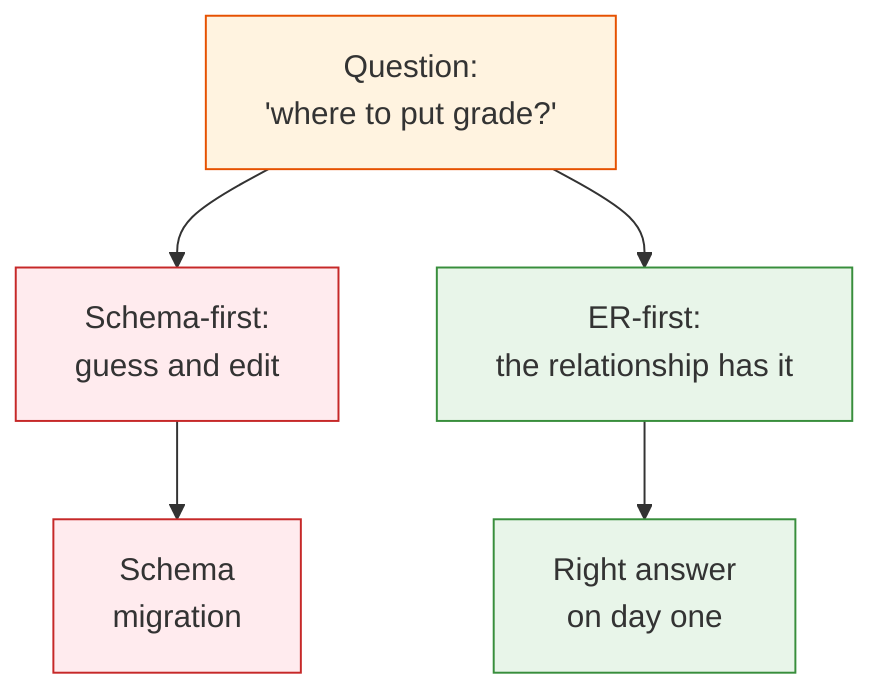

</div>
</div>

<!--
The "where does grade live" question is the classic ER teaching moment. Students who try to model it as a column on student or on course will hit walls. The relationship-with-attributes answer falls out naturally from ER thinking.
-->

---

<!-- _class: lead -->

# Part 1: Entities and Attributes

---

# What Is an Entity?

<div class="columns">
<div>

An **entity** is a distinguishable thing in the world.

- A specific student named Ada
- The course COP 5725
- The Computer Science department

An **entity set** is a collection of entities of the same kind (Textbook §4.1.1, p. 126).

- All students
- All courses

We draw entity *sets*, not individual entities.

</div>
<div>

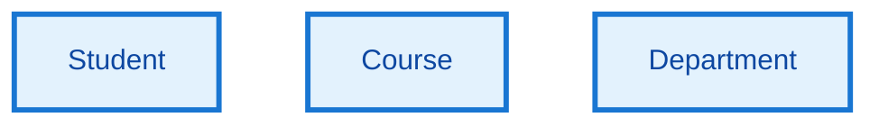

Three entity sets we will work with today.

</div>
</div>

<!--
Vocabulary note: most texts call the diagram element an "entity," even though it represents an entity *set*. Codd would have insisted on "relation" for the set. We use the loose language because it is universal.
-->

---

# Attribute Kinds

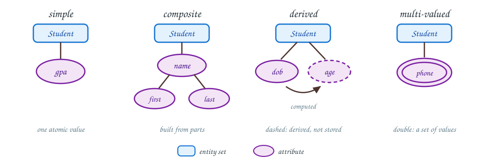

Four kinds of attribute. The first is easy. The other three force design choices.

<div class="small">

The Textbook's E/R model keeps attributes primitive and treats struct-valued (composite) and set-valued (multi-valued) attributes as variations (Textbook §4.1.2, p. 126–127). Derived attributes come from the wider ER tradition.

</div>

<!--
Composite attributes invite the question "should I split this in the schema?" Derived attributes invite "should I store this or compute it?" Multi-valued attributes invite "is this really one attribute, or a separate entity?"
-->

---

# Student Entity, Step 1

Just the box.

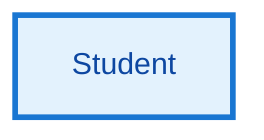

We know we have students. We do not yet know what we record about them.

<!--
Hold this slide briefly. The next slide adds attributes. The progressive build is intentional — students should see that a useful diagram emerges from a sequence of small decisions, not in one heroic moment.
-->

---

# Student Entity, Step 2

Add the obvious simple attributes.

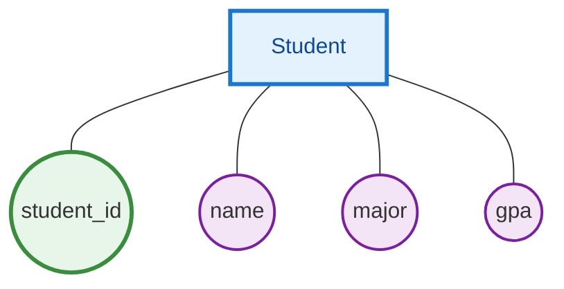

The green attribute is the **primary key**. By convention we underline it on paper, color it on slides (Textbook §4.3.2, p. 149).

---

# Student Entity, Step 3

Replace `name` with a composite. Add a derived attribute.

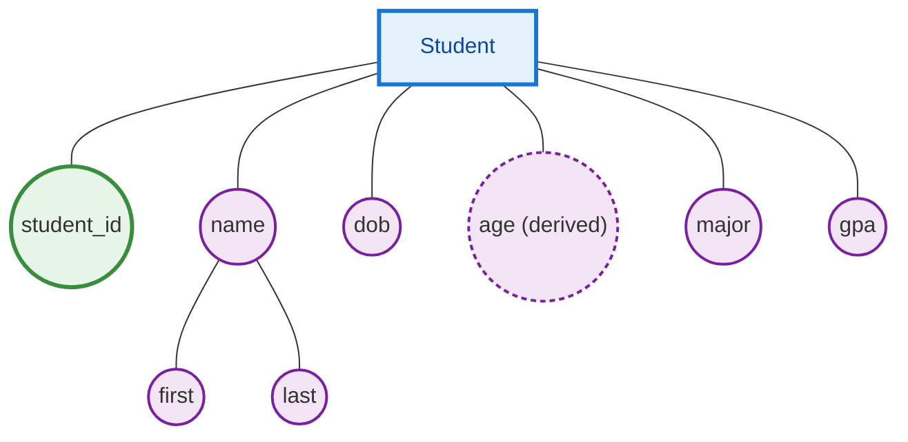

The dashed oval is the convention for a **derived** attribute.

<!--
Derived attributes raise the storage-vs-compute question. We don't decide now; Day 7 (translation) is when we choose. The ER diagram captures the design intent.
-->

---

# Student Entity, Step 4

Allow many phone numbers.

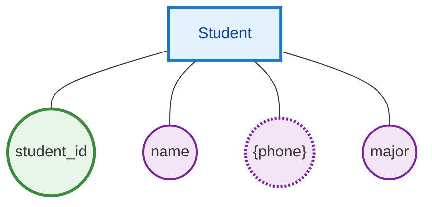

The double-line convention (here shown as `{...}` braces and dashes) marks a **multi-valued** attribute.

<div class="interactive">

**Your turn:** Should `phone` be a separate entity? When would you split it?

</div>

<!--
The answer: split it if you want to attach more attributes to a phone (type, primary/secondary, verified flag). Otherwise, keep it as multi-valued; Day 7 turns it into a separate table anyway.
-->

---

<!-- _class: lead -->

# Part 2: Relationships and Cardinality

<div class="caption">

Cardinality of a relationship: how many entities on one side can pair with each entity on the other. Day 4 used the same word for |R|, a relation's tuple count.

</div>

---

# What Is a Relationship?

<div class="columns">
<div>

A **relationship** is an association between two or more entities.

- A student *enrolls in* a course
- A faculty member *teaches* a section
- A course *belongs to* a department

A **relationship set** is the collection of all such associations (Textbook §4.1.3, p. 127).

We draw relationship sets as <span class="relationship">yellow diamonds</span> between the entity boxes they connect.

</div>
<div>

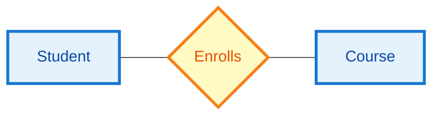

</div>
</div>

<!--
Relationships are verbs. If students struggle to find them, prompt with "What action connects these things?" Verbs reveal relationships.
-->

---

# Cardinality Patterns

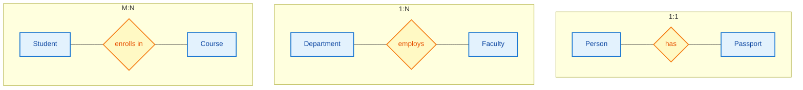

These three patterns cover almost every real-world association (Textbook §4.1.6, p. 129).

---

# Cardinality Examples

<div class="columns-3">
<div>

### 1:1
Each person has at most one passport.
Each passport belongs to at most one person.

</div>
<div>

### 1:N
Each department employs many faculty.
Each faculty member belongs to one department.

</div>
<div>

### M:N
Each student enrolls in many courses.
Each course enrolls many students.

</div>
</div>

<div class="interactive">

**Your turn:** Classify these.

1. Customer **places** Order
2. User **has** Profile
3. Author **writes** Book
4. Section **meets in** Room (one room per term)

</div>

<!--
Answers: 1) 1:N (one customer, many orders) 2) 1:1 (one profile per user) 3) M:N (a book can have several authors, an author writes several books) 4) M:N if rooms are reused across terms, or 1:N if we narrow to "a section per term." This last one is the kind of subtlety students miss; cardinality depends on time scope.
-->

---

# Total and Partial Participation

<div class="columns">
<div>

**Total participation**: every entity must participate.

- Every employee must work in a department.
- Every section must belong to a course.

Drawn with a double line.

**Partial participation**: an entity may or may not participate.

- Not every faculty member supervises another.
- Not every student is enrolled in a course this term.

Drawn with a single line.

</div>
<div>

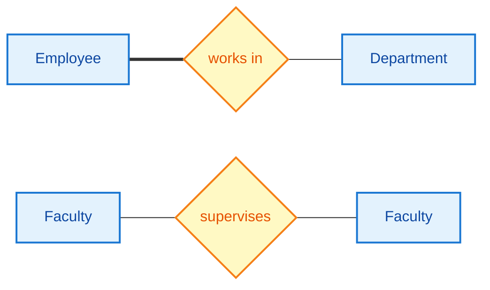

Top: employee participation is total (double line).
Bottom: faculty supervision is partial.

</div>
</div>

<!--
The classroom mnemonic: total = "must," partial = "may." A double line says "must." This will matter on Friday when we translate to schemas — total participation can force NOT NULL on the FK.
-->

---

# Student-Course, Step 1

Two entities, no relationship yet.

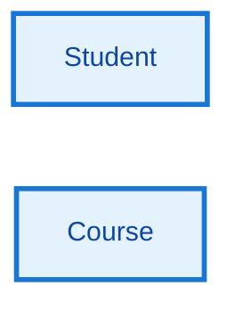

We know what they are. We have not yet named how they connect.

---

# Student-Course, Step 2

Add the relationship.


A diamond labeled with a verb. The verb names what the diamond means.

---

# Student-Course, Step 3

Mark the cardinality.

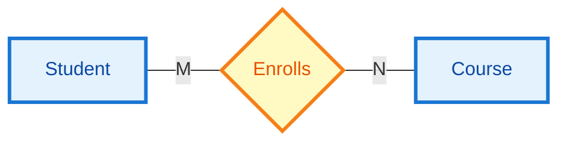

Many students enroll in many courses. M:N.

---

# Student-Course, Step 4

The relationship has its own attribute.

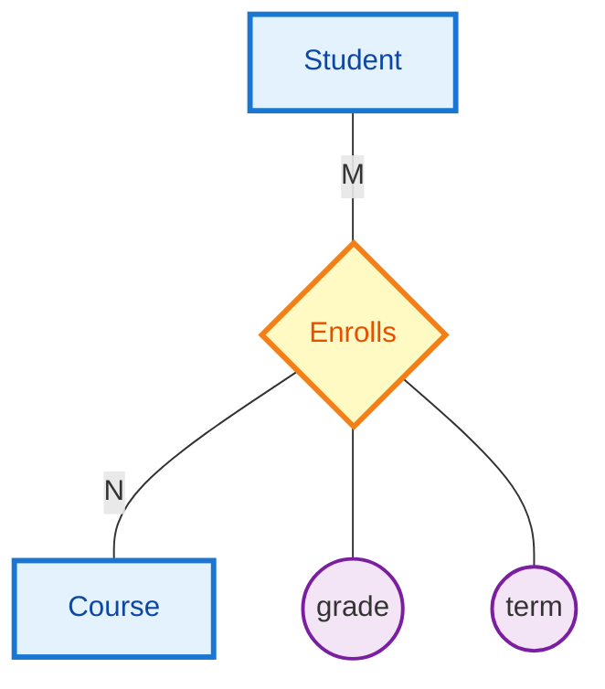

`grade` and `term` are properties of *the enrollment*, not of the student or the course (Textbook §4.1.9, p. 134).

<div class="error">

**Common error:** Putting `grade` on `Student` (one grade?) or on `Course` (whose grade?). The relationship is the right home.

</div>

---

<!-- _class: lead -->

# Part 3: Weak Entities and ISA

---

# Weak Entities

<div class="columns">
<div>

A **weak entity** is one whose identity depends on another entity (Textbook §4.4, p. 152).

A Section of a course has no meaning without its course. `Section 001` of `COP 5725` is identified only by **both** values together.

Drawn with:
- Dashed double-line border
- Connected by a double-diamond *identifying relationship*
- Partial key (dashed underline)

</div>
<div>

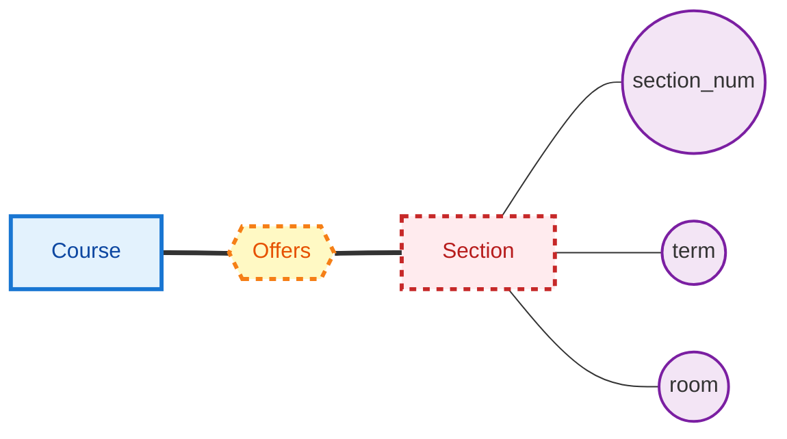

</div>
</div>

<!--
The Section example is the standard. Other classic weak entities: LineItem (owned by Order), Dependent (owned by Employee), Edition (owned by Book). All three follow the same pattern: composite identity = owner key + partial key.
-->

---

# ISA Hierarchies

<div class="columns">
<div>

Two entity sets that share most of their attributes can be modeled as **subclasses** of a parent (Textbook §4.1.11, p. 135).

- `Person` → `Student`, `Faculty`
- `Account` → `Checking`, `Savings`
- `Vehicle` → `Car`, `Truck`, `Motorcycle`

The triangle is the ISA relationship, read "is a": every Student is a Person.

Subclasses *inherit* the parent's attributes and may add their own.

</div>
<div>

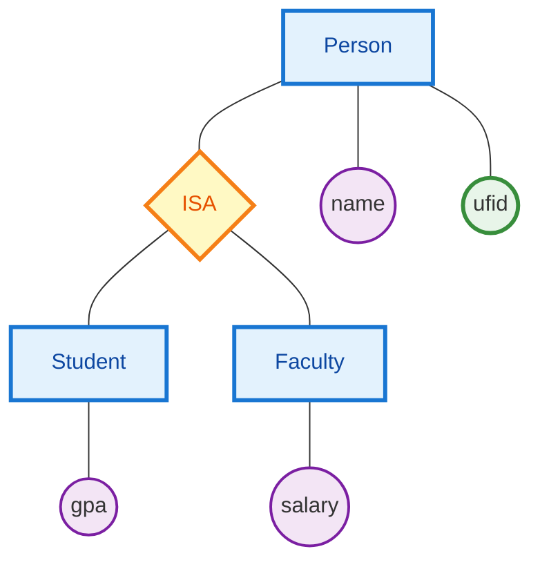

</div>
</div>

<!--
ISA has three translation strategies on Friday: single table, joined table per subclass, separate table per class. Foreshadow but don't decide. Mention that PostgreSQL has table inheritance — useful for read-mostly cases, often awkward for OLTP.
-->

---

<!-- _class: lead -->

# Part 4: Notation Choices

---

# Three Notations

<div class="columns-3">
<div>

### Chen (textbook)

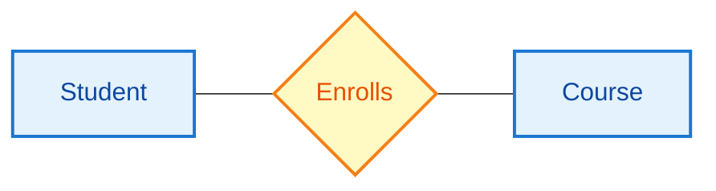

Explicit relationship boxes. Attributes hang off as ovals.

</div>
<div>

### Crow's Foot (industry)

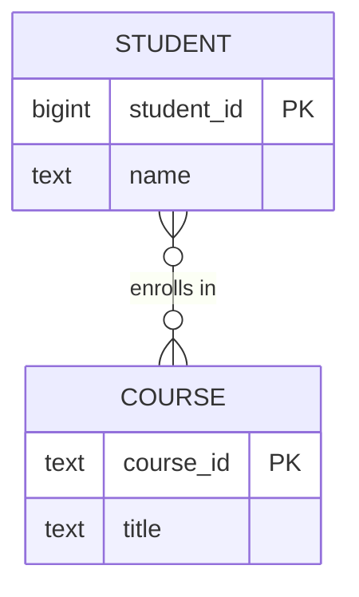

Cardinality drawn at the line ends. Attributes inside the entity box.

</div>
<div>

### UML class

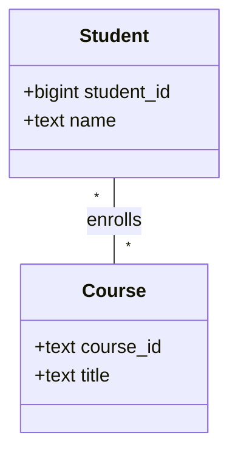

Common in software design tools (Textbook §4.7, p. 171).

</div>
</div>

We use Chen for teaching (the textbook does), then translate to crow's foot when working with tools like dbdiagram.io or DataGrip.

<!--
Most industry tools default to crow's foot because cardinality is read directly off the line. Chen's diamond form is more explicit but takes more space. Both notations describe identical concepts.
-->

---

<!-- _class: lead -->

# Part 5: Build a Real Schema Together

---

# The Scenario

> *"We're building a registrar system. Students take sections of courses. Each course belongs to a department. Faculty members teach sections. Faculty members belong to a department. A course can have multiple sections per term. Students get grades. Some faculty supervise other faculty. We track each student's major as a department."*

We will turn this paragraph into an ER diagram in five steps.

<div class="interactive">

**Your turn:** Read the paragraph again. List every **noun** you see.

</div>

<!--
Take a beat — 30 seconds for students to write nouns. Then collect a few on the board. Most students will pick up: students, sections, courses, departments, faculty, grades, supervisors, majors. Discuss whether each is an entity, attribute, or relationship.
-->

---

# Step 1: Identify Entities

Nouns that name **things** become entities.

```mermaid
graph TB
  S["Student"]
  C["Course"]
  Sec["Section"]
  F["Faculty"]
  D["Department"]
  classDef entity fill:#e3f2fd,stroke:#1976d2,stroke-width:3px,color:#0d47a1
  class S,C,Sec,F,D entity
```

Five entities, no relationships drawn yet.

<!--
`grade` and `major` are not entities; they will be attributes (grade) or relationships (major-as-department). `Supervisor` is not an entity either — it's faculty in a different role.
-->

---

# Step 2: Add Relationships

Verbs that **connect** entities become relationships.

```mermaid
graph LR
  S["Student"] --- E{"enrolls in"} --- Sec["Section"]
  Sec --- O{{"offered as"}} --- C["Course"]
  C --- B{"belongs to"} --- D["Department"]
  F["Faculty"] --- M{"member of"} --- D
  F --- T{"teaches"} --- Sec
  S --- Maj{"majors in"} --- D
  F --- Sup{"supervises"} --- F
  classDef entity fill:#e3f2fd,stroke:#1976d2,stroke-width:3px,color:#0d47a1
  classDef rel fill:#fff9c4,stroke:#f57f17,stroke-width:3px,color:#e65100
  classDef weak fill:#ffebee,stroke:#c62828,stroke-width:3px,stroke-dasharray:5 5
  class S,C,F,D entity
  class Sec weak
  class O rel
  class E,B,M,T,Maj,Sup rel
```

Seven relationships. Note `Section` is already weak (dashed border, double-diamond "offered as" relationship).

<!--
Walk the diagram once and ask the class which relationship is missing or surprising. The recursive `supervises` between Faculty and Faculty is the one students often forget. The `majors in` between Student and Department is sometimes argued — should it be an attribute on Student? Discuss briefly.
-->

---

# Step 3: Add Attributes

```mermaid
graph TB
  S["Student"]
  S --- SID(("student_id"))
  S --- SName(("name"))
  S --- GPA(("gpa"))
  C["Course"]
  C --- CID(("course_id"))
  C --- Title(("title"))
  C --- Cr(("credits"))
  Sec["Section"]
  Sec --- SNum(("section_num"))
  Sec --- Term(("term"))
  Sec --- Room(("room"))
  F["Faculty"]
  F --- FID(("fid"))
  F --- FName(("name"))
  F --- Sal(("salary"))
  D["Department"]
  D --- DN(("dname"))
  D --- Bldg(("building"))
  classDef entity fill:#e3f2fd,stroke:#1976d2,stroke-width:3px,color:#0d47a1
  classDef weak fill:#ffebee,stroke:#c62828,stroke-width:3px,stroke-dasharray:5 5
  classDef attr fill:#f3e5f5,stroke:#7b1fa2,stroke-width:2px
  classDef key fill:#e8f5e9,stroke:#388e3c,stroke-width:3px
  classDef partkey fill:#fff9c4,stroke:#f57f17,stroke-width:3px,stroke-dasharray:3 3
  class S,C,F,D entity
  class Sec weak
  class SName,GPA,Title,Cr,Term,Room,FName,Sal,Bldg attr
  class SID,CID,FID,DN key
  class SNum partkey
```

Green = primary key. Yellow dashed = **partial key** of the weak entity.

<!--
Each entity gets at least a key and a few descriptive attributes. The Section's partial key `section_num` is the local identifier — it's only unique *within a course in a term*.
-->

---

# Step 4: Mark Cardinality

```mermaid
graph LR
  S["Student"] -- "M" --- E{"enrolls in"}
  E -- "N" --- Sec["Section"]
  Sec -- "N" --- O{{"offered as"}}
  O -- "1" --- C["Course"]
  C -- "N" --- B{"belongs to"}
  B -- "1" --- D["Department"]
  F["Faculty"] -- "N" --- M{"member of"}
  M -- "1" --- D
  F -- "1" --- T{"teaches"}
  T -- "N" --- Sec
  classDef entity fill:#e3f2fd,stroke:#1976d2,stroke-width:3px,color:#0d47a1
  classDef weak fill:#ffebee,stroke:#c62828,stroke-width:3px,stroke-dasharray:5 5
  classDef rel fill:#fff9c4,stroke:#f57f17,stroke-width:3px,color:#e65100
  class S,C,F,D entity
  class Sec weak
  class E,B,M,T,O rel
```

<div class="columns">
<div>

- Student `enrolls in` Section: **M:N**
- Course `offered as` Section: **1:N**
- Course `belongs to` Department: **N:1**

</div>
<div>

- Faculty `member of` Department: **N:1**
- Faculty `teaches` Section: **1:N**

</div>
</div>

<!--
Pause and ask: why is teach 1:N and enrolls M:N? One faculty teaches a given section; many faculty would mean co-teaching which the scenario didn't specify. Students enroll in many sections, sections enroll many students.
-->

---

# Step 5: Relationship Attributes

```mermaid
graph TB
  S["Student"] -- "M" --- E{"enrolls in"}
  E -- "N" --- Sec["Section"]
  E --- G(("grade"))
  Sec -- "N" --- O{{"offered as"}}
  O -- "1" --- C["Course"]
  C -- "N" --- B{"belongs to"}
  B -- "1" --- D["Department"]
  F["Faculty"] -- "1" --- T{"teaches"}
  T -- "N" --- Sec
  classDef entity fill:#e3f2fd,stroke:#1976d2,stroke-width:3px,color:#0d47a1
  classDef weak fill:#ffebee,stroke:#c62828,stroke-width:3px,stroke-dasharray:5 5
  classDef rel fill:#fff9c4,stroke:#f57f17,stroke-width:3px,color:#e65100
  classDef attr fill:#f3e5f5,stroke:#7b1fa2,stroke-width:2px
  class S,C,F,D entity
  class Sec weak
  class E,O,B,T rel
  class G attr
```

`grade` lives on the `enrolls in` relationship.
A student's grade is a property of *their enrollment in this section*, not of the student and not of the section.

<!--
This is the key payoff of the lecture. The "where does grade live?" question, which would torture someone designing schemas directly, falls out naturally from the ER process.
-->

---

# What We Did Not Do Today

```mermaid
graph TD
  Today["What you can now do:<br/>Draw an ER diagram"]
  Friday["What Friday adds:<br/>Translate to relations"]
  Today --> Friday
  Friday --> Tables["SQL DDL"]
  classDef now fill:#e8f5e9,stroke:#388e3c,stroke-width:2px
  classDef next fill:#fff3e0,stroke:#e65100,stroke-width:2px
  class Today now
  class Friday,Tables next
```

Today we decided what to model.
Friday we decide how to store it.

<!--
The translation rules on Friday turn this diagram into 5-6 tables. Some choices are mechanical; others involve real tradeoffs (where to put 1:1 attributes, whether to embed multi-valued attributes as arrays). That's why ER lives before SQL.
-->

---

# Friday

Topic: translating ER diagrams into relational schemas and SQL DDL.

Reading: Textbook §4.5-4.6, pp. 157-171.

The Project 0 setup task is due Friday at 11:59 PM.

---

# Practice Before Friday

Three problems on the handout in this folder:

1. The library scenario: design an ER diagram for a library that loans books, with multiple branches, authors, and patrons.
2. Cardinality identification: ten scenarios, classify each as 1:1, 1:N, or M:N.
3. The weak entity question: identify the weak entities in a given e-commerce schema.

This is an exercise.

---

# Questions

What is on your mind?

Today we drew. Friday we translate.

Project 1 releases today. Project 0 setup remains due Fri Sep 4.

<!--
Common questions to expect: "When is a multi-valued attribute really a separate entity?" (when it has its own attributes), "Can a relationship participate in another relationship?" (yes — Chen calls these aggregate relationships, used rarely), "Why bother with Chen when crow's foot is industry standard?" (the textbook uses Chen; Chen's diamonds force explicit relationship modeling; crow's foot conflates entities with their attributes).
-->
