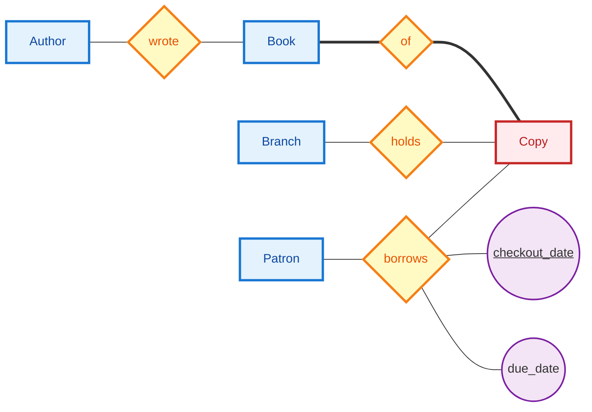

# Day 7 Practice: ER to Relations

<div class="handout-meta">

COP 5725 Database Management Systems, Fall 2026. Ungraded practice following the Friday, September 4 lecture.
Attempt every problem before looking at the solutions on the last pages. Bring questions to class Wednesday.

</div>

## Problem 1: DDL for the Library

Translate the library ER diagram from the Day 6 handout into PostgreSQL `CREATE TABLE` statements. The diagram, with the borrows fix applied:



`wrote` and `borrows` are M:N, `of` and `holds` are N:1 into Book and Branch, Copy is weak on Book with partial key `copy_num`, and `checkout_date` is part of the borrowing's identity so a patron can borrow the same copy twice.

Apply the six rules. Invent reasonable attribute names and types where the diagram is silent.

<div class="answer-space" style="min-height:330px"></div>

---

# Problem 2: Choosing an ISA Strategy

The university portal models Person with subclasses Student and Faculty. The stated access patterns:

- Every page load shows a directory entry: name and email, for any person.
- Students check their GPA a few times a term.
- Payroll reads every faculty salary in one nightly batch.
- No one is both a student and a faculty member.
- A Staff subclass is expected next year.

Pick one of the three ISA strategies from lecture (single table, per-subclass tables, joined tables). Argue for your choice from these access patterns, and say what each of the other two strategies would cost here.

<div class="answer-space" style="min-height:300px"></div>

## Problem 3: A Weak-Entity Chain

Campus facilities data: buildings have unique names. Floors are numbered within a building. Rooms are numbered within a floor and have a capacity.

Translate the Building → Floor → Room chain into SQL DDL. Watch what happens to the primary key at each level.

<div class="answer-space" style="min-height:260px"></div>

---

# Solutions

## Problem 1

```sql
CREATE TABLE author (
  author_id  bigint PRIMARY KEY,
  name       text NOT NULL
);
CREATE TABLE book (
  book_id  bigint PRIMARY KEY,
  title    text NOT NULL
);
CREATE TABLE wrote (                       -- M:N → junction table
  author_id  bigint REFERENCES author(author_id),
  book_id    bigint REFERENCES book(book_id),
  PRIMARY KEY (author_id, book_id)
);
CREATE TABLE branch (
  branch_id  bigint PRIMARY KEY,
  name       text NOT NULL
);
CREATE TABLE copy (                        -- weak → composite key
  book_id    bigint REFERENCES book(book_id),
  copy_num   int,
  branch_id  bigint NOT NULL REFERENCES branch(branch_id),  -- holds, N:1
  PRIMARY KEY (book_id, copy_num)
);
CREATE TABLE patron (
  patron_id  bigint PRIMARY KEY,
  name       text NOT NULL
);
CREATE TABLE borrows (                     -- M:N with identity-bearing date
  patron_id      bigint REFERENCES patron(patron_id),
  book_id        bigint,
  copy_num       int,
  checkout_date  date,
  due_date       date NOT NULL,
  PRIMARY KEY (patron_id, book_id, copy_num, checkout_date),
  FOREIGN KEY (book_id, copy_num) REFERENCES copy(book_id, copy_num)
);
```

The composite FK from `borrows` to `copy` is the bookkeeping cost of the weak entity, the same shape as `enrollment` referencing `section` in lecture.

---

# Solutions, Continued

## Problem 2

The joined-table strategy (Strategy 3) fits these patterns best. The directory read on every page load touches only the `person` parent table, with no NULL columns and no UNION. GPA and salary reads each join once, and both are low-frequency, so the join cost lands where the traffic is lightest. Next year's Staff subclass is a new child table with no change to existing rows.

The costs of the alternatives: a single table (Strategy 1) serves the directory equally well but carries NULL gpa for every faculty row and NULL salary for every student, and adding Staff means altering the one big table. Per-subclass tables (Strategy 2) make the hot directory query a UNION over a growing list of tables, which is the worst place in this workload to pay.

Full credit for a different choice with an argument that engages the access patterns; the directory-on-every-page detail is the one a good answer cannot ignore.

## Problem 3

```sql
CREATE TABLE building (
  bname  text PRIMARY KEY
);
CREATE TABLE floor (
  bname      text REFERENCES building(bname),
  floor_num  int,
  PRIMARY KEY (bname, floor_num)
);
CREATE TABLE room (
  bname      text,
  floor_num  int,
  room_num   int,
  capacity   int CHECK (capacity > 0),
  PRIMARY KEY (bname, floor_num, room_num),
  FOREIGN KEY (bname, floor_num) REFERENCES floor(bname, floor_num)
);
```

Each level's primary key is its owner's full key plus its own partial key, so the key grows down the chain: one column, two, three. The FK at each level references the owner's whole composite key, never just a piece of it.
