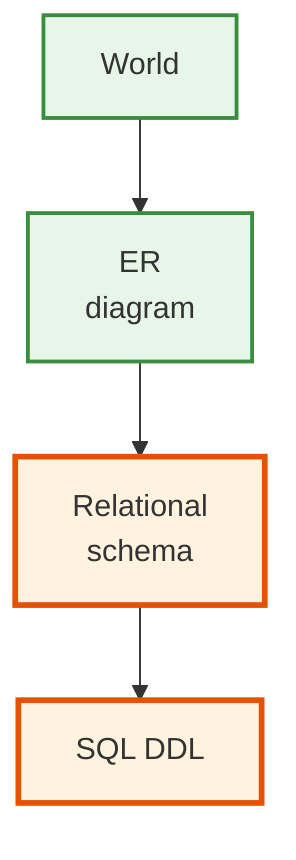
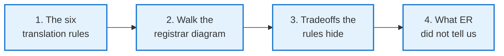
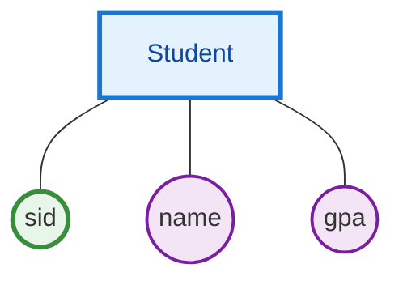
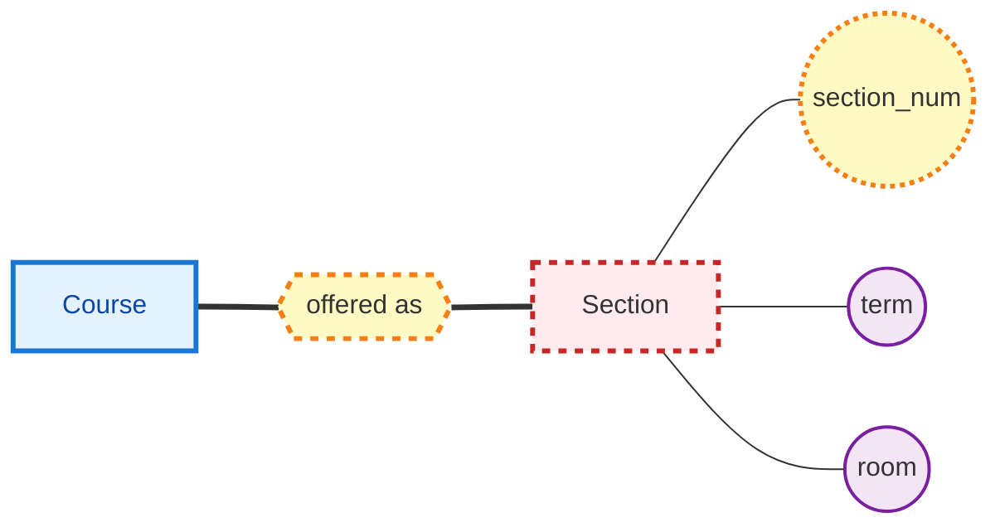
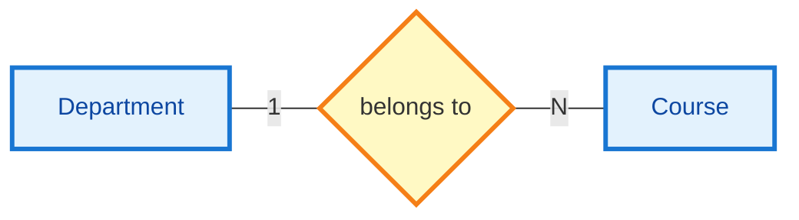
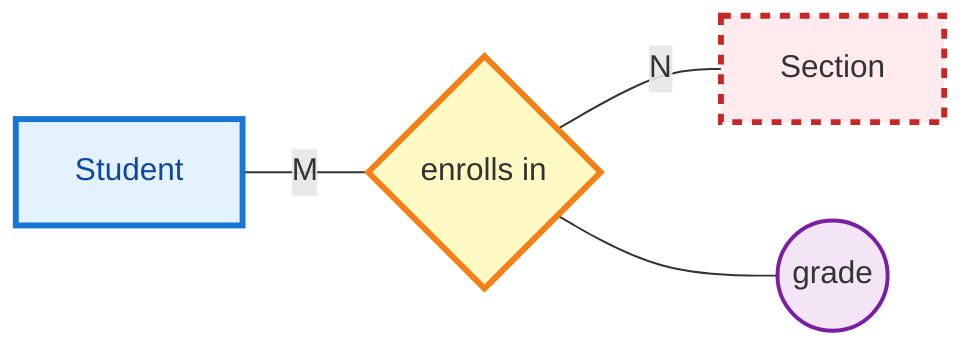
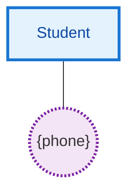
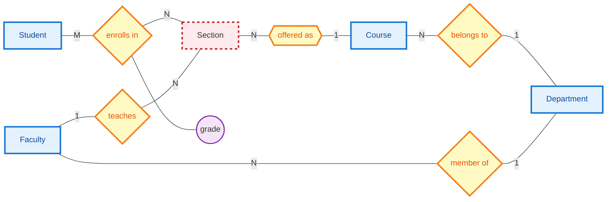
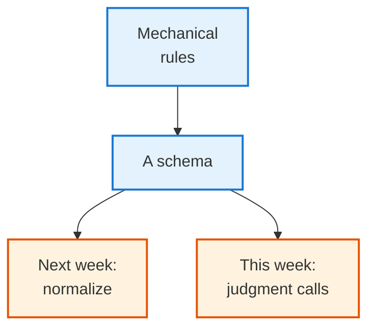
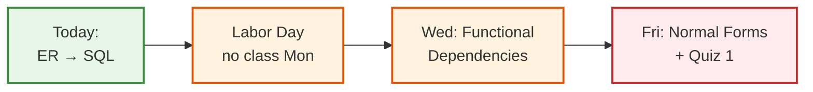

<!-- _class: lead -->

# Day 7: ER to Relations

**COP 5725 - Database Management Systems**
Friday, September 4, 2026

Six rules. One diagram. A working schema.

<!--
Project 0 is due tonight. The lecture's job is to close the design loop: take the ER diagram from Wednesday and produce a SQL DDL script. Pace 50 min, with last 8 min on tradeoffs and the look-ahead to normalization next week.
-->

---

# Where We Are

<div class="columns-left-wide">
<div>

Wednesday: we drew an ER diagram for a registrar system.
Today: we turn that diagram into SQL `CREATE TABLE` statements.

The translation is **mechanical** for most ER constructs.
A few cases — 1:1 relationships, ISA hierarchies — require a design choice.
We will see all of them.

</div>
<div>



</div>
</div>

---

# Today's Roadmap



By the end of the hour you will have a SQL script you can run against PostgreSQL.

<!--
The "what ER did not tell us" section is foreshadowing for Week 4: functional dependencies and normalization. ER produces *a* schema, not necessarily the *best* one. Normalization fixes redundancy ER does not catch.
-->

---

<!-- _class: lead -->

# Part 1: The Six Translation Rules

---

# The Six Rules at a Glance

| ER Construct | Translation |
|--------------|-------------|
| Strong entity | One table; PK is the entity's key |
| Weak entity | One table; PK = owner's PK + partial key |
| 1:1 relationship | Three options (next slides) |
| 1:N relationship | Embed FK on the N side |
| M:N relationship | New table; PK = both FKs |
| Multi-valued attribute | New table; PK = owner PK + value |

Plus one bonus: ISA hierarchies have three strategies of their own.

We will apply each rule to the registrar diagram.

---

# Rule 1: Strong Entity → Table

<div class="columns">
<div>



</div>
<div>

```sql
CREATE TABLE student (
  sid   bigint        PRIMARY KEY,
  name  text          NOT NULL,
  gpa   numeric(3,2)  CHECK (gpa BETWEEN 0 AND 4.0)
);
```

</div>
</div>

<div class="rule">

**Rule:** Each strong entity becomes a table. The primary key in the diagram becomes the `PRIMARY KEY` in the table.

</div>

<!--
The simplest rule and the most common. The only design choice is the SQL data type — which we covered on Day 3.
-->

---

# Rule 2: Weak Entity → Composite Key Table

<div class="columns">
<div>



</div>
<div>

```sql
CREATE TABLE section (
  cid          text     REFERENCES course(cid),
  section_num  int      NOT NULL,
  term         text     NOT NULL,
  room         text,
  PRIMARY KEY (cid, section_num, term)
);
```

</div>
</div>

<div class="rule">

**Rule:** Weak entity becomes a table whose primary key is the **owner's primary key** concatenated with the **partial key**. The owner's key is also a foreign key.

</div>

<!--
The composite key has three parts here because `term` is also part of the identity — Section 001 of COP5725 in Fall 2026 is a different section from Section 001 in Spring 2027. The exact composition depends on what makes the section unique.
-->

---

# Rule 3: 1:1 Relationship — Three Options

<div class="columns-3">
<div>

### Option A: Merge

Combine into one table.

```sql
CREATE TABLE person (
  pid bigint PK,
  name text,
  passport_num text UNIQUE
);
```

When: 1:1 with total participation on both sides, no separate use cases.

</div>
<div>

### Option B: FK in either

Pick one side; put the FK there.

```sql
CREATE TABLE person (
  pid bigint PK,
  name text
);
CREATE TABLE passport (
  passport_num text PK,
  pid bigint REFERENCES person(pid) UNIQUE
);
```

When: one side may exist without the other.

</div>
<div>

### Option C: Separate table

A relationship table.

```sql
CREATE TABLE has_passport (
  pid bigint PK REFERENCES person,
  passport_num text UNIQUE REFERENCES passport
);
```

When: the relationship has its own attributes.

</div>
</div>

<div class="tradeoff">

**Tradeoff:** Option A is fastest but loses independence. Option B is the working default. Option C adds a join but supports relationship attributes.

</div>

<!--
For most 1:1 cases, Option B is the right answer. The exceptions are when one of the entities makes no sense on its own (then Option A) or when the relationship has its own attributes (then Option C).
-->

---

# Rule 4: 1:N Relationship → FK on N Side

<div class="columns">
<div>



</div>
<div>

```sql
CREATE TABLE course (
  cid     text PRIMARY KEY,
  title   text NOT NULL,
  credits int  NOT NULL,
  dname   text REFERENCES department(dname)
);
```

</div>
</div>

<div class="rule">

**Rule:** Embed the foreign key on the **N** side. Each course has *one* department; the dname column captures that.

</div>

The FK can be `NOT NULL` if participation is total — "every course belongs to a department."

<!--
This is the workhorse rule. Most relationships in real schemas are 1:N, and most foreign keys you write follow this pattern. The "embed on N side" intuition: the N-side row already exists once, so adding an FK column is one column per row instead of a whole new table.
-->

---

# Rule 5: M:N Relationship → Junction Table

<div class="columns">
<div>



</div>
<div>

```sql
CREATE TABLE enrollment (
  sid          bigint REFERENCES student(sid),
  cid          text,
  section_num  int,
  term         text,
  grade        char(2),
  PRIMARY KEY (sid, cid, section_num, term),
  FOREIGN KEY (cid, section_num, term)
    REFERENCES section(cid, section_num, term)
);
```

</div>
</div>

<div class="rule">

**Rule:** Every M:N relationship becomes its own table. Primary key = both side FKs. Relationship attributes become additional columns.

</div>

<!--
The junction-table pattern is everywhere. The complication here is that Section is a weak entity, so its FK is three columns (cid, section_num, term), not one. The FK declaration needs all three.
-->

---

# Rule 6: Multi-Valued Attribute → Side Table

<div class="columns">
<div>



</div>
<div>

```sql
CREATE TABLE student_phone (
  sid    bigint REFERENCES student(sid),
  phone  text NOT NULL,
  PRIMARY KEY (sid, phone)
);
```

</div>
</div>

<div class="tradeoff">

**Alternative in PostgreSQL:** keep `phones text[]` on the student row. Cheaper for read-mostly use cases, harder for indexes on individual phones.

</div>

<!--
PostgreSQL's array support lets you sidestep this rule when you don't query into the array. The textbook's pure-relational answer is the side table; the practical 2026 answer often involves arrays or JSONB. Pick based on access pattern.
-->

---

# Bonus: ISA Hierarchies — Three Strategies

<div class="columns-3">
<div>

### Strategy 1: Single Table

One table with all columns, plus a `kind` discriminator.

```sql
CREATE TABLE person (
  pid bigint PK,
  kind text CHECK (kind IN ('student', 'faculty')),
  -- common
  name text,
  -- student only
  gpa numeric(3,2),
  -- faculty only
  salary numeric
);
```

Pro: one join-free table.
Con: many NULLs.

</div>
<div>

### Strategy 2: Per-Subclass

One table per subclass; common attributes repeated.

```sql
CREATE TABLE student (
  sid bigint PK,
  name text,
  gpa numeric(3,2)
);
CREATE TABLE faculty (
  fid bigint PK,
  name text,
  salary numeric
);
```

Pro: no NULLs.
Con: queries over "all people" need UNION.

</div>
<div>

### Strategy 3: Joined Table

Parent table + child tables.

```sql
CREATE TABLE person (
  pid bigint PK,
  name text
);
CREATE TABLE student (
  pid bigint PK REFERENCES person,
  gpa numeric(3,2)
);
```

Pro: normalized; OO-friendly.
Con: every read joins.

</div>
</div>

<!--
PostgreSQL has table inheritance (CREATE TABLE student INHERITS person), which is a built-in version of Strategy 3 with some performance optimizations. It's underused — useful when you want polymorphic reads.
-->

---

<!-- _class: lead -->

# Part 2: Walk the Registrar Diagram

---

# Starting Point: Wednesday's Diagram



Five entities, one weak, six relationships, one relationship attribute. We translate each.

---

# Step 1: Strong Entities

```sql
CREATE TABLE student (
  sid   bigint        PRIMARY KEY,
  name  text          NOT NULL,
  gpa   numeric(3, 2) CHECK (gpa BETWEEN 0 AND 4.0)
);

CREATE TABLE course (
  cid     text PRIMARY KEY,
  title   text NOT NULL,
  credits int  NOT NULL CHECK (credits BETWEEN 1 AND 6)
);

CREATE TABLE faculty (
  fid    bigint PRIMARY KEY,
  name   text NOT NULL,
  salary numeric(12, 2)
);

CREATE TABLE department (
  dname    text PRIMARY KEY,
  building text
);
```

Four `CREATE TABLE`s, one per strong entity. No foreign keys yet.

---

# Step 2: Add 1:N Foreign Keys

Course belongs to a Department.
Faculty is a member of a Department.

```sql
ALTER TABLE course
  ADD COLUMN dname text REFERENCES department(dname);

ALTER TABLE faculty
  ADD COLUMN dname text REFERENCES department(dname);
```

(Or equivalently, declare the columns in the original `CREATE TABLE`.)

The FKs go on the N side — `course` and `faculty`.

---

# Step 3: Weak Entity Section

```sql
CREATE TABLE section (
  cid          text   REFERENCES course(cid),
  section_num  int    NOT NULL,
  term         text   NOT NULL,
  room         text,
  fid          bigint REFERENCES faculty(fid),
  PRIMARY KEY (cid, section_num, term)
);
```

Two things happened in one table:

1. **Section** is a weak entity, so its PK is composite.
2. **Faculty teaches Section** is 1:N, so `fid` is an FK on Section (the N side).

<!--
Combining the weak entity translation with the teaches FK in one table is the natural result. We didn't need a separate "teaches" table because the relationship is 1:N — embedding works.
-->

---

# Step 4: M:N Enrollment

```sql
CREATE TABLE enrollment (
  sid          bigint REFERENCES student(sid),
  cid          text,
  section_num  int,
  term         text,
  grade        char(2),  -- NULL until graded
  PRIMARY KEY (sid, cid, section_num, term),
  FOREIGN KEY (cid, section_num, term)
    REFERENCES section(cid, section_num, term)
);
```

The relationship is M:N, so it becomes a table.
`grade` is the relationship attribute — a property of the enrollment.

<!--
The composite FK to section is the bookkeeping cost of having a weak entity in the schema. If Section had a single surrogate key (section_id), the FK would be one column. Tradeoff: weak entities require composite FKs but make the natural-key constraints cleaner.
-->

---

# Step 5: Constraints and Polish

```sql
-- Total participation: every course must have a department
ALTER TABLE course
  ALTER COLUMN dname SET NOT NULL;

ALTER TABLE faculty
  ALTER COLUMN dname SET NOT NULL;

-- Some grades only
ALTER TABLE enrollment
  ADD CONSTRAINT valid_grade
  CHECK (grade IS NULL OR grade IN ('A', 'A-', 'B+', 'B', 'B-',
                                    'C+', 'C', 'C-', 'D+', 'D', 'D-', 'F'));

-- Indexes on frequent join columns
CREATE INDEX idx_section_fid     ON section (fid);
CREATE INDEX idx_enrollment_sid  ON enrollment (sid);
```

`NOT NULL` enforces the **total participation** the ER diagram captured.
The `CHECK` enforces a domain constraint not visible in the ER notation.
Indexes are a Week 9 topic, mentioned in passing here.

---

# The Full Schema, Together

```sql
CREATE TABLE department (
  dname text PRIMARY KEY,
  building text
);
CREATE TABLE student (
  sid bigint PRIMARY KEY,
  name text NOT NULL,
  gpa numeric(3,2) CHECK (gpa BETWEEN 0 AND 4.0)
);
CREATE TABLE faculty (
  fid bigint PRIMARY KEY,
  name text NOT NULL,
  salary numeric(12,2),
  dname text NOT NULL REFERENCES department(dname)
);
CREATE TABLE course (
  cid text PRIMARY KEY,
  title text NOT NULL,
  credits int NOT NULL CHECK (credits BETWEEN 1 AND 6),
  dname text NOT NULL REFERENCES department(dname)
);
CREATE TABLE section (
  cid text REFERENCES course(cid),
  section_num int NOT NULL,
  term text NOT NULL,
  room text,
  fid bigint REFERENCES faculty(fid),
  PRIMARY KEY (cid, section_num, term)
);
CREATE TABLE enrollment (
  sid bigint REFERENCES student(sid),
  cid text, section_num int, term text,
  grade char(2),
  PRIMARY KEY (sid, cid, section_num, term),
  FOREIGN KEY (cid, section_num, term) REFERENCES section(cid, section_num, term)
);
```

Six tables. One diagram. Sixty lines of DDL.

<!--
Worth pausing to note: this is the entire registrar schema in 60 lines. Real schemas grow from here, but the bones are this small. ER thinking is what makes the bones obvious.
-->

---

<!-- _class: lead -->

# Part 3: Tradeoffs the Rules Hide

---

# Where the Rules Stop Working

<div class="columns">
<div>

The rules give *a* schema. Not necessarily the *best* one.

Three places where judgment beats mechanical translation:

1. **1:1 with partial participation** — embed or separate?
2. **ISA hierarchy** — which of three strategies?
3. **Multi-valued attribute** — array, side table, or document?

</div>
<div>



</div>
</div>

---

# Tradeoff: Multi-Valued in 2026

```sql
-- Textbook rule: side table
CREATE TABLE student_phone (
  sid bigint REFERENCES student(sid),
  phone text,
  PRIMARY KEY (sid, phone)
);

-- PostgreSQL array
ALTER TABLE student ADD COLUMN phones text[];

-- JSONB document
ALTER TABLE student ADD COLUMN contacts jsonb;
-- contacts: {"phones": ["555-1234"], "emails": ["ada@uf.edu"]}
```

<div class="tradeoff">

**When to pick which:**
- **Side table** — when you query individual values, join on them, or update one at a time.
- **Array** — when reads always grab the whole list, writes replace the whole list, no FK to elements.
- **JSONB** — when the structure is varied or evolving, and queries are exploratory.

</div>

<!--
The textbook ranking is reversed in practice. JSONB is the most common modern choice for "messy" fields; arrays are common for "list of references" fields; side tables are common when integrity matters most. Match the choice to access pattern, not to dogma.
-->

---

# Tradeoff: When Rules Lie About Performance

The translation rules ignore three things that matter on day one of production:

<div class="columns-3">
<div>

### Cardinality of reads vs writes

A junction table is great for M:N relationships that change a lot.
For relationships that rarely change, arrays or denormalization beat it.

</div>
<div>

### Query shape

If every read joins three tables, consider denormalizing the third into the second.
The ER rules cannot know your query patterns.

</div>
<div>

### Indexability

A composite key on a weak entity gives you a natural index.
A surrogate key requires you to add a unique constraint on the natural key.

</div>
</div>

<!--
ER thinking is necessary but not sufficient. Section 5 (Query Processing) and Section 4 (Indexing) revisit these tradeoffs with the tools to make principled decisions. For now, ER produces a reasonable starting point that you can optimize from.
-->

---

<!-- _class: lead -->

# Part 4: What ER Did Not Tell Us

---

# Three Questions ER Cannot Answer

<div class="columns-3">
<div>

### 1. Is the schema redundant?

ER tells us *what* lives where. It does not say if any data is duplicated.

Example: if every section repeats the course title, we have redundancy.

</div>
<div>

### 2. Is the schema lossless?

If we split or merge tables, do we lose the ability to recover the original?

ER assumes the diagram is faithful; normalization proves it.

</div>
<div>

### 3. Are dependencies preserved?

The functional dependencies in the data should still be enforceable after decomposition.

ER does not enforce; normalization does.

</div>
</div>

These three questions motivate **functional dependencies** and **normalization** — Week 4.

<!--
Foreshadow next week's content. Normalization is the math that proves an ER-derived schema is actually well-formed. Most ER diagrams produce 3NF schemas already; normalization is what tells you for sure.
-->

---

# Looking Ahead to Week 4



Quiz 1 closes Section 1: relational model, algebra, ER, FDs, normalization.

<!--
Quiz 1 is a week from today. The single best preparation: walk the algebra ↔ SQL ↔ ER paths in both directions. Most quiz questions ask students to move between two of the three.
-->

---

# Project 0 Reminder

<div class="columns">
<div>

### Due tonight, 11:59 PM

- PostgreSQL 16+ running locally
- DuckDB installed and reachable
- Python via `uv`, with `psycopg` and `duckdb` packages
- `git clone` of the assigned repo, with at least one verified push

</div>
<div>

### Pass criteria

```bash
python -m project0.verify
```

Exits 0 if all four checks pass.
Submit by pushing to your project0 branch and tagging `v0`.

</div>
</div>

<!--
The Project 0 grader runs the same `verify` script the students run locally. If their local check passes, the grade passes. The grader was the first script I wrote; it lives in scripts/grade_project0.py.
-->

---

# Practice Before Wednesday

Three problems on the handout:

1. **Library scenario from Wednesday** — produce the SQL DDL for the library ER diagram you drew.
2. **ISA decision** — given a Person→{Student, Faculty} hierarchy, argue for one of the three strategies based on stated access patterns.
3. **The weak entity question** — translate a Building → Floor → Room weak-entity chain into SQL DDL.

Answers due in your repo before 8:30 AM Wed Sep 9.

---

# What You Can Now Do

<div class="columns-3">
<div>

### Design

Turn a paragraph of requirements into an ER diagram with entities, relationships, cardinality, weak entities, and ISA.

</div>
<div>

### Translate

Apply six rules to produce a SQL DDL script that PostgreSQL will accept.

</div>
<div>

### Critique

Spot the places where the rules force a tradeoff, and pick the option that fits the access pattern.

</div>
</div>

This is the design half of Section 1. Wednesday and Friday next week tighten the bolts with FDs and normalization.

---

# Questions

What is on your mind?

Project 0 setup is due at 11:59 PM tonight.
No class Monday (Labor Day).
We resume Wednesday with functional dependencies.

<!--
Common questions to expect: "Why didn't we use surrogate keys everywhere?" (philosophy answer: natural keys carry meaning; pragmatic answer: surrogate keys are often cleaner, but both are correct). "Does PostgreSQL enforce all the FKs we declared?" (yes, unless DEFERRABLE INITIALLY DEFERRED). "Can the verify script run on Windows?" (the verify script is OS-agnostic; the install path differs but the checks are the same).
-->
