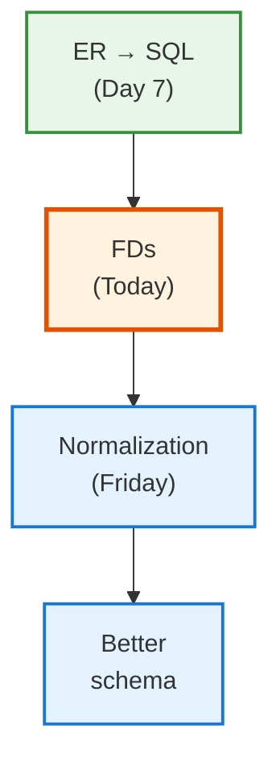
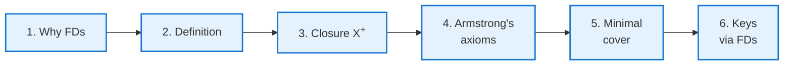
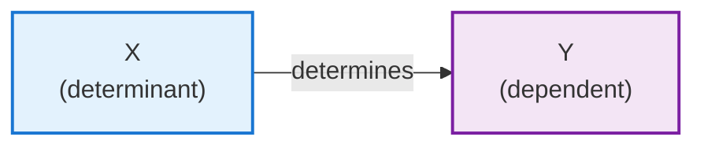
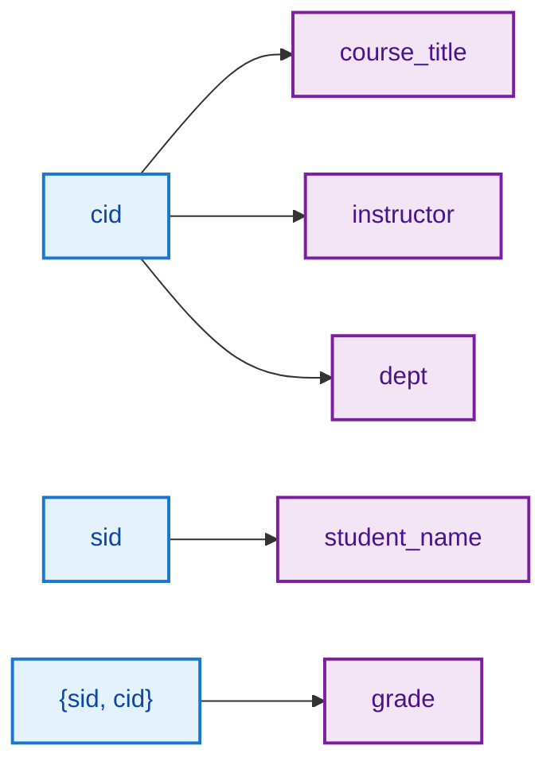
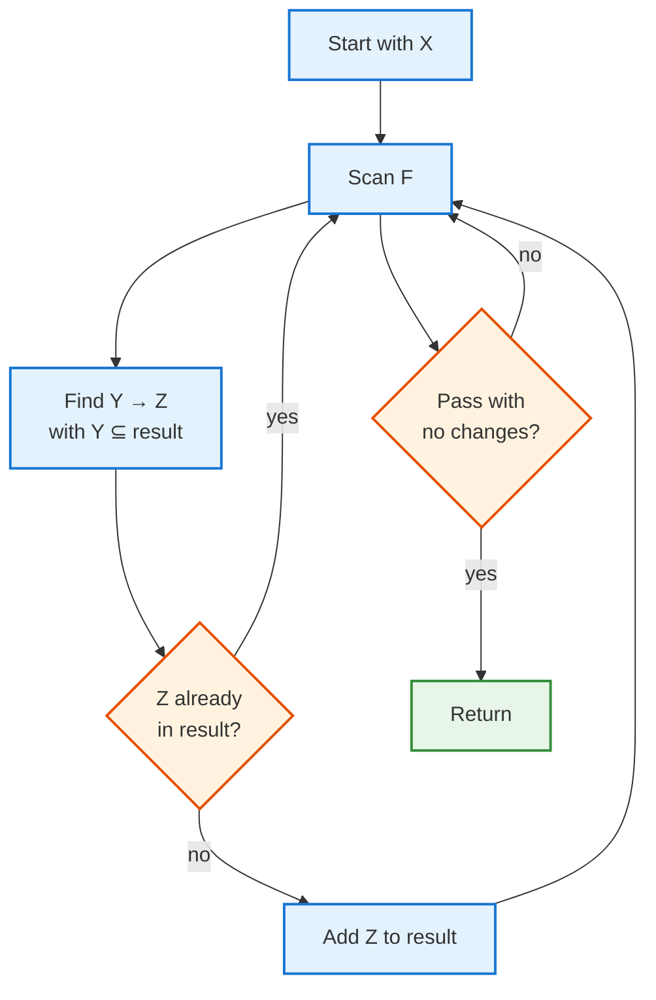
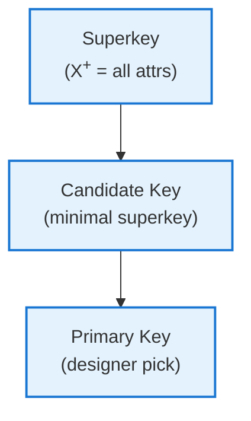

<!-- _class: lead -->

# Day 8: Functional Dependencies

**COP 5725 - Database Management**
Wednesday, September 9, 2026

The math that finds redundancy ER hides

<!--
First class back after Labor Day. Some students will have lost their week-1 momentum; the FD material is dense, so open with motivation rather than definitions. Pace 50 min total. The closure algorithm (Part 3) is the central skill — budget 12 min for it and walk two worked examples on the board.
-->

---

# Where We Are

<div class="columns-left-wide">
<div>

Last Friday we translated an ER diagram into a SQL schema.

The translation worked — but it left three questions unanswered:

- Is the schema redundant?
- Is the decomposition lossless?
- Are dependencies preserved?

Today's tool — **functional dependencies** — gives us the language to ask these questions precisely. Friday's tool — **normalization** — answers them.

</div>
<div>



</div>
</div>

---

# Today's Roadmap



The closure algorithm in step 3 is the central skill. Everything afterward uses it.

---

<!-- _class: lead -->

# Part 1: Why Functional Dependencies

---

# A Schema That Hides a Problem

```sql
CREATE TABLE enrollment_denormalized (
  sid          bigint,
  student_name text,
  cid          text,
  course_title text,
  instructor   text,
  department   text,
  grade        char(2),
  PRIMARY KEY (sid, cid)
);
```

The schema accepts data. SQL is happy. The compiler will not complain.

But look at what we are about to store…

<!--
Set up the example. The denormalized enrollment table is the canonical teaching example for FDs and anomalies. Students often "see" the redundancy intuitively before we name it.
-->

---

# The Data It Generates

| sid | student_name | cid     | course_title | instructor | dept | grade |
|-----|--------------|---------|--------------|------------|------|-------|
| 1 | Ada | COP5725 | Database Management | Grant | CS | A |
| 1 | Ada | COT5405 | Algorithms | Sahni | CS | B+ |
| 2 | Bob | COP5725 | Database Management | Grant | CS | B |
| 3 | Chia | COP5725 | Database Management | Grant | CS | A- |

<div class="error">

**Problems visible by inspection:**

- "Database Management" appears 3 times — what if it changes name?
- "Grant" appears 3 times — what if I switch institutions?
- "Ada" appears in 2 rows — what if she changes her name?

</div>

<!--
This is the redundancy. The schema permits inconsistent updates: someone could "fix" Ada's name in one row but not the other. FDs are the tool to detect that this *can happen* — before the bug bites.
-->

---

# What We Need a Theory For

ER thinking caught some redundancies (we put `grade` on the relationship, not the student).

But ER did not catch:

- `cid` determines `course_title`
- `cid` determines `instructor`
- `cid` determines `dept`
- `sid` determines `student_name`

These are **functional dependencies**.
They are facts about the world that the schema does not enforce.

<!--
The phrase "facts about the world that the schema does not enforce" is the key intuition. An FD is a real-world constraint we declare separately from the table definition.
-->

---

<!-- _class: lead -->

# Part 2: Definition

---

# Functional Dependency

<div class="columns">
<div>

Given a relation $R$ with attributes, an **FD** $X \rightarrow Y$ holds if:

For every pair of tuples $t_1, t_2 \in R$:
$$t_1[X] = t_2[X] \Rightarrow t_1[Y] = t_2[Y]$$

In English: any two tuples that agree on $X$ must agree on $Y$.

We read $X \rightarrow Y$ as "$X$ functionally determines $Y$" or "$X$ implies $Y$."

</div>
<div>



</div>
</div>

<!--
Stress: the FD is a statement *about the meaning of the data*, not about a particular table. Whether `cid → course_title` holds depends on the real world (one title per course id), not on which rows happen to be loaded.
-->

---

# FDs in the Enrollment Table



The grade is the only attribute that depends on *both* student and course. Everything else is determined by one of the singletons.

That asymmetry is what the schema fails to capture.

<!--
Walk these FDs out loud. The class should agree that each holds in the real world. The FD `{sid, cid} → grade` is the only one whose determinant is composite — and it's the only FD whose dependent is the table's "real" payload.
-->

---

# Trivial vs Non-Trivial FDs

<div class="columns">
<div>

### Trivial

$X \rightarrow Y$ is **trivial** if $Y \subseteq X$.

Always holds. Useless on its own.

Examples:
- $\{sid, cid\} \rightarrow sid$
- $cid \rightarrow cid$

</div>
<div>

### Non-Trivial

$X \rightarrow Y$ is **non-trivial** if $Y \not\subseteq X$.

These are the FDs that matter.

Examples:
- $cid \rightarrow course\_title$
- $sid \rightarrow student\_name$

</div>
</div>

Most discussion of FDs is implicitly about non-trivial ones. Trivial FDs are a corner case in the axioms.

---

<!-- _class: lead -->

# Part 3: Attribute Closure $X^+$

---

# What Closure Means

Given a set of FDs $F$ and an attribute set $X$, the **closure** $X^+$ is every attribute that $X$ functionally determines, directly or transitively.

$$X^+ = \{\, A : F \models X \rightarrow A \,\}$$

This is the workhorse of FD reasoning.

Two questions closure answers:

1. Does $X \rightarrow Y$ follow from $F$? — Check whether $Y \subseteq X^+$.
2. Is $X$ a superkey? — Check whether $X^+$ equals all attributes.

---

# The Closure Algorithm

<div class="columns">
<div>

```
Algorithm: ComputeClosure(X, F)
  result = X
  repeat:
    changed = false
    for each FD Y → Z in F:
      if Y ⊆ result and Z ⊄ result:
        result = result ∪ Z
        changed = true
  until not changed
  return result
```

</div>
<div>



</div>
</div>

The loop terminates because `result` can grow at most to all attributes.

---

# Worked Example: Closure Step by Step

Given:

$$F = \{\, A \rightarrow B,\;\; B \rightarrow C,\;\; CD \rightarrow E,\;\; CE \rightarrow GH,\;\; G \rightarrow A \,\}$$

Compute $\{A, D\}^+$:

| Pass | result so far | FD applied | added |
|------|---------------|-----------|-------|
| 0 | $\{A, D\}$ | — | — |
| 1 | $\{A, B, D\}$ | $A \rightarrow B$ | $B$ |
| 2 | $\{A, B, C, D\}$ | $B \rightarrow C$ | $C$ |
| 3 | $\{A, B, C, D, E\}$ | $CD \rightarrow E$ | $E$ |
| 4 | $\{A, B, C, D, E, G, H\}$ | $CE \rightarrow GH$ | $G, H$ |
| 5 | $\{A, B, C, D, E, G, H\}$ | $G \rightarrow A$ — already in | none |

$\{A, D\}^+ = \{A, B, C, D, E, G, H\}$ — the entire attribute set. So $\{A, D\}$ is a **superkey**.

<!--
Walk this on the board. The tricky moment is pass 4 — students sometimes try to apply CE → GH before they have both C and E in the result. The algorithm forces honesty: check the *full* left side before applying.
-->

---

# Closure: Your Turn

Given:

$$F = \{\, A \rightarrow B,\;\; BC \rightarrow D,\;\; D \rightarrow E,\;\; AE \rightarrow C \,\}$$

<div class="interactive">

**Compute these closures:**

1. $\{A\}^+$
2. $\{A, C\}^+$
3. $\{A, B, C\}^+$

Show your work. 90 seconds at your seat.

</div>

<!--
Answers:
1. {A, B} — only A → B applies; nothing else has a left side in result.
2. {A, B, C, D, E} — A→B adds B; BC→D adds D; D→E adds E; AE→C is already true.
3. {A, B, C, D, E} — same as above plus the extra C didn't add anything new.

Walk through #2 carefully on the board — it's the one that exercises the most rules.
-->

---

<!-- _class: lead -->

# Part 4: Armstrong's Axioms

---

# Three Inference Rules

<div class="columns-3">
<div>

<div class="axiom">

### Reflexivity

If $Y \subseteq X$, then $X \rightarrow Y$.

A set determines its subsets.

</div>

</div>
<div>

<div class="axiom">

### Augmentation

If $X \rightarrow Y$, then $XZ \rightarrow YZ$.

Adding the same attributes to both sides preserves the FD.

</div>

</div>
<div>

<div class="axiom">

### Transitivity

If $X \rightarrow Y$ and $Y \rightarrow Z$, then $X \rightarrow Z$.

Chains compose.

</div>

</div>
</div>

These three rules are **sound** (everything they derive is true) and **complete** (everything true is derivable).
Armstrong proved completeness in 1974.

<!--
Sound + complete is a strong claim — we can use *only* these three rules and recover every valid FD that follows from a given set. The closure algorithm is one efficient way to apply them.
-->

---

# Useful Derived Rules

From the three axioms we can prove four more rules. They are not strictly needed but save work.

<div class="columns">
<div>

### Union

If $X \rightarrow Y$ and $X \rightarrow Z$, then $X \rightarrow YZ$.

### Decomposition

If $X \rightarrow YZ$, then $X \rightarrow Y$ and $X \rightarrow Z$.

</div>
<div>

### Pseudo-Transitivity

If $X \rightarrow Y$ and $WY \rightarrow Z$, then $WX \rightarrow Z$.

### Composition

If $X \rightarrow Y$ and $W \rightarrow Z$, then $XW \rightarrow YZ$.

</div>
</div>

The first two are most often used by hand. The closure algorithm bundles all four into a procedure.

---

<!-- _class: lead -->

# Part 5: Equivalence and Minimal Cover

---

# When Two FD Sets Are Equivalent

Two FD sets $F$ and $G$ are **equivalent** if they derive the same conclusions.

$$F \equiv G \iff F^+ = G^+$$

where $F^+$ is the set of all FDs derivable from $F$ — the **closure of the FD set itself**.

How to check $F \equiv G$ without computing $F^+$ directly:

- Verify each FD in $G$ follows from $F$ (using closure on each $G$-FD's left side under $F$)
- Verify each FD in $F$ follows from $G$ (the other direction)

<!--
The two-sided check is fast. For each FD X → Y in G, compute X+ under F. If Y ⊆ X+, that FD is implied. Repeat both directions.
-->

---

# Minimal Cover

A **minimal cover** (or canonical cover) is an equivalent FD set with three properties:

<div class="columns-3">
<div>

### 1. Right side single

Every FD has a single attribute on its right side.

$AB \rightarrow CD$ becomes
$AB \rightarrow C$, $AB \rightarrow D$.

</div>
<div>

### 2. No extraneous LHS

Every attribute on the left side is needed.

If $AB \rightarrow C$ but $A^+$ already contains $C$, drop $B$.

</div>
<div>

### 3. No redundant FD

Every FD in the cover is needed.

If $F - \{X \rightarrow Y\}$ still implies $X \rightarrow Y$, drop it.

</div>
</div>

Minimal covers are not unique, but every minimal cover has the same number of FDs.

---

# Worked Example: Minimal Cover

Given $F = \{\, A \rightarrow BC,\;\; B \rightarrow C,\;\; A \rightarrow B,\;\; AB \rightarrow C \,\}$:

**Step 1 — single right sides:**

$F' = \{\, A \rightarrow B,\;\; A \rightarrow C,\;\; B \rightarrow C,\;\; A \rightarrow B,\;\; AB \rightarrow C \,\}$

Remove the duplicate $A \rightarrow B$.

**Step 2 — remove extraneous LHS attributes:**

For $AB \rightarrow C$: is $A$ alone enough? $\{A\}^+ = \{A, B, C\}$ — yes, $C$ is in the closure. So $AB \rightarrow C$ becomes $A \rightarrow C$.

**Step 3 — remove redundant FDs:**

We now have $\{\, A \rightarrow B,\;\; A \rightarrow C,\;\; B \rightarrow C \,\}$.
Is $A \rightarrow C$ redundant? Without it, $\{A\}^+ = \{A, B, C\}$ via $A \rightarrow B$ then $B \rightarrow C$. Yes — drop it.

**Minimal cover:** $\{\, A \rightarrow B,\;\; B \rightarrow C \,\}$

<!--
Walk this on the board. The order of operations matters: do single-RHS first, then extraneous LHS, then redundant FDs. Doing them out of order can miss reductions.
-->

---

# Candidate Keys, Redefined

In Day 3 we defined keys intuitively. With FDs we get a precise definition.

<div class="columns">
<div>

### Superkey

$X$ is a superkey of $R$ if $X^+$ contains every attribute of $R$.

### Candidate Key

$X$ is a candidate key if $X$ is a superkey **and** no proper subset of $X$ is a superkey.

### Primary Key

The candidate key chosen by the designer.

</div>
<div>



</div>
</div>

To find candidate keys: compute closures of candidate attribute sets and look for minimal ones whose closure covers $R$.

---

# Finding Keys: Worked Example

Schema $R(A, B, C, D, E)$ with $F = \{\, A \rightarrow B,\;\; BC \rightarrow D,\;\; D \rightarrow E,\;\; CE \rightarrow A \,\}$.

Try $\{A, C\}$:
$\{A, C\}^+ = \{A, B, C, D, E\}$ — superkey.

Is $\{A\}$ alone a superkey? $\{A\}^+ = \{A, B\}$ — no.

Is $\{C\}$ alone a superkey? $\{C\}^+ = \{C\}$ — no.

So $\{A, C\}$ is a candidate key.

Try $\{C, D\}$:
$\{C, D\}^+ = \{C, D, E, A, B\}$ — also superkey.
Is $\{C\}$ or $\{D\}$ alone a superkey? No.

So $\{C, D\}$ is also a candidate key.

A relation can have multiple candidate keys.

<!--
Most students assume there's one "the key." A schema can have two or three candidate keys — the choice of primary key is then a design call. PostgreSQL allows additional UNIQUE constraints to record the others.
-->

---

# Wrap-up

You now have:

<div class="columns">
<div>

- A precise definition of when one attribute set determines another
- The closure algorithm to compute all consequences of a set of FDs
- Armstrong's axioms — sound and complete inference rules

</div>
<div>

- Minimal cover construction — the smallest equivalent FD set
- A way to find candidate keys mechanically
- A language for the redundancy ER cannot see

</div>
</div>

Friday turns this language into normal forms.

---

# Friday: Normal Forms + Quiz 1

The normal forms (1NF, 2NF, 3NF, BCNF) are decision procedures built on FD reasoning.

We will:
- See the anomalies that motivate each form
- Decompose schemas to reach each form
- Take Quiz 1 in the last 10 minutes — Section 1 cumulative

Read GMW Ch. 3.4-3.7 before class.

---

# Practice Before Friday

Four problems on the handout:

1. Compute three closures from a given FD set.
2. Find all candidate keys of a small schema.
3. Find a minimal cover for a given FD set.
4. Argue whether one FD set is equivalent to another.

Answers due in your repo before 8:30 AM Fri Sep 11.

---

# Questions

What is on your mind?

Project 1 work continues. Friday's quiz closes Section 1.

<!--
Common questions: "Are FDs declared somewhere in PostgreSQL?" (Foreign keys are; arbitrary FDs are not — they live in the schema design, enforced by the structure rather than declared explicitly.) "Why don't tools auto-derive minimal cover?" (Some do — schema design tools like ERwin and Hackolade — but the human is usually the source of FDs, so manual cover construction stays common.) "Can FDs change over time?" (Yes — the meaning of the data can evolve. A schema that was BCNF for last year's business rules may not be anymore.)
-->
