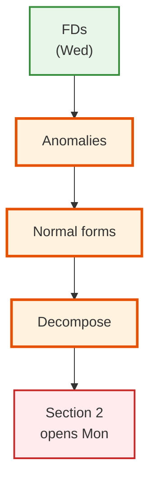
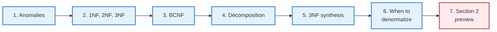
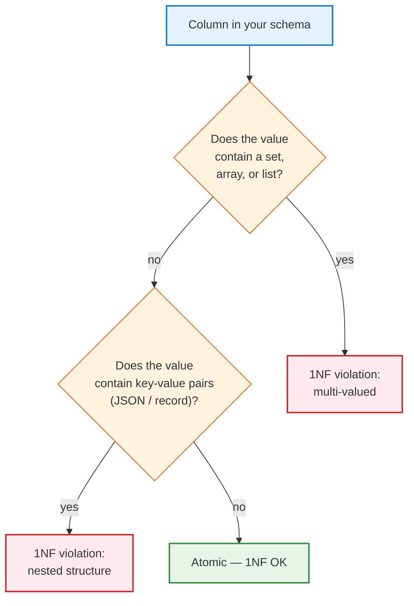
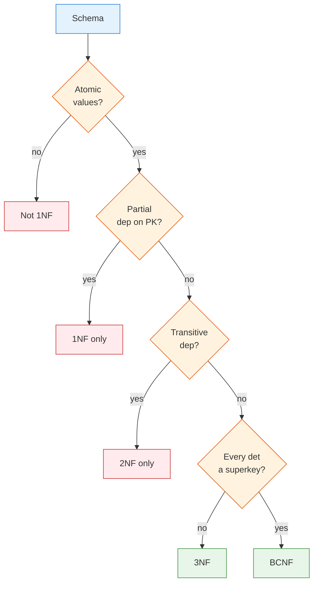

<!-- _class: lead -->

# Day 9: Normal Forms — Section 1 Closes

**COP 5725 - Database Management**
Friday, September 11, 2026

Anomaly → decomposition → normal form

<!--
Closes Section 1. Full 50 min of lecture: 5 min anomalies, 12 min for the 1NF→BCNF ladder, 8 min decomposition properties, 3 min synthesis algorithm and denormalization caveat. Use clicker checks at the end of each normal form to gauge comprehension before moving on.
-->

---

# Where We Are

<div class="columns-left-wide">
<div>

Wednesday gave us functional dependencies — the language for talking about data constraints beyond what the schema declares.

Today we use FDs to **detect** problems and **fix** them.

By the end of the hour you will:

- Spot four kinds of anomaly
- Recognize 1NF, 2NF, 3NF, BCNF on sight
- Decompose a schema to reach any normal form
- Know when *not* to normalize

Section 1 closes with this lecture.

</div>
<div>



</div>
</div>

---

# Today's Roadmap



---

<!-- _class: lead -->

# Part 1: The Anomaly Problem

---

# The Denormalized Table, Again

| sid | student_name | cid | course_title | instructor | dept | grade |
|-----|--------------|-----|--------------|------------|------|-------|
| 1 | Ada | COP5725 | Database Management | Grant | CS | A |
| 1 | Ada | COT5405 | Algorithms | Sahni | CS | B+ |
| 2 | Bob | COP5725 | Database Management | Grant | CS | B |
| 3 | Chia | COP5725 | Database Management | Grant | CS | A- |

FDs at work:

- $sid \rightarrow student\_name$
- $cid \rightarrow course\_title,\, instructor,\, dept$
- $\{sid, cid\} \rightarrow grade$

The redundancy is visible. The anomalies it produces are not — until they bite.

---

# Three Kinds of Anomaly

<div class="columns-3">
<div>

<div class="anomaly">

### Update

To change "Grant" to "Christan Grant", I must update **every row** with COP5725.

Forget one → inconsistency.

</div>

</div>
<div>

<div class="anomaly">

### Insertion

To add a new course **without any enrolled students**, I have no row to insert.

The schema requires `sid`.

</div>

</div>
<div>

<div class="anomaly">

### Deletion

If Chia drops her only course, I lose the row — and with it, *Chia's name and major*.

Student data tied to enrollment data.

</div>

</div>
</div>

A fourth kind — *redundancy* — is the unifying cause. Anomalies are symptoms; redundancy is the disease.

<!--
The three anomalies are the empirical motivation for normalization. Students who haven't seen them in a real system sometimes find normalization abstract. Walk one concrete failure for each.
-->

---

<!-- _class: lead -->

# Part 2: 1NF, 2NF, 3NF

---

# 1NF: Atomic Values

<div class="nf">

**Rule:** Every attribute is atomic — single-valued, no sets, no nested structure.

</div>

<div class="columns">
<div>

### Violation

| sid | name | phones |
|-----|------|--------|
| 1 | Ada | {555-1234, 555-9999} |
| 2 | Bob | {555-2222} |

</div>
<div>

### 1NF

| sid | name | phone |
|-----|------|-------|
| 1 | Ada | 555-1234 |
| 1 | Ada | 555-9999 |
| 2 | Bob | 555-2222 |

</div>
</div>

Arrays, JSON, composites — all three are technically 1NF violations under the textbook rule. We unpack each below.

---

# Arrays Violate 1NF

```sql
-- This violates textbook 1NF
CREATE TABLE student (
  sid bigint PRIMARY KEY,
  name text,
  phones text[]      -- multi-valued attribute
);

INSERT INTO student VALUES (1, 'Ada', ARRAY['555-1234', '555-9999']);

-- Queries that "look into" the array confirm the violation
SELECT * FROM student WHERE '555-1234' = ANY(phones);
SELECT unnest(phones) AS phone FROM student;
```

<div class="anomaly">

**Why this is a 1NF violation:** the `phones` column holds a **set** of values per row, not a single value. The relational operators (`=`, `IS NULL`, `IN`) cannot work meaningfully against the column without special syntax (`= ANY`, `unnest`, `array_length`).

</div>

The "1NF-compliant" form puts each phone on its own row in a side table. We saw this rule in Day 7.

<!--
The trap here: PostgreSQL's arrays are a real feature, used in production. Calling them a "1NF violation" feels pedantic. The point is to recognize *why* the textbook rule exists — arrays force you out of pure relational algebra into array-specific operators.
-->

---

# JSON / JSONB Violates 1NF (More Egregiously)

```sql
-- A JSONB column hides arbitrary nested structure
CREATE TABLE webhook (
  webhook_id bigint PRIMARY KEY,
  received_at timestamptz NOT NULL,
  payload jsonb NOT NULL
);

INSERT INTO webhook VALUES (
  1, now(),
  '{"event_type": "order.placed", "items": [
      {"sku": "A1", "qty": 2},
      {"sku": "B2", "qty": 1}
    ], "customer": {"id": 42, "email": "ada@uf.edu"}}'
);
```

A single JSONB value contains:
- A top-level object (multiple fields)
- A nested array of items (multi-valued)
- A nested object for customer (composite)

**Every layer of nesting is another 1NF violation.** The value is neither atomic nor single-valued by the textbook definition.

---

# Why We Allow JSON Anyway

<div class="columns">
<div>

### The textbook view

JSON is **always** wrong. The columns should be normalized to side tables:

- `webhook(id, received_at, event_type)`
- `webhook_item(webhook_id, sku, qty)`
- `webhook_customer(webhook_id, customer_id, email)`

This is 1NF + 2NF + 3NF compliant.

</div>
<div>

### The engineering view

JSON is OK **when**:

- The schema is evolving rapidly
- The contents are queried as a whole (not into individual fields)
- The cost of normalization exceeds the cost of opaque storage

JSON is **bad** when:

- You query into specific fields (`payload ->> 'event_type'`) — those fields should be columns
- You join on values inside the JSON
- Aggregates over JSON fields dominate your workload

</div>
</div>

> Treat JSON as a 1NF escape hatch with real cost. Use it deliberately, not by default.

<!--
The "JSON as 1NF escape hatch" framing is the modern compromise. PostgreSQL's JSONB is a genuinely useful feature; treating it as forbidden is unrealistic. But treating it as a substitute for proper schema design is the path to a write-only column.
-->

---

# Composite Types: The Rarest Violation

```sql
-- A composite (record) type packs multiple values into one column
CREATE TYPE address AS (
  street text,
  city   text,
  state  char(2),
  zip    text
);

CREATE TABLE customer (
  cid bigint PRIMARY KEY,
  name text,
  mailing address      -- composite column
);
```

Composite types in PostgreSQL violate 1NF most explicitly: the value is literally **a tuple of values** stuffed into one column.

These almost always lose. The normalized form (`street`, `city`, `state`, `zip` as separate columns) is easier to query, easier to index, easier to evolve.

PostgreSQL keeps composite types for compatibility with object-relational extensions and stored procedure return values. Production schemas rarely use them.

---

# Detecting 1NF Violations



Use the decision flow to audit your project's schema. Arrays, JSON, and composites should each be a deliberate choice — never accidental.

---

# 2NF: No Partial Dependencies

<div class="nf">

**Rule:** Every non-key attribute depends on the **whole** primary key, not on a part of it.

</div>

<div class="columns">
<div>

### Violation

PK = $\{sid, cid\}$.

| sid | cid | grade | student_name |
|-----|-----|-------|--------------|
| 1 | COP5725 | A | Ada |

$sid \rightarrow student\_name$ is a partial dependency — `student_name` depends on only part of the key.

</div>
<div>

### 2NF

Split into two tables:

| sid | name |
|-----|------|
| 1 | Ada |

| sid | cid | grade |
|-----|-----|-------|
| 1 | COP5725 | A |

</div>
</div>

2NF only matters when the primary key is composite. Tables with single-attribute keys are 2NF automatically.

<!--
2NF is a stepping stone. In practice we usually skip to 3NF or BCNF. But the partial-dependency idea is essential vocabulary for the textbook and for some quiz questions.
-->

---

# 3NF: No Transitive Dependencies

<div class="nf">

**Rule:** Every non-key attribute depends on the key, the whole key, and **nothing but the key**.

Equivalently: no non-key attribute determines another non-key attribute.

</div>

<div class="columns">
<div>

### Violation

| cid | course_title | instructor | dept |
|-----|--------------|------------|------|
| COP5725 | Database | Grant | CS |

Key: `cid`. But `instructor → dept` — a transitive dependency.

</div>
<div>

### 3NF

| cid | course_title | instructor |
|-----|--------------|------------|
| COP5725 | Database | Grant |

| instructor | dept |
|------------|------|
| Grant | CS |

</div>
</div>

Most well-designed schemas in production aim for 3NF.

---

# 3NF, More Precisely

Formal definition: for every non-trivial FD $X \rightarrow A$ in the relation,

at least one of the following must hold:

- $X$ is a superkey
- $A$ is part of a candidate key

The second clause is the wiggle room that distinguishes 3NF from BCNF — discussed next.

<!--
The "A is part of a candidate key" allowance is what saves 3NF in cases where strict BCNF would force a dependency-breaking decomposition. It's the formal reason 3NF synthesis always succeeds while BCNF decomposition sometimes can't.
-->

---

<!-- _class: lead -->

# Part 3: BCNF

---

# BCNF: The Stronger Cousin

<div class="nf">

**Rule:** For every non-trivial FD $X \rightarrow Y$, $X$ is a superkey.

(No exception for "A part of a candidate key.")

</div>

BCNF is 3NF without the wiggle room.

Most 3NF schemas are also BCNF. The cases where they differ involve overlapping candidate keys.

<!--
The "overlapping candidate keys" case is rare in practice but the textbook covers it because it reveals an important tradeoff: BCNF is strictly more redundancy-free, but cannot always be reached while preserving all dependencies.
-->

---

# 3NF vs BCNF: The Classic Example

Schema: $teach(student, instructor, subject)$

FDs:
- $\{student, subject\} \rightarrow instructor$ — a student studies a subject with one instructor
- $instructor \rightarrow subject$ — an instructor teaches one subject

Candidate keys: $\{student, subject\}$ and $\{student, instructor\}$.

Is it 3NF? Yes — `subject` in the second FD's RHS is part of a candidate key.
Is it BCNF? No — `instructor` is not a superkey.

<div class="columns">
<div>

### Decomposing to BCNF

$instructor(student, instructor)$
$expertise(instructor, subject)$

</div>
<div>

The decomposition is BCNF — but it loses the FD $\{student, subject\} \rightarrow instructor$.

The FD can no longer be enforced by either single table.

</div>
</div>

<!--
This is the classic illustration of the BCNF / 3NF / dependency-preservation tension. BCNF is stricter; 3NF synthesis always preserves dependencies; sometimes you cannot have both.
-->

---

<!-- _class: lead -->

# Part 4: Decomposition Properties

---

# Two Tests Every Decomposition Must Pass (or Should)

<div class="columns">
<div>

### Lossless Join (required)

The natural join of the decomposed tables must reproduce the original.

Formal test: for $R \rightarrow R_1, R_2$, the decomposition is lossless if
$$R_1 \cap R_2 \rightarrow R_1\;\;\text{or}\;\;R_1 \cap R_2 \rightarrow R_2$$

(The intersection of the two schemas must be a key of at least one of them.)

</div>
<div>

### Dependency Preservation (preferred)

Every FD in the original schema can still be enforced after decomposition — either inside a single decomposed table, or as a constraint that doesn't require a join.

Some BCNF decompositions cannot preserve dependencies. 3NF synthesis can always preserve them.

</div>
</div>

<!--
Lossless join is non-negotiable. Dependency preservation is a soft requirement — sometimes you decompose for BCNF and lose a dependency, then enforce it at the application or trigger level. The Codd/textbook position is to prefer 3NF when BCNF would break dependency preservation.
-->

---

# Lossless Join: Worked Example

Original $R(A, B, C)$ with $F = \{A \rightarrow B,\, B \rightarrow C\}$.

Decompose to $R_1(A, B)$ and $R_2(B, C)$.

Intersection: $\{B\}$.
Does $B$ determine all of $R_1$ or $R_2$?
- $B^+ = \{B, C\}$ — yes, $B$ is a key of $R_2$.

Lossless. The natural join $R_1 \bowtie R_2$ recovers every original tuple.

<div class="interactive">

**Counter-example to remember:** decomposing into $R_1(A, B)$ and $R_2(A, C)$. Intersection is $\{A\}$. $A^+ = \{A, B, C\}$, so $A$ is a superkey of both — also lossless. But decomposing into $R_1(A, B)$ and $R_2(C, A)$ where intersection is $\{A\}$... still lossless. The bad decomposition is one where the intersection determines *neither* side.

</div>

---

<!-- _class: lead -->

# Part 5: 3NF Synthesis

---

# The Synthesis Algorithm

3NF synthesis is the constructive proof that **every relation has a 3NF decomposition** that:

- is lossless join
- preserves all dependencies

```
Algorithm: SynthesizeTo3NF(R, F)
  1. Find a minimal cover F' of F.
  2. For each FD X → A in F' that shares a left side, group them: X → {A1, A2, ...}.
  3. For each group, create a relation with all the attributes.
  4. If no relation contains a candidate key of R, add one with a candidate key.
```

Output: a set of 3NF relations whose union recovers $R$ and whose constraints recover $F$.

---

# Synthesis: Worked Example

Schema $R(A, B, C, D, E)$ with $F = \{\, AB \rightarrow C,\;\; D \rightarrow E,\;\; AB \rightarrow D,\;\; C \rightarrow B \,\}$.

**Step 1.** Minimal cover (after work): $\{AB \rightarrow C, AB \rightarrow D, C \rightarrow B, D \rightarrow E\}$.

**Step 2.** Group by left side:
- $AB$: $\{C, D\}$
- $C$: $\{B\}$
- $D$: $\{E\}$

**Step 3.** Create relations:
- $R_1(A, B, C, D)$
- $R_2(C, B)$ — already covered by $R_1$, drop
- $R_3(D, E)$

**Step 4.** $R_1$ contains a candidate key ($\{A, B\}$). Done.

Final: $R_1(A, B, C, D)$ and $R_3(D, E)$.

<!--
Walk this on the board. Step 4 is the safety net — if no decomposed relation contains a candidate key, lossless join can fail.
-->

---

<!-- _class: lead -->

# Part 6: When to Denormalize

---

# Normalization Has a Cost

<div class="columns">
<div>

### Normalized

- No redundancy
- Cleaner update semantics
- More tables, more joins

A read often touches 4-5 tables.

</div>
<div>

### Denormalized

- Strategic redundancy
- Joins replaced with single-table reads
- Update logic moves up the stack

Common in:
- Reporting tables
- Materialized views
- Read-heavy analytics

</div>
</div>

The textbook position: design to BCNF, denormalize where measured query patterns demand it. Never denormalize first.

<!--
The "never denormalize first" rule is the practical version of the academic position. Materialized views and indexed derived columns (PostgreSQL's GENERATED ALWAYS AS) give us most denormalization benefits without losing the normalized source of truth.
-->

---

# Normal-Form Decision Flowchart



<!--
This is the decision procedure for quiz/exam questions: given a schema and FDs, place it in the right box. Walk one example on the board.
-->

---

# Section 1 Wrap-up

<div class="columns-3">
<div>

### What you can do

- Read and write relational algebra
- Translate to/from SQL
- Draw and translate ER diagrams
- Reason about FDs and normal forms

</div>
<div>

### Next: Section 2

SQL Mastery (Weeks 5-7):
- DDL, joins, aggregation
- Subqueries
- CTEs
- Window functions
- Recursive queries

</div>
<div>

### Section 1 milestones

- Project 0: due last Friday
- Project 1: due Sep 25 — schema design + SQL on your dataset
- Codd reading response embedded in Project 1

</div>
</div>

---

# After Today

Project 1 is the focus of next week:

- Schema design for your claimed dataset
- 12-15 SQL queries answering business-style questions
- Peer-graded with small-group presentations Sep 28-30

Section 2 opens Monday with SQL DDL and single-table SELECT. The university schema we have used in lectures will give way to your real dataset for project work.

Have a good weekend.

<!--
End on the project, not on testing. Section 1 ends with material absorbed; assessment of that absorption comes via the cumulative Exam 1 in five weeks, not via a separate paper quiz today.
-->

---

# Questions

What is on your mind?

(After the quiz is collected.)

<!--
Most questions post-quiz are about specific items they second-guessed. Resist re-explaining individual items; tell students they'll get the graded quiz back Monday with solutions and they can ask in office hours.
-->
