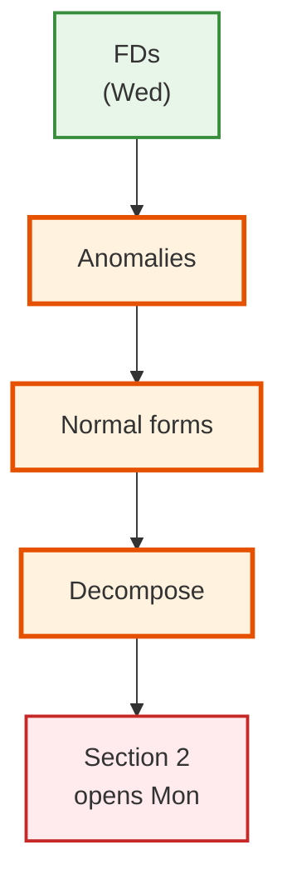
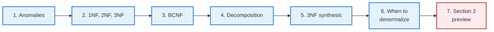
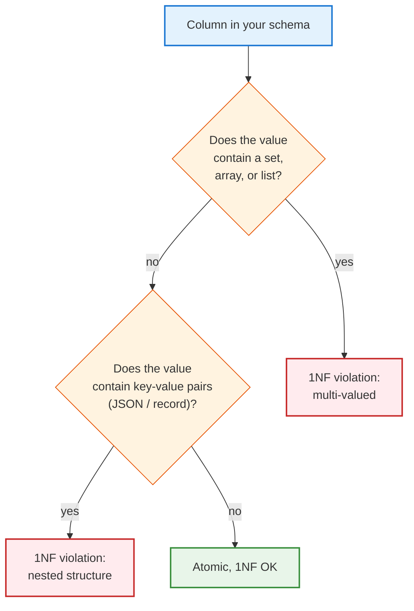
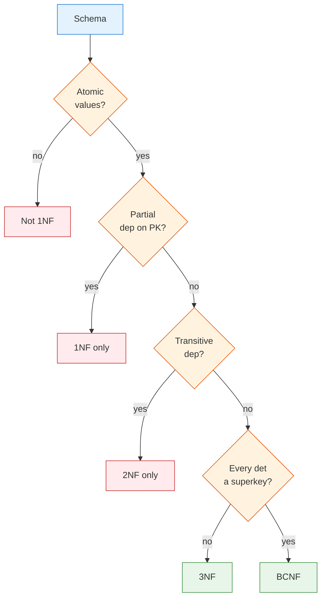

<!-- _class: lead -->

# Day 9: Normal Forms

**COP 5725 - Database Management Systems**
Friday, September 11, 2026

Anomalies, decompositions, and normal forms close Section 1

<!--
Closes Section 1. Full 50 min of lecture: 5 min anomalies, 12 min for the 1NF→BCNF ladder, 8 min decomposition properties, 3 min synthesis algorithm and denormalization caveat. Use clicker checks at the end of each normal form to gauge comprehension before moving on.
-->

---

# Where We Are

<div class="columns-left-wide">
<div>

Wednesday covered functional dependencies, the language for data constraints beyond what the schema declares.

Today we use FDs to detect problems and fix them (Textbook §3.3, p. 85).

Today covers:

- The anomalies redundancy produces
- The normal forms 1NF, 2NF, 3NF, and BCNF
- Decomposition and its two correctness tests
- When *not* to normalize

Section 1 closes with this lecture.

</div>
<div>



</div>
</div>

---

# Today's Roadmap



---

<!-- _class: lead -->

# Part 1: The Anomaly Problem

---

# The Denormalized Table

<table>
<thead><tr><th>student_id</th><th>student_name</th><th>course_id</th><th>course_title</th><th>instructor</th><th>dept</th><th>grade</th></tr></thead>
<tbody>
<tr><td>1</td><td style="background:#F8BBD0">Ada</td><td>COP5725</td><td style="background:#FFE082">Database Management Systems</td><td style="background:#FFE082">Grant</td><td style="background:#FFE082">CS</td><td>A</td></tr>
<tr><td>1</td><td style="background:#F8BBD0">Ada</td><td>COT5405</td><td>Algorithms</td><td>Sahni</td><td>CS</td><td>B+</td></tr>
<tr><td>2</td><td>Bob</td><td>COP5725</td><td style="background:#FFE082">Database Management Systems</td><td style="background:#FFE082">Grant</td><td style="background:#FFE082">CS</td><td>B</td></tr>
<tr><td>3</td><td>Chia</td><td>COP5725</td><td style="background:#FFE082">Database Management Systems</td><td style="background:#FFE082">Grant</td><td style="background:#FFE082">CS</td><td>A-</td></tr>
</tbody>
</table>

FDs at work:

- $student\_id \rightarrow student\_name$
- $course\_id \rightarrow course\_title,\, instructor,\, dept$
- $\{student\_id, course\_id\} \rightarrow grade$

<div class="small">

Amber cells repeat the facts `course_id` determines, and pink cells repeat the fact `student_id` determines.

</div>

The redundancy is visible. The anomalies it produces stay hidden until they bite.

---

# Three Kinds of Anomaly

<div class="columns-3">
<div>

<div class="anomaly">

### Update

To change "Grant" to "Christan Grant", I must update **every row** with COP5725.

Forgetting one creates an inconsistency.

</div>

</div>
<div>

<div class="anomaly">

### Insertion

To add a new course **without any enrolled students**, I have no row to insert.

The schema requires `student_id`.

</div>

</div>
<div>

<div class="anomaly">

### Deletion

If Chia drops her only course, I lose the row and with it *Chia's name*.

Student data tied to enrollment data.

</div>

</div>
</div>

The unifying cause is redundancy (Textbook §3.3.1, p. 86). Anomalies are the symptoms; redundancy is the disease.

<!--
The three anomalies are the empirical motivation for normalization. Students who haven't seen them in a real system sometimes find normalization abstract. Walk one concrete failure for each.
-->

---

<!-- _class: lead -->

# Part 2: 1NF, 2NF, 3NF

---

# 1NF Requires Atomic Values

<div class="nf">

**Rule:** Every attribute is atomic: single-valued, no sets, no nested structure (Textbook §3.5, p. 103).

</div>

<div class="columns">
<div>

### Violation

<table>
<thead><tr><th>student_id</th><th>name</th><th>phones</th></tr></thead>
<tbody>
<tr><td>1</td><td>Ada</td><td style="background:#FFE082">{555-1234, 555-9999}</td></tr>
<tr><td>2</td><td>Bob</td><td style="background:#FFE082">{555-2222}</td></tr>
</tbody>
</table>

</div>
<div>

### 1NF

<table>
<thead><tr><th>student_id</th><th>name</th><th>phone</th></tr></thead>
<tbody>
<tr style="background:#E8F5E9"><td>1</td><td>Ada</td><td>555-1234</td></tr>
<tr style="background:#E8F5E9"><td>1</td><td>Ada</td><td>555-9999</td></tr>
<tr style="background:#E8F5E9"><td>2</td><td>Bob</td><td>555-2222</td></tr>
</tbody>
</table>

</div>
</div>

<div class="small">

Each amber cell holds a set, and every value inside it becomes its own pale-green row.

</div>

Arrays, JSON, and composite types are all technically 1NF violations under the classical rule. We examine each below.

---

# Arrays Violate 1NF

```sql
-- This violates 1NF
CREATE TABLE student (
  student_id bigint PRIMARY KEY,
  name text,
  phones text[]      -- multi-valued attribute
);

INSERT INTO student VALUES (1, 'Ada', ARRAY['555-1234', '555-9999']);

-- Queries that "look into" the array confirm the violation
SELECT * FROM student WHERE '555-1234' = ANY(phones);
SELECT unnest(phones) AS phone FROM student;
```

<div class="anomaly">

**Why this is a 1NF violation:** the `phones` column holds a **set** of values per row, not a single value. The relational operators (`=`, `IS NULL`, `IN`) cannot work meaningfully against the column without special syntax (`= ANY`, `unnest`, `array_length`).

</div>

The "1NF-compliant" form puts each phone on its own row in a side table. We saw this rule in Day 7.

<!--
The trap here: PostgreSQL's arrays are a real feature, used in production. Calling them a "1NF violation" feels pedantic. The point is to recognize *why* the rule exists — arrays force you out of pure relational algebra into array-specific operators.
-->

---

# JSONB Violates 1NF

```sql
-- A JSONB column hides arbitrary nested structure
CREATE TABLE webhook (
  webhook_id bigint PRIMARY KEY,
  received_at timestamptz NOT NULL,
  payload jsonb NOT NULL
);

INSERT INTO webhook VALUES (
  1, now(),
  '{"event_type": "order.placed", "items": [
      {"sku": "A1", "qty": 2},
      {"sku": "B2", "qty": 1}
    ], "customer": {"id": 42, "email": "ada@uf.edu"}}'
);
```

A single JSONB value contains:
- A top-level object (multiple fields)
- A nested array of items (multi-valued)
- A nested object for customer (composite)

**Every layer of nesting is another 1NF violation.** The value is neither atomic nor single-valued by the classical definition.

---

# Why We Allow JSON Anyway

<div class="columns">
<div>

### The purist view

JSON is **always** wrong. The columns should be normalized to side tables:

- `webhook(id, received_at, event_type)`
- `webhook_item(webhook_id, sku, qty)`
- `webhook_customer(webhook_id, customer_id, email)`

This is 1NF + 2NF + 3NF compliant.

</div>
<div>

### The engineering view

JSON is OK **when**:

- The schema is evolving rapidly
- The contents are queried as a whole (not into individual fields)
- The cost of normalization exceeds the cost of opaque storage

JSON is **bad** when:

- You query into specific fields (`payload ->> 'event_type'`); those fields should be columns
- You join on values inside the JSON
- Aggregates over JSON fields dominate your workload

</div>
</div>

> Treat JSON as a 1NF escape hatch with real cost. Use it deliberately, not by default.

<!--
The "JSON as 1NF escape hatch" framing is the modern compromise. PostgreSQL's JSONB is a genuinely useful feature; treating it as forbidden is unrealistic. But treating it as a substitute for proper schema design is the path to a write-only column.
-->

---

# Composite Types

```sql
-- A composite (record) type packs multiple values into one column
CREATE TYPE address AS (
  street text,
  city   text,
  state  char(2),
  zip    text
);

CREATE TABLE customer (
  customer_id bigint PRIMARY KEY,
  name text,
  mailing address      -- composite column
);
```

Composite types in PostgreSQL violate 1NF most explicitly: the value is literally **a tuple of values** stuffed into one column.

These almost always lose. The normalized form (`street`, `city`, `state`, `zip` as separate columns) is easier to query, easier to index, easier to evolve.

PostgreSQL keeps composite types for compatibility with object-relational extensions and stored procedure return values. Production schemas rarely use them.

---

# Detecting 1NF Violations



Use the decision flow to audit your project's schema. Arrays, JSON, and composites should each be a deliberate choice, never accidental.

---

# 2NF Forbids Partial Dependencies

<div class="nf">

**Rule:** Every non-key attribute depends on the **whole** primary key, not on a part of it.

</div>

<div class="columns">
<div>

### Violation

PK = $\{student\_id, course\_id\}$.

<table>
<thead><tr><th>student_id</th><th>course_id</th><th>grade</th><th>student_name</th></tr></thead>
<tbody>
<tr><td style="background:#F8BBD0">1</td><td>COP5725</td><td>A</td><td style="background:#F8BBD0">Ada</td></tr>
</tbody>
</table>

<div class="small">

$student\_id \rightarrow student\_name$ is a partial dependency: `student_name` depends on only part of the key.

</div>

</div>
<div>

### 2NF

Split into two tables:

<table>
<thead><tr><th>student_id</th><th>name</th></tr></thead>
<tbody>
<tr style="background:#F8BBD0"><td>1</td><td>Ada</td></tr>
</tbody>
</table>

<table>
<thead><tr><th>student_id</th><th>course_id</th><th>grade</th></tr></thead>
<tbody>
<tr style="background:#E8F5E9"><td>1</td><td>COP5725</td><td>A</td></tr>
</tbody>
</table>

</div>
</div>

<div class="small">

Pink marks the partial dependency; the pale-green rows depend on the whole key.

</div>

2NF only matters when the primary key is composite. Tables with single-attribute keys are 2NF automatically.

<!--
2NF is a stepping stone. In practice we usually skip to 3NF or BCNF. But the partial-dependency idea is essential vocabulary for the textbook and for some quiz questions.
-->

---

# 3NF Forbids Transitive Dependencies

<div class="nf">

**Rule:** Every non-key attribute depends on the key, the whole key, and **nothing but the key**.

Equivalently: no non-key attribute determines another non-key attribute.

</div>

<div class="columns">
<div>

### Violation

<table>
<thead><tr><th>course_id</th><th>course_title</th><th>instructor</th><th>dept</th></tr></thead>
<tbody>
<tr><td>COP5725</td><td>Database</td><td style="background:#FFE082">Grant</td><td style="background:#FFE082">CS</td></tr>
</tbody>
</table>

The key is `course_id`, but `instructor → dept` is a transitive dependency.

</div>
<div>

### 3NF

<table>
<thead><tr><th>course_id</th><th>course_title</th><th>instructor</th></tr></thead>
<tbody>
<tr style="background:#E8F5E9"><td>COP5725</td><td>Database</td><td>Grant</td></tr>
</tbody>
</table>

<table>
<thead><tr><th>instructor</th><th>dept</th></tr></thead>
<tbody>
<tr style="background:#FFE082"><td>Grant</td><td>CS</td></tr>
</tbody>
</table>

</div>
</div>

<div class="small">

Amber marks the transitive pair `instructor → dept`; the split gives it its own table.

</div>

Most well-designed schemas in production aim for 3NF.

---

# 3NF Defined

Formal definition (Textbook §3.5.1, p. 102): for every non-trivial FD $X \rightarrow A$ in the relation,

at least one of the following must hold:

- $X$ is a superkey
- $A$ is part of a candidate key

The second clause is the wiggle room that distinguishes 3NF from BCNF, discussed next.

<!--
The "A is part of a candidate key" allowance is what saves 3NF in cases where strict BCNF would force a dependency-breaking decomposition. It's the formal reason 3NF synthesis always succeeds while BCNF decomposition sometimes can't.
-->

---

<!-- _class: lead -->

# Part 3: BCNF

---

# BCNF

<div class="nf">

**Rule:** For every non-trivial FD $X \rightarrow Y$, $X$ is a superkey (Textbook §3.3.3, p. 88).

(No exception for "A part of a candidate key.")

</div>

BCNF is 3NF without the wiggle room.

<div class="small">

The determinant of an FD $X \rightarrow Y$ is its left side $X$, so the rule reads "every determinant is a superkey."

</div>

Most 3NF schemas are also BCNF. The cases where they differ involve overlapping candidate keys.

<!--
The "overlapping candidate keys" case is rare in practice but the textbook covers it because it reveals an important tradeoff: BCNF is strictly more redundancy-free, but cannot always be reached while preserving all dependencies.
-->

---

# 3NF vs BCNF Example

Schema: $teach(student, instructor, subject)$

FDs:
- $\{student, subject\} \rightarrow instructor$ (a student studies a subject with one instructor)
- $instructor \rightarrow subject$ (an instructor teaches one subject)

Candidate keys: $\{student, subject\}$ and $\{student, instructor\}$.

Is it 3NF? Yes, because `subject` in the second FD's RHS is part of a candidate key.
Is it BCNF? No, because `instructor` is not a superkey.

<div class="columns">
<div>

### Decomposing to BCNF

$instructor(student, instructor)$
$expertise(instructor, subject)$

</div>
<div>

The decomposition is BCNF, but it loses the FD $\{student, subject\} \rightarrow instructor$.

The FD can no longer be enforced by either single table.

</div>
</div>

<!--
This is the classic illustration of the BCNF / 3NF / dependency-preservation tension. BCNF is stricter; 3NF synthesis always preserves dependencies; sometimes you cannot have both.
-->

---

<!-- _class: lead -->

# Part 4: Decomposition Properties

---

# Decomposition Tests

<div class="columns">
<div>

### Lossless Join (required)

The natural join of the decomposed tables must reproduce the original (Textbook §3.4.1, p. 94).

Formal test: for $R \rightarrow R_1, R_2$, the decomposition is lossless if
$$R_1 \cap R_2 \rightarrow R_1\;\;\text{or}\;\;R_1 \cap R_2 \rightarrow R_2$$

(The intersection of the two schemas must be a key of at least one of them.)

</div>
<div>

### Dependency Preservation (preferred)

Every FD in the original schema can still be enforced after decomposition, either inside a single decomposed table or as a constraint that doesn't require a join (Textbook §3.4.4, p. 100).

Some BCNF decompositions cannot preserve dependencies. 3NF synthesis can always preserve them.

</div>
</div>

<!--
Lossless join is non-negotiable. Dependency preservation is a soft requirement — sometimes you decompose for BCNF and lose a dependency, then enforce it at the application or trigger level. The Codd/textbook position is to prefer 3NF when BCNF would break dependency preservation.
-->

---

# Lossless Join Example

Original $R(A, B, C)$ with $F = \{A \rightarrow B,\, B \rightarrow C\}$.

Decompose to $R_1(A, B)$ and $R_2(B, C)$.

The intersection is $\{B\}$.
Does $B$ determine all of $R_1$ or $R_2$?
$B^+ = \{B, C\}$, so $B$ is a key of $R_2$.

Lossless. The natural join $R_1 \bowtie R_2$ recovers every original tuple.

<div class="interactive">

**Counter-example:** decompose the same $R$ into $R_1(A, C)$ and $R_2(B, C)$. The intersection is $\{C\}$, and $C^+ = \{C\}$ determines neither side, so the natural join can invent tuples that were never in $R$.

</div>

<!--
Run the counter-example with two concrete rows, e.g. (a1, b1, c1) and (a2, b2, c1): joining R1 and R2 on C produces the spurious tuples (a1, b2, c1) and (a2, b1, c1). Students believe losslessness only after seeing an invented row.
-->

---

<!-- _class: lead -->

# Part 5: 3NF Synthesis

---

# The Synthesis Algorithm

3NF synthesis is the constructive proof that **every relation has a 3NF decomposition** that has a lossless join and preserves all dependencies (Textbook §3.5.2, p. 103).

```
Algorithm: SynthesizeTo3NF(R, F)
  1. Find a minimal cover F' of F.
  2. For each FD X → A in F' that shares a left side, group them: X → {A1, A2, ...}.
  3. For each group, create a relation with all the attributes.
  4. If no relation contains a candidate key of R, add one with a candidate key.
```

Output: a set of 3NF relations whose union recovers $R$ and whose constraints recover $F$.

---

# Synthesis Example

Schema $R(A, B, C, D, E)$ with $F = \{\, AB \rightarrow C,\;\; D \rightarrow E,\;\; AB \rightarrow D,\;\; C \rightarrow B \,\}$.

**Step 1.** Minimal cover (after work): $\{AB \rightarrow C, AB \rightarrow D, C \rightarrow B, D \rightarrow E\}$.

**Step 2.** Group by left side: $AB \rightarrow \{C, D\}$, $\;C \rightarrow \{B\}$, $\;D \rightarrow \{E\}$.

**Step 3.** Create relations:
- $R_1(A, B, C, D)$
- $R_2(C, B)$, already covered by $R_1$, so drop it
- $R_3(D, E)$

**Step 4.** $R_1$ contains a candidate key ($\{A, B\}$). Done.

Final: $R_1(A, B, C, D)$ and $R_3(D, E)$.

<!--
Walk this on the board. Step 4 is the safety net — if no decomposed relation contains a candidate key, lossless join can fail.
-->

---

<!-- _class: lead -->

# Part 6: When to Denormalize

---

# Normalization Has a Cost

<div class="columns">
<div>

### Normalized

- No redundancy
- Cleaner update semantics
- More tables, more joins

A read often touches 4-5 tables.

</div>
<div>

### Denormalized

- Strategic redundancy
- Joins replaced with single-table reads
- Update logic moves up the stack

Common in:
- Reporting tables
- Materialized views
- Read-heavy analytics

</div>
</div>

Design to BCNF, then denormalize where measured query patterns demand it. Never denormalize first.

<!--
The "never denormalize first" rule is the practical version of the academic position. Materialized views and indexed derived columns (PostgreSQL's GENERATED ALWAYS AS) give us most denormalization benefits without losing the normalized source of truth.
-->

---

# Normal-Form Decision Flowchart



<!--
This is the decision procedure for quiz/exam questions: given a schema and FDs, place it in the right box. Walk one example on the board.
-->

---

# Section 1 Wrap-up

- Update, insertion, and deletion anomalies are symptoms of redundancy.
- 1NF requires atomic values; arrays, JSONB, and composite types break it.
- 2NF removes partial dependencies and 3NF removes transitive ones.
- BCNF requires every determinant to be a superkey.
- Every decomposition must have a lossless join; dependency preservation is preferred.
- 3NF synthesis always achieves both properties; BCNF sometimes cannot preserve dependencies.
- Design to BCNF and denormalize only against measured query patterns.

Project 0 was due last Friday. Project 1 is due Sep 25 (schema design and SQL on your dataset) and embeds the Codd reading response.

<!--
One flat recap, one bullet per part of the lecture. The last two bullets carry the design advice students should take into Project 1. Leave the Section 2 preview for the next slide.
-->

---

# After Today

Project 1 is the focus of next week:

- Schema design for your claimed dataset
- 12-15 SQL queries answering business-style questions
- Peer-graded with small-group presentations Sep 28-30

Section 2 opens Monday with SQL DDL and single-table SELECT. The university schema we have used in lectures will give way to your real dataset for project work.

Reading for Monday: Textbook §2.3, p. 29 and §6.1, p. 244.

Have a good weekend.

<!--
End on the project. Quiz 1 papers are collected before the Questions slide; graded quizzes come back Monday with solutions.
-->

---

# Questions

What is on your mind?

(After the quiz is collected.)

<!--
Most questions post-quiz are about specific items they second-guessed. Resist re-explaining individual items; tell students they'll get the graded quiz back Monday with solutions and they can ask in office hours.
-->
